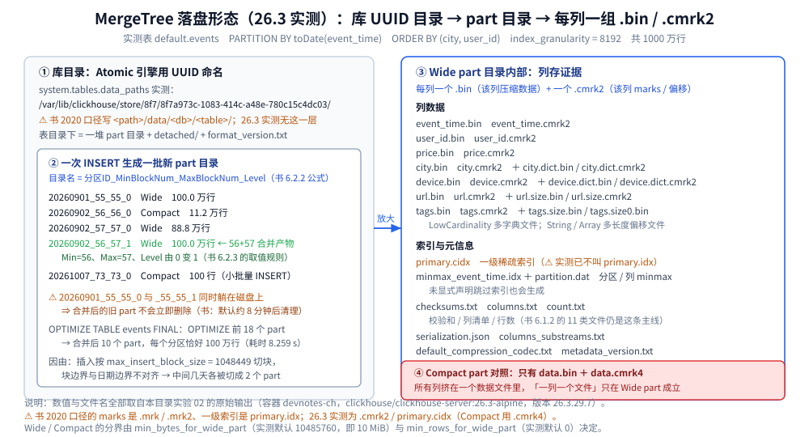
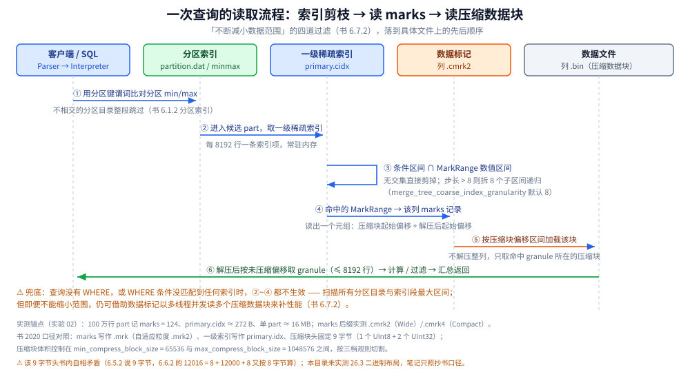

# 架构与存储引擎

> 素材来源：《ClickHouse原理解析与应用实践》（朱凯，机械工业出版社 2020 年）第 2 章「ClickHouse 架构概述」、
> 第 6 章「MergeTree 原理解析」、第 7 章「MergeTree 系列表引擎」的读后整理，**按主题归纳而非逐字摘录**；
> 其余整理自个人学习笔记与官方文档，素材见 [素材清单](../../../../素材清单.md)。
>
> ⚠️ 书为 **2020 年**（全书基于 **19.17.4.11** 编写，演示环境 CentOS 7.7），本目录的容器实测为 **26.3.29.7**
> （`clickhouse/clickhouse-server:26.3-alpine`，容器名 `devnotes-ch`，时区 UTC，4 核）。
> 第 6 章的**表 6-1 与全部配图（图 6-1 ~ 图 6-24）在 PDF 抽取时丢失**，文中只说文字能支撑的部分；
> 凡书与 26.3 不一致处**逐处标注「书 2020 口径 vs 26.3 实测」**。

---

## 一、一条 SQL 从输入到结果，要经过哪些模块？

**本节要点**：先记住链路（Parser → Interpreter → 执行管道 → IStorage → Block 流），再记每个模块只管一件事；这条链是理解「为什么它的优化能落到列上」的前提。

### 1.1 模块链（书 2.2 节）

书 2.2 节明确「公开资料匮乏，作者从零散材料拼出」这条链；第 2 章的架构模块图在 PDF 抽取时丢失，下图按文字重绘：

```text
SQL 文本
  ↓  Parser（递归下降解析）
AST 语法树
  ↓  Interpreter（解析 AST、分支判断、设置参数、调用接口）
查询执行管道（Pipeline，以线程形式建立）
  ↕  IStorage（表引擎子类：按 AST 指示返回指定列的原始数据）
Block 流（IBlockInputStream 读取 / IBlockOutputStream 输出）
  ↓  后续加工、计算、过滤
ResultSet → 客户端
```

### 1.2 每个模块只管一件事

| 模块 | 职责（书 2.2 节口径） |
|---|---|
| **Column / Field** | Column 是整列的内存对象（接口 `IColumn`，定义 `insertRangeFrom` / `insertFrom`、`cut` 分页、`filter` 过滤；实现类随类型分）；Field 代表**一个单值**（单列中的一行），用**聚合的设计模式**，内部聚合了 Null、UInt64、String、Array 等 **13 种**数据类型。**大多数场合以整列方式操作数据** |
| **DataType** | 负责序列化 / 反序列化，方法**成对出现**（`serializeBinary` / `deserializeBinary` 等），接口 `IDataType`，用**泛化**设计模式。⚠️ **它不直接负责数据读取** —— 读由 Column 或 Field 完成（`DataTypeString` 引用 `ColumnString`） |
| **Block** | 可以看作**数据表的子集**，本质是「Column + DataType + 列名称字符串」三元组；通过 `ColumnWithTypeAndName` 间接引用 |
| **Block 流** | 两组顶层接口：`IBlockInputStream`（读取与关系运算）与 `IBlockOutputStream`（输出到下一环节）；各类数据操作最终都转成某一种流的实现 |
| **IStorage（表）** | **底层没有所谓的 Table 对象**，直接用 `IStorage` 指代数据表；定义 DDL（`ALTER` / `RENAME` / `OPTIMIZE` / `DROP`）与 `read`、`write`。按 AST 指示返回**指定列的原始数据**，加工 / 计算 / 过滤统一交给 Interpreter |
| **Parser / Interpreter** | Parser 用**递归下降**把一条 SQL 解析成 AST（不同语句走不同实现类）；Interpreter 像 **Service 层**：解析 AST → 分支判断、设置参数、调用接口 → 返回 IBlock 对象，并以线程形式建立查询执行管道 |
| **Functions** | 普通函数由 `IFunction` 定义、**无状态**，但**执行时不会一行一行算，而是向量化地作用于一整列**；聚合函数由 `IAggregateFunction` 定义、**有状态**（如 Count 用 UInt64 记状态），且**状态支持序列化** → 可在分布式节点间传输实现**增量计算** |

### 1.3 集群与分片：书点名的「最容易栽跟头之处」

书 2.2.7 节的四条口径：**① ClickHouse 的 1 个节点只能拥有 1 个分片** → 要「1 分片 1 副本」至少需部署 2 个服务节点；**② 分片只是逻辑概念、物理承载由副本承担** → 「1 shard + 1 replica」实际只有 1 个物理副本（正确语义是 1 分片 0 副本），真正表达 1 分片 1 副本要写成 1 个 shard 下 **2 个 replica 块**；**③ 分片数量上限取决于节点数量**（1 个分片只对应 1 个服务节点）；**④ Elasticsearch「5 分片 + 副本基数 1 = 共 10 个分片」的直觉不能套到 ClickHouse 上**。

本地表（Local Table）等同一份数据的分片；**分布式表（Distributed Table）本身不存储任何数据**，是本地表的访问代理，作用类似分库中间件。书的评价是「一辆手动挡赛车，将所有的选择权都交到了使用者手中」。⚠️ 上述是书 2.2.7 的集群口径；本批实验是单机容器，**未实测**集群与副本行为。

### 1.4 实测参数锚点（26.3，用于后面的推算）

| 参数 | 26.3 实测默认 | 与书的关系 |
|---|---|---|
| `max_threads` | `'auto(4)'`，本机 4 核解析为 **4** | 书未给该默认值 |
| `max_memory_usage` | **0**（不施加查询级上限，容器 cgroup 未设上限） | 书未给 |
| `max_block_size` | **65409** | 书未给；注意不是常被误传的 65536 |
| `max_insert_block_size` | **1048449** | 书未给；它直接决定了实测里的 parts 数量（见第四节） |
| `index_granularity` | **8192** | 书 6.3 节称「8192 是一个神奇的数字」，并建议通常无需修改 |
| `index_granularity_bytes` | **10485760**（10 MiB） | 书 6.1.1 写默认 10M，一致 |
| `min_bytes_for_wide_part` | **10485760**（10 MiB） | 书完全未提 —— 书里还没有 compact part 这个概念（见 3.4） |

## 二、它为什么这么快？（书 2.3 节的五条）

**本节要点**：书这一节讲的不是某一项技术，而是**设计方法论**；五条合起来才能解释「同样的硬件，为什么它能快一个量级」。

- **着眼硬件，先想后做**：设计伊始先想清四问 —— 用什么硬件（CPU / 内存 / 硬盘 / 网络）、要达到什么性能（延迟 / 吞吐）、用什么数据结构（String / HashTable / Vector）、这些结构在该硬件上会如何工作；想清后**动手实现功能之前就已经能算出粗略的性能**。基于「硬件功效最大化」，它在**内存中做 GROUP BY 并用 HashTable 装载数据**，且非常在意 **CPU L3 级缓存**。书的量化：从**寄存器**访问比从**内存**快 **300 倍**、比从**磁盘**快 **3000 万倍**；一次 **L3 缓存失效**带来 **70~100ns** 延迟 —— 单核相当于浪费 **4000 万次/秒**运算，32 线程 CPU 上可能浪费 **5 亿次/秒**。
- **算法在前，抽象在后**：字符串搜索上，`Handbook of Exact String Matching Algorithms` 里的 **35 种**常见算法**一个都没用**（性能不够快）；最终常量走 **Volnitsky 算法**、非常量走 **SIMD** 暴力优化、正则走 **re2 与 hyperscan**。**性能是算法选择的首要指标**。
- **勇于尝鲜，不行就换 / 特定场景特殊优化**：新算法立刻验证，好用就留、不行就换。去重计数 `uniqCombined` 按数据量三档切换 —— **较小 Array、中等 HashSet、很大 HyperLogLog**（书未给阈值）；代码生成做循环展开；SIMD 广泛用于文本转换、数据过滤、解压、JSON 转换。
- **持续测试，持续改进**：Yandex 的天然优势是**经常用真实数据测试**；月更发版 → 依赖可靠的**持续集成环境**。

⭐ 书的结论：黑魔法**不是一项单一技术**，而是**一种自底向上、追求极致性能的设计思路**；第 2 章小结把撒手锏归为三件 —— **列式存储、向量化执行引擎、表引擎**。

⚠️ 版本差异：书 2.1.3 说当时靠 **SSE4.2** 指令集实现向量化，而 26.3 实测 `system.build_options` 里 `USE_SSE42` / `USE_AVX` / `USE_AVX2` / `USE_AVX512` / `USE_BMI` 这些键**一个都不存在** → 当前向量化基线**不能凭书断言**（详见 [定位与适用场景.md](定位与适用场景.md) 1.4）。书里「基准扫描 **1.75 亿次/秒**」属 2020 年口径，不作现状引用。

## 三、MergeTree 的数据在磁盘上长什么样？

**本节要点**：这是全书最核心的一章（书的推荐序与前言都点名「强烈建议所有读者阅读第 6 章」），也是本仓库做实测的第一落点：**一批不可变的数据片段（part）如何在磁盘上被组织成能被极速定位的结构**。

### 3.1 三层级结构与文件清单（书 6.1.2 节）

磁盘上的物理结构分 **3 个层级**：**数据表目录 → 分区目录 → 各分区下具体的数据文件**。

| 文件 / 目录 | 格式（书） | 用途（书 6.1.2 口径） |
|---|---|---|
| `partition` 目录 | — | 同分区最终合并到同一目录，**不同分区的数据永远不会被合并在一起** |
| `checksums.txt` | 二进制 | 保存其余各类文件的 size 及 size 的哈希值，用于快速校验完整性与正确性 |
| `columns.txt` | 明文 | 列信息文件（`columns format version: 1` + `4 columns:` + 逐列 `'ID' String`） |
| `count.txt` | 明文 | 当前分区目录下数据的总行数 |
| `primary.idx` | 二进制 | **一级索引文件**；**一张 MergeTree 表只能声明一次一级索引**（靠 ORDER BY 或 PRIMARY KEY） |
| `[Column].bin` | 压缩（书：默认 LZ4） | 数据文件；**每个列字段都有独立的 .bin，以列字段名命名** |
| `[Column].mrk` | 二进制 | 标记文件，保存 .bin 中数据的偏移量；**与稀疏索引对齐、与 .bin 一一对应**，把 primary.idx 与 .bin 建立映射 |
| `[Column].mrk2` | 二进制 | 若用了**自适应大小的索引间隔**，标记文件改以 `.mrk2` 命名，作用与 .mrk 相同 |
| `partition.dat` + `minmax_[Column].idx` | 二进制 | 使用分区键时额外生成：前者存**分区表达式最终生成的值**，后者记录**分区字段原始数据的最小 / 最大值** |
| `skp_idx_[Column].idx` + `skp_idx_[Column].mrk` | 二进制 | 声明了**二级索引**（跳数索引）时额外生成 |

分区索引的实例（书）：`PARTITION BY toYYYYMM(EventTime)`、原始值 `2019-05-01` 与 `2019-05-05` → `partition.dat` 存 **`2019-05`**、minmax 索引存 **`2019-05-01` + `2019-05-05`**；作用就是查询时**快速跳过不必要的数据分区目录**。

⚠️ 书 6.2 节的**表 6-1（分区 ID 示例表）表体全部抽取缺失**，表中内容不可用；书中**图 6-1 ~ 图 6-24 共 24 张配图也全部丢失**，本节与第五、七节的示意均按文字重建。

### 3.2 实测：库目录的形态与书的口径不同

- 书 3.1.2 / 第 4 章给的路径形态是 `<path>/data/<db>/<table>/<partition>/`（书内本身就有 `/chbase/data/default/...` 与 `/chbase/data/data/default/...` 两种写法，差一层 `data/`）。
- 26.3 实测：`default` 库是 **Atomic 引擎**，`system.tables.data_paths` 返回 `['/var/lib/clickhouse/store/8f7/8f7a973c-1083-414c-a48e-780c15c4dc03/']`；而 `/var/lib/clickhouse/data/default/` **不存在**（`ls` 直接报 `No such file or directory`）；表目录下只有**一堆 part 目录 + `detached/` + `format_version.txt`**。
- ⭐ 结论：书 2020 口径的「库名 / 表名」两级目录，在 26.3 实测里换成了 **UUID 命名的 store 目录**；写脚本按路径找数据必须先查 `system.tables.data_paths`，不能按书里的路径去拼。

### 3.3 实测：Wide part 内部就是「每列一个 .bin + 一个 marks 文件」

实测表 `default.events`（`PARTITION BY toDate(event_time)`、`ORDER BY (city, user_id)`、`index_granularity = 8192`，共 1000 万行）。一个 **Wide** part 目录 `20260901_55_55_1` 里列出的文件：

```text
checksums.txt            count.txt                metadata_version.txt
columns.txt              partition.dat            serialization.json
columns_substreams.txt   minmax_event_time.idx    default_compression_codec.txt
primary.cidx

event_time.bin  event_time.cmrk2              user_id.bin  user_id.cmrk2
price.bin       price.cmrk2                   city.bin     city.cmrk2  city.dict.bin  city.dict.cmrk2
url.bin         url.cmrk2  url.size.bin  url.size.cmrk2        device.bin  device.cmrk2  device.dict.bin  device.dict.cmrk2
tags.bin        tags.cmrk2  tags.size.bin  tags.size0.bin  tags.size.cmrk2  tags.size0.cmrk2
```

⭐ 三条与书对照后必须记住的实测事实：

1. **marks 文件后缀实测是 `.cmrk2`**（书 2020 口径写作 `.mrk`，自适应粒度时 `.mrk2`）；Compact part 里则是 **`.cmrk4`**。书里没有 `c` 前缀这一族命名，两者对应关系本批未在源码层核实。
2. **一级索引文件名实测是 `primary.cidx`**（书写作 `primary.idx`）。
3. 多出几类书里没有的辅助文件：`columns_substreams.txt`、`default_compression_codec.txt`、`metadata_version.txt`、`serialization.json`；变长列的 `url.size.bin` 与 `LowCardinality` 列的 `city.dict.bin` / `city.dict.cmrk2` 也是书里没提的。⚠️ `minmax_event_time.idx` 与 `partition.dat` 在**没有显式声明跳数索引**时也会出现 —— 它们属分区级索引，不是二级索引（二级索引会另生成 `skp_idx_*` 文件）。

### 3.4 实测：Compact part —— 书完全未提的另一种形态

同样一张表，小批量写入会产生 **Compact** part：

```text
INSERT INTO events SELECT now() + number, number, '北京', 'iOS', '/x', 1.23, ['new'] FROM numbers(100)
→ 20261007_73_73_0　Compact　100 行　1722 字节
→ 目录里只有：checksums.txt / columns.txt / columns_substreams.txt / count.txt /
             data.bin / data.cmrk4 / partition.dat / primary.cidx / serialization.json / …
```

- **Wide part 是「每列一个 .bin」，Compact part 是「所有列挤在一个 `data.bin`」** —— 所以「一个列一个文件」这条常识**只在 Wide part 成立**；触发条件是 `min_bytes_for_wide_part`（实测默认 **10485760**，即 10 MiB）与 `min_rows_for_wide_part`（实测默认 **0**）。
- 同一次写入里两种形态可以并存，实测证据：`20260902_56_56_0`（1.94 MB）是 **Compact**，而同一分区的 `20260902_57_57_0`（14.3 MB）是 **Wide**。



上图怎么读：左列是**库级 UUID 目录**与它下面的 part 目录清单，右列是同一个 Wide part 里逐列成组的文件清单；红框标出 Compact part，用来对照「一列一个文件」这条常识**只在 Wide part 成立**。

## 四、分区目录怎么命名、又怎么被合并？

**本节要点**：分区（往哪儿放）与目录名（怎么编号）是两件事；目录名的三段编号里，**BlockNum 是整表自增的批次号、Level 是分区自己的合并年龄**，两者都不是压缩数据块的概念。

### 4.1 分区不是分片

书明确强调：**数据分区（partition）≠ 数据分片（shard）**。分区是对**本地数据**的**纵向切分**，**MergeTree 并不能靠分区把一张表的数据分布到多个节点**；横向切分是分片的能力。

### 4.2 分区 ID 的四种生成规则

1. **不指定分区键** → 分区 ID 默认取名 **`all`**，所有数据写入这个 all 分区；
2. **整型**（兼容 UInt64）且**无法**转换为 YYYYMMDD 格式 → 直接按**该整型的字符形式**输出；
3. **日期类型**，或**能转换为 YYYYMMDD 格式的整型** → 按 **YYYYMMDD** 格式化后输出；
4. **其他类型**（String、Float 等）→ 通过 **128 位 Hash 算法**取 Hash 值作为分区 ID。

多字段分区用**元组**，多个 ID 之间用 **`-`** 依次拼接，例如 `PARTITION BY (length(Code), EventTime)` → 分区 ID 形如 `2-20190501`、`2-20190611`。

### 4.3 目录名 = `PartitionID_MinBlockNum_MaxBlockNum_Level`

例：`201905_1_1_0`。

| 段 | 含义（书 6.2.2 / 6.2.3 口径） |
|---|---|
| `PartitionID` | 上面按四种规则生成的分区 ID |
| `MinBlockNum` / `MaxBlockNum` | **最小 / 最大数据块编号**。⚠️ 书特别提示：它极易与「压缩数据块」混淆，但**本质毫无关系** —— 这里的 BlockNum 是**整型自增长编号**，**在单张表内全局累加、n 从 1 开始**，每新建一个分区目录 n 就 +1；对新目录 **MinBlockNum 与 MaxBlockNum 取值相同** |
| `Level` | **合并的层级**（分区的「年龄」）。**不是全局累加** —— 每个新目录初始为 **0**，之后**以分区为单位**，同分区发生合并就 **+1** |

合并时三项取值：`MinBlockNum` 取同分区内**最小的**、`MaxBlockNum` 取**最大的**、`Level` 取同分区内**最大 Level 并 +1**。例如 `201905_1_1_0` + `201905_2_2_0` → **`201905_1_2_1`**。

⚠️ **书内自相矛盾**：6.2.2 节说 BlockNum「n 从 1 开始」并举例 `201905_1_1_0`，而 6.2.3 节同一处又写三个目录的编号是 `0_0`、`1_1`、`2_2` —— **照抄保留，落地以实测目录名为准**（26.3 实测的第一个 part 是 `..._55_55_0` 这种形态，编号段非 0 起，Level 段为 0）。

### 4.4 目录的生命周期：写入时创建、每批一个、事后合并、延迟删除

1. 分区目录**不是建表就存在**，而是**数据写入过程中被创建** —— 表里没有数据就没有任何分区目录；伴随**每一批数据的写入（一次 INSERT）**都生成一批新分区目录，**即便不同批次属于相同分区，也生成不同的目录** → 同一分区会有多个目录；
2. **写入后 10~15 分钟**（或手动 `optimize`）由后台任务把**属于相同分区的多个目录合并成一个新目录**；**旧分区目录不会立即删除**，而是在之后的某个时刻被后台任务删除（**默认 8 分钟**）；旧目录**不再是激活状态（active = 0），查询时会被自动过滤掉**。

### 4.5 实测对照（26.3）

- 建表后一次 `INSERT ... SELECT` 造 10 天数据，**OPTIMIZE 前有 18 个 part**，而不是直觉上的「10 天 = 10 分区 = 10 parts」。原因：插入按 `max_insert_block_size`（实测默认 **1048449**）切块，**块边界与日期边界不对齐** → 中间 8 天各被切成 2 个 part（实测 `2026-09-02` 分区下同时有 `20260902_56_56_0` 与 `20260902_57_57_0`）。`OPTIMIZE TABLE events FINAL` 用 **8.259 s** 合并后变成 **10 个 part**，每个分区恰好 1,000,000 行。
- 合并产物命名符合书的规则：`20260902_56_56_0` + `20260902_57_57_0` → **`20260902_56_57_1`**（Min 取 56、Max 取 57、Level 由 0 变 1）。
- ⭐ **旧 part 与合并产物并存**：磁盘上同时躺着 `20260901_55_55_0` 与 `20260901_55_55_1` —— 这是书「旧目录不立即删除、靠 active 过滤」那条的现场证据。分区 ID 的显示形式不同：`system.parts.partition` 显示为 `2026-09-01`，而**目录名里是 `20260901`**（对应书 4.2 规则 3：日期类型按 YYYYMMDD 输出）。
- ⚠️ 书的「10~15 分钟自动合并」与「旧目录默认 8 分钟后删除」是 2020 口径，本次是**手动 `OPTIMIZE ... FINAL` 立即合并**，不能用来验证这两个默认值。

## 五、一级稀疏索引是怎么定位数据的？

**本节要点**：索引的全部威力来自一个前提 —— **数据在 part 内按排序键有序**；有了有序，才可能用「每 8192 行记一条」的稀疏索引去覆盖海量数据。

### 5.1 稀疏索引 vs 稠密索引

- 主键用 `PRIMARY KEY` 定义；**不写 PRIMARY KEY 时默认与 ORDER BY 相同**。定义后按 **index_granularity 间隔（默认 8192 行）** 生成一级索引，**索引数据按 PRIMARY KEY 排序**；更常见的简化写法是**用 `ORDER BY` 指代主键** —— 此时索引与数据的排序规则完全一致。
- **稀疏索引**中每一行索引标记对应的**是一段数据而非一行**（稠密索引才是一对一）。书的比喻：MergeTree 像一本书，**稀疏索引就是这本书的一级章节目录** —— 不具体对应每个字的位置，只记录**每个章节的起始页码**。
- 收益量化：**以默认粒度 8192 为例，MergeTree 只需要 12208 行索引标记就能为 1 亿行数据提供索引**；因为占用极小，**一级索引常驻内存**。⚠️ 书特别提醒：**MergeTree 主键允许存在重复数据**（去重是 ReplacingMergeTree 的事，见第九节）。

### 5.2 索引粒度 `index_granularity` 同时作用于三处文件

`index_granularity`（书称「非常重要」的参数）像一把标尺，把数据标记成多个小段，**每段最多 8192 行**；MergeTree 用 **MarkRange** 表示一个具体区间（用 **start 与 end** 表示范围）。

⚠️ 关键联动：`index_granularity` 虽取「索引」之名，**但不只作用于一级索引，同时影响数据标记和数据文件** —— 它自己无法完成查询，**必须借数据标记才能定位数据**，因此**一级索引与数据标记的间隔粒度相同、彼此对齐**（同为 index_granularity 行），而数据文件也按同一粒度生成压缩数据块。

### 5.3 索引数据怎么生成

间隔 index_granularity 行才生成一条索引记录，索引值依据声明的主键字段获取。书给的 hits_v1 实例（`PARTITION BY toYYYYMM(EventDate)`、`ORDER BY CounterID`）：第 0 行 CounterID = **57**、第 8192 行 = **1635**、第 16384 行 = **3266** → 索引数据为 **`5716353266`**。书对此评价：索引值前后相连、按主键字段顺序紧密排列，「使用位读取替代专门的标志位或状态码，不浪费哪怕一个字节」。多主键 `ORDER BY (CounterID, EventDate)` 时，每 8192 行同时取两列的值作为索引值。

### 5.4 一次条件查询的剪枝过程 = 两个数值区间的交集判断

一个区间是**由查询条件转换而来的条件区间**，另一个是**与 MarkRange 对应的数值区间**。分 3 步：

1. **生成查询条件区间** —— 即便单值条件也会被转成区间：

```text
WHERE ID = 'A003'       →  ['A003', 'A003']
WHERE ID > 'A000'       →  ('A000', +inf)
WHERE ID < 'A188'       →  (-inf, 'A188')
WHERE ID LIKE 'A006%'   →  ['A006', 'A007')
```

2. **递归交集判断** —— 从最大的区间开始递归：**无交集**则直接剪掉整段 MarkRange；**有交集且 MarkRange 步长大于 8** 则把区间**进一步拆分成 8 个子区间**（由 `merge_tree_coarse_index_granularity` 指定，默认 **8**）继续递归；**有交集且不可再分解（步长小于 8）**则记录 MarkRange 并返回。
3. **合并 MarkRange 区间** —— 把最终匹配的 MarkRange 聚在一起、合并它们的范围。

书给的示例：192 行数据、`index_granularity = 3` → 划分成 **192 / 3 = 64 个 MarkRange**，相邻步长为 1；查 `WHERE ID='A003'` 最终**只需读 `[A000,A003]` 与 `[A003,A006]` 两个区间**，对应 **MarkRange(start:0, end:2)**。书提示：**因为 MarkRange 转换的数值区间是闭区间，所以会额外匹配到临近的一个区间**。

### 5.5 实测对照（26.3）

- `index_granularity` 默认 **8192**、`index_granularity_bytes` 默认 **10485760**、`enable_mixed_granularity_parts` 默认 **1**（自适应粒度开启）—— 与书 6.1.1 的口径一致。
- 每个 **100 万行**的 part 报告 **marks = 124**，一级索引文件 `primary.cidx` 体积约 **272 B**；按行数 ÷ 8192 推算至少 123 个 granule，可见索引文件确实是「少量标记覆盖大量数据」的量级（书：12208 行标记覆盖 1 亿行）。⚠️ marks 与 granule 的精确换算（是否含末尾边界标记）本批**未在源码层核实**；`merge_tree_coarse_index_granularity` 默认 8 属书 2020 口径，本次实测**未查该参数**。

## 六、二级索引（跳数索引）有哪几种？

**本节要点**：二级索引由**数据的聚合信息**构建，目标与一级索引相同 —— 减少扫描范围；它**默认关闭**，而最容易混的是它的 `granularity` 与数据粒度的 `index_granularity` 不是一回事。

### 6.1 `granularity` 与 `index_granularity` 的区别

**`index_granularity` 定义数据的粒度（默认 8192 行）；`granularity` 定义聚合信息汇总的粒度** —— 换言之，**`granularity` 定义了一行跳数索引能够跳过多少个 `index_granularity` 区间的数据**。

生成规则（书 6.4.2 口径）：① 按 index_granularity 粒度把数据划分成 n 段，共 `[0, n-1]` 个区间（`n = total_rows / index_granularity`，**向上取整**）；② 从 0 区间开始，依次按 index_granularity 粒度取聚合信息，**每次向前移动 1 步**，聚合信息逐步累加；③ 当**移动 granularity 次区间**时，**汇总并生成一行跳数索引数据**。书的 minmax 示例：`index_granularity = 8192`、`granularity = 3` → 取到第 3 个区间时生成第一行 minmax 索引，前 3 段极值汇总取值为 **[1,9]**。

### 6.2 四种类型

定义语法写在建表语句内：**`INDEX index_name expr TYPE index_type(...) GRANULARITY granularity`**；声明后额外生成 `skp_idx_[Column].idx` 与 `skp_idx_[Column].mrk`；一张表可同时声明多个。

| 类型 | 聚合信息 | 参数与约束（书 2020 口径） |
|---|---|---|
| `minmax` | 一段数据内的**最小和最大极值** | 作用类似分区目录的 minmax 索引，能快速跳过无用数据区间 |
| `set` | 直接记录声明字段或表达式的**取值（唯一值，无重复）** | 完整形式 `set(max_rows)`；`max_rows` 是「一个 index_granularity 内索引最多记录的数据行数」，**`max_rows = 0` 表示无限制** |
| `ngrambf_v1` | 数据**短语的布隆表过滤器** | 完整形式 `ngrambf_v1(n, size_of_bloom_filter_in_bytes, number_of_hash_functions, random_seed)`；**只支持 String 与 FixedString**；**只能提升 in、notIn、like、equals、notEquals 的性能**；`n` = token 长度 |
| `tokenbf_v1` | 布隆过滤器（ngrambf_v1 的变种） | 完整形式 `tokenbf_v1(size_of_bloom_filter_in_bytes, number_of_hash_functions, random_seed)`；除短语 token 的处理方法外与 ngrambf_v1 完全一样；**自动按非字符、数字的字符串分割 token** |

⚠️ 书里二级索引**默认关闭**，需 `SET allow_experimental_data_skipping_indices = 1` —— 书的括注已说明**「该参数在新版本中已被取消」**；26.3 是否已完全不需要该开关、跳数索引类型是否扩容（如是否新增通用 `bloom_filter`），本批未实测。另：书中 `set` 的参数在正文写 `set(100)`、在建表示例里写 `set(2)`，**书内不一致**，此处照抄不改。布隆过滤器本身的形态与代价见 [位图与布隆过滤器.md](../../../../02-计算机基础/数据结构/高级数据结构/位图与布隆过滤器.md)。

## 七、数据标记与压缩数据块：索引怎么落到具体字节

**本节要点**：这一节回答「索引说『读第 3 个区间』，到底怎么变成几次磁盘读」—— 答案是 `.bin` 内部的**压缩数据块** + marks 文件里的**两个偏移量**。

### 7.1 各列独立存储与写入前的三步处理

- **各列独立存储**：每个列字段对应一个 `.bin`；数据文件以分区目录组织，所以 .bin 里只保存**当前分区片段**内的数据。两大优势（书原文）：**① 更好地进行数据压缩**（相同类型的数据放在一起，对压缩更友好）；**② 最小化数据扫描的范围**。写入 `.bin` 前的三步「精心设计」：**① 数据经过压缩**（书列了 **LZ4、ZSTD、Multiple、Delta** 几种算法，**默认 LZ4**）；**② 数据事先依照 ORDER BY 声明排序**；**③ 数据以压缩数据块的形式组织并写入**。

### 7.2 压缩数据块：9 字节头 + 64KB~1MB 的切割

- 结构 = **头信息 + 压缩数据**；**头信息书称固定 9 字节**（1 个 UInt8 + 2 个 UInt32），分别代表**压缩算法类型、压缩后的数据大小、压缩前的数据大小**，公式为 `CompressionMethod_CompressedSize_UncompressedSize`。体积被严格控制在 **64KB ~ 1MB**，上下限由 **`min_compress_block_size`（默认 65536）** 与 **`max_compress_block_size`（默认 1048576）** 指定。
- 切割三规则（设一批 = index_granularity 行的未压缩大小为 size）：**size < 64KB** → 继续累积到 ≥ 64KB 再生成；**64KB ≤ size ≤ 1MB** → 直接生成；**size > 1MB** → 先按 1MB 截断生成一个块，剩余数据继续按规则执行（于是**一批数据可能生成多个压缩块**）。
- 引入压缩块的两个目的：① 压缩能减少体量、加速传输，**但压缩 / 解压本身有性能损耗**，需要**在损耗与压缩率之间寻求平衡**；② 读取 .bin 时要先把压缩数据加载进内存再解压，有了压缩块就能**把读取粒度降到压缩块级别**，不必读整个文件。可用 **`clickhouse-compressor --stat`** 查看某 .bin 的压缩块统计（书提示：输出顺序与物理存储顺序刚好相反）；多个压缩块之间按写入顺序**首尾相接、紧密排列**。

### 7.3 数据标记（marks）记录哪两个偏移量

书的比喻：**primary.idx 是一级章节目录，.bin 里的数据是书中文字，marks 文件为二者建立关联** —— 它记录两点信息：**① 一级章节对应的页码（压缩数据块的起始偏移量）；② 一段文字在某一页中的起始位置**（即**解压后未压缩数据的起始偏移量**）。

生成规则三条：**① 数据标记与索引区间对齐**（同为 index_granularity 粒度）→ 靠索引区间的下标编号就能直接找到对应标记；**② 标记文件与 .bin 一一对应**（每列一个）；**③ 一行标记用一个元组表示，元组内是两个整型偏移量**。⚠️ **marks 文件不能常驻内存，使用 LRU（最近最少使用）缓存策略** —— 这与一级索引常驻内存形成对比。

### 7.4 工作方式：读压缩块用偏移量一，读数据用偏移量二

1. **读取压缩数据块**：无须一次性加载整个 .bin，按需只加载特定压缩块 —— 靠标记里的**压缩文件偏移量**。取法是「**上下相邻两个压缩块的起始偏移量构成当前标记对应的偏移量区间**；由当前标记向下寻找，直到找到不同的压缩文件偏移量为止」。书的示例：读 .bin 中 **`[0, 12016]`** 字节即取得第 0 个压缩块。
2. **读取数据**：读解压后数据时**也不一次性扫描整段**，可按 index_granularity 粒度加载特定一小段 —— 靠标记里的**解压数据块偏移量**。书的示例：通过 **`[0, 8192]`** 读取压缩块 0 中的第一个数据片段。

⚠️ 书内自相矛盾（**照抄保留**）：6.5.2 说头信息固定 **9 字节**，但 6.6.2 算偏移量时写「压缩后大小为 8 个字节，所以 **12016 = 8 + 12000 + 8**」—— 该等式按 8 字节头计算，与 9 字节头不符。本目录**未对 26.3 的二进制布局做实测**，故不更正、也不下结论。

### 7.5 标记与压缩块的三种对应关系

判据是**一个 index_granularity 间隔内数据的实际字节大小**（示例均取自书的 hits_v1，`index_granularity = 8192`，数据总量 8873898 行）：

| 关系 | 触发条件（一个间隔内未压缩 size） | 书里的实例 |
|---|---|---|
| **多对一** | size < 64KB | **JavaEnable**（UInt8，1 字节）→ 一个间隔 8192 B → **每 8 个标记对应同一个压缩块**（65536 / 8192 = 8） |
| **一对一** | 64KB ≤ size ≤ 1MB | **URLHash**（UInt64，8 字节）→ 一个间隔 `8192 × 8 = 65536 B`，**恰好等于 64KB** → 一对一 |
| **一对多** | size > 1MB | **URL**（String，大小按内容而定）→ **编号 45 的标记对应了 2 个压缩块** |

⭐ 这张表的用处：它解释了为什么「列的类型」会影响扫描代价 —— 定长小字段（UInt8）一个压缩块装得下 8 个 granule，而长字符串列一个 granule 就撑出多个块，读取时要多做好几次解压。

## 八、写入与查询的全过程

**本节要点**：写入是「先造目录、再按粒度造索引 / 标记 / 压缩块」；查询是**一个不断减小数据范围的过程**，四道过滤依次生效 —— 但书明确给出了**过滤器全部失效**时的兜底行为。

### 8.1 写入过程

1. **生成分区目录** —— 每批数据都生成一个新的分区目录；后续某个时刻，**同分区的目录按规则合并**；按 `index_granularity` 粒度分别生成 **一级索引**（声明了二级索引还会创建二级索引文件）、**每个列字段的 marks 数据标记**与**每列的 `.bin` 压缩数据文件**。
2. 书的目录解读法：`201403_1_34_3` 表示**该分区数据共分 34 批写入、期间发生过 3 次合并**；写入过程中**索引与标记区间是对齐的**，而**标记与压缩块**根据区间内数据大小会生成多对一、一对一、一对多三种关系。

### 8.2 查询过程：四道过滤 + 一个兜底

最理想情况下**依次借助分区索引 → 一级索引 → 二级索引**把扫描范围缩至最小，**再借助数据标记**把需要解压与计算的数据范围缩至最小。

⚠️ **反例（书明确点出）**：若查询**没有指定任何 WHERE 条件**，或 **WHERE 条件没有匹配到任何索引**（分区索引、一级索引、二级索引），则 MergeTree **不能预先减小数据范围** —— 后续查询会**扫描所有分区目录以及目录内索引段的最大区间**。**但即便不能减少范围，仍能借助数据标记以多线程的形式同时读取多个压缩数据块以提升性能。**



上图怎么读：从左到右依次是**分区索引剪枝 → 一级稀疏索引命中 MarkRange → 用 marks 的偏移量读压缩块 → 解压出需要的那段数据**，每一步都把要读的字节数再收窄一次。

## 九、MergeTree 家族：七种引擎各自解决什么问题？

**本节要点**：整章心法一句话 —— 变种引擎的所有特殊逻辑**都只在触发合并（Merge）的过程中被激活**，且它们**统一用 `ORDER BY` 排序键作为「条件 Key / 唯一键」**。所以读每个变种只问三件事：**解决什么问题 → 用哪个字段判定 → 为什么只能在合并时生效**。

### 9.1 前提：只有合并树系列独有这四项能力

书 6 章开篇与 7 章开篇的口径：ClickHouse 表引擎分 **6 个系列**（合并树 / 外部存储 / 内存 / 文件 / 接口 / 其他），**只有合并树（MergeTree）系列支持主键索引、数据分区、数据副本、数据采样，也只有它支持 ALTER 相关操作**。

### 9.2 五个变种各解决什么问题

| 引擎 | 解决什么问题 | 判定依据（书 7 章口径） | 必须记住的边界 |
|---|---|---|---|
| `MergeTree` | 基础引擎（本篇第三~八节全在讲它） | PRIMARY KEY / ORDER BY | 主键**允许重复**；主键与聚合条件可分离 |
| `ReplacingMergeTree(ver)` | **去重**：MergeTree 主键没有唯一约束，某些场合不希望表内重复 | 合并时按 **ORDER BY**（不是 PRIMARY KEY）分组删重复 | **只删同一分区内**的重复；未设 `ver` 保留最后一行，设了 `ver`（UInt* / Date / DateTime）保留 **ver 最大**的一行 |
| `SummingMergeTree((col1,col2,…))` | **预聚合**：终端用户只查汇总结果、汇总条件预先明确 | 合并时按 ORDER BY 分组，把同组多行 **SUM** 成一行 | 指定 columns 则只 SUM 这些列，不指定则 SUM 所有**非主键数值列**；**非汇总字段取同组第一行的取值**；**跨分区不汇总** |
| `AggregatingMergeTree()` | **可编程的预聚合**：SummingMergeTree 的升级版，聚合方式不再限于 SUM | 用 `AggregateFunction` 数据类型声明「聚合函数 + 字段」 | 写入用 `*State` 函数、查询用 `*Merge` 函数；**主流用法是当物化视图的表引擎**（底表 MergeTree + 视图 AggregatingMergeTree） |
| `CollapsingMergeTree(sign)` | **以增代删的行级改删**：改源文件对分析库太贵，宁愿把改删转换成新增 | 合并时把同分区内 `sign=1` 与 `sign=-1`（Int8）的一组抵消 | ⚠️ **最大命门是对写入顺序有严格要求**（`sign=1` 与 `-1` 必须相邻）；折叠不可实时触发，删改在合并前仍看得到旧数据 |
| `VersionedCollapsingMergeTree(sign,ver)` | 与上一个作用完全相同，但**对写入顺序没有要求** | 定义 `ver`（UInt8）后，它**自动把 `ver` 追加到 ORDER BY 末端**（分区内按 `ORDER BY id, ver DESC` 排序） | 多线程写入不保障顺序时用这个版本；折叠规则与上面一致 |

`CollapsingMergeTree` 的 5 条折叠规则（书原文）择要：`sign=1` 比 `sign=-1` 多一行 → 保留最后一行 `sign=1`；`-1` 比 `1` 多一行 → 保留第一行 `sign=-1`；两者行数相同且最后一行是 `sign=1` → 保留第一行 `-1` 与最后一行 `1`；**其余情况会打印警告日志但不报错，查询结果不可预知**。它的查询改写套路是 `SUM(code * sign)` / `COUNT(code * sign)` 配合 `HAVING SUM(sign) > 0`，或（代价极高的）`optimize TABLE t FINAL` —— 书明确警告后者「**效率极低，实际生产环境中慎用**」。

### 9.3 继承关系：七种共用一个主体，只换 Merge 逻辑

- **MergeTree 向下派生出 6 个变种**（共 7 种）；在底层实现里，**这 7 种的区别主要体现在 Merge 合并逻辑部分** —— 共用一个主体，触发 Merge 时调用各自独有的合并逻辑。
- **除 MergeTree 之外的 6 个变种，其 Merge 逻辑全部建立在 MergeTree 基础之上，且均继承 `MergingSortedBlockInputStream`** —— 它的作用是**按 ORDER BY 的规则保持新分区数据的有序性**，变种们则在这个有序的基础上「各有所长」：要么消除相邻重复数据，要么累加汇总。推论：**特殊功能只会在 Merge 合并时触发**（这也是 9.2 表里每一行都写「合并时…」的原因）。

### 9.4 组合关系：加 `Replicated` 前缀又能组合出 7 种

`ReplicatedMergeTree` 与普通 MergeTree 的区别在「组合」而非「继承」：**它在 MergeTree 能力之上增加了分布式协同能力，借助 ZooKeeper 的消息日志广播实现副本实例之间的数据同步**。于是 **7 种 × 2 = 14 种**表引擎（副本细节属集群篇，本篇只给结论）。⚠️ 书里 `MergingSortedBlockInputStream` 是否仍是变种的公共基类，属 26.3 源码结构问题，**本批未核实**。

### 9.5 TTL：到期删除只在合并时触发

- 可以为**某个列字段**或**整张表**设置 TTL；**同时设置则先到期的为主**。列级 TTL 到期删除该列数据（书实测表现为**还原为数据类型的默认值**：String 变空、UInt8 变 0）；表级 TTL 到期**整行删除**。TTL **必须依托某个 DateTime 或 Date 类型字段**，用 `INTERVAL` 表述，完整操作有 **8 种**：SECOND / MINUTE / HOUR / DAY / WEEK / MONTH / QUARTER / YEAR。两条硬约束（书 2020 口径）：**主键字段不能被声明 TTL**；**列级与表级 TTL 都没有取消的方法**（列级只能 `MODIFY COLUMN` 改成新的 TTL）。
- 运行机理：设了 TTL 的表**写入时会以分区为单位在目录内生成 `ttl.txt`**，内容是 JSON —— `columns` 存列级信息、`table` 存表级信息、`min` / `max` 存「分区内 TTL 时间字段的最小 / 最大值与 INTERVAL 计算后的时间戳」；**只有合并分区时才触发删除**，选择删哪些分区用**贪婪算法**（优先「最早过期 + 年纪最老」的分区）；若某列数据因 TTL 全部被删，**合并后的新分区目录里就不会再有这一列的 .bin 与 marks 文件**。
- 参数与操作：`merge_with_ttl_timeout` **默认 86400 秒（1 天）**，它维护的是**专有的 TTL 任务队列**（有别于常规合并任务，**设得过小可能带来性能损耗**）；可用 `optimize TABLE t` / `optimize TABLE t FINAL` 强制触发；全局启停用 `SYSTEM STOP/START TTL MERGES`（书的评价：「虽然还不能做到按每张表启停，但聊胜于无吧」）。

⚠️ 26.3 的 TTL 是否已从「只删除」扩展出 `DELETE` / `TO DISK` / `TO VOLUME` / `GROUP BY` / `RECOMPRESS` 等动作、`ttl.txt` 的 `ttl format version: 1` 与字段名是否变化，**本批未实测**。

### 9.6 多路径存储策略：以「数据分区」为最小移动单元

- **19.15 之前**只支持单路径存储：所有数据写入 `config.xml` 中 `path` 指定的路径，**即使挂载了多块磁盘也无法有效利用**；**从 19.15 起**支持自定义存储策略，**以数据分区为最小移动单元**把分区目录写入多块磁盘。三类策略（书 7.1.2 口径）：

| 策略 | 适用场景 | 机制 |
|---|---|---|
| **默认策略** | 通用 | MergeTree 原本的存储策略，无须任何配置，所有分区保存到 `path` 指定路径 |
| **JBOD** | 挂了多块磁盘但**没做 RAID** | Just a Bunch of Disks，**轮询策略**：每执行一次 INSERT 或 MERGE，新分区轮询写入各磁盘；效果类似 **RAID 0**。⚠️ **单块磁盘故障会丢掉写在该盘的数据**（可靠性靠副本机制） |
| **HOT / COLD** | 挂了**不同类型**的磁盘 | HOT 用 SSD 这类高性能媒介、COLD 用 HDD 这类高容量媒介；数据先在 HOT 建分区目录，**分区大小累积到阈值后自行移动到 COLD**；每个区域内也支持多块磁盘 |

- 配置写在 `config.xml` 的 `storage_configuration` 标签下，分 `disks` 与 `policies` 两组；`disks` 三项：磁盘名（必填且全局唯一）、`<path>`（必填）、`<keep_free_space_bytes>`（选填）；`policies` 五项：策略名、卷名、`<disk>`（必填、可多个、**按定义顺序选择**）、`<max_data_part_size_bytes>`（选填）、`<move_factor>`（选填、**默认 0.1**）。
- ⚠️ 两条实操硬约束：**存储配置不支持动态更新**（改配置必须重启 clickhouse-server）；**存储策略一旦设置就不能修改**（但分区目录支持搬移）。验证用 `system.disks` / `system.storage_policies`，落盘位置看 `system.parts.disk_name`；搬移用 `ALTER TABLE t MOVE PART 'all_1_2_1' TO DISK 'disk_hot1'` 或 `TO VOLUME 'cold'`。
- 书的实测：**JBOD** —— 第一批 `all_1_1_0` 落 `disk_hot1`、第二批 `all_2_2_0` 落 `disk_hot2`、合并产物 `all_1_2_1` **又回到 `disk_hot1`**（证明是按卷内磁盘定义顺序轮询）；**HOT/COLD** —— hot 卷阈值为 1M，两次各 500KB 的写入都留在 `disk_hot1`，`optimize` 合并后 `all_1_2_1` 大小 **1.01 MiB 超过 1MB** → 被写入 `disk_cold`。⚠️ 书内自相矛盾：配置里 `<max_data_part_size_bytes>1073741824</...>`（1 GiB）与系统表读数 `1.00 MiB`、正文「1M」三处不一致，**照抄保留**。

## 使用：把「建表 → 写入 → 合并 → 查询」串成一条线

建表语法（书 6.1.1 原文骨架，五个子句里只有 `ORDER BY` 是必填）：

```sql
CREATE TABLE [IF NOT EXISTS] [db_name.]table_name (
    name1 [type] [DEFAULT|MATERIALIZED|ALIAS expr],
    name2 [type] [DEFAULT|MATERIALIZED|ALIAS expr]
) ENGINE = MergeTree()
[PARTITION BY expr]
[ORDER BY expr]
[PRIMARY KEY expr]
[SAMPLE BY expr]
[SETTINGS name=value, ...]
```

实测用的建表语句与报错踩坑点（26.3）：`SAMPLE BY` 若使用，**主键配置中也须声明同样的表达式**；`system.parts` 里**没有 `columns` 列**（实测报 `UNKNOWN_IDENTIFIER`），看列清单要用 `columns.txt` 或 `system.columns`；`system.tables` 里**没有 `path` 列**，取数据目录要用 `data_paths`。

把全篇串起来，一次数据的生命周期是：

| 阶段 | 发生了什么 | 关键结构 | 本篇位置 |
|---|---|---|---|
| ① 建表 | 声明 `PARTITION BY` / `ORDER BY` / `PRIMARY KEY` / `SETTINGS` | 表元数据（Atomic 库存为 UUID 目录） | 第三节 3.2、本节 |
| ② 写入 | 每批生成新的 part 目录（实测按 `max_insert_block_size = 1048449` 切块） | 分区目录、`partition.dat` | 第四节 |
| ③ 落盘 | 按 `index_granularity` 粒度生成一级索引、每列 marks 与 .bin | `primary.cidx`、`<列>.cmrk2`、`<列>.bin` | 第三、七节 |
| ④ 合并 | 同分区多个目录合成一个新目录（Min / Max / Level 重算） | `20260902_56_57_1`、`ttl.txt` | 第四、9.5 节 |
| ⑤ 查询 | 分区索引 → 一级索引 → 二级索引 → 数据标记，四道过滤 | MarkRange、marks 的两个偏移量 | 第五、七、八节 |
| ⑥ 变种 | 去重 / 预聚合 / 行级改删都在「合并」这个钩子上生效 | `ORDER BY` 作条件 Key | 第九节 |

## 延伸追问

- **为什么说「全部特殊能力只在合并时触发」是家族心法？** → 因为 7 种引擎共用一个主体，差别只在 Merge 合并逻辑；去重、SUM 汇总、`sign` 抵消都发生在合并那一步（书 7.7.1）。
- **ReplacingMergeTree 能保证表内没有重复吗？** → 不能。它只能删**同一分区内**的重复，书用的是「在一定程度上解决」的措辞；分区之间或删掉后再次写入同 key 数据，仍会出现重复。
- **`ORDER BY` 与 `PRIMARY KEY` 为什么有时要同时定义？** → 需要两者不同时才会同时定义，这基本只出现在 `SummingMergeTree` / `AggregatingMergeTree` 上（它们的聚合按 ORDER BY 进行）：把主键与聚合条件分离，为以后修改聚合条件留空间。⚠️ 同时声明时 **PRIMARY KEY 必须是 ORDER BY 的前缀**，否则（如 `ORDER BY (B,C) PRIMARY KEY A`）是错的。
- **`optimize TABLE ... FINAL` 能不能当常态运维手段？** → 书明确警告「效率极低，实际生产环境中慎用」；它适合验证与补救，不适合周期性执行。
- **同一种存储策略能换吗？** → 书 2020 口径：**存储策略一旦设置就不能修改**，存储配置也不能动态更新（要重启），但分区目录可以 `MOVE PART ... TO DISK / TO VOLUME`。⚠️ 26.3 是否支持 `ALTER ... MODIFY SETTING storage_policy` 未核实。
- **Compact part 会不会影响「一列一个文件」的判断？** → 会。实测里小 part 是 Compact（只有 `data.bin` + `data.cmrk4`），只有 Wide part 才逐列成文件；书里完全没有 compact part 这一层，按书写的脚本要更新。
- **想在容器里复现这套读数怎么做？** → 起 `clickhouse/clickhouse-server:26.3-alpine`，建表后 `OPTIMIZE ... FINAL` 前后各查一次 `system.parts`；⚠️ Git Bash 下挂载要带 `MSYS_NO_PATHCONV=1`，宿主端口先查残留实例，收尾只 `docker stop`。

## 关联

- [定位与适用场景.md](定位与适用场景.md) — 这些设计到底为哪类负载服务，以及九项核心特性的清单
- [数据库选型对比.md](../../数据库选型对比.md) — 七类存储的定位矩阵；第五节是「ClickHouse vs Elasticsearch」的差异表
- [搜索与分析选型对比.md](../../搜索与分析/搜索与分析选型对比.md) — 分析族四路横评与本仓「只有 ES 有实测」的边界说明
- [LSM树.md](../../../../02-计算机基础/数据结构/树/LSM树.md) — 书 1.6.2 把索引从 B+ 树换成 LSM 树的原理侧依据
- [压缩算法.md](../../../../02-计算机基础/算法/压缩算法.md) — 列存压缩（书里 `abcdefghi_bcdefghi` 那类步长匹配）的原理侧依据
- [架构与存储引擎.md](../../时序数据库/GreptimeDB/架构与存储引擎.md) — 邻居目录的同名篇：LSM + 不可变文件 + 列统计的另一套实现，便于对照
- [Jaeger.md](../../../../06-工程实践/可观测性/Jaeger.md) — 本仓库里 ClickHouse 的真实落点：Jaeger v2 的官方原生存储
- [素材清单.md](../../../../素材清单.md) — 本篇素材出处登记
> 反向引用（本篇被下列文档引到）：[写入与数据导入.md](写入与数据导入.md)、[性能调优与基准测试.md](性能调优与基准测试.md)、[物化视图与实时聚合.md](物化视图与实时聚合.md)、[选型对比与落地案例.md](选型对比与落地案例.md)、[集群与高可用.md](集群与高可用.md)、[列式数据库选型对比.md](../列式数据库选型对比.md)
