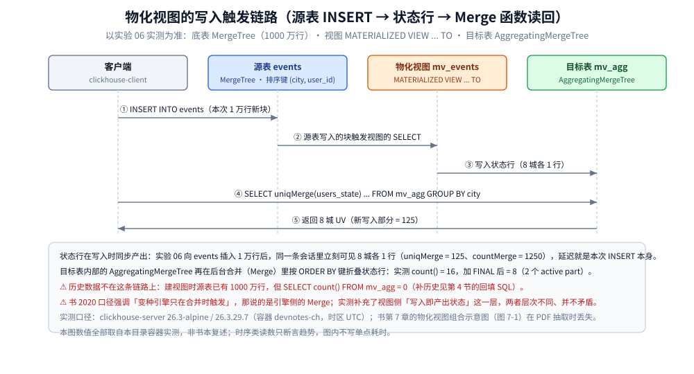
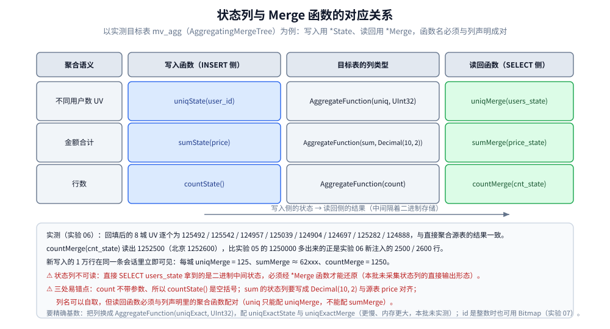
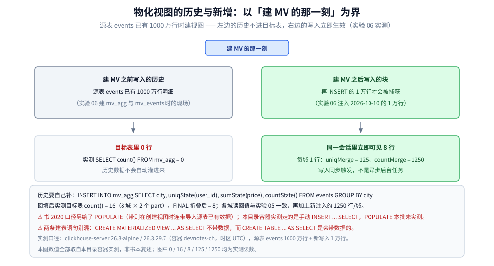

# 物化视图与实时聚合

> 本篇覆盖物化视图与实时聚合这条完整链路：为什么要把「现算」换成「预聚合」、视图到底在什么时机触发、`AggregateFunction` 状态列怎么写与怎么读回、历史数据为什么不回填、读回要不要加 `FINAL`、`DROP VIEW` 与目标表的连带关系、近似与精确两种基数口径、它和 `SummingMergeTree` / `ReplacingMergeTree` 怎么分工，以及生产落地要盯的几件事；⚠️ 书为 **2020 年**（全书基于 ClickHouse **19.17.4.11** 编写，演示环境 CentOS 7.7），本目录容器实测为 **26.3.29.7**（`clickhouse/clickhouse-server:26.3-alpine`，容器名 `devnotes-ch`，时区 UTC），凡书与实测不一致或已过时之处，逐处标注「**书 2020 口径 vs 26.3 实测**」。
>
> 素材来源：《ClickHouse原理解析与应用实践》（朱凯，机械工业出版社 2020 年）第 7 章「MergeTree 系列表引擎」与第 6 章「MergeTree 原理解析」的读后整理，**按主题归纳而非逐字摘录**；实测读数取自本目录容器（实验 05 / 06 / 07），素材见 [素材清单](../../../../素材清单.md)。

---

## 一、为什么需要物化视图？「现算」和「预聚合」差多少？

**本节要点**：同一份 1000 万行数据，MySQL 上一条 `GROUP BY` 加 `COUNT(DISTINCT)` 实测跑了 **1266 s**；而把结果预聚合进一张 16 行的状态表后，读回只要 **0.28 ~ 0.53 s** —— 这就是物化视图存在的全部理由。

### 1.1 对照基线：同一条聚合，两种代价

实验 05 把**同一份数据、同一条聚合语义**分别落在两个容器里：MySQL（`mysql:8.0` / **8.0.46**，库 `devnotes`，表 `events`）与 ClickHouse（`clickhouse/clickhouse-server:26.3-alpine` / **26.3.29.7**，表 `events`），两边都是 **1000 万行**。MySQL 侧造数（含建表、`seq1m` 与 1000 万行插入）总墙钟 **514 s**。

MySQL 的第一次尝试就撞在默认参数上：`tmp_table_size` 与 `max_heap_table_size` **都只有 16777216（16 MB）**，`COUNT(DISTINCT)` 的临时表因此落盘 —— 该查询在工具 300 s 超时后仍在执行，`information_schema.processlist` 显示 `time=342`、`state=executing`。把两个参数调大到 **268435456（256 MB）** 后重测，服务端 profiling 给出的 Duration 是 **1266.48418850 s**。

ClickHouse 侧同一条聚合直接返回了 8 行结果：

```text
$ # ClickHouse: SELECT city, count(), sum(price), uniq(user_id), count(DISTINCT user_id) FROM events GROUP BY city ORDER BY city
   ┌─city─┬─────cnt─┬───────total─┬─────uv─┬─────cd─┐
1. │ 上海 │ 1250000 │ 62496250000 │ 125492 │ 125000 │
2. │ 北京 │ 1250100 │ 62495012300 │ 125542 │ 125087 │
3. │ 广州 │ 1250000 │ 62497500000 │ 124957 │ 125000 │
4. │ 成都 │ 1250000 │ 62501250000 │ 125039 │ 125000 │
5. │ 杭州 │ 1250000 │ 62500000000 │ 124904 │ 125000 │
6. │ 武汉 │ 1250000 │ 62502500000 │ 124697 │ 125000 │
7. │ 深圳 │ 1250000 │ 62498750000 │ 125282 │ 125000 │
8. │ 西安 │ 1250000 │ 62503750000 │ 124888 │ 125000 │
   └──────┴─────────┴─────────────┴────────┴────────┘
```

⚠️ 这次 ClickHouse 输出**没有附带计时读数**，所以这里不写 ClickHouse 的耗时数字 —— 能拿来做「现算 vs 预聚合」对照的计时在实验 06。

### 1.2 真正的对照：现算 vs 读状态表

实验 06 在 `events`（1000 万行 + 新注入 1 万行）上做了两组查询、各跑 3 次（服务端计时，单位秒）：

| 查询 | 3 次读数 | 区间 | 返回 |
|---|---|---|---|
| `count(DISTINCT user_id) FROM events`（现算，全表扫） | 2.038 / 8.210 / 4.443 | 约 **2.0 ~ 8.2 s** | 1000000 |
| `uniqMerge(users_state) FROM mv_agg`（读状态，只读 16 行） | 0.531 / 0.281 / 0.279 | 约 **0.28 ~ 0.53 s** | 1001943 |

结论是**差一个数量级**（大致 10 ~ 30 倍），但读数抖动很大（2.038 到 8.210 差了 4 倍，受 OS 页缓存影响），所以**只断言趋势、不写单点值**。

⭐ 这里必须同时抄走一条前提：**两条查询并不等价** —— 现算返回的 1000000 是精确值，读状态返回的 1001943 是近似值（误差 **+0.19%**），原因见第七节。「预聚合更快」这句话后面永远要跟一句「拿精度换的」。

### 1.3 代价换到了哪里

书第 7 章把这类引擎的动因归到数据仓库的「**数据立方体**」思路上 —— **以空间换时间**：把需要聚合的数据预先算好并保存结果，后续聚合查询直接用结果。实测把这条定性落成了具体的账：

- **省掉的**：每次查询都要全表扫的那部分扫描量与计算量（1.2 的两个读数）。
- **多出来的**：写入路径上多了一次聚合计算（状态是**写在写入时**的，见第二节），加上目标表本身的存储。
- **丢掉的**：明细。`mv_agg` 只有 4 列（`city` 加三个状态列），**无法再按 `device` / `url` / `tags` 下钻** —— 要下钻只能回去查源表，或者另建一套视图。

---

## 二、物化视图的本质是什么？它只在「新写入的块」上触发吗？？

**本节要点**：它是一张**挂在源表写入链路上、带独立存储的特殊表**；书强调「变种引擎只在合并时触发」，而实测看到的是**视图侧在 INSERT 时就同步产出状态行** —— 两句讲的是不同环节，并不矛盾。

### 2.1 书第 7 章的口径：AggregatingMergeTree 的主流用法

- `AggregatingMergeTree` 是 `SummingMergeTree` 的升级版，**声明时没有任何额外设置参数**（`ENGINE = AggregatingMergeTree()`）；用什么聚合函数、聚合哪些字段，全靠 `AggregateFunction` 数据类型声明。
- 书的关键提示：直接把它当普通表用（写入调 `*State`、查询调 `*Merge`）「**确实会非常麻烦**」，**这并不是它的主流用法** —— **更常见的应用方式是结合物化视图使用，把它作为物化视图的表引擎**。
- 配套的角色分工：**底表通常用 MergeTree**，存全量明细数据并对外提供实时查询；**物化视图用 AggregatingMergeTree**，用于特定场景的查询。数据流向是：`INSERT` 面向**底表** → 数据**自动同步**到视图并按 AggregatingMergeTree 规则处理 → 查询面向**视图**（用 `*Merge` 函数）。
- ⚠️ 书用来讲这条链路的那张示意图（**图 7-1 物化视图组合示意**）与第 7 章其余配图一样**在 PDF 抽取时全部丢失、文本层无内容**，本篇的图按文字与实测重绘。

### 2.2 实测：它只对「新写入的块」触发

这是本篇最反直觉、也最该先记住的一条。实验 06 建目标表与视图时的现场：

```text
$ docker exec -i devnotes-ch clickhouse-client --multiquery < sql/06-create-mv.sql
--- ① 建 MV 后目标表行数(源表已有 1000 万行) ---
0
```

源表 `events` 里明明躺着 **1000 万行**，建完视图后 `SELECT count() FROM mv_agg` 却是 **0** —— `MATERIALIZED VIEW` 只对**创建之后新写入源表的块**触发，历史数据不会自动灌进目标表（补历史见第四节）。

### 2.3 实测：触发是「同步」的，不是后台异步任务

```text
$ docker exec -i devnotes-ch clickhouse-client --multiquery < sql/06-insert-check.sql
--- ② INSERT 1 万行后, 目标表立即可见 ---
上海	1
北京	1
广州	1
成都	1
杭州	1
武汉	1
深圳	1
西安	1
--- 用 uniqMerge 读回 UV / sumMerge 读回金额 ---
上海	125	62461.78	1250
北京	125	62449.27	1250
广州	125	62474.29	1250
成都	125	62511.79	1250
杭州	125	62499.29	1250
武汉	125	62524.28	1250
深圳	125	62486.79	1250
西安	125	62536.78	1250
```

向 `events` 插入 1 万行后，**同一条 SQL 会话里立刻** `SELECT ... FROM mv_agg` 就能看到：8 个城各 1 行，`uniqMerge` = **125**（1 万行 / 8 城 = 1250 行，`user_id = number % 1000` → 125 个不同用户）、`sumMerge` ≈ 62xxx、`countMerge` = **1250** 全对。说明写入 `events` 的那条 `INSERT ... SELECT` 是**同步地**把聚合状态写进目标表的，**延迟就是本次 INSERT 本身**。



### 2.4 「只在合并时触发」和「写入即产出」矛盾吗

不矛盾，是两层：

- **视图这一层**：`CREATE MATERIALIZED VIEW ... AS SELECT ... GROUP BY city` 里的这段 SELECT 是**在源表的 INSERT 过程中执行的** —— 所以状态行在写入时就已经算好并落进目标表（2.3 的实测）。
- **目标表引擎这一层**：`AggregatingMergeTree` 的 Merge 逻辑仍然**只在后台合并分区时触发**，它做的是把同一个 `ORDER BY` 键上的多个状态行折叠掉。实测证据是行数：回填后 `SELECT count() FROM mv_agg` = **16**（8 城 × 2 个 part），而 `SELECT count() FROM mv_agg FINAL` = **8**（见第五节）。

⚠️ **书 2020 口径 vs 26.3 实测**：书第 7 章反复强调「**变种引擎的所有特殊逻辑都只在触发合并（Merge）的过程中被激活**」，这句话在**引擎侧**完全成立；26.3 实测补充的是**视图侧**「写入时同步产出状态」这一层。两句讲的是不同环节，不要互相套用。

---

## 三、AggregateFunction 状态列怎么定义、又怎么读回？

**本节要点**：`AggregateFunction` 存的是**聚合的二进制中间状态**；写入必须调 `*State`、读回必须调 `*Merge`，且**函数名必须与列声明里的聚合函数成对**，错一个就读不出来。

### 3.1 书的口径：一对函数，各管一头

书第 7 章 7.4 节的原文口径：`AggregateFunction` 是 ClickHouse 提供的一种**特殊数据类型**，能够**以二进制的形式存储中间状态结果**。其用法特殊 —— **写入数据时要调用 `*State` 函数；查询数据时要调用相应的 `*Merge` 函数**，其中 `*` 表示定义时使用的聚合函数。



### 3.2 实测：建目标表 + 建视图（实验 06 原文）

```sql
-- sql/06-create-mv.sql
DROP TABLE IF EXISTS mv_agg;
DROP TABLE IF EXISTS mv_events;

-- 目标表: 用 AggregateFunction 状态列存预聚合结果
CREATE TABLE mv_agg (
    city        LowCardinality(String),
    users_state AggregateFunction(uniq, UInt32),
    price_state AggregateFunction(sum, Decimal(10, 2)),
    cnt_state   AggregateFunction(count)
)
ENGINE = AggregatingMergeTree
ORDER BY city;

-- 物化视图: TO 目标表
CREATE MATERIALIZED VIEW mv_events TO mv_agg AS
SELECT
    city,
    uniqState(user_id)  AS users_state,
    sumState(price)     AS price_state,
    countState()        AS cnt_state
FROM events
GROUP BY city;
```

三条配对规则都能在这段 SQL 里看见：

- `users_state AggregateFunction(uniq, UInt32)` ↔ 写入 `uniqState(user_id)` ↔ 读回 `uniqMerge(users_state)`；`UInt32` 是 `user_id` 的类型。
- `price_state AggregateFunction(sum, Decimal(10, 2))` ↔ `sumState(price)` ↔ `sumMerge(price_state)`；`Decimal(10, 2)` 与源表 `price` 的类型一致。
- `cnt_state AggregateFunction(count)` ↔ `countState()` ↔ `countMerge(cnt_state)` —— **`count` 不带参数，所以 `countState()` 也是空括号**。

⚠️ 直接 `SELECT users_state FROM mv_agg` 读出来的是二进制中间态、不是人能看的值；状态列必须经 `*Merge` 才能还原。**本批实测未采集状态列的直接输出形态**，此处按书第 7 章的定性与实测的读回行为记述。

### 3.3 实测：读回（回填后 8 城逐个核对）

```text
$ docker exec devnotes-ch clickhouse-client -q \
    "SELECT city, uniqMerge(users_state) AS uv, countMerge(cnt_state) AS cnt FROM mv_agg GROUP BY city ORDER BY city FORMAT TSV"
上海	125492	1252500
北京	125542	1252600
广州	124957	1252500
成都	125039	1252500
杭州	124904	1252500
武汉	124697	1252500
深圳	125282	1252500
西安	124888	1252500
```

这 8 个 UV 与实验 05 命令 2 里 `uniq(user_id)` 的逐城读数**完全一致**（125492 / 125542 / 124957 / 125039 / 124904 / 124697 / 125282 / 124888），`countMerge` 是 1252500（北京 1252600）。比实验 05 的 1250000 多出的 2500 / 2600，来自实验 06 又注入的 1 万行（每城 1250 行）。**状态表读回来的值与直接聚合源表的结果对得上**，这是 `*State` / `*Merge` 配对正确最直接的证据。

---

## 四、历史数据为什么不会自动回填？该怎么补？

**本节要点**：建视图只是「今后写入的块才算」，**历史必须自己 `INSERT ... SELECT` 补一次**，代价就是一次全表 `GROUP BY`；另外要分清 `CREATE TABLE ... AS SELECT`（带数据）与 `CREATE MATERIALIZED VIEW ... AS SELECT`（不带数据）。

### 4.1 实测：手动回填的读数

```text
$ docker exec devnotes-ch clickhouse-client -q \
    "INSERT INTO mv_agg SELECT city, uniqState(user_id), sumState(price), countState() FROM events GROUP BY city"
$ docker exec devnotes-ch clickhouse-client -q "SELECT count() AS mv_agg_rows FROM mv_agg"
16
# (16 = 8 城 x 2 个 part; 上面每城已跨 part 合并; 数值与实验 05 的命令 2 一致 + 新注入的 1250 行/城)
```

回填 SQL 与视图定义里的那段 SELECT **一模一样**（同 `GROUP BY city`、同三个 `*State` 函数），把源表 1000 万行一次算完写进目标表。读数是 **16 行** —— 不是 8 行，因为 8 个城各被写成了 **2 个 part**（新写入的 1 万行走新 part，回填的 1000 万行又生成一批 part）；`count()` 数的是物理行，跨 part 的同城状态行要等后台合并、或读时加 `FINAL` 才会折叠（第五节）。



⚠️ **本批实测未采集回填本身的耗时**（只采集了回填前后的读数与三组查询计时），所以这里不写「回填要多久」。

### 4.2 两条建表语句的差别（最易混的一处）

```text
CREATE TABLE ... AS SELECT              -- 建表并带数据（会把 SELECT 的结果写进去）
CREATE MATERIALIZED VIEW ... AS SELECT  -- 建视图，历史数据不进目标表
```

实验 06 的现场把这条差别钉死了：目标表 `mv_agg` 是**先 `CREATE TABLE` 建好空表**、再由视图 `TO mv_agg` 写入的，所以建完视图的瞬间它的行数是 **0**。另一个旁证在第六节的小表实验里 —— 视图创建前写入的 3 行（`('a',1)`、`('a',2)`、`('b',10)`）在视图里**一行都看不到**，读出的只有建视图之后写入的 `100` / `200`。

### 4.3 书 2020 口径另给了一条路：`POPULATE`

书在物化视图语法里给了 `POPULATE` 修饰符 —— **带 `POPULATE` → 创建时连带导入源表已有数据；不带 → 创建后没有数据，只同步此后写入的**（本仓 [数据模型与表设计.md](数据模型与表设计.md) 里已整理过这段口径）。⚠️ **`POPULATE` 本批未实测**，本篇的实际路径是「先建空目标表 + 手动 `INSERT INTO mv_agg SELECT ...` 回填」。

---

## 五、读结果需要加 FINAL 吗？

**本节要点**：**不必加**。实测加与不加结果完全相同、耗时也在同一档；`FINAL` 唯一看得见的效果是**行数折叠**（16 → 8）。

### 5.1 实测：结果与耗时对照（各 3 次）

```text
$ # --- 不加 FINAL, 3 次 ---
1001943 0.431  (run 1)
1001943 1.152  (run 2)
1001943 0.205  (run 3)

$ # --- 加 FINAL, 3 次 ---
1001943 0.728  (run 1)
1001943 0.425  (run 2)
1001943 0.255  (run 3)
```

- **结果完全相同**（都是 1001943）。
- **耗时在同一档**：不加 `FINAL` 是 0.205 / 0.431 / 1.152，加 `FINAL` 是 0.255 / 0.425 / 0.728 —— 两次的区间**高度重叠**，既没有出现显著变慢，也**不能**凭这 3 次断言谁更快。抖动主要来自容器与 OS 页缓存，所以只断言「同档」。

### 5.2 `FINAL` 真正做了什么

```text
$ docker exec devnotes-ch clickhouse-client -q "SELECT count() FROM mv_agg"
16
$ docker exec devnotes-ch clickhouse-client -q "SELECT count() FROM mv_agg FINAL"
8
$ docker exec devnotes-ch clickhouse-client -q \
    "SELECT count() AS parts FROM system.parts WHERE database='default' AND table='mv_agg' AND active"
2
```

`mv_agg` 里有 **2 个 active part**，每个城里各有一行状态 → 裸 `count()` = **16**；`FINAL` 先按 `ORDER BY` 键（`city`）做一次预合并 → **8**。这就是 `FINAL` 唯一看得见的效果。

### 5.3 结论与依据

- **读状态列的查询不必加 `FINAL`**：`uniqMerge` / `sumMerge` / `countMerge` 这类 **Merge 函数本身就能跨 part 聚合**，`FINAL` 在这里做的「按键预合并」是冗余的，加了只是读之前多一次合并、白花 CPU。
- **想看「每键恰好一行」时才用 `FINAL`**，或者干脆 `GROUP BY`（3.3 的读回 SQL 就是 `GROUP BY city`、没加 `FINAL`）。
- ⚠️ **书 2020 口径 vs 26.3 实测**：书的 FROM 子句一节把 `FINAL` 描述为**配合 Collapsing 系列强制查询期合并**的修饰符，并明确它**会降低查询性能、应尽可能避免**；本篇实测的表是 `AggregatingMergeTree`（不是 Collapsing 系列），所以「同档、可省」这条结论只对本篇的引擎与数据形态成立。

---

## 六、DROP VIEW 会不会连带删掉目标表？

**本节要点**：**取决于建视图时有没有 `TO`** —— 带 `TO` 的目标表是独立对象、`DROP VIEW` 之后仍然存在；不带 `TO` 的隐式内表会跟着视图一起消失。

### 6.1 实测：两种形态的对照实验

```sql
-- sql/06-drop-test.sql
CREATE TABLE mv_small_src (k String, v UInt32) ENGINE = MergeTree ORDER BY k;
INSERT INTO mv_small_src VALUES ('a', 1), ('a', 2), ('b', 10);

-- 形态 A: 带 TO 目标表
CREATE TABLE mv_a_agg (k String, s AggregateFunction(sum, UInt32))
ENGINE = AggregatingMergeTree ORDER BY k;
CREATE MATERIALIZED VIEW mv_a TO mv_a_agg AS
SELECT k, sumState(v) AS s FROM mv_small_src GROUP BY k;

-- 形态 B: 不带 TO(隐式内表, 名字与 MV 同名)
CREATE MATERIALIZED VIEW mv_b
ENGINE = AggregatingMergeTree ORDER BY k AS
SELECT k, sumState(v) AS s FROM mv_small_src GROUP BY k;

INSERT INTO mv_small_src VALUES ('a', 100), ('b', 200);   -- 只有这之后的写入会被 MV 捕获
DROP VIEW mv_a;
DROP VIEW mv_b;
```

```text
$ docker exec -i devnotes-ch clickhouse-client --multiquery < sql/06-drop-test.sql
--- DROP 之前: 相关对象 ---
mv_a	MaterializedView
mv_a_agg	AggregatingMergeTree
mv_b	MaterializedView
--- DROP 之前: 目标表读数 ---
A(TO)	a	100
A(TO)	b	200
B(inner)	a	100
B(inner)	b	200
--- DROP VIEW 之后: 目标表是否还在 ---
mv_a_agg	AggregatingMergeTree
```

三件事一次看全：

- **带 `TO mv_a_agg`（形态 A）**：`DROP VIEW mv_a` 之后，**目标表 `mv_a_agg` 仍然存在** —— `DROP` 只删视图定义，数据表是独立对象。
- **不带 `TO`（形态 B）**：视图自己持有一张**同名内表**，`DROP VIEW mv_b` 会**连带把内表一起删掉** —— DROP 之后 `system.tables` 里只剩 `mv_a_agg`。
- **两个形态读出的值都只有 100 / 200**，**没有**最早那 3 行（1 / 2 / 10）—— 又一次证明视图不回填历史（第四节）。

### 6.2 一条容易踩的观测细节

隐式内表**不出现在 `system.tables` 的普通查询里**：实验里用 `name IN ('mv_a_agg','mv_a','mv_b','mv_b.inner')` 只能查到 `mv_a`、`mv_b` 两个视图名，**看不到任何 `.inner` 行**。

⚠️ **书 2020 口径 vs 26.3 实测**：书把视图的内表描述为用 **`.inner.` 前缀**命名、并通过 **`DROP TABLE`** 删除（本仓 [数据模型与表设计.md](数据模型与表设计.md) 里已整理过）；26.3 实测里 `DROP VIEW mv_b` **同样生效且会连带内表**，而 `.inner.` 名字在 `system.tables` 的常规查询中查不到。生产上不要依赖隐式内表 —— **显式写 `TO <目标表>`**，目标表就能单独备份、单独改引擎、单独删。

---

## 七、近似还是精确？uniq 与 Bitmap 的口径差在哪？

**本节要点**：`uniq` / `uniqState` 是**近似**的（实测 +0.19%），`count(DISTINCT)` 在本版本走的是**精确**路径；要既快又精确、且 id 能映射成整数，就该换 **Bitmap**。

### 7.1 实测：三个基数函数的差

```text
$ docker exec devnotes-ch clickhouse-client -q \
    "SELECT count(DISTINCT user_id) AS cd, uniq(user_id) AS u, uniqExact(user_id) AS u_exact, uniqCombined(user_id) AS u_combined FROM events"
1000000	1001943	1000000	1001148
```

| 写法 | 实测值 | 偏差 | 性质 |
|---|---|---|---|
| `count(DISTINCT user_id)` | 1000000 | 0 | 本版本与 `uniqExact` **一致** → 走的是精确路径 |
| `uniqExact(user_id)` | 1000000 | 0 | 精确（代价是内存与耗时） |
| `uniq(user_id)` | 1001943 | **+0.19%** | 近似（自适应 HyperLogLog） |
| `uniqCombined(user_id)` | 1001148 | **+0.11%** | 近似（按数据量三档切换） |

⚠️ 所以第三节读回的 **1001943** 不是 bug：状态列用的是 `uniqState`（底层就是 `uniq`），而且**跨 part 合并 HLL 会累积估算误差**。要精确就把状态列换成 `AggregateFunction(uniqExact, UInt32)` 配 `uniqExactState` / `uniqExactMerge` —— 结果会与源表一致，但按书与实测提示，它**更慢、内存更大**；**本批未实测该替换方案的耗时与内存**。

⚠️ **书 2020 口径 vs 26.3 实测**：书第 2 章口径下 `uniqCombined` 会按数据量在三档之间切换（较小用 Array、中等用 HashSet、很大用 HyperLogLog），但**没有给误差范围**；26.3 实测给出的是**同一份数据上 `uniq` 与 `uniqCombined` 的具体偏差**（+0.19% / +0.11%）。书口径也没覆盖的一条：本版本的 `count(DISTINCT)` 走精确路径（实测与 `uniqExact` 相等）。

### 7.2 对照：Bitmap 的基数是精确的

本目录另一批实测（实验 07，Bitmap 用户画像）把这件事钉死了：位图表 `tag_bitmaps` 同样是 `AggregatingMergeTree` 配 `AggregateFunction(groupBitmap, UInt32)`，而 `bitmapCardinality(users)` 与源表 `count() GROUP BY tag` 的 **20 个标签逐个完全相等**（t00 = 99939 … t19 = 700331）。

- **为什么精确**：位图本质是「**每个 `user_id` 一个 bit**」的确定集合，没有哈希碰撞估算。
- **代价**：位图**只支持离散、可映射到整数区间的 id**（这里是 `UInt32` 的 `user_id`），不像 `uniq` 那样能对任意类型做基数估算。
- 于是「UV 该用 `uniq` 还是 Bitmap」的判据是：**要精确且 id 是整数 → Bitmap；id 是字符串或复合键、且能接受近似 → `uniq`**。

### 7.3 一个与引擎无关的 UV 坑

```text
$ docker exec devnotes-ch clickhouse-client -q \
    "SELECT sum(c) AS sum_per_city FROM (SELECT city, uniqExact(user_id) AS c FROM events GROUP BY city)"
1000087
$ docker exec devnotes-ch clickhouse-client -q "SELECT count() AS events_rows, uniqExact(user_id) AS global_exact FROM events"
10010100	1000000
```

全站 `uniqExact(user_id)` = **1000000**，而**各城 `uniqExact` 相加** = **1000087 > 1000000** —— 因为 `user_id` 会在多个 `city` 里重复出现（数据生成规则是 `user_id = n % 1000000`、`city = n % 8`）。**「各城 UV 相加」不等于「全站 UV」**，这是 UV 口径最常见的坑，与用哪个引擎、哪种基数函数无关。顺带记下全表行数 **10010100**（1000 万基础 + 1 万新注入），`uniqExact` 仍为 1000000（新注入的 `user_id` 0~999 已在集合内）。

---

## 八、SummingMergeTree / ReplacingMergeTree 能替代物化视图吗？

**本节要点**：`SummingMergeTree` 只能替代**求和**这一种聚合，`ReplacingMergeTree` 解决的是**去重**而不是聚合；只要出现 `uniq` / `count` / 位图 / `avg` 这类**非 SUM** 的需求，就只能走 `AggregatingMergeTree` 加物化视图这条路。

### 8.1 书第 7 章给的三者分工

| 引擎 | 解决什么问题 | 判定依据与边界（书第 7 章口径） |
|---|---|---|
| `SummingMergeTree((col1,col2,…))` | **预聚合**：终端用户只查汇总结果、汇总条件预先明确 | 合并时按 `ORDER BY` 分组把同组多行 **SUM** 成一行；`columns` 选填，不填则把所有**非主键数值列**都 SUM；**非汇总字段取同分区第一行的取值**；**跨分区不汇总** |
| `AggregatingMergeTree()` | **可编程的预聚合**：聚合方式不再限于 SUM | 用 `AggregateFunction` 声明「聚合函数 + 字段」，写入 `*State`、查询 `*Merge`；**主流用法是当物化视图的表引擎** |
| `ReplacingMergeTree(ver)` | **去重**：主键没有唯一约束，某些场合不希望表内重复 | 合并时按 `ORDER BY`（不是 `PRIMARY KEY`）分组删重复，且**只删同一分区内**的重复；设了 `ver` 则保留 `ver` 最大的一行 |

### 8.2 怎么选（三条判据）

- **只要 SUM、且分组键固定** → `SummingMergeTree` 更省事：不需要 `*State` / `*Merge` 那一套，直接 `SELECT` 就有可读的值，也不用额外记「哪个读回函数配哪个状态列」。
- **需要 `uniq` / `count` / 位图 / `avg` 等非 SUM 聚合** → 没有替代品，只能 `AggregatingMergeTree`（`avg` 可以用 `sum` 与 `count` 两个状态列自己算）。
- **要的是「同 key 只留一行最新」** → 那是 `ReplacingMergeTree` 的活，它不做聚合、也没有状态列。
- 三者有一条共同约束（书第 7 章的家族心法）：**特殊逻辑都只在触发合并（Merge）时生效，且只以「数据分区」为单位**；同样都**不回填历史**（第四节那条对它们一样成立）。

### 8.3 书里那个「为什么要同时定义 ORDER BY 与 PRIMARY KEY」

一般情形只写 `ORDER BY`（它指代主键）就够；**需要两者不同时，基本只出现在 `SummingMergeTree` / `AggregatingMergeTree` 上**（它们的聚合是按 `ORDER BY` 进行的），目的是「**主键与聚合条件定义分离，为修改聚合条件留下空间**」（书举的例子：A~F 六字段需按 A/B/C/D 汇总 → `ORDER BY (A,B,C,D)`，但业务其实只需按 A 过滤 → `ORDER BY (A,B,C,D) PRIMARY KEY A`）。⚠️ **同时声明时 `PRIMARY KEY` 必须是 `ORDER BY` 的前缀**，写成 `ORDER BY (B,C) PRIMARY KEY A` 是错的。

---

## 九、生产落地要注意什么？

**本节要点**：把代价看清（写入侧多算一次、目标表丢明细）、把语义钉死（同步触发、不回填历史、不随源表删除）、把对象管好（显式 `TO`、多视图的维护成本）。

### 9.1 写入侧

- **同步触发**：状态行是**源表本次 INSERT 的一部分**（2.3 实测：同会话立即可见），所以每个写入的块都会额外触发一次聚合计算。**预聚合把代价从「每次查询」挪到了「每次写入」** —— 写入吞吐有代价，⚠️ **本批未实测写入吞吐的下降幅度**。
- **幂等与重复回填**：视图与回填 SQL 都不去重。重复执行同一条回填 `INSERT INTO mv_agg SELECT ...` 会再写一批状态行 —— `countState` / `sumState` 是**可加**的（数值会再叠一遍），`uniqState` 合并的是 HLL 集合（UV 基本不变）。⚠️ **这一点是机制推理，本批未实测**；正确做法是把回填做成**按分区或批次只跑一次**的可追溯流程。
- **失败边界**：本批未实测「INSERT 失败时视图写入是否回滚」这类事务语义，不作断言。

### 9.2 查询侧

- **只用 Merge 函数读**，且**函数必须与列声明成对**（第三节）；状态列本身不可读。
- **不必加 `FINAL`**（第五节），除非要「每键恰好一行」。
- **维度已经被固化**：`mv_agg` 只有 `city` 加三个状态列，**再想按 `device` / `url` 下钻就没有了** —— 建视图之前先想清楚维度组合。

### 9.3 对象与运维

- **显式写 `TO <目标表>`**（第六节）：不带 `TO` 的隐式内表会随 `DROP VIEW` 一起消失，而且在 `system.tables` 里查不到名字。
- **多视图的维护成本**：每加一个聚合口径（比如再按 `device` 分）就要新建一套「目标表 + 视图」；源表的**每次** INSERT 会触发**所有**挂在它上面的视图，写入放大随视图数量叠加。
- **源表删数据不会同步删视图数据** —— 书把这条明写在物化视图的对照里（**物化视图目前并不支持同步删除**，见本仓 [数据模型与表设计.md](数据模型与表设计.md)）。
- **回填是一次全表 `GROUP BY`**（第四节的实测对象是 1000 万行），大表上要按分区或时间片分批推进，避免把一次重活压进一个查询里。
- **容器收尾**：本目录的实验都是 `docker run` 起的 `devnotes-ch`，收尾用 `docker stop` 保留容器便于复跑（不 `docker rm`）。

---

## 使用：物化视图的建表 / 写入 / 读回 SQL 模板

把前九节拼成一条能直接抄的链路。下面这套语句就是实验 06 实际跑过的，把表名与字段替换即可。

```sql
-- ① 目标表: 存聚合状态（引擎用 AggregatingMergeTree，ORDER BY 即聚合条件 Key）
CREATE TABLE mv_agg
(
    city        LowCardinality(String),
    users_state AggregateFunction(uniq, UInt32),
    price_state AggregateFunction(sum, Decimal(10, 2)),
    cnt_state   AggregateFunction(count)
)
ENGINE = AggregatingMergeTree
ORDER BY city;

-- ② 物化视图: 显式 TO 目标表（生产推荐；不带 TO 的隐式内表会随 DROP VIEW 一起消失）
CREATE MATERIALIZED VIEW mv_events TO mv_agg AS
SELECT
    city,
    uniqState(user_id) AS users_state,
    sumState(price)    AS price_state,
    countState()       AS cnt_state
FROM events
GROUP BY city;
```

```sql
-- ③ 回填历史（只对新写入的块自动生效，历史必须自己补一次）
INSERT INTO mv_agg
SELECT
    city,
    uniqState(user_id) AS users_state,
    sumState(price)    AS price_state,
    countState()       AS cnt_state
FROM events
GROUP BY city;
```

```sql
-- ④ 读回: 状态列必须经 *Merge 函数还原；通常 GROUP BY 而不加 FINAL
SELECT
    city,
    uniqMerge(users_state) AS uv,
    sumMerge(price_state)  AS total,
    countMerge(cnt_state)  AS cnt
FROM mv_agg
GROUP BY city
ORDER BY city;
```

```sql
-- ⑤ 三句自查（读数对应第二、四、五节的实测）
SELECT count() FROM mv_agg;                -- 建完视图立刻查 = 0；回填后 = 16（8 城 x 2 part）
SELECT count() FROM mv_agg FINAL;          -- FINAL 折叠后 = 8（每城恰好一行）
SELECT count() FROM mv_agg GROUP BY city;  -- 8（用 GROUP BY 代替 FINAL 的同效写法）
```

用起来的四条注意：**状态列与 `*Merge` 函数必须成对**（第三节）；**读完不必加 `FINAL`**（第五节）；**源表 DELETE 不会同步删视图数据**（第九节）；**视图固化了维度**，换维度只能新建一套目标表加视图（第九节）。

---

## 延伸追问

- **建完物化视图，为什么目标表是空的？** → 因为 `MATERIALIZED VIEW` 只对**创建之后新写入源表的块**触发；实测源表已有 1000 万行时 `SELECT count() FROM mv_agg` = **0**，历史必须手动 `INSERT ... SELECT` 回填（第四节）。
- **它是同步的还是异步的？** → 同步。实测 INSERT 1 万行后同一条会话里立刻可见 8 城各 1 行（`uniqMerge` = 125、`countMerge` = 1250），延迟就是本次 INSERT 本身（第 2.3 节）。
- **读 `mv_agg` 要不要加 `FINAL`？** → 不必。实测加与不加结果都是 1001943、耗时同档；`FINAL` 唯一的效果是把 `count()` 从 16 折叠成 8（第五节）。
- **`uniqMerge` 读回来的数为什么和源表对不上？** → 状态列用的是 `uniq`（近似 HLL），实测 `uniq` = 1001943 而精确值是 1000000（+0.19%）；要精确就换 `uniqExact` 配 `uniqExactState`，或改用 Bitmap（第七节）。
- **`uniq` 和 Bitmap 都做「基数」，区别在哪？** → `uniq` 是**估算**、能对任意类型用；Bitmap 是**精确集合**、但要求 id 能映射成整数（实验 07 里 20 个标签的位图基数与源表逐个相等）（第 7.2 节）。
- **各城 UV 相加为什么大于全站 UV？** → `user_id` 会在多个 `city` 里重复出现；实测各城 `uniqExact` 相加 = **1000087** > 全站 1000000，与引擎无关（第 7.3 节）。
- **`DROP VIEW` 会不会把数据一起删掉？** → 看建视图时有没有 `TO`：带 `TO` 的目标表是独立对象、DROP 后仍在；不带 `TO` 的隐式内表随视图一起消失（第六节）。
- **书里写 `ENGINE = AggregatingMergeTree()` 建视图，实测却写 `TO`，哪个对？** → 两种写法都合法：不带 `TO` 走隐式内表、带 `TO` 走显式目标表，第六节的形态 A / B 都实测过。生产建议显式 `TO`，便于单独备份与改引擎（第八节）。
- **建视图时能不能顺手把历史数据一起灌进去？** → 书 2020 口径给了 `POPULATE`（带则创建时连带导入源表已有数据）；本篇实测走的是「建空表 + 手动回填」，**`POPULATE` 本批未实测**（第 4.3 节）。
- **重复跑一遍回填 SQL 会怎样？** → 会再写一批状态行：`countState` / `sumState` 可加（数值叠加）、`uniqState` 合并 HLL（UV 基本不变）。⚠️ 这一条是机制推理，**本批未实测**（第 9.1 节）。

---

## 关联

- [数据模型与表设计.md](数据模型与表设计.md) — 同目录：讲完「怎么建表」才轮到本篇的「怎么预聚合」，书 4.2 口径的 `POPULATE` / `.inner.` / 不支持同步删除都在那一篇
- [SQL查询与优化.md](SQL查询与优化.md) — 同目录：`GROUP BY` / `HAVING` / 聚合键的语义（本篇的视图定义就是一段 `GROUP BY`）
- [索引原理与查询优化.md](索引原理与查询优化.md) — 同目录：读回查询到底省了多少扫描量，用 `EXPLAIN indexes=1` 与 `read_rows` 去验证
- [架构与存储引擎.md](架构与存储引擎.md) — 同目录：第九节把 `AggregatingMergeTree` 放回 MergeTree 家族，讲清「为什么特殊逻辑只在合并时触发」
- [定位与适用场景.md](定位与适用场景.md) — 同目录：实时聚合属于哪类负载，以及 ClickHouse 的定位边界
- [存储选型.md](../../存储选型.md) — 七类存储的定位矩阵，判断「预聚合」这一层该落在哪里
- [时序数据库选型对比.md](../../时序数据库/时序数据库选型对比.md) — 时序场景里的同类问题（预聚合 / 降采样）与横向对照
- [位图与布隆过滤器.md](../../../../02-计算机基础/数据结构/高级数据结构/位图与布隆过滤器.md) — 第七节里 Bitmap 精确基数的底层结构
- [素材清单.md](../../../../素材清单.md) — 本篇所用素材的登记
> 反向引用（本篇被下列文档引到）：[性能调优与基准测试.md](性能调优与基准测试.md)、[选型对比与落地案例.md](选型对比与落地案例.md)、[集群与高可用.md](集群与高可用.md)、[列式数据库选型对比.md](../列式数据库选型对比.md)
