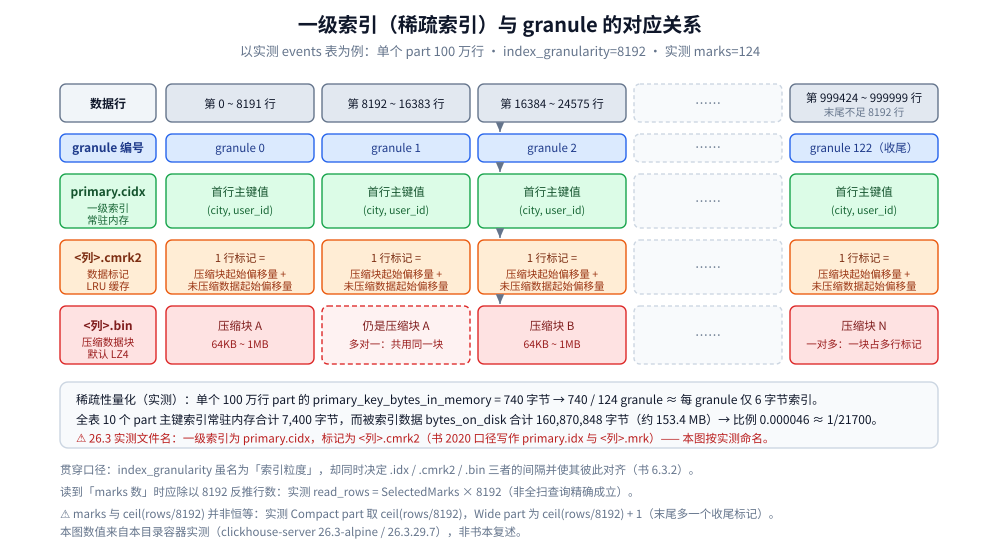
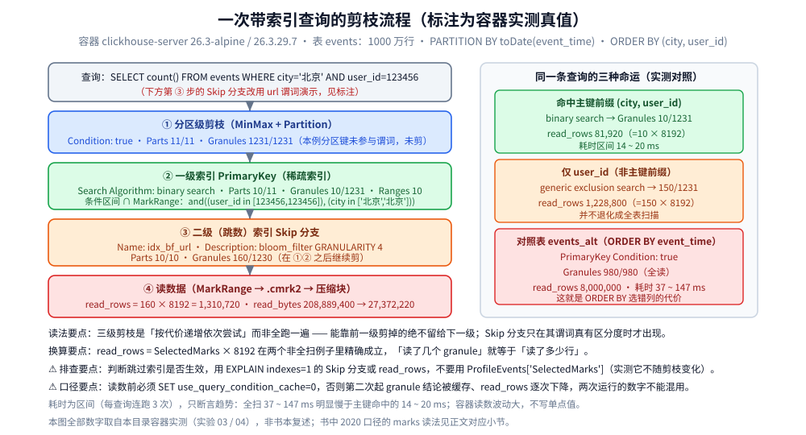

# 索引原理与查询优化

> 素材来源：《ClickHouse原理解析与应用实践》（朱凯，机械工业出版社 2020 年）第 6 章「MergeTree 原理解析」与第 9 章「数据查询」的读后整理，**按主题归纳而非逐字摘录**；实测读数一律取自本目录容器的原始输出（实验 03 / 04），素材见 [素材清单](../../../../素材清单.md)。
>
> ⚠️ 书为 **2020 年**（全书基于 **ClickHouse 19.17.4.11** 编写，演示环境 CentOS 7.7），本目录的容器实测为 **26.3.29.7**（`clickhouse/clickhouse-server:26.3-alpine`，容器名 `devnotes-ch`，时区 UTC）。凡书里的默认值、参数名、系统表字段、文件名、读数与当前不一致或已过时之处，本篇逐处标注「**书 2020 口径 vs 26.3 实测**」。书中第 6 章配图（图 6-1~6-24）与表 6-1 在 PDF 抽取时全部丢失，凡素材缺失处标「**书中该处 PDF 抽取不清**」，不作补写。

---

## 一、一级索引为什么是「稀疏」的？

**本节要点**：一级索引**不是每行一条**，而是**每 8192 行只取一行的主键值**做「章节目录」；这个间隔由 `index_granularity` 决定，并且**同时约束 `.idx` / `.mrk` / `.bin` 三者、使它们彼此对齐** —— 这是全篇最该先建立的心智模型。

### 1.1 稀疏与稠密：只记「章节起始页码」

- **稠密索引**：**每一行索引标记对应一行具体的数据记录**；**稀疏索引**：**每一行索引标记对应的是一段数据而非一行**（书 6.3.1 的对照口径）。
- 书的比喻：MergeTree 像一本书，**稀疏索引就是这本书的一级章节目录** —— 它不具体对应每个字的位置，只记录**每个章节的起始页码**。
- 收益（书原文）：**仅需少量索引标记就能记录大量数据的区间位置信息，而且数据量越大优势越明显**；正因占用空间小，**`primary.idx` 内的索引数据常驻内存**，取用极快。
- 书给的一条量化：以默认索引粒度 8192 为例，**MergeTree 只需要 12208 行索引标记就能为 1 亿行数据提供索引**（书 2020 口径）。

### 1.2 索引粒度同时约束三者

书称 `index_granularity` 是「**非常重要**」的参数：它像一把**标尺**丈量数据长度、依刻度把数据切成多个小段，**每段最多 8192 行**；MergeTree 用一个叫 **MarkRange** 的对象表示具体区间，用 `start` 与 `end` 表示范围。⚠️ 关键联动：`index_granularity` 虽名为「索引」粒度，**却不只作用于一级索引（`.idx`）** —— 它**同时影响数据标记（`.mrk`）和数据文件（`.bin`）**：一级索引自身无法完成查询，**必须借数据标记才能定位数据**，所以**一级索引与数据标记的粒度相同（同为 `index_granularity` 行）并彼此对齐**；数据文件也**按同一间隔粒度生成压缩数据块**。

### 1.3 「稀疏」到底有多省（26.3 实测）

```text
$ clickhouse-client -q "SELECT name,rows,marks,primary_key_bytes_in_memory,bytes_on_disk FROM system.parts WHERE table='events' AND active ORDER BY name LIMIT 2 FORMAT PrettyCompactMonoBlock"
   ┌─name─────────────┬────rows─┬─marks─┬─primary_key_bytes_in_memory─┬─bytes_on_disk─┐
1. │ 20260901_55_55_1 │ 1000000 │   124 │                         740 │      16086939 │
2. │ 20260902_56_57_1 │ 1000000 │   124 │                         740 │      16087246 │
   └──────────────────┴─────────┴───────┴─────────────────────────────┴───────────────┘
$ # 全表口径：主键索引常驻内存合计 vs parts 总字节
7400	160870848
```

- 单个 **100 万行** part 的 `primary_key_bytes_in_memory` = **740 字节**，对应 **124** 个 granule → **740 / 124 ≈ 每个 granule 在索引里只占约 6 字节**。
- 全表 10 个 part 的主键索引常驻内存合计 **7,400 字节（约 7.2 KB）**，而被索引数据的 `bytes_on_disk` 合计 **160,870,848 字节（约 153.4 MB）** → 比例 **0.000046 ≈ 1/21700**。这就是稀疏索引能把 1000 万行的「索引」压进几 KB 的直接原因。
- 物理文件（26.3 实测）：Wide part 里一级索引落成 **`primary.cidx`（272 字节）**，另有 `minmax_event_time.idx`（**8 字节**，分区级 minmax 索引）。⚠️ **书 2020 口径写作 `primary.idx`**，26.3 实测为 **`primary.cidx`**。



---

## 二、一级索引是怎么生成、怎么用的？

**本节要点**：生成规则是「**每 `index_granularity` 行取一次主键值**」；查询过程本质是「**把查询条件转成数值区间，再与每个 MarkRange 的数值区间求交集**」，交集为空就整段剪掉。

### 2.1 生成规则

主键用 `PRIMARY KEY` 定义；定义后 MergeTree 依 **`index_granularity` 间隔（默认 8192 行）** 生成一级索引并存入索引文件，**索引数据按 PRIMARY KEY 排序**。更常见的简化写法是**用 `ORDER BY` 指代主键** —— 此时 PRIMARY KEY 与 ORDER BY 定义相同，**索引与数据按完全相同的规则排序**。索引值**依据声明的主键字段获取**，书的示例（hits_v1，`ORDER BY CounterID`）：第 0 行 CounterID=**57**、第 8192 行=**1635**、第 16384 行=**3266** → 索引数据即 **`5716353266`**。书的评价：索引值**前后相连、按主键字段顺序紧密排列**，「ClickHouse 中很多数据结构都被设计得非常紧凑……**使用位读取替代专门的标志位或状态码，不浪费哪怕一个字节**」。多主键（如 `ORDER BY (CounterID, EventDate)`）时**每 8192 行同时取两列的值**作为索引值。

### 2.2 一次索引查询＝两个数值区间的交集判断（书 6.3.4）

一个区间是**由主键查询条件转换而来的条件区间**，另一个是**与 MarkRange 对应的数值区间**。第一步「生成条件区间」：**即便单值查询也会被转成区间** ——

```text
WHERE ID = 'A003'      →  ['A003', 'A003']
WHERE ID > 'A000'      →  ('A000', +inf)
WHERE ID < 'A188'      →  (-inf, 'A188')
WHERE ID LIKE 'A006%'  →  ['A006', 'A007')
```

第二步「递归交集判断」：从最大的区间开始递归 —— **无交集**则直接剪掉整段 MarkRange；**有交集且 MarkRange 步长大于 8（`end - start`）** 则把区间**进一步拆成 8 个子区间**（由 **`merge_tree_coarse_index_granularity` 指定，默认 8**）继续递归；**有交集且不可再分解（步长小于 8）** 则记录该 MarkRange 并返回。第三步「合并 MarkRange 区间」：把最终匹配的 MarkRange 聚在一起、合并它们的范围。书的示例：192 行数据、`index_granularity=3` → 划分成 **64 个 MarkRange**；查 `WHERE ID='A003'` 最终**只需读 `[A000,A003]` 与 `[A003,A006]` 两个区间**，对应 **MarkRange(start:0, end:2)**。⚠️ 书的提示：**MarkRange 转换的数值区间是闭区间，所以会额外匹配到临近的一个区间**。

### 2.3 26.3 实测：同一条查询的三种命运

以下 EXPLAIN 输出取自实验 03（`events` 表，`ORDER BY (city, user_id)`）：

```text
$ clickhouse-client -q "EXPLAIN indexes=1 SELECT count() FROM events WHERE city='北京' AND user_id=123456"
        ReadFromMergeTree (default.events)
        Indexes:
          MinMax
            Condition: true
            Parts: 11/11
            Granules: 1231/1231
          Partition
            Condition: true
            Parts: 11/11
            Granules: 1231/1231
          PrimaryKey
            Keys:
              city
              user_id
            Condition: and((user_id in [123456, 123456]), (city in [\'北京\', \'北京\']))
            Parts: 10/11
            Granules: 10/1231
            Search Algorithm: binary search
          Ranges: 10
```

| 查询 | 表 / 排序键 | PrimaryKey Condition | Granules | Search Algorithm | Ranges |
|---|---|---|---|---|---|
| `city='北京' AND user_id=123456` | `events` / `(city, user_id)` | `and((user_id in [123456,123456]), (city in ['北京','北京']))` | **10/1231** | `binary search` | 10 |
| `user_id=123456` | `events` / 同上 | `(user_id in [123456,123456])` | **150/1231** | **`generic exclusion search`** | 140 |
| `city='北京' AND user_id=123456` | `events_alt` / `(event_time)` | `true`（完全用不上） | **980/980** | — | 36 |

- **命中主键前缀**时只扫 **10 个 granule**（10 个 part 各 1 个），算法是 `binary search`。
- ⚠️ **反直觉的一条**：`user_id` 并不是主键的「最左前缀」（主键是 `(city, user_id)`），但**并没有退化成全表扫描** —— 因为首列 `city` 只有 8 个不同值，优化器用 **`generic exclusion search`** 仍把范围压到 **150/1231**。所以「非前缀列一定全扫」这句话是错的。
- **对照表 `events_alt`**（同样数据、只把 `ORDER BY` 换成 `event_time`）上跑**同一条查询**，PrimaryKey 分支的 `Condition` 是 `true`、**980/980 个 granule 全读** → 这就是 `ORDER BY` 选错列的代价。



---

## 三、二级（跳数）索引怎么选？

**本节要点**：二级索引又称**跳数索引**，由**数据的聚合信息**构建、**默认关闭**；它的成败只由一句话决定 —— **被索引的列是否和「物理排序」或「值域区分度」相关**，与排序键无关的列加 minmax / set 基本都是白占空间。

### 3.1 `granularity` 与 `index_granularity` 不是一回事

这是最易混淆处：**`index_granularity` 定义数据的粒度；`granularity` 定义聚合信息汇总的粒度** —— 换言之，**`granularity` 定义了一行跳数索引能够跳过多少个 `index_granularity` 区间**。生成规则（书 6.4 原文表述）：① 按 `index_granularity` 粒度把数据划分成 n 段，共 `[0, n-1]` 个区间（`n = total_rows / index_granularity`，**向上取整**）；② 从 0 区间开始依次按 `index_granularity` 粒度取聚合信息，**每次向前移动 1 步**、聚合信息逐步累加；③ **移动 `granularity` 次区间时汇总并生成一行跳数索引数据**。定义语法（建表语句内）：**`INDEX index_name expr TYPE index_type(...) GRANULARITY granularity`**，声明后额外生成 `skp_idx_[Column].idx` 与 `skp_idx_[Column].mrk`。⚠️ 书 2020 口径下跳数索引**默认关闭**，需 `SET allow_experimental_data_skipping_indices = 1`（书自己括注：**该参数在新版本中已被取消**）；26.3 实测**无需任何开关**，`ALTER TABLE ... ADD INDEX` 直接可用。

### 3.2 四种类型各自管什么

| 类型 | 聚合信息 | 参数与约束（书 2020 口径） |
|---|---|---|
| `minmax` | 一段数据内的**最小和最大极值** | 作用类似分区目录的 minmax 索引，能快速跳过无用数据区间 |
| `set` | 直接记录字段或表达式的**唯一取值（无重复）** | 完整形式 `set(max_rows)`；`max_rows` 是一个 `index_granularity` 内**最多记录的数据行数**；**`max_rows=0` 表示无限制** |
| `ngrambf_v1` | 数据**短语的布隆表过滤器** | `ngrambf_v1(n, size_of_bloom_filter_in_bytes, number_of_hash_functions, random_seed)`；**只支持 String 与 FixedString**；**只能提升 `in` / `notIn` / `like` / `equals` / `notEquals` 的性能**；`n` = 按此长度切分的 token 短语 |
| `tokenbf_v1` | 布隆过滤器（`ngrambf_v1` 变种） | `tokenbf_v1(size_of_bloom_filter_in_bytes, number_of_hash_functions, random_seed)`；**除短语 token 的处理方式外与 `ngrambf_v1` 完全一样**，**自动按非字符、数字的字符串分割 token** |

### 3.3 26.3 实测：五个索引加在同一张表上的下场

实测在 `events` 上加了 5 个跳过索引（`GRANULARITY 4`）：`idx_mm_price`(minmax) / `idx_mm_userid`(minmax) / `idx_set_device`(set(8)) / `idx_bf_url`(bloom_filter(0.01)) / `idx_ngram_url`(ngrambf_v1(3,…))，另加 `idx_ngram8_url`(ngrambf_v1(8,…))。`EXPLAIN indexes=1` 里的 Skip 分支剪枝结果：

| 索引 | Skip 分支的 Granules | 判定 |
|---|---|---|
| `idx_mm_price`（minmax on price） | **1230/1231** | 不剪枝 |
| `idx_mm_userid`（minmax on user_id） | PK 先剪到 150/1231，minmax 再 **150/150** | 相对主键零增益 |
| `idx_set_device`（set(8) on device） | **1230/1231** | 不剪枝 |
| `idx_bf_url`（bloom_filter on url） | **160/1230** | **剪掉约 87%** |
| `idx_ngram_url`（ngrambf_v1 n=3） | **1230/1231** | 不剪枝（无效） |
| `idx_ngram8_url`（ngrambf_v1 n=8） | **160/1230** | 剪掉约 87%（有效） |

对应的 `read_rows`（统一 `SET use_query_condition_cache=0`、各跑 3 次）：

| 查询 | 索引 | 加索引前 read_rows | 加索引后 read_rows | 加索引后 read_bytes |
|---|---|---|---|---|
| `price BETWEEN 99990 AND 100000` | `minmax` on price | 10,000,100 | 10,000,000 | 80,000,000 |
| `user_id BETWEEN 700000 AND 700100` | `minmax` on user_id | 1,228,800 | 1,228,800 | 4,915,200 |
| `device = 'MiniProgram'` | `set(8)` on device | 10,000,100 | 10,000,000 | 10,000,000 |
| `url = '/api/v1/item/12345'` | `bloom_filter(0.01)` on url | 10,000,100 | **1,310,720** | **27,372,220** |
| `url LIKE '%/item/12345'` | `ngrambf_v1(3,…)` | 10,000,100 | 10,000,000（**无效**） | 208,889,000 |
| 同上 | `ngrambf_v1(8,…)` | — | **1,310,720**（有效） | **27,372,220** |

四条判据（全部来自实测，不是书本复述）：**① `minmax` 只对「与物理排序相关」的列有效** —— 加在 `price` 上完全无效（每 8192 行里 price 都从 0 铺到 999.99，min/max 区间互相重叠、无法排除）；**② `set` 加在低基数乱序列上也没用** —— `device` 只有 5 个取值但与排序键无关，每个 granule 里 5 个值都出现过，集合里每次都能命中；**③ `ngrambf_v1` 强依赖 `n`** —— n=3 时 `LIKE '%/item/12345'` 分解出的 3-gram（如 `123`）在数据里极其常见，bloom 判「可能存在」→ 全命中；n 提到 8 变成 `em/12345` 这种高度特异片段 → 剪掉约 87%；**④ 代价是索引体积**：`system.data_skipping_indices.data_compressed_bytes` 实测 `idx_bf_url` **3,524,759 B**、`idx_ngram_url`(n=3) **701,441 B**、`idx_ngram8_url`(n=8) **7,566,934 B**（涨约 10.8 倍）；落盘文件是 `skp_idx_<索引名>.idx`（+ `.cmrk2`），**minmax 类落成 `.idx2`**。

---

## 四、数据标记与压缩数据块是什么关系？

**本节要点**：`.mrk`（26.3 实测 `<列>.cmrk2`）是「一级索引」与「`.bin` 数据」之间的桥，**一行标记 = 一个元组（压缩块起始偏移量 + 解压后未压缩数据的起始偏移量）**；它与压缩块之间存在**多对一 / 一对一 / 一对多**三种关系，判据是「**一个 `index_granularity` 间隔内数据的实际字节大小**」。

### 4.1 `.mrk` 记的是两个偏移量

书的三条生成规则：**① 数据标记与索引区间对齐**（均按 `index_granularity` 粒度）→ 因此**只需通过索引区间的下标编号就可直接找到对应的数据标记**；**② 数据标记文件与 `.bin` 文件一一对应**（每列一个）；**③ 一行标记用一个元组表示，含两个整型偏移量** —— 分别是「在此数据区间内，对应 `.bin` 压缩文件中**压缩数据块的起始偏移量**」与「将该压缩块解压后，其**未压缩数据的起始偏移量**」。⚠️ **`.mrk` 不能常驻内存，使用 LRU 缓存策略**加快取用速度（与常驻内存的 `primary.idx` 不同）。工作方式分两步：**先按压缩偏移量只加载特定压缩数据块**（由上下相邻两个压缩块偏移量构成区间），**再按解压偏移量只加载该块内的特定小段**。

### 4.2 压缩数据块：9 字节头 + 64KB~1MB

写入 `.bin` 前的三步：**① 数据经过压缩**（书 2020 口径支持 **LZ4 / ZSTD / Multiple / Delta**，**默认 LZ4**）；**② 数据事先依 `ORDER BY` 排序**；**③ 数据以「压缩数据块」为单位组织并写入**。压缩块 = **头信息 + 压缩数据**，**头信息固定 9 字节**（**1 个 UInt8 + 2 个 UInt32**），分别表示**使用的压缩算法类型、压缩后的数据大小、压缩前的数据大小**，即按 **`CompressionMethod_CompressedSize_UncompressedSize`** 公式生成。块体积被严格控制在 **64KB~1MB**，上下限由 **`min_compress_block_size`（默认 65536）** 与 **`max_compress_block_size`（默认 1048576）** 指定。切割规则（设一批 = 一个 `index_granularity` 行、其未压缩大小为 size）：**size < 64KB → 继续累积下一批直到 ≥ 64KB**；**64KB ≤ size ≤ 1MB → 直接生成一个块**；**size > 1MB → 先按 1MB 截断成块、剩余数据继续按此规则执行**（此时一个批次会生成多个块）。

### 4.3 多对一 / 一对一 / 一对多

| 关系 | 触发条件（一个间隔内的未压缩 size） | 书里的实例（hits_v1，`index_granularity=8192`） |
|---|---|---|
| **多对一** | **size < 64KB** | **JavaEnable**（UInt8，1B）→ 一个间隔 8192B → **每 8 个数据标记对应同一个压缩块**（`65536 / 8192 = 8`） |
| **一对一** | **64KB ≤ size ≤ 1MB** | **URLHash**（UInt64，8B）→ 一个间隔 `8192 × 8 = 65536B`，**恰好等于 64KB** → 一对一 |
| **一对多** | **size > 1MB** | **URL**（String，大小按内容而定）→ **编号 45 的标记对应了 2 个压缩数据块** |

书对写入过程的总结：每批数据先**生成分区目录**，某时刻**同分区目录按规则合并**，随后**按 `index_granularity` 粒度分别生成一级索引（若声明了二级索引还会生成其文件）、每个列的 `.mrk` 与 `.bin`**；写入过程中**索引与标记区间是对齐的，而标记与压缩块则会出现上述三种关系**。

---

## 五、EXPLAIN 怎么读？

**本节要点**：书成书时**根本没有 `EXPLAIN`**，只能靠服务日志变相看计划；26.3 实测可直接用 **`EXPLAIN indexes=1`**，它按 **MinMax → Partition → PrimaryKey → Skip** 逐级列出各分支的 `Parts` / `Granules` 命中数，**读索引是否生效就看这几个分数**。

### 5.1 书 2020：根本没有 EXPLAIN

书 9.15 节明言「**当时并没有直接提供 EXPLAIN**」，只能借助后台服务日志变相实现：`clickhouse-client --send_logs_level=trace <<< 'SELECT ...'`。书里的四步优化对照（**书 2020 口径读数，只记趋势**）：① `SELECT * FROM hits_v1` → `Selected 12 parts by date, 12 parts by key, 1098 marks to read from 12 ranges`、读 **8873910 行 / 8.50 GiB / 28.267 sec**；② 改单列 `SELECT WatchID` → 仍读 8873910 行，但结果集 **8.50 GB → 67.70 MB**；③ 加分区谓词 `WHERE EventDate='2014-03-17'` → `Selected 9 parts`、**1095 marks**；④ 再加主键 `AND CounterID=67141` → `Selected 8 parts by key, 8 marks to read from 8 ranges`，预读量**只有 65536 行（8192 × 8）**。书总结的五条里，与索引最相关的两条：**必须真正执行了查询 ClickHouse 才打印计划日志**（表大时最好加 `LIMIT` 减少返回量），以及日志里的 **`by date` 是固定的**（无论分区键是什么字段都不变，属早期分区键只支持日期的历史遗留）。⚠️ 书 2020 口径的这些日志行（`Key condition` / `MinMax index condition` / `Selected x parts by date, …`）**在 26.3 是否仍存在，本批未采集，不作断言**。

### 5.2 `EXPLAIN indexes=1` 的分支骨架

```text
ReadFromMergeTree (default.events)
Indexes:
  MinMax            ← 分区级 minmax 索引
    Condition: true
    Parts: 11/11
    Granules: 1231/1231
  Partition         ← 分区索引
    Condition: true
    Parts: 11/11
    Granules: 1231/1231
  PrimaryKey        ← 一级（稀疏）索引
    Keys: city, user_id
    Condition: and(...)
    Parts: 10/11
    Granules: 10/1231
    Search Algorithm: binary search
  Skip              ← 二级（跳数）索引，声明了才有这一层
    Name: idx_bf_url
    Description: bloom_filter GRANULARITY 4
    Parts: 10/10
    Granules: 160/1230
  Ranges: 10
```

读法：**`Parts: 命中/总数`与`Granules: 命中/总数`就是各级索引的剪枝成效**；`Condition: true` 表示该级索引没参与谓词（没帮上忙，不等于出错）。`Search Algorithm` 有两种：命中主键**前缀**时用 **`binary search`**，只命中非前缀列时用 **`generic exclusion search`**（后者仍可能剪掉大量 granule，见 §2.3）。**Skip 分支可能出现多个**，按声明顺序逐个列出；**只有谓词真有区分度时它才会把 Granules 压下去**。

### 5.3 换算与两个必须记住的坑

- **换算公式**：**`read_rows = SelectedMarks × 8192`** —— 实测在「主键命中（81,920 = 10 × 8192）」「仅 user_id（1,228,800 = 150 × 8192）」「url 走 bloom（1,310,720 = 160 × 8192）」三个非全扫例子里**精确成立**。所以「读了几个 granule」就等于「读了多少行」。
- ⚠️ **坑一：`use_query_condition_cache` 会改变第二次的读数**。不关缓存连跑 3 次时 `read_rows` **逐次下降**（仅 `user_id` 时 1,228,800 → 655,360 → 655,360；全扫对照时 8,000,000 → 524,288 → 524,288）—— ClickHouse 会把「某 granule 不满足条件」的结论缓存起来。**做基准或写笔记前必须显式 `SET use_query_condition_cache=0`**，否则读数是「第二次更快」的假象，两次运行的数字不能混用。
- ⚠️ **坑二：判断跳过索引是否生效，不要用 `ProfileEvents['SelectedMarks']`**。实测 `bloom_filter` 生效时 `SelectedRows=1,310,720`（与 EXPLAIN 一致），而 `SelectedMarks` **仍报 1231（未剪枝的全量）**，另有 `FilteringMarksWithSecondaryKeysMicroseconds: 13566` 说明二级索引确实执行了。**请改用 `EXPLAIN indexes=1` 的 Skip 分支或 `read_rows` 判断**。
- ⚠️ 上表的耗时区间（主键命中 **14~20 ms**、仅 user_id **13~18 ms**、对照表全扫 **37~147 ms**）**波动很大，只断言趋势**：全扫明显更慢，不写单点值。
- ⚠️ **其余 `EXPLAIN` 形式本批未采集**：书 2020 口径下**一个 EXPLAIN 都没有**；26.3 实测可用 `EXPLAIN indexes=1`。至于 `EXPLAIN PIPELINE` / `EXPLAIN PLAN` / `EXPLAIN SYNTAX` / `EXPLAIN AST` 等形式，**本批未采集其输出，是否可用不作断言**。

---

## 六、PREWHERE 与 WHERE 怎么分工？

**本节要点**：`WHERE` 是「能否启用索引」的判断依据；`PREWHERE` 是它的优化版 —— **先只读过滤列做过滤，再读 `SELECT` 声明的列补全其余属性**，从而少读数据量。

### 6.1 分工与书里的对照读数

- `WHERE` 基于条件表达式过滤；**过滤条件恰为主键字段时可借助索引加速**，所以 `WHERE` 是一条查询能否启用索引的判断依据（需引擎支持索引）。书里的日志印证：`(SelectExecutor): Key condition: (column 0 in ['A000','A000'])`。
- `PREWHERE`：**书 2020 口径下只能用于 MergeTree 系列**，可看作 `WHERE` 的优化。书里的对照实测（`hits_v1`，先 `SET optimize_move_to_prewhere=0` 关闭自动优化）：

```text
WHERE    981110 rows in set. Elapsed: 0.095 sec. Processed 1.34 million rows, 124.65 MB
PREWHERE 981110 rows in set. Elapsed: 0.080 sec. Processed 1.34 million rows,  91.61 MB
```

行数完全相同，但**数据量从 124.65 MB 降到 91.61 MB**；执行计划上 `WHERE` 是 `… → Expression → Filter → MergeTreeThread`，`PREWHERE` 是 `… → Expression → MergeTreeThread`，**省去了一次 `Filter`**。⚠️ 这是**书 2020 口径的单次读数，非区间**，换版本与容器后必须重测。

### 6.2 五类「不会被自动优化」

**不必手动把 `WHERE` 全改写成 `PREWHERE`**：`optimize_move_to_prewhere` **默认 1（开启）**，条件合适会自动搬移，日志形如 `MergeTreeWhereOptimizer: condition "v1 = 10" moved to PREWHERE`（书 2020 口径）。以下五类**不会**被自动优化：**① 使用常量表达式**（如 `WHERE 1=1`）；**② 使用默认值为 ALIAS 类型的字段**；**③ 含 `arrayJoin` / `globalIn` / `globalNotIn` / `indexHint`**；**④ SELECT 的列字段与 WHERE 谓词相同**（如 `SELECT v3 FROM t WHERE v3 = 1`）；**⑤ 使用了主键字段**。作者对第 ⑤ 类的补充：主键场景下手动用 `PREWHERE` 会先经稀疏索引过滤区间（`index_granularity` 粒度）再读条件列，**有可能截掉数据区间的尾巴**（返回低于 `index_granularity` 粒度），但提升「比较有限」，故仍保持不移动。⚠️ 该开关与这五类清单在 26.3 是否变化，**本批未实测**。

---

## 七、谓词下推与「索引用不上」的边界

**本节要点**：查询过程本质是**一个不断减小数据范围的过程** —— 理想情况下依次借 **分区索引 → 一级索引 → 二级索引** 把扫描范围缩到最小，再借数据标记把「需要解压与计算」的范围缩到最小。反过来，**任何一级都帮不上忙时，范围就减不下来**。

- **书的明确反例**：若查询**没有指定任何 `WHERE` 条件**，或 **`WHERE` 条件没有匹配到任何索引**（分区索引、一级索引、二级索引），则 MergeTree **不能预先减小数据范围**，后续会**扫描所有分区目录以及目录内索引段的最大区间**。⚠️ 但书也指出：**即便不能减少数据范围，仍能借助数据标记以多线程形式同时读取多个压缩数据块以提升性能**。
- **谓词下推（书 9.8 的口径）**：`WHERE` 相当于**谓词下推** —— 聚合前就过滤，减少后续处理量；而按聚合值过滤必须用 `HAVING`（因为 `WHERE` 的执行优先级大于 `GROUP BY`），`HAVING` 本质是**聚合之后再加一个 `Filter`**。所以「能下推的过滤要用 `WHERE`，按聚合值过滤才用 `HAVING`」。
- **分区索引也是索引**：书 6.1.2 指出，使用分区键时会额外生成 `partition.dat`（存当前分区下分区表达式最终生成的值）与 `minmax_[Column].idx`（存分区字段对应原始数据的 min/max），二者的作用是查询时**快速跳过不必要的数据分区目录**。26.3 实测对应 `minmax_event_time.idx`（8 字节）。
- **二级索引的适用面天生窄**：`ngrambf_v1` / `tokenbf_v1` **只支持 String 与 FixedString**，且**只能提升 `in` / `notIn` / `like` / `equals` / `notEquals` 的性能**（书 2020 口径）—— 谓词一旦不是这几种，加了也白加。
- **书反复强调的一条通用边界**：不要 `SELECT *`。列式存储下只读需要的列收益巨大 —— 书里同一张表全字段全表读 **8.50 GiB**，改单列后结果集降到 **67.70 MB**（实验 ③ 前两步，书 2020 口径）。

---

## 八、为什么我的查询没走索引

**本节要点**：下面这张排查清单的每一项都对应正文里的一条实测或书中机制 —— 按顺序逐条排除即可。

```text
[ ] 1. 过滤列是否在 ORDER BY / PRIMARY KEY 里？不在就只剩分区索引与跳数索引可用（§2.3）
[ ] 2. 过滤列是否只是主键的「非前缀列」？先看 EXPLAIN 的 Search Algorithm：
       binary search 是好结果；generic exclusion search 仍可能剪掉大量 granule，别急着判死（§2.3）
[ ] 3. 分区键有没有参与谓词？没参与时 MinMax / Partition 分支是 Condition: true、11/11 未剪（§2.3）
[ ] 4. 是否用了 SELECT *？只读需要的列，收益可能是数量级（§7）
[ ] 5. 过滤列既不在主键、也不是分区键，且没建跳过索引 → 只能全表扫（§3.3 的 url 基线 10,000,100 行）
[ ] 6. minmax 是否加在了「与排序键无关」的列上？那基本是白占空间（price 1230/1231，§3.3）
[ ] 7. set 是否加在了「低基数 + 乱序」的列上？每个 granule 都能命中，等于没剪（device 1230/1231，§3.3）
[ ] 8. ngrambf_v1 的 n 是否太小？LIKE 子串太常见会全命中；n 调大能剪枝但索引体积暴涨（n=3 无效 / n=8 剪 87%，§3.3）
[ ] 9. 谓词是否是 ngrambf 支持的那五种（in/notIn/like/equals/notEquals）？否则该索引不生效（§7）
[ ] 10. 是不是没 SET use_query_condition_cache=0 就对比两次读数？（第一次之后被缓存，读数逐次下降，§5.3）
[ ] 11. 是不是用 ProfileEvents['SelectedMarks'] 判断剪枝？它实测不随剪枝变化，请改用 EXPLAIN 或 read_rows（§5.3）
[ ] 12. 跳过索引是不是刚 ADD 完就读计数？MATERIALIZE INDEX 是异步 mutation，ALTER 后立刻读会读到旧值（§3.3）
```

第 12 项要展开一句（实测教训）：`MATERIALIZE INDEX` 是**异步 mutation**，`--time` 只量到「入队」时间（实测 **0.012~0.025 s**，看着像瞬间完成），**必须等 `system.mutations.is_done=1`**（或加 `SETTINGS mutations_sync=1`）—— 加了 `mutations_sync=1` 后同一个 `ngram8` 索引的回填实测耗时 **3.221 s**。**ALTER 之后立刻读 `system.data_skipping_indices.data_compressed_bytes` 会读到假数据**（第一遍看到 `idx_ngram_url` 只有 121 B，等 mutation 跑完才是 701,441 B）。

---

## 使用：用实测读数读一条查询的执行计划

需求是「查某条 url 的计数」：`SELECT count() FROM events WHERE url = '/api/v1/item/12345'`。`url` 既不在主键 `(city, user_id)` 里、也不是分区键，所以**不建跳过索引时只能全表扫**（基线 `read_rows` = **10,000,100**、`read_bytes` = **208,889,400**）。加上 `INDEX idx_bf_url url TYPE bloom_filter(0.01) GRANULARITY 4` 并 `MATERIALIZE` 之后的真实计划：

```text
$ clickhouse-client -q "EXPLAIN indexes=1 SELECT count() FROM events WHERE url = '/api/v1/item/12345'"
        ReadFromMergeTree (default.events)
        Indexes:
          MinMax
            Condition: true
            Parts: 11/11
            Granules: 1231/1231
          Partition
            Condition: true
            Parts: 11/11
            Granules: 1231/1231
          PrimaryKey
            Condition: true
            Parts: 11/11
            Granules: 1231/1231
          Skip
            Name: idx_ngram_url
            Description: ngrambf_v1 GRANULARITY 4
            Parts: 10/11
            Granules: 1230/1231
          Skip
            Name: idx_bf_url
            Description: bloom_filter GRANULARITY 4
            Parts: 10/10
            Granules: 160/1230
          Ranges: 10
```

这段在演示什么：这是「**三级索引逐级收窄**」的完整样本，每个数字都能回指正文某节。

| 读到的数字 | 含义 | 回指 |
|---|---|---|
| MinMax / Partition 都是 `Condition: true`、`11/11` | 谓词没碰分区键，这两级**没帮上忙** | §2.3 / §7 |
| PrimaryKey `Condition: true`、`1231/1231` | `url` 不在主键里，稀疏索引**一步都没剪** | §2.3 |
| 第一个 Skip 分支 `1230/1231` | `ngrambf_v1(n=3)` 的 3-gram 太常见，**等于没剪** | §3.3 判据③ |
| 第二个 Skip 分支 `160/1230` | `bloom_filter` 在上一级结果上**再剪掉约 87%** | §3.3 |
| `read_rows = 160 × 8192 = 1,310,720` | 最终只读 160 个 granule | §5.3 换算公式 |
| `read_bytes` `208,889,400 → 27,372,220` | 数据量降到约 **1/7.6** | §3.3 |

**结论与取舍**：本例里真正干活的是 `bloom_filter`（等值谓词 + url 高区分度）；`ngrambf_v1(n=3)` 不但没剪枝、还白占了 701,441 B 索引空间。若谓词用 `LIKE '%/item/12345'`，则要换成 **n=8** 的 `ngrambf_v1` 才剪得动（`160/1230`，但体积涨到 7,566,934 B）。**「先写谓词、再看 EXPLAIN、最后才决定加哪种索引」** 才是正确顺序 —— 反过来先加一堆索引再查，很容易得到「加了五个索引、四个没用」的结果。

---

## 延伸追问

- **为什么主键索引能常驻内存，数据标记却不能？** → 一级索引是稀疏的（每 8192 行一条），实测 100 万行 part 仅 740 字节；而数据标记与 `.bin` 一一对应、按 `index_granularity` 逐段生成，体量大得多，故书把它设计为 **LRU 缓存**而非常驻。
- **`index_granularity` 为什么能同时管住 `.idx` / `.mrk` / `.bin` 三者？** → 因为一级索引自身无法定位数据、**必须借数据标记**，所以书规定索引与标记粒度相同并彼此对齐；`.bin` 也按同一间隔生成压缩块，三者因此天然对齐（书 6.3.2）。
- **为什么书说「`8192` 是一个神奇的数字」？** → 因为 ClickHouse 中大量数值参数都留有它的影子、**可被其整除**（书举的例子是 `min_compress_block_size = 65536 = 8192 × 8`）；书建议**通常并不需要修改此参数**。
- **「非主键前缀列一定全表扫」对吗？** → 不对。26.3 实测 `user_id`（主键第二列）走 `generic exclusion search` 仍把范围压到 **150/1231**；真正全扫的是 `ORDER BY` 完全没覆盖该列的表（`events_alt` 980/980）。
- **加了二级索引，`Granules` 一定会变小吗？** → 不一定。实测 `idx_mm_price` / `idx_set_device` / `idx_ngram_url(n=3)` 的 Skip 分支都是 `1230/1231`，**声明了等于没加**。
- **二级索引的默认开关还在吗？** → 书 2020 口径需 `SET allow_experimental_data_skipping_indices = 1`，书自己括注「该参数在新版本中已被取消」；26.3 实测 `ALTER TABLE ... ADD INDEX` 直接可用，**无需任何开关**。
- **跳过索引为什么还能加速「没有索引」的查询？** → 书 6.7.2 指出：即使范围减不下来，仍能借数据标记**以多线程形式同时读取多个压缩数据块**，从而提升吞吐。
- **书里的 `Key condition` / `MinMax index condition` 日志在 26.3 还有吗？** → 书 2020 口径靠 `--send_logs_level=trace` 看这些日志行；26.3 实测直接用 `EXPLAIN indexes=1` 即可，这些旧日志行**本批未采集，不作断言**。书还提示日志里 `Selected x parts by date` 的 **`by date` 是固定的**（早期分区键只支持日期的历史遗留）。

---

## 关联

- [数据模型与表设计.md](数据模型与表设计.md) — 姊妹篇：本篇讲「建完为什么快」，它讲「按查询怎么建」
- [SQL查询与优化.md](SQL查询与优化.md) — 同目录：查询子句全集（本篇只取与索引、执行计划相关的部分）
- [定位与适用场景.md](定位与适用场景.md) — 同目录：先看它确认 ClickHouse 的定位与适用边界
- [存储选型.md](../../存储选型.md) — 横向对比各存储引擎
- [搜索与分析选型对比.md](../../搜索与分析/搜索与分析选型对比.md) — 分析型选型对比
- [时序数据库选型对比.md](../../时序数据库/时序数据库选型对比.md) — 时间序列场景的横向对比
- [索引设计与查询优化.md](../../时序数据库/GreptimeDB/索引设计与查询优化.md) — 另一款列存 / 时序库的同类问题写法
- [位图与布隆过滤器.md](../../../../02-计算机基础/数据结构/高级数据结构/位图与布隆过滤器.md) — 跳过索引里 `bloom_filter` / ngram 系列的底层结构
- [素材清单.md](../../../../素材清单.md) — 本篇与姊妹篇所用素材的登记
> 反向引用（本篇被下列文档引到）：[写入与数据导入.md](写入与数据导入.md)、[性能调优与基准测试.md](性能调优与基准测试.md)、[物化视图与实时聚合.md](物化视图与实时聚合.md)、[选型对比与落地案例.md](选型对比与落地案例.md)
