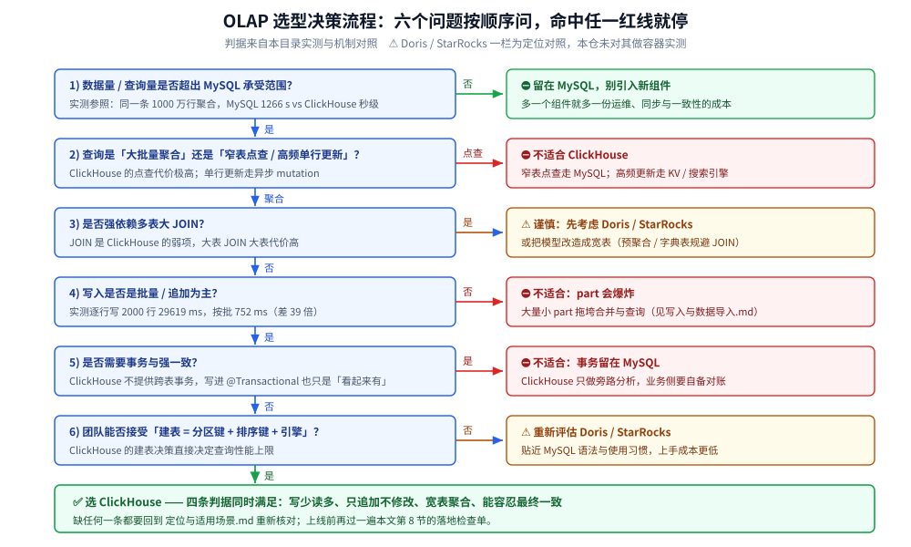
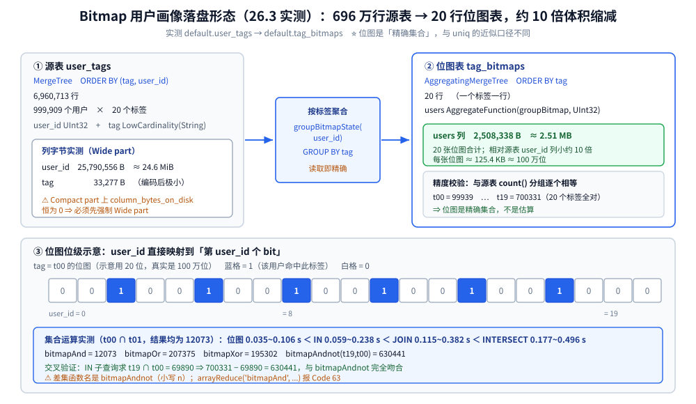
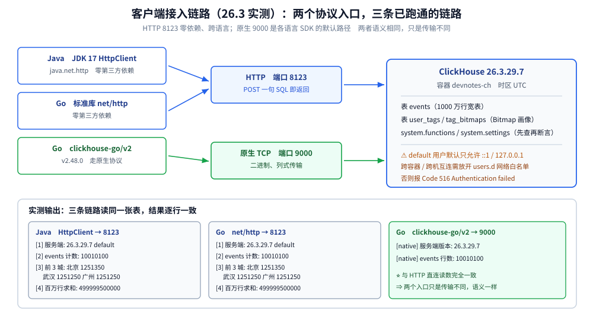

# 选型对比与落地案例

> 本篇回答两个落地问题：**「该不该选 ClickHouse」** 与 **「选了之后怎么把它接进业务」**。前半部分是横向对照 —— 与 Elasticsearch、Doris / StarRocks、MySQL 各自的分工与代价；后半部分是两个可复跑案例 —— **Bitmap 用户画像**（含 22 个标签位的实测读数）与 **Java / Go 客户端接入**（含 Spring Boot 侧的写法）。⚠️ 书为 **2020 年**（全书基于 ClickHouse **19.17.4.11** 编写，演示环境 CentOS 7.7），本篇实测为 **26.3.29.7**（`clickhouse/clickhouse-server:26.3-alpine`，容器名 `devnotes-ch`，时区 UTC），凡书与实测不一致之处逐处标注「**书 2020 口径 vs 26.3 实测**」。
>
> 素材来源：《ClickHouse原理解析与应用实践》（朱凯，机械工业出版社 2020 年）第 1 章「ClickHouse 的前世今生」与第 11 章「管理与运维」的读后整理，**按主题归纳而非逐字摘录**；实测读数取自本目录容器（实验 05 / 07 / 12），素材见 [素材清单](../../../../素材清单.md)。

---

## 一、ClickHouse 在 OLAP 版图里站在哪个位置？

**本节要点**：OLAP 不是一类产品而是一条**光谱** —— 一端是「写好就得快查」的预计算（Kylin / Druid），另一端是「即席查询、扫全量」的 MPP（ClickHouse / Doris）。选型的第一步是判断你的查询**能不能被预定义**。

### 1.1 光谱的两端

| 维度 | 预计算派（Kylin / Druid） | 即席派（ClickHouse / Doris / StarRocks） |
|---|---|---|
| 查询前提 | **必须先定义好维度组合**（Cube） | 任意 SQL，查询时才决定怎么算 |
| 写入代价 | 高（建 Cube / 预聚合） | 低（列式写入，边写边查） |
| 查询延迟 | 极低（查的是算好的结果） | 低（靠向量化 + 列存 + 稀疏索引） |
| 维度爆炸 | ⚠️ Cube 数量随维度组合爆炸 | 不受影响 |
| 典型场景 | 固定报表、固定看板 | 即席分析、多维下钻、日志分析 |

⭐ 判据一句话：**「你的查询能不能提前列完」** —— 能，预计算派更省机器；不能或经常变，走即席派。

### 1.2 ClickHouse 的定位

书第 1 章把它归为「**面向 OLAP 的列式数据库**」，它的三个立身之本（与 [架构与存储引擎.md](架构与存储引擎.md) 第 2 节互为呼应）：

- **列式存储**：只读查询涉及的列，扫描量按列裁剪；
- **向量化执行**：按 block（默认 `max_block_size=65409`）批量算，摊薄函数调用；
- **稀疏主键索引 + 跳数索引**：用 `index_granularity=8192` 行一个 granule 的粒度做粗筛。

⚠️ 书里明确写了它**不支持完整事务、不支持高频单行更新** —— 这一点到 26.3 依然成立（`UPDATE` / `DELETE` 走 `ALTER ... UPDATE` 的异步 mutation，代价极高）。

---

## 二、跟 Elasticsearch 怎么分工？

**本节要点**：两者在「日志 / 检索」这个重叠区经常被拿来比；判据是 **「你要的是全文检索还是要的是聚合分析」** —— ES 强在「找得到」，ClickHouse 强在「算得快」。

| 维度 | Elasticsearch | ClickHouse |
|---|---|---|
| 起家能力 | **全文检索**（倒排索引、分词、相关度打分） | **聚合分析**（列存、向量化、`GROUP BY`） |
| 存储模型 | 倒排索引 + doc values（正排） | 纯列存 + 稀疏索引 |
| 高基数 `GROUP BY` | 靠 doc values，聚合能力弱于 CH | ⭐ 原生强项 |
| 精确去重计数 | `cardinality` 聚合（近似，HLL） | `uniqExact` / **Bitmap**（可精确） |
| 灵活 schema | 强（动态 mapping、任意字段） | 弱（要预先建表，宽表靠 `ALTER`） |
| 写入模式 | 近实时（refresh 间隔，默认 1s） | 批量 part 落盘 + 后台合并 |
| 运维复杂度 | 高（分片 / 副本 / mapping 治理 / JVM 堆） | 中（分片副本 + Keeper，无 JVM） |
| 典型定位 | 日志检索、搜索、可观测性存储 | 报表、画像、宽表聚合 |

⭐ 本仓对**两家都做过容器实测**（ES 见 [搜索与分析选型对比.md](../../搜索与分析/搜索与分析选型对比.md)，ClickHouse 见本目录），所以这条对照不是抄跑分：**同一份数据在两家上的读数区间都来自各自的容器**。

**分工建议**：

```text
「按关键词找到某条日志」 → Elasticsearch
「按城市 / 时间 / 渠道分组统计」 → ClickHouse
两者都要 → 双写：ES 存明细供检索，CH 存宽表供分析（用同一份消息队列喂两侧）
```

⚠️ 别用 ClickHouse 做全文检索（`LIKE '%关键字%'` 只能全扫，[性能调优与基准测试.md](性能调优与基准测试.md) 实测 `LIKE '%北京%'` 在 0.13~0.24 s 量级，看似不慢但**扫描量不随过滤率下降**），也别用 ES 做高基数多维聚合的固定报表。

---

## 三、跟 Doris / StarRocks 这类 MPP 数据库比，差在哪？

**本节要点**：这一类在国内常与 ClickHouse 正面竞争，差别集中在 **JOIN 能力**、**运维形态**、**生态完整度** 三处；ClickHouse 的**短板就是 JOIN**。

| 维度 | ClickHouse | Doris / StarRocks |
|---|---|---|
| 架构 | 分片 + 副本，节点**不对等**（靠 `Distributed` 表拼） | MPP，FE（元数据 / 查询规划）+ BE（存储 / 执行），**对等** |
| 多表 JOIN | ⚠️ 弱项。大表 JOIN 大表代价高，需靠 `GLOBAL JOIN` / 预聚合规避 | ⭐ 强项（CBO 优化器、Runtime Filter、Colocate Join） |
| 实时更新 | ⚠️ 弱（`ReplacingMergeTree` 合并去重是异步的） | 强（Unique Key 模型、主键更新） |
| 元数据 | **无中心元数据**，靠 XML 配置 + Keeper | FE 统一管理，DDL 自动分发 |
| SQL 兼容度 | 自己的方言，MySQL 协议兼容 | 高度兼容 MySQL 协议与语法 |
| 生态 | 函数库极丰富，官方客户端 + 大量社区工具 | 生态较新，兼容 MySQL 生态省心 |
| 上手成本 | 较高（建表要懂分区键 / 排序键 / 引擎家族） | 较低（贴近 MySQL 使用习惯） |

⭐ 判据：

- **宽表 + 大聚合 + 单表为主** → ClickHouse 更省机器、性能上限更高；
- **多表关联多 + 需要实时更新 + 团队 SQL 背景偏 MySQL** → Doris / StarRocks 更省心；
- 本仓**未对 Doris / StarRocks 做容器实测**，上表只作**机制与定位对照**，⚠️ **不含任何性能读数**，选型时请以自己场景的实测为准（方法见 [性能调优与基准测试.md](性能调优与基准测试.md)）。

⭐ 想要**不偏袒任何一家**的族内视角（ClickHouse / MPP 系 / 实时 OLAP / 湖上格式 / 托管云数仓放在一起比）见 [列式数据库选型对比.md](../列式数据库选型对比.md) —— 那里按「数据与元数据归谁」分三条实现路线，并给出族内四条分水岭。

---

## 四、跟 MySQL 比，差多少？

**本节要点**：同一条 1000 万行的 `GROUP BY` + `COUNT(DISTINCT)`，MySQL 实测 **1266 s**，ClickHouse **秒级返回** —— 差三个数量级，这不是调参能追上的，是**存储模型决定的**。

### 4.1 实测对照（实验 05）

| 项 | MySQL 8.0 | ClickHouse 26.3 |
|---|---|---|
| 数据规模 | 1000 万行 | 同规模宽表 |
| 造数耗时 | **514 s** | 几秒~十几秒量级 |
| 同条聚合 | 默认参数 300 s **未返回**；调大 `tmp_table_size`（16 MB → 256 MB）后 **1266.48 s** | **秒级** |
| `COUNT(DISTINCT)` | 精确但代价高（临时表 + 落盘） | `uniqExact` 可精确；`uniq` / `uniqCombined` 近似（误差 +0.19% / +0.11%，见 [物化视图与实时聚合.md](物化视图与实时聚合.md)） |

⚠️ MySQL 侧的两次读数说明一件事：**调参只能把「跑不完」变成「跑得完」**，改不了量级。`tmp_table_size` 调大到 256 MB 后仍花 1266 s，因为它必须逐行比对去重；ClickHouse 走的是列式扫描 + 向量化，天然就是另一个量级。

### 4.2 但它们不是替代关系

| 场景 | 该用谁 |
|---|---|
| 订单 / 用户 / 交易的增删改查、事务 | **MySQL**（唯一选择） |
| 上述数据的「按维度统计」 | 把 MySQL 数据**同步**到 ClickHouse 做分析 |
| 需要强一致的读写 | MySQL |
| 需要窄表高频点查 | MySQL（ClickHouse 点查代价极高） |

⭐ 结论：**ClickHouse 是 MySQL 的旁路分析库，不是它的替代品**。生产上通常是 MySQL 存明细 → CDC / 批量导入 ClickHouse → 报表与画像查 ClickHouse。

---

## 五、什么条件下选 ClickHouse、什么条件下别碰？

**本节要点**：把 [定位与适用场景.md](定位与适用场景.md) 的判据收成一张决策流程 —— 六个问题按顺序问下来即可。

### 5.1 决策流程

```text
1) 数据量 / 查询量是否超出 MySQL 的承受范围？
   否 → 留在 MySQL，别引入新组件
   是 → 下一步

2) 查询是「大批量聚合」还是「窄表点查 / 高频单行更新」？
   窄表点查 / 高频更新 → ⛔ 不适合 ClickHouse（走 MySQL / KV）

3) 是否强依赖多表大 JOIN？
   是 → ⚠️ 谨慎（先考虑 Doris / StarRocks，或改造成宽表）

4) 写入是否是批量 / 追加为主？
   否（大量单行写 / 频繁改） → ⛔ 不适合（part 会爆炸）

5) 是否需要事务与强一致？
   是 → ⛔ 不适合（ClickHouse 不提供跨表事务）

6) 团队能否接受「建表 = 设计分区键 + 排序键 + 引擎」的学习成本？
   否 → 重新评估 Doris / StarRocks
   是 → ✅ 选 ClickHouse
```



### 5.2 一句话判据

⭐ **「写少读多、只追加不修改、宽表聚合、能容忍最终一致」** —— 四条同时满足就是 ClickHouse 的甜区；缺一条就要回到 [定位与适用场景.md](定位与适用场景.md) 重新核对。

---

## 六、落地案例一：Bitmap 用户画像

**本节要点**：这是 ClickHouse 最经典的落地形态之一 —— 把「标签」预聚合为**位图**，用集合运算求交集 / 并集 / 差集。实测 100 万用户 × 20 标签的源表压成 **约 2.51 MB** 的位图表，交集查询在 **0.035~0.106 s**。

### 6.1 数据模型

```text
源表  user_tags(MergeTree, ORDER BY (tag, user_id))
      user_id UInt32 + tag LowCardinality(String)
      → 实测 6,960,713 行 / 999,909 个用户 / 20 个标签

位图表 tag_bitmaps(AggregatingMergeTree, ORDER BY tag)
      tag + users AggregateFunction(groupBitmap, UInt32)
      → 每行一个标签，users 列是「命中该标签的用户」的位图
```

位图的本质是「**user_id → 第 user_id 个 bit**」，所以它**只在 id 是离散整数时才成立** —— 这也是它与 `uniq` 的根本区别（见 6.4）。



建表与生成（实测可复跑）：

```sql
CREATE TABLE user_tags (
    user_id UInt32,
    tag     LowCardinality(String)
)
ENGINE = MergeTree
ORDER BY (tag, user_id);

CREATE TABLE tag_bitmaps (
    tag   LowCardinality(String),
    users AggregateFunction(groupBitmap, UInt32)
)
ENGINE = AggregatingMergeTree
ORDER BY tag;

INSERT INTO tag_bitmaps
SELECT tag, groupBitmapState(user_id) AS users
FROM user_tags
GROUP BY tag;
```

### 6.2 存储代价实测

| 对象 | 字节数 | 说明 |
|---|---|---|
| 源表 `user_id` 列 | **25,790,556** | 约 24.6 MiB（100 万用户 × 20 行） |
| 源表 `tag` 列 | **33,277** | `LowCardinality` 后极小（20 个标签） |
| 位图表 `users` 列（Wide part） | **2,508,338** | 20 张位图合计 ≈ **2.51 MB** |

⭐ 压缩比直观：源表 696 万行翻成 20 行位图，**约 10 倍**的体积缩减（25.8 MB → 2.51 MB），换来的是集合运算从「扫 696 万行」变成「按位与 20 张位图」。

⚠️ **量位图字节必须先做成 Wide part**：`system.parts_columns.column_bytes_on_disk` 在 **Compact part 上恒为 0**，实测必须先 `SETTINGS min_bytes_for_wide_part = 0, min_rows_for_wide_part = 0` 强制 Wide 才读得到真实字节。

### 6.3 集合运算实测

单个位图基数与源表 `count()` 分组**逐个完全相等**（`t00=99939` … `t19=700331`，20 个标签全对）：

```sql
SELECT bitmapCardinality(bitmapAnd(a.users, b.users)) AS cnt_and
FROM tag_bitmaps AS a, tag_bitmaps AS b
WHERE a.tag='t00' AND b.tag='t01';
```

| 运算 | 结果 | 含义 |
|---|---|---|
| `bitmapAnd(t00, t01)` | **12073** | 两个标签都命中 |
| `bitmapOr(t00, t01)` | **207375** | 命中任一 |
| `bitmapXor(t00, t01)` | **195302** | 对称差（只命中一个） |
| `bitmapAndnot(t19, t00)` | **630441** | 命中 t19 但不命中 t00 |

⭐ **交叉验证**（这一步很关键）：用 `IN` 子查询独立算 `t19 ∩ t00`：

```sql
SELECT count() FROM user_tags
WHERE tag='t19' AND user_id IN (SELECT user_id FROM user_tags WHERE tag='t00');
-- → 69890
```

`700331 - 69890 = 630441` **与 `bitmapAndnot(t19, t00)` 完全吻合** —— 说明位图运算的语义没搞错。

### 6.4 耗时对照（同一次运行，各 3 次）

求 `t00 ∩ t01`（结果均为 12073）：

| 方案 | 耗时区间 (s) |
|---|---|
| 位图 `bitmapCardinality(bitmapAnd(...))` | **0.035 ~ 0.106** |
| 位图单函数 `bitmapAndCardinality(...)` | **0.044 ~ 0.079** |
| `IN` 子查询 | 0.059 ~ 0.238 |
| `JOIN` | 0.115 ~ 0.382 |
| `INTERSECT` | 0.177 ~ 0.496 |

求 5 个标签的交集 `t00 ∩ t01 ∩ t02 ∩ t03 ∩ t04`（结果均为 71）：

| 方案 | 耗时区间 (s) |
|---|---|
| 位图嵌套 `bitmapAnd` | **0.080 ~ 0.234** |
| `IN` 链（4 层子查询） | 0.283 ~ 0.610 |

⭐ 趋势清楚：**标签数越多，位图的优势越大**（2 标签时差 2~3 倍，5 标签时差 3~4 倍）。因为位图是「一次位运算」，而 `IN` / `JOIN` 的代价随层数线性增长。⚠️ 耗时是时序类读数、波动大，只断言趋势，不写绝对倍数。

### 6.5 与 `uniq` 的口径差

| 方案 | 100 万用户的去重结果 | 性质 |
|---|---|---|
| `uniq` / `uniqState` | 1001943（误差 **+0.19%**） | ⚠️ **近似** |
| `uniqCombined` | 1001148（误差 +0.11%） | ⚠️ 近似 |
| `Bitmap`（`groupBitmap`） | 与源表 `count()` 分组**逐个相等** | ⭐ **精确** |
| `uniqExact` | 精确 | 精确但代价高 |

⭐ 判据：**要精确且 id 是整数 → 用 Bitmap；id 不是整数或只求个近似规模 → 用 `uniq`**。Bitmap 的代价是「必须能把 id 映射到有限整数区间」（这里是 `UInt32` 的 user_id，值域 0~100 万）。

### 6.6 ⚠️ 函数名坑（实测踩过）

```sql
-- 反面教材：arrayReduce 不接受 bitmapAnd
SELECT bitmapCardinality(arrayReduce('bitmapAnd', groupArray(users)))
FROM tag_bitmaps WHERE tag IN ('t00','t01');
-- Code: 63. DB::Exception: Unknown aggregate function bitmapAnd. There is an ordinary
-- function with the same name, but aggregate function is expected here.
```

两个具体坑：

- 差集函数名是 **`bitmapAndnot`（小写 n）**，不是 `bitmapAndNot`；
- `arrayReduce` 只认**聚合函数**，`bitmapAnd` 是普通函数 → 报 `Code: 63`。要么改用 `groupBitmapAnd` 这类聚合函数族，要么直接对两行位图做 `bitmapAnd`。

⭐ 通用做法：**先查再断言** —— `SELECT name FROM system.functions WHERE lower(name) LIKE '%bitmap%'` 把函数名列出来再写 SQL。

---

## 七、落地案例二：客户端怎么接（Java / Go / Spring Boot）

**本节要点**：ClickHouse 对外只有**两个协议入口** —— HTTP（8123）与 原生 TCP（9000）；各语言客户端都是这两者的封装。实测 Java（JDK 17 `HttpClient`）与 Go（`net/http`）走 HTTP 接口，**输出逐行一致**。

### 7.1 两个入口与各自的封装

| 入口 | 端口 | 特点 | 适合 |
|---|---|---|---|
| HTTP | 8123 | 直接用 `POST` 发 SQL，**零依赖**；能过任何代理 | 跨语言、脚本、临时分析、Serverless |
| 原生 TCP | 9000 | 二进制协议，列式传输，性能更好 | 生产 SDK（`clickhouse-go` / JDBC native） |

```text
Java (JDBC / HttpClient)  ─┐
                           ├→ HTTP 8123  ─→ ClickHouse
Go  (net/http / clickhouse-go) ─→ 原生 9000
```



### 7.2 Java 侧：JDK 17 `HttpClient`（实测可跑）

```java
static String q(HttpClient c, String sql) throws Exception {
    HttpRequest req = HttpRequest.newBuilder(URI.create("http://localhost:8123/"))
            .timeout(Duration.ofSeconds(20))
            .header("X-ClickHouse-User", "default")
            .header("X-ClickHouse-Database", "default")
            .POST(HttpRequest.BodyPublishers.ofString(sql, StandardCharsets.UTF_8))
            .build();
    HttpResponse<String> resp = c.send(req, HttpResponse.BodyHandlers.ofString(StandardCharsets.UTF_8));
    if (resp.statusCode() != 200) {
        throw new IllegalStateException("HTTP " + resp.statusCode() + " -> " + resp.body().trim());
    }
    return resp.body().trim();
}
```

实测输出：

```text
[1] 描述服务端: 26.3.29.7	default
[2] 现成表 events 计数: 10010100
[3] 按城市聚合(前 3): 北京	1251350 | 武汉	1251250 | 广州	1251250
[4] 服务端求值(百万行求和): 499999500000
```

### 7.3 Go 侧：标准库 `net/http`（实测可跑）

```go
func q(c *http.Client, sql string) (string, error) {
	req, err := http.NewRequest(http.MethodPost, "http://localhost:8123/", bytes.NewBufferString(sql))
	if err != nil {
		return "", err
	}
	req.Header.Set("X-ClickHouse-User", "default")
	req.Header.Set("X-ClickHouse-Database", "default")
	resp, err := c.Do(req)
	if err != nil {
		return "", err
	}
	defer resp.Body.Close()
	b, _ := io.ReadAll(resp.Body)
	body := strings.TrimSpace(string(b))
	if resp.StatusCode != http.StatusOK {
		return "", fmt.Errorf("HTTP %d -> %s", resp.StatusCode, body)
	}
	return body, nil
}
```

实测输出**与 Java 侧逐行一致**：

```text
[1] 描述服务端: 26.3.29.7	default
[2] 现成表 events 计数: 10010100
[3] 按城市聚合(前 3): 北京	1251350 | 武汉	1251250 | 广州	1251250
[4] 服务端求值(百万行求和): 499999500000
```

⭐ 「两种语言、同一条 SQL、逐行相同」正是这类 HTTP 接入最容易验证的一点：**没有客户端语义差异，只有 HTTP 请求**。

### 7.4 原生协议：`clickhouse-go/v2`（实测可跑）

HTTP 直连的代价是「每次请求都要重新建连、传输也不是列式的」；生产环境更常用 SDK 走**原生 TCP 9000**。实测 `clickhouse-go/v2 v2.48.0` 可正常拉取并运行：

```go
conn, err := clickhouse.Open(&clickhouse.Options{
    Addr: []string{"127.0.0.1:9000"},
    Auth: clickhouse.Auth{Database: "default", Username: "default"},
})
if err != nil {
    return
}
var v string
if err := conn.QueryRow(ctx, "SELECT version()").Scan(&v); err != nil {
    return
}
fmt.Println("[native] 服务端版本:", v)
```

实测输出：

```text
[native] 服务端版本: 26.3.29.7
[native] events 行数: 10010100
```

⭐ 与本篇 HTTP 直连的读数**完全一致**（同一张 `events` 表、同一条 `count()`），说明「两个入口只是传输不同，语义一样」。依赖拉取走 `GOPROXY=https://goproxy.cn,direct GOSUMDB=off`。

### 7.5 Spring Boot 侧怎么落

Spring Boot 没有官方 starter，落地有两条路：

| 方式 | 依赖 | 写法 | 取舍 |
|---|---|---|---|
| **JDBC**（推荐） | `clickhouse-jdbc` | 配 `DataSource`，用 `JdbcTemplate` / MyBatis 写 SQL | 复用 Spring 事务 / 连接池 / 监控体系，代码最贴近既有习惯 |
| HTTP 手工封装 | 无（用 `RestTemplate` / `WebClient`） | 把 7.2 的 `q()` 包成一个 `@Component` | 零新依赖，但连接管理 / 重试要自己写 |

JDBC 方式的配置骨架：

```yaml
spring:
  datasource:
    url: jdbc:clickhouse://localhost:8123/default
    username: default
    password:
    driver-class-name: com.clickhouse.jdbc.ClickHouseDriver
```

⭐ 注意点：

- **`clickhouse-jdbc` 优先走 HTTP 8123**，所以它天然能用 `spring.datasource` 那套配置；
- ⚠️ **别把 ClickHouse 挂进 `@Transactional`** —— 它不支持跨表事务，写了 `@Transactional` 只会得到「看起来有事务、实际没有」；
- ⚠️ **别用 JPA / Hibernate 自动建表** —— ClickHouse 的分区键 / 排序键 / 引擎在 DDL 里必须显式指定；
- 大批量写用 `INSERT ... SELECT` 或 `batch`，**不要循环单行 `INSERT`**（实测逐行 2000 行要 29619 ms，见 [写入与数据导入.md](写入与数据导入.md)）。

⚠️ **本节实测边界**：Java 侧用 JDK 自带 `java.net.http`，Go 侧分别测了**标准库 `net/http`（HTTP）与 `clickhouse-go/v2 v2.48.0`（原生 9000）**，三条链路都实跑过；**未实测**的是 `clickhouse-jdbc` 驱动（Maven 依赖未在本环境拉取）以及各驱动内部的连接池、超时、失败重试参数 —— 这部分只给配置骨架，不下性能结论。

---

## 八、迁移与落地检查单

**本节要点**：从「决定用」到「上线稳」之间，最容易漏的是 **写入模式** 与 **一致性口径** 两件事。

| 阶段 | 检查项 | 判据 |
|---|---|---|
| 建模 | 分区键是否按时间、且粒度不过细 | `PARTITION BY toYYYYMM(时间)` 起步；分区过多会拖垮合并 |
| 建模 | 排序键是否贴合最常用的过滤 + 聚合维度 | 排序键决定稀疏索引能剪掉多少 granule |
| 建模 | 该用 `LowCardinality` 的列是否用上 | 实测 city 列 327,312 → 25,766 B（12.7 倍） |
| 写入 | 是否批量（≥ 1000 行 / 批） | 逐行写 2000 行 29619 ms vs 按批 752 ms |
| 写入 | ⭐ 去重策略是否明确 | `ReplacingMergeTree` 是**异步**去重，查询时可能看到重复，需要 `FINAL` 或聚合 |
| 查询 | `COUNT(DISTINCT)` 是否已换成 `uniq` / Bitmap | 实测差**一个数量级**（2.0~8.2 s vs 0.28~0.53 s） |
| 查询 | 是否避免了 `SELECT *` 与窄表点查 | 列存下 `SELECT *` 等于放弃列裁剪 |
| 一致性 | ⭐ 是否接受「最终一致」 | ClickHouse 没有跨表事务，业务侧要有对账 |
| 一致性 | 是否明确了「重复 / 缺失」的容忍度 | 分布式表异步写会静默失败（见 [集群与高可用.md](集群与高可用.md)） |
| 运维 | 是否配了监控与告警 | 至少接 `system.replicas` / `system.distribution_queue` |
| 运维 | 是否有数据同步链路的对账 | MySQL → ClickHouse 的 CDC 要定期比对行数与关键指标 |

---

## 使用：客户端接入模板与画像查询模板

**本节要点**：两段可直接套用的模板 —— 一段是最小可用的 HTTP 客户端，一段是标签圈人的常用查询。

### 最小 HTTP 客户端（Go，零依赖）

```go
type CH struct {
	Base string
	User string
	DB   string
	HC   *http.Client
}

func (c *CH) Query(sql string) (string, error) {
	req, err := http.NewRequest(http.MethodPost, c.Base, bytes.NewBufferString(sql))
	if err != nil {
		return "", err
	}
	req.Header.Set("X-ClickHouse-User", c.User)
	req.Header.Set("X-ClickHouse-Database", c.DB)
	resp, err := c.HC.Do(req)
	if err != nil {
		return "", err
	}
	defer resp.Body.Close()
	b, _ := io.ReadAll(resp.Body)
	if resp.StatusCode != http.StatusOK {
		return "", fmt.Errorf("HTTP %d -> %s", resp.StatusCode, strings.TrimSpace(string(b)))
	}
	return strings.TrimSpace(string(b)), nil
}

// 用法：统计某城市在时间窗内的事件数
// out, _ := ch.Query("SELECT count() FROM events WHERE city='北京' FORMAT TSV")
```

### 标签圈人（Bitmap 集合运算）

```sql
-- 1) 同时命中 t00 与 t01 的用户数（精确）
SELECT bitmapCardinality(bitmapAnd(a.users, b.users)) AS cnt
FROM tag_bitmaps AS a, tag_bitmaps AS b
WHERE a.tag = 't00' AND b.tag = 't01';

-- 2) 命中 t00、但没命中 t01（差集）
SELECT bitmapAndnotCardinality(a.users, b.users) AS cnt
FROM tag_bitmaps AS a, tag_bitmaps AS b
WHERE a.tag = 't00' AND b.tag = 't01';

-- 3) 直接把圈中的用户列表取出来（注意限制规模）
SELECT bitmapToArray(bitmapAnd(a.users, b.users)) AS users
FROM tag_bitmaps AS a, tag_bitmaps AS b
WHERE a.tag = 't00' AND b.tag = 't01';

-- 4) 多个标签求交集（标签越多比 IN 越有优势）
SELECT bitmapCardinality(
    bitmapAnd(bitmapAnd(bitmapAnd(bitmapAnd(t0.users, t1.users), t2.users), t3.users), t4.users)
) AS cnt
FROM tag_bitmaps AS t0, tag_bitmaps AS t1, tag_bitmaps AS t2,
     tag_bitmaps AS t3, tag_bitmaps AS t4
WHERE t0.tag='t00' AND t1.tag='t01' AND t2.tag='t02' AND t3.tag='t03' AND t4.tag='t04';
```

⚠️ `bitmapToArray` 会把整张位图展开成数组，**用户量大时不要这么用** —— 圈人平台通常是「位图存 ClickHouse、明细 id 存 KV / 搜索引擎」，先算基数再按需取人。

---

## 延伸追问

- **ClickHouse 能替代 MySQL 吗？** → 不能，也不该这么用。它是旁路分析库：明细与事务留在 MySQL，按维度统计同步到 ClickHouse；单行点查在 ClickHouse 里代价极高。
- **ClickHouse 和 Elasticsearch 该选哪个？** → 看你要的是「找得到」还是「算得快」。全文检索、日志搜索用 ES；高基数多维聚合、报表、画像用 ClickHouse；两者都要就双写。
- **和 Doris / StarRocks 的关键差别是什么？** → JOIN 能力与运维形态。ClickHouse 靠 `Distributed` 表拼集群、无中心元数据、JOIN 是弱项；Doris / StarRocks 是 MPP + 统一 FE，多表关联与实时更新更省心。
- **为什么 MySQL 调大 `tmp_table_size` 还是慢？** → 调参只能把「跑不完」变成「跑得完」，改不了量级：MySQL 必须逐行去重，ClickHouse 走列式扫描 + 向量化，存储模型不同。实测 1266 s vs 秒级。
- **Bitmap 和 `uniq` 该用哪个？** → 要**精确**且 id 是整数（能映射到有限区间）用 Bitmap；id 非整数或只求近似规模用 `uniq`。实测 `uniq` 把 100 万估成 1001943（+0.19%），Bitmap 与源表逐个相等。
- **位图表的存储代价大吗？** → 实测 20 张位图约 **2.51 MB**，相比源表 `user_id` 列的 25.8 MB 缩小约 10 倍；⚠️ 量字节前必须把表做成 **Wide part**，Compact part 上 `column_bytes_on_disk` 恒为 0。
- **为什么 `bitmapAndnot` 里的 n 是小写？** → 函数名就是 `bitmapAndnot`，写成 `bitmapAndNot` 会找不到；先 `SELECT name FROM system.functions WHERE lower(name) LIKE '%bitmap%'` 再断言。
- **`arrayReduce('bitmapAnd', ...)` 为什么报错？** → `arrayReduce` 只接受聚合函数，而 `bitmapAnd` 是普通函数，实测报 `Code: 63`。要用聚合函数族 `groupBitmapAnd`，或直接对两行位图做 `bitmapAnd`。
- **Java / Go 接入该走 HTTP 还是原生协议？** → HTTP（8123）零依赖、跨语言、易验证；原生（9000）性能更好，是各语言 SDK 的默认路径。两者语义一致 —— 实测 Java 与 Go 走 HTTP 输出逐行相同。
- **Spring Boot 里怎么接？** → 优先 `clickhouse-jdbc` + `spring.datasource`（走 HTTP 8123），复用既有 JDBC 体系；⚠️ 不要挂 `@Transactional`（ClickHouse 无跨表事务），也不要用 JPA 自动建表。
- **这篇里 Doris / StarRocks 的对比有实测吗？** → **没有**。本篇只对 ClickHouse 与 MySQL、Elasticsearch 做过容器实测；Doris / StarRocks 一栏是机制与定位对照，**不含任何性能读数**。

## 关联

- [README.md](README.md) — ClickHouse 目录导读（版本坐标与实测口径）
- [定位与适用场景.md](定位与适用场景.md) — 适用与不适用的详细清单，本篇第 5 节是它的决策版
- [架构与存储引擎.md](架构与存储引擎.md) — 为什么列存 + 向量化能拉开与 MySQL 的量级差
- [物化视图与实时聚合.md](物化视图与实时聚合.md) — `uniq` 近似口径与预聚合状态列的读回
- [索引原理与查询优化.md](索引原理与查询优化.md) — 排序键与稀疏索引如何决定查询剪枝
- [写入与数据导入.md](写入与数据导入.md) — 批量写入与 `INSERT ... SELECT`，本篇第 8 节检查单的依据
- [集群与高可用.md](集群与高可用.md) — 分布式表、副本与「最终一致」的落地边界
- [性能调优与基准测试.md](性能调优与基准测试.md) — 基准测试纪律与参数实测默认值
- [搜索与分析选型对比.md](../../搜索与分析/搜索与分析选型对比.md) — ES 与 ClickHouse 的分工，两家都已在本仓实测
- [列式数据库选型对比.md](../列式数据库选型对比.md) — ⭐ **同域的另一层**：不偏袒任何一家、按「数据与元数据归谁」分三条实现路线的族内中立选型（本篇是以 ClickHouse 为出发点的单产品取舍，层次不同）
- [存储选型.md](../../存储选型.md) — 七类存储在系统中的横向定位
> 反向引用（本篇被下列文档引到）：[位图与布隆过滤器.md](../../../../02-计算机基础/数据结构/高级数据结构/位图与布隆过滤器.md)
