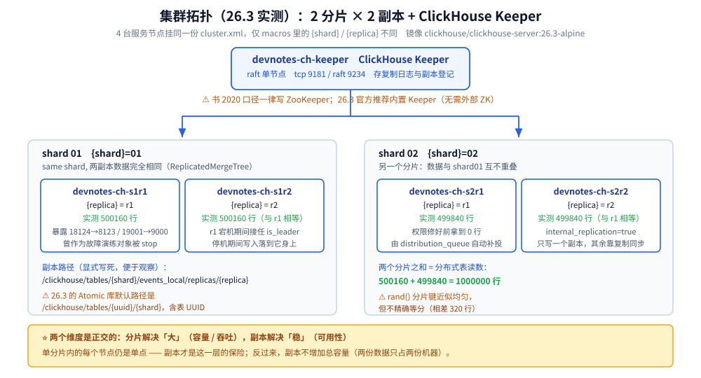
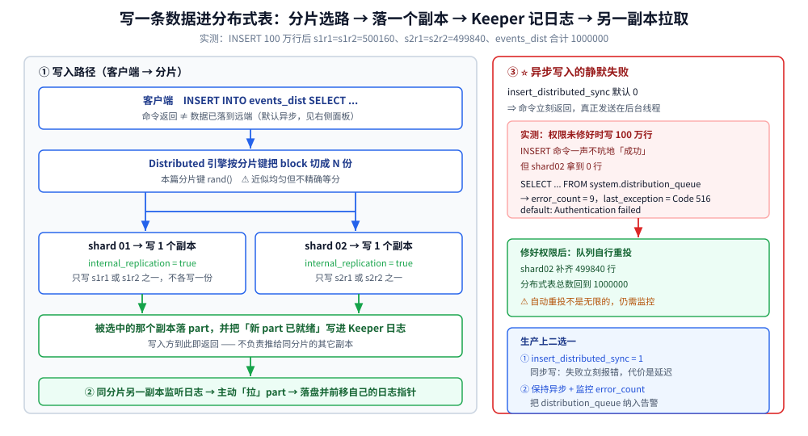
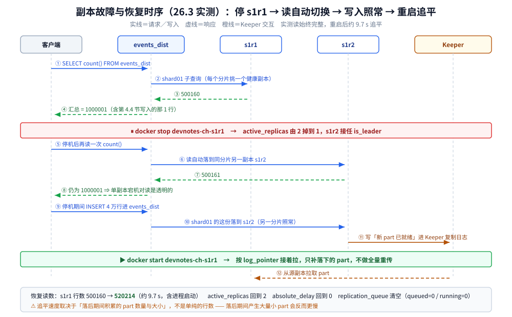

# 集群与高可用

> 本篇覆盖 ClickHouse 的**分布式与高可用**这条链路：单机为什么不够用、集群配置里的四个概念怎么拼起来、Keeper 在副本一致性里扮演什么角色、一条数据写进分布式表之后去了哪、读又落到哪、副本宕机与**整分片宕机**的区别、副本恢复后怎么追平、并行副本读值不值得开、以及用 Prometheus 做集群监控要抓哪些指标；⚠️ 书为 **2020 年**（全书基于 ClickHouse **19.17.4.11** 编写，演示环境 CentOS 7.7），本篇实测为 **26.3.29.7**（`clickhouse/clickhouse-server:26.3-alpine`，时区 UTC），凡书与实测不一致之处逐处标注「**书 2020 口径 vs 26.3 实测**」。
>
> 素材来源：《ClickHouse原理解析与应用实践》（朱凯，机械工业出版社 2020 年）第 10 章「副本与分片」与第 2 章「架构概述」的读后整理，**按主题归纳而非逐字摘录**；实测读数取自本目录容器搭出的 **2 分片 × 2 副本 + ClickHouse Keeper** 集群（实验 11），素材见 [素材清单](../../../../素材清单.md)。

---

## 一、单机为什么不够用？集群要解决的是哪三个问题？

**本节要点**：集群不是「把单机变大」，而是同时解决**容量**、**吞吐**、**可用性**三件事 —— 而且这三件事由**不同的机制**负责，混在一起谈就会漏项。

### 1.1 三个问题各由什么机制回答

| 要解决的问题 | 机制 | 关键配置 |
|---|---|---|
| 数据量超过单机磁盘 | **分片**（shard）：按分片键把行分散到多个节点 | `<remote_servers>` 里的多个 `<shard>` |
| 单机读 / 写吞吐到顶 | **分片** + 分布式表并行下发 | `Distributed` 表引擎 |
| 单个节点挂了不能停服 | **副本**（replica）：同一分片内多份数据 | `ReplicatedMergeTree` + Keeper |

⭐ 这里最容易混的一句是：**分片解决「大」，副本解决「稳」**。分片把数据切开之后，**单分片内的每个节点依然是单点** —— 副本才是这一层的保险。反过来，副本不解决容量：两份数据放在两台机器上，总容量并没有变。

### 1.2 分片与副本是两个正交的维度

一个 `shard` 里可以有多个 `replica`；一个 `replica` 只属于一个 `shard`。本篇实测的拓扑是 **2 分片 × 2 副本 = 4 个服务节点**：

```text
                 devnotes-ch-keeper  (ClickHouse Keeper, raft, 单节点)
                          |
      +-------------------+-------------------+
      |                                       |
   shard 01                                shard 02
   +---------------+                       +---------------+
   | s1r1  | s1r2  |                       | s2r1  | s2r2  |
   | {replica}=r1  |                       | {replica}=r1  |
   | {replica}=r2  |                       | {replica}=r2  |
   +---------------+                       +---------------+
      同一分片内两副本数据相同              同一分片内两副本数据相同
```

⚠️ 注意 4 个节点用的是**同一份** `cluster.xml`，只有 `<macros>` 里的 `{shard}` / `{replica}` 不同（见 [第 2 节](#二clickhouse-的集群是怎么拼出来的配置里有哪几个概念)）。



---

## 二、ClickHouse 的集群是怎么「拼」出来的？配置里有哪几个概念？

**本节要点**：ClickHouse **没有中心化的集群元数据** —— 它只有一份 XML 配置，四个概念（`remote_servers` / `macros` / `zookeeper` / `distributed_ddl`）各自负责一件事，理解这四个就理解了整个集群。

### 2.1 四个配置块各自管什么

| 配置块 | 作用 | 少了它会怎样 |
|---|---|---|
| `<remote_servers>` | 定义**逻辑集群**：哪些 shard、每个 shard 有哪些 replica | `Distributed` 表建不起来（找不到集群名） |
| `<macros>` | 给**本节点**起名：`{shard}` / `{replica}` / `{cluster}` | `ReplicatedMergeTree` 建不起来（宏没值） |
| `<zookeeper>` | 指向 Keeper / ZooKeeper 地址 | 副本之间无法协调，表建不起来 |
| `<distributed_ddl>` | `ON CLUSTER` 的 DDL 任务队列路径 | `ON CLUSTER` 不生效，要逐台手工建表 |

本篇实验里 `remote_servers` 的核心片段（**4 台挂的是同一份**）：

```xml
<remote_servers>
    <devnotes_cluster>
        <shard>
            <internal_replication>true</internal_replication>
            <replica><host>devnotes-ch-s1r1</host><port>9000</port></replica>
            <replica><host>devnotes-ch-s1r2</host><port>9000</port></replica>
        </shard>
        <shard>
            <internal_replication>true</internal_replication>
            <replica><host>devnotes-ch-s2r1</host><port>9000</port></replica>
            <replica><host>devnotes-ch-s2r2</host><port>9000</port></replica>
        </shard>
    </devnotes_cluster>
</remote_servers>
```

而每台**只改** `macros`：

```xml
<macros>
    <cluster>devnotes_cluster</cluster>
    <shard>01</shard>      <!-- s1r1 / s1r2 为 01；s2r1 / s2r2 为 02 -->
    <replica>r1</replica>  <!-- 每台各不相同 -->
</macros>
```

### 2.2 `internal_replication` 为什么必须是 `true`

它决定「**写一个 shard 时，Distributed 表是往所有副本各写一份，还是只写一个副本、由复制机制自己同步**」：

| 取值 | 行为 | 后果 |
|---|---|---|
| `false`（默认） | Distributed 把同一份数据发给该 shard 的**每个副本** | 每台各存一份，**复制机制形同虚设**，还可能重复 |
| `true` ✅ | 只写**一个**副本，其余靠 `ReplicatedMergeTree` 自动同步 | 数据不重复、写入放大减半 |

⭐ 只要表引擎是 `ReplicatedMergeTree`，`internal_replication` 就该是 `true` —— 这两个是配套的，写 `false` 等于让复制白做。书本节口径一致，26.3 未变。

### 2.3 实测：集群定义确实被四台一致地读到

```text
SELECT cluster, shard_num, replica_num, host_name, port, is_local
FROM system.clusters WHERE cluster='devnotes_cluster' ORDER BY shard_num, replica_num
```

```text
devnotes_cluster  1  1  devnotes-ch-s1r1  9000  1
devnotes_cluster  1  2  devnotes-ch-s1r2  9000  0
devnotes_cluster  2  1  devnotes-ch-s2r1  9000  0
devnotes_cluster  2  2  devnotes-ch-s2r2  9000  0
```

`system.macros` 也逐台正确：

```text
devnotes-ch-s1r1  cluster  devnotes_cluster
devnotes-ch-s1r1  replica  r1
devnotes-ch-s1r1  shard    01
```

### 2.4 书 2020 口径 vs 26.3 实测

| 项 | 书 2020 口径 | 26.3 实测 |
|---|---|---|
| 协调组件 | 一律说 **ZooKeeper** | 官方推荐 **ClickHouse Keeper**（内置，可与 server 同进程） |
| 副本路径 | 显式写 `'/clickhouse/tables/{shard}/<表>'` | Atomic 库默认 `default_replica_path` 为 `/clickhouse/tables/{uuid}/{shard}`；显式路径仍可用 |

⚠️ 本篇实验为可控起见**显式写了路径**，所以 Keeper 里看到的是 `/clickhouse/tables/01/events_local` 而不是 uuid 形态；生产环境若依赖默认值，路径里会出现表 UUID。

---

## 三、副本怎么保证一致？Keeper（ZooKeeper）在里面做什么？

**本节要点**：副本之间**不直接通信**，全部通过 Keeper 交换「日志条目」；Keeper 是副本一致性的**唯一仲裁者** —— 它挂了，副本表会进入只读。

### 3.1 Keeper 上存了什么

以本篇的表为例，逐层列出 Keeper 里的节点：

```text
SELECT name, value FROM system.zookeeper WHERE path='/clickhouse/tables/01/events_local'
```

实测的关键子节点与含义：

| 节点 | 含义 |
|---|---|
| `metadata` | 表的元数据（主键、分区键、`index granularity: 8192`、`granularity bytes: 10485760`） |
| `columns` | 列定义（4 列，含类型） |
| `log` | ⭐ **复制日志**，副本靠它拉取「该做什么」 |
| `replicas/r1`、`replicas/r2` | 每个副本的登记项，含各自进度 |
| `leader_election` | ⭐ 副本内的**领导选举**（负责指派合并任务），26.3 新增多领导机制 |
| `block_numbers` / `blocks` / `quorum` | 块编号与写入法定人数相关 |
| `mutations` / `alter_partition_version` | `ALTER` / 变更任务的登记 |
| `table_shared_id` | 表共享标识 |

```text
SELECT path FROM system.zookeeper WHERE path='/clickhouse/tables/01/events_local/replicas'
→ /clickhouse/tables/01/events_local/replicas/r1
  /clickhouse/tables/01/events_local/replicas/r2
```

### 3.2 「数据怎么同步」的一句话版本

写入某个副本 → 该副本把「新 part 已就绪」写成 **Keeper 日志里的一条条目** → 同分片的其它副本**监听日志**、拉到条目后**从源副本拉取 part 文件** → 落盘后各自更新进度指针。

⭐ 所以复制是**拉模式（pull）**：发起方写完就走，不负责推给谁；这解释了为什么「写一个副本，另一个副本稍后才可见」。

### 3.3 `system.replicas` 必看的几列

s1r1 上的完整关键列实测值：

```text
database:            default
table:               events_local
engine:              ReplicatedMergeTree
is_leader:           1                -- 本副本是否被选为领导（负责指派合并）
is_readonly:         0                -- ⭐ 1 = 副本只读（多为 Keeper 失联）
is_session_expired:  0
future_parts:        0                -- 已在队列、尚未拉完的 part
zookeeper_path:      /clickhouse/tables/01/events_local
replica_name:        r1
replica_path:        /clickhouse/tables/01/events_local/replicas/r1
queue_size:          0                -- ⭐ 复制队列长度，持续 >0 说明跟不上
log_max_index:       2
log_pointer:         3                -- ⭐ 本副本已消费到日志的哪一条
total_replicas:      2
active_replicas:     2                -- ⭐ 当前活着的副本数，掉到 1 就是降级
absolute_delay:      0                -- ⭐ 落后秒数，最直观的告警项
```

⭐ **告警优先级**：`is_readonly=1`（写不进去）> `absolute_delay` 持续增长 > `queue_size` 持续 >0 > `active_replicas` 小于 `total_replicas`。

---

## 四、写一条数据进分布式表，它去了哪？

**本节要点**：一次写入经过「**分片键选路 → 落到一个副本 → Keeper 记日志 → 另一副本拉取**」四步；中途任何一个副本失败，**默认不会报错**，而是静默进 `system.distribution_queue`。

### 4.1 写入路径

```text
客户端 → INSERT INTO events_dist
   ↓ Distributed 引擎按分片键（rand()）把 block 切成 N 份
shard 01 ← 一份 → 写入 s1r1（internal_replication=true → 只选一个副本）
shard 02 ← 另一份 → 写入 s2r1 或 s2r2
   ↓
s1r1 落 part → 写 Keeper 日志 → s1r2 拉取 part
```



### 4.2 实测：100 万行的落点

```text
INSERT INTO events_dist SELECT ... FROM numbers(1000000);
```

| 节点 | 行数 |
|---|---|
| s1r1 / s1r2 | **500160 / 500160**（同分片两副本**相等** ⇒ 复制生效） |
| s2r1 / s2r2 | **499840 / 499840**（同样相等） |
| `events_dist` | **1000000** |

⚠️ `rand()` 分片键的分配**近似均匀但不精确等分**（500160 vs 499840，差 320 行）。想要精确均匀得用 `cityHash64(分片字段)` 并保证分片字段基数足够大。

### 4.3 ⭐ 坑：写入失败是**静默**的

实验里我先在「副本间互连被拒」的状态下写了 100 万行 —— `INSERT` 命令**一声不吭地成功了**，但 shard2 拿到 0 行：

```sql
SELECT table, is_blocked, error_count, substring(last_exception,1,80)
FROM system.distribution_queue
```

```text
events_dist  0  9  Code: 516. DB::Exception: ... default: Authentication failed ...
```

原因：`insert_distributed_sync` **默认 0**，Distributed 写入是**异步**的 —— 命令返回时数据只是进了本地队列，真正发送在后台线程。失败只落在 `system.distribution_queue`。

⭐ 修好权限后**队列自行重投**，shard2 补齐 499840、总数回到 1000000 —— 这个「自动重投」是异步写的兜底能力，但它**不是无限的**，`error_count` 会一直涨，仍需监控。

> 生产建议：要么开 `insert_distributed_sync=1`（同步写，失败立刻报错、代价是延迟），要么把 `system.distribution_queue` 的 `error_count` 纳入告警。

### 4.4 副本复制的实测证据

直接往 **shard01 的 r1** 本地表写一行，验证复制方向：

```text
INSERT INTO events_local (...) VALUES ('2026-03-01 00:00:00','replica_test@r1',1,1);
→ s1r1 自己看到 1 行
→ s1r2（同分片另一副本）也看到 1 行        ✅ 复制生效
→ s2r1（另一个分片）看到 0 行              ✅ 不跨分片
```

⭐ 这条判据很实用：**同分片另一副本能查到、别的分片查不到**，就说明「副本 + 分片」两个机制都正常。此时 `system.replication_queue` 为空（`queued=0 / running=0`）。

---

## 五、读一条查询，它又去了哪？

**本节要点**：`Distributed` 表的读是「**每个分片挑一个副本 + 本机聚合**」；选哪个副本可以按算法切换，也可以用 `max_parallel_replicas` 让一个分片内的多个副本一起算。

### 5.1 读路径

```text
SELECT ... FROM events_dist
   ↓ Distributed 把查询下发到每个 shard（每个 shard 只挑 1 个健康副本）
shard01 → s1r1 或 s1r2 本地聚合
shard02 → s2r1 或 s2r2 本地聚合
   ↓ 发起节点汇总两分片的中间结果
返回客户端
```

⭐ 关键点：**默认不会**让同分片两个副本各算一半 —— 那是 [第 8 节](#八并行副本读是什么什么时候值得开) 的 `max_parallel_replicas`。

### 5.2 副本选择与降级

`Distributed` 选副本时会跳过明显有问题的副本（`readonly` / 落后太多）。实测把 s1r1 停掉后，读自动落到 s1r2，**总数依然是完整的 1000001 行**（含第 4.4 节写进去的那 1 行）。这说明单副本故障对**读**是透明的。

### 5.3 书 2020 口径 vs 26.3 实测

书中「读副本选择」讲的是 `load_balancing` 的几个取值（`random` / `nearest_hostname` / `in_order` / `first_or_random`）。26.3 这些仍可用，且新增了 `DistributedConnectionSkipReadOnlyReplica` / `DistributedConnectionStaleReplica` 等 `ProfileEvents` 计数，**副本被跳过的原因可以直接被观测到**（见 [第 9 节](#九集群怎么监控prometheus--系统表--grafana)）。

---

## 六、一个副本宕机了会怎样？整分片宕机又会怎样？

**本节要点**：**单副本宕机是透明的，整分片宕机是致命的** —— 前者自动切换，后者默认**硬报错**；如果为了「不报错」而加 `skip_unavailable_shards=1`，得到的是**静默的残缺结果**。



### 6.1 副本宕机（`docker stop devnotes-ch-s1r1`）

| 观测项 | 读数 |
|---|---|
| 分布式读总数 | **1000001**（完整，读落到 s1r2） |
| `system.replicas`（在 s1r2 上） | `total_replicas=2 / active_replicas=1`，`is_leader=1`（接任领导） |
| 停机期间 `INSERT INTO events_dist` 4 万行 | ⭐ **写入成功**，s1r2 达到 520214 |

⭐ 结论：**同一分片还有活副本时，读写都不中断**，只是 `active_replicas` 掉到 1 —— 此时该分片**已经没有冗余**，任何再挂一台都会升级成整分片故障。

### 6.2 整分片宕机（停 r1 + r2）

```text
-- 默认（严格）
SELECT count() FROM events_dist
→ Code: 279. DB::Exception: All connection tries failed. Log: ...
```

硬失败。这是**正确**的行为 —— 宁可报错，也不要悄悄少算。

```text
-- 加上 skip_unavailable_shards=1
SELECT count() FROM events_dist SETTINGS skip_unavailable_shards=1
→ 519787
```

⚠️ **这是本篇最危险的一个读数**：519787 只是 shard02 的行数，整个 shard01 的 52 万行**无声无息地消失了**，查询照样「成功返回」。

⭐ 判据：
- **监控 / 对账类查询**：保持默认严格模式 —— 缺数据就该失败；
- **看板 / 报表类查询**：可以用 `skip_unavailable_shards=1` 保可用，但**必须同时把 `active_replicas` 的告警接上**，否则没人知道看板少了半个分片。

### 6.3 书 2020 口径 vs 26.3 实测

`skip_unavailable_shards` 书里未展开。26.3 的报错码为 `Code: 279`，错误文本为 `All connection tries failed`，可据此在客户端做降级判断。

---

## 七、副本恢复后怎么追平？

**本节要点**：副本重启后会**从 Keeper 的日志指针接着拉**，只补落下的部分，**不需要全量重传**；本篇实测追平 4 万行用了几秒量级。

### 7.1 追平过程

```text
docker stop  → 副本停止消费 Keeper 日志（log_pointer 停在原处）
写入照常    → 其它副本把新 part 写进 Keeper log
docker start → 重启副本读 log_pointer → 发现落后 → 按日志逐条从源副本拉 part → 更新 log_pointer
```

### 7.2 实测

- s1r1 重启后**约 9.7 s**（含进程启动时间）行数从 500160 追到 **520214**，与 s1r2 一致；
- 追平后 `system.replication_queue` 回到 `queued=0 / running=0`；
- `active_replicas` 回到 **2**，`absolute_delay` 回到 0。

⭐ 追平速度取决于**落后期间积累的 part 数量和大小**，不是单纯的行数 —— 如果落后期间产生了几百个小 part，追平会反而更慢（这也是 [写入与数据导入.md](写入与数据导入.md) 里强调「批量写」的原因之一）。

---

## 八、并行副本读是什么？什么时候值得开？

**本节要点**：它让**同一个分片内的多个副本一起算**一条查询；实测在本篇规模（50 万行 / 2 副本）下**开启后没有加速反而略慢** —— 这是一个典型的「机制存在 ≠ 此刻有用」。

### 8.1 26.3 里怎么开

⚠️ **开关注意有两套，且默认都关**：

```text
allow_experimental_parallel_reading_from_replicas  0   -- 旧名，仍存在
enable_parallel_replicas                           0   -- 新名，26.3 推荐
max_parallel_replicas                           1000   -- ⭐ 书 2020 写 1，实测默认 1000
```

### 8.2 ⭐ 两个必踩的报错

**① 直查副本表但不给集群**：

```text
SELECT ... FROM events_local SETTINGS enable_parallel_replicas=1, max_parallel_replicas=2
→ Code: 701. DB::Exception: Reading in parallel from replicas is enabled but cluster
  to execute query is not provided. Please set 'cluster_for_parallel_replicas' setting.
```

**② 给了多分片集群**：

```text
... SETTINGS cluster_for_parallel_replicas='devnotes_cluster'
→ Code: 714. DB::Exception: `cluster_for_parallel_replicas` setting refers to cluster
  with 2 shards. Expected a cluster with one shard.
```

⭐ **并行副本读是「分片内」的并行，所以它要求一个「单分片集群」定义**。为此本篇另外定义了一个只含 shard01 两个副本的集群：

```xml
<remote_servers>
    <devnotes_single>
        <shard>
            <internal_replication>true</internal_replication>
            <replica><host>devnotes-ch-s1r1</host><port>9000</port></replica>
            <replica><host>devnotes-ch-s1r2</host><port>9000</port></replica>
        </shard>
    </devnotes_single>
</remote_servers>
```

### 8.3 实测：开了确实生效，但没有变快

用 `devnotes_single` 后 `ParallelReplicasUsedCount` 从 **0 → 1**，证明机制生效：

| 开关 | 三次耗时 (ms) | 结果值 |
|---|---|---|
| `enable_parallel_replicas=0` | 43 / 50 / 84 | `count=500160` |
| `enable_parallel_replicas=1, max_parallel_replicas=2` | 45 / 104 / 157 | 同上 |

⚠️ **本规模下并行副本反而略慢**。原因很直白：50 万行扫描本来就是几十毫秒级，**协调开销（找副本、下发子查询、合并中间结果）大于省下的扫描时间**。`ParallelReplicasCount` 两次都是 0，只有 `ParallelReplicasUsedCount` 有差别。

⭐ 判据：并行副本读适合**单分片内副本多、单查询扫描量大**的场景；数据量小的时候只会白付协调成本。别看到「并行」两个字就默认它更快 —— 这正是「拿跑分当结论」的典型反例。

---

## 九、集群怎么监控？Prometheus + 系统表 + Grafana

**本节要点**：两套数据源 —— **`system` 表**看「现在这一刻的状态」，**Prometheus 指标**看「趋势与告警」；本篇实测在 26.3 上打开内置端点拿到 **8816 行 / 469 个 `ClickHouseMetrics_` 指标**。

### 9.1 打开内置 Prometheus 端点

26.3 **默认不开** 9363 端口（实测 `wget http://127.0.0.1:9363/metrics` 直接连接失败）。加一段 `config.d` 即可：

```xml
<prometheus>
    <endpoint>/metrics</endpoint>
    <port>9363</port>
    <metrics>1</metrics>
    <events>1</events>
    <asynchronous_metrics>1</asynchronous_metrics>
</prometheus>
```

打开后实测：

```text
wget -qO- http://127.0.0.1:9363/metrics → exit=0
行数 8816，其中 ClickHouseMetrics_ 前缀的 469 个
ClickHouseAsyncMetrics_ReplicasMaxAbsoluteDelay  0
```

### 9.2 副本与分布式相关的关键指标（实测抓取到的原名）

```text
# 副本健康
ClickHouseMetrics_ReadonlyReplica
ClickHouseMetrics_ReplicaReady
ClickHouseMetrics_ReplicatedChecks
ClickHouseMetrics_ReplicatedFetch
ClickHouseMetrics_ReplicatedSend
ClickHouseAsyncMetrics_ReplicasMaxAbsoluteDelay
ClickHouseAsyncMetrics_ReplicasMaxRelativeDelay
ClickHouseAsyncMetrics_ReplicasMaxQueueSize
ClickHouseAsyncMetrics_ReplicasMaxInsertsInQueue
ClickHouseAsyncMetrics_ReplicasMaxMergesInQueue
ClickHouseAsyncMetrics_ReplicasSumQueueSize
```

```text
# 分布式连通性（定位「哪个副本被跳过、为什么」）
ClickHouseProfileEvents_DistributedConnectionTries
ClickHouseProfileEvents_DistributedConnectionUsable
ClickHouseProfileEvents_DistributedConnectionFailTry
ClickHouseProfileEvents_DistributedConnectionFailAtAll
ClickHouseProfileEvents_DistributedConnectionReconnectCount
ClickHouseProfileEvents_DistributedConnectionSkipReadOnlyReplica
ClickHouseProfileEvents_DistributedConnectionStaleReplica
ClickHouseProfileEvents_DistributedConnectionMissingTable
ClickHouseProfileEvents_DistributedAsyncInsertionFailures
ClickHouseProfileEvents_DistributedDelayedInserts
```

### 9.3 `system` 表与指标的配合

| 要查什么 | 用哪张系统表 | 对应指标 |
|---|---|---|
| 副本是否只读、落后多少 | `system.replicas`（`is_readonly` / `absolute_delay`） | `ReadonlyReplica` / `ReplicasMaxAbsoluteDelay` |
| 复制队列是否堆积 | `system.replication_queue`（`queued` / `running`） | `ReplicasMaxQueueSize` |
| 异步写入是否失败 | `system.distribution_queue`（`error_count` / `last_exception`） | `DistributedAsyncInsertionFailures` |
| 分片拓扑与健康状况 | `system.clusters` | — |
| Keeper 里的副本元数据 | `system.zookeeper` | — |

⭐ Grafana 侧的典型做法：**一个 dashboard 对应一个数据源**，副本层用 `ReplicasMaxAbsoluteDelay` 出曲线，节点层用 `system.replicas` 出表格 —— 两者互为补充（曲线看趋势，表格看「此刻哪张表出问题」）。

### 9.4 书 2020 口径 vs 26.3 实测

书中监控一节以 **`system` 表 + 自建采集脚本**为主，内置 Prometheus 端点并非重点。26.3 开箱即带 `/metrics`，**无需第三方 exporter**，但默认关闭，需要显式配置端口。

---

## 十、上线一个 ClickHouse 集群要盯哪些点？

**本节要点**：按「配 → 建 → 写 → 读 → 监控」五步走，每步都有本篇实测踩到的具体坑。

| 阶段 | 检查项 | 判据 / 踩过的坑 |
|---|---|---|
| 配 | 4 台 `cluster.xml` 是否只差 `macros` | 配错会导致「表建在错误的 shard 上」 |
| 配 | ⭐ `default` 用户网络白名单 | 官方镜像默认只允许 `::1` / `127.0.0.1`，容器 / 跨机互连全报 `Code 516` |
| 配 | `internal_replication=true` | 配合 `ReplicatedMergeTree`，否则复制白做且写入放大 |
| 建 | DDL 用 `ON CLUSTER` | 保证四台表结构一致；`distributed_ddl` 路径要配 |
| 写 | ⭐ `insert_distributed_sync` 与队列告警 | 默认异步，失败**静默**；不监控 `error_count` 就永远不知道少了数据 |
| 写 | 分片键基数要够 | `rand()` 近似均匀但不精确；按业务键 `cityHash64(...)` 更可控 |
| 读 | ⭐ 是否使用 `skip_unavailable_shards=1` | 用了就必须接 `active_replicas` 告警，否则静默残缺 |
| 读 | 并行副本读只在「单分片集群」上开 | 多分片集群直接报 `Code 714` |
| 监控 | 打开 9363 端点 + 配 Grafana | 默认关闭；端点开了才有曲线可用 |
| 监控 | 四条告警底线 | `is_readonly=1` / `absolute_delay` 增长 / `queue_size` 持续 >0 / `active_replicas` 下降 |

---

## 使用：最小集群配置模板与常用运维 SQL

**本节要点**：下面两段可直接复跑 —— 前一段是节点侧配置，后一段是日常巡检 SQL。

### 节点侧配置（每台只改 `macros`）

```xml
<!-- /etc/clickhouse-server/config.d/cluster.xml -->
<clickhouse>
    <zookeeper>
        <node><host>devnotes-ch-keeper</host><port>9181</port></node>
    </zookeeper>
    <remote_servers>
        <devnotes_cluster>
            <shard>
                <internal_replication>true</internal_replication>
                <replica><host>devnotes-ch-s1r1</host><port>9000</port></replica>
                <replica><host>devnotes-ch-s1r2</host><port>9000</port></replica>
            </shard>
            <shard>
                <internal_replication>true</internal_replication>
                <replica><host>devnotes-ch-s2r1</host><port>9000</port></replica>
                <replica><host>devnotes-ch-s2r2</host><port>9000</port></replica>
            </shard>
        </devnotes_cluster>
        <devnotes_single>
            <shard>
                <internal_replication>true</internal_replication>
                <replica><host>devnotes-ch-s1r1</host><port>9000</port></replica>
                <replica><host>devnotes-ch-s1r2</host><port>9000</port></replica>
            </shard>
        </devnotes_single>
    </remote_servers>
    <macros>
        <cluster>devnotes_cluster</cluster>
        <shard>01</shard>
        <replica>r1</replica>
    </macros>
    <distributed_ddl>
        <path>/clickhouse/task_queue/ddl</path>
    </distributed_ddl>
</clickhouse>
```

### 建表（`ON CLUSTER` 一次到位）

```sql
CREATE TABLE default.events_local ON CLUSTER devnotes_cluster (
    event_time DateTime,
    region     String,
    user_id    UInt32,
    amount     UInt32
) ENGINE = ReplicatedMergeTree('/clickhouse/tables/{shard}/events_local', '{replica}')
PARTITION BY toYYYYMM(event_time)
ORDER BY (region, event_time);

CREATE TABLE default.events_dist ON CLUSTER devnotes_cluster AS default.events_local
ENGINE = Distributed('devnotes_cluster', 'default', 'events_local', rand());
```

### 日常巡检

```sql
-- 1) 副本健康：只读 / 落后 / 队列
SELECT hostName() AS host, database, table, is_readonly, is_leader,
       total_replicas, active_replicas, absolute_delay, queue_size
FROM clusterAllReplicas('devnotes_cluster', system.replicas)
ORDER BY table, host;

-- 2) 复制队列是否堆积
SELECT database, table, count() AS queued, countIf(is_currently_executing) AS running
FROM clusterAllReplicas('devnotes_cluster', system.replication_queue)
GROUP BY database, table ORDER BY queued DESC;

-- 3) ⭐ 异步写入有没有失败
SELECT hostName() AS host, table, is_blocked, error_count,
       substring(last_exception, 1, 120) AS err
FROM clusterAllReplicas('devnotes_cluster', system.distribution_queue)
WHERE error_count > 0;

-- 4) 分片间行数是否均衡（同一张本地表）
SELECT hostName() AS host, count() AS rows
FROM clusterAllReplicas('devnotes_cluster', default.events_local)
GROUP BY host ORDER BY host;
```

⚠️ `clusterAllReplicas` 需要集群名；`FROM clusterAllReplicas(...)` 会**逐个副本**查同一张本地表 —— 巡检副本一致性时正好用它的「全都要」语义。

---

## 延伸追问

- **副本和分片是一回事吗？** → 不是。分片把数据**切开**（解决容量与吞吐），副本把同一份数据**存多份**（解决可用性）；一个 shard 内可以有多个 replica，一个 replica 只属于一个 shard。
- **`internal_replication` 设成 `true` 和 `false` 有什么实际差别？** → `true` 时 Distributed 只写一个副本、其余靠复制同步；`false` 时会往每个副本各写一份，复制机制形同虚设且写入放大。只要引擎是 `ReplicatedMergeTree` 就应当设 `true`。
- **为什么 `INSERT INTO` 分布式表成功了，数据却少了一半？** → `insert_distributed_sync` 默认 0，写入异步；失败只记在 `system.distribution_queue.error_count`，命令本身不报错。要么开同步写，要么监控 `error_count`。
- **副本之间是推还是拉？** → **拉**。写入方把「有新 part」写进 Keeper 日志就返回，其它副本监听日志后从源副本拉取文件，因此同分片另一副本的数据是**稍后才可见**的。
- **`absolute_delay` 和 `queue_size` 哪个更该先看？** → 先看 `is_readonly`（写不进去是最高优先级），再看 `absolute_delay`（落后秒数直接对应数据陈旧程度），最后看 `queue_size`（堆积量）。
- **单个副本挂掉，读会受影响吗？** → 不会。实测停掉 s1r1 后分布式读仍返回完整的 1000001 行，读自动落到 s1r2；此时该分片 `active_replicas=1`，已无冗余。
- **整个分片挂掉会怎样？** → 默认**硬报错**（`Code: 279 All connection tries failed`）。加 `skip_unavailable_shards=1` 会返回残缺结果（实测 519787，丢掉整个 shard01），必须配 `active_replicas` 告警。
- **副本重启后要全量重传吗？** → 不用。副本按 Keeper 里的 `log_pointer` 只补落后部分；本篇实测 4 万行、约 9.7 s（含进程启动）追平。
- **`max_parallel_replicas` 默认是多少？** → 书 2020 写 1，**26.3 实测默认 1000**。真正决定是否启用的是 `enable_parallel_replicas`（新名）或 `allow_experimental_parallel_reading_from_replicas`（旧名），两者默认都是 0。
- **为什么开了并行副本读却报 `Code 714`？** → `cluster_for_parallel_replicas` 必须指向一个**单分片**集群；并行副本读是「分片内」的并行，多分片集群不适用。
- **并行副本读一定更快吗？** → 不一定。50 万行 / 2 副本实测开启后反而略慢（45~157 ms vs 43~84 ms），协调开销大于省下的扫描时间；它适合单分片内副本多、单查询扫描量大的场景。
- **Prometheus 端点默认开吗？** → 不开。26.3 需显式配置 `prometheus.port`（本篇用 9363），打开后实测可拿到 8816 行指标、469 个 `ClickHouseMetrics_`。
- **Keeper 挂了会怎样？** → 副本表进入只读（`system.replicas.is_readonly=1`），已有数据仍可读但无法写入与合并；`is_readonly` 因此是最高优先级告警项。

## 关联

- [README.md](README.md) — ClickHouse 目录导读（版本坐标与实测口径）
- [架构与存储引擎.md](架构与存储引擎.md) — MergeTree 家族与 part 落盘结构，本篇的副本基于 `ReplicatedMergeTree`
- [数据模型与表设计.md](数据模型与表设计.md) — 分片键与分区键在建表时的取舍
- [写入与数据导入.md](写入与数据导入.md) — 写入批量与 part 数量，直接影响副本追平速度
- [物化视图与实时聚合.md](物化视图与实时聚合.md) — 分布式表上的预聚合状态列同样受副本机制约束
- [性能调优与基准测试.md](性能调优与基准测试.md) — `system` 表与 `ProfileEvents` 的通用读法
- [选型对比与落地案例.md](选型对比与落地案例.md) — 什么时候值得上集群、什么时候单机就够
- [存储选型.md](../../存储选型.md) — 七类存储在系统中的横向定位
