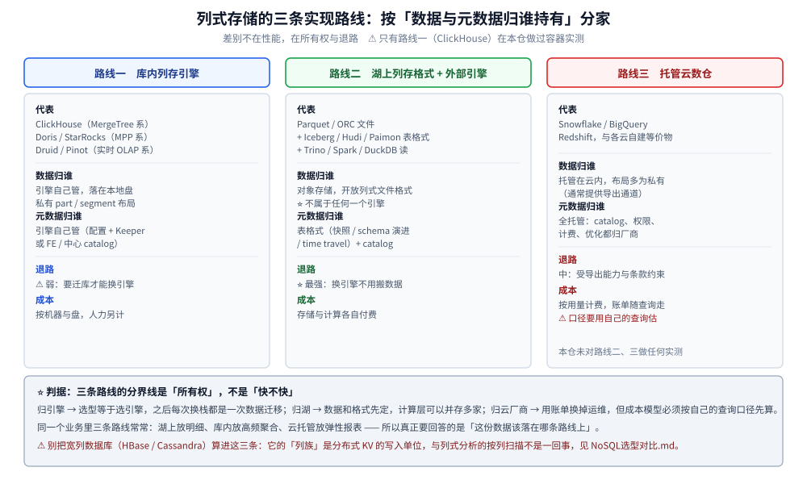
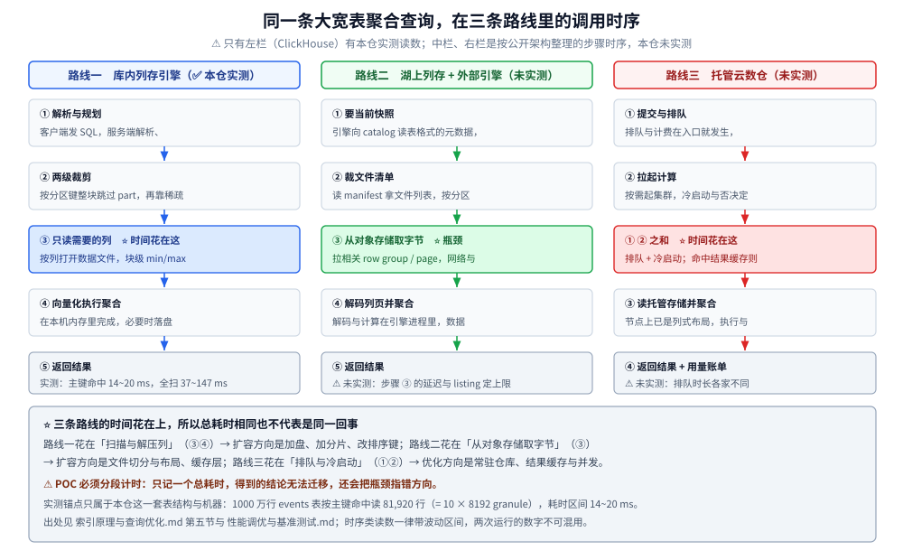
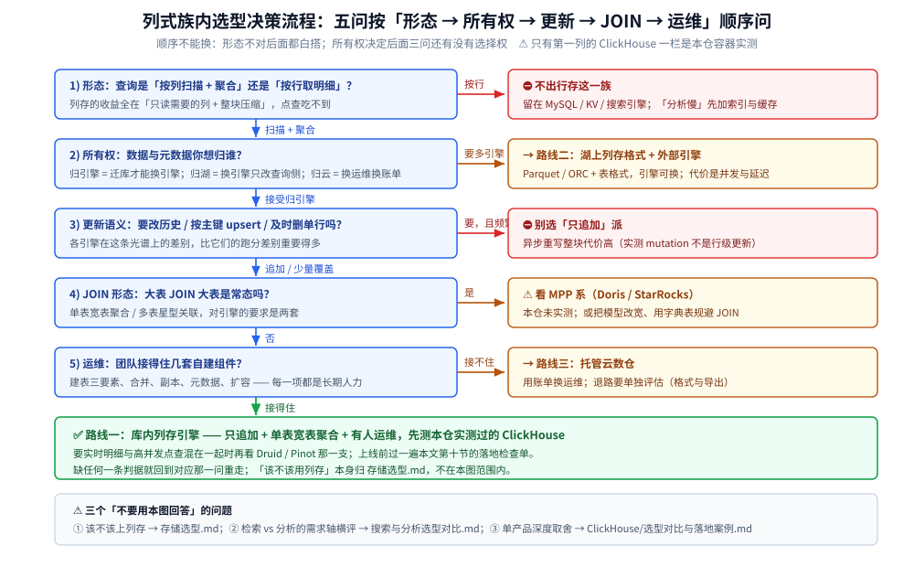

# 列式数据库选型对比

> 跨产品的横向选型：先把「列式存储」这一族按**数据与元数据归谁**分成三条实现路线，再立选型前**必须量化的五个数**，
> 沿**族内四条分水岭**（更新与删除语义 / JOIN 形态 / 元数据与 DDL 归属 / 成本结构）把候选拉开，
> 补上「契合语言与团队栈」这一维，最后按**起点资产**给四条决策线、演进台阶、上线检查单与一次可信 POC 的做法。
>
> ⭐ 边界先说清 —— 本篇只回答「**族内怎么选**」，另外三问各有归属，这里的表不复述：
> 「**该不该用列存**（七类存储的横向定位）」见 [存储选型.md](../存储选型.md)；
> 「**检索 vs 分析的需求轴横评**（含分析族四条路线、七维需求对照）」见 [搜索与分析选型对比.md](../搜索与分析/搜索与分析选型对比.md)；
> 「**要不要用 ClickHouse**（单产品出发点，含与 MySQL / ES / Doris 的机制对照与落地案例）」见 [选型对比与落地案例.md](ClickHouse/选型对比与落地案例.md)。
> 本篇的层次是**列存引擎的实现形态与所有权**，与前两篇的切分轴不同，⚠️ 不要当同一张表读。
>
> 内容整理自个人学习笔记，并参考各项目官方文档与公开的架构资料；素材见 [素材清单.md](../../../素材清单.md)。
>
> ⚠️ 实测口径：本族**只有 ClickHouse 在本机 Docker 容器里实测过**（26.3.29.7，实验 01~11，口径见 [README.md](ClickHouse/README.md)）。
> Doris / StarRocks / Druid / Pinot / 湖上格式 / 托管云数仓一律是**文档陈述、未实测**；
> ⭐ **本篇不引用任何第三方跑分或压缩比充当结论**，涉及未实测的引擎只写「机制 + 定位」，读数一律注明出处。

---

## 一、列式这一族按什么分家？

**本节要点**：三条路线的分界线是「**数据与元数据归谁**」，不是「快不快」—— 归属决定退路、决定扩容方式、决定谁背运维，也决定了后面所有问题还有没有选择权。



### 1.1 三条路线

| 路线 | 一句话 | 数据归谁 | 元数据 / DDL 归谁 | 代表 | 退路 |
|---|---|---|---|---|---|
| **一：库内列存引擎** | 列存、索引、合并、副本全在数据库进程里 | **引擎自己**（本地盘的 part / segment） | **引擎自己**（配置文件或自带元数据节点） | ClickHouse（MergeTree 系）、Doris / StarRocks（MPP 系）、Druid / Pinot（实时 OLAP 系） | ⚠️ 换引擎 = 迁库 + 重写建模 |
| **二：湖上列存格式 + 外部引擎** | 数据只落开放格式，引擎只是「读它的一双手」 | **存储桶**（Parquet / ORC 文件） | **表格式**（Iceberg / Hudi / Paimon 的快照与清单） | Trino / Spark / DuckDB 一类查询引擎 | ⭐ 换引擎只改查询侧，不动数据 |
| **三：托管云数仓** | 存算都交给厂商，你只写 SQL 与看账单 | **云厂商** | **云厂商** | Snowflake / BigQuery / Redshift 一类 | ⚠️ 取决于导出格式与账单模型 |

⭐ 判据：**分界线是所有权**。同一条聚合在三条路线里的耗时构成不一样（第五节），扩容方式不一样，出事时能做的动作也不一样 —— 这些差异全部源自「谁持有那份字节与那份 schema」。

### 1.2 ⚠️ 宽列数据库不在这三条里

HBase / Cassandra 也常被说成「按列存放」，但它们的**列族**是为「写扩展 + 高可用点查」服务的，不做「只读需要的列 + 整块压缩」那套账，
选型时把它们混进列存一族会得出完全错误的结论 —— 那一族的定位与取舍见 [NoSQL选型对比.md](../NoSQL/NoSQL选型对比.md)。

### 1.3 为什么「归属」比「性能」更能决定三年后的处境

| 你想做的动作 | 路线一 | 路线二 | 路线三 |
|---|---|---|---|
| 换一个查询引擎 | ⚠️ 迁库 + 重灌数据 + 重写建模 | ✅ 改查询侧连接与方言 | ⚠️ 换厂商，等于重新选型 |
| 把保留期从 3 个月拉到 3 年 | ⚠️ 加盘或做冷热分层 | ✅ 继续往桶里写文件 | ✅ 加预算 |
| 让另一个团队（如 Spark 作业）读同一份数据 | 走接口查（或反向同步） | ✅ 天然共享 | ⚠️ 走导出 / 授权 |
| 组件出故障时你能做的动作 | 自己排障（合并 / 副本 / 元数据） | 排障面在引擎与格式两处 | 提工单 + 看状态页 |

> 这四行不是「哪个更好」，而是**谁承担后果**。选型会上如果只比功能与跑分，这三条路线会被误当成同一条的三个品牌。

---

## 二、选型前必须先量化的五个数？

**本节要点**：五个数先定下来，候选会自动从一长串缩到两三家；比任何功能对照表都有效。

### 2.1 五个输入

| # | 量什么 | 怎么量 | 为什么它决定选型 |
|---|---|---|---|
| ① | **列访问宽度** | 平均每次查询读几列 ÷ 表总列数 | ⭐ 这就是列存收益的直接比例尺：读 3 列 / 共 30 列才谈得上「只读需要的列」 |
| ② | **单表行数与保留期** | 日增行数 × 保留天数，再乘表数量 | 决定压缩与剪枝的收益、决定单机还是分片、决定要不要对象存储 |
| ③ | **更新与删除语义** | 追加 / 分区级替换 / 按主键 upsert / 按条件删单行，各占多少 | ⭐ 族内最硬的一条分水岭（第三节），也是最多团队事后才改选型的项 |
| ④ | **JOIN 规模** | 最大那条查询里 JOIN 两侧的**行数**（不是表数量） | 「事实表 × 小维表」与「大表 × 大表」是两个问题，候选在这里分家 |
| ⑤ | **到达与并发** | 每天 / 每小时几批、看板并发多少、最晚可接受多久可见 | 决定 part / segment 压力与要不要预聚合，也决定要不要 MPP 那类对等架构 |

### 2.2 每个数会砍掉哪些候选

| 条件 | 直接排除 | 保留 |
|---|---|---|
| 查询主要读整行（详情、导出、宽表整取） | 整个列存一族（回 [存储选型.md](../存储选型.md)） | 行存 / KV |
| 需要高频按主键 upsert 且要立刻可见 | 「只追加」派与异步 mutation 派 | 同步主键模型那一支，或把更新留在关系库 |
| 常态是大表 × 大表 JOIN | 单表为主的路线 | MPP 系 / 湖上多表关联 |
| 数据要给多个引擎、多个团队复用 | 把数据锁在引擎内部的路线 | 路线二（开放格式 + 表格式） |
| 没有人接得住自建组件的升级与排障 | 路线一的全部 | 路线三，或退回现有库做旁路聚合 |
| 写入是细水长流的单条到达 | 偏好批量追加的引擎 | 为流式摄取设计的那一支，或先做攒批 |

### 2.3 ⭐ 第一个数最容易被漏：列访问宽度

本仓实测给了一个很直观的比例尺：同一条 1000 万行的 `GROUP BY` + `COUNT(DISTINCT)`，
MySQL 侧默认参数 300 s 未返回、调大临时表后 **1266.48 s**，ClickHouse 侧**秒级返回** —— 差三个数量级不是调参能追上的，
因为行存必须把整行读进临时表逐行比对，列存只读参与聚合的那几列（出处见 [选型对比与落地案例.md](ClickHouse/选型对比与落地案例.md) 第四节）。
⚠️ 但这条差距**只在「列访问宽度大」时成立**：如果你的分析查询本来就要读十几列、甚至 `SELECT *`，列存的优势会被摊薄到接近「一个更快的磁盘」。

---

## 三、族内四条分水岭在哪？

**本节要点**：功能表里大家都有「支持 SQL、支持聚合、支持集群」；把这族真正分开的是下面四条，且**每条都要拿自己的数据去量**。

### 3.1 更新与删除语义（一条光谱，不是一个开关）

| 档位 | 语义 | 物理代价 | 本仓读数 |
|---|---|---|---|
| 只追加 | 不更新，过期整块丢 | 最低 | ClickHouse 的 TTL / 分区删除即这一档 |
| 分区级替换 | 用新分区覆盖旧分区（`DROP PARTITION` + 重新写入） | 一次批量写的代价 | ⚠️ 书 4.4 节口径，本仓**未实测这一条**（语法与注意点见 [数据模型与表设计.md](ClickHouse/数据模型与表设计.md) 6.2 节） |
| 异步 mutation | 提交即返回，后台**把每个分区目录重写成新目录** | ⚠️ 高：旧目录先标非激活、等下次合并才真正删 | `MATERIALIZE INDEX` 入队实测 **0.012 ~ 0.025 s**，加 `mutations_sync=1` 后同一件事实测 **3.221 s**（单次读数） |
| 同步主键 upsert | 按主键写一条更新一条，读时可见 | 由引擎的合并 / 版本机制背 | ⚠️ 本仓未实测；机制对照见 [选型对比与落地案例.md](ClickHouse/选型对比与落地案例.md) 第三节 |

⭐ 判据：**把「要不要改历史」问成「能不能接受改一次的代价与延迟」**。异步这一档不是不能用，而是**它把更新变成一次重写** ——
`ALTER ... UPDATE / DELETE` 不支持事务、无法回滚、进度要查 `system.mutations`（细节见 [数据模型与表设计.md](ClickHouse/数据模型与表设计.md) 6.3 节）。
⚠️ 26.3 是否已提供 lightweight delete 另一条路径，本批素材未覆盖，本篇**不作断言**。

### 3.2 JOIN 形态：三种，别混成一格

| 形态 | 典型负载 | 谁吃力 |
|---|---|---|
| **不 JOIN**（一张宽表算完） | 事件明细 + 预聚合 | 全族都轻松；ClickHouse 的甜区 |
| **大 × 小**（事实表关联维表） | 报表按地域 / 渠道 / 商品切 | 广播或小表常驻的路线都行；ClickHouse 可用字典表把维表搬进内存规避 |
| **大 × 大**（多张明细表关联） | 星型 / 雪花模型上的即席分析 | ⚠️ 分片列存的弱项，MPP 系与湖上引擎才是为这一档设计的 |

⚠️ 「JOIN 数量」不是判据，**JOIN 两侧的总行数是**。本仓对 ClickHouse 只给机制结论、不给竞品读数：
`GLOBAL JOIN` 与预聚合规避的做法见 [SQL查询与优化.md](ClickHouse/SQL查询与优化.md) 4.3 节，数据字典替代 JOIN 见 [数据模型与表设计.md](ClickHouse/数据模型与表设计.md)。

### 3.3 元数据与 DDL 归属：出事时最值钱的一维

| 归属形态 | 表现 | 你要多做什么 |
|---|---|---|
| **分散元数据**（每节点配置文件 + 协调服务） | 建表要在各节点落地一致；副本协调靠 Keeper / ZooKeeper | ⚠️ 集群配置的「四件套」必须逐节点核对，DDL 与数据的分发是两回事 |
| **中心元数据节点**（FE / controller 一类） | DDL 由一个角色统一管理并自动分发 | 多一个必须高可用的角色，它的存储要单独备份 |
| **表格式托管元数据**（湖） | schema 与快照是文件，引擎只是读者 | ⚠️ 快照膨胀、小文件合并、权限与并发写都要自己管 |
| **厂商托管元数据**（云） | 你看不到也不需要管 | 换厂商时它是最难带走的那部分 |

本仓实测的一个真实后果：ClickHouse 的**分布式写入失败是静默的** —— 数据进了 `system.distribution_queue` 而不报错；
整分片宕机默认硬报错，加上 `skip_unavailable_shards=1` 会**静默返回残缺结果**（实测残缺到 519787 行）。全图见 [集群与高可用.md](ClickHouse/集群与高可用.md)。

### 3.4 成本结构：四项之和，不是许可一项

⭐ 成本 = **许可 + 硬件 + 人力 + 迁移**。省下的许可费最常见的去处是人力：路线一里「建表 = 分区键 + 排序键 + 引擎选型」这件事本身就是长期成本，
本仓实测连**写入方式**都要当成本来学一次（逐行 2000 行 **29619 ms** vs 攒批 **752 ms** vs `INSERT ... SELECT` **624 ms**，出处 [写入与数据导入.md](ClickHouse/写入与数据导入.md)）。
路线二把成本挪到「格式与快照维护」，路线三把成本挪到「账单」。

| 分水岭 | 会把哪些候选推到一边 |
|---|---|
| 更新与删除语义 | 要同步 upsert → 排除「只追加」派；能接受异步 → 全族都回来 |
| JOIN 形态 | 常态大 × 大 → 排除单表为主的路线 |
| 元数据与 DDL 归属 | 无中心元数据接受度低 → 排除分散元数据那一支 |
| 成本结构 | 没有专职运维 → 排除路线一，转路线二或三 |

---

## 四、候选可以分成哪五支？

**本节要点**：五条支路对应三条路线的不同切法 —— 路线一占三支（按「更新与 JOIN 的取舍」再分），路线二、三各一支。

### 4.1 MergeTree 系单机到分片列存：ClickHouse ✅ 本仓实测

**一句话定位**：把「列存 + 稀疏索引 + 后台合并」做进一个可以单机起跑的进程，扩展方式是**分片 + 副本**（节点不对等，靠分布式表拼）。

- **强在哪**：单机能力上限高、函数库极丰富、批量聚合的性价比好（本仓实测 1000 万行约 **153 MiB**、压缩比 **≈ 4.67 : 1**）；
  预聚合能力内建（物化视图 + `AggregateFunction` 状态列，实测读回 **0.28 ~ 0.53 s**）。
- ⚠️ **弱在哪**：JOIN、高频单行更新、事务；以及**建表即设计**——分区键 / 排序键选错就是数量级的差距（实测同一列放在主键前缀与否，读行数是 81,920 对 1,228,800）。
- ⭐ **什么团队会选**：宽表 + 大聚合 + 单表为主 + 有人接得住建表设计与运维。深入见 [README.md](ClickHouse/README.md)（10 篇目录导读）。

### 4.2 MPP 系：Doris / StarRocks ⚠️ 本仓未实测

**一句话定位**：FE（元数据与规划）+ BE（存储与执行）的**对等架构**，把「多表关联 + 交互式分析」当主业，语法与协议向 MySQL 靠。

- **强在哪（机制）**：JOIN 有优化器与运行时过滤这类手段；主键更新模型语义完整；批量导入有专门通道。
- ⚠️ **代价（机制）**：组件角色比单机库多，元数据角色是高可用关键路径；本仓**没有对它做过任何容器实测**，性能与运维读数一律不在此列出。
- ⭐ **什么团队会选**：报表/BI 侧多表关联是常态、团队 SQL 背景偏 MySQL、希望客户端零新增（复用 MySQL 协议）。
  机制级对照见 [选型对比与落地案例.md](ClickHouse/选型对比与落地案例.md) 第三节 —— ⚠️ 那篇是**以 ClickHouse 为出发点**的两产品对照，本篇是全族视角，两者层次不同。

### 4.3 实时 OLAP / 流式摄取系：Druid / Pinot ⚠️ 本仓未实测

**一句话定位**：为「数据持续到达 + 秒级可查 + 高并发看板」而设计，按时间切**不可变分段**，摄取与服务拆成独立角色。

- **强在哪（机制）**：到达即可查、并发查询的隔离与限流是一等公民、按分段做淘汰与副本。
- ⚠️ **代价（机制）**：角色数量与运维面明显多于单机库；建模与分段策略要专门经验；生态与人才池比路线一窄。
- ⭐ **什么团队会选**：实时大屏 / 用户侧分析产品这类「写入新鲜度与并发是硬要求」的场景。

### 4.4 湖上列存格式 + 外部引擎（路线二）

**一句话定位**：数据以 Parquet / ORC 落在对象存储，用表格式（Iceberg / Hudi / Paimon）管快照与 schema，Trino / Spark / DuckDB 一类引擎来读。

- **强在哪**：⭐ 数据与引擎解耦 —— 多个团队多门引擎读同一份；保留期靠对象存储扩容；更新与时间旅行由表格式语义给出。
- ⚠️ **弱在哪**：并发与延迟取决于引擎与文件组织，**小文件与快照膨胀会把你拖回「每天跑一次合并」**；缓存与冷热策略全自己做。
- ⭐ **什么团队会选**：已有批管道与对象存储、数据要给分析 / 训练 / BI 多方复用。目录导读见 [README.md](../数据湖/README.md)。

### 4.5 托管云数仓（路线三）

**一句话定位**：存算分离 + 按用量计费，把「谁扩容、谁升级、谁备份」这件事整体外包。

- **强在哪**：起步当天可跑、并发与弹性由平台兜；SQL 生态与 BI 工具直连。
- ⚠️ **弱在哪**：账单模型与数据出口要提前算清 —— ⭐ **退路取决于「能不能用开放格式把数据完整带走」**（第十节）；跨云迁移基本等于重新选型。
- ⭐ **什么团队会选**：没有自建组件的运维余力，且数据合规允许托管。

> 本节所有 ⚠️ 未实测支路只作**机制与定位**陈述：具体版本、功能边界与许可条款一律以官方文档与 Release Notes 为准，落地前逐条核。

---

## 五、同一条聚合查询在三条路线里时间花在哪？

**本节要点**：三条路线**都把时间花在完全不同的步骤上** —— 这决定了你该往哪个方向扩容，也决定了 POC 该怎么分段计时。



### 5.1 三条泳道各自的时间落点

| 路线 | 主要耗时步骤 | 该往哪扩 | 本仓读数 |
|---|---|---|---|
| 一：库内列存引擎 | **列扫描 + 聚合执行**（本地盘） | 加机器分片、调排序键做剪枝、预聚合 | ✅ 实测：1000 万行 `events` 表命中主键前缀只读 **81,920 行**（= 10 × 8192 granule），**14 ~ 20 ms**；非前缀列读 **1,228,800 行**，**13 ~ 18 ms**；全扫对照 **37 ~ 147 ms** |
| 二：湖上格式 + 外部引擎 | **从对象存储取字节**（网络与并发） | 文件组织、分区裁剪、结果缓存 | ⚠️ 未实测 |
| 三：托管云数仓 | **排队等计算槽位 + 冷启动** | 买并发 / 调仓库大小 / 错峰 | ⚠️ 未实测 |

### 5.2 ⚠️ 所以 POC 必须分段计时

只看总耗时会得出「A 比 B 快」这种**换个负载就作废**的结论。正确的读数拆法是三段：**规划时间、取字节时间、执行时间**（路线一再拆一层：读了多少 granule）。
ClickHouse 侧本仓的做法是查 `system.query_log` 的 `read_rows` / `read_bytes` 并用「`read_rows = SelectedMarks × 8192`」这条实测关系反推剪枝效果
（口径与前提见 [性能调优与基准测试.md](ClickHouse/性能调优与基准测试.md) 与 [SQL查询与优化.md](ClickHouse/SQL查询与优化.md) 5.4 节）。

### 5.3 顺带一条容易被忽略的账：索引几乎不是成本，marks 才是

本仓实测：一个 100 万行 part 的主键索引常驻内存仅 **740 字节**（124 个 granule，平均每个约 6 字节），全表合计约 **7.2 KB** ——
「列存索引很占内存」在这条路线上不成立。真正随写入形态膨胀的是**数据标记与 part 数量**：
实测把同一批数据写成 100 个 part 与 1 个 part，marks 合计分别是 **200** 与 **124**（出处 [索引原理与查询优化.md](ClickHouse/索引原理与查询优化.md) 与 [写入与数据导入.md](ClickHouse/写入与数据导入.md) 4.1 节）。

---

## 六、同一组维度上怎么对照？

**本节要点**：七个维度拉平看，但这张表的维度是**所有权与运维面**（需求轴的对照表在 [搜索与分析选型对比.md](../搜索与分析/搜索与分析选型对比.md) 第六节，两张表不要混读）；⚠️ 有一列不能横向比。

### 6.1 七维定性对照表

| 维度 | 一：MergeTree 系 | 一：MPP 系 | 一：实时 OLAP 系 | 二：湖上格式 + 外部引擎 | 三：托管云数仓 |
|---|---|---|---|---|---|
| **数据归谁** | 引擎本地盘 | 引擎（BE 节点） | 引擎分段 | ⭐ 对象存储（开放格式） | 云厂商 |
| **元数据 / DDL 归谁** | 分散配置 + 协调服务 | 中心 FE | 中心 coordinator / controller | 表格式的快照 | 云厂商 |
| **更新与删除语义** | 追加为主，改 = 异步重写分区 | ⚠️ 有主键更新模型（未实测） | 按分段淘汰为主（未实测） | 由表格式给（快照 / 合并语义） | 由厂商给 |
| **JOIN 形态适配** | ⚠️ 单表 / 大 × 小 | ⭐ 多表关联是主业 | 中（看模型设计） | ⭐ 适合大规模多表 | 中到高（看计费） |
| **一致性与事务** | 无跨表事务，写失败可能静默 | 不承诺 OLTP 级事务（核官方） | 以最终一致为常态 | 快照级一致 | 以会话 / 查询为界 |
| **运维责任边界** | 合并、副本、DDL、备份全在你 | 角色更多，备份面更大 | 摄取与服务两条链路都要盯 | 文件与小对象治理在你 | ⭐ 平台兜，你看账单 |
| **退路（可迁移性）** | ⚠️ 换引擎 = 迁库 | ⚠️ 同上（协议兼容能省客户端） | ⚠️ 分段格式专有性要核 | ⭐ 换引擎不动数据 | ⚠️ 取决于导出能力 |

### 6.2 怎么读这张表

1. **先看第 1、2 行（数据归谁 / 元数据归谁）**：这两行一旦定下，路线二与路线三就直接进入或退出候选。
2. **再看更新语义与 JOIN 形态**：这是族内最贵的两个「事后改不了」的决定 —— 改语义要靠重写管道，JOIN 模型要靠重新建模。
3. **最后看运维责任边界与退路**：⭐ 这两行是「三年后的你」评价这次选型的依据。

### 6.3 ⚠️ 这一列不能横向比：性能与压缩比

- 各家公开跑分都有明确前置条件（硬件、版本、字段基数、排序键、写入模式、查询组合）；⭐ **当口径读，不要当结论用**。
- **列存压缩比取决于你的表设计与数据分布**，不是「装上就有」。本仓实测的三个例子正好说明这一点：
  `LowCardinality` 在 8 个值的 `city` 列省 **12.7 倍**、1000 个值的 `category` 只省 **4.3 倍**、100 万取值的 `url` **一点不省**；
  同一列换成 LC 后**等值过滤快 3.5 ~ 4 倍**，但三列 `GROUP BY` **反而慢 1.7 ~ 3 倍**；
  `Delta,ZSTD` 把单调递增的时间列压到 **0.0047 字节/行** —— ⚠️ 这个数**不能当通用结论**（前提就是「单调」）。出处均见 [性能调优与基准测试.md](ClickHouse/性能调优与基准测试.md)。
- ⚠️ **同版本不同表设计结果可以差很远**：本仓实测同一批 2000 行数据，逐行写与攒批写差 **39 倍**（29619 ms vs 752 ms）。
- 通用原理层面：写优化存储的取舍见 [LSM树.md](../../../02-计算机基础/数据结构/树/LSM树.md)，列的压缩与编码见 [压缩算法.md](../../../02-计算机基础/算法/压缩算法.md)。

---

## 七、同类产品怎么选？

**本节要点**：第四节按**五支路线**分，这一节把每支里的**具体产品**排开 —— 同一条路线内，产品之间差的是「建模负担放在哪」与「生态与运维面」，不是「快不快」。

### 7.1 路线一：库内列存引擎

| 产品 | 一句话定位 | 优先选它 | 慎选 / 别选 |
|---|---|---|---|
| **ClickHouse** | 单机起步的 MergeTree 系列存 | 宽表 + 大聚合 + 单表为主的批量分析；单机就要高性价比 | 常态大 × 大 JOIN、高频单行更新、要跨表事务（✅ 本仓实测） |
| **Doris / StarRocks** | MPP 对等架构，主打多表关联 | 星型 / 雪花模型的多表关联是常态、团队偏 MySQL 习惯、要复用 JDBC 与报表工具 | ⚠️ 组件角色更多，元数据角色是高可用关键路径（本仓**未实测**） |
| **Druid / Pinot** | 实时 OLAP + 流式摄取 | 「秒级可查 + 高并发看板」是硬要求、要并发隔离与限流 | ⚠️ 角色与运维面最多，建模与分段策略要专门经验（本仓**未实测**） |

### 7.2 路线二：湖上列存格式 + 外部引擎

| 产品 | 优先选它 | 慎选 / 别选 |
|---|---|---|
| **Trino / Spark / DuckDB + Iceberg / Hudi / Paimon** | 数据要被多方复用、保留期长、要开放格式与时间旅行 | ⚠️ 小文件与快照膨胀要治理，并发与延迟取决于文件组织 |

### 7.3 路线三：托管云数仓

| 产品 | 优先选它 | 慎选 / 别选 |
|---|---|---|
| **Snowflake / BigQuery / Redshift 一类** | 没有自建组件的运维余力、数据合规允许托管 | ⚠️ 退路取决于能不能用开放格式把数据完整带走；跨云迁移 ≈ 重新选型 |

> **族内判据（一句话）**：**先按「数据归谁」把三条路线砍到一条，再在剩下那条里比产品** —— 单表聚合为主 → ClickHouse；多表关联为主且偏 MySQL → Doris / StarRocks；多方复用与长保留 → 路线二；没有运维余力 → 路线三。
> ⚠️ 本节未标 ✅ 的产品**本仓未实测**，只写「机制 + 定位」，落地前逐条核官方文档与 Release Notes。

---

## 八、契合语言与团队栈怎么选？

**本节要点**：同一份能力清单落到不同语言上「客户端成熟度、批量写入能力、运维接口覆盖」差别很大 —— ⭐ **客户端往往是这一族隐性成本最高的一项**，因为攒批、压缩、重试这些**吞吐能力全在客户端里**（本仓实测逐行写比攒批慢 39 倍）。

| 产品 | 服务端 | 最契合语言 | Java 侧实际体验 | Go 侧实际体验 | PHP / 其他 |
|---|---|---|---|---|---|
| **ClickHouse**（路线一，MergeTree 系） | C++ | ⭐ **语言无关**（两个公开入口：HTTP 8123 / 原生 TCP 9000） | HTTP 接口零依赖可跑（本仓实测 JDK 17 `HttpClient`）；JDBC 之外还有 native 路线（见 [选型对比与落地案例.md](ClickHouse/选型对比与落地案例.md) 第七节） | 官方纯 Go 驱动走原生协议（本仓实测 `clickhouse-go/v2` v2.48.0）；标准库 `net/http` 打 HTTP 口同样通，输出与 Java 侧逐行一致 | ⚠️ 无官方客户端：走 HTTP 自己拼 NDJSON 与攒批重试；批量摄取通常交给旁路管道而不是请求路径 |
| **Doris / StarRocks**（路线一，MPP 系） | Java + C++（FE / BE） | ⭐ **Java**（FE 兼容 MySQL 协议与语法） | 复用既有 JDBC / 连接池 / DAO / 报表工具，客户端零新增；但大批量导入要额外走它的 HTTP 导入接口 | 用 `go-sql-driver/mysql` 即可查询；⚠️ 批量导入的 HTTP 通道与重试要自己封一层 | 走 MySQL 协议即可连；批量导入同样在协议之外 |
| **Druid / Pinot**（路线一，实时 OLAP 系） | Java | Java（原生客户端与生态都在 JVM） | 客户端与运维工具最齐；建索引 / 补数任务的 SDK 也在这侧 | 多为 HTTP JSON 查询客户端，摄取与任务管理常要自己写 | ⚠️ 基本只有 HTTP 查询一条路，运维接口覆盖要逐项核 |
| **湖上格式 + 外部引擎**（路线二） | 引擎各异（Java / C++ / Rust） | ⭐ **Java / Scala**（Spark 系）与 SQL 侧（Trino 一类） | 引擎侧生态厚；但格式层（表格式）的写侧 API 主要在 JVM，其它语言多为只读 | 查询侧有社区驱动；⚠️ **写快照、合并小文件这类治理动作在 Go 侧通常缺工具** | 嵌入式分析可用（DuckDB 一类），但格式治理通常不在 PHP 生态里 |
| **托管云数仓**（路线三） | 厂商 | 取决于厂商 SDK | 通常 Java SDK 最完整 | 多数提供 Go SDK | ⚠️ PHP 侧支持参差，接入前逐个确认（与 [可观测性选型.md](../../../06-工程实践/可观测性/可观测性选型.md) 同一条经验） |

> ⭐ 三条结论：
>
> **① Go 团队**：路线一从 ClickHouse 起步最顺（官方纯 Go 驱动 + 原生协议，本仓已实测跑通），HTTP 口还能当兜底；
> 走 MPP 系则「查询用 MySQL 驱动、批量导入另写 HTTP 一层」是常态 —— ⚠️ 把这层攒批与重试当成必交付项，别留给业务代码。
> **② Java 团队**：三条路线都不吃亏，尤其**从 MySQL 生态迁来时 MPP 系改动面最小**（驱动、连接池、报表工具全沿用）；
> 湖路线的格式治理（写快照、小文件合并）也几乎只有 JVM 有成熟工具。
> **③ PHP / 多语言混合团队**：优先选**协议公开、语言中立**的入口（HTTP / MySQL 协议），避免为每门语言各维护一套客户端驱动；
> 混合栈时按「谁拥有数据写入管道」定主语言，⚠️ 别让 PHP 去承担批量摄取。
>
> ⚠️ 反面教训：这一族的客户端滞后不是「少几个 API」——**攒批、列式压缩、失败重试都长在客户端里**，
> 缺了它们上线第一天就会把批量写写成逐行写（本仓实测慢 39 倍），之后是排障时**拿不到运维接口**，只能进容器手敲。
> ⚠️ 本仓暂无 ClickHouse 的语言接入分册（`go|java|php/接入ClickHouse.md`），已跑通的接入代码集中在
> [选型对比与落地案例.md](ClickHouse/选型对比与落地案例.md) 第七节；跨语言客户端的通用坑写法可对照 [消息队列选型.md](../../中间件/消息队列/消息队列选型.md) 的同名维度。

---

## 九、按「起点资产」怎么决策？

**本节要点**：选型不是从空白开始，而是从「你手里已经有什么」开始；四条决策线先定方向，再走流程图逐问核对。

⭐ 决策顺序：**先用第二、三节的量化数与分水岭定路线，再回到第八节确认主语言能把「批量写入 + 运维接口」顺手写出来** —— 两条冲突时以语言侧为准降档：
例如某一支在 Java 团队是最低改造面，而 Go 侧只剩一条手写 HTTP 攒批的路，那多出来的工时要把功能表上的优势抵掉一大半。



### 9.1 决策线 A：已有 MySQL / PostgreSQL，需求是「报表跑不动了」

⭐ 默认动作是**旁路分析**，不是替换：业务表与事务留在关系库，把数据同步进列存做统计（判据与分工见 [选型对比与落地案例.md](ClickHouse/选型对比与落地案例.md) 第四节）。

| 状况 | 首选动作 |
|---|---|
| 只是个别查询慢 | 先在关系库侧解决：索引与临时表参数（见 [参数调优.md](../关系型/MySQL/参数调优.md)），不要引进新组件 |
| 多维聚合成为常态且量已上去 | 路线一（单机起步）+ 同步管道；管道做法见 [README.md](../数据同步/README.md) |
| 需要按主键更新 + 报表口径要对得上 | 更新语义留关系库，列存侧用分区替换或 upsert 语义，并**自备对账** |

### 9.2 决策线 B：已有 Kafka / Flink，数据是持续到达的

先回答「**乱序与迟到怎么办、多久必须可查**」，再选：攒批友好但新鲜度要求不高的可以走路线一的追加派；
「秒级可查 + 高并发看板」是路线一实时那支的主场；要把同一份流同时喂分析和训练，路线二更省事。
队列侧的到达语义与攒批前提见 [消息队列选型.md](../../中间件/消息队列/消息队列选型.md)。

### 9.3 决策线 C：已有对象存储与批管道（Spark / Hive / Trino 一系）

⭐ **先别把数据再迁进引擎** —— 数据已经在开放格式上，加一层表格式（快照、schema 演进、时间旅行）通常比迁库便宜得多。
只有当「并发查询与看板延迟」明显不达标时，才把热数据子集放进路线一，并明确划出**谁拥有哪一段数据**，避免两边各存一份真相。

### 9.4 决策线 D：已有 ClickHouse，撞上 JOIN 或更新需求

⚠️ **不要为了这两个短板引进第二个列存引擎**，先在库内改造，改造空间比想象大：

| 症状 | 库内改造动作 |
|---|---|
| 大 × 小 JOIN 慢 | 维表搬进字典、或预聚合成宽表（见 [数据模型与表设计.md](ClickHouse/数据模型与表设计.md)） |
| 明细聚合慢 | 物化视图 + `AggregateFunction` 状态列（实测预聚合后读回 0.28 ~ 0.53 s，见 [物化视图与实时聚合.md](ClickHouse/物化视图与实时聚合.md)） |
| 画像 / 圈人类查询慢 | Bitmap 集合运算（实测 696 万行源表压成 20 张位图约 2.51 MB，见 [选型对比与落地案例.md](ClickHouse/选型对比与落地案例.md) 第六节） |
| 更新太频繁导致 part 爆炸 | 改批量到达 + 分区替换；`ORDER BY` 与分区键重设 |
| 确实是常态大 × 大 | 这时才进 9.3 或 9.2，按资产选路线 |

### 9.5 判据速查

| 场景 | 首选 | 备选 | 通常不该选 |
|---|---|---|---|
| MySQL 报表跑不动，单表聚合为主 | 路线一（MergeTree 系，本仓实测） | 关系库侧加缓存与预聚合表 | 路线三（问题不在弹性） |
| 星型模型、多表关联、偏 MySQL 习惯 | 路线一的 MPP 那一支 | 湖上引擎 + 宽表 | 硬把 JOIN 塞进单表宽表路线 |
| 秒级新鲜度 + 高并发看板 | 路线一的实时 OLAP 那一支 | 路线一 + 预聚合 | 批量追加派（写入与并发都对不上） |
| 同一份数据要多方复用、保留期长 | ⭐ 路线二 | 路线一 + 冷热分层 | 把真相锁进单个引擎 |
| 没有自建组件的运维余力 | 路线三 | 路线二（如果已有对象存储） | 路线一（人力成本会立刻显形） |
| 只要最新值 / 高频点查 | ⛔ 都不选：回到 KV / 行存 | — | 整个列式族 |

---

## 十、哪些情况不该上列式分析库？

**本节要点**：这一族的引入成本是「建模 + 管道 + 长期运维」三件一起买；⭐ 判据有顺序 —— **先问查询形态，再问量，最后问人**。形态不对是唯一无法靠调参或加人补救的一条。

### 10.1 先判形态：这几类负载天生不适合（形态否决）

| 负载形态 | 为什么不适合 | 该去哪 |
|---|---|---|
| **按行取一条**（详情 / 导出 / 整行回查） | 列存的红利是「只读需要的列」，整行取把红利全丢掉；点查还要额外靠排序键定位 | 行存 / KV（判据见 [存储选型.md](../存储选型.md)） |
| **高频单行更新** | 更新在族内普遍是异步重写分区 —— 3.1 那条光谱里最贵的一档 | 行存；确实要分析再旁路同步 |
| **要跨表事务 / 强一致** | 全族不提供 OLTP 级事务，写失败甚至可能静默（见 [集群与高可用.md](ClickHouse/集群与高可用.md)） | 关系型；分析侧只做只读副本 |
| **低延迟高并发点查** | 稀疏主键与二级索引不是为点查设计的 | 行存 + 缓存 |

> ⭐ 判据顺序不要反：**形态错了就不用再量数**（量再合适也不该上）；形态对了再进入下面两层。

### 10.2 再看量：没到门槛就别买这套运维（量否决）

1. **量没到**：几条聚合慢靠索引、缓存、预聚合表就能压住 —— 多一个存储就多一套备份、权限、监控与故障面。
2. **列访问宽度不够**：分析查询本身就要读十几列甚至 `SELECT *`，列存优势会被摊薄到接近「一个更快的磁盘」（口径见 2.3）。
3. **到达是细水长流的单条写**：没有攒批层时，写入代价比批量高一个数量级（本仓实测逐行 **29619 ms** vs 攒批 **752 ms**）。

### 10.3 最后看人：没有 owner 就别上（人否决）

4. **没有人接得住建表设计**：分区键 / 排序键 / 引擎三要素选错就是数量级差距（同一列放在主键前缀与否，`read_rows` **81,920** 对 **1,228,800**），这不是「装完再说」的组件。
5. **没有人接得住长期运维**：合并积压、副本与协调服务、DDL 一致性、静默失败排查 —— 都是长期成本；没有 owner 的存储迟早出事。

### 10.4 五个常见误上场景

| 常见说法 | 为什么是误上 | 正确姿势 |
|---|---|---|
| 「拿它当业务库，顺便也能查」 | 它没有 OLTP 级事务与行级更新语义 | 业务留关系库，列存只做旁路分析副本 |
| 「拿它当配置 / 元数据库」 | 小表高频更新正是它最贵的一档 | 交给配置中心 / 关系库 |
| 「拿它当点查缓存」 | 点查不是甜区，也没有缓存那套淘汰与 TTL 语义 | 交给 KV / 缓存 |
| 「先进一批数据，看板以后再调」 | 建表设计一次性定死，返工要重建管道 | 先按第二节把五个数量出来，再建表 |
| 「先上单机，以后再上集群」 | 单机 → 集群的配置一致性与 DDL 分发是另一套工作 | 等第 11 节的触发信号，别默认平滑 |

### 10.5 一旦上了，退路在哪

⭐ **把退路当指标来选** —— 多问一句「三年后想换，数据与口径怎么带走」，能过滤掉一批方案。

| 退路维度 | 好的表现 |
|---|---|
| **格式开放性** | 数据能以开放格式导出（Parquet / CSV / 对象存储直读），而不是只能逐条查询 |
| **接口兼容性** | 写入侧兼容通用协议或标准批量通道，查询侧有 SQL 或兼容既有方言 |
| **元数据可携性** | schema、口径、物化视图定义能版本化（放进仓库）而不是散落在某个管理节点里 |

---

## 十一、从单机到存算分离的演进台阶与落地检查单

**本节要点**：不要一步到位，按触发信号逐级上台；每上一级都要有人接得住新增的运维面。

### 10.1 五个台阶

| 台阶 | 形态 | 解决什么 | 新增的运维面 | 触发信号 |
|---|---|---|---|---|
| ① | 单机单表 + 列式建模 | 让分析跑起来 | 备份与磁盘水位 | 起步 |
| ② | 单机 + 物化视图 / 预聚合 | 看板延迟与并发 | ⚠️ 建视图**不回填历史**（实测），回填要单独做 | 同一口径反复全表扫 |
| ③ | 分片 + 副本 + 协调服务 | 「大」与「稳」 | 集群配置一致性、写入静默失败排查 | 单机写入 / 容量顶不住，或不能容忍单点 |
| ④ | 冷热分层 / 长保留 | 保留期成本 | 分层策略与数据可见性 | 历史查询占比低但不敢删 |
| ⑤ | 开放格式 / 存算分离（路线二或三） | 多方复用与弹性 | 小文件与快照治理，或账单治理 | 多个团队 / 多种负载要读同一份 |

> 每一级都回答同一个问题：**这一级新增的运维面，团队有没有人接得住**。⭐ 停在 ② 很久也完全正常。

### 10.2 上线前的落地检查单

以下条目在本仓都有对应的实测教训，逐条过一遍再上线：

```text
[ ] 建模   分区键 / 排序键是否按"最常见的过滤前缀"设计？
           （实测：同一列放在主键前缀与否，read_rows 81,920 vs 1,228,800）
[ ] 建模   低基数列是否用字典类编码？高基数列是否被误用？
           （实测：8 值的列省 12.7 倍，100 万值的列一点不省；三列分组反而慢 1.7 ~ 3 倍）
[ ] 写入   是否按批到达（≥ 1000 行/批）？细水长流的单条写有没有攒批层？
           （实测：逐行 29619 ms vs 攒批 752 ms；100 part vs 1 part 的元数据与合并压力）
[ ] 更新   改历史的需求有没有落到异步重写？延迟与代价是否被业务接受？
           （实测同一类异步 mutation：入队 0.012 ~ 0.025 s，加 mutations_sync=1 等完 3.221 s；
            旧目录先标非激活、等下次合并才真正删除）
[ ] 一致性 事务与"写成功"的判定是不是只信了接口返回？
           （实测：分布式写失败会静默进队列；整分片宕机 + skip_unavailable_shards 会返回残缺结果）
[ ] 预聚合 物化视图是否覆盖高频口径？历史数据回填方案是什么？
           （实测：建视图时源表已有 1000 万行，目标表 count() 仍为 0）
[ ] 备份   part / 分段目录、协调服务状态、建表与视图定义分别怎么备？
[ ] 观测   是否有"读了多少行 / 多少字节"的每查询账？
           （实测靠 query_log 的 read_rows 与 SelectedMarks × 8192 互相印证）
[ ] 退路   三个月后换引擎，数据能不能用开放格式带走？
[ ] 客户端 主语言能不能完整调通**批量写入通道**与运维接口（集群状态、任务、DDL）？
           （⭐ 攒批 / 压缩 / 重试都长在客户端里；POC 里要专门跑一条运维调用）
[ ] 计量   逐列字节是不是在 Compact part 上读的？
           （⚠️ 实测陷阱：Compact part 上该列恒为 0，先强制 Wide 再取账）
```

---

## 使用：一次可信的列存选型 POC 该怎么做

**本节要点**：POC 的目标不是「证明某个引擎快」，而是**得到一份只对你这套口径有效的结论**。

### 步骤

1. **先定口径**（半天）：把第二节的五个数写成一张表，并明确「一年后的行数与保留期」。
2. **造真实负载**（1~2 天）：用生产数据的采样，而不是随机均匀数据 —— ⭐ 数据分布（同值多不多、是否单调、基数高低）直接决定压缩率与查询代价，本仓那三条 `LowCardinality` 的反例就是这么来的。
3. **对齐条件**：同一台机器、同一版本、同一批数据、同一组查询，逐项只改一个变量。
4. **分段计时**（第五节）：规划 / 取字节 / 执行三段分别记；路线一额外记「实际读了多少行」。
5. **写结论时带上口径**：结论必须与「列访问宽度、排序键、写入批次、基数」绑定，⚠️ 脱离口径的数字不可复用，也不能和别家跑分相减。

### 起一个隔离实例（本仓口径：一律容器化）

```bash
# 单节点复现本仓读数（宿主端口 18123 / 19000，先确认无同名残留）
docker ps -a --filter name=devnotes-ch
docker start devnotes-ch

# 集群实验（2 分片 x 2 副本）：Keeper 必须先起，否则副本报连接失败
docker start devnotes-ch-keeper
docker start devnotes-ch-s1r1 devnotes-ch-s1r2 devnotes-ch-s2r1 devnotes-ch-s2r2
```

Git Bash 下挂载宿主目录跑客户端代码时**必须加 `MSYS_NO_PATHCONV=1`**，否则 `-v D:/...` 会被改写成 `/d/...` 导致挂载点为空
（口径见仓库约定）。收尾只 `docker stop`、**不要 `docker rm`**，保留容器便于复跑。

### 要看的读数与通过标准

| 看什么 | 为什么看它 | 通过标准怎么写 |
|---|---|---|
| 每查询 `read_rows` / 读列数 | ⭐ 判断「排序键与分区裁剪有没有生效」，比耗时可靠 | 写「最重要的 3~5 条查询各读多少 granule」，而不是写某个平均耗时 |
| 聚合查询分位耗时（P95 / P99） | 平均值会被缓存与冷热掩盖长尾 | 按业务可接受的看板刷新时间定阈值 |
| 落盘字节与压缩比 | 直接决定保留期成本 | ⭐ 用**自己的数据分布**算，绝不套用别人的比例 |
| 写入侧 part / 分段数量与合并积压 | 列存最常见的慢性故障 | 写「按到达频率批量写入后，稳态 part 数不增长」 |
| 更新一次的实际代价与可见延迟 | 第三节那条光谱的真实位置 | 写「改一批历史数据，多久后查询口径稳定」 |

### ⚠️ 三个最容易犯的错

1. **把官方 benchmark 当结论**：它是口径，不是你的结论；跨硬件、跨版本、跨表设计不可比。
2. **只压吞吐不压「读行数的账」**：写入基本都能靠攒批调好，**剪枝与预聚合才是分水岭**。
3. **用一套表设计测完所有引擎**：各家把「建模负担」放在不同地方（排序键 / 分桶 / 分段 / 分区表达式），套同一份 DDL 会系统性低估其中几家的成本。

---

## 延伸追问

- **三条路线到底该按什么顺序排除？** → 先排除「形态不对」（不是扫描聚合负载 → 整族退出），再排除「所有权不合」（要多引擎复用 → 路线一退出；没运维余力 → 路线一退出）。这两步走完通常只剩一到两支，再谈功能表。
- **「列存快」是真的吗，快在哪一步？** → 快在**只读需要的列**与**同列相似度高带来的压缩**这两件事叠加，实测同一条件命中主键前缀时只读 81,920 行（全表 1000 万行）。⚠️ 它不快在「任何查询都快」：非前缀列就要扫 1,228,800 行，点查更是它的短板。
- **为什么更新语义要单独立一条分水岭？** → 因为它是族内**代价差异最大**的一项：追加几乎免费，异步改一次历史是把分区目录整个重写一遍，同步 upsert 则由引擎的版本合并机制背成本。功能表上都写「支持更新」，物理上不是一回事。
- **元数据归属为什么在选型会上没人问，出事时最值钱？** → 本仓实测：分散元数据意味着 DDL 一致性、配置逐节点核对、副本协调都要人管；而且**写失败可以是静默的**（进队列而不是报错）。知道元数据在谁手里，才知道故障时能做什么动作。
- **已经有 ClickHouse 了，遇到 JOIN 与更新短板要不要再引一个 MPP？** → ⭐ 先在库内改造（字典表、宽表、物化视图、Bitmap），改不动再按「起点资产」决定是加湖还是加分支 —— 引进第二个分析引擎的前提是**你能说清哪段数据归谁拥有**。
- **这一族里最该先看自己哪门语言的客户端？** → 看**批量写入通道**：列存的性能账一半写在客户端（攒批、压缩、重试）。本仓 Java / Go 两条链路实测输出逐行一致，而逐行写要慢 39 倍 —— 客户端缺攒批等于自废吞吐。

---

## 关联

- [README.md](ClickHouse/README.md) — ClickHouse 目录导读：10 篇阅读顺序、⭐ 版本坐标速查（书 2020 口径 vs 实测 26.3 的 11 项差异）、**容器实测口径与复跑命令**
- [定位与适用场景.md](ClickHouse/定位与适用场景.md) — ClickHouse 填哪个空缺、明确不适用的场景（路线一第一支的需求侧对照）
- [架构与存储引擎.md](ClickHouse/架构与存储引擎.md) — 列存落地形态的地基：Wide / Compact part、分区命名公式、稀疏一级索引与跳数索引
- [数据模型与表设计.md](ClickHouse/数据模型与表设计.md) — 建表三要素、`ALTER` 与 Mutation 的物理形态（第三节「更新语义」的机制出处）
- [索引原理与查询优化.md](ClickHouse/索引原理与查询优化.md) — 稀疏索引为什么省（实测 740 字节 / part）、异步 mutation 的读数陷阱
- [SQL查询与优化.md](ClickHouse/SQL查询与优化.md) — `JOIN` 与 `GLOBAL JOIN` 的经验、`PREWHERE` 与谓词下推的边界（第 3.2 节「JOIN 形态」的细节）
- [写入与数据导入.md](ClickHouse/写入与数据导入.md) — 为什么必须批量写（实测 39 倍差）、part 从哪来、100 part vs 1 part 的对照
- [物化视图与实时聚合.md](ClickHouse/物化视图与实时聚合.md) — 预聚合这条路怎么落（实测「建视图不回填历史」、状态列读写）
- [集群与高可用.md](ClickHouse/集群与高可用.md) — 分片与副本、元数据与协调服务、静默失败与残缺结果（第 3.3 节的实测出处）
- [性能调优与基准测试.md](ClickHouse/性能调优与基准测试.md) — 压缩与编码的真实账（本篇第六节所有读数的出处）、基准测试的锁变量纪律
- [选型对比与落地案例.md](ClickHouse/选型对比与落地案例.md) — ⚠️ **以 ClickHouse 为出发点**的单产品选型：与 MySQL / ES / Doris 的对照、六问决策流程、Bitmap 画像与 Java / Go 接入实测
- [存储选型.md](../存储选型.md) — 七类存储的横向定位：**该不该用列存**这一问题在它那里回答
- [搜索与分析选型对比.md](../搜索与分析/搜索与分析选型对比.md) — 沿**检索 vs 分析的需求轴**切的跨产品选型（含分析族四条路线）
- [时序数据库选型对比.md](../时序数据库/时序数据库选型对比.md) — 同一体例（中立跨产品选型）的模板篇：ClickHouse 在时序场景作为「通用列存自建」一族出现
- [关系型选型对比.md](../关系型/关系型选型对比.md) — 决策线 A 的另一侧：什么时候关系库内部就能解决
- [NoSQL选型对比.md](../NoSQL/NoSQL选型对比.md) — 宽列数据库的定位（第 1.2 节为什么它不在列式这三条路线里）
- [图数据库选型对比.md](../图数据库/图数据库选型对比.md) — 同一体例的另一篇，可对照「中立横评」的写法
- [缓存选型对比.md](../缓存/缓存选型对比.md) — 「按需求定结构」的另一篇选型，判据写法可对照
- [README.md](../数据湖/README.md) — 路线二（开放格式 + 表格式）的目录导读
- [README.md](../数据同步/README.md) — 决策线 A / B 的旁路管道：关系库与队列的数据怎么进分析库
- [消息队列选型.md](../../中间件/消息队列/消息队列选型.md) — 「契合语言 / 客户端质量」这一维的既有写法与跨语言坑（第七节对照）
- [可观测性选型.md](../../../06-工程实践/可观测性/可观测性选型.md) — 另一份按语言对照探针 / 客户端成熟度的选型篇；其日志与链路存储一支会回到本篇
- [中间件选型.md](../../中间件/中间件选型.md) — 分析库上下游组件（队列 / 调度 / 同步）在中间件层面的总入口
- [LSM树.md](../../../02-计算机基础/数据结构/树/LSM树.md) — 「追加 + 后台合并」这一类写优化引擎的通用原理
- [压缩算法.md](../../../02-计算机基础/算法/压缩算法.md) — 列存高压缩率的算法层（同列相似度假设）
- [位图与布隆过滤器.md](../../../02-计算机基础/数据结构/高级数据结构/位图与布隆过滤器.md) — Bitmap 画像与跳数索引共用的底层结构
- [参数调优.md](../关系型/MySQL/参数调优.md) — 决策线 A 第一步：先确认「慢」能不能在关系库侧解决
