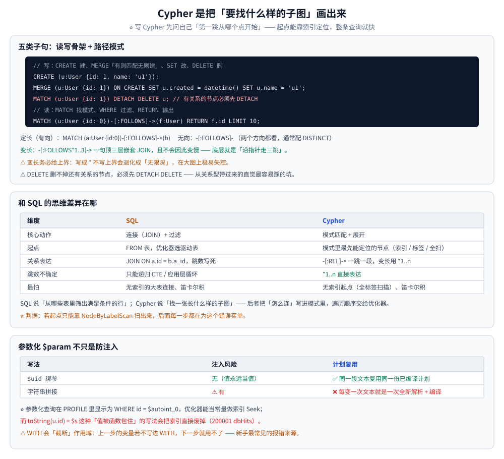
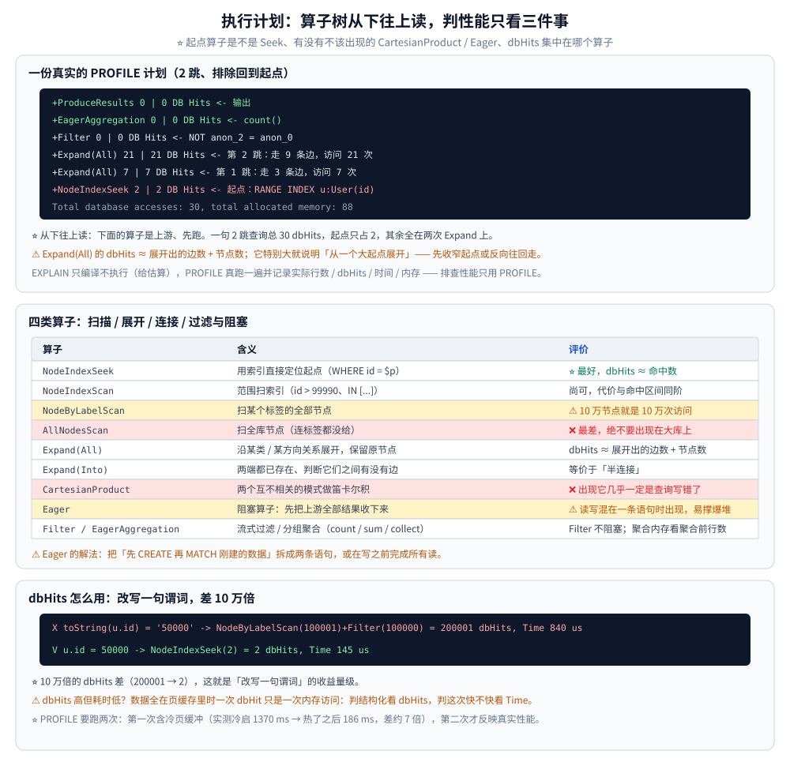

# Cypher查询与执行计划

> Cypher 语法基础、路径模式、`EXPLAIN` / `PROFILE` 的读法，以及执行计划算子详解。
>
> 内容整理自个人学习笔记。**基础框架**参考《Neo4j 权威指南》与官方 Cypher Manual；
> 算子与执行计划相关的读数字实测于 Docker `neo4j:5.26-community`（引擎 **5.26.31**），
> 数据集 10 万用户 / 30 万关注边。

---

## 一、Cypher 的基础语法有哪些要点？

**本节要点**：Cypher 是**用画图的方式写查询**——`(节点)-[关系]->(节点)` 直接描述"要找什么样的子图"，剩下的交给优化器。入门只需记五类子句，但要写对性能，重点是**起点怎么定位**和**参数化**。

### 1.1 读写骨架

```cypher
// 写：CREATE 建、MERGE "有则匹配无则建"、SET 改属性、DELETE 删
CREATE (u:User {id: 1, name: 'u1'});
MERGE (u:User {id: 1}) ON CREATE SET u.created = datetime() SET u.name = 'u1';
MATCH (u:User {id: 1}) SET u.age = 30 RETURN u;
MATCH (u:User {id: 1}) DETACH DELETE u;   // DETACH 会连带删掉该节点的所有关系

// 读：MATCH 找模式、WHERE 过滤、RETURN 输出
MATCH (u:User {id: 0})-[:FOLLOWS]->(f:User)
WHERE f.age > 20
RETURN f.id AS id, f.name AS name
ORDER BY id
LIMIT 10;
```

⚠️ **`DELETE` 删不掉还有关系的节点**：必须先 `DETACH DELETE`（或先把关系删干净），
否则报 "Cannot delete node, because it still has relationships" —— 这是从关系型带过来的直觉最容易踩的坑。

### 1.2 路径模式：Cypher 的表达力所在

```cypher
// 定长：关注关系（有向）
MATCH (a:User {id: 0})-[:FOLLOWS]->(b) RETURN b.id;

// 无向：两个方向都看（会重复，通常配 DISTINCT）
MATCH (a:User {id: 0})-[:FOLLOWS]-(b) RETURN DISTINCT b.id;

// 变长：1~3 跳，*1..3
MATCH (a:User {id: 0})-[:FOLLOWS*1..3]->(x) RETURN count(DISTINCT x) AS reachable_3hop;
```

⭐ 变长路径是 Cypher 最有价值的语法糖：`*1..3` 一句顶三层嵌套 `JOIN`，
且**不会因此变慢**——底层就是"沿着指针走三跳"（见 [架构与存储引擎.md](架构与存储引擎.md) 第二节）。
⚠️ 但 `*` 不写上界（如 `*`）会退化成"无限深"，在大图上极易失控，务必给上界。

### 1.3 参数化：`$param` 不只是防注入

```cypher
// ✅ 参数化：SQL 文本固定，可复用执行计划与编译后的查询
MATCH (u:User {id: $uid}) RETURN u.name;

// ❌ 字符串拼接：防不住注入，也拿不到计划缓存
// "MATCH (u:User {id: " + uid + "}) RETURN u.name"
```

| 写法 | 注入风险 | 计划复用 | 说明 |
|---|---|---|---|
| `$uid` 绑参 | 无（值永远当值） | ✅ | 同一段文本复用同一份已编译计划 |
| 字符串拼接 | **有** | ❌ | 每变一次文本就是一次全新解析 + 编译 |

⭐ 实测的一个连带好处：参数化的查询在 `PROFILE` 里显示为 `WHERE id = $autoint_0`，
**优化器能把它当常量做索引 Seek**；而 `toString(u.id) = $s` 这种"值被函数包住"的写法
（第五节）会把索引直接废掉。

### 1.4 WITH 与 UNWIND：管道的两个关键件

```cypher
// WITH：把上一步的结果当输入传给下一步（可改名、可聚合后再展开）
MATCH (u:User {id: 0})-[:FOLLOWS]->(f)
WITH u, count(f) AS fanout          // 先聚合
WHERE fanout > 2
RETURN u.id, fanout;

// UNWIND：把列表炸成多行（常用于批量写入、按 ID 批量取）
UNWIND [1, 2, 3] AS uid
MATCH (u:User {id: uid})
RETURN u.id;
```

⚠️ **`WITH` 会"截断"作用域**：上一步的变量若不写进 `WITH`，下一步就用不了 —— 这是新手最常见的报错来源。

---



## 二、Cypher 和 SQL 的思维差异在哪？

**本节要点**：SQL 说"**从哪些表里筛出满足条件的行**"；Cypher 说"**找一张长什么样的子图**"。前者每一步都要显式指定连接关系（`JOIN ... ON`），后者把"怎么连"写在了模式里，由优化器决定遍历顺序。

| 维度 | SQL | Cypher |
|---|---|---|
| 核心动作 | 连接（JOIN）+ 过滤 | 模式匹配 + 展开 |
| 起点 | `FROM 表`，优化器选驱动表 | 模式里最先能定位的节点（索引 / 标签 / 全扫） |
| 关系表达 | `JOIN ON a.id = b.a_id`，跳数写死 | `-[:REL]->` 一跳一段，变长用 `*1..n` |
| 跳数不确定 | 只能递归 CTE / 应用层循环 | `*1..n` 直接表达 |
| 最怕 | 无索引的大表连接、笛卡尔积 | 无索引起点（全标签扫描）、笛卡尔积 |

⭐ **经验判据**：写 Cypher 时先问自己"**第一跳从哪个点开始**"。
如果这个点能靠索引 / 主键直接定位，整条查询就快；如果只能靠 `NodeByLabelScan` 扫出起点，
那后面每一步都在为这个错误买单（第五节的改写对就是这个场景）。

---

## 三、EXPLAIN 和 PROFILE 有什么区别？

**本节要点**：`EXPLAIN` 只**编译不执行**，给你看"打算怎么跑"；`PROFILE` **真跑一遍**并记录每个算子的**实际行数与 dbHits**。排查性能只用 `PROFILE`。

| | `EXPLAIN` | `PROFILE` |
|---|---|---|
| 是否执行 | 否（返回 0 行） | 是（真跑，返回结果 + 计划） |
| 给什么 | 优化器**估算**的行数 | **实际**行数 / dbHits / 时间 / 内存 |
| 返回字段 | `queryPlan` | `profiledQueryPlan` |
| 用途 | 上线前看计划有没有全表扫 | 定位真实瓶颈 |

```cypher
EXPLAIN MATCH (u:User {id: 0})-[:FOLLOWS]->(f) RETURN count(f);   // 不执行
PROFILE MATCH (u:User {id: 0})-[:FOLLOWS]->(f) RETURN count(f);   // 执行并记录
```

⭐ **一个容易忽略的细节**：`PROFILE` 会**自动再跑一次**用于汇总统计（cypher-shell 的
"ready to start consuming query after X ms, results consumed after another Y ms" 里，
Y 那一段就包含真实执行）。所以**看绝对耗时要以第二次为准**，第一次往往含冷缓存。

---



## 四、执行计划算子怎么看？

**本节要点**：算子树**从下往上**读（下面的是上游、先跑）。判断性能就看三件事：**起点算子是不是 Seek**、**有没有不该出现的 CartesianProduct / Eager**、**dbHits 集中在哪个算子**。

一份真实的计划（2 跳、排除回到起点）：

```text
+ProduceResults          0 | 0 DB Hits      ← 输出
+EagerAggregation        0 | 0 DB Hits      ← count()
+Filter                  0 | 0 DB Hits      ← NOT anon_2 = anon_0
+Expand(All)            21 | 21 DB Hits     ← 第 2 跳：走 9 条边，访问 21 次
+Expand(All)             7 | 7 DB Hits      ← 第 1 跳：走 3 条边，访问 7 次
+NodeIndexSeek           2 | 2 DB Hits      ← 起点：RANGE INDEX u:User(id) WHERE id = $autoint_0
Total database accesses: 30, total allocated memory: 88
```

### 4.1 扫描类：起点在哪里

| 算子 | 含义 | 评价 |
|---|---|---|
| `NodeIndexSeek` | 用索引直接定位起点（`WHERE id = $p`） | ⭐ 最好，dbHits ≈ 命中数 |
| `NodeIndexScan` | 范围扫索引（`id > 99990`、`IN [...]`） | 尚可，代价与命中区间同阶 |
| `NodeByLabelScan` | 扫某个标签的**全部节点** | ⚠️ 警告：10 万节点就是 10 万次访问 |
| `AllNodesScan` | 扫**全库**节点（连标签都没给） | ❌ 最差，绝不要出现在大库上 |

实测对照（同一句查询，索引前后）：

```text
无索引：NodeByLabelScan(100001) + Filter(100000)  = 200008 dbHits
有索引：NodeIndexSeek(2)                            =      2 dbHits
```

### 4.2 展开类：关系怎么走

| 算子 | 含义 |
|---|---|
| `Expand(All)` | 从一个节点出发，沿某类 / 某方向关系展开，**保留原节点**（最常用） |
| `Expand(Into)` | 两端都已存在、判断它们之间有没有边（等价于"半连接"） |

⭐ 关键判据：`Expand(All)` 的 dbHits ≈ **展开出的边数 + 节点数**。
如果它特别大，说明"从一个大起点展开"——要么加过滤把起点收窄，要么反向往回走。

### 4.3 连接类：什么时候会炸

| 算子 | 含义 | 评价 |
|---|---|---|
| `Apply` | 对左侧每一行，去执行右侧分支（带相关性的循环） | 正常，常见于 `CALL {}` |
| `SemiApply` | 类似 Apply，但只保留"右侧有结果"的左侧行（`EXISTS`） | 正常 |
| `CartesianProduct` | 两个**互不相关**的模式做笛卡尔积 | ❌ 计划里出现它，几乎一定是查询写错了 |

❌ 反面例子：`MATCH (a:User {id:0}), (b:User {id:1})` —— 两个模式没有任何关系，计划里直接出现
`CartesianProduct`。想表达"两个点都要取到"，应该拆成两次查询或在应用层拼，别让引擎做笛卡尔积。

### 4.4 过滤与阻塞：Eager 是隐形炸弹

| 算子 | 含义 |
|---|---|
| `Filter` | 逐行判断谓词，**流式**，不阻塞 |
| `Eager` | **阻塞算子**：必须先把上游**全部**结果收下来，才往下发 |

⚠️ `Eager` 出现的原因通常是**写操作与读操作混在一条查询里**（如先 `CREATE` 再 `MATCH` 到刚建的数据）。
它会把整批中间结果**全部堆在内存里**，大查询下直接撑爆堆。**解法**：把这类查询拆开成多条，
或在写之前完成所有读。

### 4.5 聚合与排序

| 算子 | 含义 |
|---|---|
| `EagerAggregation` | 分组聚合（`count` / `sum` / `collect`），需要把分组键全收下来再算 |
| `Sort` | 排序；`ORDER BY` + `LIMIT` 时优化器可能用堆排减少内存 |

⭐ 聚合前的行数决定内存：`EagerAggregation` 的 Memory 列就是它的"占用证书"——
实测 6 跳查询的聚合内存已到 **83352 B**，跳数再深就得留意堆。

---

## 五、dbHits 这个指标怎么用？

**本节要点**：`dbHits` = **与存储层交互的次数**（读一条记录、扫一个节点都算一次）。它是**最不受缓存影响的性能指标**——时间会因缓存而忽快忽慢，dbHits 不会。

⭐ 一段实测对比，同一句查询两种写法：

```cypher
// ❌ 值被函数包住，索引失效
PROFILE MATCH (u:User) WHERE toString(u.id) = '50000' RETURN u.id;
// → NodeByLabelScan(100001) + Filter(100000) = 200001 dbHits，Time 840 µs

// ✅ 直接比较，走范围索引
PROFILE MATCH (u:User) WHERE u.id = 50000 RETURN u.id;
// → NodeIndexSeek(2) = 2 dbHits，Time 145 µs
```

⭐ **10 万倍**的 dbHits 差（200001 → 2），这就是"改写一句谓词"的收益量级。

⚠️ **什么时候 dbHits 高但耗时低？** 当数据全在页缓存里时，一次 dbHit 只是一次内存访问。
所以：
- 判"查询写得好不好" → 看 **dbHits**（结构化、稳定）；
- 判"这次快不快" → 看 **Time**（受缓存、并发影响，波动大）。
两者都要看：dbHits 高、时间也高 → 实体问题；dbHits 低但时间高 → 多半是**锁等待 / 内存回收 / 并发争用**。

---

## 六、慢查询的常见形态与改写

**本节要点**：Neo4j 的慢查询基本收敛到四类，每类都有一个固定的动作。

| 症状（计划里可见） | 根因 | 改写动作 |
|---|---|---|
| `NodeByLabelScan` / `AllNodesScan` 打头 | 起点没有可用索引 | 给起点属性建索引；把函数包裹的谓词解开 |
| `CartesianProduct` | 两个模式互不相关 | 用关系把它们连起来，或拆查询 |
| `Eager` 阻塞 | 读写混在一条语句 | 拆成"先读后写"两条 |
| `Expand(All)` dbHits 巨大 | 从一个大节点展开 | 先收窄起点；或反向从"小端"走 |

```cypher
// ❌ 起点全靠扫
MATCH (u:User) WHERE toLower(u.name) = 'u0' RETURN count(u);
// ✅ 把函数从"被索引的属性"上拿开：要么直接相等，要么改用全文索引
MATCH (u:User) WHERE u.name = 'u0' RETURN count(u);
CALL db.index.fulltext.queryNodes('user_name_ft', 'u0') YIELD node RETURN count(node);
```

⭐ **`PROFILE` 要跑两次**：第一次含冷页缓存（实测冷启 1370 ms → 热了之后 186 ms，差约 7 倍），
第二次才反映真实性能。**只跑一次就下结论，很容易把"缓存未热"误判成"查询慢"。**

⭐ **`USING INDEX` 提示什么时候用？** 只在优化器**选错**起点时用。绝大多数情况下，
把索引建对 + 把谓词写对，优化器自己会选 `NodeIndexSeek`；`USING INDEX` 是"兜底的手动挡"，
用多了会掩盖真正的问题（比如统计信息过期）。

---

## 使用：参数化 Cypher + 在 Go 里拿真实读数

**本节要点**：把"在 cypher-shell 里看计划"搬到应用里 —— 参数化发查询、从 `ResultSummary` 里把**算子级 dbHits** 拿出来，就可以把"这条查询不许全表扫"写成 CI 断言。

```go
package main

import (
	"context"
	"fmt"
	"strings"

	"github.com/neo4j/neo4j-go-driver/v5/neo4j"
)

func dump(p neo4j.ProfiledPlan, depth int) {
	fmt.Printf("%s%-16s dbHits=%-8d records=%-6d time=%d\n",
		strings.Repeat("  ", depth), p.Operator(), p.DbHits(), p.Records(), p.Time())
	for _, c := range p.Children() {
		dump(c, depth+1)
	}
}

func main() {
	ctx := context.Background()
	d, err := neo4j.NewDriverWithContext("bolt://127.0.0.1:7687",
		neo4j.BasicAuth("neo4j", "neo4jtest123", ""))
	if err != nil {
		panic(err)
	}
	defer d.Close(ctx)

	s := d.NewSession(ctx, neo4j.SessionConfig{})
	defer s.Close(ctx)

	// ✅ 参数化：文本固定，计划可复用；PROFILE 前缀让服务端把算子级读数一并回传
	res, err := s.Run(ctx,
		"PROFILE MATCH (u:User {id: $uid})-[:FOLLOWS]->(f) RETURN count(f) AS c",
		map[string]any{"uid": 0})
	if err != nil {
		panic(err)
	}
	rec, err := res.Single(ctx)
	if err != nil {
		panic(err)
	}
	sum, err := res.Consume(ctx)
	if err != nil {
		panic(err)
	}
	fmt.Printf("结果=%v\n", rec.Values[0])
	fmt.Printf("可用耗时=%v 消费耗时=%v\n", sum.ResultAvailableAfter(), sum.ResultConsumedAfter())
	dump(sum.Profile(), 0)
}
```

实测输出（容器里 `go run`，驱动 v5.28.0）：

```text
结果=3
可用耗时=7ms 消费耗时=3ms
--- profiled plan ---
ProduceResults@neo4j dbHits=0        records=1      time=0
  EagerAggregation@neo4j dbHits=0        records=1      time=0
    Expand(All)@neo4j dbHits=7        records=3      time=0
      NodeIndexSeek@neo4j dbHits=2        records=1      time=0
```

⭐ 三条**踩坑记录**（都是实测撞出来的）：

| 期望 | 实际 | 结论 |
|---|---|---|
| `sum.Plan().Root()` | `Plan` 没有 `Root()` —— 它自己就是根，字段是 `Operator` / `Arguments` / `Identifiers` / `Children` | 树从返回的对象开始递归 |
| 用 `sum.Plan()` 读 dbHits | `Plan` 里**没有** dbHits | **`PROFILE` 的计划要读 `sum.Profile()`**（`ProfiledPlan` 才有 `DbHits` / `Records` / `Time`） |
| `p.DbHits` 当字段 | 编译期报 `func must be func(yield ...)` | v5.28 里 `DbHits()` / `Records()` / `Time()` / `Operator()` / `Children()` **都是方法**，要带括号 |

⭐ **判据**：把 `dump` 收集到的 `Operator()` 与 `DbHits()` 存下来断言 ——
出现 `NodeByLabelScan` / `AllNodesScan` / `CartesianProduct` 直接判失败，
就能把"慢查询不许上线"变成流水线里的一条硬门禁。

> ⚠️ 这段代码是在**与 Neo4j 容器共享网络命名空间**的 Go 容器里跑的
> （`docker run --network container:neo4j-lab …`），所以 `127.0.0.1:7687` 直接指向 Neo4j；
> 独立部署时换成真实的 `bolt://host:7687` 即可。

⚠️ 三条实践纪律：
① 永远用 `$param` —— 拼接既不防注入也拿不到计划复用；
② `PROFILE` 放到排查 / 压测里，**别留在生产查询上**（它会多跑一次并记录统计）；
③ 判断"查询写得好不好"看 `Plan()` 里的 dbHits 分布，别只看总耗时。

---

## 延伸追问

- **为什么参数化查询能复用执行计划？**
  → 因为 SQL / Cypher 文本**一字不变**时，服务端的**查询缓存**能直接命中已编译的物理计划；
  值走参数通道传，不参与编译。字符串拼接则每次生成新文本，等于每次都重新解析 + 编译
  （大库上编译本身就很贵）。这也是"参数化既是安全最佳实践、也是性能最佳实践"的原因。
- **`USING INDEX` 提示什么时候用？**
  → 只在优化器**选错起点**（如统计信息过期导致误判选择性）时作为兜底。日常应通过
  "把索引建对 + 谓词写对"让优化器自己选。滥用提示会掩盖根本问题，且索引改名 / 删掉后
  写死的提示会直接让查询报错。
- **为什么 `PROFILE` 要跑两次？**
  → 第一次往往在**冷页缓存**下跑（数据要从磁盘读进页缓存），读数被 I/O 拉高；
  第二次数据已驻留内存，才反映查询本身的 CPU 代价。实测同一查询冷热差约 **7 倍**
  （1370 ms → 186 ms）。所以"跑一次就判定慢"很容易冤枉一条好查询。
- **`dbHits` 和耗时哪个更可信？**
  → 各有用途：**dbHits 是结构化的、不受缓存影响的指标**，用来判断"这条查询写得合不合理"；
  **耗时**受缓存、并发、GC 影响大，用来看"这次实际快不快"。两个都高才是真问题。
- **同一条查询，`count(n)` 为什么秒回、`count(n.prop)` 却要扫全图？**
  → Neo4j 在 `neostore.counts.db` 里维护了**按标签 / 类型 / 起止标签组合**的计数，
  `count(n)` 直接读缓存；一旦带上**属性过滤**，counts 缓存就用不上，只能真扫（见
  [架构与存储引擎.md](架构与存储引擎.md) 第三节）。

---

## 关联

- [架构与存储引擎.md](架构与存储引擎.md) — Expand 为什么便宜：无索引邻接与指针遍历
- [索引设计与查询优化.md](索引设计与查询优化.md) — 本节说的"起点要能 Seek"，索引怎么建才对
- [事务与并发控制.md](事务与并发控制.md) — dbHits 不高但耗时高的另一半原因：锁与等待
- [运维与调优.md](运维与调优.md) — 慢查询日志、`SHOW TRANSACTIONS` 与 PROFILE 的配合用法
- [数据建模与导入.md](数据建模与导入.md) — 导入期的写入模式，决定了之后查询能不能有索引起点
- [README.md](README.md) — 本目录导读：版本坐标与阅读顺序
- [索引设计与EXPLAIN.md](../../关系型/MySQL/索引设计与EXPLAIN.md) — 关系型侧的同名技能：EXPLAIN 怎么读
- [查询优化.md](../../关系型/MySQL/查询优化.md) — SQL 的改写套路，可对照本文第六节
> 反向引用（本篇被下列文档引到）：[GDS图算法实战.md](GDS图算法实战.md)、[向量索引与GraphRAG.md](向量索引与GraphRAG.md)
