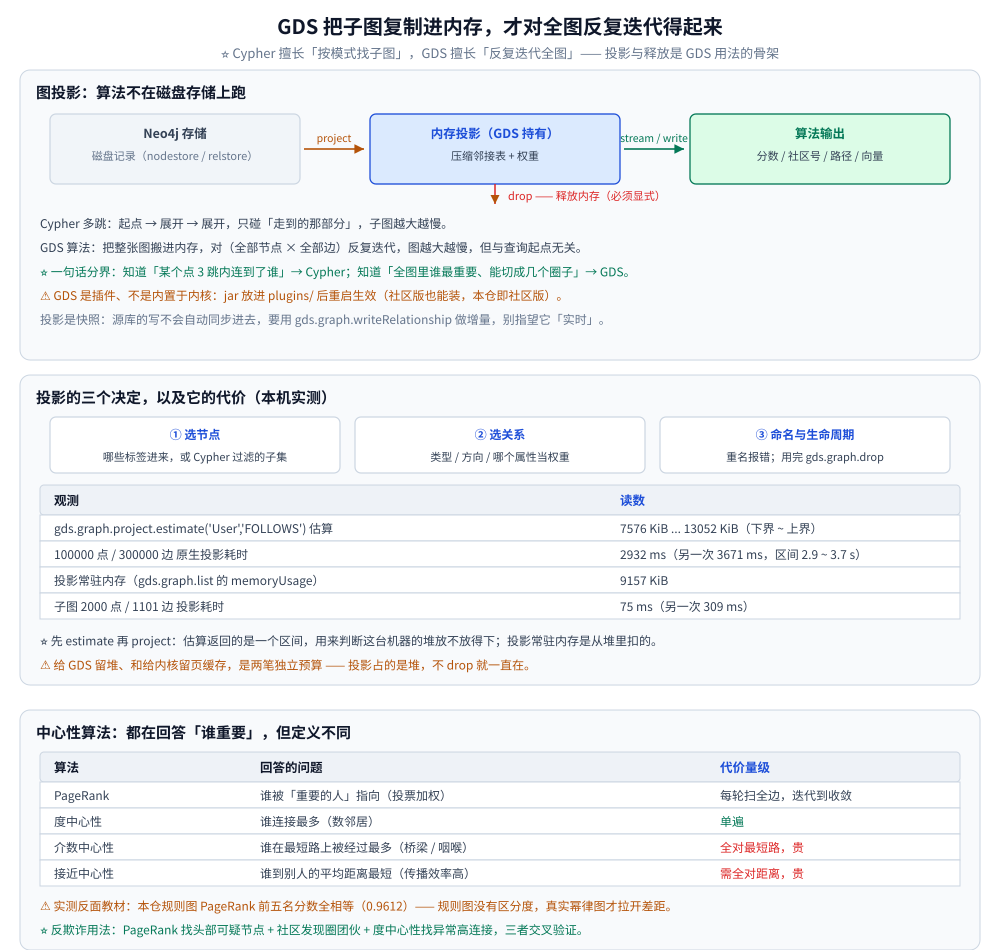
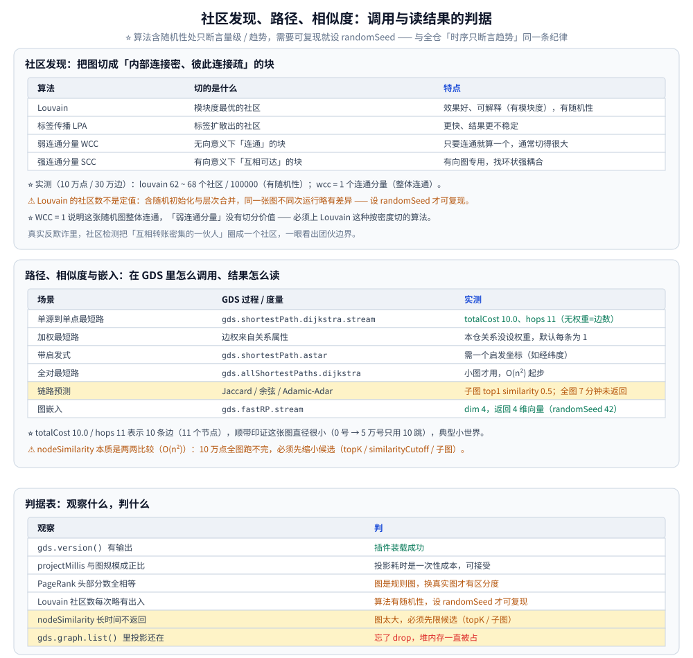

# GDS图算法实战

> GDS 库的定位与部署、图投影（原生 / Cypher）、中心性算法、社区发现、路径算法、
> 链路预测与相似度，以及 GDS 与 Agentic AI 的结合。
>
> 内容整理自个人学习笔记。**基础框架**参考《Neo4j 权威指南》与官方 GDS Manual；
> **GDS Agent / Aura Graph Analytics 等 2026 新方向**基于官方文档与 Release Notes 独立整理。
>
> ⚠️ **实测环境**：Docker `neo4j:5.26-community`（内核 **5.26.31**）+ **GDS 2.13.2** 插件，
> 数据集 100000 User / 300000 FOLLOWS（出度恒为 3）。本节读数均为**本机真实运行**所得；
> 算法含随机性（社区发现、嵌入）处标注波动范围，并说明原因。

---

## 一、GDS 是什么，为什么算法不能只用 Cypher 跑？

**本节要点**：**Cypher 擅长"按模式找子图"，GDS 擅长"反复迭代全图"**。
像 PageRank、Louvain 这类算法要一遍遍扫全图邻接，用 Cypher 写会退化成逐点遍历，复杂度与**图规模**成正比；
GDS 把子图复制进内存、用压缩邻接表跑，才把这类算法变得可行。

| 维度 | 原生 Cypher | GDS |
|---|---|---|
| 擅长 | 模式匹配：找"满足某种关系形态的路径" | 全图迭代算法：排序、聚类、最短路、嵌入 |
| 数据落点 | 磁盘上的记录存储（按需读页） | **内存里的图投影**（一次性载入） |
| 复杂度视角 | 与遍历到的子图大小相关 | 与**投影后的全图规模**相关 |
| 典型产出 | 查询结果集 | 分数 / 社区号 / 路径 / 向量，可 `stream` 或 `write` 回库 |
| 部署 | 内置于数据库 | **独立插件**（jar 放进 `plugins/`，重启生效） |

⭐ **一句话分界**：想知道"某个点 3 跳内连到了谁"→ Cypher（见
[Cypher查询与执行计划.md](Cypher查询与执行计划.md)）；想知道"全图里谁最重要、能切成几个圈子"→ GDS。

```text
Cypher 的多跳               GDS 的算法
  起点 ──► 展开 ──► 展开      把整张图搬进内存
  只碰"走到的那部分"          然后对 (全部节点 × 全部边) 反复迭代
  → 子图越大越慢              → 图越大越慢，但与查询起点无关
```

⚠️ **GDS 是插件、不是内置于内核**：社区版也能装（本仓即社区版）。差别在规模与托管形态
（官方另有按需托管的 **Aura Graph Analytics**，见第七节）。

---



## 二、图投影怎么把数据搬进内存？

**本节要点**：算法**不在磁盘存储上跑**，而是先做一次 **图投影（graph projection）**——
把选中的节点 / 关系复制成**内存中的压缩邻接表**（外加算法需要的属性）。投影与释放是 GDS 用法的骨架。

```text
  Neo4j 存储（磁盘记录）              内存投影（GDS 持有）           算法输出
  ┌──────────────────┐   project   ┌──────────────────┐  stream   ┌──────────┐
  │ nodestore / relstore │ ───────► │ 压缩邻接表 + 权重  │ ────────► │ 分数/社区 │
  └──────────────────┘             └──────────────────┘  write    └────┬─────┘
                                            │  drop                   │
                                            ▼                         ▼
                                      释放内存（必须显式）        写回图库(可选)
```

投影要做三个决定：

1. **选节点** —— 哪些标签进来（`'User'`，或 Cypher 过滤出的子集）；
2. **选关系** —— 哪些关系类型、方向（`NATURAL` / `REVERSE` / `UNDIRECTED`）、**哪个属性当权重**；
3. **命名与生命周期** —— 投影有名字，**重名会报错**；用完必须 `gds.graph.drop` 释放，否则一直占堆内存。

### 2.1 Cypher 投影和原生投影差在哪？

| 方式 | 写法 | 特点 |
|---|---|---|
| **原生投影** | `gds.graph.project('g', 'User', 'FOLLOWS')` | 只给标签 + 关系类型，**最快**，但只能整体投影 |
| **Cypher 投影** | 传两段 Cypher（节点查询 + 关系查询） | 灵活：可过滤节点、可造**虚拟关系**、可投影计算出的权重；但**慢** |

⚠️ **本仓实测的一个坑**：在 **GDS 2.13.2** 上，把 Cypher 查询串传给 `gds.graph.project(name, 'MATCH ...', 'MATCH ...')`
**未被识别为 Cypher 投影**，而是被当成标签名，直接报：

```text
Failed to invoke procedure `gds.graph.project`:
Caused by: java.lang.IllegalArgumentException:
Invalid node projection, one or more labels not found: 'MATCH (u:User) WHERE u.id < 2000 RETURN u'
```

所以本仓要构造**子图投影**时，改用了 **原生投影 + 临时标签** 的办法：先给选中的节点打一个临时标签，
再按这个标签做原生投影，跑完删标签。这条弯路本身值得记 —— **报错信息说"标签找不到"**，
**其实是在提示它把你的查询串当标签了**。

### 2.2 投影的代价（本机实测）

| 观测 | 读数 |
|---|---|
| `gds.graph.project.estimate('User','FOLLOWS')` 估算 | `7576 KiB ... 13052 KiB`（下界~上界） |
| 100000 点 / 300000 边 原生投影耗时 | **2932 ms**（另一次 **3671 ms**，区间 **2.9~3.7 s**） |
| 投影常驻内存（`gds.graph.list` 的 `memoryUsage`） | **9157 KiB** |
| 子图 2000 点 / 1101 边 投影耗时 | **75 ms**（另一次 309 ms） |

⭐ **先 `estimate` 再 `project`**：估算返回的是一个**区间**（下界~上界），用来判断"这台机器的堆放不放得下"。
投影常驻内存（本仓约 9 MiB / 10 万点 30 万边）是从**堆**里扣的 —— 所以
[运维与调优.md](运维与调优.md) 里给 GDS 留堆，和给内核留页缓存是两笔独立预算。

⚠️ **投影是快照**：投影完成后，**源库的写不会自动同步**到投影里。要么重新投影，
要么用 `gds.graph.writeRelationship` 类接口做增量，别指望它"实时"。用完记得 `drop`。

---

## 三、中心性算法各自回答什么问题？

**本节要点**：中心性算法都在回答"谁重要"，但**"重要"的定义不同 → 算法不同**。
选错算法会得到看似合理、实际答非所问的排序。

| 算法 | 回答的问题 | 直觉 | 代价量级 |
|---|---|---|---|
| **PageRank** | 谁被**重要的人**指向 | 投票加权：来自高分节点的边更值钱 | 每轮扫全边，迭代到收敛 |
| **度中心性（Degree）** | 谁连接最多 | 最简单：数邻居 | 单遍 |
| **介数中心性（Betweenness）** | 谁在**最短路上被经过最多** | 桥梁 / 咽喉节点 | 全对最短路，**贵** |
| **接近中心性（Closeness）** | 谁到别人的平均距离最短 | 传播效率高 | 需全对距离，**贵** |

### 3.1 PageRank 实测

```cypher
CALL gds.pageRank.stream('follows') YIELD nodeId, score
RETURN gds.util.asNode(nodeId).id AS id, score
ORDER BY score DESC LIMIT 5;
```

实测输出（本仓规则图）：

```text
id, score
57600, 0.9612404689154856
57601, 0.9612404689154856
57602, 0.9612404689154856
57603, 0.9612404689154856
57599, 0.9612404689154856
```

⚠️ **这是一个反面教材，值得记住**：本仓测试图是**规则图**（每个人恒关注 3 人、结构对称），
所以 PageRank 出来**前五名分数完全一样（0.9612）**——**规则图上 PageRank 没有区分度**。
真实业务图（幂律分布）才会出现头部节点分数明显拉开。

### 3.2 度中心性实测

```text
avg_deg, max_deg
3.0, 3.0
```

出度恒为 3，所以平均与最大都是 3 —— 再次印证这是**规则图**，
也解释了为什么社区发现会切出很多块（见下一节）。

⭐ **反欺诈里怎么用**：PageRank 给"被一堆账户共同指向的账户"高分（可能是资金归集点 / 水军头目），
配合**社区发现**把整个团伙圈出来；度中心性则用来快速找"异常高连接"的可疑节点。
算法原理（幂迭代、阻尼系数、收敛判据）不在此展开。

---



## 四、社区发现怎么把图切成块？

**本节要点**：社区发现要把图分成**"内部连接密、彼此连接疏"**的块。
**Louvain** 通过优化**模块度**做层次合并（效果最好、也最能解释）；**标签传播（LPA）**是更快的近似；
**连通分量**是最弱的"连通性"版本。

| 算法 | 切的是什么 | 特点 |
|---|---|---|
| **Louvain** | 模块度最优的社区 | 效果好、可解释（有模块度），有**随机性** |
| **标签传播（LPA）** | 标签扩散出的社区 | 更快、结果更不稳定 |
| **弱连通分量（WCC）** | 无向意义下"连通"的块 | 只要连通就算一个，通常切得很大 |
| **强连通分量（SCC）** | 有向意义下"互相可达"的块 | 有向图专用，找环状强耦合 |

### 4.1 实测读数

```cypher
CALL gds.louvain.stream('follows') YIELD nodeId, communityId
RETURN count(DISTINCT communityId) AS communities, count(*) AS nodes;
```

```text
communities, nodes
62 ~ 68, 100000     // 多次运行落在 62~68，见下方说明
```

```cypher
CALL gds.wcc.stream('follows') YIELD nodeId, componentId
RETURN count(DISTINCT componentId) AS components;
```

```text
components
1
```

⚠️ **Louvain 的社区数不是定值**：它含**随机初始化**与**层次合并**，同一张图不同次运行结果会略有差异
（本仓落在 **62~68**）。所以：

- 只断言**量级 / 趋势**（"切成几十个社区"），不写死"就是 62 个"；
- 需要可复现时，调用里加 **`randomSeed`** 固定随机源。

⭐ **WCC = 1 说明什么**：这张随机图**整体连通**——任意两个用户之间总有一条无向路径。
所以"弱连通分量"在这种图上没有切分价值，必须上 Louvain 这种**按密度切**的算法。
真实反欺诈里，社区检测把"互相转账密集的一伙人"圈成一个社区，一眼看出团伙边界。

---

## 五、路径算法怎么算最短路径？

**本节要点**：**Dijkstra** 算**加权**最短路（边权来自关系属性）；**A\*** 在 Dijkstra 上加启发式函数加速；
**全对最短路**一次算所有点对（只适合小图）。GDS 负责把它跑在内存投影上。

```cypher
MATCH (a:User {id:0}), (b:User {id:50000})
CALL gds.shortestPath.dijkstra.stream('follows', {sourceNode: a, targetNode: b})
YIELD totalCost, nodeIds, costs
RETURN totalCost, size(nodeIds) AS hops;
```

实测输出：

```text
totalCost, hops
10.0, 11
```

`totalCost = 10.0`、`hops = 11` 表示路径上有 **10 条边**（11 个节点）——本仓关系**没设权重，默认每条为 1**，
所以总代价恰好等于边数。⭐ 这也顺带印证了这张图**直径很小**（0 号到 5 万号只用 10 跳就到）——
典型的小世界特征。

⚠️ **与算法层篇目的分工**：Dijkstra 的**原理**（松弛操作、优先队列、复杂度、为什么不能有负权边）
归 [Dijkstra.md](../../../../02-计算机基础/算法/图论算法/最短路/Dijkstra.md)；
多源任意点对归 [Floyd.md](../../../../02-计算机基础/算法/图论算法/最短路/Floyd.md)、
负权边归 [Bellman-Ford.md](../../../../02-计算机基础/算法/图论算法/最短路/Bellman-Ford.md)。
**本篇只讲"在 GDS 里怎么调用、权重从哪来、结果怎么读"**，不重复讲算法本身。

| 场景 | GDS 过程 | 备注 |
|---|---|---|
| 单源到单点最短路 | `gds.shortestPath.dijkstra.stream` | 本仓实测用的就是这个 |
| 单源到多点 | `gds.allShortestPaths` 系列 | 一次给源点 |
| 全对最短路 | `gds.allShortestPaths.dijkstra` | 小图才用，O(n²) 起步 |
| 带启发式 | `gds.shortestPath.astar` | 需提供一个启发坐标（如经纬度） |

---

## 六、链路预测与相似度怎么预测"可能认识"？

**本节要点**：链路预测 = 用**两个节点邻域的相似度**推测"应该连但还没连"的边，
是"可能认识的人 / 可能关联的实体"这类推荐的图版本。常用度量：**Jaccard**、**余弦**、**Adamic-Adar**。

| 度量 | 直觉 | 何时更好 |
|---|---|---|
| **Jaccard** | 共同邻居 ÷ 并集邻居 | 通用，最常用 |
| **余弦相似度** | 邻接向量的夹角 | 度数差异大时更稳 |
| **Adamic-Adar** | 共同邻居按"越冷门越值钱"加权 | 稀有邻居更能说明关系 |

### 6.1 nodeSimilarity：先算小图，别硬刚全图（实测）

```cypher
CALL gds.nodeSimilarity.stream('follows', {topK: 1})
YIELD node1, node2, similarity
RETURN gds.util.asNode(node1).id AS a, gds.util.asNode(node2).id AS b, similarity
ORDER BY similarity DESC LIMIT 5;
```

**全图（10 万点 / 30 万边）**：**约 7 分钟仍未返回，手动终止**。
**子图（2000 点 / 1101 边，投影 75 ms）** 实测输出：

```text
a, b, similarity
159, 373, 0.5
162, 380, 0.5
153, 359, 0.5
156, 366, 0.5
165, 387, 0.5
```

⚠️ **这是本篇最重要的一条教训**：`nodeSimilarity` 本质是**两两比较**（O(n²) 量级），
在 10 万点的图上**跑不完**。生产里必须**先缩小候选**：

- 用 **`topK`** 只保留每个节点的前 K 个相似节点；
- 用 **`similarityCutoff`**（相似度阈值）砍掉低分对；
- 或者**只在业务相关的子图上**跑（本仓正是这么做的）。

### 6.2 图嵌入：FastRP

当需要**给每个节点生成一个向量**（供下游相似度 / 机器学习用）时，用图嵌入算法。
本仓实测 `gds.fastRP.stream('follows_sub', {embeddingDimension: 4, randomSeed: 42})` 返回 4 维向量，跑通：

```text
dim
4
4
4
```

⭐ **FastRP 与向量索引是两回事**：[向量索引与GraphRAG.md](向量索引与GraphRAG.md) 讲的是**库内**存储与检索向量索引；
FastRP 是**算出来**的节点嵌入。两者可以接力：FastRP 生成向量 → 写回节点属性 → 建向量索引检索。

---

## 七、GDS 和 Agentic AI 怎么结合？

**本节要点**：GDS 正从"离线算法库"扩展到"**按需 / 智能体可调用**的图分析"——
让 LLM 通过标准接口调用图算法，把"自然语言提问 → 图算法执行 → 结果解释"串起来。

| 能力 | 是什么 | 说明 |
|---|---|---|
| **GDS Agent（MCP Server）** | 把 GDS 算法暴露成 **MCP 工具** | LLM / 智能体直接调用图算法，"社区检测用于情报分析"这类任务可被编排 |
| **Aura Graph Analytics** | 托管的**按需**图计算环境 | 2026 起提供，免去自己管投影与内存 |
| **图算法 + 智能报告** | 算法结果喂给 LLM 生成解读 | 社区 / 中心性结果 → 自然语言情报摘要 |

⚠️ **本节属 2026 新方向，基于官方文档与 Release Notes 整理，未在本机实测**（社区版无此托管能力）。
理解要点即可：**GDS 把"图算法"变成了可被程序 / 智能体调用的服务**，
这与 [向量索引与GraphRAG.md](向量索引与GraphRAG.md) 里的 GraphRAG 是同一股趋势的两面 ——
一面是**检索增强**（向量 + 图），一面是**分析增强**（算法 + 智能体）。

---

## 使用：在本机 GDS 上跑通"投影 → 算法 → 释放"

**本节要点**：一条**可复现**的最小链路：先确认插件在位，再估算 → 投影 → 跑算法 → 释放。
每一步都给本机真实读数。

```bash
# ① 确认 GDS 已装上（jar 放进 plugins/ 后重启容器）
docker exec neo4j-lab cypher-shell -u neo4j -p neo4jtest123 "RETURN gds.version();"
```

```cypher
// ② 先估算内存（返回区间），再决定投不投
CALL gds.graph.project.estimate('User', 'FOLLOWS')
YIELD requiredMemory, nodeCount, relationshipCount
RETURN requiredMemory, nodeCount, relationshipCount;

// ③ 投影（重名会报错；名字自己起）
CALL gds.graph.project('follows', 'User', 'FOLLOWS')
YIELD graphName, nodeCount, relationshipCount, projectMillis
RETURN graphName, nodeCount, relationshipCount, projectMillis;

// ④ 跑算法：stream = 只读不写（想落库换成 write）
CALL gds.pageRank.stream('follows') YIELD nodeId, score
RETURN gds.util.asNode(nodeId).id AS id, score ORDER BY score DESC LIMIT 5;

CALL gds.louvain.stream('follows') YIELD nodeId, communityId
RETURN count(DISTINCT communityId) AS communities, count(*) AS nodes;

MATCH (a:User {id:0}), (b:User {id:50000})
CALL gds.shortestPath.dijkstra.stream('follows', {sourceNode: a, targetNode: b})
YIELD totalCost, nodeIds RETURN totalCost, size(nodeIds) AS hops;

// ⑤ 用完释放：投影占的是堆内存，不 drop 就一直在
CALL gds.graph.drop('follows') YIELD graphName RETURN graphName;
```

实测输出（内核 5.26.31 + GDS 2.13.2，10 万点 / 30 万边）：

```text
version      : "2.13.2"
estimate     : "[7576 KiB ... 13052 KiB]", 100000, 300000
project      : "follows", 100000, 300000, 2932     // 另一次 3671
list memory  : follows = 9157 KiB
pageRank     : 0.9612404689154856 ×5（规则图 → 均匀，无区分度）
degree       : avg 3.0 / max 3.0
louvain      : 62 ~ 68 社区 / 100000（有随机性）
wcc          : 1 个连通分量（整体连通）
dijkstra     : totalCost 10.0, hops 11（0 → 50000）
nodeSimilarity（2000 点子图）: top1 similarity 0.5；全图 7 分钟未返回
fastRP       : dim 4 OK
```

⭐ **判据表**：

| 观察 | 判 |
|---|---|
| `gds.version()` 有输出 | 插件装载成功 |
| `projectMillis` 与图规模成正比 | 投影耗时是**一次性**成本，可接受 |
| PageRank 头部分数全相等 | 图是**规则图**，换真实图才有区分度 |
| Louvain 社区数每次略有出入 | 算法有随机性，**设 `randomSeed` 才可复现** |
| `nodeSimilarity` 长时间不返回 | 图太大，必须**先限候选**（topK / 子图） |
| `gds.graph.list()` 里投影还在 | 忘了 `drop`，堆内存被占 |

⚠️ 收尾：`docker stop neo4j-lab` 即可（保留容器便于复跑），**不要 `docker rm`**。

---

## 延伸追问

- **图投影为什么要复制一份到内存？**
  → 因为 GDS 的算法要**反复、随机地访问邻接关系**（PageRank 每轮扫全部边、Louvain 反复合并社区）。
  如果每次都回磁盘读记录，等于把算法的每一轮都变成一次磁盘遍历 —— 慢到不可用。
  把子图复制成**内存里的压缩邻接表**，是拿**一次性的内存与拷贝代价**换**算法期间的高频随机访问**。
  代价是：投影占堆内存（本仓 9 MiB / 10 万点）、是**快照**（源库改了不同步）、要**显式释放**。
- **PageRank 在反欺诈中怎么用？**
  → 核心是"**被重要的人指向的账户更重要**"。欺诈里资金常向少数账户归集、水军常被同一批号关注，
  这些"归集点 / 头目"会在 PageRank 上冒头。通常的做法是：**PageRank 找头部可疑节点 + 社区发现圈团伙 + 度中心性找异常高连接**，
  三者交叉验证。⚠️ 注意本仓那个反面教材：**规则图上 PageRank 没有区分度**，
  所以这类算法只在**真实幂律图**上才有意义。
- **GDS 算法能在集群上跑吗？**
  → 能，但**不是"集群让算法变快"这么简单**。GDS 主要跑在**单机内存投影**上，
  集群里通常把 GDS 部署在**指定的副本节点**上做分析，或用官方**按需托管**的 Aura Graph Analytics。
  真正"分布式图算法"是另一套体系（与存储层的分布式图库绑定）。⚠️ 一句话：
  **本仓是单机社区版，集群形态只能引用官方文档陈述**（见
  [因果集群与高可用.md](因果集群与高可用.md) 的实测边界）。
- **投影和写回有什么区别，什么时候用 `write`？**
  → `stream` 只**返回结果**（不改库，适合看 / 试）；`write` 把结果**写回节点属性或新关系**
  （适合把 PageRank 分数、社区号持久化，供后续 Cypher 查询与业务使用）。
  分析一次性 → `stream`；结果要长期用 → `write`。
- **为什么社区发现的社区数不能写死？**
  → Louvain 有随机初始化与层次合并，**同一张图不同次运行会得到不同社区数**（本仓 62~68）。
  只断言量级、需要复现就设 `randomSeed` —— 这条纪律与全仓"时序类读数只断言趋势"是同一条。

---

## 关联

- [README.md](README.md) — 本目录导读：版本坐标与阅读顺序
- [架构与存储引擎.md](架构与存储引擎.md) — 为什么 GDS 要把图复制进内存，而内核靠无索引邻接
- [Cypher查询与执行计划.md](Cypher查询与执行计划.md) — 模式匹配类的"图查询"与 GDS 全图算法的分工
- [数据建模与导入.md](数据建模与导入.md) — 投影依赖的标签 / 关系模型怎么设计
- [运维与调优.md](运维与调优.md) — GDS 投影占堆内存，与页缓存的预算划分
- [向量索引与GraphRAG.md](向量索引与GraphRAG.md) — FastRP 生成的嵌入与库内向量索引的接力
- [选型与落地案例.md](选型与落地案例.md) — 图算法能力是选型时 Neo4j 的一大优势
- [Dijkstra.md](../../../../02-计算机基础/算法/图论算法/最短路/Dijkstra.md) — 最短路算法的原理层实现
- [Floyd.md](../../../../02-计算机基础/算法/图论算法/最短路/Floyd.md) — 全对最短路的经典解法
> 反向引用（本篇被下列文档引到）：[图数据库选型对比.md](../图数据库选型对比.md)
