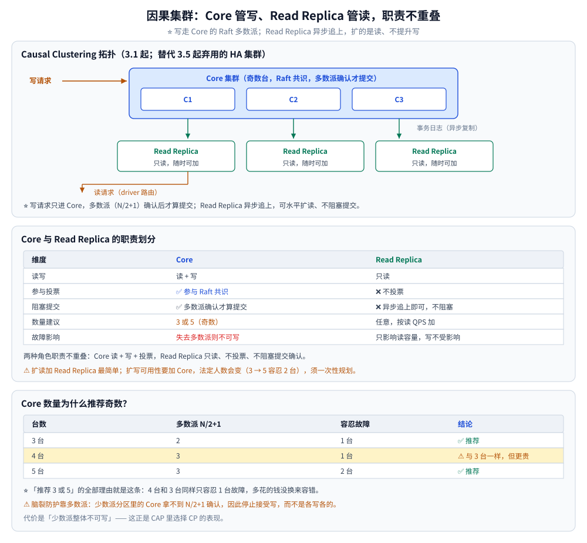
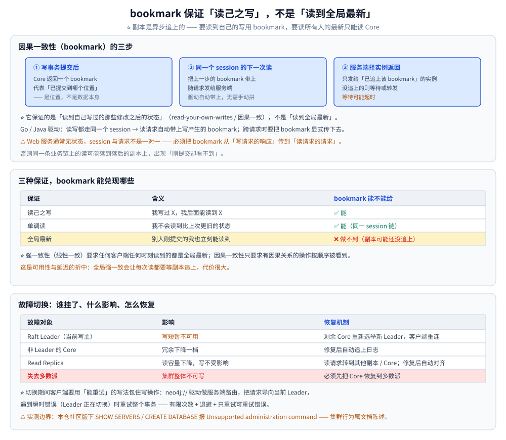

# 因果集群与高可用

> Core / Read Replica 的分工、Raft 在 Neo4j 里的落地、因果一致性（bookmark）、
> 故障切换与在线扩容。
>
> 内容整理自个人学习笔记。**基础框架**参考《Neo4j 权威指南》与官方 Operations Manual
> 「Clustering」章节；版本相关事实以官方 Release Notes 为准。
>
> ⚠️ **实测边界（必须先说清）**：本仓实测环境是 **社区版**（Docker `neo4j:5.26-community`，
> 引擎 **5.26.31**），**集群功能不可用**——实测 `SHOW SERVERS` 与 `CREATE DATABASE` 均返回
> `Unsupported administration command`，`SHOW DATABASES` 只有 `neo4j` / `system` 两个
> `primary` 库。所以**本篇的集群行为（Core 选举、Read Replica 路由、故障切换）属官方文档陈述，未在本机实测**；
> 文末"使用"一节给出的是**单机上能真正跑出来的那部分**（一致性语义与边界确认）。

---

## 一、因果集群的架构是什么？

**本节要点**：Neo4j 的集群叫**因果集群（Causal Clustering，3.1 起）**，分两种角色：
**Core**（处理写、参与投票）与 **Read Replica**（只读、分担读负载、可水平扩）。两者职责不重叠。

```text
                   写请求
                     │
        ┌────────────┴────────────┐
        │      Core 集群（奇数台）  │   ← Raft 共识，多数派确认后才算提交
        │   ┌────┐  ┌────┐  ┌────┐ │
        │   │C1  │  │C2  │  │C3  │ │
        │   └─┬──┘  └─┬──┘  └─┬──┘ │
        └─────┼───────┼───────┼────┘
              │  事务日志（异步复制）
     ┌────────┴───┐ ┌────────┐ ┌────────┐
     │Read Replica│ │Read Rep│ │Read Rep│   ← 只读，随时可加
     └────────────┘ └────────┘ └────────┘
              ▲
              └── 读请求（driver 路由）
```

| 维度 | Core | Read Replica |
|---|---|---|
| 读写 | 读 + **写** | **只读** |
| 是否参与投票 | ✅ 参与 Raft 共识 | ❌ 不投票 |
| 事务是否阻塞提交 | ✅ 多数派确认才算提交 | ❌ 异步追上即可，不阻塞 |
| 数量建议 | **3 或 5**（奇数） | 任意，按读 QPS 加 |
| 故障影响 | 失去多数派则**不可写** | 只影响读容量 |

⚠️ **和旧 HA 集群的关系**：`HA 集群`（主从 + 仲裁）在 **3.5 起被官方弃用**，
因果集群是它的替代者。老资料里的 `ha.*` 配置与 `neo4j-arbiter` 已经不再是主流方案。

---

## 二、Raft 在 Neo4j 里怎么用？

**本节要点**：Core 节点之间用 **Raft** 达成"这个事务算不算提交"的共识 —— **多数派（N/2+1）确认后才提交**。
Raft 的理论细节（Leader 选举、日志复制、任期）本仓另有专篇，这里只讲它在图库里的落点。

| Raft 概念 | 在 Neo4j 里的落点 |
|---|---|
| Leader | 当前的**写主**（Raft Leader），写请求进它 |
| Follower | 其他 Core 节点，参与投票与日志复制 |
| 多数派提交 | 事务在 **N/2+1 个 Core 确认**后才对客户端可见 |
| 任期 / 选举 | Leader 失效后由剩余 Core 重新选举 |

⭐ **Core 数量为什么推荐奇数？**

- 3 台 → 容忍 **1** 台故障（多数派 = 2）；
- 4 台 → 仍只容忍 **1** 台故障（多数派 = 3），**但成本更高**；
- 5 台 → 容忍 **2** 台故障。

所以**偶数台除了更贵没有任何冗余收益** —— 这是"推荐 3 或 5"的全部理由。

⚠️ **脑裂防护靠的就是多数派**：少数派分区里的 Core 无法拿到 N/2+1 确认，因此**停止接受写**，
而不是各写各的。代价是"少数派整体不可写" —— 这正是 CAP 里选择 **CP** 的表现
（理论部分见 [一致性与CAP.md](../../../../04-架构与系统/分布式/理论/一致性与CAP.md)）。

---



## 三、因果一致性怎么保证"读完自己写"？

**本节要点**：集群里读请求可能被路由到 Read Replica，而副本是**异步**追上的。
Neo4j 用 **bookmark（因果令牌）**解决"我写完立刻去读，却读到旧数据"这个问题。

工作原理（三步）：

```text
① 写事务提交后，Core 返回一个 bookmark（代表"已提交到哪个位置"）
② 同一个 session 的下一次读请求带上这个 bookmark
③ 服务端只把请求发给"已经追上该 bookmark"的实例；没追上的则等待或转发
```

⭐ **它保证的是"读到自己写过的那些修改之后的状态"**（read-your-own-writes / 因果一致），
**不是"读到全局最新"**。两者的区别很关键：

| 保证 | 含义 | bookmark 能不能给 |
|---|---|---|
| 读己之写 | 我写过 X，我后面能读到 X | ✅ |
| 单调读 | 我不会读到比上次更旧的状态 | ✅（同一 session 链） |
| 全局最新 | 别人刚提交的我也立刻能读到 | ❌ 做不到（副本可能还没追上） |

```go
// Go / Java 驱动的用法：把 bookmark 留在 session（或显式传递）上
s := d.NewSession(ctx, neo4j.SessionConfig{})
// 写与读都走同一个 session → 读请求自动带上写产生的 bookmark
// ⭐ 跨请求（无状态服务）时，要把上次的 bookmark 从响应里取出、在下次请求里带上
```

⚠️ **实践提醒**：Web 服务通常无状态，session 与请求不是一对一 ——
所以**必须把 bookmark 显式从"写请求的响应"传到"读请求的请求"**（官方驱动提供
`LastBookmarks()` / `WithBookmarks()` 之类的接口），否则同一条业务链上的读可能落到落后的副本上。

---



## 四、故障切换是怎么发生的？

**本节要点**：Core 故障交给 **Raft 重新选举**（自动、秒级）；Read Replica 故障**不影响写**，
只是读容量下降。

| 故障对象 | 影响 | 恢复机制 |
|---|---|---|
| Raft Leader（当前写主） | 写短暂不可用 | 剩余 Core 重新选举出新 Leader，客户端重连 |
| 非 Leader 的 Core | 冗余下降一档 | 修复后自动追上日志 |
| Read Replica | 读容量下降，写不受影响 | 读请求转到其他副本 / Core；修复后自动对齐 |
| **失去多数派** | **集群整体不可写** | 必须先把 Core 恢复到多数派 |

⭐ **故障切换期间客户端要做什么？** 用"能重试"的写法包住写操作——
`neo4j://` 协议的驱动会做**服务端路由**，把请求导向当前 Leader；
遇到瞬时错误（Leader 正在切换）时**重试整个事务**（与
[事务与并发控制.md](事务与并发控制.md) 第四节的重试原则一致：有限次数 + 退避 + 只重试可重试错误）。

⚠️ **5.x 的一个运维变化**：**发现服务（Discovery Service）v1 在 2025.01 移除**，
集群发现机制改为新版方案 —— 老版本的 `causal_clustering.discovery_*` 一类配置在升级时要重新核对。

---

## 五、怎么在线扩容？

**本节要点**：**扩读**加 Read Replica（最常用、最简单）；**扩写可用性**加 Core（要动法定人数，
需谨慎）。两者都不需要停机。

| 目标 | 动作 | 注意 |
|---|---|---|
| 提高读吞吐 / 分摊读压力 | 加 **Read Replica** | 加入后自动拉取全量 + 增量，加入过程对写无影响 |
| 提高写可用性（容忍更多 Core 故障） | 加 **Core** | 法定人数会变（3 → 5 容忍 2 台），要一次性规划好 |
| 单机容量见顶 | 分库 / 换架构（如 Infinigraph 一类的新架构） | 不是"加机器"能解决的，需要数据模型层面的重新设计 |

⚠️ **一个常被忽略的点**：Read Replica 扩的是**读**，**写能力不会因为加副本而提升** ——
所有写仍然要过 Core 的 Raft，单点写的上限由 Core 集群（尤其 Leader）决定。

---

## 使用：单机上能验证到什么程度

**本节要点**：社区版跑不了集群，但**能验证"这个实例到底有没有集群能力""一致性语义是什么"** ——
把"未实测"的边界钉死，比含糊地引用文档更可靠。

```cypher
// ① 确认发行版：community 意味着没有集群能力
CALL dbms.components() YIELD name, versions, edition;

// ② 看库的角色：单机下只有 primary，没有 secondary
SHOW DATABASES YIELD name, store, default, role;

// ③ 直接试集群命令，看它怎么拒绝
SHOW SERVERS;
CREATE DATABASE seconddb;
```

实测输出（本仓 5.26 社区版）：

```text
edition: "community"

name, store, default, role
"neo4j",  "record-aligned-1.1", TRUE,  "primary"
"system", "record-aligned-1.1", FALSE, "primary"

SHOW SERVERS      → Unsupported administration command: SHOW SERVERS
CREATE DATABASE   → Unsupported administration command: CREATE DATABASE seconddb
```

⭐ **判据**：

| 观察 | 判 |
|---|---|
| `edition = community` | 无因果集群、无多库、无在线备份 —— 本篇第一～五节只能是**文档陈述** |
| `SHOW DATABASES` 只有 `neo4j` / `system` 且都 `primary` | 单机；没有 Core / Read Replica 的划分 |
| `SHOW SERVERS` / `CREATE DATABASE` 报 `Unsupported administration command` | 该功能被发行版拒绝，不是配置问题 |

⚠️ 单机上**唯一还保留的集群痕迹**是 `dbms.cluster.routing.getRoutingTable` 这类过程，
它存在**不代表集群可用**，只是接口还在 —— 别被它误导。

---

## 延伸追问

- **因果一致性和强一致性有什么区别？**
  → **强一致性**（线性一致）要求"任何时刻任何客户端读到的都是全局最新"；
  **因果一致性**只要求"有因果关系的操作按顺序被看到"（我写完的我能读到、我读过的不回退），
  不同客户端的无关写**可以**看到不同的新旧。因果集群选的是后者 + Raft 保证的核心一致，
  这是**可用性与延迟**的折中：全局强一致会让每次读都要等副本追上，代价很大。
- **Read Replica 能保证读到最新数据吗？**
  → **不能**。副本是**异步**追上的，所以它可能落后。要读到自己写的数据，必须用 **bookmark**
  （第 3 节）；要读"所有人的最新"，就**只能读 Core**（代价是把读压力压回写集群）。
- **Core 节点数量为什么推荐奇数？**
  → 因为多数派是 `N/2+1`：4 台和 3 台一样只容忍 1 台故障，但 4 台更贵；5 台才多容忍 1 台。
  ⭐ "偶数不划算"是纯数学结论，不是玄学。
- **集群里写会不会因为副本慢而变慢？**
  → **Core 之间的写**要多数派确认，所以受**Core 的网络与磁盘**影响；
  **Read Replica 不参与提交确认**，所以副本再慢也不拖慢写 —— 这正是把读负载放到 Read Replica
  的安全之处。
- **单机能不能通过加 CPU / 内存一直扛下去？**
  → 不能无限扛。原生图存储的"记录号 × 定长"寻址天然是**单机模型**，
  数据量到十亿级以上要换架构（见 [选型与落地案例.md](选型与落地案例.md) 第二节的规模判据）。

---

## 关联

- [事务与并发控制.md](事务与并发控制.md) — 集群下"写后读"的 bookmark 与单机事务语义的衔接
- [架构与存储引擎.md](架构与存储引擎.md) — 为什么原生图存储天然偏单机、扩容要靠集群与新架构
- [运维与调优.md](运维与调优.md) — 集群状态监控、备份策略与社区版 / 企业版的能力差异
- [选型与落地案例.md](选型与落地案例.md) — 需要千亿级规模时为什么转向 NebulaGraph 一类
- [README.md](README.md) — 本目录导读：版本坐标与阅读顺序
- [Raft协议.md](../../../../04-架构与系统/分布式/理论/Raft协议.md) — Raft 的理论细节：选举、日志复制、任期
- [一致性与CAP.md](../../../../04-架构与系统/分布式/理论/一致性与CAP.md) — 因果一致在一致性谱系里的位置
