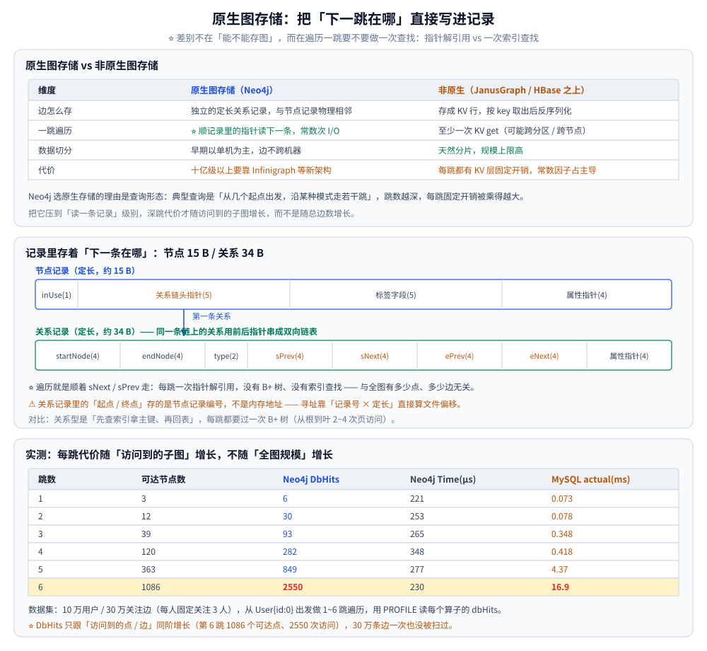
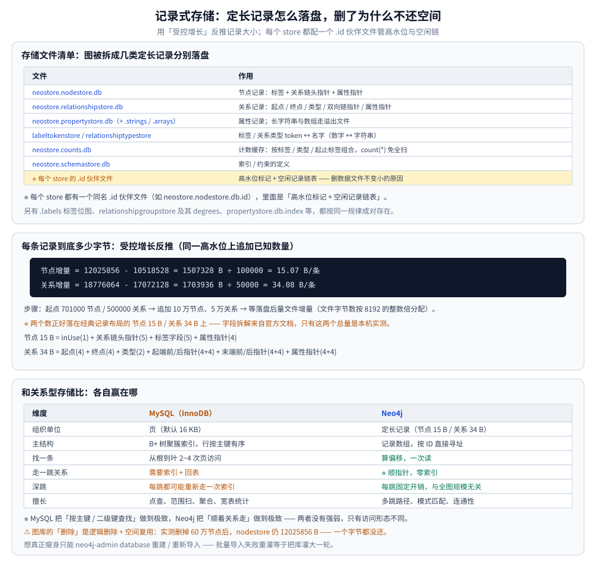

# 架构与存储引擎

> 原生图存储、无索引邻接、记录式存储的文件结构，以及它与关系型存储的本质差异。
>
> 内容整理自个人学习笔记。**基础框架**参考《Neo4j 权威指南》与官方 Operations Manual
> 「Database internals」相关章节；版本相关事实以官方 Release Notes 为准。
> 文中读数实测于 Docker `neo4j:5.26-community`（引擎 **5.26.31**），
> 数据集 10 万用户 / 30 万关注边。

---

## 一、原生图存储和非原生图存储差在哪？

**本节要点**：差别不在"能不能存图"，而在**遍历一跳要不要做一次查找**。原生图存储把相邻记录直接用指针串起来，非原生把关系当普通行存进 KV / 列族，遍历一跳就是一次二次查询。

| 维度 | 原生图存储（Neo4j） | 非原生图存储（JanusGraph / HBase、Cassandra 之上） |
|---|---|---|
| 边怎么存 | 独立的**定长关系记录**，与节点记录物理相邻访问 | 存成 KV 行（`outKey → 邻接表`），要按 key 查出来再反序列化 |
| 一跳遍历 | 顺着记录里的**指针**读下一条，常数次 I/O | 至少一次 KV `get`（可能跨分区、跨节点） |
| 数据切分 | 早期版本以单机为主，边不跨机器 | 天然分片，规模上限高 |
| 代价 | 大规模（十亿级以上）要靠 Infinigraph 等新架构 | 每跳都有 KV 层的固定开销，跳到后来常数因子占主导 |

Neo4j 选择原生图存储的核心理由是**查询形态**：图库的典型查询是「从一个 / 几个起点出发，沿某种模式走若干跳」，
跳数越深、每跳的固定开销被乘得越大；把它压到"读一条记录"级别，才能让深跳的代价随**访问到的子图大小**增长，
而不是随**总边数**增长。

⚠️ 一个实测细节：`SHOW DATABASES` 里每个库有一个 `store` 列，本仓实例返回
`record-aligned-1.1`，说明它落在**经典定长记录**布局上（下一节展开）。

---



## 二、无索引邻接为什么让每跳都是 O(1)？

**本节要点**：每个节点记录里直接存着**指向它第一条关系的物理指针**，关系记录里又存着**指向同一条链上前后关系的指针**。所以"从 A 走到邻居 B"= 读一条记录 + 读它的链，**不需要任何索引查找**，代价与全图有多少点多少边无关。

```text
        节点记录（定长，约 15 B）
        ┌──────────────────────────────────────────┐
        │ inUse │ 关系链指针 ─────┐ │ 标签字段 │ 属性指针 │
        └───────────────────────┼──────────────────┘
                                │
                                ▼
   关系记录（定长，约 34 B）—— 同一条链上的关系用「前后指针」串成双向链表
        ┌────────────────────────────────────────────────────────────┐
        │ startNode │ endNode │ type │ sPrev │ sNext │ ePrev │ eNext │ 属性指针 │
        └────────────────────────────────────────────────────────────┘
                              │        ▲
                              ▼        │
                         下一条关系 ────┘   ← 遍历就是顺着指针走，没有 B+ 树
```

⭐ 一句话对比：**关系型是"先查索引拿到主键，再回表"；原生图是"记录里就写着下一条记录在哪"。**
前者每跳都要过一次索引结构（B+ 树从根走到叶，通常 2~4 次页访问），后者每跳就是一次指针解引用。

### 2.1 实测：每跳的代价随子图增长，不随全图增长

数据集固定为 10 万用户、30 万关注边（每人固定关注 3 人），从 `User{id:0}` 出发做 1~6 跳遍历，
用 `PROFILE` 看每个算子的 `dbHits`（与存储层交互次数）：

| 跳数 | 可达节点数 | DbHits | Time(µs) | 内存(B) |
|---|---|---|---|---|
| 1 | 3 | 6 | 221 | 584 |
| 2 | 12 | 30 | 253 | 1048 |
| 3 | 39 | 93 | 265 | 3064 |
| 4 | 120 | 282 | 348 | 6464 |
| 5 | 363 | 849 | 277 | 21360 |
| 6 | 1086 | 2550 | 230 | 83352 |

⭐ 注意 **DbHits 只跟"访问到的点/边"同阶增长**（第 6 跳 1086 个可达点、2550 次访问），
而 30 万条边一次也没被扫过 —— 这就是"查询时间与图整体规模无关"的实证。

### 2.2 对照：同一张图，关系型要付什么代价

把同一份数据（同构公式生成）灌进 MySQL 8.0，用**递归 CTE** 求同样的逐跳可达：

| 跳数 | Neo4j 可达 | Neo4j DbHits | Neo4j Time(µs) | MySQL 可达 | MySQL actual(ms) |
|---|---|---|---|---|---|
| 1 | 3 | 6 | 221 | 3 | 0.073 |
| 2 | 12 | 30 | 253 | 12 | 0.078 |
| 3 | 39 | 93 | 265 | 39 | 0.348 |
| 4 | 120 | 282 | 348 | 120 | 0.418 |
| 5 | 363 | 849 | 277 | 363 | 4.37 |
| 6 | 1086 | 2550 | 230 | 1087 | 16.9 |

⚠️ 两点如实说明：① 6 跳差 1 个节点，是 Neo4j 有 300000 条边、MySQL 因主键去重剩 299998 条所致；
② 这是**单机、数据全在缓存里**的场景，MySQL 前几跳并不慢（毫秒级），差距在**跳数变深时被逐跳放大**
（第 6 跳已差约 70 倍）。⚠️ 时序读数有波动，只保证"随跳数单调放大"这个趋势。

---



## 三、记录式存储长什么样？

**本节要点**：Neo4j 把图拆成几类**定长记录**分别落盘：节点一条、关系一条、属性一条。定长意味着「第 N 条记录」的位置可以**直接算出来**，不需要索引就能 O(1) 定位。

### 3.1 存储文件清单

在容器里看 `/data/databases/neo4j/`（实测快照，101000 节点 / 300000 关系）：

| 文件 | 作用 |
|---|---|
| `neostore` | 库的元信息（格式版本等） |
| `neostore.nodestore.db` | **节点记录**：标签 + 关系链头指针 + 属性指针 |
| `neostore.nodestore.db.labels` | 节点的标签位图（多标签时用） |
| `neostore.relationshipstore.db` | **关系记录**：起点 / 终点 / 类型 / 双向链指针 / 属性指针 |
| `neostore.relationshipgroupstore.db` | 关系的"分组"记录（按类型聚合，密集节点用） |
| `neostore.relationshipgroupstore.degrees.db` | 每组的度数（避免数链长度） |
| `neostore.propertystore.db` | 属性记录（键 + 值） |
| `neostore.propertystore.db.strings` | **长字符串**溢出文件 |
| `neostore.propertystore.db.arrays` | **数组**溢出文件 |
| `neostore.propertystore.db.index` | 属性键 → 键名 token 的映射（内部） |
| `neostore.labeltokenstore.db(.names)` | 标签 token ↔ 名字（数字 ↔ 字符串） |
| `neostore.relationshiptypestore.db(.names)` | 关系类型 token ↔ 名字 |
| `neostore.counts.db` | 各类计数的缓存（`count(*)` 免全扫） |
| `neostore.indexstats.db` | 索引的统计信息（给优化器用） |
| `neostore.schemastore.db` | 索引 / 约束的定义 |

⭐ **每个 store 都有一个同名 `.id` 伙伴文件**（如 `neostore.nodestore.db.id`），里面是该 store 的
**高水位标记 + 空闲记录链表** —— 这也是为什么"删了数据文件不变小"。

### 3.2 每条记录到底多少字节？

用**受控增长**反推（在同一高水位上追加已知数量的记录，等落盘后量文件增量）：

| 步骤 | 节点数 | 节点 store 字节 | 关系数 | 关系 store 字节 |
|---|---|---|---|---|
| 起点 | 701000 | 10518528 | 500000 | 17072128 |
| +10 万节点 | 801000 | 12025856 | — | — |
| +5 万关系 | — | — | 550000 | 18776064 |

```text
节点记录增量 = 12025856 - 10518528 = 1507328 B ÷ 100000 = 15.07 B/条
关系记录增量 = 18776064 - 17072128 = 1703936 B ÷  50000 = 34.08 B/条
```

⭐ 两个数正好落在 Neo4j 经典记录布局的 **节点 15 B / 关系 34 B** 上（官方存储文档的取值）：

```text
节点记录 15 B = inUse(1) + 关系链头指针(5) + 标签字段(5) + 属性指针(4)
关系记录 34 B = 起点(4) + 终点(4) + 类型(2) + 起端前/后指针(4+4) + 末端前/后指针(4+4) + 属性指针(4+4)
```

⚠️ **字段拆解来自官方文档，只有"15 B / 34 B 这两个总量"是本机实测**；
⚠️ 关系那 34 B 里"起点 / 终点"存的是**节点记录编号**，不是指针地址 —— 所以 Neo4j 内部寻址靠
「固定记录号 × 记录大小」直接算文件偏移，这也是定长记录最大的红利。

### 3.3 节点删除后文件为什么不缩小

`neostore.*.db.id` 里维护**空闲记录链表**：删掉的记录只是被摘进空闲链，等下次新建时**复用**。
实测把探测用的 60 万节点全部 `DETACH DELETE` 后，节点数回到 101000，但
`neostore.nodestore.db` 仍是 12025856 B，**一个字节都没还**。

⚠️ 推论：**图库的"删除"是逻辑删除 + 空间复用，不是空间回收**。所以
① 批量导入失败重灌等于把库灌大一轮；② 想真正瘦身只能 `neo4j-admin database …` 重建 / 重新导入。

---

## 四、存储格式演进到哪一步了？

**本节要点**：5.x 起官方推出了新的 **block storage format**（2025.01 之后的版本默认线），但它**不是所有 5.x 都默认开**。本仓实测的 5.26 实例 `db.format` 仍是 `aligned`、store 标识 `record-aligned-1.1`，也就是**经典定长记录布局**。

| 特征 | 经典记录布局（`aligned`） | 新 block 布局 |
|---|---|---|
| 记录组织 | 每类记录一个定长数组文件 | 按 **block（块）** 组织，一节点 / 一关系一组数据落在同一块 |
| 读取 | 定位记录号 → 算偏移 → 读定长记录 | 读一个块，块内自带该实体的全部数据 |
| 本仓实测 | ✅ 就是这套（`store=record-aligned-1.1`） | ❌ 未实测（本版本未启用） |

⭐ 另外两件和"格式"有关的变化：

- **大 ID 支持**：节点 / 关系 ID 空间扩到 **2^35**（约 343 亿），单库能装下的实体数量级抬高；
- **索引独立成文件**：范围 / 全文 / 向量等索引不再挤在属性文件里，各自有独立的存储与生命周期。

⚠️ **未实测声明**：block 布局的内部结构（块大小、块内布局）本次没有实测数据，
上表右侧一列基于官方发布说明，**不得当作本机读数引用**。

---

## 五、和关系型存储比，各自赢在哪？

**本节要点**：MySQL 用 **B+ 树 + 页 + 聚簇索引**把"按主键 / 二级键查找"做到极致；Neo4j 用**定长记录 + 指针**把"顺着关系走"做到极致。两者没有强弱，只有**访问形态**不同。

| 维度 | MySQL（InnoDB） | Neo4j |
|---|---|---|
| 组织单位 | 页（默认 16 KB） | 定长记录（节点 15 B / 关系 34 B） |
| 主结构 | B+ 树聚簇索引，行按主键有序 | 记录数组，按 ID 直接寻址 |
| 找一条 | 从根到叶 2~4 次页访问 | 算偏移，一次读 |
| 走一跳关系 | 需要索引（如 `idx(follower_id)`）+ 回表 | 顺指针，零索引 |
| 深跳 | 每跳都可能重新走一次索引 | 每跳固定开销，与全图规模无关 |
| 擅长 | 点查、范围扫、聚合、宽表统计 | 多跳路径、模式匹配、连通性 |

⭐ **判据（用到哪边）**：

- 查询里出现「**不确定跳数**的关系展开」「找两点间路径」「某模式的子图匹配」→ 图库；
- 查询是「**按条件筛选一批行 + 聚合 / 排序**」「全表统计」→ 关系型（图库这几项会明显吃亏，见
  [选型与落地案例.md](选型与落地案例.md) 第四节）。

---

## 使用：核对一个 Neo4j 实例的存储布局

**本节要点**：不用读源码，靠几条命令 + 看文件，就能确认"这个库到底用的哪套格式、占多大、删除有没有还空间"。

```bash
# ① 引擎版本与发行版
docker exec -i neo4j-lab cypher-shell -u neo4j -p neo4jtest123 \
  --format plain "CALL dbms.components() YIELD name, versions, edition;"
```

```text
# ② 库的存储标识：record-aligned-1.1 = 经典定长记录布局
docker exec -i neo4j-lab cypher-shell -u neo4j -p neo4jtest123 \
  --format plain "SHOW DATABASES YIELD name, store, default, role;"
```

```bash
# ③ 图规模（走 counts 缓存，不扫全图）
docker exec -i neo4j-lab cypher-shell -u neo4j -p neo4jtest123 \
  --format plain "CALL db.stats.retrieve('GRAPH COUNTS');"

# ④ 看记录文件的实际占用（注意：字节数是高水位，删数据不会还）
docker exec neo4j-lab bash -lc "ls -l /data/databases/neo4j/neostore.nodestore.db \
  /data/databases/neo4j/neostore.relationshipstore.db"
```

⭐ 判据三条：① `db.format=aligned` 且 `store=record-aligned-1.1` → 经典布局，本文的记录大小结论适用；
② 所有 store 文件字节数**都是 8192 的整数倍** → 落盘按 8 KB 块分配；
③ 删除大量数据后文件**只增不减** → 空间靠 `.id` 文件里的空闲链复用，别指望 `DELETE` 瘦身。

> ⚠️ `db.stats.retrieve` 只认 `GRAPH COUNTS` / `TOKENS` / `QUERIES` 三个 section，
> 传 `'STORE SIZE'` 会直接报错（实测踩过）——想要字节数只能看文件。

---

## 延伸追问

- **无索引邻接为什么比 B+ 树索引快？**
  → 因为省掉了"索引查找"这一整层：B+ 树每查一次要从根走到叶（2~4 次页访问），
  而邻接指针是**记录里现成的地址**，一次定位。跳数越深，这个常数差的累积越明显
  （本文第 2.2 节：6 跳时 Neo4j 2500 次访问 vs MySQL 16.9 ms）。
  ⚠️ 但**只在"顺关系走"时成立**——如果要"按属性找起点"，图库一样得建索引，这时两者回到同一起跑线。
- **节点删除后指针怎么处理？**
  → 节点记录先被摘进 `.id` 的空闲链表，**它的关系要先全部删掉**（`DETACH DELETE` 就是干这个）；
  删掉的记录空间被后续新建**复用**，文件本身不缩小。所以"删了 60 万节点文件没变小"是正常行为，不是 bug。
- **原生图存储的局限性是什么？**
  → 三条：① **单机**——记录靠"记录号 × 定长"寻址，天然假设数据在一台机器上，横向扩展要靠
  因果集群（读扩展）或 Infinigraph（新架构）；② **聚合与全表扫描吃亏**——没有列存 / 分区裁剪，
  大面积统计不如关系型；③ **写入放大**——每条关系要维护两端的链指针，超级节点（百万度）上写一条边会变慢。
- **`count(*)` 为什么不用扫全图？**
  → `neostore.counts.db` 里存着按「标签 / 关系类型 / 起止标签组合」维度的计数，`MATCH (n) RETURN count(n)`
  直接读缓存（实测 `GRAPH COUNTS` 秒回）。⚠️ 一旦查询带上**属性过滤**，counts 就失效，得真扫。

---

## 关联

- [Cypher查询与执行计划.md](Cypher查询与执行计划.md) — 本文的"为什么快"换成 Cypher 语句后，怎么用 `PROFILE` 看出来
- [索引设计与查询优化.md](索引设计与查询优化.md) — "按属性找起点"那一半：五类索引各管什么
- [事务与并发控制.md](事务与并发控制.md) — 定长记录被并发修改时，锁与事务日志怎么配合
- [因果集群与高可用.md](因果集群与高可用.md) — 单机存储之上怎么把读 / 写扩出去
- [选型与落地案例.md](选型与落地案例.md) — 什么场景不该上图库（原生存储的局限那一节）
- [存储选型.md](../../存储选型.md) — 七类存储的总览表，图库在全景里的位置
- [README.md](README.md) — 本目录导读：版本坐标与阅读顺序
- [日志与持久化.md](../../关系型/MySQL/日志与持久化.md) — 关系型侧"页 + redo"的对照物
- [索引设计与EXPLAIN.md](../../关系型/MySQL/索引设计与EXPLAIN.md) — B+ 树那一侧：为什么每跳都要过索引
> 反向引用（本篇被下列文档引到）：[GDS图算法实战.md](GDS图算法实战.md)、[向量索引与GraphRAG.md](向量索引与GraphRAG.md)、[数据建模与导入.md](数据建模与导入.md)、[运维与调优.md](运维与调优.md)、[图数据库选型对比.md](../图数据库选型对比.md)、[关注粉丝设计.md](../../../../04-架构与系统/系统设计/社交互动系统/关注粉丝设计.md)
