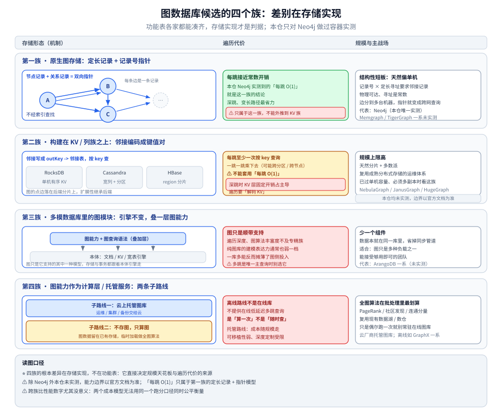
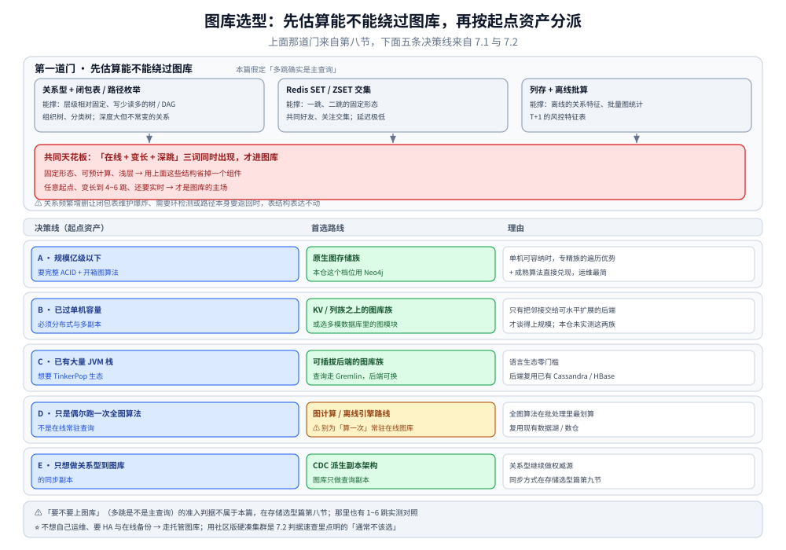

# 图数据库选型对比

> 中立视角的跨产品图库选型：先立住「决定要上图库之后真正要回答的三个问题」与
> **选型前必须先量化的五个数**，再按**存储实现**把候选分成四族逐维对照，
> 补上查询语言 / GQL 标准化对迁移成本的影响、多模图库、托管与图计算路线、图算法与向量-AI 能力，
> 最后按**起点资产**给五条决策线，以及一次可信横评该看哪几个读数。
>
> ⭐ 边界先说清：本篇**只补跨产品的域级中立维度**，不重复已有两篇的表与判据。
> 以 Neo4j 为出发点的四家对比表、六问决策顺序、落地案例、不该上图库的场景、契合语言表与 30 分钟可行性判定，
> 全在 [选型与落地案例.md](Neo4j/选型与落地案例.md)，本篇一律**链接 + 一句话指路**；
> 「要不要上图库」（多跳是不是主查询）的**准入判据**与 1~6 跳实测对照在
> [数据库选型对比.md](../数据库选型对比.md) 第六节，本篇**不重讲**，只讲「决定要上图库之后，图库之间怎么选」。
>
> 内容整理自个人学习笔记，并参考各家官方文档与 Release Notes；素材见 [素材清单.md](../../../素材清单.md)。
>
> ⚠️ 实测口径：**本仓只对 Neo4j 做过容器实测**（Docker `neo4j:5.26-community`，10 万用户 / 30 万关注边），
> 其余图库一律**文档陈述、未实测**，凡涉及规模与性能处都写明来源；
> ⚠️ 且本仓那条「每跳 O(1) 无索引邻接」的结论**只属于原生图存储**，不能外推到构建在 KV 上的图库。

---

## 一、决定要上图库之后，真正要回答的是哪三个问题？

**本节要点**：准入判据（多跳是不是主查询）不在这篇里，见 [数据库选型对比.md](../数据库选型对比.md) 第六节；
本篇假设「已经决定要上图库」，此时把候选砍到两家之前，只需回答三个问题。

### 1.1 三个问题

| # | 问题 | 它决定了什么 | 卡住时指向 |
|---|---|---|---|
| ① | **规模有没有过单机容量？** | 决定**存储实现路线** —— 没过，原生图存储的单机形态最省心；过了，就得选构建在 KV / 列族上的分布式族或多模族 | 见第三节四族 |
| ② | **要不要完整 ACID 与开箱图算法？** | 决定选**生态成熟的**（原生图 + 成熟算法库）还是**分布式优先的**（算法常要外挂或自建） | 见第四节 |
| ③ | **查询语言能不能重写？** | 换产品 ≈ 换方言：Cypher / Gremlin / 私有 DSL 三者互不兼容，迁移成本主要砸在这一项 | 见第六节 |

### 1.2 ⚠️ 准入判据不属于本篇

「关系网是不是主查询」这一关**先过 [数据库选型对比.md](../数据库选型对比.md) 第六节**：
本仓实测已经给出「1~3 跳图库并不比 MySQL 递归 CTE 快，6 跳才拉开量级」的结论，
**多跳不是主查询就别上图库**，本篇往后所有讨论都建立在「多跳确实是主查询」之上。
四家具体产品的对比表与决策顺序也**已各自写透**，见 [选型与落地案例.md](Neo4j/选型与落地案例.md)，本篇不复制。

---

## 二、选型前必须先量化的五个数？

**本节要点**：五个数先定下来，候选会自动缩到两三家，比任何功能对照表都有效 —— ⭐ **不要跳过量化直接看功能表**。

### 2.1 五个输入

| # | 量什么 | 怎么量 | 为什么它决定选型 |
|---|---|---|---|
| ① | **点与边的规模** | 分别数节点数与关系数，图库的负载通常是「边远多于点」 | 决定单机型还是分布机型；边规模比点规模更早触顶 |
| ② | **每跳扇出（出度 / 入度）** | 统计顶点的平均与**最大**度数，重点看头部超级节点 | ⭐ 超级节点是图库的头号杀手，扇出分布比总量更能决定表现 |
| ③ | **跳数与查询形态** | 平均 / 最大查询跳数，再分「定长遍历 / 变长遍历 / 全图算法」各占多少 | 决定选声明式图语言还是遍历式 API、要不要算法引擎 |
| ④ | **读写比与写入吞吐** | 每秒建 / 改多少点边，读放大多少 | 决定要不要为写路径专门设计，多模族与 KV 族的写代价不同 |
| ⑤ | **可用性与备份要求** | 单机可接受？要不要多副本、在线备份、跨地域 | ⚠️ 社区版能力边界会直接把选型推向商业版 / 托管 |

### 2.2 每个数会砍掉哪些候选

| 条件 | 直接排除 | 保留 |
|---|---|---|
| 边规模已过单机舒适区 | 单机为主的**原生图存储族** | 构建在 KV / 列族上的分布式族、多模族 |
| 头部存在高度倾斜的超级节点 | 「一跳即查全邻接」的形态（各族都要单独测） | 邻接分片 / 度数分桶做得好的实现 |
| 要完整 ACID | 只提供最终一致或事务取决于后端的形态 | 原生图库、事务型多模库 |
| 主要跑全图算法而非在线遍历 | 在线图库（为常驻服务而设计） | ⭐ 图计算 / 离线引擎路线（见第八节 D 线） |
| 要 HA / 在线备份但预算有限 | 集群与在线备份锁在商业版的形态 | 托管服务、或把备份外包给云的形态 |

> ⚠️ 第②条是本篇相对 Neo4j 单产品篇**额外强调**的一项：**扇出倾斜**在图库里比在关系库里致命得多 ——
> 原生存储「每跳读一条邻接链」的前提是邻接链可被高效分段，一个度数极高的顶点会把这一跳的常数因子重新放大。

---

## 三、候选按「存储实现」分成哪四族？

**本节要点**：产品有十几家，存储实现只有四条路线 —— 先分族，**本仓那条「每跳 O(1)」只属于第①族**。
代表产品列举仅为「这一族的典型」，⚠️ 各家能力边界以官方文档为准，本仓未实测除 Neo4j 外的任何一个。



说明：每行左列画该族的存储形态，中列写遍历代价，右列写规模与主战场。第一族的「每跳接近常数开销」是本仓 Neo4j 实测到的「每跳 O(1)」，**只属于这一族**；第二族每跳至少一次按 key 查询（可能跨分区 / 跨节点），深跳时 KV 层固定开销占主导；第三族图只是「顺带支持」；第四族的离线路线「是『算一次』不是『随时查』」。另注意第一族那个结构性短板：记录号 × 定长寻址天然偏单机，调优填不平。

### 3.1 第一族：原生图存储

**机制一句话**：节点 / 关系用**定长记录 + 记录号指针**物理串起来，遍历时顺指针读下一条邻接记录，不经索引查找。

| | 强在哪 | 弱在哪 |
|---|---|---|
| **原生图存储** | 遍历每跳接近常数开销（本仓实测的「每跳 O(1)」就是这一族，见 [架构与存储引擎.md](Neo4j/架构与存储引擎.md)）；深跳、变长路径最省力 | 记录号 × 定长寻址**天然偏单机**，规模上限与水平扩展是结构性短板 |

- **代表**：Neo4j 是本仓唯一实测过的原生图库；同类还有 Memgraph、TigerGraph 一系（⚠️ 本仓未实测，特性以官方文档为准）。
- ⭐ **什么团队会选**：规模在单机可容纳区间、要完整 ACID、要开箱图算法与成熟生态的团队。深入见 [Neo4j 目录导读](Neo4j/README.md)。

### 3.2 第二族：构建在 KV / 列族之上

**机制一句话**：把邻接关系编码成 KV 对存进 RocksDB / Cassandra / HBase 这类后端，**继承后端的水平扩展与容错**。

| | 强在哪 | 弱在哪 |
|---|---|---|
| **KV / 列族之上的图库** | 天然分片、规模上限高、复用成熟分布式存储的运维体系 | ⚠️ **遍历要「解码 KV」** —— 每跳至少一次按 key 查询（可能跨分区 / 跨节点），深跳时 KV 层固定开销占主导 |

- **代表**：NebulaGraph（自研 KVStore）、JanusGraph（Cassandra / HBase 之上）、HugeGraph 一系。
- ⚠️ **关键提醒**：这一族**不能套用本仓「每跳 O(1)」的结论** —— 那句话只属于第一族的定长记录 + 指针模型（[架构与存储引擎.md](Neo4j/架构与存储引擎.md) 有对照）。
- ⭐ **什么团队会选**：已过单机容量、必须有分布式与多副本、且团队已有 KV / 大数据存储运维能力的团队。

### 3.3 第三族：多模数据库里的图模块

**机制一句话**：本质是文档 / KV / 宽表引擎，**在其上叠一层图能力与图查询语法**，图库只是它支持的其中一种模型。

| | 强在哪 | 弱在哪 |
|---|---|---|
| **多模图库** | 一套引擎同时装文档 / KV / 图，**少一个组件**；数据本就在同一库里省去同步管道 | 图只是「顺带支持」—— 遍历深度、图算法丰富度、纯图库的建模表达力通常不及专精族 |

- **代表**：ArangoDB 一系（文档 + 键值 + 图多模，AQL 统一查询）。
- ⭐ **什么团队会选**：图只是多种负载之一、不想再引入一个专职存储、且能接受「够用即可」的团队。
- ⚠️ **别踩**：如果多跳是**唯一**主查询，专精族的图建模与算法生态更贴合，多模族的「一库多能」反而摊薄了图侧投入。

### 3.4 第四族：图能力作为计算层 / 托管服务

**机制一句话**：**两条子路线** —— 一条是「云上托管图库」（把运维 / 集群 / 备份交给云），
一条是「不存图、只算图」（图数据落在已有存储里，用图计算 / 离线引擎临时加载做全图算法）。

| 子路线 | 强在哪 | 弱在哪 |
|---|---|---|
| **托管图库** | 免运维、弹性、自带 HA / 备份，绕开社区版能力边界 | 成本随规模走、可移植性弱、深度定制受限 |
| **图计算 / 离线引擎** | 全图算法（PageRank / 社区发现 / 连通分量）在批处理里最划算，复用现有数据湖 / 数仓 | ⚠️ **不提供在线低延迟多跳查询** —— 它是「算一次」不是「随时查」 |

- **代表**：云厂商托管图库；离线计算侧如 Spark GraphX 一系。
- ⭐ **什么团队会选**：托管路线给「不想自己运维」的团队；离线路线给**只是偶尔跑一次全图算法**的团队（见第八节 D 线，别为它常驻一套在线图库）。

---

## 四、同一组维度怎么对照？

**本节要点**：按**族**（而非逐产品）拉平看六列，但 ⚠️ 有一列绝不能横向比。
逐产品的对比表见 [选型与落地案例.md](Neo4j/选型与落地案例.md)，本篇只保留**族级**的定性骨架。

### 4.1 族级六维对照表

| 族 / 典型代表 | 存储实现 | 查询语言与标准化 | 分布式与 HA | 事务 | 图算法与向量-AI | 许可与运维 |
|---|---|---|---|---|---|---|
| 原生图存储（Neo4j 等） | 定长记录 + 指针，遍历每跳近常数 | 声明式图语言，标准化程度高（见第六节） | 偏单机；集群 / HA 常在商业版 | 完整 ACID | 通常最成熟，常带独立算法库与向量能力 | 开源单机 + 商业集群；运维简单 |
| KV / 列族之上（NebulaGraph / JanusGraph / HugeGraph 等） | 邻接编码为 KV，继承后端扩展 | 各家方言或遍历式 API，标准化程度不一 | 原生分片 + 多数派 | 视后端，多为强一致或受限事务 | 部分内置、常需外挂 | 依赖后端运维栈，运维面更宽 |
| 多模图库（ArangoDB 等） | 文档 / KV 引擎上叠图 | 统一查询语言覆盖多模型 | 依托引擎自身的复制 / 分片 | 视产品，多为文档级事务 | 图算法子集，够用即可 | 一库多能，组件数最少 |
| 计算 / 托管（云托管 + GraphX 一类） | 托管存储 / 内存图计算 | 托管沿用底层语言；离线用 API | 托管自带弹性；离线随批处理 | 在线托管看底层；离线无在线事务 | 全图算法强，但非在线 | 免运维（托管）/ 复用现有栈（离线） |

⚠️ **本表只作定性对照**，单元格刻意不带数字与排名 —— 各家的版本、许可与功能边界随版本调整，落地前逐条核官方文档。

### 4.2 怎么读这张表

1. **先看「存储实现」列**：它直接对应第三节四族，决定了规模天花板与遍历代价的来源。
2. **再看「查询语言」列**：这一步决定团队要重写多少查询（第六节展开）。
3. **最后看「许可与运维」列**：⭐ 成本是 **许可 + 硬件 + 人力 + 迁移** 四项之和，省下的许可费常被人力吃掉。

### 4.3 ⚠️ 这一列不能横向比：性能

- 各家公开的 benchmark 都带**明确前置条件**（硬件、版本、数据形态、扇出分布、查询组合）—— ⭐ **当「口径」读，不当「结论」用**。
- 图库性能对**数据形态**极其敏感：均匀扇出的规则和图与真实社交网络的倾斜图结论可以相反（超级节点，见第二节）。
- ⚠️ **跨族比数字尤其没意义**：原生族「每跳读一条记录」与 KV 族「每跳解一次 KV」根本是两个成本模型，同一个跑分口径无法同时公平衡量两者。
- 正确做法只有一个：**用你自己的数据和查询组合做横评**（见本篇 `## 使用`）。

---

## 五、同类产品怎么选？

**本节要点**：第三节按**存储实现**分四族，这一节把每族里的**具体产品**排开；图库这一步的判据比别处更狠 —— **换产品 ≈ 换方言 ≈ 重写全部查询**（第六节展开），所以「同族里选哪个」往往就是「方言选哪个」。

### 5.1 原生图存储族

| 产品 | 优先选它 | 慎选 / 别选 |
|---|---|---|
| **Neo4j** | 要完整 ACID + 开箱图算法 + 成熟的 Cypher 生态；单机能装下 | 规模已过单机容量、又不接受商业版集群（✅ 本仓实测） |
| **Memgraph 一类** | 要在原生模型上换一套运行时 / 部署形态 | ⚠️ 生态与人才池比 Neo4j 薄；本仓**未实测** |

### 5.2 构建在 KV / 列族之上

| 产品 | 优先选它 | 慎选 / 别选 |
|---|---|---|
| **NebulaGraph** | 原生分布式、规模优先、要自己掌控集群 | ⚠️ 运维面依赖自身组件栈，遍历延迟受 KV 层影响 |
| **JanusGraph / HugeGraph 一类** | 想复用已有 HBase / Cassandra 存储层 | ⚠️ 后端组件越多，排障链路越长 |

### 5.3 多模数据库里的图模块

| 产品 | 优先选它 | 慎选 / 别选 |
|---|---|---|
| **ArangoDB 一类** | 一库要同时覆盖文档 + 图、组件数想最少 | 图算法只到「够用」的程度，别按原生族的深度预期 |

### 5.4 图能力作为计算层 / 托管服务

| 产品 | 优先选它 | 慎选 / 别选 |
|---|---|---|
| **云托管图库 / GraphX 一类离线引擎** | 只是偶尔跑一次全图算法（离线）；或不接受自建运维 | 在线低延迟多跳遍历（离线引擎不是为在线设计的） |

> **族内判据**：**用「方言 + 规模 + 在线还是离线」三问在族内收敛** —— 查询能重写、规模单机装得下 → 原生族；规模优先且能自建 → KV / 列族之上；一库多模型 → 多模；只跑离线算法 → 计算层。
> ⚠️ 逐产品的对比表与驱动版本坑见 [选型与落地案例.md](Neo4j/选型与落地案例.md)（本篇只保留族级 + 产品级骨架）。

---

## 六、查询语言与 GQL 标准化怎么影响迁移成本？

**本节要点**：图库之间最贵的一笔迁移账不在数据，在**查询** —— 换产品往往意味着重写查询层。

### 6.1 三类语言生态

| 类别 | 典型 | 特点 | 迁移含义 |
|---|---|---|---|
| **Cypher 系** | Neo4j、多家已跟进 | 声明式模式匹配，**有 GQL 标准化背书**（Cypher 是 GQL 的主要参考） | 语言层最「保值」：会 Cypher 的人多，跨支持 GQL 的产品迁移面较小 |
| **Gremlin / TinkerPop** | JanusGraph 等 JVM 系图库 | **遍历式 API**（step 链式），JVM 生态主场 | 与声明式写法范式不同，迁到 Cypher 系近乎重写；好处是可换后端存储而语法相对稳定 |
| **私有方言** | 各家自研 DSL（nGQL / GSQL 一类） | 贴合自家引擎、能力可能领先标准 | ⚠️ 绑定最深：换产品 = 查询层整体重写，退出成本最高 |

> ⭐ 「Cypher 已覆盖 GQL 大部分」这类**版本事实**以 [Neo4j 目录导读](Neo4j/README.md) 的版本坐标为准，本篇不逐条罗列。

### 6.2 为什么说「换产品 ≈ 重写查询」

三种语言的**建模范式**不同（声明式模式匹配 vs 命令式遍历 vs 方言），不只是关键字差异：
同一条「三度人脉里共同关注」的逻辑，在 Cypher 里是一段模式，在 Gremlin 里是一条 step 链，在方言里可能又是另一套 API。
⚠️ 迁移时**数据能导，查询不能搬**。

### 6.3 做法：先做一份「查询清单」再评估

1. 把线上 / 计划中的图查询列一张清单：**每条写明跳数、是否变长、是否超级节点、读写比**。
2. 标出清单里**最关键的 3~5 条**（占调用量或业务价值最高的）。
3. 候选产品**只针对这几条各写一版**，评估「要改多少、谁维护得起」。
4. 把「查询语言可迁移性」当成一项显式打分维度，而不是等上线后才后悔。

---

## 七、和编程语言生态怎么契合？

**本节要点**：图库的驱动 / 建模工具 / 可视化在语言侧差距极大，这是选型落地时的**隐形门槛**。
⚠️ 下表按**族**给定性后果（官方 / 第三方 / 协议中转 / 官方支持缺失），逐产品的驱动版本坑见 [选型与落地案例.md](Neo4j/选型与落地案例.md) 第五节。

### 7.1 语言 × 族对照表

| 语言 | 原生图存储族（Neo4j 等） | KV / 列族图库族 | 多模图库族 | 计算 / 托管族 |
|---|---|---|---|---|
| **Java** | ⭐ 官方驱动成熟，框架配套齐 | ⭐ 最贴 —— TinkerPop / Gremlin 本就是 JVM 主场，走标准协议最顺 | 多有官方 Java 客户端 | Spark GraphX 原生 JVM，最顺 |
| **Go** | ⭐ 一般都有官方驱动（本仓用 Neo4j Go 驱动实测） | 部分有官方 Go 客户端；JanusGraph 类要走 **Gremlin 协议中转**，非 JVM 弱一档 | 视产品，常有第三方 | 走 HTTP / SDK 接入托管服务为主 |
| **PHP** | 多为**社区驱动**（常无官方）；也可直接走 Bolt / HTTP 协议 | 官方支持通常缺位，靠协议层或第三方 | 少官方，第三方为主 | 只能走托管服务的 HTTP 接口 |

> ⭐ 三条结论：
> **① Go 团队**：原生图存储族与主流 KV 图库族都常有官方 Go 驱动，接入顺畅；
> 但要走 Gremlin 后端的图库时，Go 侧往往只能经**协议中转**，比 Java 吃力。
> **② Java 团队**：TinkerPop / Gremlin 系是 JVM 生态主场，多模与离线计算也都有第一等公民支持，
> 图库族对 Java 团队几乎不设语言门槛。
> **③ PHP / 多语言混合团队**：⚠️ PHP 侧**基本没有官方驱动**，多依赖社区包或直接走 Bolt / HTTP 协议，
> 冷门语言驱动常常**滞后于服务端能力** —— 选图库时要把「我这个语言的驱动活不活跃」算进成本。

> ⚠️ 反面教训（本仓实测踩到，细节不在此重述）：驱动 API 的**版本差异**本身就会消耗时间，
> 见 [选型与落地案例.md](Neo4j/选型与落地案例.md) 第五节的 Go 驱动 `ProfiledPlan` / `dbHits` 版本坑表。

---

## 八、按「起点资产」怎么决策？

**本节要点**：选型不从空白开始，从「你手里已经有什么」开始。五条决策线各对应一类起点资产。



说明：图的上半是第九节那道前置门 —— 三条替代路线（关系型 + 闭包表 / 路径枚举、Redis SET / ZSET 交集、列存 + 离线批算）各标了能撑的范围，共同天花板是「**在线 + 变长 + 深跳**」三词同时出现才进图库；下半按 8.1 把 A~E 五条决策线排成「起点资产 → 首选路线 → 理由」。**容易误读的地方**：别把下半当成主流程，先走上半，能绕过就不上图库。准入判据（多跳是不是主查询）不在这张图里，属于 [数据库选型对比.md](../数据库选型对比.md) 第六节。

### 8.1 五条决策线

| 线 | 起点资产 / 状况 | 首选路线 | 理由 |
|---|---|---|---|
| **A** | 规模亿级以下 + 要 ACID + 要开箱图算法 | **原生图存储族**（本仓这个档位用 Neo4j） | 单机可容纳时，专精族的遍历优势 + 成熟算法直接兑现，运维最简 |
| **B** | 已过单机容量、必须分布式 | **KV / 列族之上图库族**，或多模族 | 只有把邻接交给可水平扩展的后端才谈得上规模 |
| **C** | 已有大量 JVM 栈、想要 TinkerPop 生态 | **可插拔后端的图库族**（走 Gremlin） | 语言生态零门槛，后端可复用已有 Cassandra / HBase |
| **D** | 只是偶尔跑一次全图算法 | ⭐ **图计算 / 离线引擎路线** | 别为「算一次」常驻一套在线图库；批处理里最划算 |
| **E** | 只想做「关系型 → 图库」的同步副本 | **CDC 派生副本**架构 | 图库做查询副本、关系型做权威源，同步方式见 [数据库选型对比.md](../数据库选型对比.md) 第七节 |

### 8.2 判据速查

| 场景 | 首选 | 通常不该选 |
|---|---|---|
| 中小规模、重在线多跳、要事务 | 原生图存储族 | 为分布式而分布式的重型形态 |
| 边规模巨大、必须水平扩展 | KV / 列族图库族 | 硬扛单机的原生族 |
| 图只是多种负载之一 | 多模图库族 | 再引进一个专职在线图库 |
| 全图分析偶尔跑、非在线 | 图计算 / 离线引擎 | 为此常驻在线图库 |
| JVM 团队、要标准遍历 API | Gremlin / TinkerPop 系 | 绑定单一私有方言 |
| 不想自己运维、要 HA / 备份 | 托管图库 | 用社区版硬凑 HA |

> ⭐ 与 [选型与落地案例.md](Neo4j/选型与落地案例.md) 的「六问决策顺序」互补：那篇从**单一产品视角**排决策，
> 本篇从**族级起点资产**排决策，两者不重复。

---

## 九、图库之外还有哪些替代路线？

**本节要点**：本篇独有的一节 —— 有些「看起来要上图库」的需求，用已有存储的特定结构就能撑住，先估算能不能绕过图库。

### 9.1 三条替代路线能撑到什么程度

| 替代路线 | 结构手段 | 能撑的范围 | 什么时候必须换成图库 |
|---|---|---|---|
| **关系型 + 闭包表 / 路径枚举** | 把「祖先-后代 / 起止-可达」预先展开成一张闭包表，多跳变成一次带条件的查表 | 层级**相对固定**、写少读多的树 / DAG（组织树、分类树）；深度大但**不常变**的关系 | 关系**频繁增删**导致闭包表维护爆炸、或查询是**任意起点变长遍历 / 环检测**时，表结构表达不动 |
| **Redis SET / ZSET 交集** | 一边的邻接存集合，「共同关注」= 两个集合求交，排行用有序集合 | **一跳、二跳**的固定形态（共同好友、关注交集），延迟极低 | 需要**三跳以上**、路径本身要返回、或扇出大到集合放不下时 |
| **列存 + 离线批算** | 关系当宽表存进列存，按批 JOIN / 聚合预计算，把「多跳」变成「预先算好存起来」 | **离线**的关系特征、批量图统计、T+1 的风控特征表 | 需要**在线、任意起点、实时多跳**查询时，批算的延迟与新鲜度撑不住 |

> ⭐ 关系链在「关系型 / Redis / 图库」之间的**真实取舍与实测**已经写在
> [关注粉丝设计.md](../../../04-架构与系统/系统设计/社交互动系统/关注粉丝设计.md)，本篇不复述其做法与读数，只保留「能不能先不上图库」这个视角。
> 遍历算法本身（BFS / DFS / 最短路）在语言无关层，见 [图论算法目录导读](../../../02-计算机基础/算法/图论算法/README.md)。

### 9.2 一条共同判据

三条替代路线的共同天花板是「**在线 + 变长 + 深跳**」这三个词同时出现：
只要查询是**固定形态、可预计算、浅层**，就用上面这些结构省掉一个组件；
一旦「任意起点、变长到 4~6 跳、还要实时」变成主查询，就是图库的主场 —— 准入判据回到
[数据库选型对比.md](../数据库选型对比.md) 第六节。

---

## 使用：图库横评该看哪五个读数（以及为什么不能看别人的跑分）

**本节要点**：横评的目标不是「证明某家快」，而是得到一份**只对你这套口径有效**的结论。
⚠️ **本篇未做跨产品实测** —— 本仓只有 Neo4j 一个图库实例，其余族的读数**必须自己跑**。

### 测法：跳数 × 扇出矩阵

1. **同一份真实数据、同一台机器**，只换图库这一个变量；先给起点建索引（否则测的是全表扫描，不是图库水平）。
2. **逐跳测到 6 跳**：记录每跳的**耗时**与**引擎内部命中次数**（原生族看 `dbHits` 类指标，KV 族看每跳的 KV 查询次数）。
3. **扇出单独拉一档**：⭐ 必须**专门测一个超级节点用例** —— 挑度数最高的顶点起遍历，它往往是分水岭。
4. 看**五个读数**：逐跳耗时曲线（是否随跳数塌方）、内部命中放大率、超级节点那一跳的耗时、变长遍历 vs 定长遍历的差距、并发下的延迟分位数（P95 / P99，而非平均）。

### 参照与本仓读数的出处

```bash
# 本仓口径：起一个隔离的图库容器（不碰任何既有实例，收尾只 stop 自建的）
docker run -d --name neo4j-poc -p 7687:7687 neo4j:5.26-community
```

> 本仓 Neo4j 单机的 1~6 跳实测对照（含 MySQL 递归 CTE）已在
> [数据库选型对比.md](../数据库选型对比.md) 第六节给出（6 跳 Neo4j 约 230 µs vs MySQL 16.9 ms 量级），
> ⚠️ 时序类读数**有波动，只断言趋势**，且这条「每跳 O(1)」结论**只属于原生族**，不能当横评基线套到 KV 族上。

### ⚠️ 三个最容易犯的错

1. **把某族在浅跳上的表现推广到全族** —— 原生族 1~3 跳和关系型差不多，KV 族深跳可能塌方，各族曲线形状不同。
2. **不测超级节点** —— 均匀扇出的结论在倾斜图上一个都不成立。
3. **拿第三方跑分当结论** —— 它是口径不是你的结论；⭐ 验证完记得 `docker stop neo4j-poc`（本仓纪律：只 stop 自己创建的，**不 rm**，便于复跑）。

---

## 延伸追问

- **为什么原生图存储普遍偏单机？** → 它的核心机制是**定长记录 + 记录号指针**：一跳遍历靠顺着记录里的指针读下一条，这要求邻接记录**物理可达、寻址是常数**。一旦把边分到多台机器，指针语义就变成「跨网络二次查询」，正是第二族的做法。所以原生族的规模天花板是**结构性的**，不是调优能填的（见 [架构与存储引擎.md](Neo4j/架构与存储引擎.md)）。
- **构建在 KV 上的图库在遍历上弱在哪？** → 弱在**每跳都要「解码 KV」**：邻接被存成 `outKey → 邻接表`，一跳至少一次按 key 查询（还可能跨分区 / 跨节点）。单跳看不出差距，跳数一深，KV 层的固定开销被逐跳乘起来就占主导 —— ⚠️ 所以本仓「每跳 O(1)」绝不能套到这一族。
- **Gremlin 和 Cypher 的表达能力差在哪？** → 范式不同：Cypher 是**声明式模式匹配**（描述「要什么形状」），Gremlin 是**遍历式 API**（命令式 step 链，描述「怎么走」）。定长模式匹配 Cypher 更直观，复杂的过程控制 / 分支 Gremlin 更灵活；两者互迁基本等于重写（第五节）。
- **为什么图库替代不了关系型？** → 关系型的强项是**强事务 + 表结构 + 报表 + 生态与人才**，图库只在你不可替代的那一维（多跳遍历）上反超。现实是**并存**：关系型做权威源，图库做关系网的查询副本 / 分析引擎（[数据库选型对比.md](../数据库选型对比.md) 第七节）。
- **向量检索进了图库之后，选型维度怎么变？** → 多了一个「图 + 向量 + 全文能不能同库混合检索」的维度：原生族里向量能力成熟的（Neo4j 原生向量索引 + GraphRAG，见 [向量索引与GraphRAG.md](Neo4j/向量索引与GraphRAG.md)）在 AI 应用栈里更有优势；但要区分「在线图库自带向量」与「另有专用向量库」，⚠️ 别为向量能力硬买用不上的图规模。
- **图算法能不能当选型优势项？** → 能，但**是双刃**：开箱算法库确实是优势，可本仓实测 `nodeSimilarity` 在 10 万点上**跑不完、必须限候选**（[GDS图算法实战.md](Neo4j/GDS图算法实战.md)）。⚠️ 别把「有算法」当成「算法随便用」，算法规模要单独 POC。

---

## 关联

- [README.md](Neo4j/README.md) — Neo4j 目录导读：版本坐标与阅读顺序，本篇族级结论落到具体版本时以它为准
- [选型与落地案例.md](Neo4j/选型与落地案例.md) — 以 Neo4j 为出发点的四家对比表 / 六问决策 / 落地案例 / 契合语言表，本篇不重复
- [架构与存储引擎.md](Neo4j/架构与存储引擎.md) — 「每跳 O(1)」的机制来源，也是本篇反复强调「不外推到 KV 族」的那条结论的出处
- [因果集群与高可用.md](Neo4j/因果集群与高可用.md) — 社区版无集群 / 无在线备份的能力边界，对应第二节「可用性推向商业版 / 托管」
- [GDS图算法实战.md](Neo4j/GDS图算法实战.md) — 图算法既是选型优势项也是成本项（nodeSimilarity 10 万点跑不完的实测）
- [向量索引与GraphRAG.md](Neo4j/向量索引与GraphRAG.md) — 向量-AI 能力进入选型维度的展开
- [数据库选型对比.md](../数据库选型对比.md) — 图库在七类存储中的位置、准入判据与 1~6 跳实测对照（第六节）、同步方式（第七节）
- [时序数据库选型对比.md](../时序数据库/时序数据库选型对比.md) — 同族写法参照：中立跨产品选型、先立量化数、分族 + 定性表 + 起点资产决策
- [NoSQL选型对比.md](../NoSQL/NoSQL选型对比.md) — 同批新增的中立选型篇，可对照跨产品选型的分族与判据写法
- [关系型选型对比.md](../关系型/关系型选型对比.md) — 决策线 E「关系型做权威源、图库做查询副本」里那半边怎么选：单机开源 / 云原生托管 / 分布式 SQL / 分片中间件四族
- [搜索与分析选型对比.md](../搜索与分析/搜索与分析选型对比.md) — 同一层的另一条「先估算能不能不上专用引擎」路线：检索族与分析族的域内横评。风控 / 推荐这类场景常同时踩两边（关系遍历 + 任意条件过滤 + 聚合），本篇只管多跳那一侧
- [关注粉丝设计.md](../../../04-架构与系统/系统设计/社交互动系统/关注粉丝设计.md) — 关系链在关系型 / Redis / 图库之间的真实取舍（第九节替代路线的实测出处）
- [图论算法目录导读](../../../02-计算机基础/算法/图论算法/README.md) — 图遍历 / 最短路算法本身（语言无关层，图库把这套搬进存储）
> 反向引用（本篇被下列文档引到）：[列式数据库选型对比.md](../列式数据库/列式数据库选型对比.md)
