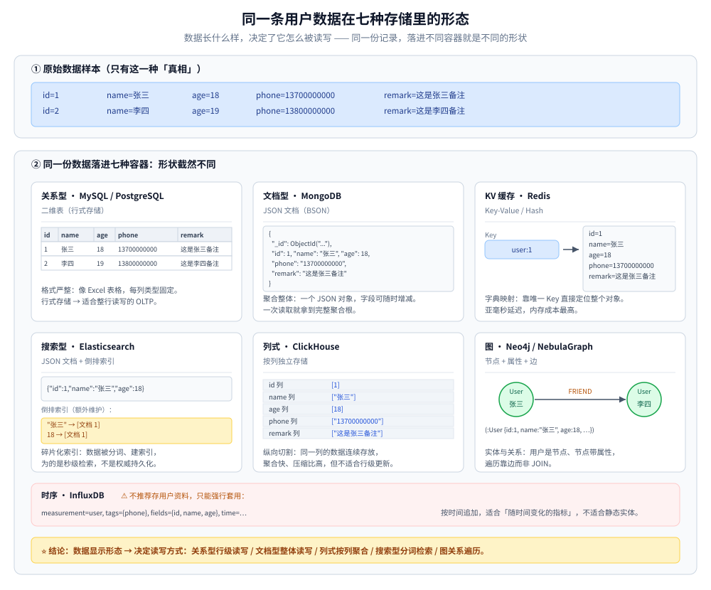
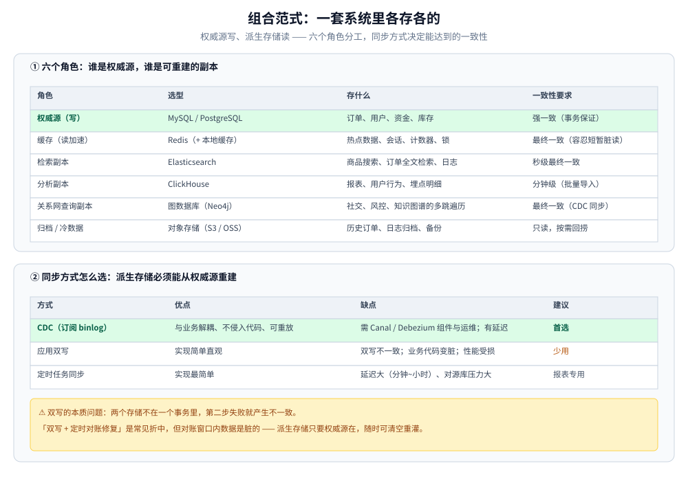
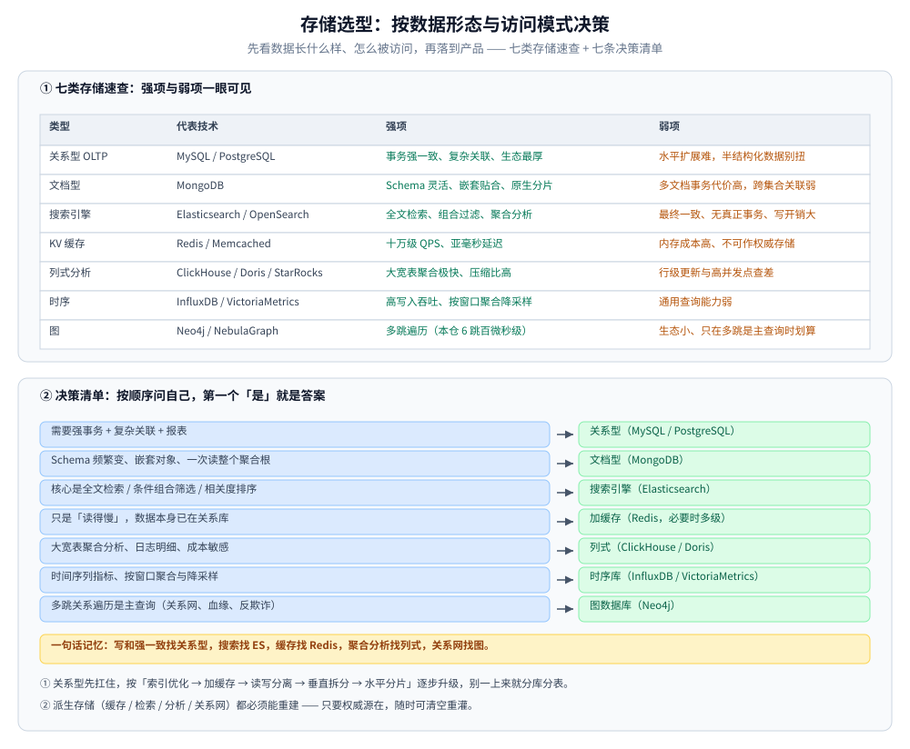

# 数据存储技术选型

> 按「数据形态 + 访问模式」给存储分类，逐层对比关系型 / 文档 / 搜索 / KV / 列式 / 时序 / 图七类存储（技术 × 优缺点 × 适用场景），并给出「一套系统里各存各的」的组合范式与决策树。
>
> 内容整理自个人学习笔记。单技术的深入见 [MySQL/](关系型/MySQL/)、[Redis/](NoSQL/Redis/)、[MongoDB/](NoSQL/MongoDB/)、[Elasticsearch/](搜索与分析/Elasticsearch/)、[Neo4j/](图数据库/Neo4j/)。

---

## 一、先按「数据形态 + 访问模式」分类，再看技术

存储选型最容易犯的错是**上来就选产品**（「我们用 MySQL 吧」）。正确的顺序是：先看数据长什么样、怎么被访问，再落到产品。

| 类型 | 代表 | 数据模型 | 强项 | 弱项 |
| --- | --- | --- | --- | --- |
| **关系型 OLTP** | MySQL / PostgreSQL | 表 + 强 Schema | 事务强一致、复杂关联查询、生态与人才最厚 | 水平扩展难（要分库分表）；半结构化数据表达别扭；⭐ **域内四族横评（单机开源 / 云托管 / 分布式 SQL / 分片中间件）见 [关系型选型对比.md](关系型/关系型选型对比.md)** |
| **文档型** | MongoDB | JSON 文档 | Schema 灵活、嵌套结构天然贴合、原生分片 | 多文档事务代价高；跨集合关联能力弱；⭐ **KV / 文档 / 宽列三族横评见 [NoSQL选型对比.md](NoSQL/NoSQL选型对比.md)** |
| **搜索引擎** | Elasticsearch / OpenSearch | 倒排索引 + 文档 | 全文检索、任意条件组合过滤、聚合分析 | **最终一致、无真正事务**；写入与存储开销大；⭐ **检索与分析两条线横评见 [搜索与分析选型对比.md](搜索与分析/搜索与分析选型对比.md)** |
| **KV 缓存** | Redis / Memcached | key → value | 十万级 QPS、亚毫秒延迟 | 内存成本高；持久化不可作为权威存储；不适合大 value；⭐ **与文档 / 宽列两族的对照见 [NoSQL选型对比.md](NoSQL/NoSQL选型对比.md)** |
| **列式分析** | ClickHouse / Doris / StarRocks | 列存 + 向量化 | 大宽表聚合极快、压缩比高、单位成本低 | 不适合行级更新与高并发点查；⭐ **分析族四路横评见 [搜索与分析选型对比.md](搜索与分析/搜索与分析选型对比.md)** |
| **时序** | InfluxDB / VictoriaMetrics / GreptimeDB | 时间序列 | 高写入吞吐、按时间窗口聚合与降采样 | 通用查询能力弱；⭐ **跨产品选型与五族对照见 [时序数据库选型对比.md](时序数据库/时序数据库选型对比.md)**（含各组件深度篇的索引） |
| **图** | Neo4j / NebulaGraph | 点 + 边（原生图存储 / 构建在 KV 之上两种实现） | 多跳关系查询（社交、风控关系网、知识图谱）；本仓实测 6 跳遍历仍稳定在**百微秒级**，对照 MySQL 递归 CTE 已到 16.9 ms | 生态小、运维与人才稀缺；⚠️ 只在**多跳是主查询**时才划算（本仓 1~3 跳并不比关系型快，见第八节）；⭐ **四族存储实现横评见 [图数据库选型对比.md](图数据库/图数据库选型对比.md)** |

⭐ 一句话记忆：**写和强一致找关系型，搜索找 ES，缓存找 Redis，聚合分析找列式，关系网找图。**

---

## 二、直观对比：同一条用户数据在不同存储里的样子

上面的分类是抽象的，换一个视角就非常直观：**同一份数据，落进不同存储，形状截然不同**。看两条用户记录在这七种存储里的长相，就能明白为什么选型的第一步是看数据形态。

数据样本：

```text
id=1, name="张三", age=18, phone="13700000000", remark="这是张三备注"
id=2, name="李四", age=19, phone="13800000000", remark="这是李四备注"
```

| 存储类型 | 代表产品 | 数据存储形态示例 | 一句话直观理解 |
| --- | --- | --- | --- |
| **关系型** | MySQL | 二维表，一行一条记录：<br>`1 \| 张三 \| 18 \| 13700000000 \| 这是张三备注` | 格式严整，像 Excel 表格；行式存储，适合整行读写的 OLTP |
| **文档型** | MongoDB | 一个 JSON 对象：<br>`{"_id": ObjectId("..."), "id": 1, "name": "张三", "age": 18, ...}` | 聚合整体，一次读取就拿到完整聚合根，字段可随时增减 |
| **KV 缓存** | Redis | `user:1` → `{id=1, name=张三, age=18, phone=13700000000, remark=这是张三备注}` | 字典映射，靠唯一 Key 直接定位整个对象；亚毫秒延迟，内存成本最高 |
| **搜索型** | Elasticsearch | 文档 `{"id":1,"name":"张三","age":18}`<br>+ 额外维护的倒排索引：`"张三" → [文档 1]`、`18 → [文档 1]` | 碎片化索引，数据被分词、建索引，为的是秒级检索，不是权威持久化 |
| **列式** | ClickHouse | 按列切片：<br>`id 列 [1, 2]` / `name 列 ["张三", "李四"]` / `age 列 [18, 19]` | 纵向切割，同一列连续存放，聚合快、压缩比高，但不适合行级更新 |
| **图** | Neo4j | 节点 + 属性 + 边：<br>`(:User {id:1, name:"张三", age:18}) -[:FRIEND]-> (:User {id:2, name:"李四"})` | 实体与关系，用户是节点、节点带属性，遍历靠边而非 JOIN |
| **时序** | InfluxDB | `measurement=user, tags={phone}, fields={id, name, age}, time=…` | ⚠️ 只能强行套用：按时间追加，适合「随时间变化的指标」，不适合静态实体 |



⭐ **结论**：**数据长什么样，决定了它怎么被读写**。关系型适合「行级读写」，文档型适合「整体读写」，列式适合「按列聚合」，搜索型适合「分词检索」，图数据库适合「关系遍历」。选型的第一步，永远先看数据的形态。

---

## 三、MySQL 与 PostgreSQL 怎么选？

同属关系型，选错不致命但会别扭很久。

| 维度 | **MySQL** | **PostgreSQL** |
| --- | --- | --- |
| 生态与人才 | ⭐ 最广，DBA 好招，云厂商托管最成熟 | 略少但增长快，云托管同样齐全 |
| 复制与高可用 | 主从 / 组复制（MGR）/ 半同步 | 流复制（物理）+ **逻辑复制**（可按表订阅，更灵活） |
| 默认隔离级别 | **RR**（InnoDB，靠间隙锁防幻读） | **RC**，但实现了**真正的快照隔离**，SSI 可防写偏斜 |
| 数据类型 | 够用（JSON 支持有限） | ⭐ 更丰富：`JSONB`（可索引）、数组、范围、`PostGIS`、自定义类型 |
| 复杂查询与分析 | 相对弱（历史上子查询优化有包袱） | ⭐ 强：窗口函数、CTE、并行查询、物化视图 |
| 水平扩展生态 | ⭐ 分库分表方案成熟（ShardingSphere / Vitess / 中间件） | 单机能力更强，扩展生态略弱 |
| 适用场景 | 互联网业务主力库、团队已有 MySQL 经验 | 复杂查询与报表、GIS 地理数据、需要半结构化字段、要求更严格的一致性语义 |

⭐ **结论**：互联网业务默认 MySQL；需要**复杂分析查询 / 地理数据 / 灵活数据类型 / 更严谨的隔离语义**时选 PostgreSQL。⚠️ 两者**都别指望单机扛到千万级 QPS**，扩展路径不同（MySQL 靠分片生态，PG 靠单机垂直 + 分区 + 只读副本）。

---

## 四、MySQL 与 MongoDB 怎么选？

核心差异是 **「Schema 该在哪儿约束**」和 **「读写模式是关联还是聚合」**。

| 维度 | **MySQL** | **MongoDB** |
| --- | --- | --- |
| 数据模型 | 规范化、多表关联 | 文档内嵌，一次读取拿到完整对象 |
| Schema | 强约束（DDL 先行） | 灵活（应用层校验），字段可随时增删 |
| 事务 | ⭐ 成熟的跨表事务 | 支持多文档事务，但**代价高、有性能损耗**，应尽量用单文档原子性 |
| 关联查询 | ⭐ `JOIN` 成熟 | `$lookup` 能力弱、性能差，**应通过建模避免** |
| 水平扩展 | 需分库分表中间件 | ⭐ 原生分片（Sharded Cluster） |
| 适合的形态 | 关系复杂、强一致、报表统计 | **聚合根式**数据（订单及其明细、商品及其 SKU）、日志与埋点、内容管理 |

⚠️ **别把 MongoDB 当「不用设计 Schema 的 MySQL」**：内嵌文档膨胀（数组无界增长，单文档 16MB 上限、嵌套深度 100层 上限）、缺乏跨文档约束，都是后期难改的账。完整的建模规则与 ESR 索引原则见 [README.md](NoSQL/MongoDB/README.md) 的「与 MySQL 怎么选」与 [数据建模.md](NoSQL/MongoDB/数据建模.md)。

---

## 五、Elasticsearch 什么时候该用、什么时候不该用？

ES 是**最常被误用**的存储：它是检索副本，不是权威数据源。

| 该用 | 不该用 |
| --- | --- |
| 全文检索（分词、相关度排序、高亮） | ❌ 当**唯一数据源**——它是近实时（默认 1s 刷新）、无跨文档事务 |
| 任意条件组合过滤（十来个筛选维度自由搭配） | ❌ 频繁更新的数据（每次更新 = 删 + 重建文档，触发段合并） |
| 聚合分析（多维度统计、下钻） | ❌ 需要强事务的场景（资金、库存扣减） |
| 日志检索与关联 | ❌ 主键点查（用 MySQL 或 Redis 更快更便宜） |

⭐ **正确姿势**：**MySQL 是权威源，ES 是检索副本**，用 CDC（Canal / Debezium 订阅 binlog）或双写同步；对一致性的预期要放到「秒级最终一致」。原理与字段类型代价见 [索引原理.md](搜索与分析/Elasticsearch/索引原理.md)，DSL 与工程用法见 [搜索流程与DSL.md](搜索与分析/Elasticsearch/搜索流程与DSL.md)。

---

## 六、缓存层怎么选？

### 6.1 Redis 与 Memcached

| 维度 | **Redis** | **Memcached** |
| --- | --- | --- |
| 数据结构 | ⭐ 字符串 / 哈希 / 列表 / 集合 / 有序集合 / 位图 / HyperLogLog / Stream | 只有 key-value（value 是字节串） |
| 持久化 | RDB / AOF（可做弱持久化） | ❌ 无 |
| 高可用与集群 | 主从 + Sentinel + Cluster 原生 | 无原生集群（靠客户端分片） |
| 线程模型 | 主线程单线程命令处理（6.0+ 网络 IO 多线程） | **多线程** |
| 适用 | 缓存 + 分布式锁 + 计数器 + 消息（Stream）+ 排行榜，**一个组件多种用途** | 纯缓存、value 较大、要多线程榨 CPU 的场景 |

⭐ 新项目默认 Redis；Memcached 只在「纯大 value 缓存 + 极度在意多核利用率」时才有明显优势。

### 6.2 本地缓存与分布式缓存

| 层级 | 代表 | 优点 | 缺点 |
| --- | --- | --- | --- |
| **本地（进程内）** | Caffeine（Java）、BigCache / freecache（Go） | 纳秒级延迟、**无网络开销**、无需运维 | 多副本**数据可能不一致**；受进程内存限制；更新需逐个实例通知 |
| **分布式** | Redis | 全局一致视图、容量可扩展、支持复杂结构 | 毫秒级网络往返；引入一个新的故障点 |

⭐ **生产常见形态是多级缓存**：本地缓存扛热点（命中率最高的那 1% Key），Redis 作为第二层。⚠️ 多级缓存的三个坑：①**一致性**（本地缓存更新要广播，否则各副本看到不同数据）②**过期时间必须错开**（本地 TTL 短于 Redis，避免同时失效造成缓存雪崩）③**容量与淘汰必须设上限**，否则本地缓存会吃光堆内存。

---

## 七、分析型：ClickHouse 与 Elasticsearch

两者都能做「日志 / 行为分析」，但设计目标完全不同。

| 维度 | **ClickHouse**                                                                            | **Elasticsearch**                                                    |
| --- |-------------------------------------------------------------------------------------------|----------------------------------------------------------------------|
| 存储结构 | 列存 + 向量化执行                                                                                | 倒排索引 + doc values                                                    |
| 写入 | ⭐ 批量写入吞吐极高、压缩比高（常 5~10 倍）                                                                 | 索引构建开销大（分词、建倒排）                                                      |
| 查询 | ⭐ 大宽表聚合、`GROUP BY`、SQL 熟悉                                                                 | ⭐ 全文检索、灵活过滤、聚合                                                       |
| 行级更新 | ❌ 几乎不支持（更新 = 重写整个 part，`ALTER UPDATE` 是异步重操作）                                             | 支持文档更新，代价是段合并                                                        |
| 高基数按 ID 精查 | ⭐ 快（主键索引 + 稀疏索引）                                                                          | 一般                                                                   |
| 成本 | 低（列存 + 高压缩）                                                                               | 高（内存 + 磁盘 + 副本）                                                      |
| 适用 | 日志分析、用户行为分析、BI 报表、Trace 明细存储（搭配 Jaeger，详见 [Jaeger.md](../../06-工程实践/可观测性/Jaeger.md)） | 搜索、日志检索、多条件过滤与聚合，链路数据存储，见 [可观测性选型.md](../../06-工程实践/可观测性/可观测性选型.md) 第六节|

⭐ **决策**：查询以「**聚合 SQL + 大宽表**」为主 → ClickHouse；以「**全文检索 + 任意条件过滤**」为主 → ES。两者经常**并存**（ES 做检索入口，CH 做分析明细），而不是二选一。

---

## 八、多跳关系查询：图数据库与关系型怎么选？

图库唯一不可替代的维度是**多跳关系遍历**。判据不是「有没有多跳查询」，而是「**多跳是不是主查询**」—— 本仓实测给出了这条线的量级。

| 维度 | **关系型（MySQL 递归 CTE）** | **图数据库（Neo4j）** |
| --- | --- | --- |
| 数据模型 | 表 + JOIN，遍历 = 不断连表 | 点 + 边，**原生图存储**（记录号 + 定长指针） |
| 1~3 跳 | 亚毫秒（本仓 0.07 ~ 0.35 ms） | 亚毫秒（本仓 221 ~ 265 µs）—— **两者差不多** |
| 6 跳 | **16.9 ms**（跳数一大就塌方） | **约 230 µs**（每跳仍 O(1)） |
| 是否随跳数变差 | ⭐ 是（JOIN 次数随跳数增长） | 否（**无索引邻接**，每跳只看邻接链） |
| 强事务 / 报表 / 生态 | ⭐ 最强 | 弱（社区版无集群、无在线备份） |
| 适合 | 关系只是「属性」，主查询是点查 / 聚合 / 报表 | **多跳关系遍历是主查询**（社交、风控、知识图谱） |

⭐ **结论**：**跳数少时两者没差别，跳数一多关系型会塌方** —— 本仓 6 跳，MySQL 已是 5 跳的 4 倍（4.37 ms → 16.9 ms），而 Neo4j 六跳仍稳定在 230 µs 上下。由此三条判据：

- **关系不是主查询 → 别上图库**：点查、CRUD、报表，关系型走索引就够（图库在这几件事上并不更快）；
- **多跳是主查询 → 值得评估图库**：尤其当现有方案要靠递归 CTE / 多轮 JOIN 才能表达（三度人脉、资金链路、攻击路径）；
- ⚠️ **图算法不是免费的**：本仓 `nodeSimilarity` 在 10 万点上跑不完，必须限候选（见 [GDS图算法实战.md](图数据库/Neo4j/GDS图算法实战.md)）。

⚠️ **两条容易忽略的账**：①**运维成本**（组件 + 关系型→图库的同步管道 + 图建模与 Cypher 的人才）；②**社区版边界**（无集群 / 无在线备份，要 HA 就得企业版 / Aura）。完整对比、决策顺序与「30 分钟可行性判定」见 [选型与落地案例.md](图数据库/Neo4j/选型与落地案例.md)；「为什么遍历快」见 [架构与存储引擎.md](图数据库/Neo4j/架构与存储引擎.md)。

---

## 九、组合范式：一套系统里各存各的

真实系统很少只用一种存储。典型分工：

| 角色 | 选型 | 存什么 | 一致性要求 |
| --- | --- | --- | --- |
| **权威源（写）** | MySQL / PostgreSQL | 订单、用户、资金、库存 | 强一致（事务保证） |
| **缓存（读加速）** | Redis（+ 本地缓存） | 热点数据、会话、计数器、锁 | 最终一致（可容忍短暂脏读） |
| **检索副本** | Elasticsearch | 商品搜索、订单全文检索、日志 | 秒级最终一致 |
| **分析副本** | ClickHouse | 报表、用户行为、埋点明细 | 分钟级最终一致（批量导入） |
| **关系网查询副本** | 图数据库（Neo4j） | 社交关注、风控关系、知识图谱的**多跳遍历** | 最终一致（CDC 从权威源同步，见第八节） |
| **归档 / 冷数据** | 对象存储（S3 / OSS） | 历史订单、日志归档、备份 | 只读，按需回捞 |

### 9.1 同步方式怎么选

| 方式 | 优点 | 缺点 | 建议 |
| --- | --- | --- | --- |
| **CDC（订阅 binlog）** | 与业务解耦、不侵入代码、可重放 | 需要 Canal / Debezium 组件与运维；有延迟 | ⭐ **首选**，尤其是 ES / CH / 图库这类派生存储 |
| **应用双写** | 实现简单直观 | ⚠️ 双写不一致（第二步失败怎么办）；业务代码变脏；性能受两次写影响 | 只在强一致要求高、且能接受性能损耗时用 |
| **定时任务全量/增量同步** | 最简单 | 延迟大（分钟~小时级）、对源库压力大 | 只用于报表等容忍高延迟的场景 |

⚠️ **双写的本质问题**：两个存储不在一个事务里，第二步失败就产生不一致。要么用本地消息表 / 事务消息兜底，要么改用 CDC。**「双写 + 定时对账修复」是常见折中，但要明确对账窗口内数据是脏的。**

---



## 十、选型决策清单

按顺序问自己，第一个「是」就是答案：

| 你的需求 | 选它 |
| --- | --- |
| 需要强事务 + 复杂关联 + 报表 | **关系型**（MySQL / PostgreSQL） |
| Schema 频繁变、数据是嵌套对象、一次读整个聚合根 | **文档型**（MongoDB） |
| 核心是全文检索 / 任意条件组合筛选 / 相关度排序 | **搜索引擎**（Elasticsearch） |
| 只是「读得慢」，数据本身已在关系库 | **加缓存**（Redis，必要时多级） |
| 大宽表聚合分析、日志明细、成本敏感 | **列式**（ClickHouse / Doris） |
| 时间序列指标、按窗口聚合与降采样 | **时序库**（InfluxDB / VictoriaMetrics） |
| **多跳关系查询是主查询**（关系网、血缘、推荐、反欺诈） | **图数据库**（Neo4j）—— 判据见第八节 |

⭐ 两条通用经验：

1. **关系型先扛住，出问题按「索引优化 → 加缓存 → 读写分离 → 垂直拆分 → 水平分片」逐步升级**，别一上来就分库分表。分片方案的落地见 [分表与路由.md](关系型/MySQL/分表与路由.md)。
2. **派生存储（缓存 / 检索 / 分析 / 关系网）都必须能重建**——只要权威源在，派生数据随时可清空重灌。做不到这一点的架构，就是埋了雷。

---



## 十一、延伸追问

- **为什么不能把 Elasticsearch 当唯一数据源？** → ①近实时不保证立即可见（默认 1s 刷新）②无跨文档事务 ③主分片未分配时数据可能短暂不可用 ④它设计的重点是检索而非持久化保证。正确姿势是「权威源 + 检索副本」。
- **什么时候该分库分表？** → 先穷尽前面的手段：慢查询优化 → 索引与 SQL 重写 → 加缓存 → 读写分离 → 垂直拆分（按业务切库）→ 最后才是水平分片。⚠️ 分片会永久损失跨片事务与跨片 JOIN，且路由、扩容、全局 ID 都会变复杂。
- **MySQL 与 PostgreSQL 在事务上有什么差别？** → MySQL InnoDB 默认 **RR**，靠**间隙锁**防幻读（也因此更容易死锁）；PG 默认 **RC**，但实现了真正的快照隔离，可选 **SSI（可串行化快照隔离）** 在检测到写偏斜时主动中止事务。
- **缓存与数据库的一致性怎么保证？** → 标准做法是 **Cache Aside**：读时未命中回填，写时**先更新库再删除缓存**（不是更新缓存）；配合**延迟双删**或**订阅 binlog 异步失效**；对强一致要求高的读走库不走缓存。
- **为什么不干脆全用 MongoDB？** → 事务与跨文档关联弱、缺乏数据库层约束、报表统计能力弱；且「灵活 Schema」在长期演进中往往变成「无 Schema 约束的技术债」。
- **ClickHouse 为什么不支持高频行级更新？** → 列存按 part 组织，更新要重写整个 part（`ALTER TABLE ... UPDATE` 是异步 mutation），设计目标是**批量写入 + 聚合查询**，不是 OLTP 更新。
- **多级缓存怎么保证副本间一致？** → 本地缓存很难做强一致，工程做法：①本地 TTL 设得很短（秒级）②变更时通过 MQ / Redis 发布订阅**广播失效**③关键数据只读缓存、不读本地缓存。
- **冷热数据分离怎么做？** → 按时间或状态打标：热数据留主库 + 缓存；温数据留主库归档表 / 分区表；冷数据落对象存储（Parquet 等列式格式，配合 ClickHouse / Hive 查询）；由定时任务按策略迁移，业务侧通过统一查询层屏蔽差异。
- **图数据库什么时候值得引入？** → 唯一判据是「**多跳关系查询是不是主查询**」（三度人脉、资金链路、攻击路径）。本仓实测：**1~3 跳图库并不比 MySQL 递归 CTE 快**，6 跳才拉开量级（Neo4j 约 230 µs vs MySQL 16.9 ms）。⚠️ 关系只是「属性」时别上图库 —— 点查与报表关系型更强，引入图库只增组件与运维成本（见第八节与 [选型与落地案例.md](图数据库/Neo4j/选型与落地案例.md)）。

---

## 关联

- ⭐ **各域自己的跨产品中立选型篇**（本篇给七类存储的分类与结论级对照，族内多产品怎么比交给它们）：[关系型选型对比.md](关系型/关系型选型对比.md)（单机开源 / 云原生托管 / 分布式 SQL / 分片中间件四族）、[NoSQL选型对比.md](NoSQL/NoSQL选型对比.md)（KV / 文档 / 宽列三族，含本篇没有独立位置的宽列族）、[搜索与分析选型对比.md](搜索与分析/搜索与分析选型对比.md)（检索族与分析族各四路 + 日志三种存储哲学）、[时序数据库选型对比.md](时序数据库/时序数据库选型对比.md)（指标专精 / 通用时序 / 设备模型 / 一库多信号 / 通用列存自建五族）、[图数据库选型对比.md](图数据库/图数据库选型对比.md)（按存储实现分的四族与三条替代路线）
- [索引设计与EXPLAIN.md](关系型/MySQL/索引设计与EXPLAIN.md) — 关系型的根基：B+Tree、选择性、三星索引与 EXPLAIN 读法
- [分表与路由.md](关系型/MySQL/分表与路由.md) — 关系型扩展手段：路由规则、全局 ID、跨片查询
- [复制与高可用.md](关系型/MySQL/复制与高可用.md) — 主从复制机制、拓扑与故障切换
- [README.md](NoSQL/MongoDB/README.md) — MongoDB 目录导读：文档型建模规则、ESR 索引原则、分片与事务边界
- [README.md](搜索与分析/Elasticsearch/README.md) — ES 的定位与选型、版本坐标、8 篇的阅读顺序
- [写入流程.md](搜索与分析/Elasticsearch/写入流程.md) — 段生命周期与「写后读不到」
- [集群与运维.md](搜索与分析/Elasticsearch/集群与运维.md) — 分片规划、恢复与 ILM
- [索引原理.md](搜索与分析/Elasticsearch/索引原理.md) — 倒排索引的构成与索引体积的加性实测
- [缓存选型与容量.md](缓存/缓存选型与容量.md) — 缓存层的容量估算与选型细节
- [README.md](图数据库/Neo4j/README.md) — 图库目录导读：原生图存储、Cypher、索引、事务、集群、GDS、GraphRAG 的版本坐标与阅读顺序
- [选型与落地案例.md](图数据库/Neo4j/选型与落地案例.md) — 四家图库对比、「多跳是不是主查询」的决策顺序与 30 分钟可行性判定
- [架构与存储引擎.md](图数据库/Neo4j/架构与存储引擎.md) — 无索引邻接：为什么图库每跳 O(1)，以及由此决定的单机规模上限
- [中间件选型.md](../中间件/中间件选型.md) — 同属选型篇：注册中心 / 协调底座 / 网关 / MQ / 定时任务
- [可观测性选型.md](../../06-工程实践/可观测性/可观测性选型.md) — 可观测性侧的存储选型（ES / BanyanDB / ClickHouse 各适合承载什么）
- [README.md](时序数据库/VictoriaMetrics/README.md) — VictoriaMetrics 目录导读：单机 / 集群边界、mergeset 与倒排索引、与 Prometheus 生态的关系与迁移路径
- [README.md](时序数据库/GreptimeDB/README.md) — GreptimeDB 目录导读：Mito 引擎与三级剪枝、SQL + PromQL 双查询、一库承载 Metrics / Logs / Traces
> 反向引用（本篇被下列文档引到）：[LSM树.md](../../02-计算机基础/数据结构/树/LSM树.md)、[空间索引与R树.md](../../02-计算机基础/数据结构/树/空间索引与R树.md)、[可查询加密.md](NoSQL/MongoDB/可查询加密.md)、[应用与场景.md](NoSQL/MongoDB/应用与场景.md)、[数据建模.md](NoSQL/MongoDB/数据建模.md)、[聚合管道.md](NoSQL/MongoDB/聚合管道.md)、[多核利用与部署方案.md](NoSQL/Redis/多核利用与部署方案.md)、[数据类型.md](NoSQL/Redis/数据类型.md)、[参数调优.md](关系型/MySQL/参数调优.md)、[数据建模.md](关系型/MySQL/数据建模.md)、[数据建模与导入.md](图数据库/Neo4j/数据建模与导入.md)、[向量与AI搜索.md](搜索与分析/Elasticsearch/向量与AI搜索.md)、[Flow流计算引擎.md](时序数据库/GreptimeDB/Flow流计算引擎.md)、[SQL查询与跨信号关联.md](时序数据库/GreptimeDB/SQL查询与跨信号关联.md)、[写入协议与数据接入.md](时序数据库/GreptimeDB/写入协议与数据接入.md)、[可观测性集成方案.md](时序数据库/GreptimeDB/可观测性集成方案.md)、[定位与适用场景.md](时序数据库/GreptimeDB/定位与适用场景.md)、[性能调优与基准测试.md](时序数据库/GreptimeDB/性能调优与基准测试.md)、[架构与存储引擎.md](时序数据库/GreptimeDB/架构与存储引擎.md)、[索引设计与查询优化.md](时序数据库/GreptimeDB/索引设计与查询优化.md)、[选型对比与落地案例.md](时序数据库/GreptimeDB/选型对比与落地案例.md)、[部署与集群运维.md](时序数据库/GreptimeDB/部署与集群运维.md)、[与Prometheus生态的关系.md](时序数据库/VictoriaMetrics/与Prometheus生态的关系.md)、[定位与适用场景.md](时序数据库/VictoriaMetrics/定位与适用场景.md)、[性能调优与基准测试.md](时序数据库/VictoriaMetrics/性能调优与基准测试.md)、[数据模型与写入路径.md](时序数据库/VictoriaMetrics/数据模型与写入路径.md)、[架构与存储引擎.md](时序数据库/VictoriaMetrics/架构与存储引擎.md)、[索引设计与查询优化.md](时序数据库/VictoriaMetrics/索引设计与查询优化.md)、[运维与监控.md](时序数据库/VictoriaMetrics/运维与监控.md)、[选型与落地案例.md](时序数据库/VictoriaMetrics/选型与落地案例.md)、[高可用与集群部署.md](时序数据库/VictoriaMetrics/高可用与集群部署.md)、[时序数据库选型对比.md](时序数据库/时序数据库选型对比.md)、[缓存一致性.md](缓存/缓存一致性.md)、[缓存应用场景.md](缓存/缓存应用场景.md)、[缓存架构与模式.md](缓存/缓存架构与模式.md)、[缓存运维与排查.md](缓存/缓存运维与排查.md)
