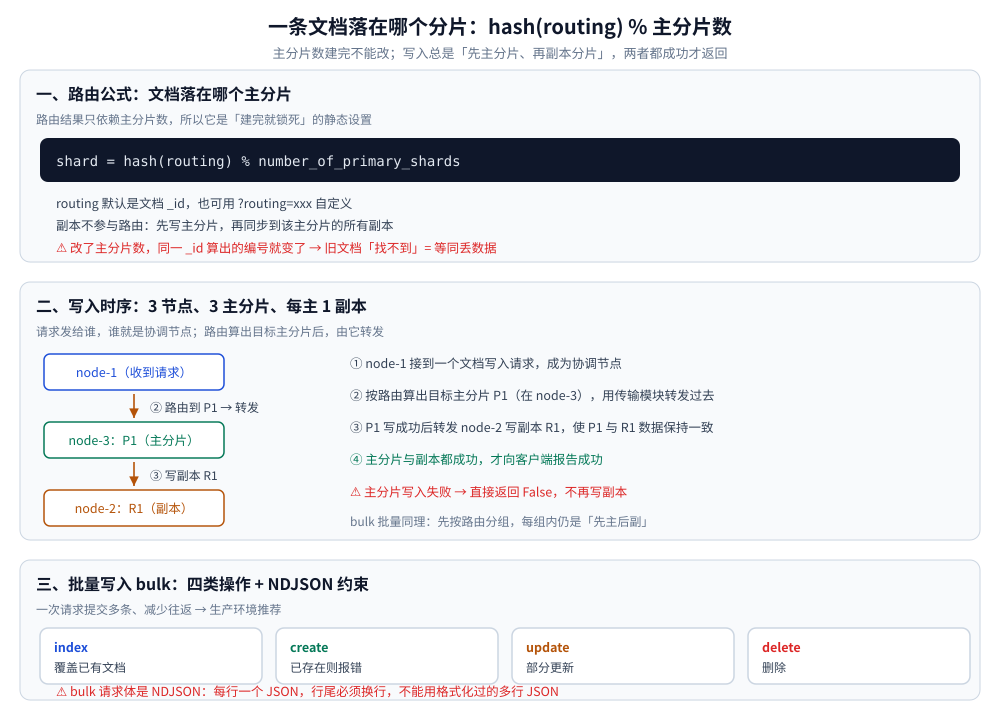
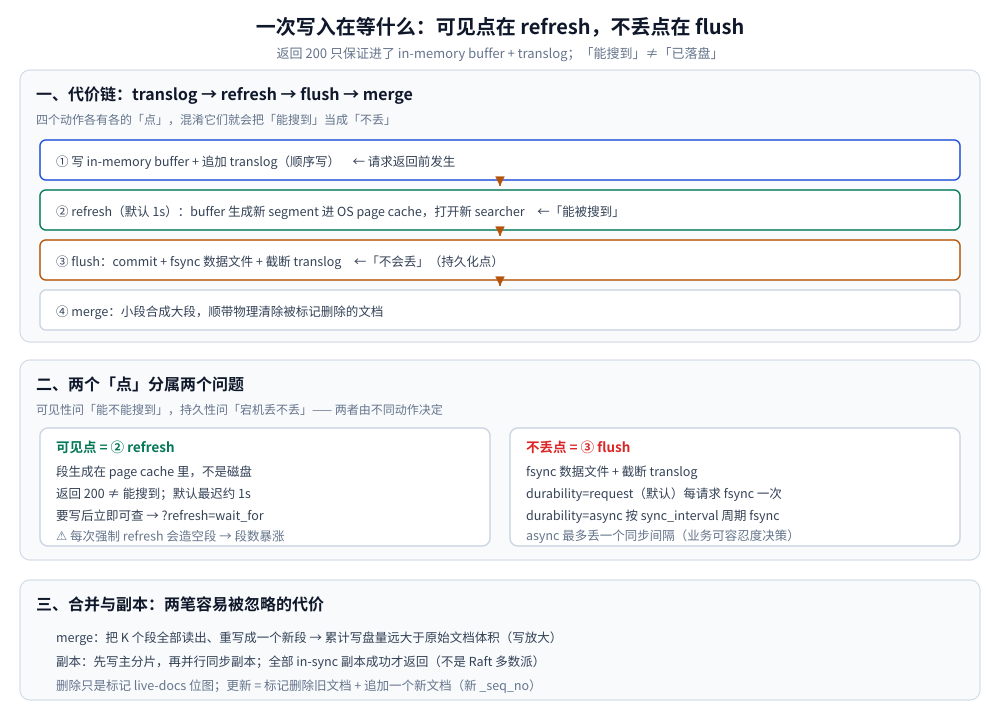

# Elasticsearch 写入流程

> 一条文档从请求到「能被搜到、且不丢」要走哪些步：路由与主副本、translog / refresh / flush / merge 的代价链，
> 以及删除、更新与并发写在这套结构上的真实成本。
>
> 内容整理自个人学习笔记；写入与段生命周期的补充参考《Elasticsearch 数据搜索与分析实战》（王深湛）。
> 索引结构本身见 [索引原理.md](索引原理.md)；搜索侧见 [搜索流程与DSL.md](搜索流程与DSL.md)。

---

## 一、一条文档落在哪个分片

### 1.1 路由公式：为什么主分片数建完就不能改

写入一条文档时，Elasticsearch 需要决定它落到哪个主分片上，公式是：

```text
shard = hash(routing) % number_of_primary_shards
```
+ `routing` 默认就是文档的 `_id`（也可以通过 `?routing=xxx` 自定义）；
+ `hash` 对 routing 取哈希后，再对主分片数取模，结果即目标主分片编号（0 ~ number_of_primary_shards-1）；
+ 副本分片不参与路由：文档先写入主分片，再同步到该主分片对应的所有副本分片。

⚠️ **为什么主分片数建索引后不能改**：路由结果依赖 `number_of_primary_shards`。一旦这个数被改动，同一个 `_id` 计算出的分片编号就会变化，原先写入的文档将再也「找不到」，等同于数据丢失。因此 Elasticsearch 把主分片数定义为**静态设置**，只能在建索引时指定。需要「改主分片数」的正确做法是**索引重建(reindex)**：按新主分片数新建目标索引，用 `_reindex` 搬迁数据，最后用别名(alias)切换读写入口。

⭐ 路由规则同样用于搜索：带 routing 的搜索能直接算出分片、跳过无关分片，明显提升性能。

### 1.2 批量写入：bulk 的四种类型与 NDJSON 约束

如果你在建索引的时候把数据一条一条地发给 Elasticsearch，这会导致发送太多的请求，使得建索引的速度变得很慢。在实际项目中经常需要使用可实现批量写入的 API 来把数据一组一组地提交给 Elasticsearch，这样做能大大加快索引的构建速度。

**批量提交（bulk）**

批量提交的操作一共有 4 种类型：index、create、update、delete。index 操作和 create 操作都能往索引中添加数据，区别是使用 create 操作时，文档主键如果在索引中已存在则会报错，使用 index 操作则会直接覆盖原有的文档。

```json
POST _bulk
{"index":{"_index":"my_index","_id":"1"}}
{"title":"文档一","userid":"u001"}
{"index":{"_index":"my_index","_id":"2"}}
{"title":"文档二","userid":"u002"}
```
⚠️ bulk 请求体是 NDJSON（每行一个 JSON），**行尾必须换行**，且不能用格式化过的多行 JSON。

### 1.3 写入流程：先写主分片，再写副本分片

假如包含 3 个节点的集群中有一个索引，拥有 3 个主分片，每个主分片有 1 个副本分片，当一个文档写入请求到来时，Elasticsearch 的处理过程如图 2.12 所示。

图 2.12 索引一条数据的流程

这个过程的实现分为 4 个步骤。

(1) node-1 接到一个文档写入的请求。

(2) 根据索引数据的路由规则计算当前文档应当被写入哪一主分片，假如此时决定路由到 P1，则使用传输模块把当前的写入请求转发到 node-3 上进行写入。如果是 P0 或者 P2 则直接写入 node-1 的本地分片即可。

(3) 主分片 P1 写入完成后，把请求转发到 node-2 上，将数据写入副本分片 R1，使得 P1 和它的副本分片数据保持一致；如果主分片写入失败，直接返回 False。

(4) 向客户端报告写入的结果。

Elasticsearch 还支持在一个请求中批量写入多个文档，过程如图 2.13 所示。

图 2.13 索引文档的批量写入过程

这个过程的实现也可以分为 4 个步骤。

(1) node-2 接到一个批量写入文档的请求。

(2) 对写入的文档按照路由规则进行分组，在这个例子中有 3 个主分片会因此分为 3 组，每组包含对应的主分片上需要写入的文档列表，并要把请求转发到每个主分片所在的节点上。

(3) 在每个主分片上写入对应的文档，每个文档写入时，先写入主分片再写入副本分片，直到 3 个组的文档全部写入完毕。

(4) 汇总每个节点上各个文档写入的结果并进行返回。

从这个过程可以看出，向索引写入数据时，总是先写入主分片再写入副本分片。只有主分片和副本分片都写入成功，整个请求才会成功。**由于批量写入文档相比单独写入文档减少了请求次数，所以批量写入能够大幅提高文档写入的效率，推荐在生产环境中使用批量写入。**



## 二、一次写入到底在等什么

### 2.1 代价链：translog → refresh → flush → merge

⭐ 这一节讲的是**代价链**：一次写请求到底在等什么、宕机到底会丢什么。刷新 / 冲洗 / 强制合并这些**能手动调的 API 动作**见 2.2。

```text
① 写 in-memory buffer + 追加 translog（顺序写）      ← 请求返回前发生
② refresh（默认 1s）：buffer 生成新 segment 进入 OS page cache，打开新 searcher
   → "能被搜到"的可见点在 ②，不在磁盘
③ flush：Lucene commit + fsync 数据文件 + 截断 translog
   → "不会丢"的持久化点在 ③
④ merge：小段合成大段，顺带物理清除被标记删除的文档
```

+ **translog 就是那个丢失窗口**。`index.translog.durability` 默认 `request`：每个写请求 fsync 一次 translog，节点掉电不丢已确认数据，代价是 fsync 次数 ∝ 写 QPS（顺序写也很吃磁盘能力）。高吞吐日志场景改成 `async`，按 `index.translog.sync_interval` 周期 fsync，用"最多丢一个同步间隔"换吞吐——这是**业务可容忍度决策**，必须写进设计文档，不能当成"嫌慢就改"的调优旋钮。（page cache / fsync 的底层代价见 [Linux 文件系统与 I/O](../../../../02-计算机基础/linux/文件系统与IO.md)。）
+ **"近实时(NRT)"的真实含义**：refresh 只是让新数据组成一个**段**并被新的 searcher 打开，段还在 page cache、translog 也没截断。所以「能搜到」≠「已落盘」，「返回 200」≠「能搜到」。需要写后立即可查用 `?refresh=wait_for`（等下一个刷新点，比 `true` 温和）；⚠️ 每次强制 refresh 都会造一个几乎空的段 → 段数暴涨 → merge 压力 → 搜索变慢。批量导数时把 `index.refresh_interval` 设 `-1`、副本设 0，写完再恢复。
+ **flush 不该手动频繁做**：flush = commit + 轮转 translog，频繁 flush 制造大量小段，只是把成本推给 merge。ES 按 translog 体积/时间自动触发，一般不需要人为干预。
+ **merge 的写放大**：合并 K 个段要把这 K 段的倒排与列式数据全部读出、重写成一个新段，累计写盘量远大于原始文档体积；这就是"批量导入 + 事后 force merge"比"边写边查"省资源的原因。merge 也解释了为什么删除/更新多之后搜索变慢（见下一小节）。
+ 副本一致性：文档先写主分片再并行同步副本，两者都成功才返回——这套"确认语义 + 主分片任期"和 Raft 的多数派确认不是同一套东西（对比见 [一致性与 Raft](../../../../04-架构与系统/分布式/理论/Raft协议.md)），ES 默认是"全部 in-sync 副本"而不是多数派。

### 2.2 刷新、冲洗、强制合并：API 与边界

当外部数据写入索引时，数据并不会直接提交到磁盘上，因为提交数据的过程成本高昂，会按照一定的流程将数据周期性地提交到磁盘上进行持久化，如图 3.1 所示。

图 3.1 索引数据写入磁盘的过程

整个过程的实现可以分为 3 个步骤。

(1) 将索引请求的文档数据写入内存中的缓冲区和事务日志，此时这些数据还不能被搜索到。

(2) 刷新索引数据，把缓冲区的数据写入文件系统缓存，此时数据已能够被搜索到。

(3) 冲洗索引数据，把文件系统缓存中的数据写入磁盘并清空事务日志，完成数据提交。

默认情况下，Elasticsearch 会对过去 30s 内被搜索的索引提供自动化刷新机制，刷新间隔默认是 1s，其可以在 `index.refresh_interval` 的索引配置中进行修改。

如果说刷新索引就是把数据写入内存的话，那么冲洗索引就是把数据存储到外存。

冲洗索引时，Elasticsearch 会一次性把文件系统缓存的数据写入磁盘，然后把事务日志清空，这个过程默认是每隔一段时间自动完成的。如果 Elasticsearch 突然宕机，它会在下次启动时自动将事务日志中的数据恢复到磁盘上，从而最大限度地减少数据丢失。

随着数据的不断写入、修改和删除，分片中的段信息会越来越多，这也是索引需要定期进行段合并的原因。

强制合并索引的段时，会把分片内部很多零碎的小段合并成大段并去除被删除的文档，这样做的好处是每个分片中的段会减少并会腾出被删除文档所占据的外存空间。

```bash
POST /my_index/_forcemerge?max_num_segments=1
```
⚠️ `_forcemerge` 消耗大量 IO 且期间索引不可写，只应在写入停止的历史索引上执行。

⭐ 补充三条边界条件（都是踩过的坑）：

+ **判定标准不是"最近没人查"，而是"这个索引未来还会不会有写/删"**。只要还有写入，force merge 出来的巨大段会立刻被新增小段"污染"，而且删除标记要等下一次 merge 才回收——白做一次大 IO，还得再来一次。所以对象是"已经 rollover 掉、只读"的索引。
+ **`max_num_segments=1` 不是万能最优**：按时间范围过滤（日志最常见的查询形态）时，Lucene 可以靠段内 `@timestamp` 的 min/max 直接跳过整段；合并成 1 段反而失去这个跳过能力。带时间过滤的索引通常合并到"少量段"即可，真正适合压成 1 段的是不再写、且查询不按时间切片的索引（例如配置类/维度类数据）。
+ **force merge 与只读设置配套**：合并前后把索引设为只读（`index.blocks.write`），能避免合并期间新写入引发重复 merge；⚠️ 别在 force merge 期间做 `shrink`/`close` 之类的结构操作。8.x 的 force merge 会被 throttling 限制以保护在线查询，进度用 `_tasks` 看。



## 三、删除与更新为什么贵：标记删除 + 追加

+ 删除只是在该段的 live-docs 位图（`.liv`）上把文档标 0；**更新 = 标记删除旧文档 + 追加一个新文档**（新的 `_seq_no`，通常落进最新的小段）。物理回收只发生在 merge 恰好读入含死文档的段时。
+ 代价分三层：① 写放大（更新一条等于索引两条，倒排、列式全部重建）；② 存储放大（高删除率的索引"数据不多、磁盘很满"）；③ **搜索变慢**——每个段仍然要扫描死文档再用位图过滤，删除比例高时打分/聚合都要多走一跳。
+ 所以：`doc` 级部分更新比"读出来改完整条写回"省一次往返，但**都躲不掉重索引**；高频变化的状态字段（`status`）如果想按状态统计，考虑把状态变更做成追加事件 + 按时间取最新，或者把它单独拆到小索引。
+ ⚠️ `_delete_by_query` / `_update_by_query` 本质是"搜索 + 逐条重写"：只作用于**已 refresh** 的段（刚写入的数据可能不在其中）、默认遇到版本冲突就 `abort`、量大时必须 `wait_for_completion=false` 后台跑并轮询 task。

## 四、并发写：_seq_no 与 _primary_term

分布式下"读-改-写"必然有竞态，ES 给每个文档维护一对版本标识：

| 字段 | 含义 | 什么时候变 |
| --- | --- | --- |
| `_seq_no` | 该文档在主分片上的操作序号（单调递增） | 每次写入/删除该文档 |
| `_primary_term` | 主分片任期号 | 主分片切换（failover / 重新分配）时递增 |

`_primary_term` 用来挡掉"旧主分片残留的写"，`_seq_no` 用来做条件更新，两者一起才构成可靠的 CAS：

```json
POST my_index/_update/1?if_seq_no=42&if_primary_term=1
{ "doc": { "status": "paid" } }
```
不匹配就返回 `409 conflict`。三种典型用法：

+ 业务侧"状态必须是 A 才能改 B"：读时带上版本号、写时用 `if_seq_no`；或把条件写进 painless 脚本（脚本更新在分片内原子，但每个候选文档都要解释执行一次脚本，贵）。
+ 内部重试：`_update` 的 `retry_on_conflict`（默认 0）；⚠️ 别靠调大它掩盖竞态，冲突率本身就是业务并发度的监控指标。
+ 从 MySQL / Kafka 单向同步：`version_type=external` + 业务单调版本（更新时间、binlog 位点），天然丢弃乱序到达的旧数据（链路设计见 [Kafka](../../../中间件/消息队列/Kafka.md)）。注意 external version 只保证"旧的覆盖不了新的"，不给你并发更新的检测能力。

---

## 使用：写一条文档，看它什么时候能被搜到

跑通这三步，就把「建索引 → 写入 → 可见 → 检索」这条最短路径走了一遍；注意 mapping 要显式写死，别指望动态映射。

```bash
# ① 建索引：显式 mapping 把字段类型固化（mapping 的坑见 [索引原理.md](索引原理.md) 8.3：类型猜错只能 reindex）
curl -X PUT "localhost:9200/mysougoulog" -H 'Content-Type: application/json' -d '
{ "settings": { "number_of_shards": "5", "number_of_replicas": "1" },
  "mappings": { "properties": { "userid": { "type": "text" } } } }'
# → {"acknowledged":true,"shards_acknowledged":true,"index":"mysougoulog"}（示意）

# ② 写一条文档：?refresh=wait_for 等一次刷新点，才有「写后立即可查」（见 2.1 的代价链）
curl -X PUT "localhost:9200/mysougoulog/_doc/1?refresh=wait_for" -H 'Content-Type: application/json' -d '
{ "userid": "1001 搜索 入门" }'
# → {"result":"created","_shards":{"successful":2,"failed":0}}（示意：主分片 + 副本分片都写成功才返回）

# ③ 查一次：text 字段必须用 match（它会对查询串分词）
curl -X GET "localhost:9200/mysougoulog/_search" -H 'Content-Type: application/json' -d '
{ "query": { "match": { "userid": "搜索" } } }'
# → hits.total.value: 1（示意）

# ④ 踩坑对照：同一个字段换成 term 拿整串去比词典，必然查不到（见 [搜索流程与DSL.md](搜索流程与DSL.md) 的追问一）
#    term 只适用于 keyword / 数值 / 日期等不分词的字段
```

## 延伸追问

### 1. 写入返回 200 之后多久能搜到？为什么？
默认最迟约 1 秒（`index.refresh_interval`）。因为请求返回只保证数据进了 in-memory buffer 并写了 translog，refresh 才会把 buffer 变成一个可被 searcher 看到的段。⚠️ 关键点：可见性发生在 page cache 里的段，不是磁盘——所以"能搜到"不代表"宕机不丢"，不丢靠 translog。

### 2. 那宕机到底会丢数据吗？
看 translog 的 fsync 策略。默认 `durability: request`，每个请求 fsync 一次 translog，已确认的写不丢；改成 `async` 后最多丢一个 `sync_interval` 内的数据，换来写入吞吐。这是"能接受丢多少"的业务决策，不是性能开关。

### 3. 为什么更新很贵？删除之后空间会立刻释放吗？
删除只在段的 live-docs 位图上标记，更新等于"标记删除旧文档 + 追加新文档"，倒排和列式结构全部重做一遍。空间不会立刻释放，只有 merge 读到含死文档的段时才物理回收；副作用是删除比例高时搜索仍需扫描死文档，表现为"数据变少了查询变慢了"。

### 4. 并发更新同一个文档怎么保证不写花？
`_seq_no` + `_primary_term` 做乐观并发：读时拿版本号，写时用 `if_seq_no`/`if_primary_term` 条件提交，不匹配返回 409。`_primary_term` 的作用是防止旧主分片残留的写在主切换后被错误接受。从 DB 单向同步则用 `version_type=external` + 单调业务版本丢弃乱序旧数据。

### 5. force merge 什么时候能做、什么时候不能做？
只做"未来不再写"的索引（rollover 之后的历史索引），因为它把死文档物理清除、把段数压到很小，代价是大 IO 且期间不可写。⚠️ 还在写的索引做等于白做（新段立刻污染）；按时间范围过滤的日志索引压成 1 段反而失去"按段的 min/max 跳过整段"的能力，通常留若干段更合适。

## 关联

- [索引原理.md](索引原理.md) — 段与倒排 / 正排结构：写进去的东西到底长什么样
- [搜索流程与DSL.md](搜索流程与DSL.md) — 写完之后怎么查、怎么打分
- [集群与运维.md](集群与运维.md) — 分片分配与恢复、健康与 ILM
- [常见事故.md](常见事故.md) — 「写后读不到」等写入侧事故的正确理解
- [Kafka.md](../../../中间件/消息队列/Kafka.md) — 从 binlog / CDC 单向同步到 ES 的链路
- [文件系统与IO.md](../../../../02-计算机基础/linux/文件系统与IO.md) — translog 的 fsync 与 page cache
- [内存管理.md](../../../../02-计算机基础/linux/内存管理.md) — 段落盘与 fsync 的底层机制
- [Raft协议.md](../../../../04-架构与系统/分布式/理论/Raft协议.md) — 副本确认语义与多数派共识的差别
> 反向引用（本篇被下列文档引到）：[存储选型.md](../../存储选型.md)、[分页与聚合.md](分页与聚合.md)、[向量与AI搜索.md](向量与AI搜索.md)、[客户端.md](客户端.md)
