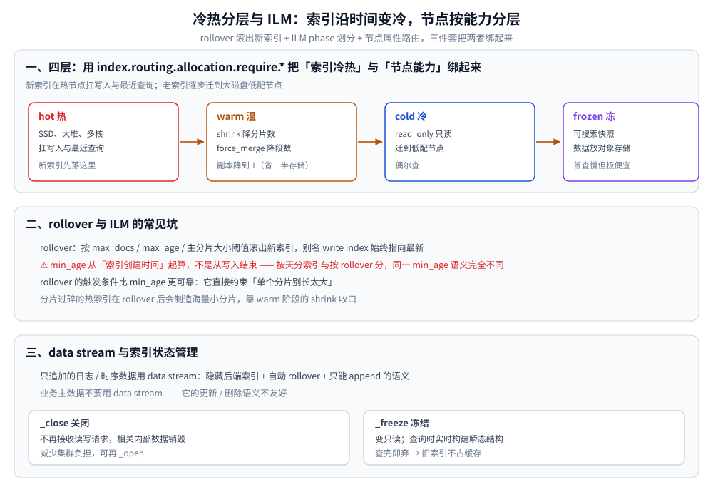

# Elasticsearch 集群与运维

> 分片与副本怎么分配、分片数怎么定与怎么"改"、恢复为什么会拖慢集群、green/yellow/red 与 unassigned 的排查、
> 冷热分层与 ILM，以及缓存 / 关闭 / 冻结三类索引状态管理。
>
> 内容整理自个人学习笔记；集群与 ILM 部分的补充参考《Elasticsearch 数据搜索与分析实战》（王深湛）。
> 写入路径见 [写入流程.md](写入流程.md)；事故排查见 [常见事故.md](常见事故.md)。

---

## 一、分片、副本与分配

### 1.1 分配的基本条件与分配感知

对于一个总分片数为 N 的索引而言，当集群节点的数目达到 N 以后，继续添加新节点无法再提升该索引的读写性能，这一点在实际应用时需要注意。

假如 node-1 和 node-2 是同一个服务器的两个虚拟机，node-3 是另一个服务器的虚拟机。如果某个时刻 node-1 和 node-2 所在的那台物理机宕机或停电，而分片 P0 和它的副本分片 R0 都在这台物理机上，则会直接导致索引丢失分片不能使用。为了解决这一问题，可以使用分片分配的感知，对副本分片分配的位置进行人为干预。分片分配的感知允许把 Elasticsearch 的节点划分为属于不同的区域，当分配一个副本分片时，不允许将它分配到它的主分片所在的区域。这样做的好处是，即使某个区域的节点全部“挂掉”，其他区域依然有相应的副本分片，不影响集群的使用。

分片分配需满足的基本条件：同一分片的主分片和副本分片不能分配到同一节点；同一分片的多个副本分片也不能在同一节点。

### 1.2 分片不是越多越好

⭐ 每个分片都是一个独立的 Lucene 索引，它的固定开销**与数据量无关**：

+ **每分片常驻成本**：词典/FST 与文件句柄、段元数据、keyword 聚合用的 global ordinals、一份 translog 文件，以及至少一个段（哪怕是空索引）。分片数翻倍，这部分开销也翻倍。
+ **搜索侧**：不带 routing 的查询要在**每个分片**上各执行一次，端到端延迟由最慢的分片决定——分片越多，尾部延迟越差；每次执行都要占 search 线程（线程池大小与 CPU 核数挂钩，约为核数的 1.3 倍 + 1，系数以官方文档为准；队列满会抛 `es_rejected_execution_exception` / HTTP 429）。
+ **集群侧**：cluster state 体积随分片数增长，主节点每次发布都要全集群同步（大量分片变更时主节点 CPU/网络被打满是经典事故）；总量还会撞 `cluster.max_shards_per_node`（默认值随版本不同，以官方文档为准）。
+ **恢复侧**：分片越多，节点故障时触发的重新分配与复制动作越多（见第二节）。
+ 经验方向：**按数据量与查询延迟倒推分片数**（先定单分片目标规模，再算需要几个），并且让"分片数 ≈ 可搜索该索引的节点数或其因数"，便于均匀分布。规模量级要靠压测确定，不存在通用的"每分片多少 GB"标准值。


## 二、分片恢复

分片的恢复指的是把一个分片复制一份产生新的分片的过程。通常在分片的分配、索引分片的副本数改变、快照恢复时都会伴随有分片的恢复。

**什么情况会触发恢复**：

+ 分片分配：新节点加入或节点下线，主节点重新分配分片位置；
+ 修改索引的副本数；
+ 从快照(snapshot)恢复索引数据；
+ 节点重启、网络临时断开后重新加入集群，导致分片重新分配。

**为什么要避免启动时大量恢复**：

+ 恢复本质是**跨节点复制大量数据**，会占用网络带宽、磁盘 IO 与 CPU；集群规模大时可能持续数十分钟甚至更久。
+ 恢复期间集群 IO 被抢占，正常查询会出现抖动、超时。
+ 恢复完成前副本分片状态为 `INITIALIZING`，集群健康度显示为 `yellow`，分片的容错能力下降。

常见缓解手段：延长未分配分片的延迟分配时间 `index.unassigned.node_left.delayed_timeout`（默认 1m），让短暂离线的节点有机会回归从而避免重建副本；限制并发恢复数 `cluster.routing.allocation.node_concurrent_recoveries`；必要时通过 `_cluster/settings` 降低恢复吞吐。

## 三、主分片数怎么"改"：reindex / shrink / split

索引在使用一段时间以后，你可能会想修改索引的静态设置(settings)。但是这些设置（例如主分片的数目、分词器等）又无法直接修改，而重新导入一遍数据又太过麻烦，这个时候索引重建就特别有用。

```json
POST _reindex
{ "source": { "index": "old_index" }, "dest": { "index": "new_index" } }
```

| 手段 | 方向 | 硬性条件 | 代价 / 注意 |
| --- | --- | --- | --- |
| `_reindex` | 任意 | 目标索引先建好正确的分片数 + mapping | 全量搬数据，需要追增量与别名切换 |
| `_shrink` | 变少 | 目标主分片数必须能**整除**源主分片数；源索引需 `index.blocks.write` 停写；源分片需集中到同一节点 | 需要双份磁盘；期间不可写；适合历史索引降分片数 |
| `_split` | 变多 | 目标必须是源主分片数的**整数倍**；源索引同样要停写 | 新分片只是从一个旧分片切出来的，**数据倾斜不会因为 split 被修正**（路由仍是按原始分片数算的） |

⚠️ 三者都改不了"已经建好的倒排内容"：分词器、字段类型、`text`/`keyword` 的选择仍然只能 reindex（路由公式见 [写入流程.md](写入流程.md) 1.1）。shrink 的典型正当用途是 rollover 之后把过多的历史小分片合并，降低主节点与堆开销。

## 四、健康状态：green / yellow / red 与 unassigned 排查

| 状态 | 少的是什么 | 实际影响 |
| --- | --- | --- |
| green | 什么都不缺（所有主+副分片 started） | — |
| yellow | **副本**分片没分配上（带副本的索引在新集群是常态） | 读写都正常，但**容错降级**：主分片所在节点再挂就变 red |
| red | 至少一个**主**分片没分配 | 这部分数据完全不可用；查询会 partial failure，写入命中该分片直接失败 |

```bash
GET _cluster/health                     # 状态 / unassigned 数 / 正在恢复的分片
GET _cat/nodes?v                        # 节点、堆占用、磁盘
GET _cat/shards?v&h=index,shard,prirep,state,docs,store,node  # 谁没分配、谁在初始化
GET _cat/allocation?v                   # 每节点分片数与磁盘余量
GET _cat/indices?v&health_status=yellow # 只看不健康的索引
GET _cluster/allocation/explain         # ⭐ 直接问"这个分片为什么不分配"（可指定 index/shard）
GET _cat/pending_tasks?v                # 主节点是否在排队发布 cluster state
GET _cat/thread_pool/search,write?v&size=  # 队列长度与 rejected 计数
GET _cat/fielddata?v                    # fielddata 吃了多少堆
GET _nodes/stats/indices,os,jvm         # 段数、堆、GC、page cache
```

unassigned 的高频原因（`allocation/explain` 的 `explanation` 会直接点名是哪条）：

+ 节点离开且超过 `index.unassigned.node_left.delayed_timeout` → 正在重建副本（属于正常恢复，等）；
+ **磁盘水位**：超过 high 阈值不再往该节点迁入分片；达到 flood 阶段会给索引挂上只读块（7.x 是 `index.blocks.read_only_allow_delete`，8.x 改为写入阻塞，键名以官方文档为准）——此时"所有写入都失败"其实是磁盘问题，清盘后还要**手动解除**这个块；
+ 副本数 ≥ 可用节点数（同一分片的主副不能同节点，见 1.1）；
+ 分配感知 / 包含-排除过滤规则 / `index.routing.allocation.total_shards_per_node` 把候选节点排空；
+ 分片总数或每节点分片数触顶；索引处于 close / 冻结 / 快照恢复中。

处理顺序：先解决"为什么不能分配"（腾磁盘、改规则），再用 `POST /_cluster/reroute?retry_failed=true` 让主节点重试被标记 failed 的分配；⚠️ 不要一上来用 `_cluster/reroute` 的 `allocate_*` 命令强制分配——可能把分片"分配"到空目录或过期副本上，造成数据不一致，那是最后手段（且要清楚自己在恢复什么）。


## 五、冷热分层与 ILM（索引生命周期）

+ 核心思路：**索引沿时间变冷，节点按能力分层**，用路由把两者绑起来。新索引在热节点（SSD、大堆、多核）扛写入与最近查询；老索引逐步迁到大磁盘低配节点，只读、降副本、段合并。
+ 落地三件套：`rollover`（按主分片文档数/大小/最大年龄滚出新索引，别名 write index 始终指向最新，老索引自然成为只读候选）+ **ILM policy**（phase 划分与 `min_age`）+ 节点属性与 `index.routing.allocation.require.*` 的匹配。⚠️ 8.x 提供内置 data tiers（hot/warm/cold/frozen 对应 `node.roles`），设置名与 7.x 的属性路由不同，以官方文档为准。
+ 每个阶段该做的事，正好对应前面的原理：**warm** 里 `shrink`（降分片数 → 减主节点与堆开销）+ `force_merge`（段数下降 → 搜索少扫段）+ 副本降到 1（省一半存储，代价是容错）；**cold** 里 `read_only` + 迁低配节点；**frozen** 用可搜索快照把数据放在对象存储、本地只留元数据，首查慢但极便宜。
+ ⭐ ILM 的常见坑：phase 的 `min_age` 是从**索引创建时间**起算的，不是从写入结束时间起算——所以按"天"分索引和按 rollover 分索引，同一个 `min_age` 的语义完全不同。rollover 的触发条件（`max_age` / `max_docs` / 按主分片大小的阈值，键名随版本有差异，以官方文档为准）比 `min_age` 更可靠，因为它直接约束"单个分片别长太大"。分片过碎的热索引在 rollover 后会制造海量小分片，靠 warm 阶段的 shrink 收口。
+ 只追加的日志/时序数据用 **data stream**（隐藏后端索引 + 自动 rollover + 只能 append 的语义）；业务主数据不要用 data stream，它的更新/删除语义不友好。



## 六、索引状态管理：缓存、关闭与冻结

Elasticsearch 之所以能够成为高性能的搜索引擎是因为它拥有强大的缓存机制，可将很多数据直接放在内存中，可以大大提升查询速度。

Elasticsearch 使用的缓存分为 3 种类型：

+ 节点的查询缓存
+ 分片的请求缓存
+ 字段数据(fielddata) 加缓存

部分索引在业务中不需要使用但是又不能够将其直接删除，这时可以使用关闭索引的操作使索引不再接收读写请求。索引被关闭后，该索引在集群中相关的内部数据也会被销毁，这有利于减少集群的负担。

```bash
POST /my_index/_close   # 关闭
POST /my_index/_open    # 重新打开
```

如果集群中存在一些旧索引，不再有新的数据写入它们，查询频率很低但是又不能直接关闭它们，因为偶尔存在查询的需要，这时候可以考虑使用冻结索引。索引一旦被冻结，就会变成只读的状态，不可写入新的数据，查询时 Elasticsearch 会实时构建冻结索引的每个分片的瞬态数据结构，并在搜索完成后立即丢弃这些数据结构。这样做可以避免大量的旧索引占用集群的缓存，拖累整体的查询性能。

由于被冻结索引查询的频率很低，即使响应速度稍慢也是可以接受的。

```bash
POST /my_index/_freeze    # 冻结
POST /my_index/_unfreeze  # 解冻
```

---

## 使用：一次性把集群状态看清楚

```bash
ES=http://localhost:19200
curl -s --noproxy '*' "$ES/_cluster/health?pretty"                                    # 健康度 / unassigned 数
curl -s --noproxy '*' "$ES/_cat/shards?v&h=index,shard,prirep,state,docs,store,node"  # 谁没分配、谁在初始化
curl -s --noproxy '*' "$ES/_cluster/allocation/explain?pretty"                        # ⭐ 这个分片为什么不分配
curl -s --noproxy '*' "$ES/_cat/allocation?v"                                         # 每节点分片数与磁盘余量
curl -s --noproxy '*' "$ES/_cat/pending_tasks?v"                                      # 主节点是否在排队发布状态
```

## 延伸追问

### 1. 分片是不是越多越好？
不是。每个分片是独立 Lucene 索引，有与数据量无关的固定开销（词典、段元数据、global ordinals、translog、search 线程占用）；不带 routing 的查询要在每个分片各跑一次，延迟由最慢分片决定；cluster state 体积也随分片数增长，压主节点。分片数按数据量和目标延迟倒推，历史索引靠 shrink 收口。

### 2. 主分片数建错了怎么办？shrink 和 split 有什么限制？
路由是 `hash(routing) % 主分片数`，改了旧数据就找不到，所以它是静态设置。三条路：`_reindex`（任意方向，代价是全量搬）；`_shrink`（目标必须整除源分片数，源要停写、分片需集中）；`_split`（目标必须是源的整数倍，同样停写，且不修正数据倾斜）。

### 3. 集群 yellow 需要处理吗？red 呢？
yellow 表示副本没分配上——数据读写都正常，但容错已降级，主分片所在节点再挂就变 red，所以是"要尽快查原因"而不是"立刻救火"。red 表示有主分片未分配，这部分数据完全不可用、查询 partial failure，必须处理。第一步统一是 `_cluster/allocation/explain`，最常见的根因是磁盘水位触顶。

## 关联

- [写入流程.md](写入流程.md) — 分片之上的写入、段生命周期与并发
- [常见事故.md](常见事故.md) — 线上事故清单与排查顺序
- [存储选型.md](../../存储选型.md) — ES 在存储体系中的定位（该用与不该用）
- [复制与高可用.md](../../关系型/MySQL/复制与高可用.md) — 另一套「主从 + 故障转移」的对照
- [Raft协议.md](../../../../04-架构与系统/分布式/理论/Raft协议.md) — 集群状态、主节点与共识
- [文件系统与IO.md](../../../../02-计算机基础/linux/文件系统与IO.md) — 恢复与 merge 的磁盘代价
> 反向引用（本篇被下列文档引到）：[海量数据存储设计.md](../../../../04-架构与系统/系统设计/海量数据存储设计.md)
