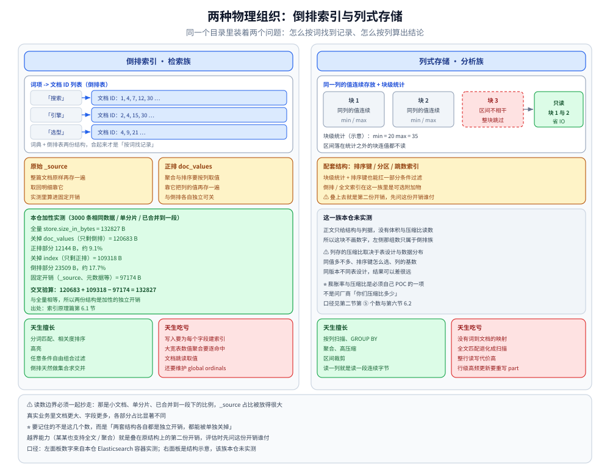
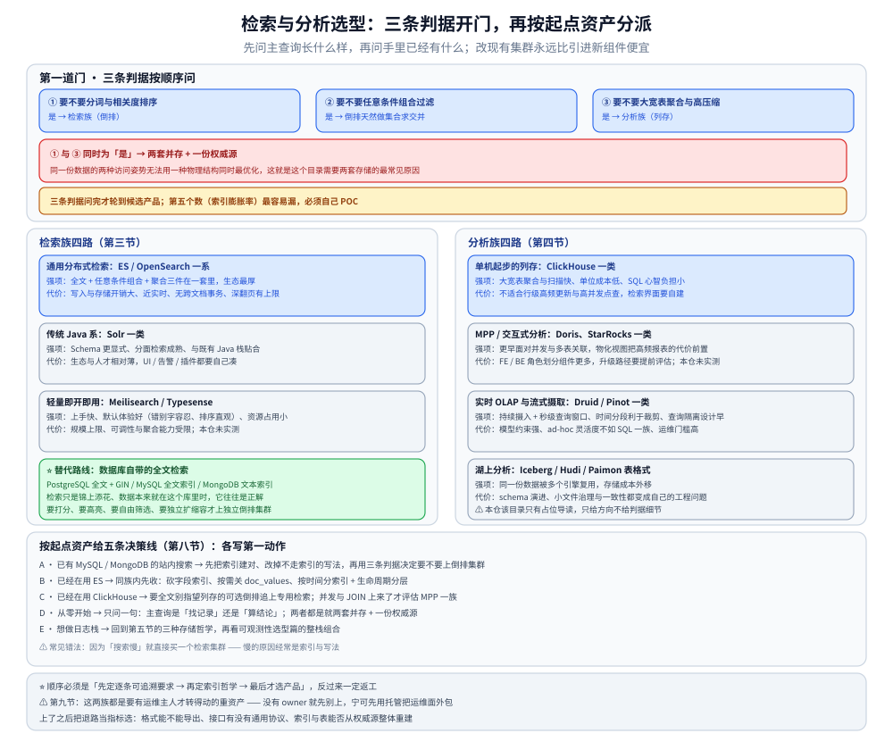

# 搜索与分析选型对比

> 「搜索与分析」这一个目录里装着两个问题：**怎么按词找到记录**（检索族）和**怎么按列算出结论**（分析族），外加一条两边都想吃的交叉路线（日志检索）。本篇把检索族四条路线、分析族四条路线、日志三种存储哲学拉平对照，先立「选型前必须量化的五个数」，再按**起点资产**给决策线，最后给一次可信 POC 的做法。
>
> ⭐ 边界先说清：本篇是**域内多产品横评**，只做「同族内部各家怎么比」这一层。
> 「ES 什么时候该用 / 不该用」的结论级对照已在 [存储选型.md](../存储选型.md) 第五节，「ClickHouse vs Elasticsearch」的差异表在**同篇第七节**，缓存选型在**同篇第六节** —— 本篇**不重抄这几处**，只把它们往下拆一层：检索族里除了 ES 还有谁、分析族里除了 ClickHouse 还有谁、「数据库自带全文检索」这条替代路线什么时候够用。
> 单产品的深度全部在各组件分册里（[README.md](Elasticsearch/README.md) 那九篇是本域唯一做过容器实测的），「七类存储怎么分类」看总纲，「时序库怎么横评」看同族的 [时序数据库选型对比.md](../时序数据库/时序数据库选型对比.md)。
>
> 内容整理自个人学习笔记，并参考各家官方文档与 Release Notes；素材见 [素材清单.md](../../../素材清单.md)。
>
> ⚠️ 实测口径：**本仓只有 Elasticsearch 做过容器实测**（`elasticsearch:8.19.0` 单节点；版本坐标见 [README.md](Elasticsearch/README.md) 第二节，索引体积读数见 [索引原理.md](Elasticsearch/索引原理.md) 第六节）。
> OpenSearch / Solr / Meilisearch / Typesense / PostgreSQL 全文 / ClickHouse / Doris / StarRocks / Druid / Pinot 在本仓**一律是文档陈述、未实测**，所以本篇只给**结构与模型的定性对照 + 判据**；⭐ **不引用任何第三方跑分或压缩比当结论**，需要数字的地方一律指向本仓已有的实测出处。

---

## 一、「搜索」和「分析」为什么常被放进同一个目录，却是两个问题？

**本节要点**：两者被放在一起只因为「都读大量数据、都用来回答人提出的问题」，但它们把数据组织成两种相反的形状，于是擅长的查询也相反。结论级的差异表在 [存储选型.md](../存储选型.md) 第七节，本节只补判据的展开。



说明：左面板把「词项 → 文档 ID 列表」画成倒排表，并把原始 `_source` 与聚合排序用的正排 doc_values 画成两份**并列的独立开销**，同时抄进第 2.3 节那组加性实测：全量 132827 B、正排部分 12144 B（约 9.1%）、倒排部分 23509 B（约 17.7%）、固定开销 97174 B，交叉验算 `120683 + 109318 − 97174 = 132827` 与全量相等；右面板画同一列的值连续存放加块级 min/max，以及「区间不相干就连值都不读、整块跳过」这条裁剪路径 —— 该族本仓未实测，所以右侧只有结构示意、没有数字。**容易误读的地方**：⚠️ 那组读数是小文档、单分片、已合并到一段下的比例，`_source` 占比被放得很大，要记住的不是这几个数，而是「两套结构各自都是独立开销」；底部注脚里还写着第 1.3 节那条推论 —— 越界能力就是叠在原结构上的第二份开销。

### 1.1 两种物理组织

| 组织方式 | 数据被存成什么 | 天生擅长 | 天生吃亏 |
|---|---|---|---|
| **倒排索引**（检索族） | 「词项 → 文档 ID 列表」+ 原始文档 + 正排（doc_values） | 分词匹配、相关度排序、高亮、任意条件自由组合过滤 | 写入要为每个字段建索引结构；大宽表数值聚合要逐命中文档跳读取值 |
| **列式存储**（分析族） | 同一列的值连续存放 + 块级统计信息（min/max 等） | 按列扫描、`GROUP BY`、聚合、高压缩、区间裁剪 | 没有「词 → 文档」的映射，全文匹配退化成扫描；整行读写代价高 |

倒排的构成与压缩（FST 词典、差分 + 分块位压缩的倒排表）见 [索引原理.md](Elasticsearch/索引原理.md) 第一、二节；词项压缩与位图那条原理线在 [位图与布隆过滤器.md](../../../02-计算机基础/数据结构/高级数据结构/位图与布隆过滤器.md)。

### 1.2 先判主查询形态：三条判据

⭐ 选型第一步不是看产品，是看**你的主查询长什么样**。三条按顺序问：

| # | 判据 | 回答「是」指向 | 回答「否」指向 |
|---|---|---|---|
| ① | **要不要分词与相关度排序**（用户输入自然语言，结果要按"像不像"排） | 检索族（倒排） | 不必为全文单独建倒排 |
| ② | **要不要任意条件组合过滤**（十几个筛选维度自由搭配，不能预知组合） | 检索族（倒排天然做集合求交并） | 分析族靠块级统计 + 排序键也能扛一部分 |
| ③ | **要不要大宽表聚合与高压缩**（`GROUP BY` 上十亿行、按时间范围扫、成本敏感） | 分析族（列存） | 检索族的聚合是「顺带能力」，量大时先撞内存 |

> ⭐ ① 与 ③ 同时为「是」，就是这个目录需要两套存储的最常见原因 —— 不是"既要搜索又要分析"这句口号，而是**同一份数据的两种访问姿势无法用一种物理结构同时最优化**。

### 1.3 ⚠️ 两边都在越界，越界部分不代表主业

检索族在补分析能力（列式存储、doc_values、近似去重），分析族在补检索能力（倒排 / 全文索引、跳数索引）。本仓 ES 侧那条真实教训正好适用于评估这类越界功能：**倒排与正排是两份独立开销，都能被单独关掉**（体积加性验证见 [索引原理.md](Elasticsearch/索引原理.md) 第 6.1 节）—— 越界能力就是叠在原结构上的第二份开销，**评估"某某也支持全文检索"时先问这份开销谁付**。

---

## 二、选型前必须先量化的五个数？

**本节要点**：五个数先定下来，候选会自动砍掉一半，比任何功能对照表都有效；第五个数（索引膨胀率）最容易被漏。

### 2.1 五个输入

| # | 量什么 | 怎么量 | 为什么它决定选型 |
|---|---|---|---|
| ① | **数据总量与日增量** | 现有条数 × 平均文档大小，再按业务增速外推一年 | 决定单机还是集群，也决定「轻量方案」能不能进候选名单 |
| ② | **写入模式** | 实时单条 / 批量导入 / 流式持续写各占多少；峰值条 / 秒 | 列存族普遍偏好批量追加；倒排族每次更新都是「标记删除 + 追加新段」 |
| ③ | **查询形态构成** | 全文匹配 / 条件过滤 / 聚合统计 / 主键明细回查，四类各占比 | 直接决定落在哪一族；占比最高的那类说了算 |
| ④ | **新鲜度与延迟要求** | 写入后多久必须可查（能否接受秒级）；查询 P95 / P99 预算 | 近实时（默认约 1s 刷新）多数场景够用，但「写完立刻要读到」要另外设计语义 |
| ⑤ | **副本与成本预算** | 几副本、保留多久、能容忍多少冷数据、有没有人力运维第二套存储 | ⭐ 成本不是许可一项，是**许可 + 硬件 + 人力 + 迁移**四项之和 |

第 ④ 项的真实语义在 [写入流程.md](Elasticsearch/写入流程.md) 第二节：「返回 200」≠「能搜到」，可见点在 refresh、不丢的持久化点在 flush。

### 2.2 每个数会砍掉哪些候选

| 条件 | 直接排除 | 保留 |
|---|---|---|
| 量小、字段简单、只有模糊匹配需求 | 独立检索集群（含托管服务） | **数据库自带全文检索**这条替代路线 |
| 主查询是聚合与扫宽表，几乎不需要相关度排序 | 以倒排为主结构的方案 | 列存 / MPP 分析族 |
| 需要高亮 + 打分 + 十来个筛选维度自由组合 | 只做过滤的索引方案 | 通用分布式检索族 |
| 写入是高频单条 + 频繁行级更新 | 依赖 part 重写的列存路线 | 检索族，或「行存权威源 + 派生分析副本」 |

### 2.3 ⭐ 第五个数最容易漏：索引膨胀率与存储放大

「存 1 GB 原始数据最后占多少磁盘」在检索族里**远不是 1**：一份文档同时被存成原始 `_source`、倒排结构、以及聚合排序用的正排结构，再乘副本。本仓有一组干净的加性实测（**3000 条相同数据、单分片、`_forcemerge` 到一段**，出处 [索引原理.md](Elasticsearch/索引原理.md) 第 6.1 节）：

```text
全量索引 store.size_in_bytes = 132827
关掉 doc_values（只剩倒排）  = 120683   → 正排部分  12144 B（约 9.1%）
关掉 index（只剩正排）        = 109318   → 倒排部分  23509 B（约 17.7%）
固定开销（_source、元数据等）        = 97174 B
交叉验算：120683 + 109318 − 97174 = 132827 ✅ 与全量相等
```

⚠️ **读数的边界必须一起抄走**：那是小文档、单分片、已合并到一段下的比例，`_source` 占比被放得很大；真实业务里文档更大、字段更多，各部分占比显著不同。**要记住的不是这几个数，而是「两套结构各自都是独立开销」**。选型时的用法：把膨胀率列为**必须自己 POC 的一项**，而不是问厂商「你们压缩比多少」。

---

## 三、检索族候选可以分成哪四路？

**本节要点**：四路不是「四个产品」，是四种**投入量级**：重型集群 / 显式 Schema / 应用内轻量 / 不引进新组件。

### 3.1 通用分布式检索：Elasticsearch / OpenSearch 一系

- **机制一句**：Lucene 段 + 倒排，外面套分片 / 副本 + REST API + 聚合框架；查询用 JSON DSL（主线见 [搜索流程与DSL.md](Elasticsearch/搜索流程与DSL.md)）。
- **强项**：全文 + 任意条件组合 + 聚合**三件在一套里**；生态与可视化成熟；向量检索是同一套集群的附加能力（见 [向量与AI搜索.md](Elasticsearch/向量与AI搜索.md)）。
- **弱项**：写入与存储开销大（见第 2.3 节）、近实时、无跨文档事务、深翻页有硬上限（`index.max_result_window` 默认 10000，见 [分页与聚合.md](Elasticsearch/分页与聚合.md) 第一节）。
- ⚠️ **同源分叉怎么看**：这一系里有「同出一源、后来分叉」的两个发行版。⭐ 本篇**不断言具体日期、条款与许可证文本** —— 这类事实变更过、还会再变。要评估的只有两件事：① **许可与治理背景**（授权曾变更过且随版本调整 → **逐条核官方**，并把「三年后还能不能按今天的条款用」写进结论）；② **生态兼容差异**：API 兼容 ≠ 插件 / 客户端 / 安全模型 / 升级路径兼容，判据是拿**你实际依赖的那几项**去核 —— 客户端主版本对应关系、你在用的插件对面有没有等价物、快照与索引格式能否互迁、备份 / 监控 / 权限这些运维工具跟不跟得上。
- ⭐ **什么团队会选**：需要「全文 + 过滤 + 聚合」在同一条查询里给结果，且有人接得住集群运维。

### 3.2 另外两路：传统 Java 系与轻量即开即用

| | Solr 一类（传统 Java 系） | Meilisearch / Typesense 一类（轻量） |
|---|---|---|
| **机制一句** | 同样建在 Lucene 上，但 Schema 更显式（字段类型与解析链要先在配置里定义清楚），运维形态偏传统 Java 应用 | 面向「应用内搜索」：容错拼写、即插即用的相关性排序，部署与心智负担刻意做小 |
| **强项** | Schema 显式带来可预期性、分面检索成熟、与既有 Java 栈贴合 | 上手快、默认体验好（错别字容忍、排序直观）、资源占用小 |
| **弱项** | 生态与人才相对薄（可视化、周边工具、社区问答都不如上一路），云托管选项少 | 规模上限、可调性与聚合能力受限；⚠️ **本仓未做任何实测**，边界请核官方 |
| ⭐ **什么团队会选** | 存量 Java 平台团队，且愿意自己凑 UI / 告警 / 插件 | 站内搜索、商品与文档检索这类「要好用而不是要万能」 |
| ⚠️ **常见误用** | 因为「熟 Java 所以熟 Solr」，却没算外围全要自建 | 拿它当日志检索后端，或需要复杂多维聚合与自定义打分 |

### 3.3 ⭐ 替代路线：数据库自带的全文检索

这一路常被跳过，但它往往是**正解**：先别引进独立检索集群。

| 落点 | 机制 | 什么时候它够用 | 什么时候必须上倒排集群 |
|---|---|---|---|
| PostgreSQL 的全文检索类型 + GIN 索引 | 解析成词位（lexeme）后建倒排式 GIN | 单库内模糊匹配、量与并发在关系库舒适区内、不需要精细相关度工程 | 要跨表聚合、要高亮与打分调优、要独立扩缩读写 |
| MySQL 的全文索引 | InnoDB 自己维护一份倒排结构，`MATCH ... AGAINST` | 中小数据量、只在少数几张表上做关键词匹配 | ⚠️ 先按 [查询优化.md](../关系型/MySQL/查询优化.md) 确认"搜不到 / 搜得慢"不是前导通配与 `LIKE '%x%'` 这类索引与写法问题；要多维自由筛选、要聚合就换路线 |
| MongoDB 的文本索引 / 托管搜索 | `$text` 打分检索；托管搜索把索引交给独立服务 | 已在用 Mongo、只要「粗略匹配 + 其它条件过滤」 | 要相关度工程、跨集合检索、聚合分析时；索引类型限制见 [索引原理.md](../NoSQL/MongoDB/索引原理.md) |

> ⭐ 判据一句话：**「检索只是锦上添花，数据本来就在这个库里」→ 先用库自带能力 + 把索引建对**；「检索本身就是产品主功能（要打分、要高亮、要筛选维度自由组合、要独立扩缩容）」→ 才上独立倒排集群。

---

## 四、分析族候选可以分成哪四路？

**本节要点**：分析族的分歧点是「**摄取模型**」和「**谁来保证查询隔离**」，不是 SQL 方言；ClickHouse 与 ES 的差异表在 [存储选型.md](../存储选型.md) 第七节，本节只补同族内部怎么分。

### 4.1 单机起步的列存：ClickHouse 一类

- **机制一句**：按列连续存放 + 块级统计 + 向量化执行，写入走批量追加 part。
- **强项**：大宽表聚合与扫描快、压缩带来的单位成本低、SQL 心智负担小。
- **弱项**：⚠️ 不适合行级高频更新与高并发点查（更新要重写 part）；没有现成检索 UI，采集管道与查询界面要自建。
- ⭐ **什么团队会选**：主查询就是「SQL + 大宽表聚合」，且有人理解 MergeTree 类表引擎的调优。
- ⚠️ **常见误用**：拿它当 OLTP 主库，或当日志的**逐条**检索入口。

### 4.2 MPP / 交互式分析引擎：Doris、StarRocks 一类

- **机制一句**：多实例并行（MPP）执行 + 物化视图 / 预聚合换低延迟，接入方式通常兼容 MySQL 协议那一路。
- **强项**：比单机列存更早面对「并发与多表关联」；物化视图把高频报表的代价前置。
- **弱项**：运维组件比上一路多（FE / BE 这类角色划分），升级路径要提前评估；⚠️ **本仓未实测**。
- ⭐ **什么团队会选**：要做报表 / 自助分析平台，并发与 JOIN 是真实需求，且已有部署标准化底子。
- ⚠️ **常见误用**：把它当「更贵的 ClickHouse」—— 查询若只是单表大聚合，多花的分布式成本买不到东西。

### 4.3 实时 OLAP 与流式摄取：Druid / Pinot 一类

- **机制一句**：**摄取模型是主角** —— 数据流式进深度存储、按时间分片、实时段与历史段分层，查询走预先定义好的数据源与聚合粒度。
- **强项**：持续摄入 + 秒级查询窗口、时间分段天然利于裁剪、多租户与查询隔离设计得比通用列存早。
- **弱项**：模型约束强（要预先定义数据源、维度与度量），ad-hoc 灵活度不如 SQL 一族；学习与运维门槛高；⚠️ **本仓未实测**。
- ⭐ **什么团队会选**：实时看板 / 计量分析这类「持续流入 + 固定几个高并发查询」的产品化场景。
- ⚠️ **常见误用**：只是想查日志却上了流式 OLAP 全家桶 —— 组件数量与心智成本完全不成比例。

### 4.4 湖上分析（Iceberg / Hudi / Paimon 一类表格式）

数据落在对象存储的开放格式上，引擎（包括上面几族）只做计算层：价值在「同一份数据被多个引擎复用 + 存储成本外移」，代价是 schema 演进、小文件治理与一致性都变成自己的工程问题。⚠️ **本仓该目录目前只有占位导读**（[README.md](../数据湖/README.md)，主题待补），所以本节**只给方向、不给判据细节**；时序侧的同类讨论见 [时序数据库选型对比.md](../时序数据库/时序数据库选型对比.md)。

---

## 五、日志/可观测性检索这条交叉路线怎么选？

**本节要点**：日志是「两边都想吃」的典型 —— 同一份文本，三种存储哲学，差别全在「排障时你能定位到什么」。整栈选型在 [可观测性选型.md](../../../06-工程实践/可观测性/可观测性选型.md)，「一库多信号」那条路线在 [时序数据库选型对比.md](../时序数据库/时序数据库选型对比.md)，本节不重讲。

### 5.1 三种存储哲学的三面对照

| 哲学 | 存了什么 | 查询能力 | 成本 | ⭐ 排障时能不能定位到单条 |
|---|---|---|---|---|
| **全量倒排**（检索族做日志后端） | 每条日志的每个词项都建索引 | 全文匹配 + 任意字段筛选 + 聚合，一条查询里给完 | 最高（膨胀率见第 2.3 节，还要乘副本） | ✅ 最强：任何关键字都能捞到具体那一行 |
| **只索引标签、不索引正文** | 只给服务 / 级别 / 时间这类低基数标签建索引，正文按块丢对象存储 | 先按标签缩小范围，再在范围内扫文本 | 低一个量级（口径见 [可观测性选型.md](../../../06-工程实践/可观测性/可观测性选型.md) 第四节） | ⚠️ 能定位，但代价是**查询慢、灵活度受限**；关键字越模糊扫得越狠 |
| **列存 + 采样与压缩** | 结构化字段按列存、正文压缩，且可能只保留部分样本 | 聚合、趋势、按 ID / 字段精查很好；全文匹配弱 | 最低（列存压缩 + 采样双重降本） | ❌ 采样之后**那条日志可能根本不存在**，只能定位到"哪一批" |

选路时依次问三件事：① **主要动作是"按关键字捞那一行"还是"看趋势与占比"？** 前者要倒排或标签 + 扫描，后者列存更划算；② **能接受多长查询延迟？** 只索引标签在「模糊关键字 + 长时间窗」上会明显变慢；③ ⭐ **采样后还能不能定责？** 审计、安全、资金链路这类要逐条可追的日志不能只靠采样 —— 这条最难取舍，因为降本手段（分级保留、采样、ERROR 全留 INFO 抽样）本质是**牺牲可定位性换成本**，要按日志类别分开设，不能全局一刀切。

---

## 六、同一组维度上怎么对照？

**本节要点**：七个维度拉平看，但 ⚠️ 有一整列（性能与压缩比）不能横向比。

### 6.1 七维定性对照表

| 维度 | 分布式倒排（ES/OpenSearch 系） | 传统 Java 检索（Solr 系） | 轻量检索（Meilisearch/Typesense 系） | 数据库自带全文 | 列存（ClickHouse 系） | MPP / 实时 OLAP（Doris、StarRocks、Druid、Pinot 系） |
|---|---|---|---|---|---|---|
| **索引与存储结构** | 倒排 + `_source` + 正排，三份开销叠加 | 倒排（Lucene），Schema 更显式 | 倒排为主，为应用内搜索优化 | 挂在原有表存储旁的一份额外索引 | 列 + 块级统计，倒排是可选附加物 | 列 + 预聚合 / 物化视图；实时族另有分层段 |
| **查询语言与表达力** | JSON DSL + 聚合框架，部分线另有查询语言 | DSL / Solr 参数 | 极简 API，可调项少 | SQL（方言各异） | SQL | SQL 或专有数据源模型 |
| **写入模式与新鲜度** | 批量 bulk + 近实时（约 1s 刷新，见本仓 [写入流程.md](Elasticsearch/写入流程.md)） | 批量提交为主 | 即写即查取向 | 跟主库事务一起写 | 偏好批量追加，行级更新代价高 | 流式摄取或批量导入，看具体路线 |
| **扩展与多租户** | 分片 + 副本，天然水平扩展；租户靠路由与索引设计 | 分片集合 | 扩展上限低（本仓未实测） | 受主库扩展方式约束 | 单机到集群分片 | 一开始就按并发与租户设计 |
| **成本结构** | 高（内存 + 磁盘膨胀 + 副本） | 中（硬件同量级，外围自建） | 低（规模小才成立） | 几乎为零（已经在这个库上） | 最低（列存压缩 + 少副本可行） | 中到高（用组件数量换查询隔离） |
| **生态与人才** | ⭐ 最厚：托管、工具、文档、问答都全 | 相对薄，集中在 Java 圈 | 新兴，案例集中在应用搜索 | 跟关系库走，无额外学习成本 | 厚，但调优需要专门经验 | 较薄，通常需要专职团队 |
| **许可与治理** | ⚠️ 这一族的授权**变更过、且还会再变**；分叉发行版各自逐条核官方 | 开源为主 | 各家条款差异大（含强 copyleft 类），逐条核 | 数据库本身的许可 | 开源为主，商业云另有版本 | 开源为主，企业版边界要核 |

⭐ 读法：先看前两列（**结构 + 查询语言**），它们决定改造面和膨胀率；再看「写入模式与新鲜度」，写入模式对不上第 2.1 节的 ② 号输入，后面所有调优都是在填坑；最后看成本与人才，⭐ 成本取**许可 + 硬件 + 人力 + 迁移**四项之和，人才往往是最贵那一项。

### 6.2 ⚠️ 这一列不能横向比：性能与压缩比

- 各家公开跑分都有明确前置条件（硬件、版本、字段与基数、写入模式、查询组合）；⭐ **当口径读，不要当结论用**。
- **列存的压缩比取决于你的表设计与数据分布**（同值多不多、排序键怎么选、列的基数）—— 同版本不同表设计结果可以差很远，不是"装上就有"。
- **检索族的"慢"往往不在结构上**：段太多、深翻页撞上限、聚合首次要重建 global ordinals、fielddata 打爆堆，这些在本仓都有专篇（[分页与聚合.md](Elasticsearch/分页与聚合.md)、[常见事故.md](Elasticsearch/常见事故.md)）。
- ⚠️ **官方给的降本数字同样是口径**：本仓 [README.md](Elasticsearch/README.md) 的版本坐标里就记着「8.17 起 logsdb 索引模式 GA」这类事实，但它**不能换算成你这套数据的节省比例** —— 要落地必须自己灌一遍采样数据量体积（见 `## 使用`）。

---

## 七、契合语言与团队栈怎么选？

**本节要点**：检索 / 分析引擎的客户端 SDK、批量写入工具、DSL / SQL 生态在语言侧**差距很大**，同一款产品在不同语言团队里的落地成本不是同一个数。

| 语言 | 检索族代表（ES / OpenSearch 一系） | 分析族代表（ClickHouse / Doris 一系） |
|---|---|---|
| **Java** | ⭐ 最顺：官方 Java 客户端与服务端主版本严格对应，批量写入、嗅探、连接池这些运维能力都在客户端里（历史包袱是旧客户端被弃用，见 [客户端.md](Elasticsearch/客户端.md) 第一节）；DSL 拼装与序列化生态成熟，运维 API 全覆盖 | 兼容 MySQL 协议的一族可直接沿用既有 JDBC / 连接池 / DAO 层，驱动、ORM、报表工具全在；运维侧走 JDBC 加 HTTP，覆盖度高 |
| **Go** | 官方 Go 客户端可用且与 8.x 对齐，但 ⚠️ 曾经最流行的社区客户端已停止维护 —— 老项目里翻到它的示例是常见坑（同篇第一节）；Bulk 要自己拼 NDJSON（每行一个 JSON，**行尾必须有换行**，见 [写入流程.md](Elasticsearch/写入流程.md) 第 1.2 节），typed 查询覆盖不如 Java 全 | 多数走 HTTP 或官方 Go 驱动，查询接口够用；批量导入往往要自己写攒批与重试；运维 API（集群状态、任务、DDL）覆盖参差，**POC 要专门测一条运维调用** |
| **PHP** | ⚠️ 官方客户端与服务端的版本对应比 Java / Go 更容易脱节，多数团队实际走 REST 加通用 HTTP 客户端；DSL 只能手拼 JSON，映射与聚合的样板代码最多 | 一般只当查询层：SQL 通过 HTTP 或 MySQL 协议接口下发；批量摄取交给旁路管道（队列 / 采集器），不放在请求路径里 |

> ⭐ 三条结论：
>
> ① **Go 团队**：检索族选倒排一系成本可接受（官方客户端与服务端主版本对齐即可），但**批量写入与 typed 查询要自己封装一层**；分析族要预留「自建摄取管道 + 运维 API」的工时，并把「能不能从 Go 完整调通运维接口」列为 POC 必答项。
> ② **Java 团队**：两族都是最低心智成本 —— 客户端成熟度、DSL / SQL 工具、埋点与周边运维资料最全；代价是 JVM 堆与客户端版本演进要跟着服务端一起管（旧客户端弃用就是这类历史坑）。
> ③ **PHP / 多语言混合团队**：⚠️ 别把 DSL、批量、重试、降级这些复杂度放进请求路径 —— 用一层薄查询服务把它们统一收口，各语言只调业务语义接口；混合栈时以「谁拥有数据写入管道」定主语言。

> ⚠️ 反面教训：评审只看功能对照表、不看"我这门语言能不能顺手把 Bulk、翻页和运维 API 写出来"，结果就是**同一款产品在有平台组的团队很顺、在只有存量 PHP 系统的团队被吐槽到下线** —— 差异不在产品，在语言侧的工具链厚度。

---

## 八、按「起点资产」怎么决策？

**本节要点**：选型不是从空白开始，而是从"手里已经有什么"开始；改现有集群永远比引进新组件便宜。



说明：顶部是第 1.2 节那三条判据（① 分词与相关度排序、② 任意条件组合过滤、③ 大宽表聚合与高压缩），**① 与 ③ 同时为「是」直接落到「两套并存 + 一份权威源」**；中部左栏是检索族四路（通用分布式 ES / OpenSearch 一系、传统 Java 系 Solr、轻量 Meilisearch / Typesense、绿色的替代路线「数据库自带的全文检索」—— 数据本来就在这个库里时它往往是正解），右栏是分析族四路（单机列存 ClickHouse、MPP Doris / StarRocks、实时 OLAP Druid / Pinot、湖上分析表格式），每路一句强项一句代价；底部把第八节 A~E 收成「第一动作」。⚠️ 注脚那句顺序不能颠倒：**先定逐条可追溯要求 → 再定索引哲学 → 最后才选产品**，反过来一定返工；第九节那条「没有 owner 就先别上」也画在同一格里。

### 8.1 决策线 A：已有 MySQL / MongoDB，需求是站内搜索

走第 3.3 节的替代路线：先把索引建对、把不走索引的写法改掉（[查询优化.md](../关系型/MySQL/查询优化.md)），再拿「相关度、筛选维度自由度、独立扩缩容」三条判据决定要不要上倒排集群。⚠️ 常见错法是**因为"搜索慢"就直接买一个检索集群** —— 慢的原因经常是索引与写法（关系型侧的索引主线见 [索引设计与EXPLAIN.md](../关系型/MySQL/索引设计与EXPLAIN.md)）。

### 8.2 决策线 B：已经在用 ES

| 状况 | 首选动作 | 判据 |
|---|---|---|
| 版本停在旧大版本 | 先做**升级路径评估**，再谈换栈 | 客户端与服务端主版本必须对齐（[客户端.md](Elasticsearch/客户端.md) 第一节），跨大版本有 API 弃用面 |
| 成本扛不住、查询形态没变 | 先在**同一族内**收：砍字段索引、按需关 doc_values、按时间分索引 + 生命周期分层 | 「两套结构都是独立开销」本仓有实测出处（第 2.3 节）；分层做法见 [集群与运维.md](Elasticsearch/集群与运维.md) 第五节 |
| 只是日志检索太贵 | 回到第五节换存储哲学（只索引标签 / 列存 + 采样），而不是换检索产品 | 决定权在"要不要逐条可追"，不在产品口碑 |
| 想换同源的另一个发行版 | 先核第 3.1 节那两件事（许可治理背景 + 你实际依赖的生态兼容项），再谈迁移 | API 兼容 ≠ 插件 / 客户端 / 运维工具兼容 |
| 需求只是应用内搜索，被现有集群带进过度设计 | 考虑轻量检索那一族（第 3.2） | 用规模与可调性换部署简单，值不值看主查询形态 |

### 8.3 决策线 C：已经在用 ClickHouse

需要全文与高亮 → ⚠️ **不要指望列存的可选倒排追上专用检索**：先判断这是不是少数场景，是就用现有库的标签 + 扫描兜住，否则才加检索族。报表并发与多表 JOIN 上来了 → 评估第 4.2 那一族，而不是继续堆单机列存调优。想要「同一份数据多引擎复用」→ 看第 4.4 湖上路线，⚠️ 本仓该目录待补，判据要自己补。

### 8.4 决策线 D：从零开始

先只回答一个问题：**主查询是"找记录"还是"算结论"？**

| 主查询 | 首选 | 备注 |
|---|---|---|
| 找记录（分词 / 相关度 / 自由组合筛选） | 检索族（第 3.1 或 3.2 那一路，看规模） | 量小先走第 3.3 替代路线 |
| 算结论（宽表聚合 / 趋势 / 占比） | 分析族（第 4.1 起步） | 并发与 JOIN 出现再升第 4.2 |
| 两者都是主查询 | **两套并存 + 一份权威源** | 分工与同步方式见 [存储选型.md](../存储选型.md) 第九节，不重复讲 |

### 8.5 决策线 E：想做日志栈

直接回第五节的三种存储哲学，再看 [可观测性选型.md](../../../06-工程实践/可观测性/可观测性选型.md) 的整栈组合。⭐ 顺序必须是「先定逐条可追溯要求 → 再定索引哲学 → 最后才选产品」，反过来一定返工。

### 8.6 判据速查

| 场景 | 首选 | 备选 | 通常不该选 |
|---|---|---|---|
| 中小数据量的商品 / 文档站内搜索 | 数据库自带全文检索 + 索引建对 | 轻量检索族 | 直接上重型倒排集群 |
| 要相关度 + 筛选维度自由组合 + 聚合 | 通用分布式检索族 | 传统 Java 检索族 | 用列存硬做全文匹配 |
| 大宽表聚合、趋势报表、成本敏感 | 列存 / MPP 分析族 | 湖上分析 | 用检索族做主分析引擎 |
| 持续流入 + 固定几个高并发实时看板 | 实时 OLAP 一族 | MPP + 物化视图 | 单机列存硬扛并发 |
| 日志量大、只要"按服务与时间排障" | 只索引标签 | 列存 + 分级保留 | 全量倒排（成本先失控） |
| 审计 / 资金类要逐条可追 | 全量倒排，或全量列存 + 不采样 | 标签 + 长时间窗扫描 | ⚠️ 采样方案 |
| 主键点查与高频行级更新 | 关系库 / 缓存 | — | ⚠️ **列存不适合行级高频更新与高并发点查**（差异表见 [存储选型.md](../存储选型.md) 第七节，此处不重讲） |
| 把检索集群当唯一数据源 | — | — | ⚠️ **检索集群不能当唯一数据源**，它只是可重建的检索副本（该结论与正确姿势见 [存储选型.md](../存储选型.md) 第五节） |

---

## 九、哪些情况两套都别上？

**本节要点**：这两族都是「要有运维主人才转得动的重资产」，四种情形应当先忍住。

1. **数据量小**：替代路线（第 3.3 节）或干脆把索引与写法改对就够；引进一套集群换来的是备份、监控、权限、升级四件长期成本。
2. **访问模式单一**：只有几个固定查询时，一条 SQL 加索引或一张预聚合表就能覆盖，不需要通用查询框架。
3. **团队没有运维余力**：⭐ 没有 owner 的存储迟早出事；宁可先用托管服务把运维面外包，也别在没人接的时候自建。
4. **问题只是"读得慢"**：正解通常是缓存或索引优化，不是换引擎 —— 见 [缓存选型与容量.md](../缓存/缓存选型与容量.md) 与 [查询优化.md](../关系型/MySQL/查询优化.md)。

> 一旦上了，就把**退路**当指标来选：格式能不能导出、接口有没有通用协议、索引与表能否从权威源整体重建。⚠️ 「派生存储必须可重建」这条通用经验已在 [存储选型.md](../存储选型.md) 第十节立住，本篇只补一句：**深翻页与聚合上限这类硬约束也要写进退路评估**（本仓 ES 侧的默认上限见 [分页与聚合.md](Elasticsearch/分页与聚合.md) 第一节）。

---

## 使用：一次可信的检索/分析选型 POC 该怎么做

**本节要点**：POC 的目标不是"证明某个产品快"，而是**得到一份只对你这套口径有效的结论**。

### 步骤

1. **定口径**（半天）：把第 2.1 节五个数写成一张表，含「一年后的量、基数与并发预估」。
2. **拿真实采样**（1 天）：从生产抽一批**分布真实**的数据（字段基数、文本长度、时间聚集都要像）；⚠️ 随机均匀数据会同时美化压缩率与查询延迟。
3. **对齐条件**：同一台机器、同一版本、同一批数据、同一组查询，一次只改一个变量。
4. **测六项**：写入吞吐与积压、查询 P95 / P99（不是平均值）、**索引与存储放大率**（灌完量一遍体积）、翻页与聚合的代价（打到上限为止）、故障与恢复耗时、折算成本。
5. **结论带口径写**：每条结论绑上「数据量 / 字段与基数 / 查询组合 / 副本数」，脱离口径的结论不可复用。

### 起一个隔离实例（本仓口径：一律容器化）

```bash
# ① 自建独立实例：独立容器名 + 独立宿主端口（本仓实测用 8.19.0，端口 19200 以避开已有实例）
MSYS_NO_PATHCONV=1 docker run -d --name sel-es-poc \
  -e "discovery.type=single-node" -e "xpack.security.enabled=false" \
  -e "ES_JAVA_OPTS=-Xms1g -Xmx1g" \
  -p 19200:9200 elasticsearch:8.19.0

# ② 确认版本与安全开关：8.x 默认开启 TLS + 认证，只有本地 POC 才显式关掉
#    （版本坐标与本仓踩坑记录见 Elasticsearch/README.md 第二节）
curl --noproxy '*' -s "http://127.0.0.1:19200/?pretty" | grep -E '"number"|"cluster_name"'

# ③ 灌采样数据并量放大率：docs.count 与 store.size 要一起看，才能算出膨胀倍数
curl --noproxy '*' -s -X POST "http://127.0.0.1:19200/_bulk" \
  -H 'Content-Type: application/x-ndjson' --data-binary @sample.ndjson
curl --noproxy '*' -s "http://127.0.0.1:19200/_cat/indices/sel_poc*?v&h=index,docs.count,store.size"

# ④ 收尾只停自己建的容器（保留便于复跑），不要删，也不要碰别人已有的实例
docker stop sel-es-poc
```

⚠️ 三条必踩的坑：**Git Bash 下挂宿主机目录必须加 `MSYS_NO_PATHCONV=1`**（否则 `-v D:/...` 被改写成 `/d/...`，挂载点为空）；**宿主端口会冲突**（9200 / 8123 / 3306 都可能被占），起之前先看清残留实例；**收尾只做 stop、保留容器**，下次直接 start 复跑。其余产品（OpenSearch / ClickHouse / Doris 一类）同理，只是镜像与端口不同 —— ⚠️ 本仓只对 ES 做过这些读数，其余仍属**未实测**。

### ⚠️ 三个最容易犯的错

1. **拿公开跑分当结论**：它是口径不是你的结论；同族两家在低基数上跑出的名次，到你真实基数下可能整个反过来。
2. **只测首屏查询**：首页快不代表能用，要把**深翻页、大时间窗聚合、高基数 `GROUP BY`**这三条也测到上限。
3. **忽略索引与存储放大**：只测查询不测体积，POC 通过、上线账单爆 —— 第 2.3 节那组加性读数就是给这一项准备的量法。

---

## 延伸追问

- **为什么检索引擎不能当权威数据源？** → 它是为"找"而不是为"存"设计的：写入近实时（默认约 1s 才可见，见 [写入流程.md](Elasticsearch/写入流程.md)），没有跨文档事务，删除与更新是「标记 + 追加」。⭐ 正确姿势是「权威源 + 可重建的检索副本」，结论级对照在 [存储选型.md](../存储选型.md) 第五节。
- **同源分叉的两个发行版，兼容差异到底该怎么评估？** → 停在判据层做三件事：① 核**许可与治理背景**（条款变更过、还会再变，逐条看官方当前文本，不要引用二手结论）；② 拿你**实际依赖的生态项**逐项对（客户端主版本对应、在用的插件、快照与索引格式能否互迁、备份 / 监控 / 权限工具）；③ 把「三年后还能按今天的条款用吗」写进结论。API 列表一致不等于升级路径一致。
- **倒排与列存在"聚合慢不慢"上为什么会差这么多？** → 聚合要的是「按列取值 + 块级统计裁剪 + 连续内存扫描」。列存天生按列存放，读一列就是读一段连续字节；倒排族要靠**另一份正排结构（doc_values）**把列的值再存一遍，聚合时按命中文档跳读，还要维护 global ordinals（本仓 [索引原理.md](Elasticsearch/索引原理.md) 第五节）。⭐ "检索族也能聚合"背后是一份额外存储加一份跳数代价。
- **轻量检索方案能不能扛生产？** → 能扛「应用内搜索」这一类生产，前提是数据规模、可调性需求与隔离要求都低；不能扛的是当日志后端与复杂多维聚合。⚠️ 本仓对它**未实测**，边界必须自己 POC，别引用二手跑分。
- **日志为什么常出现"倒排和列存混用"？** → 因为排障动作分两种：**定位那一行**（要倒排，或标签 + 扫描）和**看趋势与占比**（要列存聚合）。同一份日志两种动作都要，所以常见形态是「近期高频查的那段放倒排、历史放列存或对象存储」，用时间窗而不是功能来切分（见第五节）。
- **深翻页与聚合上限为什么会改变选型结论？** → 翻页方案（`from/size` 有硬上限，游标类方案各有代价，见 [分页与聚合.md](Elasticsearch/分页与聚合.md)）与聚合的近似误差会直接决定产品能不能用：如果真实需求是"导出某时间段全部数据"，需要的是**按时间分索引 + 批量导出**，不是换一种游标。
- **两套并存会不会让一致性变成新问题？** → 会。检索与分析都是靠同步管道从权威源灌的派生副本，一致性预期要按「秒级到分钟级最终一致」设定，同步方式取舍见 [存储选型.md](../存储选型.md) 第九节。⭐ 判据是：**只要权威源在，派生数据必须能清空重灌**；做不到就是埋雷。

---

## 关联

- [README.md](Elasticsearch/README.md) — 本域唯一实测过的组件分册：9 篇阅读顺序 + 版本坐标表 + 「什么时候该用 ES」
- [索引原理.md](Elasticsearch/索引原理.md) — 倒排与正排两套结构的构成，以及第 2.3 节引用的**索引体积加性实测**
- [写入流程.md](Elasticsearch/写入流程.md) — 近实时语义（refresh / flush / translog）与批量写入的 NDJSON 约束
- [搜索流程与DSL.md](Elasticsearch/搜索流程与DSL.md) — 两阶段执行与 DSL 表达能力：判断"检索族能不能表达你的查询"要看它
- [集群与运维.md](Elasticsearch/集群与运维.md) — 分片规划、恢复与生命周期分层，检索族运维成本的真实来源
- [客户端.md](Elasticsearch/客户端.md) — 第七节「契合语言」的 Go / Java 侧事实出处（客户端与主版本对应、社区客户端停止维护）
- [存储选型.md](../存储选型.md) — 总纲：第五节「ES 该用 / 不该用」、第六节缓存、第七节「ClickHouse vs Elasticsearch」、第九节组合范式，本篇不重讲
- [时序数据库选型对比.md](../时序数据库/时序数据库选型对比.md) — 同族选型模板：五个数、候选分族、按起点资产决策与 POC 口径
- [索引原理.md](../NoSQL/MongoDB/索引原理.md) — 替代路线之一：文档库自带文本索引的类型限制与索引规划
- [查询优化.md](../关系型/MySQL/查询优化.md) — 替代路线之二：先确认"搜索慢"不是索引与写法问题
- [可观测性选型.md](../../../06-工程实践/可观测性/可观测性选型.md) — 第五节的整栈落点：三支柱、存储后端与日志降本手段
- [README.md](../数据湖/README.md) — 第 4.4 节湖上分析的落点目录（⚠️ 当前为占位导读，主题待补）
