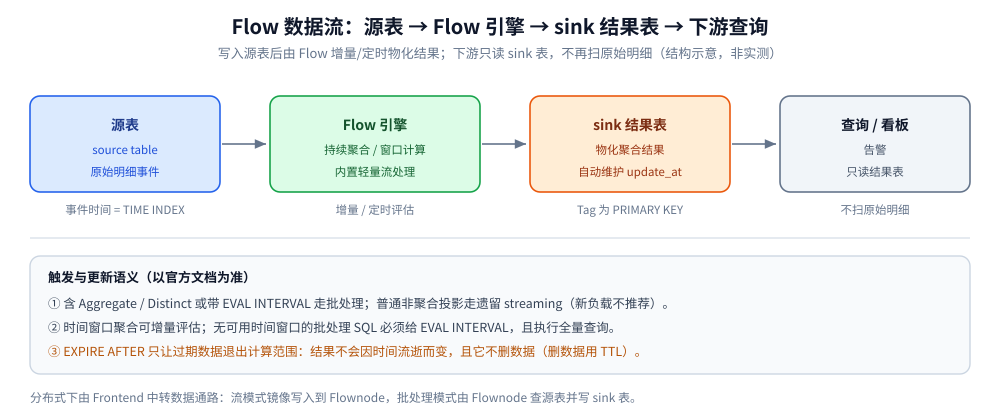

# Flow 流计算引擎

> GreptimeDB 把「持续聚合 / 流式计算」做进了数据库本身：用一条 `CREATE FLOW` 声明一个持续聚合任务，
> 源表写入后自动把结果物化到 sink 表 —— 回答「**为什么可以不外挂 Flink 就能做实时降采样与预聚合**」。
>
> 内容整理自个人学习笔记，并参考 GreptimeDB 官方文档与 Release Notes；素材见 [素材清单](../../../../素材清单.md)。

---

## 一、GreptimeDB 为什么要把流计算做进数据库？

**本节要点**：传统做法是「数据库 + 外挂流处理引擎（Flink / Flink SQL / Kafka Streams）」两套系统；
Flow 的思路是**把持续聚合下沉成数据库的一种 SQL 对象** —— 你只声明「算什么」，调度、状态、物化都交给数据库。

### 1.1 它解决的是「查询时才算」的浪费

可观测性场景里，看板与告警反复查询的是**同一批聚合结果**：每秒的 P99、每分钟的错误率、每台主机的 CPU 均值。
如果每次查询都从原始明细重新扫描、重新聚合，代价会随数据量线性增长。持续聚合把这批结果**预先算好、增量维护**，
查询只读结果表（sink table），不再扫原始事件（source table）。

官方文档把 Flow 的典型用途总结为两类：

| 用途 | 说明 |
|---|---|
| 给看板 / 告警备好聚合 | 查询读 sink 表，而不是每次都扫原始表 |
| 降采样（downsampling） | 如按「平均池化」降低采样频率，同时降低存储与分析体量 |

### 1.2 它替代外部流处理解决什么问题

Flow 是 GreptimeDB **内置的轻量级流处理引擎**（官方 v0.8 发布博客即以此定位），
提供持续聚合与窗口计算。相比「自己搭一套 Flink」：

- **没有跨系统的数据搬运**：源表与 sink 表都是 GreptimeDB 里的时序表，不需要「库 → CDC → 消息队列 → Flink → 再写回库」的链路；
- **声明成本低**：一条 `CREATE FLOW` 就够，不需要单独维护作业、Checkpoint、状态后端；
- **统一查询入口**：物化结果和原始数据用同一套 SQL 查询，不需要在两套引擎之间对账。

官方文档对分布式下的数据路径说得很清楚：Flow 的数据通路由 Frontend 中转 ——
流模式下 Frontend 把写入镜像给 Flownode；批处理模式下 Flownode 查询源表、把物化结果写回 sink 表。

### 1.3 先把边界划清楚

它是**轻量级、面向聚合**的引擎，不是通用流处理平台。官方文档在「支持的函数」处给了明确范围，
早期版本（v0.8/v0.9 文档口径）列出的是 `count/sum/avg/min/max` 加基础四则与比较逻辑运算；
当前文档把扩展能力放在「Expressions」一章。**要复杂多流 join、要精确一次的外部副作用，**
（如聚合后调用外部 API 发告警）**就不是 Flow 的定位** —— 下一节的取舍表会展开。



---

## 二、Flow 的核心概念与最小可用写法是什么？

**本节要点**：一条 Flow 涉及**三张东西** —— 源表、sink 表、Flow 定义本身。
sink 表可以预先建好（可控），也可以让 `CREATE FLOW` 自动推导建（省事）；两者对列的要求不同。

### 2.1 源表与 sink 表

- **源表（source table）**：存原始明细的时序表，`TIME INDEX` 列就是 Flow 眼中的「事件时间」。
- **sink 表（sink table）**：存物化结果。**必须与源表是不同的表**。

sink 表要能对上 Flow 查询的输出，官方文档给了四条对齐规则：

| 规则 | 要求 |
|---|---|
| 列顺序与类型 | 预建的 SQL sink 必须按顺序、按类型匹配查询输出列 |
| 时间索引 | 用时间窗口列作为 sink 表的 `TIME INDEX` |
| 更新时间 | 自动推导的批处理 SQL sink 会**自动加一列 `update_at`**；预建 sink 可多带一个末位时间戳列 |
| Tag | 用 `PRIMARY KEY` 指定 Tag，与时间索引一起构成行数据的唯一标识 |

⚠️ 注意一个容易踩的点：**TQL sink 不会自动加 `update_at`**，它严格跟随查询输出。

### 2.2 CREATE FLOW 的语法

当前官方文档（站点标注版本 1.2）给出的语法如下，**子句顺序有硬要求**：

```sql
CREATE [ OR REPLACE ] FLOW [ IF NOT EXISTS ] <flow-name>
SINK TO <sink-table-name>
[ EXPIRE AFTER <expr> ]
[ EVAL INTERVAL <interval> ]
[ COMMENT '<string>' ]
[ WITH (<flow-option> = <value> [, ...]) ]
AS
<SQL>;
```

要点：

- `EXPIRE AFTER` 必须写在 `EVAL INTERVAL` **前面**；
- `OR REPLACE` 与 `IF NOT EXISTS` **不能同时使用**；`OR REPLACE` 只替换 Flow 任务本身，**不动源表与 sink 表**；
- `flow-name` 是**目录级（catalog level）唯一**的标识符；
- sink 表不存在时，`CREATE FLOW` 会在「查询结果足以推导 schema」时自动创建它。

一个完整的例子（按官方 Manage Flows 的口径，源表 `temp_sensor_data` 已按 `PRIMARY KEY(sensor_id, loc)` 建好）：

```sql
CREATE TABLE temp_alerts (
  sensor_id INT,
  loc STRING,
  max_temp DOUBLE,
  time_window TIMESTAMP TIME INDEX,
  update_at TIMESTAMP,
  PRIMARY KEY(sensor_id, loc)
);

CREATE FLOW temp_monitoring
SINK TO temp_alerts
AS
SELECT
  sensor_id,
  loc,
  max(temperature) AS max_temp,
  date_bin('10 seconds'::INTERVAL, ts) AS time_window
FROM temp_sensor_data
GROUP BY sensor_id, loc, time_window
HAVING max_temp > 100;
```

### 2.3 时间窗口

窗口是持续聚合的核心属性，它决定「一次计算覆盖哪段数据」。官方文档明确：

- 窗口是**左闭右开**区间；
- 常用 `date_bin()` 定义固定窗口，例如 `date_bin('10 seconds'::INTERVAL, ts)` 表示从 UTC 00:00:00 起、
  每 10 秒一个窗口；
- 早期博客与文档里出现过 `tumble()` 函数写法，含义同样是固定滚动窗口。**以你所用版本文档为准**。

⚠️ 官方特别提示：**时间窗口表达式会帮助 Flow 判断「如何增量更新结果」**，
窗口大小要与负载和查询语义匹配 —— 窗口切得过细，状态与重算范围都会被放大。

---

## 三、查询部分只能用 SQL 吗？TQL 是什么？

**本节要点**：`AS` 后面**默认就是一段普通 SQL**（被当作标准查询来规划）。
在此之上，GreptimeDB 提供了一条把 **PromQL 风格的 TQL** 接进 Flow 的窄通道 —— 但形态很受限。

### 3.1 SQL 形态（主流）

典型批处理窗口聚合的形状是：`SELECT AGGR_FUNCTION(...) [, TIME_WINDOW_FUNCTION() AS time_window] FROM <source_table> GROUP BY {time_window | column1, column2, ...}`。

官方文档说明：带 `EVAL INTERVAL` 的批处理 SQL flow 支持 planner 能规划出来的 join、子查询与 SQL CTE；
**规划不出来的查询会在创建 Flow 时直接报错**（不会静默降级）。时间窗口聚合的 `GROUP BY` 通常包含时间窗口表达式。

### 3.2 TQL 形态（受限）

TQL 是 GreptimeDB 对 PromQL 兼容查询能力的延伸。把它接进 Flow 时，官方定义了一种**严格 CTE 形式**：

```sql
CREATE FLOW calc_rate_cte
SINK TO rate_reqs
EVAL INTERVAL '1m'
AS
WITH rate_data (ts, req_rate, host, job, instance) AS (
  TQL EVAL (now() - '1m'::interval, now(), '30s')
  rate(http_requests_total{job="my_service"}[1m]) AS req_rate
)
SELECT * FROM rate_data;
```

限制是「**故意收窄**」的：

- 只允许**一个 CTE**，且它**必须包含 `TQL EVAL`**；
- 外层查询**必须恰好是 `SELECT * FROM <cte>`**；
- 不支持额外的投影、过滤、join、排序或再套一层 SQL CTE；
- **TQL flow 必须带 `EVAL INTERVAL`**。

⭐ 结论：**能用 SQL 表达就用 SQL**。只有当你要复用的逻辑本身就是一段 PromQL（如 `rate()`、聚合运算符）时，
才走 TQL 这条路。

---

## 四、Flow 什么时候刷新？「定时」和「惰性」语义怎么算？

**本节要点**：Flow 不是「每条数据来就立刻算一次」。它由两个正交的旋钮控制 ——
**`EVAL INTERVAL` 管「多久评估一次」**，**`EXPIRE AFTER` 管「多老的数据不再参与」**。
官方文档没有叫 `UPDATE AT` 的刷新子句；sink 表里那列 `update_at` 是**结果行的更新时间戳**，不是触发器。

### 4.1 执行路由：批处理 vs 流处理

当前文档口径（重要，容易记错）：

| 情形 | 走哪种模式 |
|---|---|
| 含 `Aggregate` 或 `Distinct` 的 SQL 计划 | **批处理（batching）** |
| 普通投影、非聚合 join | **遗留流处理（legacy streaming）**，新负载不推荐 |
| 带 `EVAL INTERVAL` | **强制批处理**并调度评估，与 SQL 形状无关 |
| 源表带 `WITH ('ttl'='instant')` | 若不带 `EVAL INTERVAL` 则走遗留流处理；**且不能与 `EVAL INTERVAL` 组合** |
| TQL flow | 必须带 `EVAL INTERVAL`，走批处理 |

⚠️ 官方已把 `WITH ('ttl' = 'instant')` 在 Flow 源表上的用法标为**遗留模式（legacy）**，
新负载不要再用，改用正常保留策略（TTL）。

### 4.2 EVAL INTERVAL：定时评估

`EVAL INTERVAL` 是「按固定间隔调度一次批处理评估」的旋钮。对**时间窗口 SQL**，
一次评估可以是**增量**的，而不是把整段查询重跑一遍。对**没有可用时间窗口**的批处理 SQL，
它必须显式给出 `EVAL INTERVAL`，且执行的是**全量查询**（unfiltered snapshot）。

一句话：**窗口聚合是增量的，非窗口聚合是全量的** —— 这是选型时最该记住的性能分水岭。

### 4.3 EXPIRE AFTER：过期与「惰性」

`EXPIRE AFTER` 指定**中间状态/参与计算的数据从多久之前开始过期**。语义细节：

- 对**有可用时间窗口**的 Flow：源表里早于该区间的数据不再参与计算，对应的旧 sink 行也不再更新；
  这**限制了状态与重算范围**；
- 它**只作用于新到达的数据**，因此结果表**不会仅因时间流逝就自己变化**；
- ⚠️ **它不删数据**。要真正删除源表或 sink 表里的数据，请在建表时设 `TTL`。

这正是「惰性更新」的含义：**迟到的老数据不会再回头改写 sink 表**，换来的是有界的状态与可预测的成本。

### 4.4 update_at 与手动触发

- **`update_at`**：sink 表里记录该行**最近一次被 Flow 更新的时间**，由引擎自动维护。它是一条观测用的时间戳，
  不是调度配置。
- **手动触发**：引擎通常在新数据到达后的**数秒内**处理聚合；需要立刻算时用：

```sql
ADMIN FLUSH_FLOW('<flow-name>')
```

### 4.5 观测：怎么查看 Flow 的状态

| 命令 / 表 | 用途 |
|---|---|
| `SHOW FLOWS;` | 列出所有 Flow |
| `SHOW CREATE FLOW my_flow;` | 查看某个 Flow 的定义 |
| `SHOW FLOW STATUS LIKE 'my%';` | 查看匹配 Flow 的运行时统计 |
| `SELECT * FROM information_schema.flows;` | Flow 定义 |
| `SELECT * FROM information_schema.flow_statistics;` | Flow 运行时统计 |

⚠️ 官方提示：运行时字段**初始可能是 `NULL`**，且在分布式部署下数值**可能落后于最新状态**。

---

## 五、Flow 与物化视图 / 定时任务 / 外部流处理怎么选？

**本节要点**：四种做法解决的是**同一类问题（预计算）**，但「谁负责触发、状态放哪、查询时要不要再算」不同。
判据是：**数据是否已经在库里**、**能不能容忍结果滞后一个评估周期**、**聚合逻辑能不能用 SQL 表达**。

| 维度 | Flow（GreptimeDB 内置） | 物化视图（`CREATE VIEW` + 手动刷新） | 数据库外定时任务 | 外挂流处理（Flink 等） |
|---|---|---|---|---|
| 触发方式 | 源表写入后由引擎增量/定时评估 | 显式刷新，非自动 | 由调度器（cron/xxl-job）拉起 SQL | 由消息流驱动 |
| 结果新鲜度 | 秒级（默认数秒内，可用 `EVAL INTERVAL` 调） | 取决于刷新频率 | 取决于调度频率 | 亚秒~秒 |
| 状态维护 | 引擎内部维护 | 无（每次全量重算） | 无 | 作业自己维护 |
| 数据是否要出库 | 不用 | 不用 | 不用 | 通常需要（CDC/MQ） |
| 逻辑表达力 | SQL / 受限 TQL | 任意 SQL | 任意 SQL | 通用（最灵活） |
| 适用 | 库内时序聚合、降采样 | 低频、可容忍重算 | 业务侧离线汇总 | 跨源、复杂窗口、外部副作用 |

⭐ 选型口诀：**「数据已在 GreptimeDB 里、逻辑是聚合、能接受秒级滞后」→ Flow；**
**「要跨多个数据源、或要精确一次地调用外部系统」→ 才考虑外挂流处理。**

---

## 六、什么时候不该用 Flow？

**本节要点**：Flow 的定位是**库内轻量持续聚合**。下面几类需求，用 Flow 会别扭甚至做不到，应当明确排除。

| 不该用的场景 | 原因 | 该用什么 |
|---|---|---|
| 复杂多流 join / 大状态窗口 | Flow 以聚合为主，规划不出的查询创建即失败 | 外部流处理引擎 |
| 非聚合的简单投影 | 会落到**遗留 streaming 模式**，官方不推荐新负载使用 | 普通查询 / 视图 |
| 需要「迟到数据回头改写历史结果」 | `EXPIRE AFTER` 让老数据出局，**结果不因时间流逝而变** | 批处理重算 |
| 要删除数据来控体量 | Flow **不删数据**，只控制参与计算的范围 | 建表时设 `TTL` |

---

## 使用：用 Flow 做 RED 指标的实时降采样

**本节要点**：这是一个**把原始链路追踪明细压成分钟级 RED 指标**的典型用法
（思路与示例取自 Greptime 官方博客对链路追踪场景的说明）。
目标：让看板与告警只查一张分钟级的 `*_red_metrics_1m` 结果表，而不是每次扫全量 span。

第一步，定义 **sink 表**（结果表）。Tag 列与时间窗口列一起构成唯一标识：

```sql
CREATE TABLE opentelemetry_traces_spans_red_metrics_1m (
  service_name STRING,
  span_name STRING,
  span_kind STRING,
  total_count INT64,
  error_count INT64,
  avg_latency_nano DOUBLE,
  time_window TIMESTAMP TIME INDEX,
  PRIMARY KEY (service_name, span_name, span_kind)
);
```

第二步，声明 **Flow**：从 span 明细表按 1 分钟窗口持续聚合出 RED 指标：

```sql
CREATE FLOW IF NOT EXISTS opentelemetry_traces_spans_red_metrics_1m_aggregation
SINK TO opentelemetry_traces_spans_red_metrics_1m
COMMENT 'Calculate RED metrics for each span in 1 minute time window.'
AS
SELECT
  service_name,
  span_name,
  span_kind,
  count() AS total_count,
  sum(CASE WHEN span_status_code = 'STATUS_ERROR' THEN 1 ELSE 0 END) AS error_count,
  avg(duration_nano) AS avg_latency_nano,
  date_bin('1 minutes'::INTERVAL, timestamp, '2025-05-17 00:00:00') AS time_window
FROM opentelemetry_traces
GROUP BY service_name, span_name, span_kind, time_window;
```

第三步，**下游只读 sink 表**。看板查 P99、告警查错误率，都落在结果表上：

```sql
SELECT
  service_name,
  time_window,
  total_count,
  error_count,
  error_count * 1.0 / total_count AS error_ratio
FROM opentelemetry_traces_spans_red_metrics_1m
WHERE time_window >= now() - INTERVAL '1 hour'
ORDER BY error_ratio DESC;
```

**设计要点复盘**：

1. **`GROUP BY` 必须带上时间窗口列**，否则就没有可用窗口、退化成全量评估；
2. Tag 选**低基数**维度（`service_name` / `span_name` / `span_kind`），高基数字段别塞进 `PRIMARY KEY`；
3. 下游告警读结果表后如需「发通知」这类副作用，**在应用侧做**，不要指望 Flow；
4. 结果表要控体量就给它设 `TTL`，Flow 本身不删数据。

---

## 延伸追问

- **Flow 和普通物化视图有什么区别？** → 物化视图靠**显式刷新**、刷新时**全量重算**；
  Flow 由源表写入**自动触发**，对**时间窗口聚合是增量评估**。二者都不需要数据出库。
- **`EVAL INTERVAL` 和 `EXPIRE AFTER` 是同一件事吗？** → 不是。前者管**多久评估一次**（调度），
  后者管**多老的数据不再参与**（状态/重算范围）。官方要求 `EXPIRE AFTER` 写在 `EVAL INTERVAL` 前面。
- **文档里有 `UPDATE AT` 这个子句吗？** → 当前官方文档的 `CREATE FLOW` 语法里**没有** `UPDATE AT`。
  容易混淆的是 sink 表里那列 **`update_at`**：它是结果行的更新时间戳，由引擎维护，不是调度配置。
- **为什么我的 Flow 结果「不会随时间更新」？** → 这是设计如此。`EXPIRE AFTER` 只对新到达的数据生效，
  **结果表不会仅因时间流逝而改变**；迟到的老数据也不会回头改写结果，且它**不删数据**（删数据用 TTL）。
- **源表还没建好，可以先建 Flow 吗？** → 可以。用 `WITH (defer_on_missing_source='true')` 会存成 **pending** Flow，
  但**不会**在源表建好后自动激活，仍需 `DROP` 后重建。
- **TQL flow 有什么额外限制？** → 必须带 `EVAL INTERVAL`，且 `WITH ... AS (TQL EVAL ...)`
  只允许一个 CTE、外层必须是 `SELECT * FROM <cte>`，不能再投影/过滤/join。
- **`WITH ('ttl'='instant')` 的源表还能用吗？** → 官方已把它在 Flow 源表上的用法标为**遗留模式**，
  且**不能与 `EVAL INTERVAL` 组合**；新负载请用正常保留策略。

## 关联

- [架构与存储引擎.md](架构与存储引擎.md) — Flow 依赖的存储引擎与 Region 结构（本篇讲「算什么」，那篇讲「存哪里」）
- [数据模型与写入路径.md](数据模型与写入路径.md) — 源表的 Tag / `TIME INDEX` 语义与写入路径
- [索引设计与查询优化.md](索引设计与查询优化.md) — sink 表的 Tag 选择与查询加速
- [PromQL兼容查询.md](PromQL兼容查询.md) — TQL 的来源：PromQL 兼容查询能力
- [可观测性集成方案.md](可观测性集成方案.md) — Flow 在指标/日志/链路统一存储里的位置
- [部署与集群运维.md](部署与集群运维.md) — Flownode 的部署与伸缩
- [选型对比与落地案例.md](选型对比与落地案例.md) — 「库内流计算 vs 外挂流处理」的横向对比
- [数据库选型对比.md](../../数据库选型对比.md) — 存储在系统中的横向定位
- [可观测性选型.md](../../../../06-工程实践/可观测性/可观测性选型.md) — 可观测性栈层面的选型
> 反向引用（本篇被下列文档引到）：[SQL查询与跨信号关联.md](SQL查询与跨信号关联.md)、[性能调优与基准测试.md](性能调优与基准测试.md)
