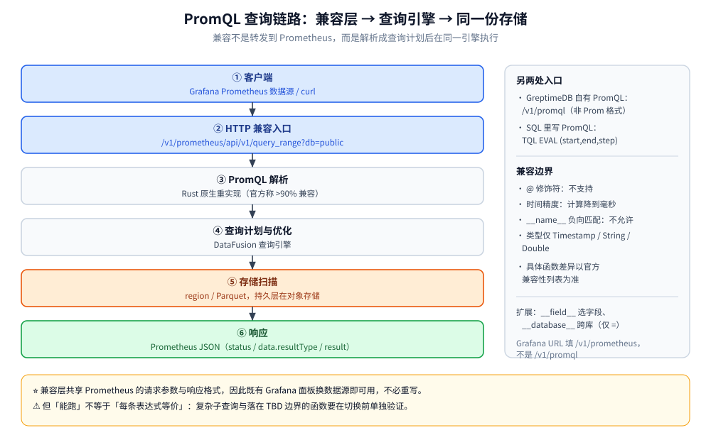

# PromQL兼容查询

> GreptimeDB 用 Rust 原生重实现了 PromQL，并把它暴露成 Prometheus 的 HTTP API：本文讲清兼容层的入口路径、PromQL 与 SQL 的分工与选型、兼容边界，以及 Grafana 用 Prometheus 数据源接入的做法与注意点。
>
> 内容整理自个人学习笔记，并参考官方文档与 Release Notes；素材见 [素材清单](../../../../素材清单.md)。

---

## 一、GreptimeDB 为什么要做 PromQL 兼容？

**本节要点**：理解动机，才知道兼容层的重心在哪——它不是「多支持一种查询语法」，而是「让换存储层这件事对 Grafana 面板和告警零改动」。

### 1.1 兼容层要解决的迁移阻力

换掉监控存储层最大的阻力，往往不是数据怎么搬，而是**仪表盘和告警规则要重写**。GreptimeDB 的官方定位很直白：它支持 PromQL，因此可以作为 **Grafana 里 Prometheus 数据源的即插即用替代**——**原本用 PromQL 写的 dashboard 不用动，把数据源换掉即可继续使用**。

官方给出的迁移表述是：PromQL 服务 DevOps 和**既有 Grafana 面板**，SQL 服务排查、分析与 Agent，Jaeger 兼容 API 服务既有链路工具——三个入口各归其位。

### 1.2 「原生重实现」意味着什么

GreptimeDB 的 PromQL **不是**把请求转发给一个 Prometheus 实例，而是**在 Rust 里重新实现**，对外暴露到几个接口上：Prometheus 的 HTTP API、GreptimeDB 自己的 HTTP API、以及 SQL 接口。官方对覆盖度的表述是**「90% 以上的 PromQL 已支持」**，并附有兼容性列表和跟踪 issue。

⭐ 直白结论：**兼容层是「查询侧的一层翻译」——把 PromQL 解析成查询计划，交给同一个查询引擎在同一个存储上执行**，而不是维护第二份数据。

---

## 二、PromQL 通过哪些接口进来？

**本节要点**：这是最容易写错的一节——GreptimeDB 有两套和 PromQL 相关的 HTTP 路径，用途不同，**别混用**。



### 2.1 Prometheus 兼容 API（`/v1/prometheus/`）

这是给「把 Grafana 数据源指过来」用的路径。官方说明：GreptimeDB 在 HTTP 上下文 `/v1/prometheus/` 下实现了一组**与 Prometheus 兼容的 API**：

| 能力 | 路径 |
| --- | --- |
| 即时查询 Instant query | `/api/v1/query` |
| 范围查询 Range query | `/api/v1/query_range` |
| 序列匹配 Series | `/api/v1/series` |
| 标签名 Label names | `/api/v1/labels` |
| 标签值 Label values | `/api/v1/label/<label_name>/values` |

⭐ 关键是**完整基路径**：数据源的 context root 是 `/v1/prometheus/`，所以实际请求落到 `/v1/prometheus/api/v1/query_range` 这样的地址上。官方给的 Grafana 配置就是在 Prometheus 数据源的 URL 里填：

```text
http://<greptimedb-host>:4000/v1/prometheus/
```

请求与响应的**格式与原版 Prometheus HTTP API 一致**（`status` / `data.resultType` / `data.result` 那套 JSON），因此可以「原地替换」。独有的一点是支持额外的 `db` 查询参数指定库名：

```bash
curl -X POST \
    -H 'Authorization: Basic <base64-encoded-credentials>' \
    --data-urlencode 'query=irate(process_cpu_seconds_total[1h])' \
    --data-urlencode 'start=2024-11-24T00:00:00Z' \
    --data-urlencode 'end=2024-11-25T00:00:00Z' \
    --data-urlencode 'step=1h' \
    'http://localhost:4000/v1/prometheus/api/v1/query_range?db=public'
```

库名除了走 `?db=`，也可以走 HTTP 头 `x-greptime-db-name: <database>`；启用鉴权时需带认证头。除 `db` 外，**查询字符串参数与原版 Prometheus API 完全一致**。

### 2.2 GreptimeDB 原生 PromQL 接口（`/v1/promql`）

GreptimeDB 自己还有一个 `/v1/promql` 端点（GET/POST），用来执行 PromQL 并**返回 GreptimeDB 的 JSON 格式**（不是 Prometheus 的响应格式）。它和 2.1 的区别是：

- `/v1/prometheus/api/v1/*`：**Prometheus 响应格式**，给兼容生态（Grafana Prometheus 数据源）用。
- `/v1/promql`：**GreptimeDB 自己的响应格式**，给自家客户端 / 工具用。

⚠️ 换句话说：**「兼容」指的是前者**。往 Grafana 里填的永远是以 `/v1/prometheus/` 为根的地址，别填成 `/v1/promql`。

### 2.3 SQL 里的 `TQL`：把 PromQL 写进 SQL

GreptimeDB 扩展了 SQL 语法，可以用 `TQL`（Time-series Query Language）关键字在 SQL 里写 PromQL：

```text
TQL [EVAL|EVALUATE] (<START>, <END>, <STEP>) <QUERY>
```

`<START>` / `<END>` / `<STEP>` 可以是无引号数字（`START` / `END` 是 UNIX 时间戳，`STEP` 是秒数），也可以是带引号字符串（RFC3339 时间戳 / 字符串时长）。示例：

```sql
TQL EVAL (1676738180, 1676738780, '10s') sum(some_metric)
```

它**凡是支持 SQL 的地方都能写**——HTTP API、SDK、PostgreSQL / MySQL 客户端都行。⭐ 价值在于：**PromQL 的结果可以当子查询嵌进 SQL**，和跨信号 `JOIN` 组合起来用。

---

## 三、PromQL 与 SQL 怎么分工？

**本节要点**：两者不是替代关系，而是「指标的面板语言」与「全信号的排查语言」的分工。

### 3.1 什么时候用 PromQL

- **既有 Grafana 面板 / 告警规则**：直接沿用，零改动（这正是选它的第一理由）。
- **标准指标聚合**：`rate` / `irate` / `increase` 等计数器函数、`topk` / `histogram_quantile` 等。
- **面向 DevOps 的常规看板**：CPU、内存、QPS、错误率的固定视图。

### 3.2 什么时候用 SQL

- **跨信号分析**：指标 + 日志 + 链路放一条 SQL 里关联（PromQL 做不到）。
- **大跨度分析**：跨长时间范围、跨多张表的聚合分析，SQL 更强。
- **数据库管理**：建表、加索引、设 TTL、看 `information_schema`。
- **接入 BI / 临时分析**：任何能连 MySQL / PostgreSQL 的工具都能查。

### 3.3 分工判据

| 场景 | 选谁 | 理由 |
| --- | --- | --- |
| 既有 Prometheus 面板不改 | **PromQL** | 换数据源即可，`node_cpu_seconds_total{mode="idle"}` 这类表达式原样可用 |
| 新的指标聚合看板 | **PromQL** | 语法短、生态惯例一致 |
| 指标与日志 / 链路关联排查 | **SQL** | PromQL 无法跨信号 `JOIN` |
| 大跨度、多表、复杂分析 | **SQL** | SQL 在跨表关联与长跨分析上更强 |
| 建表 / 改 TTL / 看元数据 | **SQL** | PromQL 只管查 |
| 把 PromQL 嵌入更大的查询 | **`TQL`** | 在 SQL 里跑 PromQL 当子查询 |

⭐ 一句话记：**指标看板走 PromQL，跨信号排障与治理走 SQL**。

---

## 四、兼容边界在哪里？

**本节要点**：兼容不等于等价。官方明确承认存在限制，落地前要把这几条边界看清楚——**核不实的具体功能差异，一律以官方兼容性列表为准**。

### 4.1 类型与精度限制

官方明说：**PromQL 实现只覆盖三种类型**——时间戳（`Timestamp`）、标签（`String`）、值（`Double`）。也就是说，一条 PromQL 表达式能操作的字段，必须是这三类；表里更丰富的类型不会都进 PromQL。

**时间戳精度**：PromQL 受查询语法限制，**只支持到毫秒精度**。GreptimeDB 能存微秒、纳秒，但**用 PromQL 计算时会被隐式降为毫秒**。

### 4.2 语法与函数边界（已核实条目）

| 条目 | 状态 |
| --- | --- |
| 二元运算符（`+ - * / % == != > < >= <= and or unless` 等） | 官方列为**全部支持** |
| 聚合运算（`sum` / `avg` / `min` / `max` / `stddev` / `stdvar` / `topk` / `bottomk` / `count_values` / `count` / `quantile`） | 列为**支持** |
| 范围函数（`rate` / `irate` / `increase` / `delta` / `idelta` / `deriv` / `changes` / `resets` / `*_over_time`） | 列为**支持** |
| `@` 修饰符 | **尚不支持** |
| `__name__` 上的负向匹配（如 `{__name__!="..."}`） | **不允许**（等值与正则匹配可以） |
| 引用不存在的列 | 行为**与 Prometheus / VictoriaMetrics 对齐**：不报错、静默忽略，当作空字符串列 |
| `__name__` 选择器引用不存在的指标 | **会报错**（与上一条不同） |
| 复数 / 多输入类的部分函数 | 官方标注为 **TBD（待定）**，实际以兼容性列表为准 |

⚠️ 对上表的用法：**只把「官方明列支持 / 不支持」的当硬结论；凡官方标 TBD 或只在兼容性列表里逐条列出的，落地时按「部分函数存在差异，以官方兼容性列表为准」处理**，不要凭函数名想当然。

### 4.3 GreptimeDB 对 PromQL 的扩展

除了兼容，GreptimeDB 还给 PromQL 加了自己的能力：

- **指定字段**：一张表可含多个字段，PromQL 默认在**每个字段上**执行；用特殊过滤 `__field__` 指定字段，支持 `=` / `!=` / `=~` / `!~`：

```promql
metric{__field__="field1"}
```

- **跨库查询**：用 `__database__` 匹配指定数据库，**只支持 `=`**：

```promql
metric{__database__="mydatabase"}
```

---

## 五、Grafana 怎么用 Prometheus 数据源接入？

**本节要点**：这是兼容层最典型的使用姿势——**不改 Dashboard，只换数据源地址**。

### 5.1 配置步骤

官方文档给出的步骤（以 Grafana 的 Prometheus 数据源为例）：

1. `Add data source` → 选类型 **Prometheus**。
2. **HTTP → Prometheus server URL** 填 GreptimeDB 的地址：

```text
http://<greptimedb-host>:4000/v1/prometheus
```

3. 若 GreptimeDB 启用了鉴权：在 **Auth** 里勾 **Basic auth**，填用户名 / 密码。
4. 在 **Custom HTTP Headers** 里加一条：

```text
Header: x-greptime-db-name
Value: <你的数据库名，如 public>
```

5. `Save & Test` 测试连通。

⭐ 也可以走 URL 查询参数 `?db=<库名>`，两种方式等价。

### 5.2 为什么 Dashboard 不用改

因为兼容层**共享同一套请求参数与响应格式**（见 2.1）。官方参考架构的说法很直接：把既有面板的数据源切到 GreptimeDB 后，像 `1 - avg(rate(node_cpu_seconds_total{job="node",mode="idle"}[5m]))` 这样的表达式**和社区面板里的一模一样，切换数据源时什么都没变**。

### 5.3 三个注意点

- **地址别填错前缀**：一定是 `/v1/prometheus`（兼容 API），不是 `/v1/promql`（GreptimeDB 自有格式）。
- **`db` 头 / 参数别漏**：多库场景下不指定库名，可能查的是默认库。
- **面板能跑 ≠ 每条表达式都等价**：复杂子查询、用到 `@` 修饰符、或落在官方 TBD 边界的表达式，要在切换前单独验证（见第四节）。

---

## 使用：把现有 Prometheus 面板切到 GreptimeDB

**本节要点**：给一条不需要重写面板的切换路径，以及切换后必须自查的清单。

**数据流**（一次性配置，之后面板照旧）：

```text
Prometheus（或 OTel Collector）--remote write--> GreptimeDB:4000/v1/prometheus/write
                                                          |
Grafana --Prometheus 数据源--> http://greptimedb:4000/v1/prometheus
```

**第一步：写入侧接上**（Prometheus 的 `prometheus.yml`，示例来自官方文档）：

```yaml
remote_write:
  - url: http://localhost:4000/v1/prometheus/write?db=public
```

**第二步：查询侧接上**（Grafana 数据源 URL，见 5.1）：

```text
http://localhost:4000/v1/prometheus
```

**第三步：用 HTTP 直接验证 PromQL 能跑**：

```bash
curl -X POST \
    --data-urlencode 'query=irate(process_cpu_seconds_total[1h])' \
    --data-urlencode 'start=2024-11-24T00:00:00Z' \
    --data-urlencode 'end=2024-11-25T00:00:00Z' \
    --data-urlencode 'step=1h' \
    'http://localhost:4000/v1/prometheus/api/v1/query_range?db=public'
```

**切换后自查清单**：

- 面板里的表达式是否用了 `@` 修饰符或对 `__name__` 做负向匹配（这两类已知不支持）。
- 是否依赖亚毫秒精度（PromQL 计算会降到毫秒）。
- 引用的指标是否存在（`__name__` 引用不存在的指标会报错，而非静默忽略）。
- 复杂子查询的返回值是否与切换前一致。

⚠️ 上面的**路径、参数与配置来自官方文档**；切换后的**查询结果请按你自己的数据核对**。

---

## 延伸追问

- **`/v1/prometheus/api/v1/query` 和 `/v1/promql` 有什么区别？** → 前者是 **Prometheus 兼容 API**，返回 Prometheus 那套 JSON，给 Grafana 等兼容生态用；后者是 GreptimeDB **自己的 PromQL 端点**，返回 GreptimeDB 的 JSON 格式。接 Grafana 用前者。
- **兼容率到底是多少？** → 官方表述是**「90% 以上的 PromQL 已支持」**，并维护一份兼容性列表与跟踪 issue。⚠️ 具体到某个函数是否支持，**以官方兼容性列表为准**，别用「90%」这个数字去推断某个具体表达式一定可用。
- **`@` 修饰符为什么用不了？** → 官方明确列为**尚不支持**。如果你的面板依赖 `@`（比如对齐到某个固定时刻），需要在切换前改写表达式或改用 SQL。
- **为什么 PromQL 只能算到毫秒？** → 受 PromQL 查询语法本身的限制，**表达式里能表达的时间精度只到毫秒**；GreptimeDB 存储能到微秒 / 纳秒，但**用 PromQL 计算时会隐式转成毫秒**。要高精度就用 SQL。
- **查不到的列会报错吗？** → 分两种：**普通列**不存在时与 Prometheus / VictoriaMetrics 行为一致——不报错、静默忽略、当空字符串列处理；但**`__name__`（指标名）引用不存在的指标会报错**。两者不一样，别混。
- **PromQL 和 SQL 能不能混着用？** → 能。用 `TQL EVAL (start, end, step) <query>` 把 PromQL 写进 SQL，可当作子查询与跨信号 `JOIN` 组合（见 [SQL查询与跨信号关联.md](SQL查询与跨信号关联.md) 第四节）。
- **GreptimeDB 在 PromQL 之外给了什么扩展？** → 两个匹配器：`__field__` 用来在含多字段的表里指定字段，`__database__` 用来跨库查询（后者只支持 `=`）。

---

## 关联

- [SQL查询与跨信号关联.md](SQL查询与跨信号关联.md) — 另一个查询入口：SQL 的时序扩展与跨信号 `JOIN`
- [数据模型与写入路径.md](数据模型与写入路径.md) — PromQL 能操作的 Timestamp / String / Double 三类型，根源在这里
- [索引设计与查询优化.md](索引设计与查询优化.md) — PromQL 落到存储后走什么索引
- [可观测性集成方案.md](可观测性集成方案.md) — Grafana 多数据源、OTel Collector、与 Prometheus 的替代关系
- [写入协议与数据接入.md](写入协议与数据接入.md) — Prometheus remote write 写进来的数据长什么样（`greptime_value` / `greptime_timestamp`）
- [Flow流计算引擎.md](Flow流计算引擎.md) — 用 Flow 把常用聚合物化，减少面板侧的重复计算
- [../VictoriaMetrics/MetricsQL查询.md](../VictoriaMetrics/MetricsQL查询.md) — 另一个兼容 PromQL 的时序库，可对照两者的兼容策略
- [可观测性选型对比.md](../../../中间件/可观测性/可观测性选型对比.md) — 指标监控层面的选型对比（本篇不重复）
> 反向引用（本篇被下列文档引到）：[选型对比与落地案例.md](选型对比与落地案例.md)
