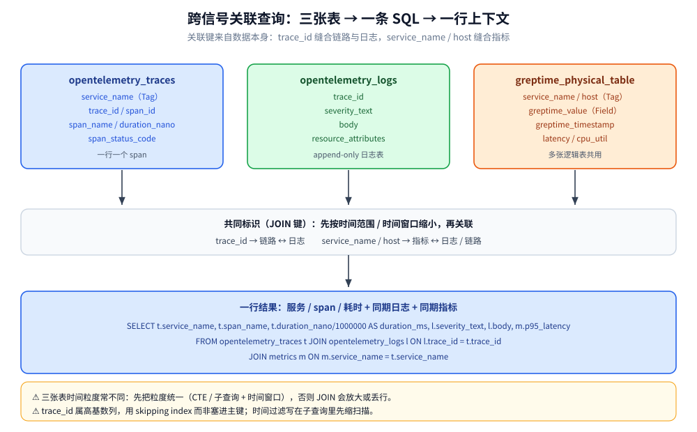

# SQL查询与跨信号关联

> GreptimeDB 用一套 SQL 同时查询指标、日志与链路：本篇讲清它的时序扩展（`TIME INDEX` / `RANGE` / `ALIGN` / `FILL` / `date_bin`），以及三类信号放进同一套表模型后，怎么用 `JOIN` 把「指标异常」和「对应时段的日志 / Trace」关联起来。
>
> 内容整理自个人学习笔记，并参考官方文档与 Release Notes；素材见 [素材清单](../../../../素材清单.md)。

---

## 一、GreptimeDB 的 SQL 为什么不是「又一个 MySQL」？

**本节要点**：先认清它建在什么数据模型上——SQL 只是查询语言，底下的表模型才是它与普通关系库的分界点。

### 1.1 一套列语义：Tag / Timestamp / Field

GreptimeDB 把数据组织成表，但每张表的列被分成三种角色，这是它全部时序能力的根基：

| 列角色 | 建表时怎么写 | 含义 | 对应 Prometheus 概念 |
| --- | --- | --- | --- |
| **Timestamp** | `TIME INDEX` | 时间戳列，**每张表有且只有一个** | 样本时间戳 |
| **Tag** | `PRIMARY KEY` | 维度列，决定时间线 | label |
| **Field** | 其余列 | 真正的数值 / 字符串载荷 | sample value |

⭐ 关键点：`PRIMARY KEY` 不是传统关系库意义的主键。官方明确说明——**`PRIMARY KEY` + `TIME INDEX` 合起来才是一条行的唯一标识**，真正的主键是「Tag 列 + 时间戳」的组合；`PRIMARY KEY` 不能包含时间索引列，但系统会**隐式把时间索引列追加到键的末尾**。

### 1.2 `CREATE TABLE` 的时序语义

建表语法在普通 SQL 的基础上加了 `TIME INDEX` / `PRIMARY KEY` 约束与 `WITH` 表选项：

```sql
CREATE TABLE IF NOT EXISTS system_metrics (
  host STRING,
  cpu_util DOUBLE,
  memory_util DOUBLE,
  disk_util DOUBLE,
  ts TIMESTAMP DEFAULT CURRENT_TIMESTAMP,
  PRIMARY KEY(host),
  TIME INDEX(ts)
);
```

带表选项的写法（`ttl` 与 `append_mode` 是排查场景里最常调整的两个）：

```sql
CREATE TABLE IF NOT EXISTS application_logs (
  ts TIMESTAMP TIME INDEX,
  attrs JSON2
) WITH (
  'append_mode' = 'true'
);
```

常用表选项（据官方 CREATE 参考）：

- `ttl`：数据存活时间，取值形如 `'7d'` / `'60m'` / `'1h'`，支持 `s` / `m` / `h` / `d`。
- `append_mode`：默认 `'false'`，会按「主键 + 时间戳」去重；设为 `'true'` 得到只追加、保留重复行的表（日志类常见）。
- `merge_mode`：仅在 `append_mode='false'` 时生效，默认 `last_row`（同键同时间戳保留最后一行），可设 `last_non_null`（保留每个字段最后非空值）。
- `storage` / `compaction.*` / `skip_wal` / `index.type` 等：分别控制存储后端、compaction 策略、是否走 WAL、Metric Engine 的索引类型。

⚠️ **时间索引列创建后不能更改**，建表前要选对；且**自动建表**（写入时推断 schema）只有 SQL / Flink / Spark 三条路径不支持，其余协议都支持。

---

## 二、时间窗口聚合怎么表达？RANGE / ALIGN / FILL

**本节要点**：这是 GreptimeDB 相对普通 SQL 最独特的一段语法——它把 PromQL 的「范围查询」语义做进了 SQL。普通 SQL 用 `GROUP BY` 做的是离散分桶，无法表达「每个时刻回看前 10 秒」。

### 2.1 Range Query：`RANGE` 定义回看窗口，`ALIGN` 定义步长

官方示例（监视器表，求 10 秒范围内的平均 CPU，每 5 秒算一次）：

```sql
SELECT
    ts,
    host,
    avg(cpu) RANGE '10s' FILL LINEAR
FROM monitor
ALIGN '5s' TO '2023-12-01T00:00:00' BY (host)
ORDER BY ts ASC;
```

四条语义要拆开看：

- `avg(cpu) RANGE '10s'` 是**范围表达式**：聚合的时间范围是 10 秒，不是单个点。
- `ALIGN '5s'` 是**查询分辨率步长**：每 5 秒算一次。
- `TO '2023-12-01T00:00:00'` 是**起始对齐时间**，**默认是 Unix 时间 0**；也可写 `TO NOW`。
- `BY (host)` 是**聚合键**；**省略 `BY` 时默认用表的主键列**做聚合键。

⭐ 时间窗口是**左闭右开**区间，即 `[alignment timestamp, alignment timestamp + range)`；`RANGE` 与对齐时间共同确定「原点窗口」，`ALIGN` 决定从原点窗口向前向后推进的步长。

⚠️ **`ORDER BY` 不能省**：官方明确「返回数据的顺序不做保证」，时序场景要自己按时间索引排序；省略排序则结果顺序不确定。

### 2.2 `FILL` 的插值语义

窗口内没有数据时，`FILL` 决定怎么补：

| FILL 取值 | 语义 |
| --- | --- |
| `LINEAR` | 按线性插值补空值 |
| `PREV` | 用前一个有效值填充 |
| 常量值 `X` | 用一个固定常量填充 |

官方文档列出的就是这三类（`LINEAR`、`PREV`、常量）。⚠️ 不写 `FILL` 时窗口内无数据就是空值，不会自动补；**先想清楚「空值该被补还是该被暴露」**，这是仪表盘上「曲线断没断」的直接原因。

### 2.3 `date_bin`：离散分桶，配合普通 `GROUP BY`

如果只需要普通的时间分桶（不需要回看窗口），用 `date_bin` 更直观。它的签名是：

```text
date_bin(interval, expression, origin-timestamp)
```

- `interval`：分桶宽度，支持纳秒 / 微秒 / 毫秒 / 秒 / 分 / 时 / 日 / 周 / 月 / 年 / 世纪。
- `expression`：要运算的时间表达式（常量、列或函数）。
- `origin-timestamp`：可选的桶边界起点，**不指定时默认 `1970-01-01T00:00:00Z`（UTC 的 Unix 纪元）**。

官方给出的例子：把时间戳按 1 天分桶，`2023-01-01T18:18:18Z` 会落到它所在 15 分钟桶的起点 `2023-01-01T18:15:00Z`。

```sql
SELECT date_bin('10 seconds'::INTERVAL, ts) AS time_window,
       max(temperature) AS max_temp
FROM temp_sensor_data
GROUP BY time_window;
```

⭐ **`RANGE` 与 `date_bin` 的选择**：要「每个时刻回看一段窗口」（如滚动 5 分钟 P95）→ `RANGE`；只要「把时间切成互不重叠的桶再聚合」→ `date_bin` + `GROUP BY`。InfluxQL 的 `GROUP BY time(10m)` 迁移过来时，官方建议两种写法都可，`RANGE` 风格更接近原语义。

---

## 三、时间过滤、精度与取最新点怎么写？

**本节要点**：时序查询最容易出错的不是聚合，而是「时间戳精度对不上」和「结果顺序不保证」这两件小事。

### 3.1 按时间索引过滤，注意精度

当列是 `TimestampMillisecond` 时，可以直接用同精度的 Unix 值：

```sql
SELECT * FROM monitor WHERE ts > 1667446797000;
```

精度不一致时必须显式转型，否则比较的是错误的时间点：

```sql
SELECT * FROM monitor WHERE ts > 1667446797::TimestampSecond;
```

标准 `RFC3339` / `ISO8601` 字符串可直接用（精度明确），函数也能进条件：

```sql
SELECT * FROM monitor WHERE ts >= now() - '5 minutes'::INTERVAL;
```

### 3.2 `ORDER BY` / `LIMIT` 与「每个分组的最后一点」

`ORDER BY ts ASC/DESC` 配合 `LIMIT` 是最常见的「最近 N 条」写法；想要**每个维度各取最新一点**，官方给的是 `DISTINCT ON` + `ORDER BY`：

```sql
SELECT DISTINCT ON (host) * FROM monitor ORDER BY host, ts DESC;
```

⚠️ 从 InfluxQL 迁移时，`ORDER BY time DESC LIMIT 1` 这类「分组最新点」语义，官方建议改写成 `row_number() OVER (...)` 或上述 `DISTINCT ON`，把「每个分组取一条」表达清楚，而不是靠隐式行为。

---

## 四、跨信号关联：一条 SQL 串起指标、日志、链路

**本节要点**：这是「统一存储」最实在的卖点——三类信号各建各的表，但共用一套列语义和同一批共同标识（`trace_id` / `service_name` / `host`），于是一条 SQL 的 `JOIN` 就能把「指标异常」和「对应时段日志 / Trace」拼在一起。

### 4.1 三信号共用同一套标识

- **Trace**：OTLP 写入 `opentelemetry_traces`，一行一个 span；`service_name` 是 Tag，span 属性会被自动展平成列。
- **Log**：OTLP 写入 `opentelemetry_logs`，同样带 `trace_id`。
- **Metrics**：Prometheus remote write 自动建逻辑表，共用一个物理表。

⭐ **跨信号关联成立的前提，是三类信号里存在同一批共同标识**：`trace_id` 把链路和日志缝在一起，`service_name` / `host` / `pod` 把指标和它们缝在一起。**埋点时不写这些字段，SQL 再强也关联不起来**（这一点在 [可观测性集成方案.md](可观测性集成方案.md) 还会展开）。



### 4.2 链路 ↔ 日志：按 `trace_id` JOIN

官方给出的「一次查出某条失败链路及其日志上下文」示例：

```sql
SELECT t.service_name,
       t.span_name,
       t.duration_nano / 1000000 AS duration_ms,
       l.timestamp AS log_time,
       l.severity_text,
       l.body
FROM opentelemetry_traces t
JOIN opentelemetry_logs l ON l.trace_id = t.trace_id
WHERE t.timestamp > now() - INTERVAL '1' HOUR
  AND t.span_status_code = 'STATUS_CODE_ERROR'
ORDER BY t.duration_nano DESC
LIMIT 20;
```

这段 SQL 的读法是：**先捞最近的失败 span（按耗时倒排），再把同 `trace_id` 的日志行拼回来**——不用在 Grafana 里切 Loki、抄 traceID、再切 Tempo。

### 4.3 指标 ↔ 日志：CTE + `LEFT JOIN`

指标表和日志表时间粒度不同，官方博客给的做法是**两侧各自先按同一时间窗口聚合，再对齐时间戳做 `LEFT JOIN`**：

```sql
WITH metrics AS (
    SELECT ts, host,
           approx_percentile_cont(latency, 0.95) RANGE '5s' AS p95_latency
    FROM app_metrics
    ALIGN '5s' FILL PREV
),
logs AS (
    SELECT ts, host,
           first_value(error) RANGE '5s' AS first_error,
           last_value(error)  RANGE '5s' AS last_error,
           count(error)       RANGE '5s' AS num_errors
    FROM app_logs
    WHERE matches(path, 'api/v1')
    ALIGN '5s'
)
SELECT metrics.ts, p95_latency,
       coalesce(num_errors, 0) AS num_errors,
       logs.first_error, logs.last_error, metrics.host
FROM metrics
LEFT JOIN logs
  ON metrics.host = logs.host AND metrics.ts = logs.ts
ORDER BY metrics.ts;
```

⭐ 这段查询把「指标异常时段」与「同期错误日志」**逐窗口并排放在一行**：`LEFT JOIN` 保证指标侧不丢点，`coalesce` 把无日志的窗口补成 0。这就是「指标发现异常、日志给出根因」在一条 SQL 里完成的形态。

### 4.4 跨信号关联的四条注意

- **粒度对齐**：三张表的时间粒度往往不同（指标 5s、日志无固定粒度、Trace 是每请求一条），`JOIN` **必须先在子查询 / CTE 里把粒度统一**，否则会放大或丢行。
- **`JOIN` 键要有索引价值**：`trace_id` 是高基数列，官方建议**用 skipping index 而不是塞进主键**——高基数主键会让主键变长、拖慢插入、增大内存。
- **时间范围先缩再 JOIN**：`WHERE` 里的时间过滤要写在**子查询里**，让扫描先被时间索引裁掉，再参与关联。
- **两类信号的表要分开**：官方参考架构明确「按信号分表」，**统一发生在引擎 / 存储 / 查询层，不要求三信号共用一张表或一套 schema**——指标用主键列存 label 并走 PromQL，日志用 append-only 表加索引，链路保留 trace / span 标识。

---

## 使用：时间窗口聚合与跨信号排障查询

**本节要点**：把上面两套语法拼成两个能直接抄的查询——一个做指标侧时间窗口聚合，一个做指标↔日志跨信号排障。

场景设定（表结构按官方文档的写法，落地请按自己的 schema 调整）：

```sql
-- 指标表：host 为 Tag，latency 为 Field（单位 ms）
CREATE TABLE app_metrics (
  ts TIMESTAMP TIME INDEX,
  host STRING,
  latency DOUBLE,
  PRIMARY KEY(host)
);

-- 日志表：append-only，保留 trace_id 便于关联
CREATE TABLE app_logs (
  ts TIMESTAMP TIME INDEX,
  host STRING,
  trace_id STRING,
  path STRING,
  error STRING
) WITH ('append_mode' = 'true');
```

查询一：按 5 秒窗口滚动计算 P95 延迟（`RANGE` 回看 5 秒、步长 5 秒，缺数据用前值填充）：

```sql
SELECT ts, host,
       approx_percentile_cont(latency, 0.95) RANGE '5s' AS p95_latency
FROM app_metrics
ALIGN '5s' FILL PREV
ORDER BY ts ASC;
```

查询二：把「最近 15 分钟错误日志」和「同期同主机 P95 延迟」并排（粒度统一到 5 秒窗口后 `LEFT JOIN`）：

```sql
WITH m AS (
    SELECT ts, host,
           approx_percentile_cont(latency, 0.95) RANGE '5s' AS p95
    FROM app_metrics
    WHERE ts > now() - INTERVAL 15 MINUTE
    ALIGN '5s' FILL PREV
),
l AS (
    SELECT ts, host,
           count(error) RANGE '5s' AS errors,
           last_value(error) RANGE '5s' AS last_error
    FROM app_logs
    WHERE ts > now() - INTERVAL 15 MINUTE
    ALIGN '5s'
)
SELECT m.ts, m.host, p95, coalesce(errors, 0) AS errors, last_error
FROM m LEFT JOIN l ON m.host = l.host AND m.ts = l.ts
ORDER BY m.ts DESC;
```

⚠️ 两个提醒：① `RANGE` 表达式所在的 `SELECT` 里**一定要配 `ALIGN` 和 `ORDER BY`**，否则窗口起点和结果顺序都不可控；② 上面两条 SQL 的**语法来自官方文档**；**具体表结构与聚合结果请按自己的 schema 验证**。

---

## 延伸追问

- **`RANGE` 和 `date_bin` 到底该用哪个？** → 要「每个时刻回看一段滑动窗口」用 `RANGE`（它表达的是 PromQL 式 range query，窗口可重叠）；只要「把时间切成互不重叠的桶」用 `date_bin(...)` 再 `GROUP BY`，语义更直白、更容易和关系库心智对齐。
- **`RANGE` 的窗口默认从哪个时间点开始？** → 从**对齐时间**开始；`ALIGN` 的 `TO` 默认是 **Unix 时间 0**，所以不显式写 `TO` 时，所有窗口都锚在纪元点上对齐，而不是锚在「当前时间」。要按业务时间对齐就写 `TO '...'` 或 `TO NOW`。
- **`FILL` 不写会怎样？** → 窗口内没有数据点就是空值，不会被自动补；这决定了图表曲线是断开还是延续，先想清楚「空值该暴露还是该补」再决定 `FILL` 的取值。
- **`JOIN` 三张表会不会很慢？** → 取决于两点：**时间范围有没有先缩**（让时间索引先把扫描裁掉）、**`JOIN` 键有没有可用索引**（`trace_id` 这类高基数列要用 skipping index，别硬塞主键）。官方推荐「按信号分表、按体量分区」正是为此。
- **`DISTINCT ON` 和 `row_number()` 该选谁？** → 两者都能表达「每个分组取最新一点」。从 InfluxQL 的 `ORDER BY time DESC LIMIT 1` 迁过来时，官方建议改成显式的 `row_number() OVER (...)` 或 `DISTINCT ON`——把「按谁分组、按什么排序、取几条」写明白，别依赖隐式行为。
- **自动建表会不会把时间列建错？** → 会。自动建表只覆盖非 SQL / Flink / Spark 的写入协议，schema 由写入数据推断；**要精确控制时间索引列与 Tag 列，就显式 `CREATE TABLE`**，别指望推断出的时间列精度和主键正好合适。
- **跨信号关联为什么非要提前在埋点里带标识？** → 因为 `JOIN` 的键只能来自数据本身。日志不带 `trace_id`、指标不带 `service_name`，关联就无从谈起——统一存储降低了「跨库搬数据」的成本，但**关联键必须在采集端就写进去**。

---

## 关联

- [数据模型与写入路径.md](数据模型与写入路径.md) — Tag / Timestamp / Field 三列语义与建表推断的完整展开
- [架构与存储引擎.md](架构与存储引擎.md) — 这套表模型底下是什么存储引擎（LSM + 列存）
- [索引设计与查询优化.md](索引设计与查询优化.md) — `JOIN` 键为什么该用 skipping index、倒排 / 全文索引各适合什么列
- [PromQL兼容查询.md](PromQL兼容查询.md) — 同一套存储的另一个查询入口：PromQL 与 SQL 的分工
- [Flow流计算引擎.md](Flow流计算引擎.md) — 把上面的窗口聚合做成持续物化（`date_bin` 窗口 + `CREATE FLOW`）
- [可观测性集成方案.md](可观测性集成方案.md) — 三信号如何用同一套标识缝在一起、Grafana 与 Jaeger 怎么接
- [写入协议与数据接入.md](写入协议与数据接入.md) — OTLP / remote write 各自的表结构与列名，决定 `JOIN` 键从哪来
- [../../数据库选型对比.md](../../数据库选型对比.md) — 时序库在七类存储里的定位与选型判据
- [可观测性选型对比.md](../../../中间件/可观测性/可观测性选型对比.md) — 可观测性栈层面的选型对比（本篇不重复）
> 反向引用（本篇被下列文档引到）：[选型对比与落地案例.md](选型对比与落地案例.md)
