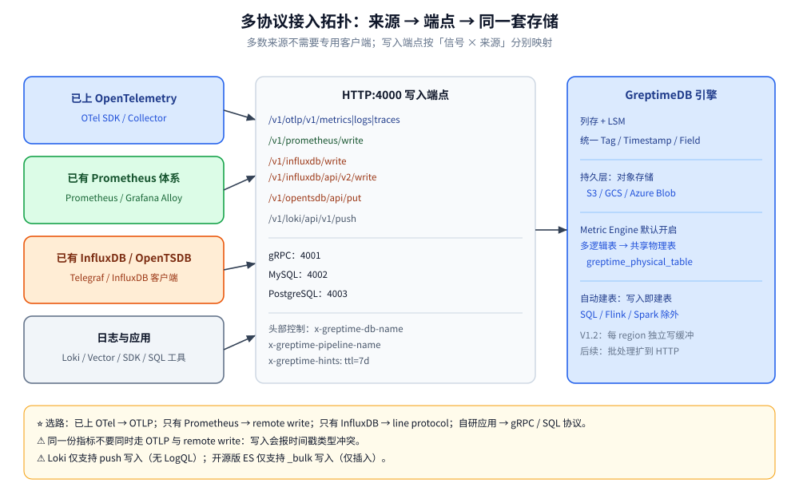

# 写入协议与数据接入

> GreptimeDB 支持一批成熟的写入协议，多数数据源不需要专用客户端即可接入：本篇按「已有 Prometheus 体系 / 已有 InfluxDB 采集 / 已上 OTel」三类来源讲清各自该走哪条路径、端点在哪、怎么写，以及写入侧容易踩的坑。
>
> 内容整理自个人学习笔记，并参考官方文档与 Release Notes；素材见 [素材清单](../../../../素材清单.md)。

---

## 一、GreptimeDB 支持哪些写入协议？

**本节要点**：先建立「来源 → 协议 → 端点」的总图，再按自己已有的采集体系对号入座。

### 1.1 按信号分三类入口

GreptimeDB 的官方表述是：数据通过**成熟的可观测性与数据库协议**写入，多数数据源不需要专门的客户端。按数据来源归类：

| 数据来源 | 写法 | 覆盖信号 |
| --- | --- | --- |
| OpenTelemetry SDK / Collector | OTLP（HTTP） | metrics / logs / traces 三类 |
| Prometheus（或 Alloy / remote write 兼容端） | Prometheus Remote Write | metrics |
| Loki 客户端 | Loki Push API | logs |
| Elasticsearch 客户端 | Bulk API | 文档 / 日志 |
| Telegraf 或 InfluxDB 客户端 | InfluxDB line protocol | metrics（IoT 常见） |
| OpenTSDB 客户端 | `/v1/opentsdb/api/put` | metrics |
| Vector / Fluent Bit / Splunk | 各自的 sink / HEC | logs（Fluent Bit 三类都行） |
| Kafka 主题 | 经 Vector 中转 | 视 sink 而定 |
| 自有应用 | gRPC SDK / MySQL / PostgreSQL 协议 | 通用 |
| 现有 SQL 工具链 | MySQL 或 PostgreSQL 协议 | 通用 |

⭐ 一句话选路：**已上 OTel → 走 OTLP；只有 Prometheus 体系 → 走 remote write；只有 InfluxDB 采集 → 走 line protocol；自研应用 → 走 gRPC SDK 或 SQL 协议。**



### 1.2 各类协议对应的 HTTP 端点

官方 HTTP Endpoint List 列出的写入端点（HTTP 服务默认端口 `4000`）：

| 协议 | 端点 | 方法 |
| --- | --- | --- |
| InfluxDB 行协议（v1） | `/v1/influxdb/write` | POST |
| InfluxDB 行协议（v2） | `/v1/influxdb/api/v2/write` | POST |
| InfluxDB 健康检查 | `/v1/influxdb/ping`、`/v1/influxdb/health` | GET |
| Prometheus Remote Write / Read | `/v1/prometheus/write`、`/v1/prometheus/read` | POST |
| OpenTelemetry（OTLP） | `/v1/otlp/v1/metrics`、`/v1/otlp/v1/traces`、`/v1/otlp/v1/logs` | POST |
| Loki 兼容 | `/v1/loki/api/v1/push` | POST |
| OpenTSDB | `/v1/opentsdb/api/put` | POST |
| 日志摄入 / Pipeline | `/v1/ingest`、`/v1/pipelines/{pipeline_name}` | POST |

### 1.3 默认端口与连接方式

Standalone 启动时的默认端口（据官方配置文档）：

```text
4000  HTTP（SQL / PromQL / OTLP / 各协议写入 + 内置 Dashboard）
4001  gRPC（SDK 与集群内部）
4002  MySQL 协议
4003  PostgreSQL 协议
```

⭐ 也就是说，**绝大多数写入走的是 4000 这一个 HTTP 端口**，只是路径不同；自研应用想用强类型 SDK 就走 gRPC `4001`，SQL 工具链走 `4002` / `4003`。

---

## 二、指标类协议怎么选？

**本节要点**：三条指标写入路径的能力差别集中在「能否保留原生标签语义」「查询侧是否更顺」。

### 2.1 Prometheus Remote Write：已经有 Prometheus 体系的首选

**适合谁**：已经在用 Prometheus / Grafana Alloy 抓取指标、想加长期存储的团队。

官方推荐理由很直接：**remote write 写进来的数据更贴近 PromQL 查询、且 Prometheus Scraper 本身就是典型数据源，省去格式转换**。配置写在 `prometheus.yml`：

```yaml
remote_write:
  - url: http://localhost:4000/v1/prometheus/write?db=public
```

**数据模型映射**（官方表格）：一条 Prometheus 样本写进来后——

- 指标名 → **表名**（自动创建）
- 每个 label → 一个 **Tag 列**
- 样本值 → **`greptime_value`** 列（`Double`）
- 时间戳 → **`greptime_timestamp`** 列（`Timestamp`）

⚠️ Prometheus remote write 会**自动创建大量小表**（逻辑表），官方用 **Metric Engine** 把它们存进**同一个物理表**（默认 `greptime_physical_table`），以减少存储开销、提升列存压缩率；Metric Engine **默认开启**（`[prom_store] with_metric_engine = true`）。也可以在 URL 里用 `physical_table=` 指定物理表。

### 2.2 InfluxDB 行协议：已经有 InfluxDB / Telegraf 采集的走这条

**适合谁**：IoT、用 Telegraf 或 InfluxDB 客户端采集的团队。官方迁移指南给出的思路是「把 InfluxDB 的写入端点指向 GreptimeDB」，采集端几乎不用改。

v1 与 v2 两个端点并存：

```bash
curl -i -XPOST "http://localhost:4000/v1/influxdb/write?db=public&precision=ms" \
  --data-binary \
  'monitor,host=127.0.0.1 cpu=0.1,memory=0.4 1667446797450
monitor,host=127.0.0.2 cpu=0.2,memory=0.3 1667446798450
monitor,host=127.0.0.1 cpu=0.5,memory=0.2 1667446798450'
```

```bash
curl -i -XPOST "http://localhost:4000/v1/influxdb/api/v2/write?bucket=public&precision=ms" \
  -H "authorization: token <username:password>" \
  --data-binary \
  'monitor,host=127.0.0.1 cpu=0.1,memory=0.4 1667446797450'
```

要点（据官方文档）：

- `db`（v1 标准参数）指定库，默认 `public`；v2 推荐用 `bucket`，也接受 `db` 作为兼容别名。
- `precision` 支持 `ns` / `us` / `ms` / `s`，**默认 `ns`**；该 API 写入的时间戳类型是 `TimestampNanosecond`，**精度写错会得到错误的时间点**。
- 可以省略时间戳，系统会用宿主机当前 UTC 时间。
- 可用 HTTP 头给自动建表加选项，例如 `x-greptime-hint-append_mode: true`。
- **自动建表的默认去重策略**：未加 `append_mode` 提示时，用 `merge_mode` 提示；都没有则用配置项 `influxdb.default_merge_mode`，**默认 `last_non_null`**（与 InfluxDB 的更新语义对齐）。

### 2.3 OpenTSDB：老采集端的最小改动路径

**适合谁**：存量 OpenTSDB 采集器不想换的团队。端点就是一个：

```text
POST http://localhost:4000/v1/opentsdb/api/put
```

它接收 OpenTSDB 的 JSON 格式时序数据。⭐ 选它的理由通常只有一个——**采集端已经存在、不想动**；新项目没有理由优先选这条。

---

## 三、OTLP：三信号统一入口怎么接？

**本节要点**：已上 OpenTelemetry 的团队一条路解决三类信号，是 GreptimeDB 最推荐的方式。

### 3.1 OTLP 端点与请求头

OTLP/HTTP 的三个端点：

```text
POST /v1/otlp/v1/metrics
POST /v1/otlp/v1/traces
POST /v1/otlp/v1/logs
```

官方给的连接信息是：**URL 为 `<host>:4000/v1/otlp`，协议 HTTP/protobuf，需带 `X-Greptime-DB-Name` 头**。OTel Collector 的 OTLP exporter 会在 base endpoint 后自动追加 `/v1/{signal}`。

⭐ GreptimeDB 用**请求头**区分信号的处理方式，常见的有：

| 请求头 | 作用 |
| --- | --- |
| `x-greptime-db-name` | 指定写入的数据库 |
| `x-greptime-pipeline-name` | 指定处理链（traces 默认用 `greptime_trace_v1`） |
| `x-greptime-log-table-name` | logs 指定写入哪张日志表 |
| `x-greptime-pipeline-params` | 传给 pipeline 的参数 |
| `x-greptime-hints` | 建表提示，如 `ttl=7d` |

### 3.2 OTel Collector 配置

官方示例（**traces / logs / metrics 各配一个 exporter**）：

```yaml
extensions:
  basicauth/client:
    client_auth:
      username:
      password:
receivers:
  otlp:
    protocols:
      grpc:
        endpoint: 0.0.0.0:4317
      http:
        endpoint: 0.0.0.0:4318
exporters:
  otlp_http/traces:
    endpoint: 'http://127.0.0.1:4000/v1/otlp'
    headers:
      x-greptime-pipeline-name: 'greptime_trace_v1'
    tls:
      insecure: true
  otlp_http/logs:
    endpoint: 'http://127.0.0.1:4000/v1/otlp'
    tls:
      insecure: true
  otlp_http/metrics:
    endpoint: 'http://127.0.0.1:4000/v1/otlp'
    tls:
      insecure: true
service:
  pipelines:
    traces:
      receivers: [otlp]
      exporters: [otlp_http/traces]
    logs:
      receivers: [otlp]
      exporters: [otlp_http/logs]
    metrics:
      receivers: [otlp]
      exporters: [otlp_http/metrics]
```

⚠️ **三个 exporter 要分开配**——官方明确原因：GreptimeDB 用请求头区分三类信号的处理方式（traces 的 pipeline、logs 的表名和 pipeline），**合在一个 exporter 里没法分别设置**；分开也顺带做了数据隔离。若启用了鉴权，用 `basicauth/client` 扩展处理 Basic Auth。

⭐ **同一个指标建议只走一条路**：官方参考架构指出，**同一个 Prometheus 格式指标既走 OTLP 又走 remote write，会在写入时报时间戳类型冲突**——别双写同一份指标。

---

## 四、另外几条接入路径

**本节要点**：非指标、非 OTel 的场景，看这几条就够了。

- **gRPC SDK**：自有应用想走强类型 SDK、拿更好的写入吞吐，用 `4001` 端口的 gRPC 协议，官方提供 Go / Java / Erlang 等 SDK。
- **MySQL / PostgreSQL 协议**：`4002` / `4003`。任何能连 MySQL / PG 的工具都能写入（也能查询），适合现有 SQL 工具链。
- **Loki Push API**：`/v1/loki/api/v1/push`，给已有 Promtail / Alloy / Loki 客户端的团队。⚠️ 官方明确：**Loki 只支持 push 写入，不支持 LogQL 查询**。
- **Elasticsearch Bulk API**：给已有 ES 客户端 / 采集器的团队。⚠️ 开源版覆盖的是 **`_bulk` 写入**（只接受插入），**Query DSL 不在开源版范围内**。
- **Vector / Fluent Bit / Kafka / Splunk**：Vector 有 `greptimedb_metrics` / `greptimedb_logs` sink；Fluent Bit 日志走 HTTP output、三类信号走 OTel output；Kafka 主题经 Vector 中转；Splunk 采集端可走 HEC。
- **Flink / Spark**：分别通过 Flink SQL / Table API / DataStream API 与 Spark 的 DataFrame / Structured Streaming 接入。

⚠️ **自动建表**：官方明确「**除 SQL、Apache Flink、Apache Spark 外，所有协议与集成都支持自动建表**」——也就是说，走这三条路径要自己先建好表。

---

## 五、写入侧要注意什么？

**本节要点**：写入本身不难，难的是精度、命名与 schema 这三件事，它们的错误往往在查询阶段才暴露。

### 5.1 时间戳精度

- InfluxDB 行协议默认精度是 **纳秒**（写入类型为 `TimestampNanosecond`），请求体里用其它精度必须显式给 `precision`。
- OTLP / remote write 的精度由发送端决定；**PromQL 查询侧只算到毫秒**，所以要高精度时间戳的场景，查询要走 SQL。
- 省略时间戳时，InfluxDB 行协议会用**宿主机当前 UTC 时间**。

⭐ 经验：**时间戳精度「写入端指定、查询端受限」这两件事要同时记住**——写进去的纳秒在 PromQL 里会被降精度。

### 5.2 Label / Tag 命名冲突

不同协议的「维度」概念映射到同一套 Tag 语义，命名冲突会直接造成数据错乱：

- Prometheus：label → Tag 列；指标名 → 表名。
- InfluxDB line protocol：`measurement,tag=value field=value ts` 中的 tag → Tag 列；field → Field 列。
- OTLP：resource attributes 与 span attributes 会被展平成列（如 `resource_attributes.service.namespace`）。

⚠️ 同一个字段用不同协议写、或同一张表里多个来源共用列名时，**先确认列语义一致**再混写；否则会出现「同一个列名既是 Tag 又是 Field」这类无法合并的冲突（官方参考架构里那个「同一指标双写导致时间戳类型冲突」就是同源问题）。

### 5.3 自动建表与显式建表的取舍

| 做法 | 优点 | 代价 | 适合 |
| --- | --- | --- | --- |
| **自动建表** | 零准备、字段随到随加、隐私 / schema 未知场景友好 | 时间索引列、主键、TTL、索引都由推断决定，可能不合心意 | 探索期、来源多、schema 不稳 |
| **显式 `CREATE TABLE`** | 精确控制 TIME INDEX / PRIMARY KEY / 索引 / TTL / append_mode | 要提前定 schema，字段变化要改表 | 生产、查询模式明确、对性能有要求 |

⭐ 判据：**「时间索引列是什么、主键是哪几列、要不要 append-only」这三件事只要在乎，就必须显式建表**；自动建表省的是前期功夫，账在后面还。

### 5.4 批量写入

写入侧的性能与批量大小直接相关：把小请求攒成大 batch 再发，能显著减少网络往返与单次事务开销。官方在 v1.0 给 Prometheus Remote Write 加了批处理，v1.2 让**每个 region 有自己的写缓冲上限**（一个 region 的写入压力不再影响其他 region），并计划在后续版本把批处理扩展到 HTTP 写入端点。

⚠️ 不管哪种协议，**同一份数据不要同时从两条路径写入**（见 3.2 的时间戳类型冲突）。

---

## 使用：三种数据源的接入示例

**本节要点**：按「已有 Prometheus / 已上 OTel / 已有 InfluxDB」三类给可直接抄的最小配置。

**场景 A：已有 Prometheus 体系（指标）**

```yaml
# prometheus.yml
remote_write:
  - url: http://localhost:4000/v1/prometheus/write?db=public
```

**场景 B：已上 OpenTelemetry（三信号）**

```yaml
# otel-collector-config.yaml 的关键片段
exporters:
  otlp_http/traces:
    endpoint: 'http://127.0.0.1:4000/v1/otlp'
    headers:
      x-greptime-pipeline-name: 'greptime_trace_v1'
      x-greptime-hints: 'ttl=7d'
    tls:
      insecure: true
  otlp_http/logs:
    endpoint: 'http://127.0.0.1:4000/v1/otlp'
    tls:
      insecure: true
  otlp_http/metrics:
    endpoint: 'http://127.0.0.1:4000/v1/otlp'
    tls:
      insecure: true
```

**场景 C：已有 InfluxDB / Telegraf 采集（指标）**

```bash
curl -i -XPOST "http://localhost:4000/v1/influxdb/write?db=public&precision=ms" \
  -H 'x-greptime-hint-append_mode: true' \
  --data-binary \
  'monitor,host=127.0.0.1 cpu=0.1,memory=0.4 1667446797450'
```

**接入后自查**：

- 写入端点是否与数据来源匹配（指标别走 logs 端点）。
- `precision` 是否与请求体里的时间戳精度一致。
- 库名是通过 `db` 参数、`bucket` 还是 `x-greptime-db-name` 头指定的。
- 同一份指标是否被两条路径重复写入。

⚠️ 以上**端点、参数、请求头与配置片段均来自官方文档**；接入结果**请以你的实例为准**。

---

## 延伸追问

- **已有 Prometheus，该走 remote write 还是 OTLP？** → 走 **remote write**。官方推荐理由是写进来的数据更贴近 PromQL 查询，且不用做格式转换；改动也只是在 `prometheus.yml` 加一段 `remote_write`，采集端全不动。
- **OTel Collector 为什么要给三类信号各配一个 exporter？** → 因为 GreptimeDB **用请求头区分信号处理方式**（traces 的 pipeline、logs 的表名和 pipeline），一个 exporter 没法同时设这些头；分开配也顺带做了信号隔离。
- **同一个指标能不能同时走 OTLP 和 remote write？** → **不能**。官方参考架构明确指出，同一个 Prometheus 格式指标既走 OTLP 又走 remote write，**会在写入时报时间戳类型冲突**。
- **Loki / Elasticsearch 能像原来一样查吗？** → **不能**。官方明确：**Loki 只支持 push 写入、不支持 LogQL**；开源版 ES 集成覆盖的是 **`_bulk` 写入（仅插入）**，**Query DSL 属于企业版且只部分支持**。查询侧请用 SQL / PromQL / Jaeger API。
- **InfluxDB 行协议的时间戳为什么老是差？** → 默认精度是 **纳秒**（写入类型 `TimestampNanosecond`）。请求体里用的是毫秒 / 秒时间戳却没写 `precision=ms` / `s`，就会按纳秒解释，导致时间点错得离谱。
- **自动建表会替我决定什么？** → 时间索引列、主键、字段类型、TTL、索引都由推断和默认值决定；且**SQL / Flink / Spark 三条路径根本不自动建表**。要在乎 TIME INDEX 与 PRIMARY KEY，就显式 `CREATE TABLE`。
- **批量写入怎么提速？** → 攒大 batch、增大单次请求体。官方已有 remote write 批处理，v1.2 起每个 region 有独立写缓冲上限，后续版本会把批处理扩到 HTTP 写入端点。

---

## 关联

- [数据模型与写入路径.md](数据模型与写入路径.md) — 各协议映射到 Tag / Timestamp / Field 的完整对照
- [可观测性集成方案.md](可观测性集成方案.md) — OTel Collector、Grafana 在整条链路里的位置与替代关系
- [SQL查询与跨信号关联.md](SQL查询与跨信号关联.md) — 写进来之后怎么用 SQL 关联三类信号
- [PromQL兼容查询.md](PromQL兼容查询.md) — remote write 写入后如何被 PromQL 查询
- [架构与存储引擎.md](架构与存储引擎.md) — 写入落在什么存储结构上（WAL / region / 列存）
- [部署与集群运维.md](部署与集群运维.md) — 端口配置、WAL 选择与集群写入路径
- [../../数据库选型对比.md](../../数据库选型对比.md) — 时序库的横向定位与选型判据
- [../../../../06-工程实践/可观测性/可观测性选型.md](../../../../06-工程实践/可观测性/可观测性选型.md) — 采集与分析链路的选型（本篇不重复）
