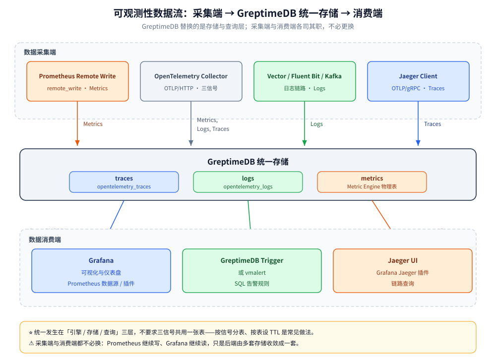

# 可观测性集成方案

> 把 GreptimeDB 放进可观测性栈：Grafana 多数据源怎么配、OTel Collector 怎么指过来、它与 Prometheus / Loki / Jaeger 的替代关系、以及「一库承载三信号」的收益与代价；最后给两类可直接照搬的落地方案。
>
> 内容整理自个人学习笔记，并参考官方文档与 Release Notes；素材见 [素材清单](../../../../素材清单.md)。

---

## 一、GreptimeDB 在可观测性栈里站在哪一层？

**本节要点**：先定位，再看集成——它替换的是**存储与查询层**，不替换采集端，也不自带完整 APM 界面。栈层面的选型对比见 [可观测性选型.md](../../../../06-工程实践/可观测性/可观测性选型.md)，本篇只讲「怎么接、替谁、代价是什么」。

### 1.1 官方定位：统一的可观测性数据库

GreptimeDB 把自己定位为**开源的可观测性数据库**：用**同一个列式引擎**存储与查询 metrics / logs / traces，共用一套 **Tag / Timestamp / Field** 列语义，可用 **SQL 查所有信号、PromQL 查指标**。它支持单机（本地存储）与分布式集群（对象存储为持久层）两种形态。

⚠️ 官方同时划了一条边界：**GreptimeDB 不是通用事务数据库**——它的存储、索引、留存与查询路径面向**以追加写入为主的时间索引数据**。

### 1.2 「统一」统一在哪一层

这一点最容易被误解。官方明确：**统一发生在引擎、存储和查询层，不要求三类信号用同一张表、同一套 schema，也不要求宽事件模型**。每类 workload 用适合自己的表：

- **Metrics**：常用主键列存 label，用 PromQL 查询（经 Metric Engine 落到共享物理表）。
- **Logs**：常用 append-only 表，按查询方式选全文索引或倒排索引。
- **Traces**：保留 trace / span 标识，可用 SQL 或 Jaeger 兼容接口查询。

⭐ 换算成一句话：**共享的是引擎、存储与查询层，不是 schema**。



---

## 二、Grafana 怎么接？

**本节要点**：Grafana 是把三信号「同屏」的关键件。GreptimeDB 支持多种数据源类型，各管一类查询。

### 2.1 四种数据源类型

| 数据源类型 | 连接地址 | 用途 | 注意 |
| --- | --- | --- | --- |
| **Prometheus** | `http://<host>:4000/v1/prometheus` | PromQL 指标查询，**既有面板零改动** | 需加 `x-greptime-db-name` 头或 `?db=` |
| **MySQL** | `<host>:4002` | 用 SQL 查任意信号 | 官方说明：**目前只能用 raw SQL 建面板**，SQL Builder 因时间戳类型差异暂不能选时间字段 |
| **Jaeger** | `http://<host>:4000/v1/jaeger` | 查链路（Jaeger Explore） | Jaeger 查询接口为**实验特性** |
| **GreptimeDB 数据源插件** | `http://<host>:4000` | SQL + Logs + Traces 查询类型，带 OTel 列映射预设 | 官方开源的 Grafana 插件 |

⭐ 分工建议（官方口径）：**标准指标面板走 Prometheus 数据源（PromQL），日志 / 链路 / 高级 SQL 聚合走 GreptimeDB 插件或 MySQL 数据源**。

### 2.2 官方给出的数据源配置示例

Prometheus 数据源（kube-prometheus-stack 场景）：

```yaml
grafana:
  datasources:
    datasources.yaml:
      apiVersion: 1
      datasources:
        - name: Prometheus
          type: prometheus
          url: http://greptimedb-frontend.greptime-cluster.svc.cluster.local:4000/v1/prometheus
          access: proxy
          editable: true
```

MySQL 数据源（查日志）：

```yaml
datasources:
  - name: greptimedb-logs
    type: mysql
    url: <host>:4002
    access: proxy
    database: public
```

### 2.3 链路侧的 Jaeger 数据源

GreptimeDB 在 `/v1/jaeger` 下暴露 Jaeger 查询接口（官方标注为**实验特性，未来版本可能调整**）：

| 接口 | 作用 |
| --- | --- |
| `/api/services` | 列出所有 Service |
| `/api/operations?service={service}` | 取某 Service 的所有 Operations |
| `/api/services/{service}/operations` | 同上 |
| `/api/traces` | 按查询参数取 traces |
| `/api/traces/{trace_id}` | 按 Trace ID 取单条 trace |

配置方式：Grafana 加 **Jaeger 数据源**，地址填 `http://localhost:4000/v1/jaeger`。⚠️ 默认表名是 `opentelemetry_traces`，多张 trace 表时用 HTTP 头 **`x-greptime-trace-table-name`** 指定；为 `GET /api/operations` 类接口加时间范围可设 **`x-greptime-jaeger-time-range-for-operations: 3 days`**（否则数据量大时会查很久）。

---

## 三、OTel Collector 怎么指向 GreptimeDB？

**本节要点**：Collector 是三信号的统一入口，配置的关键是「**一个信号一个 exporter**」。

### 3.1 配置要点

三个 OTLP/HTTP exporter 指向同一个 `/v1/otlp` 端点，用请求头区分：

```yaml
exporters:
  otlphttp/traces:
    endpoint: http://greptimedb:4000/v1/otlp
    headers:
      x-greptime-pipeline-name: greptime_trace_v1
      x-greptime-hints: ttl=7d
  otlphttp/logs:
    endpoint: http://greptimedb:4000/v1/otlp
  otlphttp/metrics:
    endpoint: http://greptimedb:4000/v1/otlp
```

- **为什么分开配**：GreptimeDB 用请求头决定每种信号怎么处理（traces 的 pipeline、logs 的表名和 pipeline），**一个 exporter 无法分别设置**；分开也顺带隔离数据。
- `x-greptime-hints: ttl=7d`：让 trace 表在建表时就带上 7 天 TTL（示例值，按需调整）。
- ⚠️ **不要双写同一份指标**：同一个 Prometheus 格式指标既走 OTLP 又走 remote write，**会在写入时报时间戳类型冲突**。

### 3.2 一条最容易被忽略的规则

官方参考架构给了一条硬要求：**三信号从同一个 Collector 出来时，resource attributes（`service.name`、`k8s.pod.name` 等）在三张表里才是一致的，而跨信号关联正是靠这些字段**。

⭐ 换句话说：**想要跨信号 JOIN，就得让三张表有可比对的共同标识**——这既是采集配置问题（用同一个 Collector、保留相同 resource attributes），也是埋点问题（日志里带 `trace_id`）。关联查询的写法见 [SQL查询与跨信号关联.md](SQL查询与跨信号关联.md) 第四节。

---

## 四、它与 Prometheus / Loki / Jaeger 是什么替代关系？

**本节要点**：能替什么、替不掉什么，是选型时最该问清的一件事——**别把「协议兼容」当成「功能等价」**。

### 4.1 能替掉什么

| 被替的组件 | 替代方式 | 前提 |
| --- | --- | --- |
| **Prometheus 的本地 TSDB** | remote write 写入 + PromQL 查询 | 面板与告警用标准 PromQL，且不落在不支持的边界内 |
| **Loki（日志存储）** | Loki push 写入 或 OTLP logs | ⚠️ **只有写入兼容，LogQL 不支持**，查询要改用 SQL |
| **Elasticsearch（日志存储）** | Elasticsearch Bulk 写入 | ⚠️ 开源版只覆盖 `_bulk` 写入、仅插入；**Query DSL 不在开源版** |
| **Jaeger / Tempo 的存储与查询** | OTLP traces 写入 + Jaeger 兼容查询 API | 现有 Jaeger UI / Grafana Jaeger 插件可继续用 |

### 4.2 替不掉什么

- **采集端**：Prometheus 的 scrape、OTel Collector 的接收与处理、Promtail / Vector 的采集——**该留还得留**，GreptimeDB 只是它们的新存储目标。
- **告警编排**：GreptimeDB 不做告警。指标告警继续走 Prometheus Alertmanager 或 Grafana 原生告警。
- **完整 APM 界面**：官方明确「它是存储与查询引擎，不是完整的可观测性 UI」——**要你自己带 Grafana 或内置 Dashboard**，而不是像 SkyWalking 那样开箱给 APM 大盘。
- **LogQL / ES Query DSL / Prometheus 的全部查询语义**：协议层的兼容是**按协议分别成立的**，官方明确「**查询侧覆盖比写入侧窄**」。

⭐ 一句话：**能替掉的是「存储 + 查询后端」，替不掉的是「采集、告警、UI 与各家的专有查询语言」。**

---

## 五、一库承载三信号的收益与代价

**本节要点**：统一存储不是免费的午餐。收益在架构简洁与关联能力，代价在**隔离、留存与爆炸半径**。

### 5.1 收益

- **一条 SQL 跨信号关联**：指标异常、同期日志、对应 Trace 在同一个库里 `JOIN`，不用在 Grafana 里切三套数据源、抄 traceID。
- **一套存储与生命周期**：三信号共用同一套存储与生命周期管理机制，减少要部署、升级、加固、监控的组件。
- **查询语义统一**：SQL 覆盖全部信号，PromQL 覆盖指标——既有的 Prometheus 面板与告警可以平滑复用。
- **对象存储为基础**：分布式部署下持久文件放在 S3 / GCS / Azure Blob 等对象存储上，计算与存储可分别扩容，历史分析不需要另建分析库与数据复制管道。

### 5.2 代价

| 代价 | 具体表现 | 怎么应对 |
| --- | --- | --- |
| **查询隔离** | 三信号共享同一套引擎与容量；某类信号的查询风暴会占用公共资源 | 开源版靠分表、分区、索引与容量规划；**工作负载隔离属企业版能力** |
| **留存策略** | 三信号保留期不同（指标长、日志短、链路中），要**按表**分别设 TTL | 按信号分表、按表设 `ttl`；不要把不同留存要求的数据塞一张表 |
| **成本结构** | 长期留存搬到对象存储，**单位成本下降**，但近热查询依赖内存与本地缓存 | 用对象存储 + 缓存分层；高体量时加数据分区 |
| **爆炸半径** | 一个存储同时承载监控与排障数据，**故障时三类信号一起受影响** | 单机起步注意容量上限；生产集群做高可用（Remote WAL 等） |
| **生态成熟度** | 相对 Prometheus / Loki 生态更年轻，部分第三方集成还没有官方支持 | 先用协议兼容的路径接入，逐信号迁移、可回退 |

⚠️ 注意：上表的「工作负载隔离、独立读容量」等**属于企业版能力**，开源版不隐含提供——评估时别把两者混为一谈。

---

## 六、两类落地方案

**本节要点**：给两个不同起点的方案——小团队从零起步走单库，已有 Prometheus 体系的走渐进迁移。⚠️ 以下为**方案类型**描述，不含具体客户名与具体数字。

### 6.1 小团队单库起步

**起点**：服务数量不多，尚未重度投入可观测性建设，想要尽量少的组件。

```text
采集：OpenTelemetry Collector（一个实例，三类信号）
存储：GreptimeDB standalone（单二进制 / 单进程）
查询：PromQL（指标面板）+ SQL（日志、链路、跨信号）
展示：Grafana（Prometheus 数据源 + GreptimeDB 插件 + Jaeger 数据源）
告警：Grafana 原生告警
```

**为什么这样起**：单机 standalone 最简，采集端用 OTel 一次到位（三类信号一个 Collector），展示端全部收敛到 Grafana。**好处是起步组件最少、跨信号关联从第一天就可用**；**代价是容量与故障边界都在一台机上**，规模上来后要迁集群。

### 6.2 已有 Prometheus 体系的渐进接入

**起点**：已有 Prometheus 抓取与 Grafana 面板，想加长期存储、逐步引入日志 / 链路。

**第一步——指标双写验证**：在 Prometheus 里加 remote write，把指标同时写进原有后端与 GreptimeDB，观察一段时间：

```yaml
remote_write:
  - url: http://greptimedb:4000/v1/prometheus/write?db=public
```

**第二步——查询侧切换**：在 Grafana 新增一个指向 GreptimeDB 的 Prometheus 数据源，**把部分面板切过去**，逐一验证表达式（重点查 `@` 修饰符、`__name__` 负向匹配、亚毫秒精度这几类边界）。

**第三步——告警切换**：把告警查询来源换成 GreptimeDB，观察触发是否与原一致。

**第四步——下线本地 TSDB**：确认稳定后，把 Prometheus 改为纯 scraper + remote write。

**日志与链路随后接入**：日志走 Loki push 或 OTLP logs；链路走 OTLP traces，直接用 Grafana 的 Jaeger 数据源查。

⭐ 渐进迁移的核心是**每一步都可回退**：写入侧先双写、查询侧先部分切换，确认一条再走下一步。⚠️ 但注意**同一个指标不要长期双写**（见 3.1 的时间戳类型冲突）——双写只用于验证期。

---

## 使用：把三信号收敛到一套存储

**本节要点**：给一份最小可用的「采集 → 存储 → 查询 → 展示」配置骨架。

**采集（OTel Collector 关键片段）**：

```yaml
exporters:
  otlphttp/metrics:
    endpoint: http://greptimedb:4000/v1/otlp
  otlphttp/logs:
    endpoint: http://greptimedb:4000/v1/otlp
  otlphttp/traces:
    endpoint: http://greptimedb:4000/v1/otlp
    headers:
      x-greptime-pipeline-name: greptime_trace_v1
```

**指标侧写入（已有 Prometheus 时）**：

```yaml
remote_write:
  - url: http://greptimedb:4000/v1/prometheus/write?db=public
```

**Grafana 数据源**：

```text
Prometheus 数据源 URL：http://greptimedb:4000/v1/prometheus
Jaeger 数据源 URL：    http://greptimedb:4000/v1/jaeger
MySQL 数据源地址：      greptimedb:4002（raw SQL 面板）
```

**排障动线**（收敛后不再是「切三个数据源」）：

```text
PromQL 面板发现指标异常
  → SQL 按 trace_id 拉出同一条链路的 span
  → 同一 SQL 按 trace_id 关联出这条链路的日志
  → 按 service_name / host 关联同期的 CPU、内存指标
```

⚠️ 上面所有**端点、参数与配置片段都来自官方文档**；端到端结果**请按自己的环境核对**。

---

## 延伸追问

- **GreptimeDB 能完全替掉 Prometheus 吗？** → 能替掉它的**本地 TSDB 与查询后端**，但**采集（scrape）与告警（Alertmanager）仍要靠 Prometheus 侧**。兼容的是 remote write 写入与 PromQL 查询，不是 Prometheus 的全部功能。
- **用了 GreptimeDB 还要不要 Loki？** → 视查询需求。Loki push 可以复用，但官方明确**不支持 LogQL 查询**——要按标签 / 关键词检索就得改用 SQL。如果团队重度依赖 LogQL，迁移前要评估查询改写成本。
- **三信号放一个库，查询会互相影响吗？** → 会共享同一套引擎与容量。开源版靠**分表、分区、索引、TTL** 做隔离；**工作负载隔离（Datanode groups）与独立读容量是企业版能力**。规模大且要求强隔离时要把这条算进去。
- **「一个库统一」是不是意味着要统一 schema？** → **不是**。官方明确统一只在**引擎 / 存储 / 查询层**，不要求三信号共用一张表或一套 schema；相反，官方建议**按信号分表、按体量分区**，各表可有不同 schema、索引、TTL、compaction 配置。
- **Grafana 用哪个数据源查日志和链路？** → 日志与高级 SQL 聚合用 **GreptimeDB 数据源插件**（或 MySQL 数据源，注意只能用 raw SQL 建面板）；链路用 **Jaeger 数据源**指到 `/v1/jaeger`；纯指标面板用 **Prometheus 数据源**指到 `/v1/prometheus`。
- **Jaeger 数据源稳不稳？** → 官方标注 Jaeger 查询接口为**实验特性，未来版本可能调整**。链路排查如果对稳定性要求高，评估时要留出这一条。
- **为什么跨信号关联要靠 resource attributes 一致？** → 因为关联键只能来自数据本身。三信号从**同一个 Collector** 出来、保留相同的 resource attributes（`service.name`、`k8s.pod.name`），三张表里的关联字段才可比对（详见 [SQL查询与跨信号关联.md](SQL查询与跨信号关联.md) 第四节）。

---

## 关联

- [SQL查询与跨信号关联.md](SQL查询与跨信号关联.md) — 跨信号关联查询的具体 SQL 写法与本篇提到的关联键来源
- [PromQL兼容查询.md](PromQL兼容查询.md) — Grafana Prometheus 数据源背后的兼容层与兼容边界
- [写入协议与数据接入.md](写入协议与数据接入.md) — OTLP / remote write / Loki push 的端点与配置细节
- [部署与集群运维.md](部署与集群运维.md) — standalone 与集群形态、WAL 与高可用选项
- [选型对比与落地案例.md](选型对比与落地案例.md) — 与同类方案横向对比与公开落地情况
- [Flow流计算引擎.md](Flow流计算引擎.md) — 把 RED 指标等派生数据用持续聚合物化出来
- [../../../../06-工程实践/可观测性/可观测性选型.md](../../../../06-工程实践/可观测性/可观测性选型.md) — 可观测性栈层面的选型对比（本篇不重复其选型表）
- [../../../../06-工程实践/可观测性/Jaeger.md](../../../../06-工程实践/可观测性/Jaeger.md) — Jaeger 侧的链路采集与部署
- [../../存储选型.md](../../存储选型.md) — 时序库在七类存储里的定位
> 反向引用（本篇被下列文档引到）：[运维与监控.md](../VictoriaMetrics/运维与监控.md)
