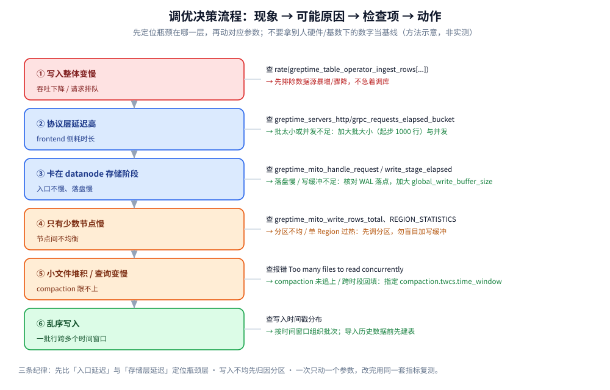

# 性能调优与基准测试

> GreptimeDB 的写入 / 查询 / compaction 调优要点，以及**怎么用 TSBS 设计一次可信的基准测试** ——
> 回答「**该调哪些参数、调之前怎么把口径定死**」。
>
> 内容整理自个人学习笔记，并参考 GreptimeDB 官方文档、发布说明与官方 benchmark 博客；素材见 [素材清单](../../../../素材清单.md)。
>
> ⭐⭐ 本篇**只讲方法与口径，不跑任何代码、不起任何容器**。凡出现的数字**一律来自官方文档 / 官方博客 / Release Notes 并写明出处**；
> 核不到出处的数字**不写**。

---

## 一、为什么「先定口径」比「先调参数」更重要？

**本节要点**：性能数字几乎没有「绝对值」——它同时是**硬件、数据分布、基数、批大小、并发**的函数。
在没锁死这些变量之前调参，你分不清「改动有效」还是「这次数据恰好不同」。

三条前置纪律：

1. **同一份数据**：用固定随机种子生成数据，保证前后两次跑的是**同一批行、同一批查询**；
2. **同一套硬件与配置**：跨机器、跨容器规格的数字**不能混用**；
3. **分清 ingest 与 query 两个阶段**：写入吞吐和查询延迟是两个独立结论，别用一句「性能好」概括。

⭐ 这三点正是 **TSBS（Time Series Benchmark Suite）** 设计上的核心：数据与查询用**同一伪随机种子**预生成，
每个数据库加载**完全相同的行**、执行**完全相同的查询**。后面的第五节会把它的用法展开。

---

## 二、写入侧怎么调？

**本节要点**：写入侧的四个杠杆是**批大小 / 并发 / WAL 落点 / 写缓冲**，
外加一个常被忽略但收益很大的**表布局**（append-only）。它们分别对应「请求层」「持久化层」「内存层」「存储层」。

### 2.1 批大小与并发

- 官方给的**起步建议是每批 1000 行**；若延迟与资源仍可接受，可以继续加大批大小；
- **按时间窗口写**：虽然 GreptimeDB 能处理乱序数据，但乱序**仍然影响性能** ——
  它会从写入数据里推断时间窗口大小并据此分区，若一批行**不落在同一个时间窗口**就要拆开，影响写入性能。
  实时数据通常用最新时间戳、不成问题；**若要导入跨长时段的历史数据，官方建议先建表并指定**
  `compaction.twcs.time_window`。

### 2.2 WAL 落点

WAL 决定**持久化延迟**与**故障恢复能力**（WAL 三种模式见 [部署与集群运维.md](部署与集群运维.md) 第三节 3.3）：

| 落点 | 对写入的影响 |
|---|---|
| Local WAL（内嵌 raft-engine） | **延迟最低**（进程内、无网络往返） |
| Remote WAL（Kafka） | 多一跳网络，**换来低 RTO 与热备/迁移** |
| 关闭 WAL（`skip_wal='true'`） | **吞吐可进一步提升** |

⚠️ **关闭 WAL 的代价**：未落盘的数据**不可恢复**，只能从原始数据源（如 Kafka / 日志）重新回放。
因此它**只适用于可从外部重放的数据源**：

```sql
CREATE TABLE logs(
  message STRING,
  ts TIMESTAMP TIME INDEX
) WITH (skip_wal = 'true');
```

### 2.3 写缓冲（memtable）与 flush

写入先落内存缓冲，达到阈值后 flush 成不可变文件。相关配置与语义（官方口径）：

| 配置 | 含义 |
|---|---|
| `region_engine.mito.global_write_buffer_size` | 全局写缓冲上限；**默认自动取 OS 内存的 1/8，上限 1GB** |
| `region_engine.mito.global_write_buffer_reject_size` | 拒绝阈值；**默认 = 2× 全局写缓冲**，一般**不用手动设** |
| `region_engine.mito.default_region_write_buffer_size` | 每 Region 默认限额；**默认 0 = 不启用** |
| 表级 `write_buffer_size` | 单表覆盖；**优先于引擎默认** |

⭐ 单 Region 的阈值语义值得记牢：**达到一半就调度 flush、达到阈值就 stall、达到两倍就 reject**
（同 worker 上的其他 Region 不受影响）。表级 `write_buffer_size` 显式设 `0` 会**关掉**该表的每 Region 限制。

```toml
[[region_engine]]
[region_engine.mito]
global_write_buffer_size = "2GB"
# 可选：自定义拒绝阈值，必须大于 global_write_buffer_size
global_write_buffer_reject_size = "3GB"
# 可选：每 Region 限额，0 表示不启用
default_region_write_buffer_size = "512MB"
```

⚠️ 官方调参纪律：**先确认 flush 性能与写入分布是健康的**，再考虑加大写缓冲；
加大要**逐步来（如 ×2 到 ×4）**并盯 datanode 内存。

### 2.4 schema 与表布局

- **`append_mode='true'`（append-only 表）**：存储引擎可跳过合并与去重，**扫描更快**，
  查询引擎还能利用统计信息加速部分查询。**不需要去重、或优先性能而非去重时强烈建议开启**
  （日志、链路这类「时间戳可能重复」的数据尤其适合）。⚠️ 反向：需要去重的指标表不要开。
- **Tag（`PRIMARY KEY`）基数**：高基数 Tag 会放大内部结构开销。官方在 SST 格式一章指出，
  默认的 **`flat` 格式在包括 `trace_id` / `uuid` 在内的高基数下表现良好**，
  **不需要手动设 `sst_format`**；唯一需要设的场景是**从旧版本升级**（旧默认是 `primary_key` 格式），
  此时应把这类表切到 `flat`。
- **分区**：分区的目标是让写入与查询**分散到更多 Region 与 datanode**（见 [索引设计与查询优化.md](索引设计与查询优化.md)）。

---

## 三、查询侧怎么调？

**本节要点**：查询调优的**第一性原则是「少扫数据」** ——
时间范围裁剪、只读需要的列、避免高基数 regexp，比任何参数都有效；索引与缓存是**在少扫之后**再叠的加速。

### 3.1 先裁剪，再谈索引

| 手段 | 说明 |
|---|---|
| **时间范围裁剪** | 查询**必须带时间谓词**，让引擎能裁掉不相干的文件/行组 |
| **只读需要的列** | 列存下，`SELECT *` 会把所有列都读出来；只取要用的列 |
| **避免高基数 regexp** | 对 `trace_id` / `uuid` 这类高基数列做 regexp，命中率低且成本高 |
| **append-only 表** | 跳过合并/去重，扫描更快（同 2.4） |

⚠️ 一个常见报错值得单独记：**`Too many files to read concurrently`** ——
形如 `Too many files to read concurrently: 1528, max allowed: 384`。
官方给出的两类常见原因：**① 小 SST 文件过多**（多见于**历史数据回填且时间戳跨度大、**
compaction 还没追上）；**② 默认的并发文件上限对当前硬件过于保守**。

### 3.2 索引选型

GreptimeDB 提供**倒排索引、跳数索引（skipping index）、全文索引**三类，各自适配不同列型。
选型细节与建表语法见 [索引设计与查询优化.md](索引设计与查询优化.md)，这里只记判据：

| 索引 | 适配 | 典型列 |
|---|---|---|
| 倒排索引（Inverted） | 低基数筛选 | `log_level`、`service` |
| 跳数索引（Skipping） | 高基数等值查询 | `trace_id`、`span_id` |
| 全文索引（Fulltext） | 日志正文关键词检索 | `message` |

### 3.3 缓存

官方把 `greptime_mito_cache_bytes{type="..."}` 作为**缓存压力的首要信号**：

- 长期**贴近**配置容量 → 考虑**加大**该缓存；
- 长期**远低于**容量 → 考虑**调小**，把内存/磁盘让给更紧张的缓存；
- `greptime_mito_cache_hit` / `_miss` / `_eviction` 是判断「调大小是否有用」的**辅助信号**；
- 经验值（官方口径）：**命中率 < 50% 可考虑翻倍**；用对象存储时**写缓存建议至少取磁盘的 1/10**。

```toml
[[region_engine]]
[region_engine.mito]
write_cache_size = "10G"
index_cache_percent = 20
page_cache_size = "512MB"
```

---

## 四、compaction 与 TTL 怎么影响读写放大？

**本节要点**：compaction 把「小文件」合并成「大文件」，降读取成本但**消耗写带宽**；
TTL 决定**数据何时过期删除**。二者共同决定**写放大**与**长期存储成本**，是写入稳定后的第二层调优。

- **时间窗口压缩策略（TWCS）**：建表时可指定 `compaction.twcs.time_window`。
  它把数据按**时间窗口**组织、窗口内再合并，天然契合时序「新数据热、老数据冷」的访问模式。
  ⚠️ 导入**跨长时段的历史数据**时尤其要显式指定它（同 2.1）。
- **TTL**：删除数据靠**建表时的 TTL**，而不是靠 Flow 的 `EXPIRE AFTER`
  （后者只控制参与计算的范围，不删数据，见 [Flow流计算引擎.md](Flow流计算引擎.md) 第四节）。
  合理 TTL 能让过期数据及时释放，避免「冷数据占着缓存把热数据挤出去」。

⭐ 调优顺序：**先把写入批大小/WAL 理顺 → 再看 compaction 是否跟不上（小文件堆积）→ 最后用 TTL 控体量。**
背景原理（LSM、Memtable、SST 合并）见 [架构与存储引擎.md](架构与存储引擎.md)。

---

## 五、基准测试该怎么设计（以 TSBS 为例）？

**本节要点**：TSBS 把基准分成 **ingest（写入）与 query（查询）两个阶段**。
设计的核心不是「跑一次」，而是**锁死数据分布与基数、让两个阶段各自可复现**。

### 5.1 TSBS 的两阶段

| 阶段 | 目标 | 关键参数 |
|---|---|---|
| **ingest（加载）** | 测**写入吞吐**（rows/s）与磁盘占用 | 批大小、并发 worker 数 |
| **query（查询）** | 测**各类查询的延迟** | 查询类型集合、每类重复次数 |

### 5.2 数据分布怎么设

以官方 benchmark 常用的 **cpu-only 场景**为例，需要显式声明的有：

| 参数 | 说明 | 官方示例取值 |
|---|---|---|
| scale（设备/主机数） | 模拟多少个数据源 | 4,000 台 host |
| 时间范围 | 覆盖多久的数据 | 3 天 |
| 采样间隔 | 数据点密度 | 10 秒 |
| Tag 维度 | 决定**基数** | hostname / region / datacenter / rack / os… 共 10 个 |
| Field 维度 | 决定每行长度 | usage_user / usage_system / usage_idle… 共 10 个 |
| **随机种子** | **保证两个数据库加载完全相同的行** | 固定同一 seed |

⭐ **为什么必须固定数据分布**：TSBS 用同一 seed 预生成数据与查询，
「每个数据库加载完全相同的行、执行完全相同的查询」——**这是公平比较的前提**。
一旦基数（Tag 取值数）或时间跨度变了，扫描的字节数就变了，数字**不再可比**。

### 5.3 为什么不能跨硬件 / 跨基数直接比数

- **跨硬件**：CPU 核数、内存、磁盘类型（GP3 SSD vs NVMe）、是否共享宿主机，都会直接改变吞吐与延迟；
- **跨基数**：基数决定索引规模与扫描量。同一份代码在 **4K series** 与 **2M series** 下，
  写入吞吐可以相差数倍，查询延迟的倍率更是完全不同；
- **跨版本**：同一数据库的不同版本默认值就变了（如默认 SST 格式从 `primary_key` 改为 `flat`）。

⭐ 结论：**引用别人的数字时，必须连同「硬件 + 版本 + 数据规模 + 批大小/并发」一起引**，
否则那个数字没有意义。

---

## 六、官方 benchmark 怎么读？

**本节要点**：下面全部是**官方口径**，出处已标注。⚠️ **它们是官方环境下的结果，不能当作你自己的基线**——
你的硬件、基数、批大小都会让数字不同。

**① GreptimeDB vs TimescaleDB（官方博客 2025-12-09，TSBS，cpu-only 场景）**

环境与参数（官方给出）：AWS **c5d.2xlarge（8 vCPU / 16 GB）**、Ubuntu 24.04、300 GB gp3 SSD；
**GreptimeDB v1.0.0-beta.2** 对比 **TimescaleDB 2 / PostgreSQL 17**；
**4,000 台 host、3 天、10 秒间隔、约 1.036 亿行**；写入批大小 **10,000**、**8 个并发 worker**。

| 指标 | TimescaleDB | GreptimeDB | 差距（官方口径） |
|---|---|---|---|
| 写入吞吐 | 131,531 rows/s | 285,301 rows/s | **约 2.17×** |
| 磁盘占用 | 20 GB | 1.1 GB | **约 1/18** |
| 查询 | 15 类中赢 2 类 | 15 类中赢 13 类 | **最高约 67×** |

官方同时**如实列出了 TimescaleDB 胜出的两类**：`lastpoint`（**8.7×** 更快）与
`groupby-orderby-limit`（**6×** 更快）—— 点查与 Top-N 是 Postgres B-tree 的强项。

**② Flat 格式基准（官方博客 2025-12-22，TSBS）**

环境：AMD Ryzen 7 7735HS（16 核 @ 3.2 GHz）、32 GB 内存、Ubuntu 22.04。
官方结论是**格式选择随基数变化**：

| 场景 | primary-key 格式 | flat 格式 | 说明 |
|---|---|---|---|
| 4K series，6 workers / batch 3,000 | 401,416 rows/s | 371,473 rows/s | 低基数下 flat **略降** |
| 2M series，6 workers / batch 3,000 | 87,141 rows/s | 363,741 rows/s | 高基数下 flat **约 4.2×** |

⭐ 官方给出的使用建议：**若主键含高基数列，flat 格式值得尝试**；
低基数场景下**加大批大小可以缓解** flat 的轻微回归。

**③ `greptime cli` 的 v0.12 发布说明（官方）**

同一档 EC2 c5d.2xlarge 上，v0.12 的 ingest rate 官方记录为 **326,839 rows/s**，
并给出各查询类型耗时。⚠️ **与 ① 是不同版本、不同发布时间的数据，不要横向混用。**

📌 三条读法：

1. **一定要读出处的三件事**：版本、硬件、数据规模；
2. **官方也列自己输的项**（如 `lastpoint`），这类反而是最有信息量的部分；
3. **压缩比与存储占用**的收益往往比吞吐更值得关注（云上直接影响成本）。

---



---

## 使用：一次「写入变慢」的排查路径

**本节要点**：把前面的调优点串成一条**从上到下的下钻路径**。
原则是**先定位瓶颈在哪一层，再动对应的参数** —— 顺序错了就是在试错。

| 步骤 | 现象 | 先查什么 | 可能原因 | 对应动作 |
|---|---|---|---|---|
| ① | 写入整体变慢 | `rate(greptime_table_operator_ingest_rows[...])` | 数据源本身变快/变慢 | 先排除上游，不急着调库 |
| ② | 协议层延迟高 | `greptime_servers_http/grpc_requests_elapsed_bucket` | 批太小 / 并发低 | **加大批大小（起步 1000 行）或提高并发** |
| ③ | 与 datanode 对比后卡在存储层 | `greptime_mito_handle_request_elapsed_bucket`、`greptime_mito_write_stage_elapsed_bucket` | 落盘慢 / 写缓冲不足 | 检查 WAL 落点；必要时加大 `global_write_buffer_size` |
| ④ | 只有某几个节点慢 | `greptime_mito_write_rows_total`、`REGION_STATISTICS` | **分区不均、单 Region 过热** | **先调分区**，不要盲目加写缓冲 |
| ⑤ | 小文件堆积、查询变慢 | `Too many files to read concurrently` 报错 | compaction 没追上 / 历史数据跨时段导入 | 指定 `compaction.twcs.time_window`；核对并发文件上限 |
| ⑥ | 乱序写入 | 写入时间戳分布 | 一批行跨多个时间窗口 | **按时间窗口组织批次**；导入历史数据前先建表 |
| ⑦ | 内存压力大但不肯降吞吐 | 缓存 `bytes` / `eviction` | 缓存配置与负载不匹配 | 按命中率调缓存大小或 `index_cache_percent` |

⭐ 三条纪律：**先比「入口延迟」与「存储层延迟」定位瓶颈层**；
**写入不均先归因分区**；**任何参数改动一次只动一个、改完用同一套指标复测**。

---

## 延伸追问

- **为什么不能拿官方 TSBS 数字当自己的基线？** → 性能数字是**硬件 × 版本 × 基数 × 批大小/并发**的函数。
  官方那组数是 AWS c5d.2xlarge、特定版本与数据规模下的结果，**换个环境就不可比**。
- **一处「批大小」到底该设多少？** → 官方建议**起步每批 1000 行**；
  延迟与资源允许就继续加大。批大小过小会显著拖累写入吞吐。
- **乱序写入为什么慢？** → 引擎会从数据里推断时间窗口并据此分区；
  **一批行不落在同一时间窗口就要拆**，增加开销。**按时间窗口组织批次**可规避。
- **写缓冲的「一半 / 一倍 / 两倍」是什么意思？** → 达到值的**一半调度 flush**、达到值**stall**、
  达到**两倍 reject**（`global_write_buffer_reject_size` 默认 2×）。这是单 Region 的阈值语义。
- **什么时候可以关 WAL？** → **仅当数据源可重放**（如 Kafka / 日志），
  因为关掉后未落盘的写入**不可恢复**。用 `skip_wal='true'`。
- **`append_mode='true'` 是不是万能加速？** → 不是。它跳过合并/去重、扫描更快，
  **代价是放弃去重**。日志/链路适合，需要去重的指标表不要开。
- **`sst_format` 要不要手动设？** → **默认 `flat`，一般不用设**，它对高基数也表现良好；
  只有**从旧版本升级**（旧默认 `primary_key`）时才需要把这类表切到 `flat`。
- **`Too many files to read concurrently: 1528, max allowed: 384` 怎么理解？** →
  单条查询要扫的 SST 文件数超了单查询并发上限。**先查是否小文件过多（回填 + compaction 未追上），**
  再考虑该上限对当前硬件是否过于保守。
- **压缩比为什么值得盯？** → 它直接决定云上的存储成本。官方 benchmark 中 GreptimeDB 的存储占用
  是对照组的**约 1/18**（该数字出自上述官方博客，非本地复现）。
- **`EXPIRE AFTER` 能当 TTL 用吗？** → 不能。它**不删数据**，只控制参与计算的范围；
  删除数据要靠**建表时的 TTL**。

## 关联

- [架构与存储引擎.md](架构与存储引擎.md) — LSM、Memtable、SST 合并的原理背景
- [索引设计与查询优化.md](索引设计与查询优化.md) — 三类索引的建表语法与选型细则
- [数据模型与写入路径.md](数据模型与写入路径.md) — 写入路径各阶段（与本篇写入侧调优呼应）
- [部署与集群运维.md](部署与集群运维.md) — WAL 三种落点、指标清单与集群拓扑
- [Flow流计算引擎.md](Flow流计算引擎.md) — 用持续聚合把查询成本前置
- [选型对比与落地案例.md](选型对比与落地案例.md) — 官方 benchmark 结论在选型里的位置
- [../VictoriaMetrics/性能调优与基准测试.md](../VictoriaMetrics/性能调优与基准测试.md) — 同类时序库的调优口径对照
- [存储选型.md](../../存储选型.md) — 存储在系统中的横向定位
> 反向引用（本篇被下列文档引到）：[性能调优与基准测试.md](../../列式数据库/ClickHouse/性能调优与基准测试.md)
