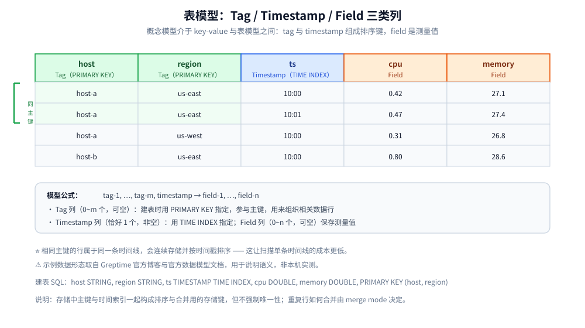
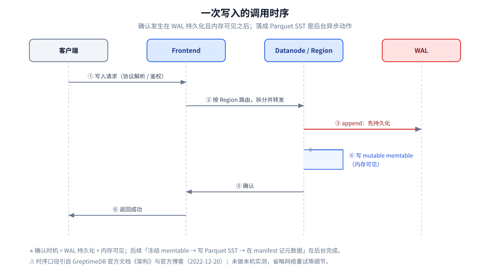

# 数据模型与写入路径

> 讲清 GreptimeDB 的表模型（`Tag` / `Timestamp` / `Field` 三类列、`TIME INDEX` 与 `PRIMARY KEY` 的约束）、
> 「同一主键即同一条时间线」的含义，以及一条数据从客户端到落盘要经过的路径与可见性语义。
>
> 素材来源：Greptime 官方博客《GreptimeDB 存储引擎设计内幕》（2022-12-20）的读后整理，**按主题归纳而非逐字摘录**；其余内容整理自个人学习笔记与官方文档，素材见 [素材清单](../../../../素材清单.md)。

---

## 一、GreptimeDB 用哪三类列描述一条数据？

**本节要点**：GreptimeDB 的数据模型「介于 key-value 模型和表模型之间」。
记住那条模型公式与三类列的分工，后面所有建表决策都从它推出来。

### 1.1 模型公式

据官方文档《存储引擎》，存储引擎提供的数据模型介于 `key-value` 模型和表模型之间：

```text
tag-1, ..., tag-m, timestamp -> field-1, ..., field-n
```

每一行数据包含**多个 tag 列、一个 timestamp 列和多个 field 列**。官方文档《数据模型》把三者称为
统一可观测数据模型的**三类列语义**：`Tag`、`Timestamp`、`Field`。

### 1.2 三类列的语义与可空性

| 列类型 | 数量 | 可空性 | 声明方式 | 作用 |
|---|---|---|---|---|
| **Tag** | 0 ~ m 个 | 可空 | 建表时用 `PRIMARY KEY` 指定 | 参与主键，用来组织相关的数据行；在指标表中通常对应标识时间序列的 labels |
| **Timestamp** | 恰好 1 个 | **非空** | 建表时用 `TIME INDEX` 指定 | 记录事件或采样时间；GreptimeDB 据此按时间组织数据并优化时间范围查询 |
| **Field** | 0 ~ n 个 | 可空 | 其余列默认都是 field | 保存测量值、日志内容、trace 属性或其他数据 |

⭐ 两条容易记错的点：

1. **Tag 不是必选项**——官方文档明确：append-only 日志表和事件表可以**没有主键列**；
2. **Field 可以放多种类型**——数值、字符串、JSON、时间戳等 GreptimeDB 支持的数据类型都可以。

## 二、TIME INDEX 与 PRIMARY KEY 各约束了什么？

**本节要点**：这两个约束是建表时唯一必须想清楚的东西——它们共同组成「存储键」，
决定了数据如何排序、如何分组、如何被合并。

### 2.1 TIME INDEX：恰好一个、非空

据官方 CREATE TABLE 参考：

- `TIME INDEX` 指定**时间索引列**，**每个表只能有一个时间索引列**；它表示数据模型中的 `Timestamp` 类型；
- 存储引擎层面，timestamp 列**必须非空**。

### 2.2 PRIMARY KEY：tag 列、可空、不能含时间索引

同样据官方参考：

- `PRIMARY KEY` 指定表的主键列，它表示数据模型中的 `Tag` 类型；
- 它**不能包含时间索引列**，但它**总是隐式地把时间索引列添加到键的末尾**；
- 其他列是数据模型中的 `Field` 类型。

⚠️ 最关键的一条（官方参考原文口径）：

> `PRIMARY KEY` 列和 `TIME INDEX` 共同组成用于排序与合并数据行的**存储键**。
> 与关系数据库的主键不同，**该存储键不强制唯一性**。`merge_mode` 和 `append_mode` 决定
> GreptimeDB 如何处理存储键相同的数据行。

⭐ 也就是说：**GreptimeDB 的「主键」不是关系型的唯一约束**，而是「排序键 + 分组键 + 合并键」。
同名不同语义，是初学者最容易踩的坑。

### 2.3 两段等价的建表示例

博客里那条主机指标表（表约束集中写在列定义之后）：

```sql
CREATE TABLE host_metrics (
  host STRING,
  region STRING,
  ts TIMESTAMP TIME INDEX,
  cpu DOUBLE,
  memory DOUBLE,
  PRIMARY KEY (host, region)
);
```

官方文档《数据模型》里的指标表（把 `TIME INDEX` 与 `PRIMARY KEY` 写成表约束）：

```sql
CREATE TABLE IF NOT EXISTS system_metrics (
    host STRING,
    idc STRING,
    cpu_util DOUBLE,
    memory_util DOUBLE,
    disk_util DOUBLE,
    ts TIMESTAMP DEFAULT CURRENT_TIMESTAMP,
    PRIMARY KEY(host, idc),
    TIME INDEX(ts)
);
```

两种写法等价：`host` / `region`（或 `host` / `idc`）是通过 `PRIMARY KEY` 声明的 Tag 列，
`ts` 是通过 `TIME INDEX` 声明的 Timestamp 列，其余是 Field 列。

⚠️ 语法细节：`TIME INDEX` 与 `PRIMARY KEY` 也可以写成**列选项**，但**只能在列定义中指定一次**；
在多个列选项里各写一个 `PRIMARY KEY` 会直接报错，正确做法是用 `PRIMARY KEY(...)` 一次列出多列。

## 三、为什么「主键相同」就等于「同一条时间线」？

**本节要点**：这是理解存储布局的钥匙。主键不是「唯一标识一行」，而是「标识一条时间线」——
一条时间线由「同一组 tag 值」定义，其内部再按时间戳排序。

博客与官方文档的口径一致：

- 博客：**主键通常由标识一条时间线的 tag 列组成**，比如 `host` 和 `region`；
  **拥有相同主键的行属于同一条时间线**；时间索引则对一条时间线内的数据点进行排序，
  也是时间范围查询中最主要的剪枝维度。
- 当前文档：在一个 SST 文件内，行按 `(primary key, time index)` 排序；**具有相同 primary key 的行属于同一条时间序列**，会连续存储并按时间戳排序。

⭐ 由此推出两条实用结论：

1. **建主键 = 选时间线的粒度**。把 `host` + `region` 放进主键，意味着「每台主机在每个 region 一条时间线」；
   再加一个 `service` 列，时间线数量就会成倍增长。
2. **主键对齐查询的过滤维度**。查询里最常出现的等值过滤列（如 `host`、`region`），
   通常应该放进主键——这样才能利用「按主键排序」的局部性来减少扫描。

用博客的示例数据看会更直观：行按主键分组、按时间排序后，概念上类似这样：

```text
host       region    ts     cpu  memory
host-a     us-east   10:00  0.42 27.1
host-a     us-east   10:01  0.47 27.4
host-a     us-west   10:00  0.31 26.8
host-b     us-east   10:00  0.80 28.6
```



## 四、内部列如何支撑合并、去重与删除？

**本节要点**：LSM 结构下，同一行数据可能分散在多个 memtable 与 SST 文件里。
内部列就是「跨文件合并」时需要携带的元信息：**这是哪条时间线、什么顺序、是写还是删**。

博客口径：Mito 会存储一些内部列，例如编码后的主键数据、**序列号（sequence number）和操作类型（operation type）**，以便在从多个 memtable 和 SST 文件读取时，能够正确地进行合并、去重和应用删除。

当前文档口径把它明确为三个内部列：

| 内部列 | 含义 | 服务于 |
|---|---|---|
| `__primary_key` | 行的编码后 primary key（tags） | 合并：判断两行是否属于同一时间线的同一时刻 |
| `__sequence` | 行的 sequence number | 去重：多条写入同一 `(主键, 时间戳)` 时，决定保留谁 |
| `__op_type` | 行的操作类型（put 或 delete） | 删除：把删除也当成一条记录写入，读时据此应用删除 |

⭐ 一个反直觉但重要的设计：**删除在 LSM 里不是「就地抹掉」**。
`__op_type` 说明删除也是以记录的形式写入的，读取时由合并逻辑根据操作类型把被删除的行过滤掉。
这也解释了两个现象：

- 删除后存储文件不会立刻变小，要等 compaction 重新写出文件才会真正回收空间；
- 读取时的合并逻辑（含去重与删除应用）是查询路径上的一部分，不是免费的。

⚠️ 博客写于 2022-12，只描述了这三类内部信息的**存在**，没有给出列名；
`__primary_key` / `__sequence` / `__op_type` 是当前文档的命名，以当前文档为准。

## 五、append-only 表和带去重的表差别在哪？

**本节要点**：一句话——**merge mode 决定「同键同时间的多行保留谁」，append_mode 决定「要不要去重和删除」**。
两者互斥：append-only 会直接关掉去重与删除。

### 5.1 merge mode：默认 last_row

据官方 CREATE TABLE 参考，`merge_mode` 只在 `append_mode` 为 `'false'` 时可用：

| merge_mode | 行为 |
|---|---|
| `last_row`（**默认**） | 保留相同主键和时间戳的**最后一行** |
| `last_non_null` | 保留相同主键和时间戳的**最后一个非空字段** |

官方示例（`last_row`）说明了差别：先写 `('host1', 0, 0, NULL)`，再写 `('host1', 0, NULL, 10)`，
由于 `host1` 在同一时间戳上后写入的是 `memory=10`，最终保留的是后写的那一行；
而 `last_non_null` 模式下，会为 `cpu` 保留先写的 `0`、为 `memory` 保留后写的 `10`（每个字段各取最新非空值）。

### 5.2 append_mode：关闭去重与删除

- `append_mode` 默认值为 `'false'`，此时按主键和时间戳**删除重复行**；
- 设为 `'true'` 可开启 append 模式、创建 append-only 表，**保留所有重复的行**；
- 官方文档《数据模型》进一步说明：**append_mode 会关闭去重和删除**，适合不可变的日志记录，
  **不适合需要更新或删除数据行的 workload**；
- 对于没有主键的 append-only 表，**持久化数据仅按 time index 排序**。

官方文档的日志表例子正是这样一张无主键的 append-only 表：

```sql
CREATE TABLE access_logs (
  access_time TIMESTAMP TIME INDEX,
  remote_addr STRING,
  http_status STRING,
  http_method STRING,
  http_refer STRING,
  user_agent STRING,
  request STRING
) WITH ('append_mode' = 'true');
```

⭐ 选择建议：**日志、事件、原始上报**这类「写了不改」的数据用 append-only（省去去重开销）；
**指标**这类「同一时刻可能重复上报、需要以最后一次为准」的数据用默认去重。

## 六、一条数据从客户端到落盘要经过哪条路径？

**本节要点**：路径本身只有几跳，但**「何时算写入成功」**与**「何时能查到」**是两个不同的问题，
分清这两件事才算真的理解了写入语义。

### 6.1 路径与可见性

据官方文档《架构》的写入路径（分布式模式描述，standalone 在同一进程内完成）：

1. 客户端通过支持的写入协议发送数据；
2. Frontend 从 Metasrv metadata 中解析 table 和 Region 路由；
3. Frontend 拆分请求，把数据行转发到承载目标 Region 的 Datanode；
4. Datanode 写入内存和配置的 WAL，之后在达到 flush 条件时，最终将不可变数据文件写入表指定的存储后端。

⭐ **可见性语义（博客原文口径）**：

> 当一条写入在 WAL 中持久化、并在内存中可见后即可向客户端确认，随后在后台再把缓冲的数据转换成列式文件。

因此有两条推论：

- **写入确认 ≠ 已落成列式文件**：确认时数据在 WAL 与 memtable 中，SST 化是后台动作；
- **查询要「跨层合并」**：读到的结果来自 memtable 与 SST 文件的合并，并会按内部列做去重与删除应用。

### 6.2 各环节的职责速查

| 环节 | 职责 | 关联概念 |
|---|---|---|
| 协议解析与鉴权 | 把各种协议转成内部格式 | 见 [写入协议与数据接入.md](写入协议与数据接入.md) |
| 路由 | 按 Region 拆分并转发 | region 概念见 [架构与存储引擎.md](架构与存储引擎.md) |
| WAL 持久化 | 在 flush 前先保命 | 见 [架构与存储引擎.md](架构与存储引擎.md) 第 4.2 节 |
| memtable | 服务近期写入、累积数据 | 内部列 `__sequence` 在此生成 |
| flush | 冻结 memtable → Parquet SST | row group / 列统计 |
| manifest | 记录 region 变更 | 恢复与可见性的元数据枢纽 |



## 使用：为一张主机指标表选列

以「采集多台主机、多个 region 的 CPU / 内存指标」为例，走一遍选列决策：

| 列 | 归类 | 依据 |
|---|---|---|
| `host` | Tag（进主键） | 是标识时间线的维度，且查询几乎总会按它等值过滤 |
| `region` | Tag（进主键） | 同上；与 `host` 共同定义时间线粒度 |
| `ts` | Timestamp（`TIME INDEX`） | 采样时刻，每个表恰好一个、非空 |
| `cpu` | Field | 测量值，会被聚合（如 `max`、`avg`） |
| `memory` | Field | 测量值 |

对应的建表 SQL：

```sql
CREATE TABLE host_metrics (
  host STRING,
  region STRING,
  ts TIMESTAMP TIME INDEX,
  cpu DOUBLE,
  memory DOUBLE,
  PRIMARY KEY (host, region)
);
```

三条使用提醒：

1. **主键别塞动态值**。把每次都不同的字段（如请求 ID）放进主键，会让时间线数量爆炸；
2. **需要去重时保持默认**（`append_mode='false'`，`merge_mode='last_row'`），
   重复上报以最后一次为准；原始日志类数据才考虑 `append_mode='true'`；
3. **时间索引必须非空**，不要用可空的时间列做 `TIME INDEX`。

## 延伸追问

- **主键能不能包含时间列？** → 不能。官方参考明确 `PRIMARY KEY` **不能包含时间索引列**，
  但它会隐式把时间索引列加到键的末尾，也就是说「存储键」实际是 `(主键列…, 时间索引列)`。
- **为什么说主键「不强制唯一性」？** → 因为它是存储键，不是唯一约束。存储键相同的行如何处理，
  由 `merge_mode`（去重）与 `append_mode`（是否去重删除）决定。
- **`last_row` 和 `last_non_null` 怎么选？** → 若希望「后写入的整行覆盖前一行」，用 `last_row`（默认）；
  若希望「同一行里各字段各自保留最新非空值」，用 `last_non_null`。后者适合字段由不同来源分批补全的场景。
- **日志表要不要建主键？** → 通常不必。日志和事件用 append-only 表，可以没有主键列；
  无主键时持久化数据仅按时间索引排序。
- **删除一行会发生什么？** → 删除以记录形式写入（`__op_type` 标记），读取时由合并逻辑过滤；
  物理空间要等 compaction 重写文件后才回收。
- **「写入成功」后立刻能查到吗？** → 确认只保证「WAL 持久化 + 内存可见」；查询结果来自 memtable 与
  SST 的合并读取，具体行为以官方文档为准。
- **这些语义在不同版本有变化吗？** → 表模型骨架稳定；SST 格式（`flat` 默认）与内部列命名随版本演进，
  以最新官方文档为准，详见 [架构与存储引擎.md](架构与存储引擎.md) 第五节。

## 关联

- [README.md](README.md) — 本目录导读与版本坐标
- [架构与存储引擎.md](架构与存储引擎.md) — 本文写入路径在存储层的完整落点（region / SST / manifest）
- [索引设计与查询优化.md](索引设计与查询优化.md) — 主键与时间索引如何变成查询的剪枝维度
- [SQL查询与跨信号关联.md](SQL查询与跨信号关联.md) — 用 SQL 在这套表模型上过滤、聚合与关联
- [写入协议与数据接入.md](写入协议与数据接入.md) — 数据通过哪些协议进入这条写入路径
- [定位与适用场景.md](定位与适用场景.md) — 这套模型适合哪类负载
> 反向引用（本篇被下列文档引到）：[Flow流计算引擎.md](Flow流计算引擎.md)、[PromQL兼容查询.md](PromQL兼容查询.md)、[性能调优与基准测试.md](性能调优与基准测试.md)、[部署与集群运维.md](部署与集群运维.md)
