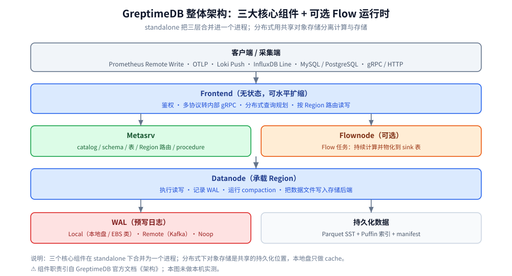
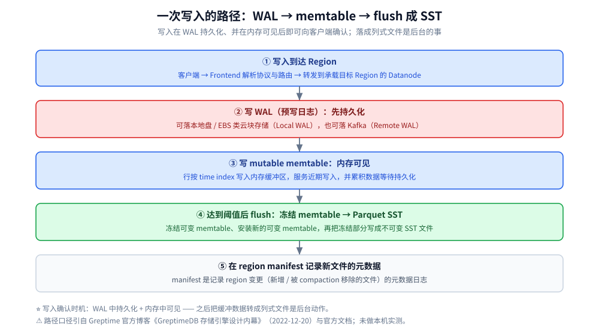
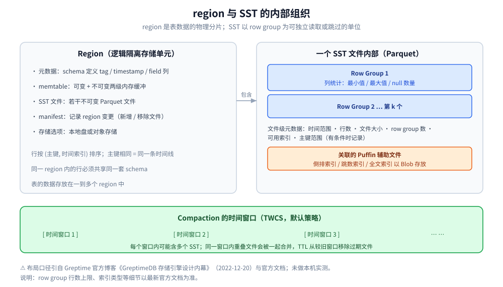

# 架构与存储引擎

> 自顶向下拆开 GreptimeDB：三层组件分工、Mito 为什么选 LSM-tree、写入三步、
> region 与 SST 内部组织，以及 compaction 与 TTL 如何维持 LSM 的健康。
>
> 素材来源：Greptime 官方博客《GreptimeDB 存储引擎设计内幕》（2022-12-20）的读后整理，**按主题归纳而非逐字摘录**；其余内容整理自个人学习笔记与官方文档，素材见 [素材清单](../../../../素材清单.md)。

---

## 一、GreptimeDB 的整体架构分成哪几层？

**本节要点**：先分清「谁负责什么」，再看 standalone 与 distributed 的区别——
这条边界决定了后面 region、WAL、compaction 这些概念到底运行在哪一层。

### 1.1 三个核心组件与一个可选运行时

据官方文档《架构》，分布式模式包含三个核心组件，以及一个可选的 Flow 运行时：

| 组件 | 职责 |
|---|---|
| **Metasrv** | 管理 catalog、schema、table、Region 路由、procedure 和调度 metadata |
| **Frontend** | 接收客户端协议请求，执行鉴权和分布式查询规划，并根据 Metasrv metadata 转发读写请求 |
| **Datanode** | 承载 Region，执行读写，记录 WAL，运行 compaction，并把数据文件持久化到配置的本地或对象存储后端 |
| **Flownode（可选）** | 运行 Flow 任务，持续计算并把派生数据物化到 sink table |

⭐ 一条容易被忽略的补充：官方文档强调「**对象存储不是系统中唯一的状态**」——
WAL 记录已接收的写入，Metasrv 管理集群 metadata 与 Region 路由，本地磁盘可以缓存远端数据。
也就是说，**持久化数据文件只是状态的一部分**，可用性与 failover 还取决于 WAL 模式、Metasrv 部署、
Region 放置、共享存储和可用 Datanode。

### 1.2 standalone 与 distributed 的关系

- **standalone**：由**一个 GreptimeDB 进程**提供上述数据库能力，不需要分别部署各组件。
  据官方文档《存储位置》，standalone 使用配置的**本地或对象存储**后端，适合本地与单节点部署。
- **distributed**：使用共享对象存储，把持久化数据文件与计算节点分离，**计算和存储容量可以分别调整**。

⚠️ 两者的关系是**同一套数据库功能的两种打包方式**，不是两个不同的数据库：

| 维度 | standalone | distributed |
|---|---|---|
| 组件形态 | 三组件合并进一个进程 | Metasrv / Frontend / Datanode 分别部署 |
| 持久化位置 | 本地文件系统或对象存储 | 通常使用共享对象存储 |
| 扩缩方式 | 单机 | 计算与存储分别扩缩 |
| 上线细节 | 见 [部署与集群运维.md](部署与集群运维.md) | 见 [部署与集群运维.md](部署与集群运维.md) |

### 1.3 写入路径与查询路径的分工

官方文档把工作方式拆成两条路径，先记住主干（细节分别在本文第四、五节与
[索引设计与查询优化.md](索引设计与查询优化.md) 展开）：

- **写入路径**：客户端发数据 → Frontend 解析 table / Region 路由 → 拆分请求转发到目标 Datanode →
  Datanode 写内存与 WAL，之后在达到 flush 条件时把不可变数据文件写入存储后端。
- **查询路径**：客户端提交 SQL / PromQL / 受支持的查询 API → Frontend 规划并下发到相关 Region 所在 Datanode →
  Datanode 读取内存与持久化文件，使用本地 cache、数据裁剪与索引 → Frontend 合并结果返回。

## 二、Mito 为什么选择 LSM-tree 而不是 B+ 树？

**本节要点**：存储引擎选型不是风格偏好，是被**负载形状**逼出来的。理解了时序数据的三个特征，
LSM-tree 的选择就成了自然结论。

### 2.1 时序数据的三个特征

Greptime 官方博客《GreptimeDB 存储引擎设计内幕》（2022-12-20）开篇就点明了时序数据与通用事务负载的差别：

- **写入频繁，绝大多数行都是带着更新时间戳追加进来的**；
- **查询通常只关心某个时间范围、部分时间线以及少数几列**；
- **删除和更新虽然存在，但远不如插入常见**。

⭐ 这三条是本篇乃至整个存储引擎的「题眼」：它决定了新数据可以先攒在内存、批量落成不可变文件，
也决定了读取可以靠「先缩时间范围、再选时间线、最后只读需要的列」来省工作。

### 2.2 LSM-tree 如何贴合这些特征

博客给出的解释是：在 LSM-tree 中，新数据**先写入内存和持久化日志，之后再 flush 成不可变文件**。
这种方式非常适合时序负载，因为它：

- **让写入路径保持高效**——追加写入不需要在磁盘上做就地更新；
- **把大量小写入聚合成更大的顺序文件写入**——顺序写对磁盘与对象存储都更友好。

对照 B+ 树：B+ 树擅长按主键做就地读写的通用事务负载，但代价是随机写与页分裂；
而时序负载里「按主键随机更新」并不是主路径，反而是「持续追加 + 按时间范围扫描」占绝对多数。
⚠️ 这里只是解释**设计动机**，不是说 B+ 树不好——两种结构服务的是不同的负载形状。

## 三、region 是什么？它在存储里扮演什么角色？

**本节要点**：region 是「表」在存储层的物理落点。理解它，才能理解为什么表数据会分片、
为什么元数据要记在 manifest、为什么 compaction 是 region 内部的事。

据官方文档《存储引擎》：

> 数据在存储引擎中以 `region` 的形式存储，`region` 是引擎中的一个逻辑隔离存储单元。
> `region` 中的行必须具有相同的 `schema`（模式）……数据库中表的数据存储在一到多个 `region` 中。

博客《GreptimeDB 存储引擎设计内幕》补充了 region 的内部构成——**每个 region 拥有自己的**：

| region 内部 | 作用 |
|---|---|
| 元数据 | 该 region 的 schema（定义 tag 列、timestamp 列、field 列） |
| 内存缓冲区（memtable） | 服务近期写入、并在持久化前累积数据 |
| SST 文件 | 不可变的存储文件 |
| manifest | 记录 region 变更（例如新 flush 出的文件，或被 compaction 移除的文件）的元数据日志 |
| 存储选项 | 该 region 数据落在哪里（本地盘或对象存储） |

⭐ 三条推论：

1. **一个表可以数据在一到多个 region 中**——region 是表分片后的物理单位；
2. **同一 region 内的行必须共享同一套 schema**——schema 变更会牵连 region 的结构；
3. **manifest 是「region 的变更日志」**——新文件、被移除的文件都由它记录，是恢复与可见性的关键元数据。

## 四、一次写入要经过哪几步？

**本节要点**：写入路径只有三步，但每一步都有明确目的：先保命（WAL 持久化）、再服务（内存可见）、
后整理（flush 成列式文件）。记住「何时向客户端确认」是理解整个写入语义的钥匙。

### 4.1 写入三步

博客给出的写入路径主要分为三步：

1. **先把进入的行写入 WAL**。WAL（write-ahead log，预写日志）在数据被 flush 成不可变文件之前先保证其持久化。
2. **把同样的行写入一个可变的 memtable**。memtable 是一块内存缓冲区，用于服务近期写入，并在持久化前累积数据。
3. **当 memtable 达到持久化条件时，把它 flush 成 Parquet 格式的 SST 文件**，并在 region manifest 中记录这些文件的元数据。

⭐ 由这三步直接推出**写入确认时机**（博客原文口径）：

> 当一条写入在 WAL 中持久化、并在内存中可见后即可向客户端确认，随后在后台再把缓冲的数据转换成列式文件。

换句话说，「客户端收到成功」并不代表数据已经变成列式文件、更不代表已经落到对象存储；
**落成 SST 与写 manifest 是后台动作**。这一点在排障时非常关键——写入成功与查询可见之间，
隔着一层「memtable 与 SST 的合并读取」。

### 4.2 WAL 可以落在哪

- **博客口径（2022-12）**：根据部署方式不同，WAL 可以存储在**本地磁盘、EBS 之类的云块存储，或者 Kafka** 上。
- **当前文档口径**：官方文档《WAL 概述》把 WAL 分为**三种方案**——
  **Local WAL**（嵌入式存储引擎 raft-engine，集成在 Datanode 进程内）、
  **Remote WAL**（用 Apache Kafka 作为外部 WAL 存储）、
  **Noop WAL**（无操作实现，用于紧急情况，不存储任何数据）。

⚠️ 两处差异：博客把「本地盘 / 云块存储 / Kafka」并列，而当前文档把「本地盘与云块存储」都归入
**Local WAL**（云环境中结合 EBS / Persistent Disk 可实现零 RPO），并把 **Noop WAL** 单列为应急选项。
以当前文档为准。

## 五、数据在 SST 文件内部是怎么组织的？

**本节要点**：SST 内部的组织决定了「查询能跳过什么」。记住三层结构——
**文件级元数据 → row group → 列统计**，再叠加 **time window**（供 compaction 与 TTL 使用）。

### 5.1 row group 与列统计

博客与官方文档一致：memtable 被 flush 时，Mito 把其中的行写入不可变的 **Apache Parquet** SST 文件。

- 每个 Parquet SST 会被切分成若干 **row group**，row group 是 Parquet 能够**高效读取或跳过的基本单位**；
- 对每个 row group，Parquet 存储**列统计信息**，例如**最小值、最大值和 null 数量**。

⭐ 正是这条「row group + 列统计」给了后面第二节索引篇里 min-max 剪枝的依据：
**如果某个 row group 的统计能证明其中没有任何行可能匹配谓词，那么这个 row group 就会被跳过。**

补充（当前文档口径）：SST 内部行按 `(primary key, time index)` 排序——
具有相同 primary key（tag 列）的行属于同一条时间序列，会**连续存储并按时间戳排序**；
对于没有 primary key 的 append-only 表，行仅按 time index 排序。这种局部性让扫描单条时间线更省，
也有助于提升压缩效果。

### 5.2 文件级元数据与 time window

博客列举了 Mito 记录的**文件级别元数据**：文件时间范围、行数、文件大小、row group 数量、可用索引，以及在有条件时记录主键范围。

| 文件级元数据 | 用途 |
|---|---|
| 文件时间范围 | 时间范围剪枝：与查询时间范围不相交的文件直接跳过 |
| 行数 / 文件大小 / row group 数量 | 估算扫描代价、规划并行 |
| 可用索引 | 记录该 SST 上有哪些索引可用（配合 Puffin 文件） |
| 主键范围 | 有条件时记录，帮助按主键缩小候选文件 |

**time window（时间窗口）** 是布局中的另一块关键：博客说它「是一段时间戳范围，后续会被 compaction
和数据保留（retention）所使用」。它把 region 的数据按时间切成一个个桶——
T = 一个时间窗口对应一个时间桶，桶里可能包含多个 SST 文件。

### 5.3 内部列：为合并、去重与删除服务

据当前文档口径，除了表中的列，Mito 还会在每个 SST 文件中存储三个**内部列**，
以便在从多个 memtable 和 SST 文件读取时正确地**合并、去重并应用删除**：

| 内部列 | 含义 |
|---|---|
| `__primary_key` | 行的编码后 primary key（tags） |
| `__sequence` | 行的 sequence number |
| `__op_type` | 行的操作类型（put 或 delete） |

⚠️ **博客口径 vs 当前文档口径**：博客描述为「编码后的主键数据、序列号（sequence number）和操作类型
（operation type）」三个内部列，但当时**没有给出列名**；当前文档明确命名为
`__primary_key` / `__sequence` / `__op_type`。二者是同一设计，以当前文档为准。

⚠️ **SST 格式**（当前文档新增，博客未提及）：Mito 支持 `flat` 与 `primary_key` 两种 SST 格式。
`flat` 是新表的**默认格式**，适用于各种 primary key 基数包括高基数 key；`primary_key` 是为兼容旧表保留的遗留格式。
Flat SST 成为默认发生在 **v1.0 GA（2026-04-08）**，属于博客写作之后的演进。

## 六、compaction 与 TTL 如何让 LSM 保持健康？

**本节要点**：没有 compaction，LSM 会因小文件与重叠文件不断累积而读取代价越来越高。
TWCS 按时间窗口分组来合并，TTL 则从旧窗口移除过期文件。

### 6.1 compaction 为什么必要

博客的解释很直接：**如果没有 compaction，大量小文件或相互重叠的 SST 文件会不断累积，使读取代价越来越高。**
在 compaction 过程中，Mito 会：

1. 读取选定的 SST 文件；
2. 合并其中的行；
3. 写出新的 SST 文件；
4. 在需要时更新相关索引元数据；
5. 通过 region manifest 提交结果。

⭐ 注意第 5 步：**compaction 的结果也走 manifest 提交**——这再次说明了 manifest 作为
「region 变更日志」的枢纽地位——新 flush 的文件与 compaction 后移除的文件，都靠它记录。

### 6.2 默认策略 TWCS：按时间窗口分组

- 博客：**Mito 默认使用时间窗口压缩策略（Time Window Compaction Strategy，简称 TWCS）**，
  它**按时间戳范围把候选文件分组**，因此同一窗口内的文件会被一起 compaction。
- 当前文档：`Compactor` 通过 compaction 把小的 SST 合并为大的 SST，**默认使用 TWCS 策略**；
  可按表配置 `compaction.twcs.time_window`、`compaction.twcs.trigger_file_num`、
  `compaction.twcs.max_output_file_size` 等参数。

⭐ 为什么 TWCS 适合时序：新数据总是落在最新的时间窗口，而旧窗口一旦写满就很少再被写入，
于是「同一窗口内重叠的文件」是最值得合并的对象；跨窗口的合并通常没必要。这让 compaction 的工作量更可控。

### 6.3 TTL 如何移除过期文件

- 博客：当一张表配置了 TTL 时，compaction **还可以移除那些数据落在保留窗口之外的过期 SST 文件**；
  TTL 可以「从较旧的桶中移除过期文件」。
- 当前文档：表级 `ttl` 是一个时间范围字符串（如 `'7d'`、`'1h'`），
  未设置表示数据永不删除；数据库级 TTL 会被没有单独设置的表继承。

⚠️ **博客口径 vs 当前文档口径**：博客写于 2022-12，把 TTL 与 compaction 描述为强绑定；
当前文档把 TTL 作为**表 / 数据库级别的选项**独立配置，compaction 结合 TTL 清理过期数据。
两者不冲突，但配置入口以当前文档为准。

## 使用：把「写入 → 存储 → 合并」串成一条线

把本文六个问题串起来，就得到一条完整的生命周期链路（后两篇分别展开前半段与后半段的细节）：

| 阶段 | 发生了什么 | 关键结构 | 关联篇目 |
|---|---|---|---|
| ① 定位 | 数据是「以追加为主的时间索引数据」 | — | [定位与适用场景.md](定位与适用场景.md) |
| ② 建模 | tag 列构成主键、timestamp 列构成时间索引 | `PRIMARY KEY` / `TIME INDEX` | [数据模型与写入路径.md](数据模型与写入路径.md) |
| ③ 写入 | 先 WAL 持久化，再写 memtable，确认后即可返回 | WAL / memtable | [数据模型与写入路径.md](数据模型与写入路径.md) |
| ④ 落盘 | memtable 达阈值后 flush 成 Parquet SST，manifest 记元数据 | SST / manifest / row group | 本篇第五节 |
| ⑤ 查询 | 时间范围 → row group 统计 → 索引，逐级剪枝 | 文件元数据 / 列统计 / Puffin | [索引设计与查询优化.md](索引设计与查询优化.md) |
| ⑥ 维护 | compaction 合并重叠文件，TTL 移除过期窗口 | TWCS / time window | 本篇第六节 |

⭐ 一句话总结：**region 决定了「存哪儿」，LSM 决定了「怎么写」，SST + row group 决定了「能剪谁」，TWCS + TTL 决定了「怎么维持长期健康」。**

## 延伸追问

- **Mito 是 GreptimeDB 唯一的存储引擎吗？** → 不是。官方文档还提到 **Metric Engine**——
  它基于 Mito Engine 并复用其存储能力，用共享的物理宽表承载多个逻辑指标表。本文聚焦 Mito。
- **为什么说是「region 级」而不是「表级」的存储单元？** → 因为一个表的数据存储在一到多个 region 中，
  每个 region 有自己的元数据 / memtable / SST / manifest / 存储选项；表是逻辑视图，region 是物理落点。
- **memtable 有几级？** → 当前文档口径：写入可变 memtable；flush 时**冻结可变 memtable**、
  安装一组新的可变 memtable 接收写入，再把冻结的 memtable 写为 SST 文件。博客的表述与之一致。
- **写入成功后立刻可查吗？** → 可见性与确认是两件事。确认发生在「WAL 持久化 + 内存可见」之后，
  而查询要跨 memtable 与 SST 文件做合并读取；具体可见性语义与去重规则见
  [数据模型与写入路径.md](数据模型与写入路径.md)。
- **Puffin 是什么？为什么单独放索引？** → Puffin 是一种辅助文件格式，把索引数据放在 SST 元数据旁边，
  而不塞进主 Parquet 数据文件内部；这样数据文件与索引文件可以一起管理、一起缓存、一起跳过。
  详见 [索引设计与查询优化.md](索引设计与查询优化.md)。
- **一个 SST 会跨越多个时间窗口吗？** → 据当前文档，**一个 SST 可能跨越多个 compaction time window**；
  这让布局与时间窗口不是严格的一一对应，需以文档为准。
- **这篇博客的结论还能直接照抄吗？** → 主框架（LSM / region / 写入三步 / row group / Puffin / TWCS）稳定，
  但细节随版本演进（SST 格式、内部列命名、WAL 三模式、索引类型）。凡有出入处以最新官方文档为准。

## 关联

- [README.md](README.md) — 本目录导读、版本坐标与学习路径
- [数据模型与写入路径.md](数据模型与写入路径.md) — 把本文的写入路径落到表模型与写入语义上
- [索引设计与查询优化.md](索引设计与查询优化.md) — 把本文的 SST / row group / Puffin 结构用到查询剪枝上
- [部署与集群运维.md](部署与集群运维.md) — 三层组件与 WAL 模式的具体部署、Region 迁移与故障切换
- [定位与适用场景.md](定位与适用场景.md) — 这些设计到底为哪类负载服务
- [Flow流计算引擎.md](Flow流计算引擎.md) — 可选的 Flownode 与 sink 表如何物化派生数据
- [数据库选型对比.md](../../数据库选型对比.md) — 时序存储在整个存储版图中的位置
> 反向引用（本篇被下列文档引到）：[架构与存储引擎.md](../../列式数据库/ClickHouse/架构与存储引擎.md)、[SQL查询与跨信号关联.md](SQL查询与跨信号关联.md)、[写入协议与数据接入.md](写入协议与数据接入.md)、[性能调优与基准测试.md](性能调优与基准测试.md)、[选型对比与落地案例.md](选型对比与落地案例.md)、[架构与存储引擎.md](../VictoriaMetrics/架构与存储引擎.md)
