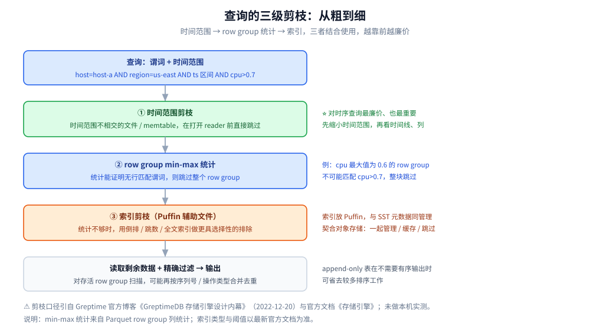

# 索引设计与查询优化

> 讲清 Mito 扫描一条查询时的三级剪枝（时间范围 → row group min-max 统计 → 索引）、
> 索引为什么放在 Puffin 文件里、支持哪些索引类型，以及谓词下推与 `EXPLAIN` 的读法。
>
> 素材来源：Greptime 官方博客《GreptimeDB 存储引擎设计内幕》（2022-12-20）的读后整理，**按主题归纳而非逐字摘录**；其余内容整理自个人学习笔记与官方文档，素材见 [素材清单](../../../../素材清单.md)。

---

## 一、Mito 扫描一次查询要经过几道剪枝？

**本节要点**：答案不是「一道」，而是**三道从粗到细、组合使用**的剪枝。
Mito 的核心设计思想就是「避免不必要的工作」——每一道都在回答「这批数据能不能直接跳过」。

### 1.1 三级剪枝的顺序

据博客《GreptimeDB 存储引擎设计内幕》，一次扫描从**查询可见的数据**开始：当前的 memtable 和相关的 SST 文件；
它同时知道查询的**谓词和时间范围**，并用这些信息减少需要打开、解码和过滤的数据量。博客强调：

> 关键在于 Mito 并不依赖单一的剪枝机制，而是把**时间范围、row group 统计信息和索引**结合起来使用。

当前文档《存储引擎》把它总结为「从粗到细」的三步：

| 顺序 | 剪枝手段 | 剪掉的对象 | 代价 |
|---|---|---|---|
| ① | **时间范围裁剪** | 时间范围与查询不相交的**文件 / memtable** | 最低（无需打开 reader） |
| ② | **Row group min-max 统计** | 统计能证明无行匹配谓词的**整个 row group** | 低（读元数据即可） |
| ③ | **索引**（倒排 / 跳数 / 全文） | 统计无法处理的谓词所命中的 row group 或行 | 较高（要读 Puffin 里的索引数据） |

### 1.2 为什么是「组合使用」

因为三道剪枝各自解决不同粒度的问题，互补而非替代：

- 时间范围解决**粗粒度**：整个文件要不要打开；
- row group 统计解决**中粒度**：一个文件里哪几块要解码；
- 索引解决**选择性**：统计区分不了的谓词（例如「某列等于某个具体值」）交给索引。

⭐ 博客的收尾句很好地概括了这套设计——**时间范围跳过整个文件，min-max 统计信息跳过 row group，索引剪除具有选择性的谓词**。



## 二、时间范围剪枝为什么最廉价也最重要？

**本节要点**：因为它是唯一「**在打开 reader 之前**就能做」的剪枝，且正好命中时序查询最普遍的过滤条件——
时间。

博客的口径：

> Mito 首先从时间索引上的谓词中提取时间范围。那些**存储时间范围与查询范围不相交的文件和 memtable，在打开 reader 之前就可以被跳过**。对于时序数据来说，这通常是最廉价、也最重要的剪枝步骤。

当前文档《存储引擎》把它列为第 1 步，并同样强调：**如果文件和 memtable 的时间范围与查询时间范围不相交，就会在打开 reader 之前被跳过**；对于时间序列查询，这通常是成本最低且最有效的步骤。

⭐ 两条实用推论：

1. **查询一定要带上时间范围**。省略时间范围等于放弃最便宜的那道剪枝，
   扫描会退化到「把所有候选文件都当相关」。
2. **按时间分区 / 分窗口的收益是双份的**：写入侧 TWCS 按时间窗口组织文件，
   读取侧时间范围剪枝正好按时间窗口跳过文件——两者共用同一套「时间是主轴」的设计。

## 三、row group 的 min-max 统计能剪掉什么？

**本节要点**：它剪掉的是「统计上不可能匹配」的整块数据。代价很低，效果依赖数据的局部性。

博客给出的机制与例子：

> 接下来，Mito 使用 min-max 统计信息。如果某个 row group 的统计信息能够证明其中没有任何行可能匹配谓词，
> 那么这个 row group 就会被跳过。例如，**一个 `cpu` 最大值为 `0.6` 的 row group 不可能匹配 `cpu > 0.7`**。
> row group 统计信息比较粗粒度，但代价低廉，在数据具有局部性时效果很好。

这些统计来自哪里？官方文档《数据持久化与索引》说明：**Parquet 在每个 column chunk 的元数据中保存 row group 级列统计信息，例如最小值、最大值和 null 数量**；Page 元数据和可选的 column index 可以提供粒度更细的统计信息。

⭐ 为什么说「粗粒度但代价低廉」：

- **便宜**：只需读元数据即可判断，不必解码整块数据；
- **粗**：它只能回答「这块数据有没有可能匹配」，不能精确定位到行——所以还需要第三道索引；
- **依赖局部性**：如果数据在 row group 内分布很散（例如同一列里既有 0.1 也有 0.9），
  min-max 区间就会很宽，剪不掉任何东西。

⚠️ 这也解释了「建表时列怎么排、主键怎么选」为什么会影响查询：良好的局部性让 min-max 区间更窄、更可剪。

## 四、索引为什么放在 Puffin 文件里？

**本节要点**：因为要「跟着数据文件走」。把索引与 SST 元数据绑在一起管理，
才能在对象存储场景下实现「一起管理、一起缓存、一起跳过」。

博客的原文口径：

> 当统计信息还不够时，索引可以提供更具选择性的剪枝。索引是为一列或多列构建的辅助数据，
> 使得扫描在解码数据列之前就能排除更多的行或 row group。Mito 把索引数据存储在 **Puffin 文件**中。
> Puffin 是一种辅助文件格式，用于把索引数据放在 **SST 元数据旁边**，而不必塞进主 Parquet 数据文件内部。

当前文档《数据持久化与索引》进一步明确：

- **只有当某个 SST 存在「已配置且适用的索引输出」时**，GreptimeDB 才把这些索引写入**与该 SST 关联的 Puffin 文件**；
  **没有适用索引的 SST 不需要生成 Puffin 文件**；
- Puffin 是**索引 Blob 及其元数据的容器**，使不同索引结构可以**共用一个文件**。

⭐ 博客点出了它与对象存储的契合关系（这一段值得原文记住）：

> 这种设计非常契合对象存储：**数据文件和索引文件可以一起管理、在有用时一起缓存，并在元数据证明它们与某次查询无关时一起被跳过。**

也就是说，索引不是「另一个独立的系统」——它和 SST 是同一份 region 状态的一部分，
生命周期与 SST 对齐（SST 被 compaction 移除时，相关索引元数据也会被更新）。

## 五、GreptimeDB 支持哪些索引类型？

**本节要点**：当前文档给出的索引家族是**倒排索引、跳数索引、全文索引**三类，
它们都以 Blob 形式存进 Puffin 文件。⚠️ 博客只给出了「索引」这一抽象层，具体类型以最新官方文档为准。

### 5.1 倒排索引（Inverted Index）

官方文档明确：**在 v0.7 版本中，GreptimeDB 引入了倒排索引来加速查询**。它的原理借自全文搜索：

- 概念映射：**「单词」**在 GreptimeDB 中指**时间线的列值**；**「文档」**指**包含多个时间线的数据段**；
- 作用：让 GreptimeDB **跳过不符合查询条件的数据段**，从而提高扫描效率；
- 结构：按列构建，每个列索引包含一个 **null bitmap、多个 posting bitmap 和一个 FST**；
  Blob footer 记录定位与解码各列索引所需的 offset、size 和元数据；
- **FST（Finite State Transducer）** 以紧凑格式存储「列值 → Bitmap 位置」的映射，并支持正则等复杂搜索；
  Bitmap 维护数据段 ID 列表，每个位表示一个数据段；
- 分段：一个 SST 被分割成多个索引数据段，每段行数由 `index.inverted_index.segment_row_count` 控制，
  **默认 `1024`**；值越小索引越精确、查询往往更好，但索引存储成本更高。

### 5.2 跳数索引与全文索引

- **跳数索引（skipping index）**：官方文档说明其**基于 bloom filter**；在建表中通过列选项
  `SKIPPING INDEX` 声明，用于加速对**稀疏数据**的查询。
- **全文索引（fulltext index）**：通过列选项 `FULLTEXT INDEX` 声明，仅适用于**字符串类型列**，
  用于加速全文搜索。从 **v0.14（2025-04）** 起官方持续增强全文检索能力。

⭐ 一句话区分：**倒排索引面向「稠密」的等值 / 正则类过滤，跳数索引面向「稀疏」数据，全文索引面向文本检索。**

### 5.3 索引与元数据的关系

- 博客：当 Mito 写出 SST 文件时，它可以同时为那些**能从选择性剪枝中获益的列**构建索引文件；
  **SST 元数据会记录存在哪些索引、各自覆盖哪些列**；
- 当前文档：在**扫描规划阶段**，Mito 会检查**查询谓词是否能够利用可用的索引**；
  索引的结果会与经过时间范围和 min-max 剪枝后**存活下来的 row group 相结合**。

⚠️ **查询规划依赖元数据**：如果某个谓词在写入时没有对应索引，规划阶段就用不上它——
这也意味着「事后补索引」通常要等数据被重新写出才生效。索引的配置语法与边界以最新官方文档为准。

## 六、查询优化有哪些实践？EXPLAIN 怎么读？

**本节要点**：优化实践的本质是「让三道剪枝都能用上」；`EXPLAIN` 则是把「哪道剪枝生效了」量化出来的工具。

### 6.1 四条优化实践

| 实践 | 为什么有效 | 对应剪枝 |
|---|---|---|
| **谓词下推** | 把过滤条件下推到扫描器，才能驱动 row group 剪枝、索引应用与精确过滤 | ②③ |
| **时间范围裁剪** | 查询带上时间范围，最便宜的剪枝才有对象可剪 | ① |
| **只读需要的列** | 列式存储只读被投影的列，避免解码整行 | 减少 I/O |
| **主键（tag）等值过滤优先** | 主键决定排序与局部性，等值过滤最贴合「按时间线扫描」 | ①③ |

- 当前文档在 `EXPLAIN` 的 verbose 输出里明确把下推的谓词称为 **`filters`：下推到扫描器的静态物理谓词表达式**，
  并注明「这些谓词可能驱动 row group 剪枝、索引应用和精确过滤」；
- **`projection`：投影剪枝后的输出列名**则对应「只读需要的列」。

### 6.2 EXPLAIN / EXPLAIN ANALYZE 的读法

语法（官方 `EXPLAIN` 文档）：

```sql
EXPLAIN [ANALYZE] [VERBOSE] SELECT ...
```

- `EXPLAIN`：只看**执行计划**，`plan_type` 区分 `logical_plan` / `physical_plan`；
  `MergeScan` 负责合并多个 region 的查询结果，物理计划 `MergeScanExec` 的 `peers` 数组包含将要扫描的 region ID；
- `EXPLAIN ANALYZE`：**真正执行语句**，并测量每个计划节点耗时与输出行数等；
- `EXPLAIN ANALYZE VERBOSE`：提供更详细的信息，包含**扫描器指标**。

⭐ 诊断查询「剪得好不好」，看 verbose 里的**剪枝计数**（字段名以官方文档为准，下列为官方示例中的字段）：

| 指标 | 含义 |
|---|---|
| `rg_total` | 剪枝前考虑的 row group 数量 |
| `rg_minmax_filtered` | 被 min-max 剪枝过滤的 row group 数 |
| `rg_inverted_filtered` | 被倒排索引过滤的 row group 数 |
| `rg_bloom_filtered` | 被 bloom filter（跳数索引）过滤的 row group 数 |
| `rg_fulltext_filtered` | 被全文索引过滤的 row group 数 |
| `rows_before_filter` | 行级过滤前候选 row group 中的行数 |
| `pruner_cache_hit` / `pruner_cache_miss` | 构建文件范围时 pruner builder 缓存的命中 / 未命中 |

⚠️ 官方文档明确提醒：**verbose 模式下的扫描器指标是诊断文本，不是稳定的公开 API**，
可选的零值字段通常会被省略。因此不要把字段名写进自动化断言。

## 使用：用一个例子走一遍三级剪枝

取博客里的那条查询：

```sql
SELECT ts, cpu
FROM host_metrics
WHERE host = 'host-a'
  AND region = 'us-east'
  AND ts >= '2026-05-29 10:00:00'
  AND ts < '2026-05-29 11:00:00'
  AND cpu > 0.7;
```

逐级走一遍（这一步的每一跳都对应一个已存在的结构，不是假想流程）：

| 步骤 | 用到什么 | 剪掉什么 | 依据 |
|---|---|---|---|
| ① 时间范围 | `ts >= …` 与 `ts < …` 两个时间索引谓词 | 时间范围与 `[10:00, 11:00)` 不相交的**文件与 memtable** | 文件级元数据里的**时间范围** |
| ② min-max | `cpu > 0.7` 与主键等值过滤 | **`cpu` 最大值 ≤ 0.7 的 row group**（如最大值为 `0.6` 的块） | row group 的**列统计** |
| ③ 索引 | `host` / `region` 等值 + `cpu` 谓词 | 统计区分不了的 row group / 行 | **Puffin** 中的倒排 / 跳数 / 全文索引 |
| ④ 精确过滤 | 剩余数据 | 逐行应用精确谓词 | 扫描器在解码后执行精确过滤 |

⭐ 读这段要走出的三个结论：

1. **顺序有意义**：① 最便宜、先做；能靠 ① 解决的绝不留给 ③；
2. **时间范围是「入场券」**：没有它，②③ 的候选集就是「全部文件」，代价成倍；
3. **`cpu > 0.7` 这类范围谓词**在 ② 有效的前提是 `cpu` 在 row group 内**有局部性**；
   如果是低选择性或分布很散的列，就要靠 ③ 的索引。

## 延伸追问

- **三级剪枝一定会全跑一遍吗？** → 不会。它们是「按代价递增依次尝试」的关系：
  ① 能剪掉就不必开 reader；② 能证明不匹配就不必读索引；③ 只在统计不够时才用。
- **min-max 统计和索引有什么区别？** → 统计是 Parquet 自带的 row group 级元数据（min / max / null 数），
  便宜但粗；索引是为**有选择性**的谓词额外构建的辅助数据，存在 Puffin 里，更细但更贵。
- **为什么索引要放 Puffin 而不是塞进 Parquet？** → 为了「跟着 SST 走」：数据文件与索引文件可以
  一起管理、一起缓存、一起跳过，契合对象存储场景。
- **倒排索引里的「数据段」是什么粒度？** → 把一个 SST 分割成多个**等行数**的数据段，
  行数由 `index.inverted_index.segment_row_count` 控制，**默认 `1024`**；调小更精确但索引更大。
- **append-only 表在扫描时有什么不同？** → 博客说明：对可能含更新 / 删除的表，Mito 会按序列信息与
  操作类型合并去重；对 append-only 表，当查询不要求输出有序时间线时，**扫描可以省去较多的排序工作**。
- **`EXPLAIN` 输出里哪些信号说明「剪枝没生效」？** → 关注 row group 相关计数：
  若 `rg_total` 很大而各 `rg_*_filtered` 接近 0、`rows_before_filter` 很高，
  说明谓词可能没能利用统计或索引；具体字段以官方文档为准。
- **索引类型会随版本变化吗？** → 会。倒排索引自 v0.7 引入，全文检索在 **v0.14（2025-04）** 起持续增强，
  向量索引等仍在演进中。⚠️ 博客（2022-12）只给出「索引」这一抽象层，
  具体类型与配置以最新官方文档为准。

## 关联

- [README.md](README.md) — 本目录导读与版本坐标
- [架构与存储引擎.md](架构与存储引擎.md) — 本文依赖的 region / SST / row group / manifest 结构
- [数据模型与写入路径.md](数据模型与写入路径.md) — 主键与时间索引为什么能成为剪枝维度
- [SQL查询与跨信号关联.md](SQL查询与跨信号关联.md) — 把这些剪枝用到实际的 SQL 查询上
- [PromQL兼容查询.md](PromQL兼容查询.md) — 指标查询走 PromQL 时的兼容边界
- [性能调优与基准测试.md](性能调优与基准测试.md) — 从表设计、缓存与 compaction 参数层面进一步调优
- [存储选型.md](../../存储选型.md) — 时序存储在整个存储版图中的位置
> 反向引用（本篇被下列文档引到）：[Flow流计算引擎.md](Flow流计算引擎.md)
