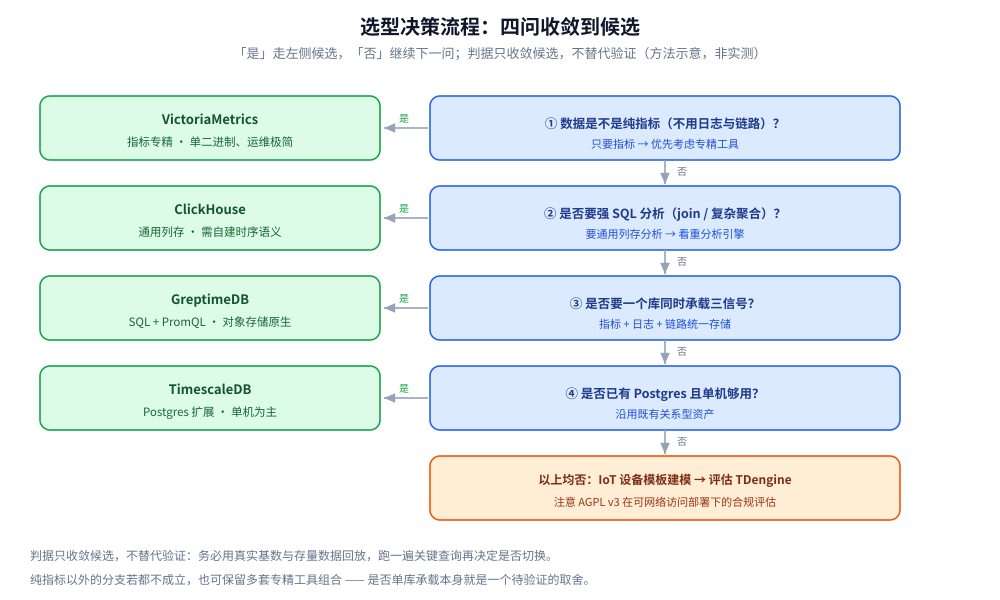

# 选型对比与落地案例

> GreptimeDB 与 InfluxDB / TimescaleDB / TDengine / VictoriaMetrics / ClickHouse 的横向对比，
> 以及三类典型落地场景 —— 回答「**什么条件下该选它、什么条件下不该**」。
>
> 内容整理自个人学习笔记，并参考各项目官方文档与 GreptimeDB 官方对比资料；素材见 [素材清单](../../../../素材清单.md)。
>
> ⭐ 边界先说清：本篇是**对竞品的横向对比 + 落地场景**。
> **可观测性栈层面的完整选型**（采集 / 存储 / 可视化分层）见
> [可观测性选型.md](../../../../06-工程实践/可观测性/可观测性选型.md)；
> **七类存储的横向定位**见 [存储选型.md](../../存储选型.md)。本篇不复述那两张表。

---

## 一、先按哪些维度拉横向对照表？

**本节要点**：时序库的选型不能只看「谁快」。真正决定**长期持有成本**的是七个维度：
**数据模型、查询语言、三信号支持、扩展方式、存储介质、运维复杂度、许可与成本**。

对照表（定性判断，非跑分）：

| 维度 | GreptimeDB | InfluxDB | TimescaleDB | TDengine | VictoriaMetrics | ClickHouse |
|---|---|---|---|---|---|---|
| 数据模型 | 时序表，Tag 即 `PRIMARY KEY` | Tag / Field（measurement） | Postgres 表 + Hypertable | 超级表（STable）+ 子表 | 指标（metric + label） | 通用列存宽表 |
| 查询语言 | **SQL + PromQL** | v1/v2: InfluxQL / Flux；v3: SQL + InfluxQL | SQL（Postgres） | 自有 SQL 方言 | PromQL / MetricsQL | SQL |
| 三信号支持 | **指标 + 日志 + 链路** | 指标为主 | 需自行扩展 | 时序为主（IoT） | **仅指标** | 通用 OLAP（需自建时序语义） |
| 扩展方式 | 计算存储分离、水平扩展 | v3 Core 单机；集群在企业版 | 单机为主（多节点已停售） | 分布式分片 | 单机版 / 集群版 | 分布式集群 |
| 对象存储 | **原生主存储** | v3 支持 | 本地盘为主（有分层） | 分布式本地/云 | 本地 + S3 | 本地 + S3 |
| 运维复杂度 | 中（有 Operator） | 中 | 低（沿用 Postgres 经验） | 中（要懂超级表） | **低（单二进制）** | 中高 |
| 许可 | **Apache 2.0** | v3 Core MIT/Apache 2.0；v2.x BSL 1.1 | Apache 2.0 + TSL | AGPL v3（社区版） | Apache 2.0 | Apache 2.0 |

⚠️ 读表纪律：**这张表是「能力边界」不是「优劣排名」**。
每个项目的最优场景不同 —— 下一节起逐个说清「它强在哪、你什么时候该选它」。

---

## 二、与 InfluxDB 比：语言断层与版本碎片化

**本节要点**：InfluxDB 是时序库的老牌选择，但它的**三个大版本在存储格式、查询语言、许可上都不同** ——
选型时要问的第一个问题不是「快不快」，而是「**我未来要不要跨版本**」。

- **v1 / v2**：TSM 存储引擎，查询语言是 InfluxQL 与 **Flux**；v2.x 的许可是 **BSL 1.1**；
- **v3**：用 **Rust 重写**，底层改写 **Apache Arrow / Parquet**，查询引擎基于 **Apache DataFusion**，
  查询语言变为 **SQL + InfluxQL**；v3 Core 的许可是 **MIT / Apache 2.0**；
- ⭐ **Flux 已进入维护模式**：官方明确 Flux 在 InfluxDB 3 中**不受支持**，
  继续为 v1/v2 用户提供支持但不再开发新特性；官方建议要「面向未来」就用 **InfluxQL 或 SQL**。
  如果代码里大量依赖 Flux，迁移到 v3 意味着**重写查询**；
- ⚠️ **v3 Core 是单机的**：集群、高可用与无限历史保留在**企业版 / 云版**里；
  InfluxDB 3 Core 的**查询时间范围限制在约 72 小时**（官方文档口径）。

**判据**：已经深度投入 InfluxDB 生态、且不打算跨大版本 → 留在 InfluxDB；
**想要一套长期稳定、SQL 为主、又能兼容线协议平滑迁移** → 可考虑 GreptimeDB。

---

## 三、与 TimescaleDB 比：Postgres 生态 vs 原生分布式

**本节要点**：TimescaleDB 的最大卖点是**它就是 PostgreSQL 的一个扩展** ——
你原有的 JDBC、ORM、备份、权限体系**全部直接复用**；代价是**扩展能力受 Postgres 单机边界约束**。

- 数据模型：Hypertable 按**时间 +（可选）空间**切成 chunk，**chunk 就是普通的 Postgres 表**；
- 压缩是**按 chunk 的可选能力**，叠加在 Postgres 行存之上；社区版自 **v2.18** 起提供
  **Hypercore 列存引擎**；
- ⚠️ **多节点分布式 hypertable 已在 v2.13 停止提供**，当前的扩展模型是**单机 Postgres + Hypercore**；
- 许可：**Apache 2.0 + TSL**（Timescale License）。

**判据**：团队已有成熟 Postgres 资产、数据量在**单机可承载**范围、且需要**关系型与时序混合查询**
（例如「设备表 join 业务表」） → TimescaleDB 的迁移成本最低；
**数据量会长期超出单机、要独立扩存储与计算** → 原生分布式架构（如 GreptimeDB）更合适。

---

## 四、与 TDengine 比：「一个设备一张表」的 IoT 模型

**本节要点**：TDengine 的核心抽象是**超级表（Super Table）+ 子表** ——
**「一个设备一张表」**，用超级表给同类设备做模板。这对**工业 IoT / 车联网**的设备建模非常自然。

- 数据模型：Super Table 定义模板，每台设备一张子表，天然适配「设备数极多、每个设备有固定字段结构」；
- 定位：**工业 IoT / 智能制造 / 车联网 / 能源监控**；工业协议（MQTT、OPC-UA）在企业版/云版提供；
- 查询语言：**自有 SQL 方言**（不是标准 SQL 全兼容）；
- 许可：核心 **AGPL v3**，企业版为商业许可。⚠️ AGPL 在**网络可访问的部署**下可能有源码披露义务，
  法务敏感的场景要先评估。

**判据**：场景是**重设备模型、以 IoT 为主、不需要原生 PromQL / OpenTelemetry** → TDengine 的建模很省事；
**场景是三信号齐全的可观测性、需要 PromQL + 标准 SQL** → GreptimeDB 更贴。

---

## 五、与 VictoriaMetrics / ClickHouse 比：指标专精 vs 通用分析

**本节要点**：这两个是**两种极端的专精**：VM 把**指标**做到极致，ClickHouse 把**通用列存分析**做到极致。
GreptimeDB 的位置在两者之间 —— **一个库同时承载三信号，且查询语言兼容 PromQL 与 SQL**。

**VictoriaMetrics**

- **只做指标**：官方定位是高性能、低资源占用的 metrics 存储，是 Prometheus 的长期存储替代；
- 查询语言 **PromQL + MetricsQL**（MetricsQL 是它自称更强的扩展）；**没有 SQL**；
- 形态：**单机版与集群版**，**Apache 2.0**，**单二进制、几乎零依赖、运维极简**；
- 强项：**高基数指标**、低内存占用、部署轻。

**ClickHouse**

- 通用**列存 OLAP**，聚合分析性能极强，**Apache 2.0**；
- ⚠️ 但它**不是时序数据库** —— 没有内建的时序语义（保留策略、降采样、PromQL 兼容），
  这些要**自己在表设计上实现**。

⭐ GreptimeDB 的差异化位置：**三信号统一存储 + SQL/PromQL 双接口 + 对象存储原生**。
换句话说，如果需求是「指标专精且运维越简单越好」，VM 更划算；
如果是「海量事件表的自由分析」，ClickHouse 更强；**要「一个库同时扛指标 / 日志 / 链路」时，才轮到 GreptimeDB**。

---

## 六、决策判据：什么条件下选谁？

**本节要点**：把上面五节压成**四个提问**。按顺序回答，基本能收敛到选择。

| 提问 | 若「是」 | 若「否」 |
|---|---|---|
| ① 数据类型是**纯指标**，还是**三信号齐全**？ | 纯指标 → 优先 VictoriaMetrics | 三信号 → 看 ② |
| ② 要不要**强 SQL 分析能力**（join、复杂聚合）？ | 要 → GreptimeDB / ClickHouse | 只要 PromQL → VM 或 GreptimeDB |
| ③ 要不要**单库承载**（避免多套系统对账）？ | 要 → GreptimeDB | 可接受多套 → 各用专精工具 |
| ④ 已有 **Postgres / Prometheus** 资产吗？ | 有 Postgres → TimescaleDB；有 Prometheus → VM / GreptimeDB | 都没有 → 按 ①~③ 重排 |

三条补充判据：

- **许可与合规**：AGPL（TDengine）在网络可访问部署下要评估源码披露义务；BSL（InfluxDB v2.x）亦有约束；
  **Apache 2.0**（GreptimeDB / ClickHouse / VictoriaMetrics 社区版）最宽松；
- **扩展模型**：数据量会长期超出单机 → 看**是否原生支持计算存储分离**；
- **迁移成本**：是否兼容已有的写入协议（如 Prometheus remote write / InfluxDB line protocol）。



---

## 七、三个类型化落地场景

**本节要点**：三个场景**只讲类型，不指名客户、不编造数字**。每个场景给「需求 → 为什么合适 → 注意点」。

### 7.1 可观测性统一存储

- **需求**：指标、日志、链路分散在 Prometheus / Loki / Tempo 三套系统里，
  跨信号关联（如「这个慢请求对应的日志」）要在三个系统之间手工跳转；
- **为什么合适**：GreptimeDB 用**一个库**存三类数据，支持 **PromQL 兼容查询**（原有 Grafana 面板可复用）
  与 **SQL 跨信号关联**（见 [SQL查询与跨信号关联.md](SQL查询与跨信号关联.md)）；
- **注意点**：**迁移要渐进**（见 7.3），别一次性把三套系统全切；高基数链路数据要配合索引与 append-only 表。

### 7.2 IoT 与车联网

- **需求**：设备数极大、每个设备固定字段、数据从边缘采集后汇聚到云端，需要**边云统一查询**；
- **为什么合适**：支持从 **ARM 边缘设备到云**的部署形态、**对象存储原生**降低长期存储成本、
  高基数主键下 `flat` SST 格式表现更好（见 [性能调优与基准测试.md](性能调优与基准测试.md) 第二节 2.4）；
- **注意点**：⚠️ 若核心诉求是**工业协议（MQTT/OPC-UA）+ 设备模板建模**，
  TDengine 的「超级表」模式可能更顺手 —— 这部分要**按建模习惯**权衡。

### 7.3 与 Prometheus 渐进共存

- **需求**：现有 Prometheus 体系不能停，但本地存储保留时间太短、查询越来越慢；
- **为什么合适**：GreptimeDB 支持 **Prometheus remote write / remote read**，
  可作为 Prometheus 的**长期存储**；写入侧只需把 `remote_write` 指向 GreptimeDB，
  **查询语言仍是 PromQL**，Grafana 面板不用改；
- **注意点**：**双写 + 比对**是稳妥的切换方式；查询语言兼容性细节见 [PromQL兼容查询.md](PromQL兼容查询.md)。

⚠️ **三个场景的共同纪律**：先用**存量数据回放**做一次真实查询验证，再决定是否切换；
**不要只看 benchmark 数字选型**（benchmark 见 [性能调优与基准测试.md](性能调优与基准测试.md) 第六节）。

---

## 使用：选型评审清单

**本节要点**：把这篇压成一份**评审会上逐条过**的清单。

1. **定信号面**：只要指标，还是指标 + 日志 + 链路？（决定候选集大小）
2. **定查询语言**：团队更熟 SQL 还是 PromQL？（决定迁移与培训成本）
3. **定规模**：三年后的数据量与写入速率是多少？**会不会长期超出单机？**（决定要不要原生分布式）
4. **定资产**：已有 Postgres？已有 Prometheus？（决定沿用的技术栈）
5. **定许可**：有没有 AGPL / BSL 的合规约束？（决定可选项）
6. **定运维**：团队能承担几套系统的运维？单库承载能省多少对账成本？
7. **定验证方式**：能不能用**真实存量数据回放**跑一遍关键查询？（**必做**）
8. **定迁移路径**：是否能**双写 + 渐进切换**，而不是一刀切？

```text
选择收敛路径（与第六节四问一致）：
  纯指标 ──────────────→ VictoriaMetrics
  三信号 + 强 SQL ─────→ GreptimeDB / ClickHouse（要时序语义则前者）
  已有 Postgres 且单机够 → TimescaleDB
  IoT 设备模板建模 ────→ 评估 TDengine
```

---

## 延伸追问

- **GreptimeDB 和 InfluxDB 最本质的差别是什么？** → InfluxDB 的三个大版本**存储格式、查询语言、许可都不同**，
  v3 还**不支持 Flux**；GreptimeDB 用**一套 SQL + PromQL 接口、一套存储**贯穿单机到集群。
- **Flux 还能用吗？** → 在 InfluxDB 1.x/2.x 上可以；在 **InfluxDB 3 中不受支持**，
  官方把它列为**维护模式**，并建议面向未来用 InfluxQL 或 SQL。
- **TimescaleDB 还能水平扩展吗？** → 目前扩展模型是**单机 Postgres + Hypercore 列存**
  （社区版自 v2.18 起提供）；**多节点分布式 hypertable 已在 v2.13 停止提供**。
- **TDengine 的「一个设备一张表」是什么意思？** → 它是**超级表（Super Table）+ 子表**的建模方式：
  超级表定义同类设备的字段模板，每台设备一张子表。适配 IoT，但查询语言是自有方言。
- **用 TDengine 要注意什么？** → 核心是 **AGPL v3**，在**网络可访问的部署**下可能需要评估源码披露义务；
  且缺少原生 PromQL / OpenTelemetry / 日志链路摄入。
- **VictoriaMetrics 能替代 GreptimeDB 吗？** → 看需求。VM **只做指标**、**没有 SQL**、运维极简，
  是指标场景的强项；**要三信号统一、要 SQL 分析时才需要 GreptimeDB**。
- **ClickHouse 不是更快的列存吗，为什么还要时序库？** → ClickHouse 是**通用 OLAP**，
  没有内建的时序语义（保留策略、降采样、PromQL 兼容），这些要**自己在表设计上实现**。
- **高基数是不是所有时序库的痛点？** → 是。区别在于**应对方式**：
  GreptimeDB 用 `flat` SST 格式与 append-only 表、VM 用自身存储优化；
  选型时**务必用你的真实基数**去验证，而不是看别人低基数下的跑分。
- **三信号统一存储会不会「样样稀松」？** → 这是要**用你的真实数据验证**的问题，
  不是能靠对照表回答的。做法是**存量回放 + 关键查询复跑**，再看是否需要为某一信号保留专精工具。
- **该不该直接照抄官方 benchmark 的结论？** → 不该。官方数字有明确硬件、版本与数据规模，
  **必须作为「口径」而非「结论」来读**，见 [性能调优与基准测试.md](性能调优与基准测试.md) 第六节。

## 关联

- [定位与适用场景.md](定位与适用场景.md) — GreptimeDB 自身的定位与边界（本篇是它对外的一面）
- [架构与存储引擎.md](架构与存储引擎.md) — 计算存储分离架构（对比中的「扩展方式」一列的依据）
- [可观测性集成方案.md](可观测性集成方案.md) — 三信号统一存储的落地细节
- [PromQL兼容查询.md](PromQL兼容查询.md) — 与 Prometheus 渐进共存的语言基础
- [SQL查询与跨信号关联.md](SQL查询与跨信号关联.md) — 跨信号关联查询（统一存储的价值所在）
- [性能调优与基准测试.md](性能调优与基准测试.md) — 对比时引用的 benchmark 口径与出处
- [部署与集群运维.md](部署与集群运维.md) — 迁移与部署形态
- [../VictoriaMetrics/选型与落地案例.md](../VictoriaMetrics/选型与落地案例.md) — 指标专精路线的另一视角
- [存储选型.md](../../存储选型.md) — 七类存储的横向定位
- [时序数据库选型对比.md](../时序数据库选型对比.md) — ⭐ 挪到上一层看：**跨产品的中立选型**（五族划分、选型前必须量化的五个数），本篇则是「以 GreptimeDB 为出发点」的那一面
- [README.md](../../列式数据库/ClickHouse/README.md) — 本篇横向表里 **ClickHouse 一列的组件级展开**（10 篇，含本机容器实测）
- [可观测性选型.md](../../../../06-工程实践/可观测性/可观测性选型.md) — 可观测性栈层面的完整选型表
> 反向引用（本篇被下列文档引到）：[SQL查询与优化.md](../../列式数据库/ClickHouse/SQL查询与优化.md)、[Flow流计算引擎.md](Flow流计算引擎.md)
