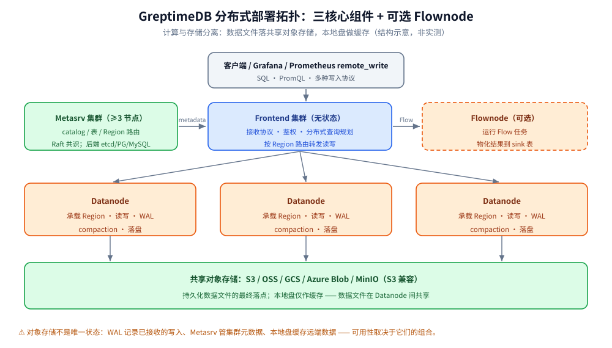

# 部署与集群运维

> GreptimeDB 从单机到集群的部署形态、组件职责、存储落点、扩缩容、备份恢复、升级与监控 ——
> 回答「**standalone 与 distributed 差在哪、运维时该盯什么**」。
>
> 内容整理自个人学习笔记，并参考 GreptimeDB 官方文档与 Release Notes；素材见 [素材清单](../../../../素材清单.md)。
>
> ⭐ 边界先说清：本篇讲**部署与运维**。**存储引擎内部结构**（LSM、Memtable、Region 细节）
> 见 [架构与存储引擎.md](架构与存储引擎.md)；**接入协议**见 [写入协议与数据接入.md](写入协议与数据接入.md)。

---

## 一、standalone 与 distributed 两种形态怎么选？

**本节要点**：两者跑的是**同一套数据库能力**，差别在「组件是否拆开部署」与「计算/存储能不能各自伸缩」。
选型分水岭是：**要不要横向扩展、要不要高可用、数据量会不会长期超出单机**。

| 维度 | standalone（单机） | distributed（集群） |
|---|---|---|
| 进程形态 | 一个 GreptimeDB 进程提供全部能力 | frontend / datanode / metasrv（+ 可选 flownode）分开部署 |
| 存储后端 | 本地盘或对象存储 | **共享对象存储**为主，本地盘做缓存 |
| 横向扩展 | 垂直扩（升配） | 计算与存储**分别**伸缩 |
| 高可用 | 单点 | 取决于 WAL 模式、metasrv 部署、Region 放置等 |
| 适用 | 开发、测试、小规模生产 | 生产、需要 HA 与水平扩展 |

官方文档的措辞值得记：分布式部署用共享对象存储**把持久化数据文件与计算分离**，
从而**独立调整计算和存储容量**。但也要注意它同时提醒 —— **对象存储不是系统中唯一的状态**：
WAL 记录已接收的写入、Metasrv 管集群 metadata 与 Region 路由、本地盘可以缓存远端数据。

---

## 二、distributed 下四个组件各管什么？

**本节要点**：分布式有**三个核心组件 + 一个可选 Flow 运行时**。把职责记成一句话：
**metasrv 管「在哪」、frontend 管「收发」、datanode 管「存算」、flownode 管「持续聚合」**。

### 2.1 metasrv：集群的大脑

管理 **catalog、schema、table、Region 路由、procedure 与调度 metadata**。
它决定「一张表的某个 Region 现在归哪个 datanode」。官方提到在典型部署中
**至少需要三个节点**才能建立一个可靠的 metasrv 小集群（3 节点 Raft 共识）。

**元数据存储后端**支持 etcd、MySQL、PostgreSQL。官方 FAQ 的推荐是：
生产环境**优先 PostgreSQL 或 MySQL**（含云 RDS）—— 大多数团队对关系型有更成熟的运维、监控与容灾经验；
etcd 依然完整受支持、并未废弃，团队若在 etcd 上有成熟工具链同样可行。

### 2.2 frontend：无状态的前门

作为**无状态组件**，可以按需伸缩。职责：

- 接收客户端协议请求并**鉴权**；
- 把多种协议转成集群内部协议；
- 做**分布式查询规划**；
- 依据 metasrv 的 metadata **解析 table 与 Region 路由**，把请求拆分并转发到承载目标 Region 的 datanode。

官方还建议：**多 frontend 集群**（frontend group）能改善负载分布与可用性。

### 2.3 datanode：真正干活的存算节点

**承载 Region**，执行读写、**记录 WAL**、运行 **compaction**，并把数据文件**持久化到配置的本地或对象存储**。

### 2.4 flownode：可选的流计算运行时

运行 Flow 任务、持续计算并把派生数据物化到 sink 表。它**可选**，且与 datanode 类似**可弹性伸缩**。



---

## 三、数据落点：对象存储、本地缓存与 WAL 各放哪？

**本节要点**：分布式下的「数据在哪」有**三层**要分清 —— 持久化数据文件在对象存储、
热数据缓存在本地盘、**已接收但未落盘的写入在 WAL**。三者可独立选型，**可用性与故障恢复取决于它们的组合**。

### 3.1 对象存储：数据的最终落点

分布式以**共享对象存储**作为持久化数据文件的主存储（S3 / OSS / GCS / Azure Blob / MinIO 等 S3 兼容端点），
好处是**数据文件在多个 datanode 间共享**，因此 Region 迁移不必搬全量数据。

### 3.2 本地缓存盘：扛住读取延迟

对象存储延迟高、带宽受限，因此本地盘用作**缓存**。运维时要关注的不是「盘多大」，
而是**缓存命中**：官方给出的信号是 `greptime_mito_cache_bytes{type="..."}` ——
**长期贴着配置容量**说明该缓存吃紧，可考虑扩容；**长期远低于容量**则可调小、把内存让给更紧的缓存。

### 3.3 WAL：决定 RPO / RTO 的关键

官方文档明确列出三种 WAL 落点：

| WAL 类型 | 落点 | 优点 | 代价 |
|---|---|---|---|
| **Local WAL** | datanode 内嵌 `raft-engine` | 低延迟、**无额外组件**；配合云盘可做到 **RPO = 0** | **RTO 高**（重启要回放 WAL）；只支持单消费者，**限制 Region 热备与迁移** |
| **Remote WAL** | 外部 **Apache Kafka** | **RTO 低**（可快速触发 Region failover，不必本地回放）；**多消费者订阅**，支持热备与迁移 | 依赖外部 Kafka，**部署运维复杂度上升**；有**网络开销** |
| **Noop WAL** | 不落任何数据 | 配置的 WAL 临时不可用时**应急** | **不存数据**；仅集群模式可用 |

⭐ 一句话判据：**要 Region 迁移 / 热备 → Remote WAL；要零运维、单 datanode 自洽 → Local WAL。**

---

## 四、K8s/Helm 与 Docker 部署怎么取舍？

**本节要点**：Docker 适合**单机试跑与开发**；K8s + Operator 才承载**生产集群**。
两者的分界线不是「先进与否」，而是**要不要 Operator 帮你管有状态集群**。

### 4.1 Docker：一条命令起单机

官方文档给出的 standalone 起法（端口按需调整）：

```bash
docker run -p 127.0.0.1:4000-4003:4000-4003 \
  -v "$(pwd)/greptimedb:/tmp/greptimedb" \
  --name greptime --rm \
  greptime/greptimedb standalone start \
  --http-addr 0.0.0.0:4000 \
  --rpc-addr 0.0.0.0:4001 \
  --mysql-addr 0.0.0.0:4002 \
  --postgres-addr 0.0.0.0:4003
```

- HTTP `4000` 上还能打开**内置 Dashboard**（`/dashboard/`）；
- 数据落在挂载出来的 `greptimedb/` 目录；
- `--rm` 是临时试跑；要保留数据就去掉它并保留 volume。

### 4.2 K8s：用 GreptimeDB Operator

生产走 **GreptimeDB Operator**，它负责实例的创建、供给与管理。官方文档给出两条主线：

| 目标 | 路径 |
|---|---|
| standalone 上 K8s | 部署 standalone 实例（开发/测试/小规模生产） |
| 生产集群 | 用 Operator 部署集群（高可用 + 水平扩展） |

自定义配置通过部署时创建 `values.yaml` 覆盖（Helm Chart 配置项见官方 Common Helm Chart Configurations）。
进阶场景官方单列了：**部署 MinIO 集群**、**部署 Kafka 集群**、
**配置 Remote WAL（Kafka）**、**用 MySQL/PostgreSQL 做元数据存储**、**多 frontend 集群（frontend group）**。

### 4.3 取舍表

| 维度 | Docker | K8s + Operator |
|---|---|---|
| 上手成本 | 极低 | 中（要懂 Operator / Helm） |
| 适用形态 | standalone | standalone 或 cluster |
| 有状态管理 | 手工 | Operator 自动化 |
| 弹性伸缩 | 手工 | 声明式 |
| 生产推荐度 | 仅小规模 | **推荐** |

---

## 五、扩容缩容：加 datanode 后数据怎么再平衡？

**本节要点**：因为数据文件在**共享对象存储**上，GreptimeDB 的再平衡**搬的是「元数据 + 少量本地数据」，**
不是「全量数据文件」 —— 这是它相比 Shared-Nothing 架构的关键差异。

官方博客对 Region Migration 的原理说得很清楚（该能力自 **v0.6.0** 引入）：

```text
完整的 Region 数据 = Remote WAL 中的增量数据 + 对象存储上的数据文件
```

由于对象存储上的数据文件在 datanode 间共享，**目标 datanode 只需从指定位置回放该 Region 的 WAL**，
所以迁移的数据量远小于「搬整个 Region 文件」。

迁移命令（官方博客口径）：

```sql
SELECT migrate_region(region_id, from_dn_id, to_dn_id, replay_timeout);
```

动手前先查清 Region 分布：

```sql
SELECT
  b.peer_id AS datanode_id,
  a.greptime_partition_id AS region_id
FROM information_schema.partitions a
LEFT JOIN information_schema.greptime_region_peers b
  ON a.greptime_partition_id = b.region_id
WHERE a.table_name = 'migration_target'
ORDER BY datanode_id ASC;
```

迁移流程（概览）：metasrv 发起一个迁移 procedure → 目标节点先开一个 **candidate Region** →
metasrv 把原 Region **降级（切断写入流量）** → candidate 从 **Remote WAL 回放数据** →
回放成功后 **candidate 升级为 Leader**、继续接收写入。

⚠️ 两个前提：**step 里有回放，所以 Remote WAL 是这类迁移顺畅的前提**；
**缩容前要先迁走该节点上的 Region**，不能直接杀掉承载 Leader Region 的节点。

⭐ 官方还强调：扩容前应先用指标确认**写入是否本来就分布不均** ——
如果瓶颈是「单 Region 过热」，那该做的是**调整分区**，而不是盲目加节点。

---

## 六、备份与恢复怎么做？

**本节要点**：GreptimeDB 有**两条备份路径**，用途不同 ——
**`greptime cli data export/import`** 面向**整库备份**（含 schema），
**`COPY TO / COPY FROM`** 面向**单表、按时间范围**的数据搬运（也是**单机 ↔ 集群迁移**的官方推荐手段）。

### 6.1 CLI 导出/导入：整库备份

导出所有数据库到本地目录：

```bash
greptime cli data export \
  --addr localhost:4000 \
  --output-dir /tmp/backup/greptimedb
```

输出目录里包含 `create_database.sql`、`create_tables.sql`、`copy_from.sql` 等，
即「先把 schema 备份下来，再导入数据」的结构。导出到 S3 时改用 `--s3` 系列参数
（`--s3-bucket` / `--s3-region` / `--s3-endpoint` …）。启用鉴权时用 `--auth-basic`。

⚠️ 一个容易踩的点：**数据导出的 `--output-dir` 是在 GreptimeDB 服务端解析的**，
而 schema SQL 文件由 CLI 进程写。**当 CLI 与服务端不在同一台机器时，请改用远端对象存储，**
并用 `--ddl-local-dir` 单独指定本地 SQL 文件目录。

### 6.2 COPY TO / COPY FROM：单表与跨形态迁移

单表按 parquet 备份、并限定时间范围：

```sql
COPY monitor TO '/home/backup/monitor/monitor_20240518.parquet'
WITH (FORMAT = 'parquet',
      START_TIME = '2024-05-18 00:00:00',
      END_TIME = '2024-05-19 00:00:00');
```

恢复（增量导出可用 `PATTERN` 批量匹配同一目录下的多个文件）：

```sql
COPY monitor FROM '/home/backup/monitor/'
WITH (FORMAT = 'parquet', PATTERN = '.*parquet');
```

⭐ 官方 FAQ 明确：**可以在单机模式与集群模式之间迁移数据** ——
用 `COPY TO` 从一侧导出、再用 `COPY FROM` 导入另一侧（反向同理），
数据以 **Parquet** 格式落到本地或对象存储（S3 / GCS）。

⚠️ 恢复前**先确保数据库与表已存在**；备份库数据时**同时备份表 schema**，并在恢复数据前先把 schema 恢复回去。

---

## 七、升级要注意什么？

**本节要点**：GreptimeDB 从 **v0.4** 起提供了**内置升级工具**（在 `greptime` 二进制里），
用来处理版本间的**不兼容变更**；用它升级的**最低可处理版本是 v0.3.0**。

升级工具的用法是**分两次导出**：先导出建表语句，再导出表数据。

```bash
greptime cli export --addr '127.0.0.1:4001' --output-dir /tmp/greptimedb-export --target create-table
greptime cli export --addr '127.0.0.1:4001' --database greptime-public --output-dir /tmp/greptimedb-export --target table-data
```

导出后可得到：`create-table` 目标产出 `CREATE TABLE` 语句；`table-data` 目标产出各表的 parquet 文件与配套的
`COPY FROM` 语句。再在新版本上按 schema → 数据的顺序导入。

升级的注意事项（务必以官方升级指南为准）：

| 事项 | 说明 |
|---|---|
| **同大版本内的小版本升级** | 通常可直接滚动替换二进制 |
| **跨大版本（含不兼容变更）** | 用 `greptime cli export` / `import` 迁移 |
| **升级前** | 先做一次完整备份（见第六节） |
| **升级后** | 复核 Flow 定义、索引与 TTL 是否仍生效 |

⚠️ **官方 FAQ 明确指向「升级指南」，其中包含升级步骤、兼容性说明与不兼容变更**。
本笔记不逐版本罗列不兼容点 —— 升级前**必须查最新一版升级指南**，不要凭记忆。

---

## 八、集群该盯哪些指标？

**本节要点**：GreptimeDB 暴露 Prometheus 指标，官方仓库提供 **standalone 与 cluster 两套 Grafana 面板模板**。
盯指标的顺序与排查顺序一致：**先看协议层延迟 → 再看 datanode 写路径 → 最后看缓存与 Region 分布**。

| 关注点 | 指标 | 怎么读 |
|---|---|---|
| 写入总速率 | `rate(greptime_table_operator_ingest_rows[$__rate_interval])` | 观察整体写入量 |
| 协议层延迟 | `greptime_servers_http_requests_elapsed_bucket` / `greptime_servers_grpc_requests_elapsed_bucket` | 用 `path` / `method` / `code` 标签**把写入与健康检查/抓取/查询分开** |
| datanode 请求延迟 | `greptime_mito_handle_request_elapsed_bucket` | 与 frontend 协议延迟对比，判断瓶颈在入口还是存储层 |
| 写路径各阶段 | `greptime_mito_write_stage_elapsed_bucket` | 定位写入卡在哪个阶段 |
| 读路径各阶段 | `greptime_mito_read_stage_elapsed_bucket` | 查询慢时定位存储引擎阶段 |
| **写入是否分布均匀** | `greptime_mito_write_rows_total` | 各 datanode 差异大 → 分区不均，**先调分区再加节点** |
| 缓存压力 | `greptime_mito_cache_bytes` / `_hit` / `_miss` / `_eviction` | `bytes` 长期贴近容量 = 缓存吃紧 |
| Region 级统计 | `REGION_STATISTICS`（含 `written_bytes_since_open`、`memtable_size`） | 找「单 Region 过热」 |

⚠️ 判据要点：

1. **先比「frontend 协议延迟」与「datanode 请求延迟」**，才能判断瓶颈是在请求处理前，还是在存储引擎内部；
2. **写入不均先归因于分区，而不是写缓冲**；
3. 缓存**命中率 < 50% 可考虑翻倍**；**长期远低于容量则考虑调小**。

其他运维观测手段（官方 Monitoring 章节列出）：
**状态检查 HTTP 端点**、**关键日志（Key Logs）**、**慢查询（实验性）**、
**分布式 tracing（Jaeger）**、**Runtime Information（`INFORMATION_SCHEMA` 查集群拓扑与 Region 分布）**、**Events**。

---

## 使用：最小可用的分布式部署清单

**本节要点**：把上面七节压成一份**按顺序执行的清单**。每一项都对应前文的一个决策点。

1. **定形态**：要 HA / 水平扩展 → distributed；否则 standalone（第一节）。
2. **定元数据后端**：生产选 PostgreSQL 或 MySQL（第二节 2.1）。
3. **定存储落点**：选好对象存储（S3/OSS/GCS/MinIO）+ 本地缓存盘（第三节 3.1/3.2）。
4. **定 WAL 模式**：需要 Region 迁移/热备 → Remote WAL（Kafka）；否则 Local WAL（第三节 3.3）。
5. **定部署方式**：生产用 GreptimeDB Operator + `values.yaml`；单机试跑用 `docker run`（第四节）。
6. **配监控**：接 Prometheus + 官方 Grafana 模板，先配好第八节那张表里的指标告警。
7. **做一次备份演练**：跑通 `greptime cli data export` 与 `COPY TO/FROM`（第六节）。
8. **升级路径预演**：确认当前版本 → 目标版本是否需要 `greptime cli export/import`（第七节）。

```text
检查顺序（也是故障时的下钻顺序）：
  frontend 协议延迟 → datanode 请求延迟 → 写/读阶段耗时 → 缓存命中 → Region 分布
```

---

## 延伸追问

- **standalone 与 distributed 是两套不同的数据库吗？** → 不是。跑的是**同一套数据库能力**，
  区别只在「组件是否拆开部署」与「计算/存储能否各自伸缩」。官方指出 standalone 用同一进程提供这些能力。
- **分布式下有哪几个组件？** → 三个核心组件 metasrv / frontend / datanode，外加**可选的 Flownode**。
- **对象存储是唯一的状态吗？** → 不是。官方明确：**WAL 记录已接收的写入、metasrv 管 metadata 与 Region 路由、**
  本地盘可缓存远端数据。可用性与 failover 取决于这些部分的组合。
- **metasrv 的元数据后端怎么选？** → 支持 etcd / MySQL / PostgreSQL；生产**推荐 PostgreSQL 或 MySQL**
  （运维与容灾经验更成熟），etcd 仍完整受支持、并未废弃。
- **Local WAL 和 Remote WAL 差在哪？** → Local WAL 低延迟、无额外组件、可做到 **RPO=0**，
  但 **RTO 高**且**只支持单消费者**（限制热备与 Region 迁移）；
  Remote WAL 用 Kafka 换取**低 RTO 与多消费者订阅**，代价是**多一个外部依赖和网络开销**。
- **加 datanode 后数据要搬多少？** → 因为数据文件在共享对象存储上，
  **只搬「元数据 + 被迁移 Region 的 WAL 增量」**，不是搬整个 Region 文件；迁移数据量显著更小。
- **Region 迁移的前提是什么？** → 顺畅迁移**依赖 Remote WAL**（要从 WAL 回放）；迁移中会**先切断原 Region 的写入流量**。
- **怎么把单机数据搬到集群？** → 用 `COPY TO` 从单机导出 Parquet、再用 `COPY FROM` 导入集群
  （官方 FAQ 明确这是支持的单机↔集群迁移手段）。
- **`greptime cli data export` 的 `--output-dir` 写在哪里？** → **数据导出路径在服务端解析**，
  schema SQL 由 CLI 进程写；**CLI 与服务端不在同一台机器时**要用远端对象存储 + `--ddl-local-dir`。
- **升级用不用停机导数据？** → 仅在**跨版本存在不兼容变更**时才需要走
  `greptime cli export/import`；同大版本小版本升级通常直接替换。**具体以官方升级指南为准。**
- **写入分布不均该先加节点还是先调分区？** → 先看 `greptime_mito_write_rows_total` 与 `REGION_STATISTICS`；
  **单 Region 过热应先调分区**，不要盲目加写缓冲或加节点。

## 关联

- [架构与存储引擎.md](架构与存储引擎.md) — 存储引擎与 Region 的内部结构（本篇只讲部署与运维）
- [定位与适用场景.md](定位与适用场景.md) — 什么规模、什么场景该上集群
- [写入协议与数据接入.md](写入协议与数据接入.md) — frontend 暴露的接入协议
- [数据模型与写入路径.md](数据模型与写入路径.md) — 写入路径与 WAL 的关系
- [性能调优与基准测试.md](性能调优与基准测试.md) — 第八节的指标如何落到调优动作
- [Flow流计算引擎.md](Flow流计算引擎.md) — Flownode 承载的流计算任务
- [../VictoriaMetrics/高可用与集群部署.md](../VictoriaMetrics/高可用与集群部署.md) — 同为时序库的另一种集群形态对照
- [数据库选型对比.md](../../数据库选型对比.md) — 存储在系统中的横向定位
> 反向引用（本篇被下列文档引到）：[可观测性集成方案.md](可观测性集成方案.md)、[选型对比与落地案例.md](选型对比与落地案例.md)
