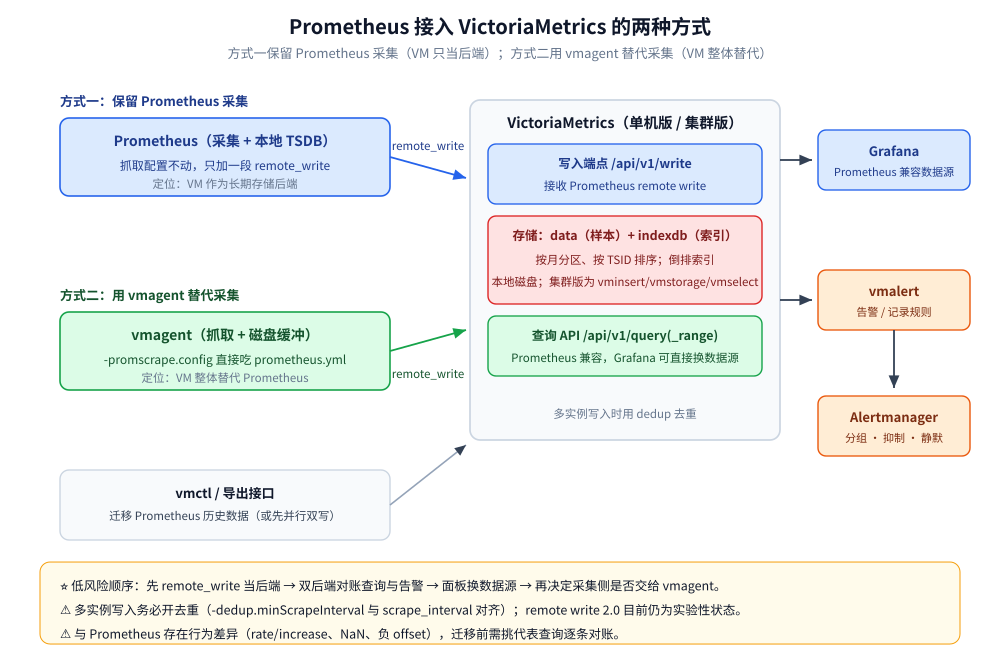

# 与 Prometheus 生态的关系

> VictoriaMetrics 生在 Prometheus 生态里：它说 PromQL、收 remote write、能被 Grafana 当
> Prometheus 数据源。本篇先用两节把必要的 Prometheus 背景交代清楚（数据模型、抓取与服务发现、
> remote write / remote read、PromQL 与 TSDB 的关系），再回答那个真正要决策的问题
> ——**VM 是当 Prometheus 的长期存储后端，还是整体取代 Prometheus**，以及它和
> Thanos / Mimir 走的是不是同一条路。
>
> 内容整理自个人学习笔记，并参考官方文档与 Release Notes；素材见 [素材清单](../../../../素材清单.md)。
>
> ⭐ 边界先说清：**只做栈层面三方选型**（Prometheus / VM / InfluxDB）见
> [可观测性选型对比.md](../../../中间件/可观测性/可观测性选型对比.md)；
> **含 Thanos / Mimir / TimescaleDB 的横向对比与迁移路径**见 [选型与落地案例.md](选型与落地案例.md)。
> 本篇不重复这两类内容。

---

## 一、读这篇之前，需要补齐哪些 Prometheus 背景？

**本节要点**：下面四个概念是理解「VM 怎么接进来」的最小前提。
只讲到能支撑本篇的程度，**不展开成 Prometheus 教程**。

### 1.1 数据模型：metric + labels + sample

Prometheus 的世界里只有一种数据：

```text
一条时间序列 = metric name + 一组 label（键值对）
一个样本     = (时间戳, 数值)      # 追加写入，不可变
```

例如 `http_requests_total{job="api", instance="10.0.0.1:9090", status="200"}`，
**metric name 和 label 的组合唯一确定一条序列**。这里的「label 组合数」就是**基数**，
也是后面几乎所有成本讨论的源头。

⭐ 两个必须记住的推论：

- **一个 label 值多一维，序列数往往成倍增长**（`status` 从 2 种变 20 种，序列可能 ×10）；
- **时间戳精度是毫秒**，数值是 float64——这也是 remote write 协议里 `Sample` 的字段定义。

### 1.2 pull / scrape 与 service discovery

Prometheus 的采集是 **pull（拉）语义**：它按配置**周期性去 HTTP 拉 target 的 `/metrics`**，
每次抓取叫一次 scrape。目标从哪来？靠 **service discovery（SD）**：

| SD 类型 | 说明 |
| --- | --- |
| `static_configs` | 手写死地址 |
| `file_sd_configs` | 从外部文件读目标列表 |
| `kubernetes_sd_configs` | 直接对接 K8s API（Pod / Service / Endpoints …） |
| Consul / DNS / 云厂商 SD 等 | 按环境对接 |

⭐ 抓取侧的关键参数是 `scrape_interval`（多久抓一次），
它直接决定**采样密度**，也决定后面 `rate()` 之类函数的窗口该怎么选。

### 1.3 PromQL 与 TSDB 的关系

**PromQL 是查询语言，TSDB 是它底下的存储**——两者是分层的：

```text
PromQL 查询 → TSDB 按标签选择器定位序列 → 读取时间范围内的样本 → 计算/聚合 → 返回
```

⭐ 这层「语言 ↔ 存储」的分离很重要：**只要能解析 PromQL、按标签选择器取样本，就能顶替 Prometheus 的查询角色**。
VM 正是靠这一点接入的。

---

## 二、remote write / remote read 协议是什么？

**本节要点**：这两个协议是把「采集」和「存储/查询」拆开的标准接口。
Prometheus 采集、往别的后端写 → **remote write**；反过来从别的后端读 → **remote read**。

### 2.1 remote write：1.0 与 2.0

remote write 的传输是 **HTTP + protobuf + Snappy 压缩**，请求体是一批 `WriteRequest`。
它是一个**无状态、非流式**的协议——每条消息独立，靠同一条连接上发多条来实现「流」的效果。

| 版本 | 消息类型 | 关键变化 |
| --- | --- | --- |
| **1.0** | `prometheus.WriteRequest` | 标签字符串逐条重复；exemplar 是外挂；不支持 native histogram / created timestamp |
| **2.0** | `io.prometheus.write.v2.Request` | 字符串驻留（同请求共用符号表，**payload 明显更小**）；metadata 随序列走；exemplar / native histogram / created timestamp 一等公民；响应带 `X-Prometheus-Remote-Write-*-Written` 头，便于发现「部分写入」 |

⚠️ 版本与状态（**以官方 Release Notes 为准**）：

- remote write 2.0 的 spec 目前是**实验性（Experimental）**，spec 文档版本为 2.0-rc 系列，
  文档日期为 **2024 年 5 月**；
- **Prometheus 3.0（官方公告发布于 2024-11-14）** 引入 remote write 2.0 的原生支持；
- 1.0 与 2.0 是**同一 HTTP + Snappy 传输上的两套 protobuf 消息**，通过 Content-Type 内容协商，
  可按 endpoint 逐个切换；接收方不支持会返回 415，发送方需回退到 1.0。

### 2.2 remote read：能力与代价

remote read 反过来——**让查询层从远端存储按时间范围拉样本**，用于「本地只留最近数据、
历史数据回查对象存储」这类场景。它的代价是：

- ⚠️ **读放大会被协议放大**：查询要跨网络把原始样本拉回来再计算，网络与反序列化成为瓶颈；
- ⚠️ **它是 Prometheus 侧的兼容接口**，不是性能最优路径——所以现代方案更倾向
  「**存储侧直接提供 PromQL 查询 API**」（VM / Mimir 都是这么做的），而不是让 Prometheus 再代理一层。

### 2.3 VM 实现了哪些 Prometheus 端点

VM 对 Prometheus 协议的支持，落在几个端点上（单机与集群版路径略有不同）：

| 端点 | 作用 |
| --- | --- |
| `POST /api/v1/write` | 接收 **Prometheus remote write**（vmagent / Prometheus 都往这写） |
| `GET/POST /api/v1/query` | 即时查询（PromQL / MetricsQL） |
| `GET/POST /api/v1/query_range` | 范围查询（Grafana 主力） |
| `GET /api/v1/series` | 查匹配的序列 |
| `GET /api/v1/labels`、`/api/v1/label/<name>/values` | 标签名 / 标签值枚举（Grafana 自动补全用） |
| `GET /metrics` | 暴露自身指标（Prometheus 文本格式） |

⭐ 换句话说：**VM 把一个「Prometheus 兼容的写入端点 + Prometheus 兼容的查询 API」都提供了**
——这正是它能「既当后端、又当替代」的技术底座。

---

## 三、VM 是「长期存储后端」还是「整体替代」？

**本节要点**：两种接入方式对应两种角色定位，取舍点在于**要不要保留 Prometheus 自己那份采集**。



### 3.1 方式一：vmagent 抓取（替代 Prometheus 的采集）

**vmagent** 是 VM 生态里的采集代理，官方定位是「**可作 Prometheus 抓取的 drop-in 替代**」：
把 Prometheus 的 `prometheus.yml` 直接用 `-promscrape.config` 指给它即可。
它支持 Prometheus 的抓取与 relabeling（另加 `replace_all` / `labelmap_all` 等额外 action），
并通过 `-remoteWrite.url` 把数据推到 VM（**可同时推给多个目标**）。

| 能力 | 说明 |
| --- | --- |
| 协议 | 同时支持 Prometheus remote write 与 VM 自己的写入协议 |
| 缓冲 | **`-remoteWrite.tmpDataPath` 提供磁盘缓冲（persistent queue）**，远端不可用时先存盘 |
| 多目标 | 多个 `-remoteWrite.url` 并行发送 |
| 资源 | 官方称相较 Prometheus **占用更少的 RAM / CPU / 磁盘 IO / 网络带宽** |

⭐ 这条路下，**Prometheus 本体可以完全不下场**——采集（vmagent）+ 存储查询（VM）
替代了「Prometheus 采集 + Prometheus 本地 TSDB」。

### 3.2 方式二：Prometheus remote_write（保留 Prometheus 采集）

如果团队**不想动现有 Prometheus 的抓取配置**，只需在 `prometheus.yml` 里加一段：

```yaml
remote_write:
  - url: http://<victoriametrics-host>:8428/api/v1/write
    queue_config:
      max_samples_per_send: 10000
```

即可让 Prometheus 一边写本地 TSDB、一边把样本推到 VM。
官方文档也给了「数据双发到多个 VM 实例」的写法（多个 `remote_write.url`），
VM 侧配合**去重（dedup）**处理重复数据。

⭐ 这条路下，Prometheus 保留采集角色，**VM 只做长期存储 / 查询后端**。

### 3.3 两者怎么选

| 判据 | 选 vmagent 抓取（替代） | 选 Prometheus remote_write（后端） |
| --- | --- | --- |
| 想不想动现有抓取配置 | 可以重建配置 | ⭐ **完全不改抓取**，只加一段 remote_write |
| 采集侧资源 | ⭐ 官方称更省 RAM/CPU/磁盘 IO | 继续承担 Prometheus 的采集开销 |
| 是否要边缘缓冲 | ⭐ 自带磁盘持久化队列 | 靠 Prometheus 自己的 WAL / 队列 |
| 迁移风险 | 中（抓取链路要验证） | ⭐ 低（先并行写、对账后再切查询） |
| 典型定位 | **整体替代** | **长期存储后端** |

⭐ 结论：**「后端」是低风险起点，「替代」是终态**。
多数团队的实际路径是「先 remote_write 当后端 → 验证查询与告警兼容 → 再决定采集侧是否交给 vmagent」。

---

## 四、PromQL 兼容的边界在哪里？

**本节要点**：能直接跑的是绝大多数；但**行为不同的那几类**必须在迁移前逐个确认，
否则会出现「同一块面板、两个后端、两条曲线对不上」。

### 4.1 能直接跑的部分

VM 官方口径是：**MetricsQL 向后兼容 PromQL**，所以「用 Prometheus 数据源做的 Grafana 面板
切到 VM 后应当表现一致」。绝大多数函数、聚合、选择器语义都一致；
`/api/v1/query`、`/api/v1/query_range` 等查询 API 也是 Prometheus 兼容的。

### 4.2 行为不同的部分

⚠️ 这几类是**有意为之**的差异（函数与行为细节见 [MetricsQL查询.md](MetricsQL查询.md) 第二节）：

| 差异点 | 表现 |
| --- | --- |
| `rate` / `increase` / `delta` / `irate` 等 | 采用「窗口前一个样本」、**不做外推**，结果与 Prometheus 不同 |
| metric name 保留 | `*_over_time`、`round`、`predict_linear` 等**默认保留** metric name |
| NaN 处理 | VM **从结果中删除 NaN**，部分查询返回空而非 NaN 序列 |
| 负 offset | 行为与 Prometheus 不同（VM 的实现更早发布） |
| 精度 | 压缩算法不同，末几位小数可能有差异 |

⭐ 官方用 Prometheus 兼容性工具做的一轮对照（**VM v1.67.0 vs Prometheus v2.30.0**）
是 **385 / 529（约 72.78%）通过**——**这个数字要连「失败构成」一起看**，
其中约 17% 的失败只是因为「VM 多留了 metric name」。

### 4.3 迁移前的对账动作

```text
① 挑几条有代表性的查询（含 rate / increase / histogram_quantile / 告警表达式）
② 同一时间范围、同一 step，分别打到 Prometheus 与 VM
③ 逐条比对曲线形状与量级；对不上的先判断属于哪一类差异
④ 需要与 Prometheus 完全对齐时，改用 *_prometheus 版本函数（rate_prometheus 等）
⑤ 告警规则先影子运行（只发不告 / 发到测试通道），确认无误再切
```

---

## 五、和 Thanos / Mimir 的路线差在哪？

**本节要点**：三者都解决「Prometheus 单机存不下、留不久」，但**架构哲学完全不同**——
一个「扩展 Prometheus」，一个「重写后端」，一个「一个二进制搞定」。

### 5.1 三条路线各一句话

| 方案 | 一句话 |
| --- | --- |
| **Thanos** | **扩展** Prometheus：sidecar 把 Prometheus 压缩后的块上传对象存储，Query 层再合并实时与历史数据 |
| **Grafana Mimir** | **重写**的横向可扩展后端（由 Cortex 演化而来）：`remote_write` 指进来，它就成为长期存储，多租户在写入/查询路径内置 |
| **VictoriaMetrics** | **一个二进制**同时吃 remote write 与提供 PromQL 查询；要横向扩展就切集群版（vminsert / vmstorage / vmselect） |

### 5.2 差异速览（详细对比见链接）

| 维度 | Thanos | Mimir | VictoriaMetrics |
| --- | --- | --- | --- |
| 与 Prometheus 的关系 | **依赖** Prometheus（sidecar 模式）或 Receiver | **取代**（自己的 ingester） | **可取代也可当后端** |
| 持久层 | 对象存储 | 对象存储 | **本地磁盘**（属集群版；备份到对象存储） |
| 横向扩展 | 组件较多（Store Gateway / Query / Compactor） | 微服务集群，组件最多 | 单机版直接扛；集群版三组件 |
| 多租户 | 基础（header → 每租户 TSDB） | 一等公民（`X-Scope-OrgID`） | 集群版按 URL 路径租户 |
| 许可 | Apache 2.0（CNCF Incubating） | **AGPLv3**（copyleft） | **Apache 2.0** |

⭐ 三个判据快速收敛：

- **只想给现有 Prometheus 加长保留期、不想改后端** → Thanos；
- **要强多租户隔离 + 已经押注 Grafana 生态** → Mimir（⚠️ 注意 AGPLv3 的合规评估）；
- **想用最少组件、最低运维面把「高基数 / 长保留」跑起来** → VictoriaMetrics。

⚠️ 完整的六维度对照表、决策判据与迁移路径在 [选型与落地案例.md](选型与落地案例.md)，
本节只做路线级的一句话区分。

---

## 使用：把一个 Prometheus 栈接到 VM 上

按「先只读、后写入、最后切查询」的最小风险顺序推进：

```text
① 起一个 VM（单机版一个进程即可），确认 /metrics 可访问
② Prometheus 加 remote_write 指向 VM 的 /api/v1/write（只写，不动现有查询）
③ 用 /api/v1/export 或查询 API 抽样核对：标签、样本数、时间范围是否完整
④ 挑代表性查询做双后端对账（见 4.3），需要时改用 *_prometheus 函数
⑤ Grafana 新增一个指向 VM 的数据源，面板先复制一份、对照观察
⑥ 确认无误后切面板数据源；告警规则（vmalert 或 Prometheus 规则）影子运行后再切
⑦ 视情况决定采集侧是否交给 vmagent（要磁盘缓冲就选它）
```

几条落地纪律：

- **多实例写入要开去重**：官方建议 `-dedup.minScrapeInterval` 与你的 `scrape_interval` 对齐
  （例如都设 15s），否则双发会变成双份数据；
- **Grafana 只是换个数据源**：VM 对 Prometheus 查询 API 兼容，面板通常改 data source 即可；
- ⚠️ **告警阈值不要照抄**：如果规则里用的是 `increase()`，先确认改了后端后数值口径是否变化；
- ⚠️ **补写历史数据（backfill）后务必处理查询缓存**（见
  [索引设计与查询优化.md](索引设计与查询优化.md) 第六节）。

---

## 延伸追问

- **VM 能完全替代 Prometheus 吗？** → 技术上可以（vmagent 替代抓取 + VM 存储查询 + vmalert 替代告警规则），
  且官方称 vmagent 资源占用更低。但「能不能替代」不等于「该不该一次换完」——
  ⚠️ 建议按「后端 → 查询 → 采集 → 告警」分步切，每步都有回退路径。
- **remote write 2.0 现在能不能上生产？** → ⚠️ 其 spec 仍是**实验性**状态；
  Prometheus 3.0 已提供原生支持。落地前先确认**接收端（VM / Mimir / Thanos）**对你所用版本的支持情况，
  并按 endpoint 灰度、可回退。
- **VM 为什么不做 remote read 代理而直接给 PromQL API？** → 因为 remote read 让查询层跨网络拉原始样本，
  读放大会被协议放大；**存储侧自己解析 PromQL、只把结果返回**才是更短的路径。
- **Thanos 和 VM 都在对象存储/本地盘上做长期存储，本质区别是什么？** → Thanos **不替换** Prometheus 的采集与本地块，
  而是把块搬去对象存储再统一查询；VM **本身就是完整的存储与查询引擎**，可以直接不要 Prometheus 本体。
- **多租户能力该在哪一层解决？** → Mimir 把租户隔离做进写入/查询路径（`X-Scope-OrgID`）；
  VM 单机版本身不含开箱多租户，集群版按 URL 路径分租户，配合 `vmauth` 做认证代理。
- **迁移时最容易被低估的是什么？** → 不是数据搬迁，而是**查询与告警的行为差异**。
  数据可以并行写、慢慢对账；但一块悄悄变形的告警曲线，可能上线很久才被发现。

---

## 关联

- [选型与落地案例.md](选型与落地案例.md) — Thanos / Mimir / InfluxDB / TimescaleDB 的完整对照与迁移路径
- [MetricsQL查询.md](MetricsQL查询.md) — 兼容性差异逐条展开，以及 `*_prometheus` 兼容函数
- [索引设计与查询优化.md](索引设计与查询优化.md) — 接入之后的查询侧：索引、护栏与缓存
- [高可用与集群部署.md](高可用与集群部署.md) — remote write 双发、去重、集群版的拓扑细节
- [定位与适用场景.md](定位与适用场景.md) — VM 解决什么问题、什么时候不该用它
- [可观测性选型对比.md](../../../中间件/可观测性/可观测性选型对比.md) — Prometheus / VM / InfluxDB 在可观测性栈层面的三方对比
- [数据库选型对比.md](../../数据库选型对比.md) — 时序库在七类存储中的横向定位
> 反向引用（本篇被下列文档引到）：[手写Prometheus导出器.md](../../../../01-编程语言/go/可观测性/手写Prometheus导出器.md)、[数据模型与写入路径.md](数据模型与写入路径.md)
