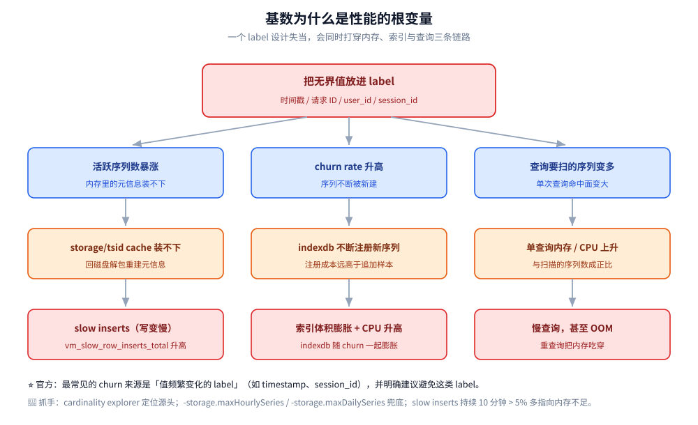
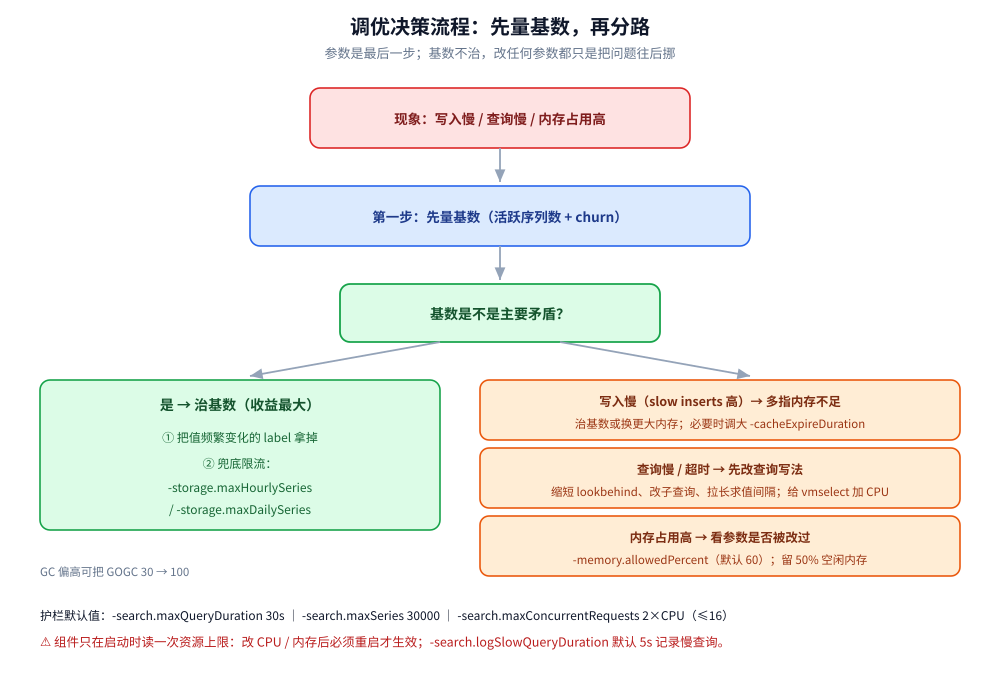

# 性能调优与基准测试

> VictoriaMetrics 该怎么调：为什么**基数治理**要排在最前面、内存与查询护栏各控什么、
> 去重与 cache 怎么配；以及**基准测试的方法与口径**——压测维度怎么定、对照实验怎么设计、
> 为什么不同基数的结果不能直接比、官方给的结论该怎么读。
>
> 内容整理自个人学习笔记，并参考 VictoriaMetrics 官方文档与 Release Notes；素材见 [素材清单](../../../../素材清单.md)。
>
> ⭐ 参数默认值以 **VictoriaMetrics v1.153.0（2026-09-28 发布）** 与 **LTS 线 v1.148.x** 的官方文档为准。
> ⚠️ **本篇只讲方法与口径，不含任何本机实测**：凡涉及性能数字，一律标注「官方口径」并给出处，核不到出处的数字不写。
>
> ⭐ 边界先说清：本篇不重复「可观测性栈层面怎么选」
> （见 [可观测性选型对比.md](../../../中间件/可观测性/可观测性选型对比.md)）与「时序库在七类存储里的横向定位」
> （见 [数据库选型对比.md](../../数据库选型对比.md)）。

---

## 一、调优该从哪里下手？为什么基数治理排第一？

**本节要点**：在 VictoriaMetrics 里，**活跃时间序列数（cardinality）是几乎所有性能问题的根变量**——
它同时决定内存占用、cache 命中率、索引体积与查询扫描量。所以调优的第一动作不是改参数，而是**先看基数、再治基数**。

官方在 Troubleshooting 里把「慢写入」的第一条原因直接写成**内存不足以承载当前活跃序列数**：
`vmstorage` 用内存 cache `storage/tsid` 快速查找每个入站指标的内部序列 ID；
cache 装不下所有活跃序列时，就得回磁盘解包重建，额外消耗 CPU 与磁盘读 IO。
官方给的判断阈值是：Grafana 面板里的 `Slow inserts` 图**持续 10 分钟以上 > 5%**，基本就是序列数塞不下 `storage/tsid` cache
（面板背后是 `vm_slow_row_inserts_total` 与 `vm_rows_added_to_storage_total` 的比值）。

而「高 churn rate（序列流失率）」的第一来源，官方点名是**值频繁变化的 label**：

> The most common source of high churn rate is a label that frequently changes its value (like timestamp, session_id). **Try avoiding such labels.**

因果链可以这样串起来：

```text
把无界值放进 label（时间戳 / 请求 ID / 用户 ID / session_id）
        │
        ├─► 活跃序列数暴涨 ──► storage/tsid cache 装不下 ──► slow inserts（写变慢）
        │
        ├─► 序列 churn rate 升高 ──► indexdb 不断注册新序列 ──► 索引体积膨胀 + CPU 升高
        │
        └─► 查询要扫描的序列变多 ──► 单查询内存/CPU 上升 ──► 慢查询，甚至 OOM
```



| 抓手 | 说明 |
|---|---|
| **治本：改 label 设计** | 把无界值从 label 里拿掉（放到样本值、日志或另一张表）；保证同一序列的 label 顺序一致 |
| **定位：基数浏览器** | `cardinality explorer` / `/api/v1/status/tsdb`（支持 `topN` / `focusLabel` / `match[]`），先找出「谁贡献了基数」 |
| **兜底：基数限流** | `-storage.maxHourlySeries`（每小时新增序列上限）与 `-storage.maxDailySeries`（每天），超限的样本被丢弃 |
| **兜底：单序列上限** | `-maxLabelsPerTimeseries` / `-maxLabelValueLen`；序列整体不得超过 64KB |

⚠️ 一条容易被忽略的细节：**同一序列的 label 顺序不一致也会拖慢写入**。
官方建议客户端保持 label 顺序稳定（Prometheus 与 `vmagent` 已经保证），
第三方客户端可用 `-sortLabels=true` 让服务端归一化，代价是写入时 CPU 更高。

---

## 二、内存参数该怎么设？

**本节要点**：VictoriaMetrics 的两个内存参数**只限制内部 cache**，不限制单次查询的额外内存——
所以「内存不够」要区分是**cache 不够**还是**查询太重**，两者调的东西完全不同。

### 2.1 `-memory.allowedPercent` 与 `-memory.allowedBytes`

| 参数 | 默认值 | 语义 |
|---|---|---|
| `-memory.allowedPercent` | `60` | 允许内部各类 cache 占用的**系统内存百分比** |
| `-memory.allowedBytes` | `0` | 直接给出允许量；**非零时覆盖** `-memory.allowedPercent` |

官方描述的取舍是双向的：

- **值太低** → cache miss 率上升 → CPU 与磁盘 IO 升高；
- **值太高** → 把操作系统 page cache 挤出去 → 磁盘 IO 反而升高。

对应指标：所有 `vm_cache_size_bytes` 之和是当前 cache 占用，
`vm_allowed_memory_bytes` 是 cache 允许的上限（= 系统内存 × `-memory.allowedPercent` / 100）。

### 2.2 该留多少余量？

官方容量规划给的硬指标是**留 50% 空闲内存**：超过 50% 的使用率会带来 cache 驱逐、过量 IO 与整体变慢。
排查文档里也重复了同一条：空闲内存逼近 0 时，操作系统没有足够内存给 page cache，
而 VictoriaMetrics 依赖 page cache 加速对近期数据的查询，缺了它就得回磁盘读，查询与写入都会显著变慢。

### 2.3 GOGC：拿内存换 CPU

默认各组件用 **`GOGC=30`**。官方给的一条调优路径是：如果 Grafana 的 `CPU spent on GC` 面板显示
GC 占用的 CPU 偏高，可以把 `GOGC` 调到 `100` 来**降低 CPU 占用，代价是更高的内存占用**。

---

## 三、查询护栏该设哪些？（`-search.max*` 系列）

**本节要点**：护栏的作用是**把「意外的重查询」挡在门外**，而不是让正常查询变快。
设之前先算清两件事：**单查询能占多少内存**（`maxMemoryPerQuery × maxConcurrentRequests`），
以及**单查询最多能碰多少序列**（`maxUniqueTimeseries`，与内存/CPU 成正比）。

| 参数 | 默认值 | 控什么 |
|---|---|---|
| `-search.maxQueryDuration` | `30s` | 单查询最长执行时间，超时即取消；请求可用 `timeout` 调**更小** |
| `-search.maxSeries` | `30000` | `/api/v1/series` 最多返回多少序列（Grafana 自动补全常用，churn 高时特别吃资源） |
| `-search.maxUniqueTimeseries` | `0`（=自动） | 单查询最多扫描多少唯一序列；`0` 时按 `maxConcurrentRequests`（反比）与可用内存（正比）自动算 |
| `-search.maxSamplesPerSeries` | `30000000` | 单查询对**每条序列**最多扫描多少原始样本 |
| `-search.maxConcurrentRequests` | `2 × CPU`，上限 `16` | 单节点同时处理的查询数 |
| `-search.maxWorkersPerQuery` | `CPU` 核数，上限 `32` | 单查询能用多少 CPU 核 |
| `-search.maxMemoryPerQuery` | — | 单查询内存上限，超限即拒绝（只 `vmselect`） |
| `-search.maxQueueDuration` | — | 并发打满时，排队查询的最长等待时间 |
| `-search.logSlowQueryDuration` | `5s` | 超过该耗时的查询写进日志 |

三条读法（Resource usage limits，单节点与集群同源）：

1. **并发 × 单查询 = 总内存**：若一个查询要 100 MiB，100 个并发就要约 10 GiB 额外内存——
   所以宁可**限制并发**、让多余查询排队，也不要放任并发把内存吃穿。
2. **`maxUniqueTimeseries` 自动算出来后会打印在启动日志里**，并暴露为 `vm_search_max_unique_timeseries`；
   集群版里 `vmselect` 的这个值不能超过 `vmstorage` 上显式设的值。
3. **`maxSeries` 要针对 churn 场景单独压低**：这个接口在序列极多时非常吃 CPU 与内存。

---

## 四、去重、cache 与并发该怎么配？

**本节要点**：去重参数的取值由**采集间隔**决定，不靠猜；cache 官方**不建议手调**，
先用指标判断「到底缺不缺」；并发参数与 CPU 核数绑定，且**改资源上限必须重启**。

### 4.1 `-dedup.minScrapeInterval`

语义：在每个长度等于该值的**离散区间**内，每条序列只保留**时间戳最大**的一个原始样本；
若多个样本时间戳相同，则保留**值最大**的那个。

- 推荐值 **= 采集配置里的 `scrape_interval`**（官方建议全站统一一个 `scrape_interval`）；
- 该值只对 **label 完全相同**的样本生效——所以 HA 对的两套 `vmagent` 必须**配置完全一致**；
- 去重**不减小 `indexdb` 体积**（只减样本存储）；
- 集群版做去重时，同一个值要**同时**传给 `vmselect` 与 `vmstorage`。

### 4.2 cache：`-storage.cacheSize*` 与 `-cacheExpireDuration`

各 cache 都有默认大小，`-storage.cacheSize*` 系列（默认都是 `0` = 使用自动值）可逐项覆盖。
判断要不要调，看这组指标（每种 cache 都会暴露）：

| 指标 | 含义 |
|---|---|
| `vm_cache_size_bytes` | 该 cache 当前实际大小 |
| `vm_cache_size_max_bytes` | 该 cache 的大小上限 |
| `vm_cache_requests_total` / `vm_cache_misses_total` | 请求数与未命中数 |
| `vm_cache_entries` | 条目数 |

判据（Cache tuning）：利用率 **< 100% 就不必调**；若**利用率已 100% 且仍有 miss**，
说明 cache 要么不再收新条目、要么在驱逐旧条目，此时其大小可能需要增大。

⚠️ **官方明确不建议手调 cache 大小**，理由是「频繁导致 OOM」；
如果现有负载确实需要更大 cache，官方的建议是**换一台内存更大的机器**，而不是改这些参数。
一个例外是：若 `TooHighSlowInsertsRate` 告警在 CPU/内存都充足时仍然报，
可把 `-cacheExpireDuration` 调到**超过同一序列的采集间隔**。

### 4.3 并发与 GOMAXPROCS

| 参数 | 默认值 | 备注 |
|---|---|---|
| `-maxConcurrentInserts` | `2 × CPU` | 客户端网络慢时调高 |
| `-search.maxConcurrentRequests` | `2 × CPU`，上限 `16` | 高并发会同步抬高内存 |

⚠️ **最关键的一条**：所有组件**只在启动时读一次**可用的 CPU 与内存上限，用它来定 cache、buffer 与并发上限。
所以**纵向扩容（加 CPU/内存）后不重启，资源不会生效**；反过来，内存上限被调小后不重启还可能被 OOM 杀掉。
`vm_available_memory_bytes` / `vm_available_cpu_cores` 这两个自监控指标也会一直报**启动时**读到的值。
官方因此不建议用 Kubernetes VPA 的就地（InPlace）扩容模式。



---

## 五、基准测试该怎么设计？

**本节要点**：时序库的基准，**必须把「基数」当作一等变量写清楚**——
同一个产品在不同基数下的写入吞吐与查询延迟可以差一个数量级。设计对照实验的核心原则只有一条：**只改一个变量**。

### 5.1 压测维度

| 维度 | 要控制的量 | 为什么重要 |
|---|---|---|
| **写入速率** | 每秒样本数（samples/s） | 决定写路径饱和点 |
| **查询类型** | instant / range / rollup（`avg_over_time` 等）/ 聚合 | 不同查询吃 CPU 与内存的方式不同 |
| **基数** ⭐ | 活跃序列数、序列 churn rate | **同时影响内存、cache 命中、索引与扫描量** |
| **数据规模** | 样本总量、时间跨度 | 决定冷热数据比例与磁盘 IO 形态 |
| **采集间隔** | `scrape_interval`（间接决定去重口径） | 与去重参数绑定 |

第三方的 **TSBS（Time Series Benchmark Suite）** 这类时序压测套件，通常覆盖
「写入 / 单机查询 / 双机查询」几类场景，也用「高基数 / 低基数」区分数据集——
这正是因为它把基数当成核心变量。选工具时，先确认它**能报告基数**、**能固定基数做对照**。

### 5.2 对照实验的设计清单

| 要素 | 做法 |
|---|---|
| 变量控制 | 一轮只改一个：要么只改 `-replicationFactor`，要么只改去重，要么只改基数 |
| 硬件一致 | 同一批机器、同一磁盘类型、同一网络；集群与单机不要混比 |
| 预热 | 先跑一段预热把 cache 填起来，再开始计时 |
| 时长与稳定性 | 单次跑够长，取**多次运行的分布**，别用一次读数 |
| 读数口径 | 报 **p50 / p99** 而不只报均值；报**绝对量 + 相对量** |
| 记录前提 | 把基数、churn、采集间隔、并发、查询语句一起写进报告 |

### 5.3 为什么不同基数的结果不能直接比？

因为基数一变，**下列四项会同时变**，你比的就不再是「同一个系统的两个配置」：

1. **内存**：活跃序列数直接决定 `storage/tsid` 这类 cache 的驻留压力；
2. **cache 命中率**：序列越多，cache miss 越多，写入要从磁盘重建元信息；
3. **索引体积**：churn 越高，`indexdb` 越大（每个唯一序列的每个 label 都会在倒排索引里占行）；
4. **查询扫描量**：同样一条查询，命中的序列数可能差几十倍，延迟与内存随之放大。

⭐ 一句话判据：**基数不同的两组结果只能各自说明「它自己的场景下」的表现，不能拿来论证「A 产品比 B 产品快多少」**。
写对比结论时，必须同时公布双方的基数。

---

## 六、官方口径给出了哪些结论？（附出处与前提）

**本节要点**：官方**自己**在文档里声明「厂商做的基准往往有偏」，并鼓励独立第三方自行压测。
所以下面这些数字只能当**官方自述的历史基准**读，用前先看前提，别当通用事实。

| 官方口径的结论 | 出处 |
|---|---|
| 处理数百万唯一序列时，内存比 InfluxDB 少 **10×**；比 Prometheus / Thanos / Cortex 少最多 **7×** | 官方 README「Benchmarks」段，指向 insert benchmarks 与 node-exporter 对比两篇基准 |
| 写入与查询比 InfluxDB、TimescaleDB **快 20×** | 同上（官方 README「Benchmarks」，指向 insert benchmarks 一文） |
| 同样磁盘可存**更多数据点**（对比 TimescaleDB 为 **70×**）；存储空间比 Prometheus / Thanos / Cortex 少 **7×** | 同上（官方 README「Benchmarks」） |
| 单节点版在官方 case studies 里支撑：**150 万+ samples/s、5000 万+ 活跃序列、50 亿+ 序列总量、每天 1.5 亿+ 新序列、10 万亿+ 样本、200+ qps、p99 1 秒** | 官方 Capacity planning（来源为 case studies） |

官方对基准的态度（原文摘录，单节点文档「Benchmarks」段）：

> Note, that vendors (including VictoriaMetrics) are often biased when doing such tests. E.g. they try highlighting
> the best parts of their product, while highlighting the worst parts of competing products. So we encourage users
> and all independent third parties to conduct their benchmarks for various products they are evaluating in production
> and publish the results.

可复用的官方压测/观测线索：

- **`VictoriaMetrics/prometheus-benchmark`**：面向 Prometheus 兼容系统的基准工具；
- 官方还说最新版集群的指标可在其 **sandbox** 查看，而 sandbox 集群**长期运行由 `prometheus-benchmark` 生成的恒定负载**。
  也就是说这套负载是可复现的，不是「挑了个好看的时刻」。

⚠️ 三个读官方数字的前提，缺一个结论就不能迁移：
① **基数**（序列数 / churn）是多少；② **硬件与磁盘类型**（HDD / SSD / 网络盘）；③ **查询类型与并发**。
官方 Benchmark 段还单独提醒：这些基准是**厂商自述**，请以自己在生产环境上的压测为准。

---

## 使用：设计一组「只改一个变量」的对照实验

**本节要点**：把上面的原则落成一份可执行的对照实验计划。顺序是「**先定基线与口径，再逐项单变量扰动**」，
每轮结束都要把「基数」和「硬件」记进报告，否则整组数据作废。

```text
第 0 步 固化前提（每轮都不变）
  · 硬件：机器型号 / 磁盘类型 / 网络带宽
  · 数据集：活跃序列数、churn rate、采集间隔、时间跨度
  · 压测：写入速率、查询语句（instant / range / rollup 各一条）、并发数
  · 口径：跑 ≥3 次，报 p50 / p99，并记录 warm-up 时长

第 1 步 基线
  默认参数跑一轮，作为「什么都没改」的参照

第 2 步 单变量扰动（每轮只动一项，其余与基线完全相同）
  A. 只降基数（把无界 label 拿掉）      → 观察 slow inserts、内存、查询 p99 的变化
  B. 只开复制 -replicationFactor=N      → 观察写入吞吐与查询延迟的相对变化
  C. 只改 -dedup.minScrapeInterval      → 观察存储体积与查询结果（是否去重生效）
  D. 只改查询护栏 -search.max*          → 观察重查询是被拦下还是被放行
  E. 只扩 CPU/内存（并重启）            → 验证「重启才生效」这条

第 3 步 出结论
  · 每条结论后面必须跟一行「前提：基数=…，硬件=…，查询=…」
  · 基数不同的两组，禁止互相比较
```

⚠️ 两个最容易让实验报废的错误：①**忘了重启**就宣布「加了 CPU 没用」（组件只在启动时读资源上限）；
②**把基数当常量**，一边治 label 一边比吞吐。

---

## 延伸追问

- **为什么调优要从基数入手，而不是先调参数？** → 基数同时决定内存、cache 命中、索引体积与查询扫描量，
  是几乎所有性能问题的根变量；官方把「慢写入」第一条原因就写成「活跃序列数塞不下内存 cache」。
- **什么样的 label 最伤性能？** → **值无界且频繁变化的 label**，如时间戳、`session_id`、请求 ID。
  官方原话是「最常见的 churn 来源」并明确建议避免这类 label。
- **`-memory.allowedPercent` 调高是不是就一定更好？** → 不是。它只限制内部 cache；
  调太高会挤掉操作系统 page cache，反而抬高磁盘 IO。官方建议留 50% 空闲内存。
- **`-memory.allowedBytes` 和 `-memory.allowedPercent` 谁优先？** → `allowedBytes` **非零时覆盖** `allowedPercent`。
- **单查询最多能用多少内存？** → 约 `-search.maxMemoryPerQuery × -search.maxConcurrentRequests`。
  所以「限制并发让多余查询排队」比「放任并发」更安全。
- **`-search.maxUniqueTimeseries` 默认值是多少？** → `0`，即**自动计算**：按并发数反比、按可用内存正比算出，
  启动日志会打印，并暴露为 `vm_search_max_unique_timeseries`。
- **cache 该不该手动调大？** → 官方**不建议**。判据是利用率 < 100% 就不用调；
  真缺 cache 时官方建议换更大内存的机器，而不是改 `-storage.cacheSize*`（易 OOM）。
- **`-dedup.minScrapeInterval` 该设多少？** → 等于采集配置里的 `scrape_interval`；
  去重只对 label 完全相同的样本生效，且**不减小 indexdb**。
- **加了 CPU/内存为什么没用？** → 组件**只在启动时读一次**资源上限，必须**重启**才生效。
- **能不能直接引用官方的「快 20×」当结论？** → 不能直接引用。那是官方自述的历史基准，
  官方自己也声明厂商基准有偏；引用时必须同时带上基数、硬件与查询类型的前提。

## 关联

- [架构与存储引擎.md](架构与存储引擎.md) — 分区 / part / 后台合并与 IndexDB：理解「为什么基数会影响索引体积」
- [数据模型与写入路径.md](数据模型与写入路径.md) — 样本结构、label 与写入路径（基数治理的落点在此）
- [索引设计与查询优化.md](索引设计与查询优化.md) — 倒排索引与查询下推，护栏参数影响的正是这条链路
- [MetricsQL查询.md](MetricsQL查询.md) — 慢查询的两大来源（长 lookbehind 窗口、子查询）从查询写法上根治
- [运维与监控.md](运维与监控.md) — `vm_slow_*` / `vm_cache_*` 等指标与官方告警规则（本篇参数在上线后靠它盯）
- [高可用与集群部署.md](高可用与集群部署.md) — 复制因子、去重与扩缩容的部署侧约束
- [选型与落地案例.md](选型与落地案例.md) — 与 GreptimeDB 等同类产品的对比与落地判断
- [../GreptimeDB/性能调优与基准测试.md](../GreptimeDB/性能调优与基准测试.md) — 同构主题的另一个实现（对照其调优抓手与压测口径）
- [数据库选型对比.md](../../数据库选型对比.md) — 时序库在七类存储里的横向定位
- [可观测性选型对比.md](../../../中间件/可观测性/可观测性选型对比.md) — 可观测性栈层面该选谁
> 反向引用（本篇被下列文档引到）：[性能调优与基准测试.md](../../列式数据库/ClickHouse/性能调优与基准测试.md)
