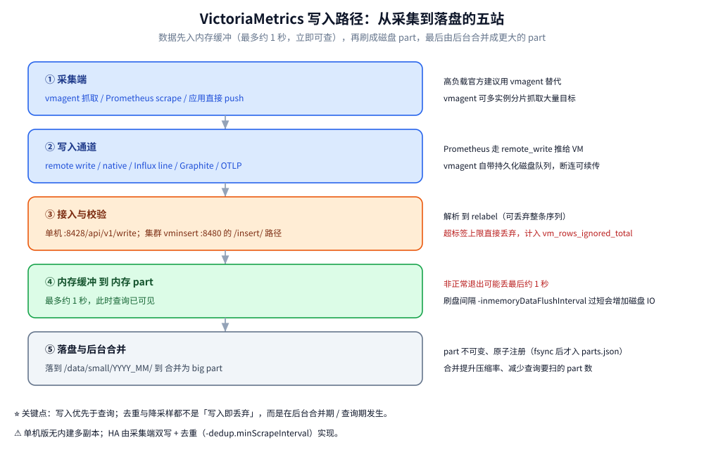

# 数据模型与写入路径

> 讲清 VictoriaMetrics 的时序数据模型（指标名 + 标签 → 序列、(时间戳, 值) → 样本），
> 为什么标签基数是成本核心，以及一条数据从采集、传输、接入校验、内存缓冲到落盘与合并
> 走过了哪五站；最后给出写入侧的几条硬边界（乱序、去重、标签数量与长度上限）。
>
> 内容整理自个人学习笔记，并参考官方文档与 Release Notes；素材见 [素材清单](../../../../素材清单.md)。

---

## 一、VictoriaMetrics 的数据模型是什么？

**本节要点**：只有两个概念——序列（series）与样本（sample）。把这两者的定义记准，后面所有"基数/成本"的判断都从它们推出。

### 1.1 时间序列 = 指标名 + 一组标签

一条时间序列由**指标名**和**一组标签**唯一确定，写法就是 Prometheus 那套：

```text
http_requests_total{job="api", method="GET", status="200"}
```

在 VM 内部，指标名本身也是一个标签，名为 `__name__`。所以"`__name__` + 其余全部标签"构成了这条序列的**身份**：只要标签集合有任何一个值不同，就是**另一条序列**。

### 1.2 样本 = (时间戳, 值)

样本是一个二元组：

| 组成 | 说明 |
| --- | --- |
| 时间戳 | 毫秒精度 |
| 值 | 浮点数（float64） |

一条序列就是"同一组标签 + 按时间排序的一串样本"。写入时不必按时间顺序发送（见第七节"乱序写入"）。

### 1.3 内部 TSID

VM 给每条序列分配一个内部 ID（**TSID**）。索引里存"标签集合 → TSID"的映射，样本本身只带 TSID 与值——**这正是"重复标签不会在每条样本上重复存"的实现方式**，也是 [架构与存储引擎.md](架构与存储引擎.md) 里"高基数省内存"的第一条机制。

---

## 二、为什么标签基数就是成本本身？

**本节要点**：序列数 = 标签取值的组合数；而序列数同时决定内存、索引与磁盘成本。这就是"控基数优先于加机器"的根本原因。

### 2.1 基数与"活跃序列数"

**基数**指的是"有多少条不同的时间序列"。它近似等于各标签取值数的**组合规模**——加一个标签维度，序列数可能不是一个加法，而是乘法级的增长。

VM 的两条成本线都挂在基数上：

- **内存**主要由**活跃序列数**（最近一小时内有数据点的序列）驱动；
- **索引**的增长由 **churn**（每天新增的序列数）驱动。

### 2.2 高基数标签的典型来源

| 来源 | 例子 | 为什么危险 |
| --- | --- | --- |
| 把用户/请求维度做标签 | `user_id`、`request_id`、`session_id` | 取值无上界，序列数随流量线性膨胀 |
| 把完整 URL 做标签 | `path="/api/v1/order/87654321"` | 每条不同的路径 = 一条新序列 |
| 把会变化的基础设施名做标签 | `pod`、`container_id` | 每次重建都产生新序列（高 churn） |
| 把时间或随机数做标签 | `ts`、`uuid` | 几乎每次写入都是新序列 |

### 2.3 降低基数的三条路

1. **改标签设计**：把无界维度移出标签（用路由模板代替完整 URL、去掉用户级维度）。
2. **把高基数维度放到别处**：高基数细节更适合放日志 / 链路，指标只保留低基数聚合维度。
3. **先聚合再入库**：用 recording rule（vmalert）或流聚合（vmagent 的 stream aggregation）在写入前就合并序列，从源头减少序列数。

⚠️ 一句话：**指标标签只放低基数、可枚举的维度**（服务名、路由模板、状态码、区域），任何"值会无限增长"的东西都不该进标签。

---

## 三、一次写入要经过哪几站？

**本节要点**：从采集到落盘一共五站，认清每一站发生的动作与可能出错的点，是排查"数据为什么没进来/变少"的路线图。



一句话概括这条链路：**采集端把数据送到接入点 → 接入点解析、relabel、校验后落进内存缓冲 → 内存 part 先可查 → 定期刷成磁盘 part → 后台合并成更大的 part。**

---

## 四、抓取端该用 vmagent 还是 Prometheus？

**本节要点**：两者都能抓取并 remote write，差别在"要不要顺带保留 Prometheus 本地 TSDB"以及"负载高低"。

| 方案 | 适合场景 | 说明 |
| --- | --- | --- |
| **vmagent** | 新链路、高负载、需要水平分片抓取 | 轻量采集 agent，支持拉取（scrape）与多种推送协议，可做 relabel，带**持久化磁盘队列**（断连可续传），可把目标分给多个实例水平扩展 |
| **Prometheus + remote_write** | 已有一套 Prometheus、想保留其本地 TSDB | 在 `remote_write` 里加一条指向 VM 的 URL 即可；Grafana 换成 VM 数据源 |
| **应用直接 push** | 自研采集链路、无 Prometheus | 直接用 HTTP 把数据推到 VM，或用 Influx line / OTLP 等协议 |

⚠️ 官方对**高负载**场景的建议是优先用 vmagent 替代 Prometheus 抓取：vmagent 的持久化队列与批量压缩能减少断连丢数与网络开销。

---

## 五、接入与校验阶段做了什么？

**本节要点**：写入地址因单机 / 集群而异；接入端在落盘前会做解析、relabel 与**标签上限校验**，超限的序列会被直接丢弃。

### 5.1 写入地址

| 形态 | 地址 | 说明 |
| --- | --- | --- |
| 单机版 | `http://<vm-host>:8428/api/v1/write` | Prometheus remote write 协议 |
| 集群版 | `http://<vminsert>:8480/insert/<租户 ID>/prometheus/api/v1/write` | `<租户 ID>` 为数据命名空间，单租户默认 `0` |

### 5.2 校验与丢弃

接入端（单机进程内，或集群版 vminsert）在落盘前依次做：

1. **解析**：按协议把原始字节解析成"指标名 + 标签 + 时间戳 + 值"；
2. **relabel**：按 `-relabelConfig` 改写或**丢弃**整条序列（relabel 丢掉的量可用对应指标观测）；
3. **上限校验**：检查标签数量 / 名字长度 / 值长度是否超限，超限的序列**直接丢弃**（不落盘）；
4. **分片（集群版）**：按"metric 名 + 全部标签"做一致性哈希，投递到对应 vmstorage；某节点不可用时**重路由**到健康节点（可用性优先于一致性）。

⚠️ 第 3 步是写入侧最常见的"数据莫名变少"的原因，详见第七节。

---

## 六、内存缓冲、落盘与合并各在什么时机发生？

**本节要点**：写入不是"进来即落盘"；理解内存 part 的可见性与刷盘时机，才能判断"刚写的数据能不能立刻查到"以及"故障时会丢多少"。

1. **内存缓冲（最多约 1 秒）**：进来的数据先在内存里攒批，之后形成**内存 part**。
2. **内存 part 立即可查**：数据形成内存 part 后，查询就能看到它——所以数据从写入到可查询只有很短的延迟。
3. **定期刷盘**：内存 part 按 `-inmemoryDataFlushInterval` 周期性刷到磁盘的 `/data/small/YYYY_MM/`，以便在 OOM、断电、`SIGKILL` 等非正常退出后仍能恢复。
4. **后台合并**：刷盘形成的 part 由后台合并成大 part（`/data/big/`），提升压缩率、减少查询扫描的 part 数；part 的写入与替换都是**原子**的。
5. **（可选）写入前聚合**：`-streamAggr.dedupInterval`（vmagent 侧流聚合）可以在数据**进入存储前**就去重 / 聚合，从源头减少写入量。

⚠️ 两个必须记住的后果：**① 非正常退出可能丢失最后约 1 秒的数据**（内存缓冲尚未刷盘）；**② 刷盘间隔调得过短会显著增加磁盘 IO**。

---

## 七、写入侧有哪些硬边界？

**本节要点**：四条边界——乱序、去重、标签上限、请求体大小。它们决定"什么数据能进来、进来后会不会被收敛"。

### 7.1 乱序写入：原生支持

VM **原生接受乱序写入**，不要求同一序列的样本按时间递增到达。因此多副本双写、延迟到达、补写历史数据都能落盘。这是它与"要求严格时间递增"的实现相比的一个显著差异。

### 7.2 去重：`-dedup.minScrapeInterval`

- 在每个离散的 `D` 区间内**只保留时间戳最大的一条样本**（与 Prometheus 的 stale 规则对齐）。
- 样本**仍会先全部落盘**，去重发生在**后台合并期与查询期**；要在写入前就去重，用 vmagent 的 `-streamAggr.dedupInterval`。
- 建议值等于采集配置里的 `scrape_interval`，且全局统一。
- 典型用途：HA 双写（两个副本写同一份数据）——靠去重收敛成一条。

### 7.3 标签上限：v1.108.0 有一次语义变更

| 参数 | 默认值 | 作用 |
| --- | --- | --- |
| `-maxLabelsPerTimeseries` | 40 | 单条序列允许的最大标签数 |
| `-maxLabelNameLen` | 256 | 标签名最大长度（字节） |
| `-maxLabelValueLen` | 4096（4KiB） | 标签值最大长度（字节） |

⭐ **v1.108.0（2024-12-16）起语义变更**：此前超限的标签会被**截断**（可能造成**静默的数据冲突**——不同的序列因截断后标签相同而被合并）；此后**直接丢弃整条序列**。丢弃量通过以下指标观测：

```text
vm_rows_ignored_total{reason="too_many_labels"}
vm_rows_ignored_total{reason="too_long_label_name"}
vm_rows_ignored_total{reason="too_long_label_value"}
```

⚠️ 排查"写入量对不上"时，先看 `vm_rows_ignored_total` 的这三个 reason。

### 7.4 其他边界

- `-maxInsertRequestSize`：单个请求的大小上限（默认 32MiB），超限的请求会被拒绝。
- `-sortLabels`：当同一指标的不同写入方标签顺序不一致时，开启它可归一化顺序，降低内存与 CPU 开销。
- 各协议还有自己的专属参数（如 Influx 的 `-influxDBLabel`），细节以对应协议文档为准。

---

## 使用：写入接入的几种方式与关键参数

**本节要点**：给三种最常见的接入写法，以及一张"改哪个参数"的对照。

### 方式一：Prometheus remote write 到单机版

```yaml
# prometheus.yml 片段
remote_write:
  - url: http://victoria-metrics:8428/api/v1/write
    queue_config:
      max_samples_per_send: 10000
```

### 方式二：vmagent 抓取后转发（高负载推荐）

```bash
# vmagent 关键参数示意：沿用 Prometheus 抓取配置，再指向 VM
./vmagent-prod \
  -promscrape.config=/etc/prometheus/prometheus.yml \
  -remoteWrite.url=http://victoria-metrics:8428/api/v1/write
```

### 方式三：应用直接 HTTP 写入（Prometheus 文本格式）

```bash
curl -X POST 'http://localhost:8428/api/v1/import/prometheus' \
  --data-binary 'http_requests_total{job="api",method="GET",status="200"} 12345'
```

### 写入侧关键参数对照

| 参数 | 默认 | 作用 |
| --- | --- | --- |
| `-dedup.minScrapeInterval` | 未设置 | 去重间隔；建议等于抓取间隔 |
| `-maxLabelsPerTimeseries` | 40 | 每序列标签数上限；超限丢弃 |
| `-maxLabelNameLen` | 256 | 标签名长度上限 |
| `-maxLabelValueLen` | 4096 | 标签值长度上限 |
| `-maxInsertRequestSize` | 32MiB | 单请求大小上限 |
| `-inmemoryDataFlushInterval` | 见官方文档 | 内存 part 刷盘间隔 |
| `-streamAggr.dedupInterval` | 未设置 | 写入前流聚合去重（vmagent 侧） |

⚠️ 未给确切默认值的项以官方文档 / `-help` 为准；版本间默认值可能调整。

---

## 延伸追问

- **样本里时间戳是什么精度？** → 毫秒。VM 同时接受多种时间戳格式（秒 / 毫秒 / RFC3339 等），接入端会归一化。
- **为什么"加一个高基数标签"比"多写几倍样本"更贵？** → 多写样本只增加样本量（可按保留期淘汰、可降采样）；加高基数标签是增加**序列数**，直接推高内存与索引，且降采样**不减少序列数**，代价更持久。
- **标签被丢弃后，为什么有时告警看起来"少了一条线"？** → v1.108.0 起是整条序列被丢弃（而非截断），所以该序列的所有数据都进不来。排查时看 `vm_rows_ignored_total` 的 reason 就能定位是数量、名字还是值超限。
- **乱序写入有什么代价？** → 兼容性与灵活性的代价是"同一序列的样本不保证按时间到达"，因此需要去重 / 合并来收敛重复；如果写入端本就严格有序，可以不做额外处理。
- **relabel 丢数据和标签超限丢数据，怎么区分？** → 看指标：relabel 阶段丢的量有 relabel 相关指标；标签超限丢的量记在 `vm_rows_ignored_total{reason=...}`。两者发生在链路的不同阶段。

---

## 关联

- [README.md](README.md) — 本目录导读：四个主题域、阅读顺序与版本坐标
- [架构与存储引擎.md](架构与存储引擎.md) — mergeset / 倒排索引 / 分区与 part（本篇的"下游"）
- [索引设计与查询优化.md](索引设计与查询优化.md) — 标签选择器与查询改写（基数在查询侧的表现）
- [MetricsQL查询.md](MetricsQL查询.md) — 查询语言；写进来之后怎么查
- [与Prometheus生态的关系.md](与Prometheus生态的关系.md) — remote write / scrape 的兼容面与差异
- [定位与适用场景.md](定位与适用场景.md) — 为什么"降基数"始终是第一优先级
- [../../数据库选型对比.md](../../数据库选型对比.md) — 七类存储的横向定位
> 反向引用（本篇被下列文档引到）：[性能调优与基准测试.md](性能调优与基准测试.md)、[运维与监控.md](运维与监控.md)、[高可用与集群部署.md](高可用与集群部署.md)
