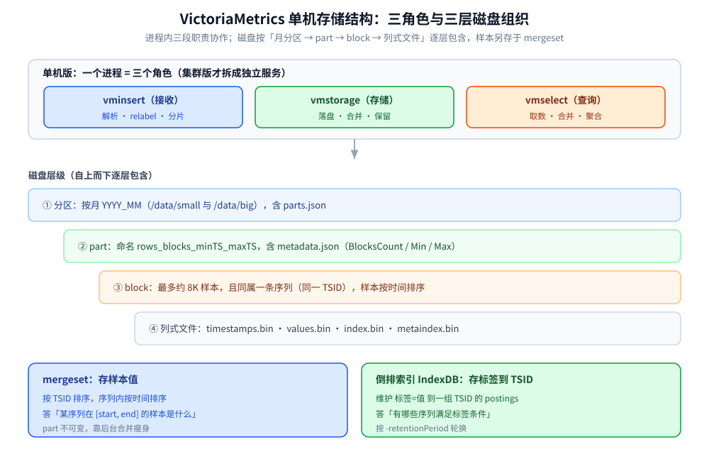

# 架构与存储引擎

> 讲清 VictoriaMetrics 单机版的内部构造：接收 / 存储 / 查询三个角色如何在一个进程里协作，
> mergeset 与倒排索引如何分工，数据按月分区、以 part / block 落盘的组织方式，
> 以及保留期、去重、降采样分别作用在哪一层、为什么这套设计在高基数下省内存。
>
> 内容整理自个人学习笔记，并参考官方文档与 Release Notes；素材见 [素材清单](../../../../素材清单.md)。

---

## 一、单机版的三个角色是怎么合进一个进程的？

**本节要点**：先把"三个角色"的职责说清楚——它们是集群版的三个服务，在单机版里被合进一个进程，理解职责划分是理解后面存储设计的前提。

### 1.1 三个角色分别负责什么

| 角色 | 集群版位置 | 职责 |
| --- | --- | --- |
| **vminsert** | 集群版写入前端（默认 8480） | 接收多种协议的写入、解析、relabel，按"metric 名 + 全部标签"做一致性哈希分片到各 vmstorage |
| **vmstorage** | 集群版存储节点（默认 8482） | 存储原始数据；对给定时间范围 + 标签过滤条件返回数据；节点间互不通信（shared-nothing） |
| **vmselect** | 集群版查询前端（默认 8481） | 接收查询、向所有 vmstorage 取数、合并与聚合后返回统一结果；内置 vmui |

### 1.2 单机版 = 三角色合一

单机版把接收、存储、查询做进**一个进程**，因此不需要在组件之间做网络分片——它靠**垂直扩展**（加 CPU / 内存 / 磁盘 / IO）提升能力，官方称其性能随资源"近乎线性扩展"。

这也解释了一个常见误解：**单机版也有"vminsert / vmstorage / vmselect"这三个词，但它们不是三个进程**，只是同一进程内三段职责的命名。只有当你要横向扩展、要按租户隔离、要多副本时，才把它们拆成集群版的服务。

⚠️ 单机版**不支持多租户**——需要多租户只能上集群版。

---

## 二、mergeset 与倒排索引分别负责什么？

**本节要点**：这是 VM 存储的两条腿——一条存"样本值"，一条存"标签到样本的映射"。分不清这两者，就理解不了查询为什么快。

### 2.1 mergeset：按 TSID + 时间排序的样本存储

VM 把时间序列数据存成类 MergeTree 结构。要读写某条序列的样本，前提是先有它的内部 ID（**TSID**）。样本本身按 **TSID 排序**、同一序列内再按**时间戳排序**存放——这就是 mergeset 的职责：**存值**。

### 2.2 倒排索引（IndexDB）：从标签找到 TSID

查询通常从标签条件出发（如 `{__name__="up", job="api"}`）。倒排索引维护**标签 = 值 → 一组 TSID**的映射（postings），于是"按标签选序列"变成"取交集后得到 TSID 列表"。它负责**定位序列**，不存样本值。

⭐ 两者分工可以一句话概括：**倒排索引回答"有哪些序列"，mergeset 回答"这些序列在某个时间段的样本是什么"**。

### 2.3 一次查询怎么串起两者

```text
标签选择器 → 倒排索引取 postings 求交 → 得到 TSID 列表
          → 在 mergeset 中按 TSID 定位 block → 解压出 [start, end] 内的样本
          → rollup / 聚合 → 返回
```

所以查询慢通常有两种截然不同的原因：**① 倒排索引侧选中的序列太多**（基数问题，取舍见 [索引设计与查询优化.md](索引设计与查询优化.md)）；**② mergeset 侧要读的 part 太多**（合并跟不上，见下文）。定位到具体是哪一侧，是调优的第一步。

---

## 三、数据在磁盘上怎么组织（分区 / part / block）？

**本节要点**：三层结构——按月分区 → part → block；理解它就能理解保留、合并、查询扫描量之间的关系。



### 3.1 按月分区

数据按**自然月**分区，落在 `-storageDataPath` 下的 `/data/{small,big}/YYYY_MM/` 目录里。分区目录里有一个 `parts.json`，记录该分区当前实际包含的 part 列表。

⚠️ "按月"带来一个必须记住的后果：**超出保留期的分区在每月 1 日才开始删除**，于是磁盘峰值约等于 **(保留期 + 1) 个月**——当月数据要完整保留。这也是 [定位与适用场景.md](定位与适用场景.md) 里磁盘估算要加一个月的原因。

### 3.2 part 的结构

每次刷盘会形成一个 **part**，命名形如：

```text
<rowsCount>_<blocksCount>_<minTimestamp>_<maxTimestamp>
```

每个 part 目录里有一个 `metadata.json`，关键字段是：

| 字段 | 含义 |
| --- | --- |
| `BlocksCount` | 该 part 内 block 的数量 |
| `MinTimestamp` / `MaxTimestamp` | 该 part 覆盖的最小 / 最大时间戳 |

⚠️ 一个 part 的时间跨度**不受保留期单位限制**：一个 part 可能横跨多天，所以它只有在**完全落出保留期后**才会被整体删除（"部分过期"不会被删）。

### 3.3 block 与列式文件

part 内部进一步切成 **block**：

- 每个 block 最多容纳约 **8K（8192）个样本**，且**同属一条时间序列**；
- block 内的样本**按时间戳排序**；
- 同一序列的多个 block，按各自**首样本的时间戳**排序。

存储是**列式**的：值、时间戳、TSID 分成不同文件，而不是把一条样本写成一条记录：

| 文件 | 内容 |
| --- | --- |
| `timestamps.bin` | 各 block 的时间戳列（压缩） |
| `values.bin` | 各 block 的值列（压缩） |
| `index.bin` / `metaindex.bin` | 快速定位"某 TSID、某时间范围"对应哪些 block 的索引 |

列式的价值在于**压缩**：同一列的数据特征一致（时间戳单调、同类指标的值分布相近），比行式压缩率高得多。

### 3.4 内存 part 与落盘

写入并非直接落盘：

1. 进来的数据先在**内存**里缓冲（最多约 1 秒）；
2. 形成**内存 part**，此时查询已经能看到它；
3. 内存 part 周期性刷到磁盘（间隔由 `-inmemoryDataFlushInterval` 控制），以便在 OOM、断电、`SIGKILL` 等非正常退出后仍能恢复。

⚠️ 刷盘间隔调得**太短会显著增加磁盘 IO**——这是"数据可见性"与"磁盘压力"之间的取舍。

part 的注册是**原子**的：完整写入并 fsync 后才登记进 `parts.json`，因此存储里不会出现"写了一半的 part"；断电中断的写入会在下次启动时被清理。

### 3.5 后台合并（compaction）

part 会**周期性在后台合并成更大的 part**，合并过程称为 compaction。收益有三：

1. **查询更快**——单次查询要检查的 part 数变少；
2. **文件数受控**——每个 part 的文件数固定，合并能压住打开文件数；
3. **压缩率更高**——大 part 通常压得比小 part 更好。

合并同样是原子的：要么合并成新 part 并原子替换源 part，要么失败、源 part 原样保留；不存在"合并了一半"的 part。

⚠️ **合并需要空闲磁盘**：VM 在合并后大小会超过空闲空间时不启动合并；空闲不足会让 part 数显著增长、查询变慢。这就是官方要求**至少保留 20% 空闲磁盘**的原因。另外，part 是**不可变**的，只会在合并或落出保留期后被删除。

---

## 四、保留期、去重、降采样分别作用在哪一层？

**本节要点**：三个都会"减少数据"的机制，作用的时机与层级完全不同——搞混会导致对"数据什么时候消失"的误判。

### 4.1 `-retentionPeriod`：分区 / part 级的删除

| 项 | 说明 |
| --- | --- |
| 取值 | 数字 + 单位（`h`/`d`/`w`/`y`），不带单位＝月 |
| 默认 | 1 个月 |
| 最小 | 24h / 1d |
| 触发时机 | 超出保留期的分区在**每月 1 日**删除；part 在**完全过期后**由后台合并删除 |
| 磁盘峰值 | 约 (保留期 + 1) 个月 |

单个实例只支持**一种**保留期。需要多种保留期时，社区版的做法是起多个实例（不同 `-retentionPeriod` / `-storageDataPath` / `-httpListenAddr`）再在前面架 `vmauth` 路由；企业版可直接用**保留过滤器** `-retentionFilter='{filter}:duration'` 按标签设不同保留期（多条过滤器命中时取**最小**保留期）。

### 4.2 `-dedup.minScrapeInterval`：合并期与查询期的样本级收敛

- 作用：在每个离散的 `D` 区间内**只保留时间戳最大的一条原始样本**（与 Prometheus 的 stale 规则对齐）。
- 关键点：**样本仍会先全部落盘**，去重是在**后台合并期和查询期**发生的——所以去重减少的是"查询看到的数据"和"合并后的磁盘占用"，不是"写入即丢弃"。若要在**写入前**去重，用 vmagent 的流聚合 `-streamAggr.dedupInterval`。
- 建议值：等于采集配置里的 `scrape_interval`，且全局尽量统一。
- 典型用途：Prometheus / vmagent 的 **HA 双写**——两个副本写同一份数据，靠去重收敛成一条。

### 4.3 `-downsampling.period`：企业版的分级降采样

- 语法 `offset:interval`：对**早于 offset** 的数据，在每个 `interval` 区间只保留最后一条样本。
- 可多次指定实现**多级降采样**，例如近期全精度、30 天前降到 5 分钟、180 天前降到 1 小时。
- 执行时机：在**后台合并期**，因此**磁盘不足或处于只读模式时无法执行**。
- 约束：各 interval 之间必须是倍数关系；启用去重时，去重间隔也必须是降采样 interval 的倍数，否则结果不一致。
- 注意：降采样**不减少序列数**，因此对"高 churn、每条序列样本少"的负载帮助有限——那种情况要靠减少序列（recording rule / 流聚合）。

⭐ 三条机制的分工可以一句话记住：**保留期删"整块时间"，去重收敛"重复样本"，降采样只保留"旧数据的稀疏点"**。

---

## 五、为什么这套设计在高基数下省内存？

**本节要点**：高基数是时序库的头号成本来源；VM 的内存/磁盘优势来自下面五个具体机制，而不是一句"压缩好"。

1. **标签集合间接寻址**：每条序列只在索引里登记一次"标签集合 → TSID"，样本本身只存 TSID 与值，**重复的标签不会在每个样本上重复存**。
2. **倒排 postings**：索引按 `标签=值` 组织，而不是按完整标签组合组织；高基数下不同的标签组合能共享同一批 postings，避免"组合爆炸"式的索引膨胀。
3. **列式压缩**：值、时间戳分列存储，同类数据一起压，压缩率远高于行式。
4. **查询侧内存有界**：查询只把"定位到的序列的元信息"放进内存，且有 `-search.maxUniqueTimeseries` 这类上限约束；样本是**按序列流式处理**的，不需要一次把全部数据读进内存。
5. **合并持续瘦身**：后台合并提升压缩率并减少文件数，让"老数据"占用越来越低。

⚠️ 反过来也要记住代价边界：**内存主要随"活跃序列数"增长**。同样 100 万点/秒，1 万条序列和 100 万条序列的内存开销天差地别。降基数永远是第一优先级——这与 [数据模型与写入路径.md](数据模型与写入路径.md) 的结论一致。

---

## 使用：目录结构与关键参数

**本节要点**：给一份"落盘长什么样 + 哪些参数管哪一层"的对照。

### 磁盘目录结构（示意）

```text
<storageDataPath>/
├── data/
│   ├── small/YYYY_MM/            # 小 part（近期写入、待合并）
│   │   ├── parts.json            # 本分区当前 part 清单
│   │   └── <rows>_<blocks>_<min>_<max>/
│   │       ├── metadata.json     # BlocksCount / MinTimestamp / MaxTimestamp
│   │       ├── timestamps.bin
│   │       ├── values.bin
│   │       ├── index.bin
│   │       └── metaindex.bin
│   └── big/YYYY_MM/              # 合并后的大 part
└── indexdb/                      # 倒排索引（按 -retentionPeriod 轮换）
```

### 参数分层对照

| 参数 | 作用层 | 说明 |
| --- | --- | --- |
| `-storageDataPath` | 全局 | 数据目录 |
| `-retentionPeriod` | 分区 / part | 保留期；默认 1 月，最小 24h/1d |
| `-inmemoryDataFlushInterval` | 内存 part | 内存 part 刷盘间隔；过短增加磁盘 IO |
| `-dedup.minScrapeInterval` | 合并期 / 查询期 | 去重间隔；建议等于抓取间隔 |
| `-downsampling.period` | 合并期 | 企业版多级降采样 |
| `-retentionFilter` | 分区 / part | 企业版按标签设保留期 |
| `-storage.minFreeDiskSpaceBytes` | 全局 | 低于此值进入只读模式 |

⚠️ 未给出确切默认值的参数请以官方文档 / `-help` 为准；不同版本默认值可能变化。

---

## 延伸追问

- **为什么先写内存 part、再落盘，而不是直接写磁盘？** → 攒批能大幅提升压缩率与写入吞吐；内存 part 立即可查，兼顾了"写入快"与"数据可见"。代价是最后约 1 秒的数据在非正常退出时可能丢失——所以对可靠性要求高时，采集端（vmagent）要有持久化队列。
- **part 不可变，那更新 / 删除一条序列怎么办？** → VM 不做原地更新。删除走专门的删除接口，且官方建议**只在"误写入要清理"这类例外场景使用**，不要当常规操作；更常见的做法是靠保留期自然淘汰。
- **为什么合并不能省？** → 不合并 → part 数膨胀 → 查询要扫更多 part → 变慢；同时压缩率下降、文件数上升。合并是"用后台 IO 换查询性能与磁盘效率"的机制。
- **去重与降采样能同时用吗？** → 可以，官方明确二者可共存。但要保证**去重间隔是降采样 interval 的倍数**，否则结果不一致。
- **高基数场景下，加内存和加 CPU 哪个更有效？** → 先加内存（内存不足会让 VM 进入"慢路径"，`vm_slow_*` 指标会抬头），同时优先降基数；CPU 只在内存与基数都合理后才是瓶颈。

---

## 关联

- [README.md](README.md) — 本目录导读：四个主题域、阅读顺序与版本坐标
- [数据模型与写入路径.md](数据模型与写入路径.md) — 数据模型、标签基数为什么是成本核心、写入路径与写入边界
- [索引设计与查询优化.md](索引设计与查询优化.md) — 倒排索引的选择器与查询改写（本篇只讲索引"是什么"，那篇讲"怎么用"）
- [定位与适用场景.md](定位与适用场景.md) — 单机能力边界与容量估算
- [../GreptimeDB/架构与存储引擎.md](../GreptimeDB/架构与存储引擎.md) — 另一条时序技术路线的存储引擎（对照阅读）
- [../../数据库选型对比.md](../../数据库选型对比.md) — 七类存储的横向定位
> 反向引用（本篇被下列文档引到）：[性能调优与基准测试.md](性能调优与基准测试.md)、[运维与监控.md](运维与监控.md)、[高可用与集群部署.md](高可用与集群部署.md)
