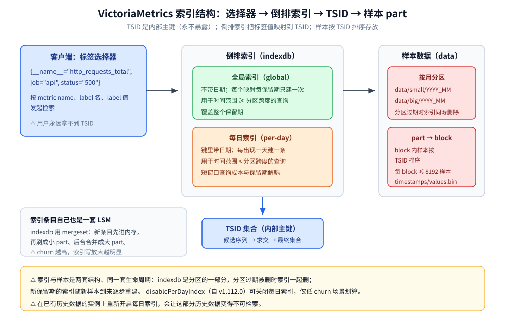
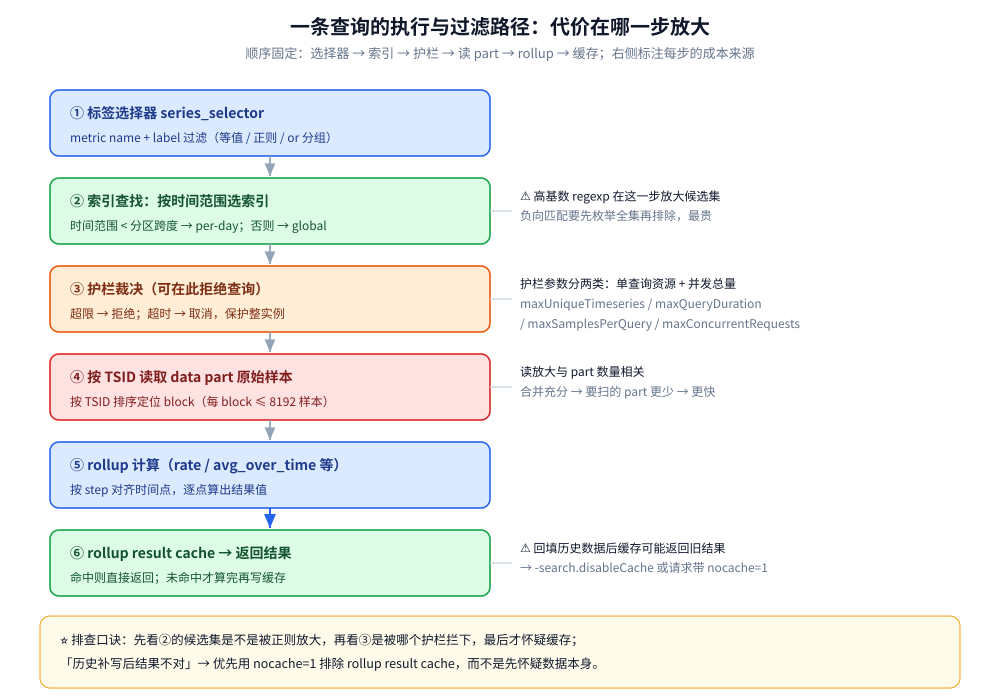

# 索引设计与查询优化

> VictoriaMetrics 的索引不是 B+ 树，而是「TSID 主键 + 倒排索引」的双层结构：本篇讲清
> metric name / label 名 / label 值如何映射到 TSID，global index 与 per-day index 为什么并存、
> 查询时按什么分派，索引与数据 part 在磁盘上的关系，以及查询侧最容易踩的四个坑
> ——高基数正则、label 过滤顺序、护栏参数、query cache。
>
> 内容整理自个人学习笔记，并参考官方文档与 Release Notes；素材见 [素材清单](../../../../素材清单.md)。

---

## 一、VictoriaMetrics 的索引为什么不是一棵 B+ 树？

**本节要点**：关系库靠 B+ 树把「行」组织成有序结构；VM 面对的是**标签组合爆炸**——
真正要回答的是「哪些时间序列满足这组标签过滤」。所以它换了一条路：
先给每条序列编一个内部主键 TSID，再用**倒排索引**把「标签值」映射到 TSID 集合。

### 1.1 TSID 是内部主键，永不暴露给客户端

VM 用 **TSID（time series ID）** 唯一标识一条时间序列，并按 TSID 排序存储原始样本。
所以 TSID 本质上是**主索引**：只要拿到 TSID，就能按序把这条序列的所有样本捞出来。

⚠️ 关键约束：**TSID 不对客户端暴露，仅供内部使用**。用户永远只写标签选择器
（`http_requests_total{job="api",status="500"}`），从来没有机会写 TSID——
这是它能自由地重建、重排内部 ID 的前提。

### 1.2 倒排索引把「标签选择器」翻译成 TSID 集合

既然客户端只给标签，VM 就维护一个**倒排索引**，按 **metric name、label 名、label 值**
三类值分别建立到 TSID 的映射。一次查询在索引侧的动作可以概括成：

```text
标签选择器 {__name__="http_requests_total", job="api"}
   ↓ 查倒排索引（metric name 维度 + label 维度）
候选 TSID 集合（可能很大）
   ↓ 与其他过滤条件求交
最终 TSID 集合
   ↓ 按 TSID 去对应的 data part 读样本
原始样本 → rollup 函数 → 结果
```

⭐ **一句话理解**：倒排索引解决「从标签找到序列」，TSID 解决「从序列找到样本」，两者分工明确。

### 1.3 为什么不用 B+ 树？

| 维度 | B+ 树（关系库） | VM 的倒排索引 + TSID |
| --- | --- | --- |
| 主键 | 业务主键或自增 ID | **TSID（内部主键，按序存样本）** |
| 二级索引 | 一个索引对应一列/几列 | 一个索引项对应**一个标签值 → 一批 TSID** |
| 更新代价 | 分裂/合并页，随机写 | 索引条目**追加进 LSM 风格的 part**，顺序写为主 |
| 适配场景 | 点查、范围查、JOIN | **标签过滤 + 时间范围**的时间序列查询 |

⚠️ B+ 树擅长「一个键对应少量行」，时间序列里**一个高频标签值可能对应几十万条序列**——正是大 posting list 的形态。



---

## 二、global index 与 per-day index 为什么要并存？

**本节要点**：倒排索引有个绕不开的账——**posting list 随时间不断变长**。
「最近一天」的查询如果也要翻整段保留期的索引，成本会随保留期线性上涨。
VM 的解法是把索引**按维度切一刀**：除了全量的 global index，再维护一份带日期的 per-day index。

### 2.1 两套索引的分工

| 索引 | 键里带日期吗 | 维护时机 | 用途 |
| --- | --- | --- | --- |
| **global index（全局索引）** | 不带 | 每个映射**每个保留期只创建一次** | 覆盖整个保留期的大范围查询 |
| **per-day index（每日索引）** | 带 | 每个映射**对每个出现过的日期各创建一条** | 加速短时间范围（常见是「最后一天」）查询 |

两套索引存的是**同一批映射**，只是 per-day 版多带了日期维度。因此它们不是互斥，
而是**同一份事实的两种组织方式**。

### 2.2 查询时怎么选：时间范围决定用哪套

官方文档当前的表述是：**查询时间范围小于分区跨度时用 per-day index，等于或大于分区跨度时用 global index**
（分区跨度通常是一个月，见第三节）。
早期版本文档把这条件写成「**40 天或更短**用 per-day，超过 40 天用 global」——
两种表述指的是同一套机制，只是阈值写法不同。

⭐ 直觉：Grafana 上「最近 1 小时 / 最近 1 天」才是查询的绝大多数。
per-day index 让这类查询**只翻最近几天的索引**，而不是全量，
从而把「短窗口查询」的成本与**保留期长度解耦**。

### 2.3 per-day index 的代价：churn 与写放大

per-day index 不是白拿的。它带来的开销直接跟**churn（序列更替率）**挂钩：

- 一条序列只要在某天出现过，那天就要为它写一条 per-day 索引记录；
- 高 churn 场景（如 K8s：Pod 滚动、短命序列多）**每天新造大量映射**，per-day index 快速膨胀；
- 反之**固定不变的序列集合**（历史气象、IoT 传感器）每天把同一批映射重写一遍，纯属浪费。

⚠️ 这就是为什么 VM 把「per-day index 该不该开」做成了一个**可切换的开关**，
而不是写死的策略。

### 2.4 该不该关掉 per-day index？

`-disablePerDayIndex` 用于**关闭 per-day index、所有查询只用 global index**，
官方标注其**自 v1.112.0 起可用**。官方给出的适用条件是
「**固定的序列集合、分散在大时间范围上**」（例如加载多年的历史数据）——
此时关掉它**能提升写入速度、降低磁盘占用**，因为不再为每天重复写映射。

⚠️ 三条务必记住的注意点：

1. **新装时决定**最好——官方建议在**全新部署**时就设好这个开关；
2. 在**已有历史数据**的实例上关闭是可以的；
3. ⚠️ **在已有历史数据的实例上重新开启 per-day index，会让这部分历史数据变得不可检索**
   ——因为它们的 per-day 映射从未被建立过。

⭐ 结论：**高 churn（K8s）= 保持默认（两套都开）；低 churn（历史/IoT）= 可考虑关闭**。

---

## 三、索引与数据在磁盘上到底是什么关系？

**本节要点**：索引和数据是**两套独立的存储结构**，但**共用同一套生命周期**。
理解目录结构，就能明白「为什么删除是按分区整块删的」。

### 3.1 data/{small,big} 与 indexdb 的目录关系

数据按**月分区**存放在 `<-storageDataPath>/data/{small,big}/YYYY_MM/` 下，
每个分区由一个或多个 **part** 组成，每个 part 里是**按 TSID 排序**的 block：

```text
<storageDataPath>/
├── data/{small,big}/YYYY_MM/<part>/  # 样本：timestamps.bin / values.bin / index.bin / metaindex.bin
└── indexdb/{prev,cur,next}/<part>/   # 标签→TSID 的倒排索引条目，与分区/保留期同寿
```

| 结构 | 存什么 | 与 TSID 的关系 |
| --- | --- | --- |
| `data/` 下的 part | **原始样本**（timestamps.bin / values.bin） | 样本**按 TSID 排序**，TSID 是这批数据的主键 |
| `index.bin` / `metaindex.bin` | 快速定位「某 TSID + 某时间范围」的 block | 数据内的**块级索引**，不是标签索引 |
| `indexdb/` | **标签 → TSID 的倒排索引条目** | 与 data 分开存，但按同一套分区/保留期管理 |

⭐ 官方数据 part 的粒度：每个 block 最多容纳 **8,192 个样本**（官方文档写作「最多 8K」），
同一序列样本超限会拆成多个 block。

### 3.2 mergeset：索引条目自己的 LSM

`indexdb` 里的索引条目本身也需要一套「可追加、可合并、可删旧」的存储——
VM 用的是自研的 **mergeset**（一个 LSM 风格、按 key 排序的不可变 part 集合）。
它在结构上与数据侧的 part **同构**：新条目先进内存缓冲，再刷成小 part，
后台持续合并成大 part。

```text
新序列/新标签 → 索引条目先进内存 → 刷成 mergeset 小 part → 后台合并成大 part
（对应数据侧：raw-row shards → inmemory part → small part → big part）
```

⚠️ 这带来一个重要推论：**索引也有「写放大」**。churn 越高，索引条目产生得越快，
mergeset 的刷盘与合并就越频繁，CPU / 磁盘 IO / 内存一并上涨。
所以「降基数」不只是省样本，更是**省索引**。

> 索引与数据 part 的**合并时机与刷盘节奏**（`-inmemoryDataFlushInterval` 等）属于存储引擎话题，
> 见 [架构与存储引擎.md](架构与存储引擎.md) 与 [数据模型与写入路径.md](数据模型与写入路径.md)，
> 本节只关心它**怎么影响索引**。

### 3.3 索引的生命周期与 `-retentionPeriod` 的联动

这是最容易被忽略、又最影响容量规划的一条：**indexDB 是分区的一部分，分区过期被删时索引跟着一起删**；
进入新保留期的索引，随着新样本到来慢慢重建。

`-retentionPeriod` 的官方规则：

| 项目 | 规则 |
| --- | --- |
| 单位字符 | `h`（小时）/ `d`（天）/ `w`（周）/ `M`（月）/ `y`（年）；不带单位按**月**算 |
| 默认值 | **1 个月（31 天）** |
| 最小值 | 24h 或 1d |
| 磁盘占用上限 | **（保留期 + 1）个月**——因为过期分区要到新月份第一天整块删 |
| 扩展保留期 | 在已有数据上**延长是安全的**；调小则超出部分最终会被删 |
| 无限保留 | 不支持，但可写极大值如 `-retentionPeriod=100y` |

⚠️ per-day index 的换天也是个资源尖峰：官方提供了 `-storage.idbPrefillStart`
（**默认提前 1 小时**，最大可设 23h），让 VM 在换天前**逐步预填充下一天的索引条目**，
把「零点瞬间全员建索引」的抖动摊平。官方建议**绝大多数情况下不要改这个值**。

---

## 四、高基数 regexp 为什么会拉爆内存？

**本节要点**：正则本身不贵，贵的是**它匹配出多少条序列**。VM 的护栏参数之所以存在，
就是因为一条「看起来很短」的正则可能展开成百万级 posting list。

### 4.1 从选择器到 TSID 集合：代价在哪里

查询的成本大致与**命中的唯一序列数**成正比：每条命中的序列都要在内存里留一份元信息、
参与后续运算。VM 官方在描述 `-search.maxUniqueTimeseries` 时明确写道：
**单条查询的最大内存与 CPU 开销，与它检索到的唯一序列数成比例**。

所以危险的不是「正则复杂」，而是「正则宽松」：

```text
# 相对安全：用具体标签把候选集收缩下来
http_requests_total{job="api", status="500"}

# 危险：高基数 label 上做宽正则，可能一次拉出几十万条序列
http_requests_total{job=~".*", path=~"/api/.*"}

# 更危险：负向匹配 —— 要先算出「全集」再减掉一部分
http_requests_total{path!~"/health.*"}
```

### 4.2 负向匹配与「无锚点」正则的陷阱

| 写法 | 为什么贵 |
| --- | --- |
| `label=~".*"` / `label=~".+"` | 该 label 存在的高基数序列**基本全中** |
| `label!~"..."`（负向） | 需要先枚举候选再排除，**候选集往往是全集** |
| 无锚点正则 | 引擎无法利用前缀收窄，只能逐值尝试 |

⚠️ 更隐蔽的一类：**用高基数 label 做过滤**本身就不划算。
`user_id` / `request_id` / 完整 URL 这类值，适合放进**日志或链路**，
而不是当指标 label——每多一种取值，就是多一条序列 + 多条索引条目。

### 4.3 label 过滤顺序能不能优化？

**能，但要先明白优化点在哪**。VM 会自己选择过滤顺序，用户能做的是**让候选集尽量小**：

① **先给具体等值条件**（`job="api"`、`status="500"`）让候选集变小，再叠正则条件；
② ⚠️ **不要用高基数 label 做宽正则**，哪怕加上它会「少几条序列」也不值得；
③ 需要把多个选择器拼起来时，用 `or` 语法显式分组，避免一个巨型正则硬怼：

```text
# 可读性与性能都更好：显式 or 分组
{env="prod",job="a" or env="dev",job="b"}
```

⭐ 一句话：**过滤顺序的优化本质是「尽早把候选集砍到最小」**，
VM 能帮你在多个条件间排序，但帮不了你把一个天然宽的条件变窄。

---

## 五、查询护栏参数该怎么配？

**本节要点**：护栏不是「防止查询变慢」，而是「**让坏查询失败，而不是拖垮整个实例**」。
它们分两类：限制**单条查询的资源**，和限制**并发总量**。

### 5.1 逐个参数：限制什么、超限会怎样

| 参数 | 限制的对象 | 超限行为 |
| --- | --- | --- |
| `-search.maxUniqueTimeseries` | 单条查询能检索的**唯一序列数** | 拒绝该查询；**默认按可用内存与并发上限自动推算**（官方） |
| `-search.maxQueryDuration` | 单条查询的**最大执行时长** | 取消该查询；可用请求参数 `timeout` **下调**，但不能超过该上限 |
| `-search.maxMemoryPerQuery` | 单条查询可用的**内存** | 拒绝该查询；总量估算 ≈ 该值 × `-search.maxConcurrentRequests` |
| `-search.maxConcurrentRequests` | **并发请求数** | 超出后新请求**排队**，等待超过 `-search.maxQueueDuration` 才报错 |
| `-search.maxSamplesPerQuery` | 单条查询处理的**原始样本总数** | 拒绝该查询（限制 CPU 重查询） |
| `-search.maxPointsPerTimeseries` | 每条序列**返回的数据点数** | 截断/拒绝 range query 的结果点数 |
| `-search.maxSeries` | `/api/v1/series` 返回的序列数 | 该接口主要为 Grafana 自动补全服务，高 churn 下易重 |
| `-search.maxResponseSeries` | `/api/v1/query(_range)` 返回的序列数 | 限制查询结果规模 |

⚠️ 两点最容易配错：**默认值不要凭记忆写死**——`-search.maxUniqueTimeseries` 官方已明确说明
**默认按可用内存与并发上限自动计算**，其余参数请以你所用版本的 `-help` 输出为准；
**护栏是「按查询拒绝」，不是「按用户限流」**——要做配额/多租户限流是另一回事
（`vmauth` / 多租户），别指望护栏参数兜底。

### 5.2 从「拒绝哪些查询」反推容量

配置顺序建议反过来想：**先决定「哪些查询应当被拒绝」，再调参数**。

```text
① 先测出「健康查询」的资源画像（唯一序列数、样本量、耗时、内存）
② 把护栏设在「健康查询 P99 之上、异常查询之下」
③ 观察被拒绝的查询是不是真的该拒（拒错了说明阈值太紧）
④ 定期回看 top queries，把「每次都触顶」的查询改写成更窄的过滤
```

⭐ 一个经常被忽略的配套参数：`-search.maxDeleteSeries`（**自 v1.110.0 起可用**）
限制单次删除接口能删的唯一序列数——批量删除同样可能引发资源尖峰。

---

## 六、query cache 在链路的哪一环？

**本节要点**：VM 默认缓存查询结果，用来吃掉 Grafana 面板「定时刷新」造成的重复计算。
但它**对历史数据回填（backfill）不友好**——这正是排查「结果不对」时第一个要排除的变量。

### 6.1 rollup result cache 的命中条件

VM **默认缓存查询响应**，目的正是加速 `time` / `start` / `end` 参数不断递增的重复查询
（Grafana 定时刷新时，只有这几个时间参数在变，查询本身不变）。
官方博客《Inside vmselect》给出的几个实现细节：

- rollup result cache 最多用掉**允许内存的约 12.5%**；
- **不缓存最近的数据**——`now-5m` 到 `now` 这一段被排除（`-search.cacheTimestampOffset`），
  因为这段样本可能还没写全；返回结果还会给最新数据留一个延迟窗口
  （`-search.latencyOffset`，官方博客表述为默认 30 秒），避免把「可能不完整」的点画到图上。

### 6.2 什么时候必须关掉缓存

⚠️ 触发条件只有一个：**往库里补写历史数据（backfill）**。缓存里可能存着「当时算出来」的结果，
补写之后就不再正确。官方给出的关闭方式：

| 方式 | 做法 |
| --- | --- |
| 全局关闭 | 给 VM / 所有 vmselect 传 `-search.disableCache` |
| 单次请求关闭 | 请求带 `nocache=1`（Grafana 可放进数据源的 Custom Query Parameters） |
| 重置缓存 | 调 `resetRollupCache` 接口，或启动时加 `-search.resetRollupResultCacheOnStartup` |

⭐ 排查口诀：**「历史补写后结果不对」→ 先怀疑 query cache** 而不是先怀疑数据，官方 Troubleshooting 也是这么建议的。

---

## 使用：给一条疑似「拖垮实例」的查询做体检

按下面的顺序逐层排除，**每一步都能定位到一类根因**：



```text
① 看是不是索引爆炸：这条查询命中的唯一序列数是多少？
   → 用 vmui / cardinality explorer 看该 selector 的序列规模
   → 若命中量级远超预期，先改选择器（去高基数正则、去负向匹配）

② 看是不是被护栏拦下：报错信息里出现的是哪个 limit？
   → maxUniqueTimeseries / maxSamplesPerQuery / maxQueryDuration 分别指向不同瓶颈

③ 看是不是被缓存误导：最近有没有 backfill 历史数据？
   → 有 → 带 nocache=1 重试一次，或先重置 rollup cache

④ 看是不是索引配置不合适：序列集合是否固定不变？
   → 固定且量大 → 评估 -disablePerDayIndex（注意历史数据可检索性）
   → 高 churn → 保持默认，转而做「降基数」
⑤ 复核：改完用同一条查询 + 同一时间范围再跑一遍，对比唯一序列数与耗时
```

两条可操作的检查清单：

- **索引侧**：`/metrics` 里看 `indexdb/*` 相关 cache 命中率，官方文档建议接近 100% 即无需再调；
  持续偏低再用 `-storage.cacheSizeIndexDB*` 系列调整。
- **写入侧**：churn 明显时，官方提供 `-storage.maxHourlySeries` / `-storage.maxDailySeries`（默认 `0`，即不限制）来**限额新增序列**。

---

## 延伸追问

- **TSID 为什么永不暴露？为什么「降基数」比「加机器」更优先？** → 因为 TSID 是内部主键，
  VM 需要能自由重建、重排、合并内部 ID 而不破坏对外契约；而基数会同时抬高**样本量 + 索引条目量**
  （后者进 mergeset，引发持续刷盘与合并），所以降基数才是从源头压这条曲线。
- **global index 和 per-day index 存两份数据，会不会浪费磁盘？** → 会，但换来的是
  「短窗口查询成本与保留期解耦」。低 churn 场景这笔账不划算，所以才有 `-disablePerDayIndex`
  这个开关——**它把「要不要为短查询付这份索引税」的决定权交给用户**。⚠️ 官方同时提示：
  关闭后短时间范围的查询**可能变慢**，这是「省写入 / 省磁盘」换「短查询慢一点」的取舍。
- **`-search.maxQueryDuration` 和请求里的 `timeout` 是什么关系？** → 前者是**上限**，
  请求侧的 `timeout` 只能把**本次查询**的时限压得更短，不能突破命令行设定的上限。
- **query cache 命中率越高越好吗？** → 对「重复的范围查询」是；但对**刚写完就要读**的场景，
  它反而是「结果不对」的头号嫌疑。缓存是为稳定刷新设计，不是为「写后立读」设计。

---

## 关联

- [架构与存储引擎.md](架构与存储引擎.md) — 本篇讲索引与查询，存储引擎篇讲 part / mergeset / 刷盘节奏的完整机制
- [数据模型与写入路径.md](数据模型与写入路径.md) — 标签组合如何变成序列与索引条目，写入侧的另一半故事
- [MetricsQL查询.md](MetricsQL查询.md) — 索引决定「能查到哪些序列」，查询语言决定「怎么算」
- [性能调优与基准测试.md](性能调优与基准测试.md) — 护栏参数与缓存的整体调优位置
- [数据库选型对比.md](../../数据库选型对比.md) — 时序库在七类存储中的横向定位
- [可观测性选型.md](../../../../06-工程实践/可观测性/可观测性选型.md) — Prometheus / VM / InfluxDB 在可观测性栈层面的三方对比
> 反向引用（本篇被下列文档引到）：[与Prometheus生态的关系.md](与Prometheus生态的关系.md)、[运维与监控.md](运维与监控.md)、[选型与落地案例.md](选型与落地案例.md)
