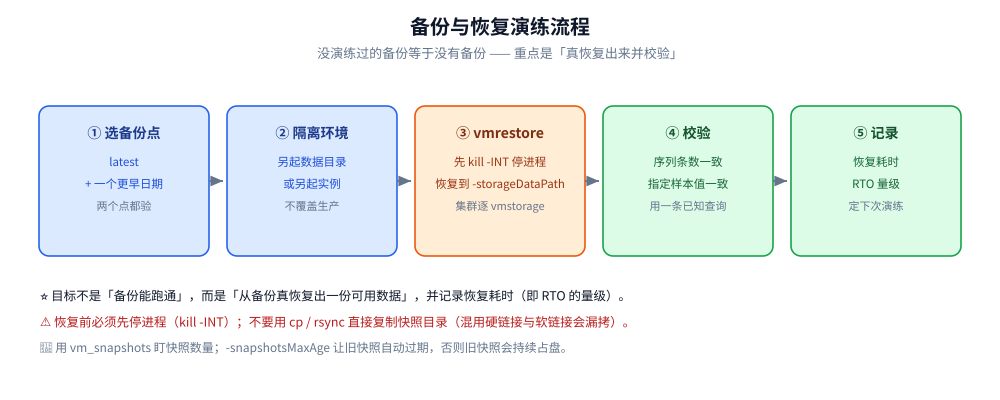
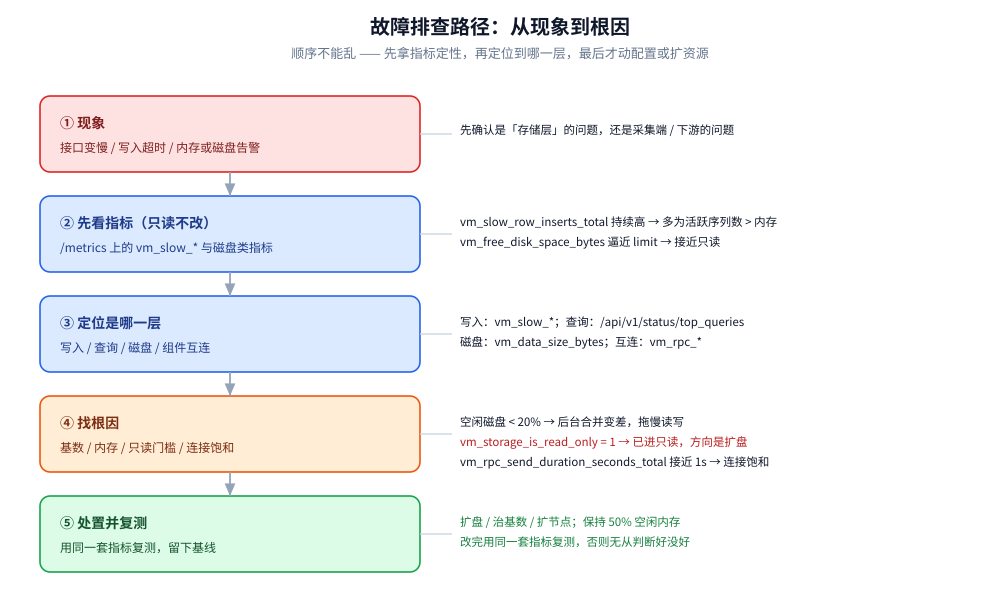

# 运维与监控

> 部署拓扑怎么选、`/metrics` 上的 `vm_*` 指标怎么读、健康检查与状态入口在哪、
> 备份与恢复怎么**演练**、五类常见故障如何按「现象 → 定位 → 处置」下钻、告警该盯哪几条
> —— 回答「**这套系统上线之后，每天到底在看什么、出事了先动哪里**」。
>
> 内容整理自个人学习笔记，并参考 VictoriaMetrics 官方文档、官方告警规则与 Release Notes；素材见 [素材清单](../../../../素材清单.md)。
>
> ⭐ 指标与阈值以 **VictoriaMetrics v1.153.0（2026-09-28 发布）** 与 **LTS 线 v1.148.x** 的官方文档、
> 官方仓库 `deployment/docker/rules/` 下的告警规则为准，每条均给出处。
> ⚠️ **本篇不含任何本机实测**，凡引用数字一律是官方口径。
>
> ⭐ 边界先说清：本篇不重复「可观测性栈层面怎么选」
> （见 [可观测性选型.md](../../../../06-工程实践/可观测性/可观测性选型.md)）与「时序库在七类存储里的横向定位」
> （见 [存储选型.md](../../存储选型.md)）。

---

## 一、部署拓扑该怎么选？（单机 / 集群 / K8s）

**本节要点**：拓扑选择本质上是在「**运维复杂度**」与「**可扩展性 + 多租户**」之间取舍；
线上的三条硬约束是：**组件要按地址直连抓指标、不要走负载均衡；每个组件类型用独立的 job 名；`/insert` 与 `/select` 必须分流**。

| 拓扑 | 组成 | 适用 |
|---|---|---|
| **单机** | 一个进程（默认 `8428`）同时做写入、存储、查询 | 摄取速率低于约 100 万数据点/秒、无需多租户 |
| **集群** | `vminsert`(`8480`) + `vmselect`(`8481`) + `vmstorage`(`8482`)，前面挂 `vmauth`/`nginx` | 需要水平扩展、多租户、读写独立扩容 |
| **K8s** | 官方 Helm charts 或 VictoriaMetrics Operator 管理上述组件 | 已在 K8s 上，需要声明式运维与滚动升级 |

官方在监控建议里给的三条（单节点文档「Monitoring」段）：

1. **给每个组件类型不同的 `job` 名**（`vmagent`、`vmalert` 各自独立）；
2. **绝不用负载均衡地址抓指标**，所有被监控组件都要**按自己的地址直连抓取**；
3. 通过 `vmalert` 或 Prometheus 加载**官方推荐的告警规则**。

⚠️ 单机版还可开 `-selfScrapeInterval=10s` 之类做**自抓取**，把 `/metrics` 自己写回自己；
集群版则应由外部的 `vmagent` 统一抓取，且按上面的第 2 条**直连各组件**。

---

## 二、自监控该盯哪些指标？（`/metrics` 的 `vm_*` 系列）

**本节要点**：VictoriaMetrics 在 `/metrics` 上以 Prometheus 暴露格式输出自身指标。
读它们要分清三类：**写入健康**（`vm_slow_*`）、**资源安全**（磁盘 / 只读）、**集群互连**（`vm_rpc_*`）。
⚠️ 这些是**自监控指标**，不是被采集的业务指标。

### 2.1 写入与序列健康

| 指标 | 含义 | 怎么读 |
|---|---|---|
| `vm_rows_added_to_storage_total` | 落库（含去重后）的样本数 | 求 `rate` 得写入速率 |
| `vm_rows_inserted_total` | 自启动以来累计插入的样本数 | 官方 README 监控章节列为关键指标之一 |
| `vm_slow_row_inserts_total` ⭐ | 慢写入次数 | 持续偏高通常意味着**活跃序列数超出内存承载** |
| `vm_slow_metric_name_loads_total` | 指标名慢加载次数 | 同上，指向内存不足 |
| `vm_new_timeseries_created_total` | 新序列创建数 | 求 `rate` 得 **churn rate**（序列流失率） |
| `vm_cache_entries{type="storage/hour_metric_ids"}` | 近一小时有新数据的序列数 | 近似「**活跃时间序列数**」 |
| `vm_rows_ignored_total{reason}` | 被丢弃的写入行 | 按 `reason` 区分原因（含基数限流命中） |
| `vm_indexdb_items_dropped_total{reason}` | 索引注册被跳过的条目 | 常见 `too_long_item`：序列不得超 64KB |

⭐ 判断「是不是内存不够」的经验线：官方说若 VictoriaMetrics 每秒摄取 10 万数据点却吃掉**超过一个 CPU 核**，
很可能就是**当前活跃序列数对这点内存来说太多了**，指标上会表现为 `vm_slow_*` 居高不下。

### 2.2 磁盘与只读安全

| 指标 | 含义 |
|---|---|
| `vm_free_disk_space_bytes` | `-storageDataPath` 剩余空间 |
| `vm_free_disk_space_limit_bytes` | 触发只读的门槛（对应 `-storage.minFreeDiskSpaceBytes`） |
| `vm_data_size_bytes{type=…}` | 数据 / 索引在磁盘上的占用总量 |
| `vm_storage_is_read_only` | 单机 / `vmstorage` 是否已进入**只读模式**（`1` = 是） |
| `vm_snapshots` | 当前快照数量（旧快照会额外占盘） |

### 2.3 cache 与并发

| 指标 | 含义 |
|---|---|
| `vm_cache_size_bytes` / `vm_cache_size_max_bytes` | 各类 cache 的实际大小 / 上限 |
| `vm_cache_misses_total` / `vm_cache_requests_total` | 未命中数与请求数（算命中率） |
| `vm_concurrent_insert_current` / `vm_concurrent_insert_capacity` | 当前并发写入 / 并发上限 |
| `vm_concurrent_select_limit_timeout_total` | 因达到并发上限而超时的查询数 |
| `vm_search_max_unique_timeseries` | 自动算出的「单查询最多扫描多少唯一序列」 |

### 2.4 集群互连与组件健康

| 指标 | 含义 |
|---|---|
| `vm_rpc_connection_errors_total` / `vm_rpc_dial_errors_total` / `vm_rpc_handshake_errors_total` | 组件之间的 RPC 错误（配置错误 / 过载 / 网络抖动 / 组件不可达） |
| `vm_rpc_send_duration_seconds_total` | `vminsert → vmstorage` 连接饱和度（接近 1s 即打满） |
| `vm_rpc_vmstorage_is_reachable` / `vm_rpc_vmstorage_is_read_only` | 从 `vminsert` 视角看每个 `vmstorage` 是否可达 / 是否只读 |
| `vm_available_memory_bytes` / `vm_available_cpu_cores` | 组件**启动时**读到的内存 / CPU 上限 |
| `vm_app_prev_shutdown_unclean` / `vm_app_start_timestamp` | 上次是否非正常退出 / 启动时间 |
| `vm_log_messages_total{level,location,is_printed}` | 日志计数（含被日志级别抑制的） |
| `process_resident_memory_anon_bytes` / `process_cpu_seconds_total` / `process_open_fds` | 进程级内存 / CPU / 文件描述符 |

⚠️ 两个易踩的坑：①`vm_available_memory_bytes` 与 `vm_available_cpu_cores` 报的是**启动时**的值，
**扩容不重启不会变**；②`vm_log_messages_total` **包含被 `-loggerLevel` 抑制的消息**，
要配合 `is_printed` label 才知道「到底有没有真的打印出来」。

---

## 三、健康检查与状态入口该看哪里？

**本节要点**：健康检查分三层——**给负载均衡用的存活探测**（`/health`）、
**给探针用的就绪/健康文案**（`/-/ready`、`/-/healthy`）、以及**给人看的查询诊断页**（`/api/v1/status/*`）。

| 端点 | 返回 | 用途 |
|---|---|---|
| `/health` | 组件健康状态 | **给负载均衡用**：关闭宽限期内返回非 OK，让 LB 把新流量挪走 |
| `/-/healthy` | `VictoriaMetrics is Healthy.` | HTTP 服务健康探测 |
| `/-/ready` | `VictoriaMetrics is Ready.` | HTTP 服务就绪探测 |
| `/metrics` | Prometheus 格式的自监控指标 | 抓取与告警 |
| `/flags` | 运行中的全部命令行参数 | 核对「线上到底用的什么参数」 |
| `/api/v1/status/active_queries` | 当前正在执行的查询 | 抓「谁把 CPU 占住了」 |
| `/api/v1/status/top_queries` | 最频繁 / 最慢的查询 | 抓慢查询源头 |
| `/api/v1/status/tsdb` | TSDB 统计（基数等） | 配合基数浏览器定位高基数 label |
| `/admin/tenants`（`vmselect`） | 已注册租户列表 | 多租户排查 |

⚠️ 一个高频误区：任务是「加 `/ready`」，但官方给的就绪端点是 **`/-/ready`**（带 `/-/` 前缀），
别把两者混为一谈。官方文档明确 `/health`、`/-/healthy`、`/-/ready` 在
`vmsingle` / `vmselect` / `vminsert` / `vmstorage` / `vmagent` / `vmalert` / `vmauth` 上都提供。

---

## 四、备份与恢复演练怎么做？

**本节要点**：**没有演练过的备份等于没有备份**。演练的目标不是「备份能跑通」，
而是**在一个隔离环境里，从备份真正恢复出一份数据并校验它可用**，同时记录下耗时（即 RTO 的量级）。

### 4.1 备份侧要点（回顾）

- 备份从**即时快照**出发：先 `/snapshot/create`，再用 `vmbackup` 归档到 `gs://` / `s3://` / `azblob://` / `fs://`；
- **集群版必须对每个 `vmstorage` 各备份一次**，`-dst` 指向不同目录；
- 备份可随时中断并**断点续传**；用 `-snapshotsMaxAge` 让旧快照自动过期，否则旧快照会持续占盘；
- 用 `vm_snapshots` 盯住快照数量。

### 4.2 恢复演练流程

```text
① 选一个备份点（建议同时选「latest」和一个更早的日期，验证两点都可用）
② 准备隔离环境：另起一个数据目录 / 另起一个实例，绝不覆盖生产 -storageDataPath
③ 停掉目标进程（kill -INT），用 vmrestore 把备份恢复到目标的 -storageDataPath
④ 启动目标进程，用一条已知查询做校验：
     · 序列条数是否与备份点一致
     · 指定时间点的一条样本值是否一致
⑤ 记录耗时与结论：备份可恢复性、恢复耗时（RTO 量级）、下次演练日期
```



⚠️ 三条不能省的纪律：
①恢复前**必须**停进程（官方恢复步骤的第一步就是 `kill -INT`）；
②**不要**用 `cp` / `rsync` 直接复制快照目录——快照里混用了硬链接与软链接，会漏拷；
③演练要**定期做**，因为 `-dst` 权限、对象存储生命周期策略、凭据轮换都会悄悄让备份失效。

---

## 五、常见故障怎么处置？（现象 → 定位 → 处置）

**本节要点**：五类高频故障按同一套顺序处置：**先看指标定位是哪一层，再动数据或配置，最后用同一套指标复测**。
跳过指标直接改参数，是最常见的返工来源。



| 故障 | 现象 | 定位 | 处置 |
|---|---|---|---|
| **OOM** | 进程被系统杀掉、重启；`vm_app_prev_shutdown_unclean = 1` | 查是否有被动过的参数；查是否有意外重查询（选了几百万序列）；看内存余量 | 移除不理解的参数；用 `-search.maxMemoryPerQuery` / 并发护栏挡重查询；**留 50% 空闲内存**，不够就换更大的机器 |
| **慢查询** | `top queries` 出现长耗时查询；查询超时 | 用 `query tracing` 看各步骤耗时占比；查是否是长 lookbehind 窗口或子查询 | 缩短方括号窗口（如 30d→10d）；拉长规则求值间隔；改写查询（`sum(rate(x))` 而非 `rate(sum(x))`）；给 `vmselect` 加 CPU |
| **磁盘增长过快** | `vm_data_size_bytes` 持续升、逼近 80% | 算 `indexdb` 占总量比值；看 `vm_new_timeseries_created_total` 的 churn | 比值 > 0.5 基本是**高 churn**：用基数浏览器找出频繁变化的 label 修掉；清理旧快照；必要时调保留期或扩盘 |
| **`vmstorage` 不可用** | 查询返回 `isPartial` / RPC 错误上升 | 看 `vm_rpc_vmstorage_is_reachable`；看该节点 `vm_storage_is_read_only` | 只读触发就扩盘并调 `-storage.minFreeDiskSpaceBytes`；节点宕机时 `vminsert` 会自动改道，恢复后按扩缩容流程重新纳管 |
| **remote write 阻塞** | 采集端写入超时、`vminsert` 连接饱和 | 看 `vm_rpc_send_duration_seconds_total` 是否接近 1s；看 `vm_concurrent_insert_current` 是否顶到 capacity | 连接饱和多半是 `vmstorage` 资源不足或网络延迟高：扩 `vmstorage` / 扩 `vminsert`；并发顶满则评估 `-maxConcurrentInserts` |

⭐ 三条跨故障经验：

1. **先看 `vm_slow_*` 再看别的**：`vm_slow_row_inserts_total` 持续升高，几乎都指向「活跃序列数 > 内存」，
   这时扩容或治基数，比调任何查询参数都有效；
2. **毛刺先怀疑滚动重启**：`N=3` 个 `vmstorage` 滚动重启时，健康节点负载要增约 50%，容易短暂过载；
   节点越多越稳，官方建议 `vmstorage` 至少 8 个、容量规划处建议 10 个或更多；
3. **只读是「保护」不是「故障」**：`vm_storage_is_read_only = 1` 说明空闲磁盘已低于门槛，
   系统在主动拒写以保护自己——处置方向是扩盘，而不是关掉这个保护。

---

## 六、告警该盯哪几条？（官方推荐规则）

**本节要点**：不用从零写规则——官方仓库 `deployment/docker/rules/` 下已经有成套推荐规则
（单机 `alerts-single-node.yml`、集群 `alerts-cluster.yml`、通用健康 `alerts-health.yml` 等），
⚠️ 套用时**必须按自己的 `job` 名与阈值重新校准**。

| 告警 | 关键表达式（节选） | 级别 | 说明 |
|---|---|---|---|
| `ServiceDown` | `up{job=~…} == 0` | critical | 组件掉线 |
| `TooManyRestarts` | `changes(process_start_time_seconds[15m]) > 2` | critical | 疑似 crashloop |
| `UncleanShutdown` | `vm_app_prev_shutdown_unclean == 1 and time() - vm_app_start_timestamp < 600` | warning | 上次非正常退出 |
| `TooHighMemoryUsage` | `min_over_time(process_resident_memory_anon_bytes[10m]) / vm_available_memory_bytes > 0.8` | critical | 进程内存占用 > 80% |
| `TooHighCPUUsage` | `rate(process_cpu_seconds_total[5m]) / process_cpu_cores_available > 0.9` | critical | CPU 占用 > 90% |
| `ProcessNearFDLimits` | `(process_max_fds - process_open_fds) < 100` | critical | 文件描述符将耗尽 |
| `DiskRunsOutOfSpace` | 磁盘利用率 > 0.8 | critical | 空闲磁盘 < 20% 会拖垮合并 |
| `NodeBecomesReadonlyIn3Days` | 按当前速率外推 `vm_free_disk_space_bytes - vm_free_disk_space_limit_bytes` | warning | 3 天内将进入只读 |
| `TooHighChurnRate` | `rate(vm_new_timeseries_created_total[5m]) / rate(vm_rows_added_to_storage_total[5m]) > 0.1` | warning | churn > 10% |
| `TooHighSlowInsertsRate` | `rate(vm_slow_row_inserts_total[5m]) / rate(vm_rows_added_to_storage_total[5m]) > 0.05` | warning | 慢写入 > 5%，通常缺内存 |
| `VminsertVmstorageConnectionIsSaturated` | `rate(vm_rpc_send_duration_seconds_total[5m]) > 0.9` | warning | 连接饱和，需扩节点 |
| `RPCErrors` | `increase(vm_rpc_*_errors_total[5m])` 之和 > 0 | warning | 组件互连出错 |
| `RowsRejectedOnIngestion` | `rate(vm_rows_ignored_total[5m]) > 0` | warning | 有写入被丢弃（看 `reason`） |
| `IndexDBRecordsDrop` | `increase(vm_indexdb_items_dropped_total[5m]) > 0` | critical | 索引注册被跳过（如序列超 64KB） |
| `TooManyTSIDMisses` | `increase(vm_missing_tsids_for_metric_id_total[5m]) > 0` | critical | 非正常退出后几分钟内属正常，否则疑索引损坏 |

⭐ 排序建议：**先保证「掉线 + 磁盘 + 内存/CPU + 只读」这四条一定在**（它们决定可用性），
再补写入侧的 `vm_slow_*` / churn 与互连错误。⚠️ 官方明确这些规则是**建议值**，阈值要按自己的负载校准。

---

## 使用：用 vmalert 加载官方推荐告警规则

**本节要点**：把官方规则拉进自己的告警链路，最小改动集中在三处：
**规则文件路径、`job` 名匹配、数据源地址**。加载后先看规则是否 `firing`，再逐步校准阈值。

```yaml
# 1) 下载官方规则（单机用 alerts-single-node.yml，集群用 alerts-cluster.yml，通用健康用 alerts-health.yml）
#    来源仓库：github.com/VictoriaMetrics/VictoriaMetrics → deployment/docker/rules/
#    ⚠️ 规则里的 job 过滤要按自己的实际 job 名修改

# 2) 一个最小的 vmalert 启动配置骨架
/path/to/vmalert \
  -rule=/etc/vmalert/*.yml \
  -datasource.url=http://vmselect:8481/select/0/prometheus \
  -notifier.url=http://alertmanager:9093 \
  -remoteWrite.url=http://vminsert:8480/insert/0/prometheus \
  -external.url=http://vmalert.example.com

# 3) 加载后自检
#    · 打开 vmalert 的 UI，确认规则数与官方文件一致、没有解析报错
#    · 确认 datasource 能连通（查一条 vm_slow_row_inserts_total 验证）
#    · 临时把某条阈值调严，确认告警能真的 fire 出来（避免「规则在但永远不响」）
```

⚠️ 三个落地细节：①**数据源地址要带租户前缀**（集群版是 `/select/<accountID>/prometheus`）；
②规则里的 `dashboard` 注解指向官方 Grafana 面板 ID，换 dashboard 时要一并改；
③官方提醒**组件与规则会持续更新**，要定期同步规则文件，别复制一次就不管。

---

## 延伸追问

- **`/ready` 到底存不存在？** → 官方给的就绪端点是 **`/-/ready`**（返回 `VictoriaMetrics is Ready.`）；
  另有 `/-/healthy` 与给负载均衡用的 `/health`。别写成 `/ready`。
- **健康检查为什么用 `/health` 而不是 `/-/healthy`？** → 因为 `/health` 在**关闭宽限期内会返回非 OK**，
  负载均衡可据此把新流量挪走；`/-/healthy` 只看 HTTP 服务本身是不是活着。
- **怎么判断「内存不够」还是「查询太重」？** → 看 `vm_slow_row_inserts_total`：持续高通常是
  **活跃序列数超出内存**（治基数或扩内存）；而偶发的查询超时看 `top queries` / `active_queries`（治查询）。
- **磁盘为什么不是慢，而是「突然拒写」？** → 空闲空间低于 `-storage.minFreeDiskSpaceBytes` 时，
  组件进入**只读模式**并置 `vm_storage_is_read_only = 1`，`vminsert` 会把数据改道到其他节点——
  这是保护，处置方向是扩盘。
- **`vm_free_disk_space_bytes` 为什么要配 `vm_free_disk_space_limit_bytes` 一起看？** →
  官方告警用两者之差外推「还剩多少天进入只读」（`NodeBecomesReadonlyIn3Days`），单看剩余空间判断不出紧迫程度。
- **为什么要求按地址直连抓指标、不能走负载均衡？** → 官方明确要求：走 LB 会拿到随机某台的指标，
  指标序列会标签错乱、`instance` 失去意义，也无法定位是哪个副本出了问题。
- **`vm_available_memory_bytes` 为什么扩容后不变？** → 组件**只在启动时读一次**资源上限，
  不重启就一直是旧值；同理，扩容 CPU/内存必须重启才生效。
- **旧快照为什么会占满磁盘？** → 快照初始几乎不占空间（硬/软链接），但一旦它引用的旧 part 在后台合并中被删，
  快照就会开始额外占盘——所以要用 `-snapshotsMaxAge` 自动清、并盯 `vm_snapshots`。
- **备份跑通了就算有备份吗？** → 不算。必须**定期做恢复演练**：在隔离环境用 `vmrestore` 恢复并用已知查询校验，
  否则对象存储权限、生命周期策略、凭据轮换都可能让备份悄悄失效。
- **官方告警规则的阈值能直接抄吗？** → 不能。官方自己写明这些规则是**建议值**、
  需按每个具体部署校准；尤其 `job` 过滤与阈值一定要改。

## 关联

- [架构与存储引擎.md](架构与存储引擎.md) — 分区与后台合并：理解「磁盘增长过快」与「只读保护」的机制
- [高可用与集群部署.md](高可用与集群部署.md) — 组件拓扑、复制与扩缩容（本篇的「出事时先动哪里」依赖它）
- [性能调优与基准测试.md](性能调优与基准测试.md) — 内存/查询护栏/去重参数与压测口径（本篇指标是调优的反馈回路）
- [数据模型与写入路径.md](数据模型与写入路径.md) — 写入协议与落盘路径（`vm_rows_*` 指标对应的正是这条链路）
- [索引设计与查询优化.md](索引设计与查询优化.md) — 倒排索引与扫描代价（慢查询定位的另一半）
- [选型与落地案例.md](选型与落地案例.md) — 与 GreptimeDB 等同类产品的对比与落地判断
- [../GreptimeDB/可观测性集成方案.md](../GreptimeDB/可观测性集成方案.md) — 同构主题的另一个实现（对照其自监控与集成方式）
- [存储选型.md](../../存储选型.md) — 时序库在七类存储里的横向定位
- [可观测性选型.md](../../../../06-工程实践/可观测性/可观测性选型.md) — 可观测性栈层面该选谁
