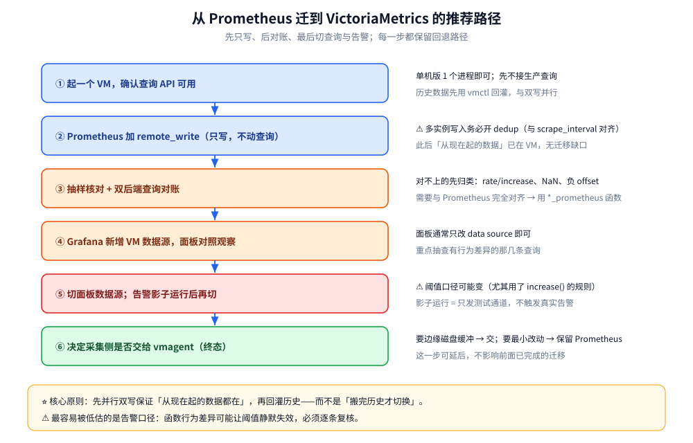

# 选型与落地案例

> 时序后端到底选谁：把 VictoriaMetrics 和 Prometheus 本体、Prometheus 长期存储的另外两条路线
> （Thanos / Mimir）、以及 InfluxDB / TimescaleDB 放在同一组维度上对照（写入模型、查询语言、
> 水平扩展、高基数表现、运维复杂度、许可与成本），给出**决策判据**与**从 Prometheus 迁到 VM 的路径**，
> 最后落到三类典型落地场景的取舍。
>
> 内容整理自个人学习笔记，并参考官方文档与 Release Notes；素材见 [素材清单](../../../../素材清单.md)。
>
> ⭐ 边界先说清：**栈层面三方选型**（Prometheus / VM / InfluxDB）的三行结论见
> [可观测性选型.md](../../../../06-工程实践/可观测性/可观测性选型.md)，
> **七类存储的横向定位**见 [存储选型.md](../../存储选型.md)，本篇不复制它们的表。
> ⚠️ 本篇的落地场景是**按类型抽象**的，不涉及任何具体客户名称或业务数字。

---

## 一、先回答哪几个问题再选后端？

**本节要点**：时序后端的选型不是「功能表打分」，而是**先算清四个量**：
活跃序列数、保留期、集群/租户数、团队能养多少组件。这四个量一定，候选集基本就收敛了。

### 1.1 活跃序列数（第一位）

**活跃序列数**（active series）几乎是所有成本的分母：它同时决定内存占用、索引规模、查询代价。

| 量级 | 谁来扛 |
| --- | --- |
| 十万级 | 单实例 Prometheus 绰绰有余 |
| 百万级 | 单实例 Prometheus 开始吃紧（内存与查询延迟） |
| 千万级以上 | ⭐ 需要专为高基数设计的后端（VM / Mimir 路线） |

⚠️ 判断「有没有高基数问题」的方法不是看总量，而是看**增长斜率**：
是稳定缓增，还是每上一次新业务就跳一个台阶？后者说明 label 设计在制造基数。

### 1.2 保留期与是否多集群

| 需求 | 影响 |
| --- | --- |
| 保留期 ≤ 15 天 | 单实例 Prometheus 本地盘即可 |
| 保留期数月 ~ 数年 | ⭐ 需要长期存储方案（对象存储或高压缩本地盘） |
| 多集群 / 多环境汇聚 | ⭐ 需要**原生多租户**或聚合查询层 |
| 边缘/弱网采集 | ⭐ 采集侧要有**磁盘缓冲** |

⭐ 「多集群汇聚」是一条分水岭：它把问题从「单机存不下」升级成「**多源数据怎么统一查询与隔离**」，
Thanos 的 Query 层、Mimir 的多租户、VM 的集群版各有一套答案。

### 1.3 团队规模与运维能力

| 团队 | 倾向 |
| --- | --- |
| 小团队 / 无专职 SRE | ⭐ **组件越少越好**（单二进制形态） |
| 有平台团队 | 可以吃下组件较多、能力更强的方案 |
| 有严格开源合规要求 | ⚠️ 先看**许可**（copyleft 需评估） |

⚠️ 这是最容易被低估的一项：**运维复杂度会随时间持续收利息**。
多组件方案的初始搭建成本只是入场券，长期成本在**升级、故障排查、容量规划**上。

---

## 二、VictoriaMetrics 与 Prometheus 本体怎么比？

**本节要点**：两者不是「新与旧」，而是**同一协议下的两种存储引擎取舍**：
Prometheus 为「单机实时抓取 + 告警」优化，VM 为「高基数 + 长保留 + 低资源」优化。

### 2.1 写入与存储模型

| 维度 | Prometheus | VictoriaMetrics |
| --- | --- | --- |
| 存储组织 | 2h block，块内 row-group chunks | **按月分区 + 按 TSID 排序的 part（LSM 风格）** |
| 索引 | **每块重复一份**倒排索引 | **全局 + 每日两套倒排索引**，跨块复用 |
| 样本压缩 | 约 1.5 字节/样本（Gorilla 类） | 官方称更省（VM 用额外编码 + 通用压缩） |
| 高 churn 影响 | 本地块膨胀 → 内存与合并压力 | churn 影响主要落在 per-day 索引 |

⭐ 索引是否「跨块复用」是两者的结构分水岭，也解释了为什么 VM 在高基数下更稳——
细节见 [索引设计与查询优化.md](索引设计与查询优化.md) 与 [架构与存储引擎.md](架构与存储引擎.md)。

### 2.2 查询语言与扩展

| 维度 | Prometheus | VictoriaMetrics |
| --- | --- | --- |
| 语言 | **PromQL** | **MetricsQL**（PromQL 向后兼容 + 增强） |
| 与 Grafana | 原生数据源 | Prometheus 兼容数据源，面板通常直接复用 |
| 行为差异 | — | ⚠️ `rate` 系、NaN、负 offset、metric name 保留等有差异 |

⭐ 官方兼容性对照（**VM v1.67.0 vs Prometheus v2.30.0**）为 **385 / 529（约 72.78%）通过**，
失败项多为「VM 有意做得更好」的那些；逐条见 [MetricsQL查询.md](MetricsQL查询.md)。

### 2.3 高基数表现

- **Prometheus**：序列数直接推高内存（每序列都要维护元信息），**高基数是最常见的 OOM 诱因**；
- **VictoriaMetrics**：官方容量规划文档给出的量级是**百万级 samples/s 写入、千万级活跃序列**（以官方容量规划页为准）。

⚠️ 但这不是「VM 不怕高基数」的理由：**基数爆炸在 VM 上同样会拉爆内存与索引**
（见 [索引设计与查询优化.md](索引设计与查询优化.md) 第四节），只是崩溃点更靠后。

### 2.4 水平扩展与运维复杂度

| 维度 | Prometheus | VictoriaMetrics |
| --- | --- | --- |
| 水平扩展 | 本身不做，靠外挂方案 | **单机版直接扛；集群版三组件（vminsert / vmstorage / vmselect）** |
| 组件数 | 少（单进程） | 单机版 1 个；集群版 3 类 |
| 多租户 | 无 | 集群版按 URL 路径分租户，配 `vmauth` |
| 备份 | 快照 | 快照 / `vmbackup` 到对象存储 |

### 2.5 许可与成本

| 维度 | Prometheus | VictoriaMetrics |
| --- | --- | --- |
| 许可 | **Apache 2.0** | **Apache 2.0**（企业版另售） |
| 企业能力 | — | 降采样、按序列的保留策略（retention filters）、多租户管控等在企业版 |
| 成本重心 | 内存 + 本地盘 | 更低的内存/磁盘占用，换更高的数据密度 |

---

## 三、Prometheus 长期存储的三条路线怎么选？

**本节要点**：三条路线的分水岭是**「要不要保留 Prometheus 本体」**，
以及**持久层放对象存储还是本地磁盘**。

### 3.1 Prometheus + Thanos

- **做法**：sidecar 把 Prometheus 压缩后的块上传到**对象存储**，Query 层合并实时与历史数据；
- **优点**：**沿用现有 Prometheus**（配置、告警不动），全局查询与长保留是加出来的；
- **代价**：⚠️ 组件较多（Sidecar / Store Gateway / Query / Compactor），各有失败模式与凭据管理。

### 3.2 Prometheus + Mimir

- **做法**：把 `remote_write` 指向 Mimir，它就成为长期存储与查询后端；
- **优点**：⭐ **多租户是一等公民**（`X-Scope-OrgID`），与 Grafana 生态对齐；
- **代价**：⚠️ 微服务组件最多，运维复杂度高；⚠️ **AGPLv3**，copyleft，需合规评估。

### 3.3 VictoriaMetrics

- **做法**：一个二进制吃 remote write、提供 PromQL 兼容查询；要扩展就切集群版；
- **优点**：⭐ 组件最少、单机容量大，适合「用最少运维换最大数据量」；
- **代价**：⚠️ 单机版无开箱多租户；生态工具链比 Prometheus 原生圈小；
  与 PromQL 存在少数行为差异（见第二节 2.2）。

### 3.4 判据

```text
① 不想动现有 Prometheus，只要长保留 + 全局查询   → Prometheus + Thanos
② 要强多租户隔离，且已押注 Grafana 生态           → Prometheus + Mimir（评估 AGPLv3）
③ 想要最少组件、最低运维面跑高基数/长保留         → VictoriaMetrics
④ 既要保留 Prometheus 采集、又要低运维后端        → Prometheus remote_write → VM（过渡态）
```

⭐ 三条路线与 Prometheus 本体的详细差异表见 [与Prometheus生态的关系.md](与Prometheus生态的关系.md) 第五节。

---

## 四、InfluxDB 和 TimescaleDB 什么时候更合适？

**本节要点**：这两个不是「Prometheus 的替代品」那么简单——它们的**数据模型与查询语言不同**，
更适合「自研采集链路 / 非 K8s 场景 / 要和业务数据 JOIN」的场合。

### 4.1 InfluxDB

| 维度 | 说明 |
| --- | --- |
| 数据模型 | measurement + tag/field，与 Prometheus 的 metric/label 相近但不完全对应 |
| 查询语言 | v3 起 **SQL + InfluxQL**；早期版本的 Flux 被边缘化 |
| 架构 | v3 基于 **FDAP 栈**（Flight / DataFusion / Arrow / Parquet），支持对象存储与「无限基数」 |
| 许可 | **v3 Core：MIT/Apache 2**；**v3 Enterprise：商业许可**；v1/v2 为 MIT |
| 适合 | IoT、自研采集链路、非 K8s 场景、需要 SQL 分析 |

⚠️ **版本分裂是最大的历史包袱**：1.x / 2.x / 3.x 之间**协议与授权策略变动很大**，
选型时必须先钉死具体大版本，再谈能力。

### 4.2 TimescaleDB

| 维度 | 说明 |
| --- | --- |
| 数据模型 | **就是 PostgreSQL**：超表（hypertable）+ 原生 SQL |
| 查询语言 | **完整 SQL**，能和业务表直接 JOIN |
| 压缩 | 列式压缩（官方称可达 90%+ 压缩率） |
| 许可 | **Apache 2.0（PG 核心）/ Timescale License（社区版）** |
| 适合 | 已在用 PG、指标要和业务数据一起分析、团队不想学新查询语言 |

⭐ 它的独特价值是**「时序 + 关系」在同一库里**——这是 Prometheus 系后端做不到的。

### 4.3 决策线

| 你的主诉求 | 选它 |
| --- | --- |
| 云原生监控、PromQL 生态、remote write | ⭐ **VM / Prometheus 系** |
| 自研采集、IoT、需要 SQL 分析 | **InfluxDB** |
| 指标要和业务数据 JOIN、团队是 PG 栈 | **TimescaleDB** |

---

## 五、迁移路径：从 Prometheus 到 VM 怎么做？

**本节要点**：分两件事——**已有历史数据怎么搬**，以及**查询/告警的行为差异怎么兜**。



### 5.1 数据迁移

| 手段 | 说明 |
| --- | --- |
| `vmctl` | VM 官方迁移工具，支持从 Prometheus 等来源导入历史数据 |
| remote read / 导出接口 | 按时间范围把原始样本导出后再导入（数据量大时注意分片与限速） |
| 并行双写过渡 | ⭐ **Prometheus 先 remote_write 到 VM**，历史数据慢慢回灌，最稳妥 |

⭐ 推荐顺序：**先并行双写保证「从现在起的数据都在」，再回灌历史**，
而不是「搬完历史才切换」——后者会让迁移窗口里的数据出现缺口。

### 5.2 注意点

```text
① 行为差异：rate/increase/NaN 等与 Prometheus 不同
   → 迁移期用 *_prometheus 函数对账；确认后再决定是否保留
② 去重：多实例写入时设 -dedup.minScrapeInterval（与 scrape_interval 对齐）
③ 查询缓存：回灌历史数据后，缓存可能返回旧结果
   → 用 -search.disableCache 或 nocache=1 先排除（见索引篇第六节）
④ 告警规则：先影子运行（只发测试通道），确认阈值口径没变再切
⑤ 面板：Grafana 换数据源即可，但要抽查那几类有行为差异的查询
⑥ 采集侧：决定是否把抓取交给 vmagent（要磁盘缓冲就交）
```

⚠️ 最容易被低估的还是**告警口径**：一条从 `increase()` 出来的曲线，
换了后端之后数值可能不再一样，阈值如果不复核，可能「静默失效」很久才被发现。

---

## 六、决策判据速查

**本节要点**：把前面的维度压缩成一张「按情况查」的速查表，先看自己落在哪一行，再看细节章节。

按顺序问，第一个「是」就是方向：

| 你的情况 | 倾向 |
| --- | --- |
| 活跃序列 ≤ 百万、保留 ≤ 15 天、单集群 | **单实例 Prometheus** |
| 只想给现有 Prometheus 加长保留 + 全局查询，不想改后端 | **Prometheus + Thanos** |
| 要强多租户隔离、押注 Grafana 生态 | **Prometheus + Mimir**（合规评估 AGPLv3） |
| 高基数 / 长保留 / 要最少组件与运维面 | ⭐ **VictoriaMetrics** |
| 自研采集、IoT、要 SQL 分析 | **InfluxDB**（先钉版本） |
| 指标要和业务数据 JOIN、团队是 PG 栈 | **TimescaleDB** |
| 拿不准 | ⭐ **先 remote_write 到 VM 当后端**，用真实负载验证后再定终态 |

---

## 使用：三类落地场景的取舍

### 场景 A：自建 K8s 监控（单/多集群，规模中等）

- **特征**：K8s 本身带来高 churn（Pod 滚动、短命序列），但保留期通常不长；
- **取舍**：⭐ churn 高 → **保持 per-day 索引默认（不关）**；
  组件越少越好 → 单机版 VM 或单实例 Prometheus + remote_write 过渡；
- **要点**：k8s SD 的目标数与序列增速要先摸清，别等实例 OOM 才发现基数在涨。

### 场景 B：多集群 / 多环境汇聚（要求统一查询与隔离）

- **特征**：多个集群的数据要在一处统一查询，且不同团队/环境需要隔离；
- **取舍**：⭐ 需要**多租户或聚合查询层** → VM 集群版（按 URL 路径租户 + `vmauth`）
  或 Mimir（`X-Scope-OrgID`）；
- **要点**：汇聚前先定**租户模型**（按环境？按团队？）与**保留策略是否分租户**，
  这两条决定了后面能不能少改一次架构。

### 场景 C：高基数业务指标（每业务上线就跳一个台阶）

- **特征**：业务指标 label 维度多、增速快，Prometheus 内存反复告警；
- **取舍**：⭐ 先做**降基数**（去掉高基数 label），再谈换后端——
  否则只是把 OOM 从一个组件搬到另一个组件；
- **要点**：换后端前先量化「去掉高基数 label 后能降到多少」，
  用它来判断到底是「后端不够强」还是「label 设计有问题」。

⭐ 三个场景的共性：**先诊断基数，再选后端**。
没有这一步，任何后端选型都是在赌。

---

## 延伸追问

- **VM 能不能完全替代 Prometheus？** → 技术可以（vmagent 抓取 + VM 存储查询 + vmalert 告警），
  但建议按「后端 → 查询 → 采集 → 告警」分步切，每步留回退路径。
- **高基数到底该怎么解？** → 优先**降基数**（label 只留低基数维度：服务名、路由模板、状态码），
  把高基数维度（user_id / request_id / 完整 URL）放进日志或链路。
  换后端只是把 OOM 推后，不是消除。
- **长保留一定要对象存储吗？** → 不一定。Thanos / Mimir 走对象存储；
  **VM 用高压缩的本地盘**也能扛长保留（另配 `vmbackup` 做备份）。
  判据是「团队愿意维护哪种持久层」。
- **AGPLv3 到底要不要紧？** → 取决于你是否**修改并对外提供**该软件。
  多数自用部署不触发，但有严格开源合规流程的团队应提前走一遍法务评估。
- **InfluxDB 3 和 1.x/2.x 能平滑迁移吗？** → ⚠️ 不能假定平滑。v3 换了存储引擎与查询引擎
  （FDAP + SQL/InfluxQL），官方也提供迁移工具与「先镜像写入、再切换」的建议，
  落地前务必按具体版本核官方迁移文档。
- **选型时最该先做的一件事是什么？** → ⭐ **拿真实负载（不是压测脚本）跑一遍候选后端**，
  观察基数增长下的内存曲线与查询 P99——这比任何功能表都更能定案。

---

## 关联

- [与Prometheus生态的关系.md](与Prometheus生态的关系.md) — 三条路线与 Prometheus 协议层的关系，含接入拓扑
- [MetricsQL查询.md](MetricsQL查询.md) — 迁移时必须对账的那些行为差异
- [索引设计与查询优化.md](索引设计与查询优化.md) — 高基数为什么在 VM 上同样会撞墙
- [性能调优与基准测试.md](性能调优与基准测试.md) — 选型之后的容量与调优动作
- [定位与适用场景.md](定位与适用场景.md) — VM 的能力边界与不该用的场景
- [存储选型.md](../../存储选型.md) — 时序库在七类存储中的横向定位
- [可观测性选型.md](../../../../06-工程实践/可观测性/可观测性选型.md) — 可观测性栈层面的三方对比（Prometheus / VM / InfluxDB）
> 反向引用（本篇被下列文档引到）：[选型对比与落地案例.md](../GreptimeDB/选型对比与落地案例.md)、[运维与监控.md](运维与监控.md)、[高可用与集群部署.md](高可用与集群部署.md)
