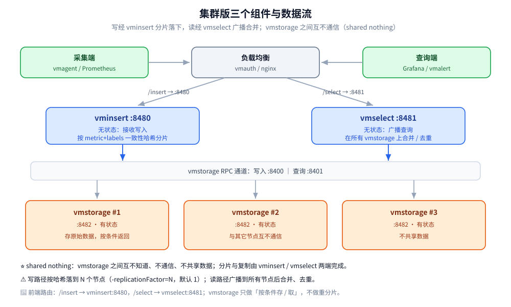
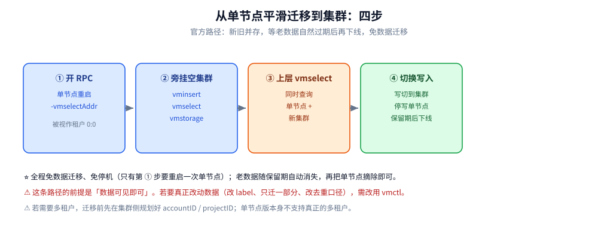

# 高可用与集群部署

> 单节点版与集群版怎么选、集群的 `vminsert` / `vmselect` / `vmstorage` 三个组件怎么串起来、
> 复制因子与一致性怎么取舍、多租户怎么落地、保留期与磁盘怎么规划、备份恢复与扩缩容要注意什么
> —— 回答「**从单机到集群，这条路上每个决定怎么拍**」。
>
> 内容整理自个人学习笔记，并参考 VictoriaMetrics 官方文档与 Release Notes；素材见 [素材清单](../../../../素材清单.md)。
>
> ⭐ 参数默认值以 **VictoriaMetrics v1.153.0（2026-09-28 发布）** 与 **LTS 线 v1.148.x** 的官方文档为准，
> 各条均给出处；本篇**不含任何本机实测**，凡引用官方博客/基准的结论都写明「官方口径」。
>
> ⭐ 边界先说清：本篇只讲**部署形态、HA 与运维动作**，不重复「可观测性栈层面怎么选」
> （见 [可观测性选型.md](../../../../06-工程实践/可观测性/可观测性选型.md)）与「时序库在七类存储里的横向定位」
> （见 [存储选型.md](../../存储选型.md)）。

---

## 一、单节点版和集群版，该按什么判据选？

**本节要点**：这是一道**先看规模、再看诉求**的题。VictoriaMetrics 官方态度很明确：
**摄取速率低于 100 万数据点/秒时优先用单节点版**，并且「选择集群版之前先三思」——
集群版换来水平扩展与多租户，代价是三个组件加一个负载均衡的运维复杂度。

官方文档原话（Cluster-VictoriaMetrics → Architecture overview）：

> It is recommended to use the single-node version for ingestion rates lower than a million data points per second.
> The single-node version scales perfectly with the number of CPU cores, RAM and available storage space and can be
> set up in High Availability mode ... The single-node version is easier to configure and operate compared to the
> cluster version, so think twice before choosing the cluster version.

三个「必须上集群」的触发条件：

1. **摄取速率**持续超过约 100 万数据点/秒（单机纵向扩展已经到顶）；
2. **需要多租户隔离**（`accountID` / `projectID`）—— 单节点版**不支持**真正的多租户（见第四节）；
3. **读写需要分别独立横向扩展**：写多扩 `vminsert`、查多扩 `vmselect`、容量不够扩 `vmstorage`。

官方给出的单节点版生产规模参考（Capacity planning，来源为官方 case studies）：

| 维度 | 官方文档给出的单节点参考值 |
|---|---|
| 摄取速率 | 150 万+ samples/秒 |
| 活跃时间序列 | 5000 万+ |
| 时间序列总量 | 50 亿+ |
| 序列 churn rate（每天新建） | 1.5 亿+ |
| 样本总量 | 10 万亿+ |
| 查询 | 200+ qps，p99 延迟 1 秒 |

⚠️ 这组数是**官方文档引用的 case studies 口径，不是本机实测**，只能用来判断量级，不能当 SLA 承诺。

⭐ 一条实践判据：**先跑单节点**，把 CPU/RAM/磁盘加到纵向扩展不再划算、或业务真的需要租户隔离时，再上集群；第 7 节与「使用」一节给出的正是这条切换路径——官方设计得可以**免数据迁移**完成。

---

## 二、集群三个组件各自负责什么、数据怎么流？

**本节要点**：集群是**共享无（shared nothing）**架构：`vmstorage` 之间互不知道、不通信、不共享数据，
分片和复制全靠 `vminsert` 与 `vmselect` 在两端完成。理解这三个组件的职责边界，后面所有取舍才有落点。

官方定义的三个组件（Cluster-VictoriaMetrics → Architecture overview）：

| 组件 | 默认 HTTP 端口 | 职责 |
|---|---|---|
| `vmstorage` | `8482` | 存储原始数据；按给定时间范围与 label 过滤器返回查询结果。**有状态** |
| `vminsert` | `8480` | 接收写入；按 **metric name + 全部 label 的一致性哈希**把样本铺到各 `vmstorage`。**无状态** |
| `vmselect` | `8481` | 从**所有**配置的 `vmstorage` 拉取所需数据，合并后返回。**无状态** |

补充两个内部端口（vmstorage 的 flag 默认值）：`vmstorage` 用 `-vminsertAddr`（默认 `:8400`）接 `vminsert` 的数据，用 `-vmselectAddr`（默认 `:8401`）接 `vmselect` 的查询。
⚠️ **别把这两个端口弄混**：`vminsert -storageNode` 填的是 `8400`，`vmselect -storageNode` 填的是 `8401`。

官方给出的 URL 路由约定（同一节）：前端负载均衡（`vmauth` / `nginx`）上，
`/insert` 开头路由到 `vminsert:8480`，`/select` 开头路由到 `vmselect:8481`。

| 方向 | URL 形态 |
|---|---|
| 写入 | `http://<vminsert>:8480/insert/<accountID>/<suffix>` |
| 查询 | `http://<vmselect>:8481/select/<accountID>/prometheus/<suffix>` |



⭐ 一句话记忆：**写经 `vminsert` 按哈希分片落下，读经 `vmselect` 广播到所有 `vmstorage` 再合并**；
`vmstorage` 只做「存」和「按条件取」，不做重分片、不互相搬迁数据——这也解释了第 7 节为什么加节点不会自动重平衡。

---

## 三、复制因子与一致性，怎么取舍？

**本节要点**：复制是**应用层**的能力，由两个同名但不同侧的 `-replicationFactor` 控制；
默认**可用性优先**，代价是可能拿到 `isPartial` 的响应。官方反复强调：**能用底层持久盘复制，就别用应用层复制**。

### 3.1 两侧的 `-replicationFactor`

| 组件 | 参数（默认值） | 语义 |
|---|---|---|
| `vminsert` | `-replicationFactor=N`（默认 `1`） | 每个样本存 **N 份**到 N 个**不同** `vmstorage`；最多 N-1 个 `vmstorage` 挂掉，已存数据仍可查 |
| `vmselect` | `-replicationFactor=N`（默认 `1`） | 不可用的 `vmstorage` **少于 N 个**时，不把响应标记为 partial |

两条硬规则（Cluster-VictoriaMetrics → Replication and data safety）：

1. **2N-1 规则**：集群至少要有 `2*N-1` 个 `vmstorage`，才能在挂掉 N-1 个时，**新写入的数据仍有 N 个副本**。
   例如 `-replicationFactor=3` → 至少 `2*3-1 = 5` 个 `vmstorage`。
2. **开了复制必须去重**：VictoriaMetrics 时间戳是**毫秒精度**，复制时 `vmselect` 必须传
   `-dedup.minScrapeInterval=1ms`，才能在查询时把来自不同 `vmstorage` 的重复样本去掉。
   集群版的去重还要求**同一个 `-dedup.minScrapeInterval` 值同时传给 `vmselect` 和 `vmstorage`**
   （因为新增/移除节点或节点临时不可用时，同一条时间序列的样本会散落到多个 `vmstorage`）。

### 3.2 复制的代价与「更划算的替代」

⚠️ 官方明确指出：复制会让 **CPU / RAM / 磁盘 / 网络带宽**最多增长 **N 倍**，
因为 `vminsert` 要写 N 份、`vmselect` 查询时还要去重。
所以官方建议：**优先把复制下移到 `-storageDataPath` 指向的底层持久化复制盘**
（如云厂商的持久磁盘），它天然防数据丢失与损坏、可在线扩容，且不消耗 VictoriaMetrics 自身的资源。

> 另一条常被忽略的账：**复制不等于备份**。官方原话是 replication doesn't save from disaster，
> 仍必须做定期备份（见第六节）。

### 3.3 一致性还是可用性：`isPartial`

| 选择 | 做法 | 效果 |
|---|---|---|
| **可用性优先**（默认） | 保持默认 | 只要有 1 个 `vmstorage` 可用就返回；缺失历史数据的响应带 `"isPartial": true` |
| **一致性优先** | `vmselect` 加 `-search.denyPartialResponse`，或请求带 `deny_partial_response=1` | 只要有 1 个 `vmstorage` 不可用就直接报错 |

⚠️ 一个例外：**返回原始样本（raw samples）的接口从不给 partial 响应**，
因为用户默认期望这部分数据完整。官方点名的接口是 `/api/v1/export*`
与「query 里带方括号时长（series selector）」的 `/api/v1/query`（Cluster-VictoriaMetrics → Cluster availability）。

---

## 四、多租户是怎么实现的？

**本节要点**：多租户是**集群版独有**的能力，靠 URL 里的 `accountID` / `accountID:projectID` 或 HTTP 头区分；
单节点版**没有**多租户，只能用 label 模拟，或在被 `vmselect` 读取时假装自己是 `0:0` 租户。

### 4.1 集群版：租户标识与两类端点

租户要点（Cluster-VictoriaMetrics → Multitenancy）：

- 租户由 `accountID` 或 `accountID:projectID` 标识，取值是 **32 位整数 `[0 .. 2^32)`**；
- `projectID` 缺省时自动补 `0`；**默认租户是 `0:0`**；
- 租户在**第一条数据写入时自动创建**；所有租户的数据均匀铺在各 `vmstorage` 上；
- 注册的租户列表：`http://<vmselect>:8481/admin/tenants`。

指定租户的两种方式：

| 方式 | 写法 | 版本坐标 |
|---|---|---|
| **URL 内嵌**（总是可用） | `/insert/<accountID>/…`、`/select/<accountID>/prometheus/…` | 一直可用 |
| **HTTP 头** | `AccountID: 2` + `ProjectID: 3` | `--enableMultitenancyViaHeaders` 自 **v1.143.0** 引入；自 **v1.150.0** 起**默认开启** |

⚠️ URL 里给了租户 ID 时，**HTTP 头会被忽略**；简化路径下若头缺失，则按 `0:0` 处理。

跨租户读写在专门的 `multitenant` 端点上完成：

| 方向 | 端点 | 租户来源 |
|---|---|---|
| 写（混租户） | `/insert/multitenant/<suffix>` | 样本的 `vm_account_id` / `vm_project_id` label（缺失或非法则记 `0`） |
| 读（跨租户） | `/select/multitenant/<suffix>`（**v1.104.0** 起） | 上述两个 label，可用选择器过滤 |

⚠️ 混租户写入时，`vm_account_id` / `vm_project_id` 会在转发给 `vmstorage` 前被**自动移除**。

### 4.2 单节点版：没有多租户，只有两种替代

⚠️ 需要更正一个常见误解：**当前单节点版没有 `-multitenant` 启动参数**。官方给的是两条路：

1. **用 label 模拟**：给所有数据加一个能唯一标识租户的 label（如 `team`），
   查询时用 `extra_label=team=developers` 强制过滤（可由 `vmauth` 按用户凭据注入）。
2. **交给集群的 `vmselect` 读**：单节点加 `-vmselectAddr=:8401` 启动 vmselect RPC 服务后，
   会被视为租户 `"0:0"`；可用 `-accountID` / `-projectID` 改这个默认租户标识。
   ⚠️ 官方说明该租户配置**不持久化、只在运行时生效**，所以可随时改。

---

## 五、保留期与磁盘怎么规划？

**本节要点**：保留期决定磁盘上限，而且删除是**按自然月分区**发生的——这直接影响「留多少空闲磁盘」的估算。

`-retentionPeriod`（单节点与 `vmstorage` 上默认 `1M`，即 31 天）：

- **最小保留期是 24h 或 1d**；
- 支持后缀 `s / h / d / w / M / y`；**不带后缀按「月」算**，例如 `-retentionPeriod=3` 即 3 个月（93 天）；
- 数据按**自然月分区**存放在 `<-storageDataPath>/data/{small,big}`；
  **超出保留期的分区在新月第一天被删**，而 partition 内的 part 则在后台合并中**逐步删除**——
  一个 part 只有在**整体落在保留期之外**时才可删；
- **磁盘占用上限约为 `保留期 + 1 个月`**。官方例子：`-retentionPeriod=1`（1 月）时，1 月的数据在 3 月 1 日才删；
- 不支持无限保留，但可给极大值（如 `100y`）；不接受负时间戳，也不接受 `1970-01-01` 及更早的样本。

磁盘与空间保护：

| 关注点 | 官方口径 |
|---|---|
| 空闲磁盘 | 至少留 **20%**；低于此值后台合并会变差，进而拖慢写入与查询 |
| 只读保护 | `-storage.minFreeDiskSpaceBytes`（默认 `100000000` 字节）：低于该值 `vmstorage` 进入**只读模式** |
| 只读的可观测 | `vmstorage` 在 `http://vmstorage:8482/metrics` 上把 `vm_storage_is_read_only` 置 `1`；此后 `vminsert` 停止向它写入并改道 |
| 容量外推 | 用测试跑一天的 `-storageDataPath` 增量外推：一天 10GB → 100 天约需 1TB |

⚠️ 集群容量规划的两个官方提醒：**优先「多个小 `vmstorage`」而不是「少数大 `vmstorage`」**（建议 10 个或更多）；
每个 `vmstorage` 的 `-storage.minFreeDiskSpaceBytes` 最好**匹配一个月摄入量**，
因为每月的最终去重会临时占用与上月数据等量的空间。

---

## 六、备份与恢复怎么做？

**本节要点**：备份建立在**即时快照（instant snapshot）**之上——快照几乎瞬时且初始不占空间；
集群版要**对每个 `vmstorage` 各备份一次**。恢复的前提是**先停进程**。

### 6.1 快照端点（单节点与 vmstorage 通用）

```bash
# 创建快照，返回 {"status":"ok","snapshot":"<name>"}
curl http://<vm-addr>:8428/snapshot/create
# 列出 / 删除 / 全部删除
curl http://<vm-addr>:8428/snapshot/list
curl http://<vm-addr>:8428/snapshot/delete?snapshot=<name>
curl http://<vm-addr>:8428/snapshot/delete_all
```

⚠️ 快照目录里混用了硬链接/软链接，**不要用 `rm` 删子目录、也不要用 `cp`/`rsync` 复制**，
否则会留下删不掉的数据或漏拷；清理请走 `/snapshot/delete` 接口。
当前快照数可由 `vm_snapshots` 指标观测，`-snapshotsMaxAge` 可让旧快照自动过期。

### 6.2 vmbackup：从快照做备份

`vmbackup` 的三件套参数是 `-storageDataPath` + `-snapshot.createURL` + `-dst`；
它**先建快照、再备份、最后自动删掉自己建的快照**，所以**备份时无需停服**。

`-dst` 支持的存储类型：`gs://`（GCS）、`s3://`（S3）、`azblob://`（Azure Blob）、
任意 S3 兼容（MinIO / Ceph）、本地 `fs://</abs/path>`。

| 备份类型 | 触发方式 | 特点 |
|---|---|---|
| 全量 | `-dst` 指向空目标 | 首次备份 |
| 增量 | `-dst` 指向**已有备份** | 只上传新增数据 |
| 智能（smart） | 每小时增量写 `latest` + 每天 server-side copy 到 `YYYYMMDD` | 官方推荐的默认策略 |
| server-side copy | 用 `-origin=<已有备份>` | 云端**服务端复制**，不走本地带宽 |

⚠️ **集群版必须对每个 `vmstorage` 分别执行**，且 `-dst` 要指向**不同目录**避免冲突；
K8s 下官方建议用 **sidecar 容器**与 `vmstorage` 同 Pod 运行。

### 6.3 vmrestore：恢复

恢复步骤（官方 single-node "How to restore from a snapshot"，集群同款）：

```text
1. kill -INT 停止 VictoriaMetrics（集群则停对应 vmstorage）
2. 用 vmrestore 把备份恢复到 -storageDataPath 指向的目录
3. 重新启动进程
```

⚠️ 三个坑：①恢复前**必须**停进程；②备份中断可随时重跑，`vmbackup` 会**从断点续传**；
③单节点与 `vmstorage` 的数据格式**不兼容**，不能互相拷贝。

---

## 七、集群扩缩容与重新分片要注意什么？

**本节要点**：VictoriaMetrics **不做自动重平衡**——加 `vmstorage` 后，**只有新写入的数据**会被铺到新节点，
历史数据留在原地。这不是缺陷，而是刻意的取舍（避免扩容时消耗资源、避免重平衡失败）。

### 7.1 加一个 `vmstorage`（三步）

```text
1. 用与现网相同的 -retentionPeriod 启动新 vmstorage
2. 逐个重启所有 vmselect，让 -storageNode 包含新地址
3. 逐个重启所有 vminsert，让 -storageNode 包含新地址
```

⚠️ 顺序不能反：**`vmselect` 必须引用全部 `vmstorage`**（包括老的）才能查到历史数据，
而 `vminsert` 决定新数据往哪写。

历史数据的两条再平衡路线（Cluster-VictoriaMetrics → Rebalancing）：

| 路线 | 做法 | 代价 |
|---|---|---|
| 等自然过期 | 老节点按保留期自动删除历史数据 | 零操作，但老节点资源要一直占着 |
| 定向灌新数据 | `vminsert` 的 `-storageNode` **只填新节点**，`vmselect` 仍填全部 | 新数据只落新节点，等两边容量接近后把老节点加回 `vminsert` |

### 7.2 删一个 `vmstorage`（先停写、后摘读）

```text
1. 从所有 vminsert 的 -storageNode 移除该节点（先停止新数据写入它）
2. vmselect 保持不动（继续读它上面的历史数据）
3. 二选一：
   a. 等它的 -retentionPeriod 到期，再把它从 vmselect 摘掉并下线（无需迁移）
   b. 用 vmctl vm-native 把数据重灌到剩余节点，再摘掉并下线
```

### 7.3 两条容易踩的扩容红线

1. **纵向扩容必须重启**。官方明确：所有组件**只在启动时读一次**可用的 CPU 与内存上限，
   用它来决定 cache、buffer 与并发上限。不重启，加的资源**不会生效**，而内存上限被调小后还可能被 OOM 杀掉。
   官方因此**不建议**用 K8s VPA 的 InPlace 就地扩容模式；自监控指标 `vm_available_memory_bytes` /
   `vm_available_cpu_cores` 也会一直报启动时读到的值。
2. **节点要够多，滚动重启才稳**。滚动重启期间健康节点要扛下额外负载：
   `N=3` 时每节点负载增 `100/(N-1) ≈ 50%`，`N=11` 时只增 `10%`——
   所以官方建议 `vmstorage` **至少 8 个**（容量规划处则建议 10 个或更多）；
   开了复制时，节点数还要再乘 `-replicationFactor`。

---

## 使用：从单节点平滑迁移到集群的四步

**本节要点**：官方提供了一条**不用 vmctl、不用搬数据、几乎不停机**的迁移路径——
利用「单节点开 vmselect RPC 后可以被集群 `vmselect` 查询」这一点，让新旧两套并存，等老数据自然过期即可下线。

```text
1. 重启现有单节点，带上 -vmselectAddr 开启 vmselect RPC 服务
   （它会被视为租户 "0:0"，需要时用 -accountID / -projectID 改默认租户）

2. 在旁边部署一个全新的空集群（vminsert / vmselect / vmstorage）

3. 部署一层“上层 vmselect”，让它同时查询【现有单节点】和【新集群】
   —— 此时历史数据与新增数据都能被同一个查询入口看到

4. 把写入切到新集群 → 停写单节点
   等单节点的数据超出其保留期后，把它从上层 vmselect 摘除并下线
```



⚠️ 这条路径的适用前提是「**只要数据可见即可**」。如果你需要真正**改动数据**（改 label、只迁一部分、改去重口径），官方给的答案是走 `vmctl` 而不是上面这套并存方案。

---

## 延伸追问

- **单节点版到底能扛多少？** → 官方 case studies 口径：150 万+ samples/秒、5000 万+ 活跃序列、
  200+ qps、p99 1 秒。⚠️ 这是官方文档引用的生产案例，**不是本机实测**，只能作量级参考。
- **摄取速率多少才该上集群？** → 官方建议**低于 100 万数据点/秒优先单节点**，并「选集群前先三思」。
  比速率更硬的判据是「是否需要多租户」——单节点版不支持真正的多租户。
- **为什么 `vmstorage` 至少要 2N-1 个？** → 要在挂掉 N-1 个节点时，**新写入的数据仍有 N 个副本**。
  `N=3` → 至少 5 个 `vmstorage`。
- **开了复制为什么还要 `-dedup.minScrapeInterval=1ms`？** → 时间戳是毫秒精度，同一份数据存在 N 个
  `vmstorage`，`vmselect` 查询时必须去重才能得到正确结果；集群版还要求该值**同时**传给 `vmselect` 与 `vmstorage`。
- **应用层复制和底层盘复制选哪个？** → 官方建议优先**底层持久化复制盘**：不消耗自身 CPU/RAM/网络，
  且复制不是备份，两者解决的是不同问题。
- **`isPartial` 响应要不要接受？** → 默认接受（可用性优先）。
  要强一致就上 `-search.denyPartialResponse`；但返回**原始样本**的接口始终不给 partial。
- **单节点版怎么隔离租户？** → 不支持真正的多租户。**当前没有 `-multitenant` 参数**；
  做法是用租户 label（`team=…`）+ `extra_label` 强制过滤，或开 `-vmselectAddr` 让集群 `vmselect` 按 `0:0` 读它。
- **为什么加了 `vmstorage` 磁盘却不见均衡？** → VictoriaMetrics **不做自动重平衡**：
  只有新写入的数据会被分到新节点，历史数据留在老节点，靠保留期自然过期或人工定向灌新数据来均衡。
- **扩了 CPU/内存为什么没效果？** → 组件**只在启动时读一次**资源上限，**必须重启**才生效；
  官方因此不建议 K8s VPA 的就地扩容。
- **`vmstorage` 什么时候会拒写？** → 空闲空间低于 `-storage.minFreeDiskSpaceBytes`（默认 1 亿字节）时进入只读模式，
  `vm_storage_is_read_only` 置 `1`，`vminsert` 会改道到其他节点。

## 关联

- [架构与存储引擎.md](架构与存储引擎.md) — 存储引擎内部：分区、part、后台合并与索引结构（本篇讲的是组件级拓扑）
- [定位与适用场景.md](定位与适用场景.md) — 什么时候该用 VictoriaMetrics、什么时候不该用
- [数据模型与写入路径.md](数据模型与写入路径.md) — 写入协议与样本落盘路径（`vminsert` 的分片依据在此前后对照）
- [运维与监控.md](运维与监控.md) — 部署拓扑、自监控指标与故障处置（本篇的「上线后怎么盯」）
- [性能调优与基准测试.md](性能调优与基准测试.md) — 内存/查询护栏/去重参数与压测口径
- [与Prometheus生态的关系.md](与Prometheus生态的关系.md) — remote write、vmagent 与 HA 采集对（复制的一半在这里）
- [选型与落地案例.md](选型与落地案例.md) — 与 GreptimeDB 等同类产品的对比与落地判断
- [../../GreptimeDB/部署与集群运维.md](../GreptimeDB/部署与集群运维.md) — 同构主题的另一个实现（对照「无状态计算 + 有状态存储」的拆分方式）
- [存储选型.md](../../存储选型.md) — 时序库在七类存储里的横向定位
- [可观测性选型.md](../../../../06-工程实践/可观测性/可观测性选型.md) — 可观测性栈层面该选谁
