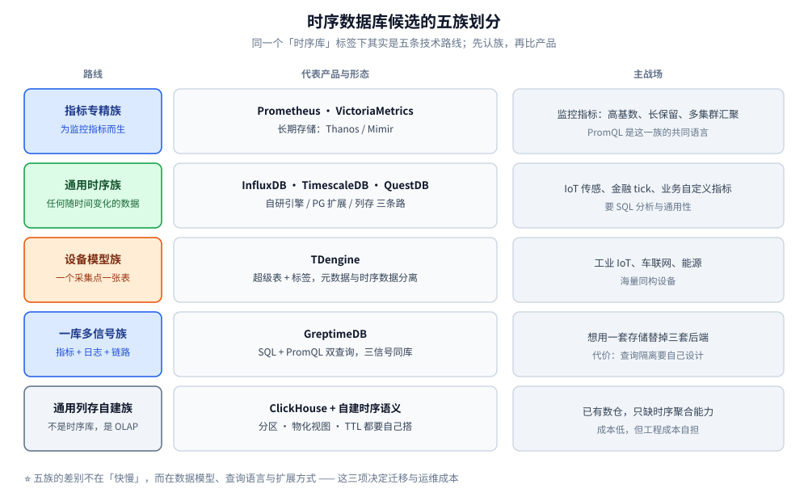
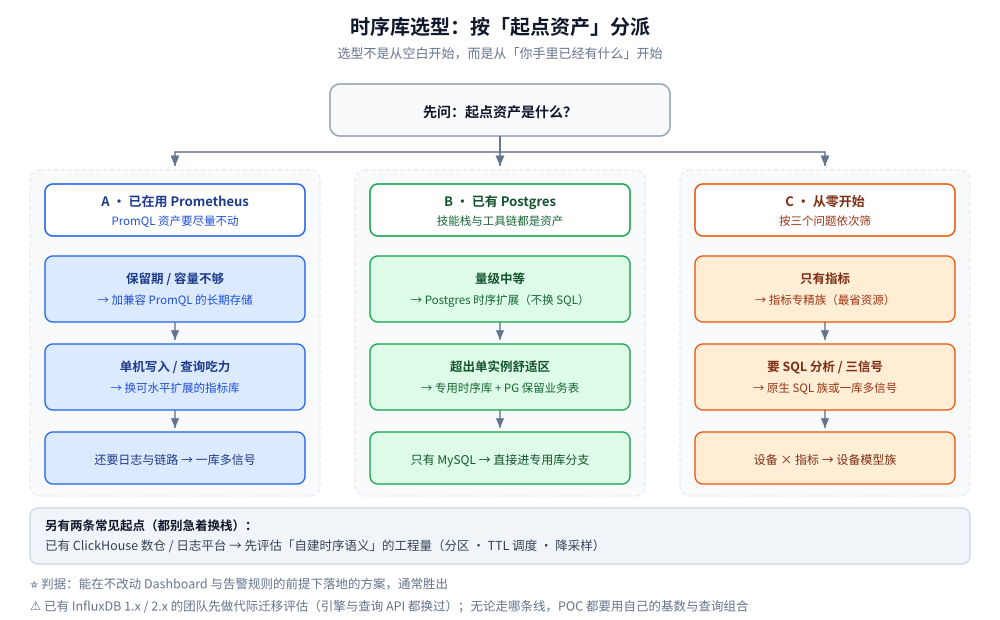

# 时序数据库选型对比

> 跨产品的横向选型：先把「时序数据」的四类特征与选型前**必须量化的五个数字**立住，
> 再把候选分成五族（指标专精 / 通用时序 / 设备模型 / 一库多信号 / 通用列存自建）逐维对照，
> 最后按**起点资产**给出三条决策线，以及一次可信 POC 的做法。
>
> ⭐ 边界先说清：本篇是**中立视角的跨产品选型**，不偏向任何一家。
> 单产品的深度取舍见 [VictoriaMetrics 的选型与落地案例](VictoriaMetrics/选型与落地案例.md) 与
> [GreptimeDB 的选型对比与落地案例](GreptimeDB/选型对比与落地案例.md)（那两篇都以**自身**为出发点）；
> 「时序库在七类存储里的位置」见 [存储选型.md](../存储选型.md)；
> 「可观测性栈整体怎么选」见 [可观测性选型.md](../../../06-工程实践/可观测性/可观测性选型.md)。
>
> 内容整理自个人学习笔记，并参考各项目官方文档与公开的架构资料；素材见 [素材清单.md](../../../素材清单.md)。
>
> ⚠️ 本篇**不含任何本机实测**。横评读数受硬件、版本、基数与查询组合影响极大，
> 所以这里只给**架构与模型的定性对照**与**判据** —— ⭐ **不引用任何第三方跑分充当结论**。

---

## 一、时序数据到底在哪些地方和普通表不一样？

**本节要点**：先确认「这是不是时序负载」。这四个特征决定了专用库存在的理由，也决定了选型时该看哪几个维度。

### 1.1 四个特征

| 特征 | 具体表现 | 对存储的要求 |
|---|---|---|
| **写多读少、几乎只追加** | 写入占绝对多数，且是 append-only；更新与删除极少（删除基本只发生在过期） | 顺序写优先于随机写；允许用「不可变文件 + 后台合并」换写入吞吐 |
| **每条记录都带时间戳** | 时间戳是天然的主维度，且通常近似单调递增（乱序是例外而非主流） | 按时间分区，过期直接丢整块，不必逐行删 |
| **查询是「范围 + 聚合」** | 绝大多数是「某时间窗 + 若干维度过滤 + 聚合 / 降采样」，很少查单条明细 | 区间裁剪能力（能跳过不相干的数据块）比单点索引更重要 |
| **维度组合会爆炸** | 标签（tag / label）取值的组合数就是序列数，加一个新维度可能翻好几倍 | 需要「低成本的标签索引 + 高压缩率」，否则内存先被打爆 |

### 1.2 由此推出的四种能力

| 能力 | 不做会怎样 |
|---|---|
| **高吞吐顺序写 + 批量化** | 采集团每秒几十万点直接压垮随机写路径 |
| **时间分区与区间裁剪** | 查「最近 1 小时」却要扫全部历史，延迟随保留期线性增长 |
| **保留策略 / 降采样 / 连续聚合** | 磁盘无限增长；长跨度看板每次都做全量重算 |
| **基数可控的索引与压缩** | 序列数一涨，索引内存先炸，写入反而成了次要问题 |

### 1.3 什么时候普通数据库就够了？

⭐ **不要为了「专业」引进第二个数据库** —— 多一个存储就多一套备份、监控、权限与故障面。以下情形先用已有库：

- **量小且缓变**：写入速率低、序列数少（例如几十个实例的业务指标），关系型 + 定期聚合表足够；
- **只要最新值**：业务只关心「当前在线数 / 当前库存」，那是缓存或 Redis 的活，不是时序库；
- **研究型分析**：数据要拿去做复杂的多表关联与特征工程，落在已有的数仓 / 列存里更省事，时序库并不擅长复杂 JOIN。

> 判据：**当「按时间窗聚合」变成高频且量大、或保留期与写入速率已经让关系型库出现明显的写入与存储压力时**，再引入专用时序库。

---

## 二、选型前必须先量化的五个数？

**本节要点**：五个数字先定下来，候选会自动从八家缩到两三家；比任何功能对照表都有效。

### 2.1 五个输入

| # | 量什么 | 怎么量 | 为什么它决定选型 |
|---|---|---|---|
| ① | **写入样本速率**（点 / 秒） | 序列数 × 单序列采集频率，再乘 1.5~2 倍余量 | 决定单机能不能扛、要不要集群、批大小怎么设 |
| ② | **活跃序列数（基数）** | 按「一条独立的时间线」数，**不是数设备数** | 基数是索引内存与压缩率的主要驱动，也是最常见的翻车点 |
| ③ | **保留期与存储量** | 保留天数 × 日增原始量，再按压缩比折算 | 决定要不要对象存储、要不要降采样 |
| ④ | **查询形态** | 实时看板 / 长跨度聚合 / 明细回查 / 跨信号关联，各占多少 | 决定查询语言（PromQL 还是 SQL）与是否要计算下推 |
| ⑤ | **可用性与隔离要求** | 单机可接受？要不要多集群汇聚、多租户隔离、跨地域 | 决定单机版够不够，直接排除一批「集群是商业版」的产品 |

### 2.2 每个数会砍掉哪些候选

| 条件 | 直接排除 | 保留 |
|---|---|---|
| 基数极高（活跃序列数远超单机内存舒适区） | 索引结构为「全内存倒排 + 单机」的方案 | 高基数优化过的指标库、或列存 + 对象存储路线 |
| 保留期长（年为单位）且成本敏感 | 只依赖本地盘的方案 | 支持对象存储作为落点的方案 |
| 必须用 SQL 做分析与跨信号关联 | 只提供自有查询语言的方案 | 原生 SQL / 兼容 SQL 的方案 |
| 已有成熟 PromQL 资产（大量 Dashboard 与告警规则） | 不兼容 PromQL 的方案 | 兼容 PromQL 的方案或「只换存储层」的路线 |
| 强多租户 / 多集群汇聚 | 单机形态为主、集群能力受限的方案 | 原生支持集群与租户隔离的方案 |

### 2.3 ⚠️ 基数是最容易被低估的那个

三个常见误判：

1. **把「设备数」当序列数**：一台设备上报 30 类指标 = 30 条时间线；若还带 `disk`、`interface`、`path` 这类维度，实际是设备数 × 维度组合数。
2. **只看当前基数**：上线一个新业务维度（比如多了一个 `tenant_id`）就可能整档翻倍，选型要按「一年后的基数」估。
3. **用低基数验证高基数结论**：在几千序列上跑得很好的方案，到几百万序列可能完全换一种表现。⭐ **POC 必须用你自己的基数**。

> 基数治理是跨厂商的共同话题：把无界取值（用户 ID、请求 ID、URL、异常信息）放进标签，任何时序库都会被拖垮。做法与调优动作见 [性能调优与基准测试.md](VictoriaMetrics/性能调优与基准测试.md)（VM 侧）与 [GreptimeDB 的性能调优与基准测试](GreptimeDB/性能调优与基准测试.md)。

---

## 三、候选可以分成哪几族？

**本节要点**：候选有八家，其实只有五条技术路线 —— 先分族，再把两家**需要单独细看**的产品（InfluxDB、ClickHouse）拎出来。

### 3.1 指标专精族：Prometheus / VictoriaMetrics

**一句话定位**：为「监控指标」而生 —— 数据模型只有「指标名 + 标签 + (时间戳, 值)」，查询语言是 PromQL 系。

| | 强在哪 | 弱在哪 |
|---|---|---|
| **Prometheus** | 生态事实标准：抓取、服务发现、告警规则、Grafana 支持一应俱全；单机部署极简 | 本地磁盘 + 单机，长期存储与水平扩展要靠外部组件 |
| **VictoriaMetrics** | 兼容 PromQL，另有 MetricsQL 增强；单机与集群两种形态，高基数与大流量下资源占用更友好 | 定位仍在指标域，不适合当通用 SQL 分析库 |

⭐ **什么团队会选**：已经在用 Prometheus、要解决「保留期不够 / 单机扛不住 / 多集群要汇聚」的团队。深入见 [VictoriaMetrics 目录导读](VictoriaMetrics/README.md) 与 [与 Prometheus 生态的关系](VictoriaMetrics/与Prometheus生态的关系.md)。

### 3.2 通用时序族：TimescaleDB / QuestDB

这一族走的是**通用时序**路线 —— 不止监控指标，任何「随时间变化的数据」都想装。（同族的 InfluxDB 因为**代际差异过大**，单独放到下一节细看。）

| 产品 | 模型与语言 | 定位与取舍 |
|---|---|---|
| **TimescaleDB** | **PostgreSQL 扩展**：普通表变成 hypertable，按时间自动分块，压缩与连续聚合以扩展能力叠加 | ⭐ 团队已有 Postgres 时学习成本最低，SQL / 驱动 / 备份工具全沿用；继承 Postgres 的扩展上限 |
| **QuestDB** | Java 列存，同时说 Postgres 线协议与 InfluxDB Line Protocol | 单机写入吞吐与「按时间取最近匹配行」（ASOF JOIN）见长，金融 tick 数据圈口碑好；生态较小 |

### 3.3 InfluxDB：生态最强，但代际迁移最痛

**一句话定位**：最早一批专用时序库之一，采集端生态（Telegraf 一类代理的插件覆盖面）最成熟，也是**换过两次引擎**的那一个。

| 代际 | 存储引擎 | 查询语言 | 说明 |
|---|---|---|---|
| 1.x | TSM（Time-Structured Merge tree） | InfluxQL | 配套 TICK 栈（采集代理 / 存储 / 可视化 / 告警），监控场景的经典组合 |
| 2.x | TSM + 键值索引 | **Flux**（函数式数据管道） | 引入 bucket / organization 模型与任务调度；Flux 学习曲线陡，是主要争议点 |
| 3.x | Rust 重写：**Arrow 内存格式 + DataFusion 查询引擎 + Parquet 落对象存储** | SQL + InfluxQL | 采集 / 存储 / 查询 / 压缩拆成独立组件；Flux 不再是主推 |

- **强在哪**：开箱体验好（写入协议、采集代理、自带 UI 一条龙）；3.x 把数据落到对象存储，**保留期不再受本地盘限制**；IoT / 传感器场景适配好。
- ⚠️ **坑在哪**：① **跨大版本迁移不轻松** —— 引擎与查询 API 都换过，升级前必须逐版本核官方迁移文档；② 开源版与商业版的**集群 / 高可用边界**要提前确认；③ 社区知识**按版本分裂**，搜到的答案可能是上一代的写法。
- ⭐ **什么团队会选**：已经在用 1.x / 2.x、且要往 3.x 走的团队；或「边缘采集 + 中心存储」、希望长期保留挂在对象存储上的团队。
- ⚠️ **别踩**：拿别人的跑分来比 —— 1.x / 2.x / 3.x 是**三个不同的引擎**，跨代际横向比数字没有意义。

> 上表只区分**代际架构**；具体小版本、许可与功能边界一律以官方文档与 Release Notes 为准。

### 3.4 设备模型族：TDengine

**一句话定位**：把「一个数据采集点一张表」当第一公民，用**超级表（STable）+ 标签**把海量设备聚合起来查询。

- 设计要点：**标签（元数据）与时序数据分开存** —— 标签走 B 树索引放在元数据存储，时序数据放另一个存储；聚合时先筛元数据拿到表的清单，再去取数据块。
- 分片：用一致性哈希把表分配到虚拟节点（vnode）；新一代把元数据从管理节点**下沉到 vnode**，避免「千万张表时元数据成瓶颈」。
- ⭐ **什么团队会选**：工业 IoT、车联网、能源这类「设备 / 采集点数量巨大、每台设备指标结构一致」的场景。反过来，如果你的数据不是「设备 × 指标」形态，它的模型优势就用不上。

### 3.5 一库多信号族：GreptimeDB

**一句话定位**：不只装指标，还把 **Metrics / Logs / Traces 三信号放进同一套表模型**，用 SQL + PromQL 双查询统一访问。

- 存储引擎（Mito）= LSM 树 + **Parquet 格式的 SST**，扫描走三级剪枝（时间范围 → row group 统计 → 索引），默认按时间窗口压缩（TWCS）。
- ⭐ **什么团队会选**：想用**一个库**替掉「Prometheus + Loki + Jaeger 三套存储」的团队；代价是查询隔离与爆炸半径要自己设计。深入见 [GreptimeDB 目录导读](GreptimeDB/README.md) 与 [可观测性集成方案](GreptimeDB/可观测性集成方案.md)。

### 3.6 ClickHouse：不是时序库，是「自己搭时序语义」的通用列存

**一句话定位**：它本身是**通用 OLAP 列存**；「时序」是你在它上面搭出来的一层 —— 按时间分区 + 物化视图做预聚合 + TTL 做过期 + 自己调度保留策略。

- **强在哪**：列存压缩率与聚合速度、生态与运维资料丰富、硬件成本可控；顺带还能承载日志与宽表分析。
- ⚠️ **弱在哪**：没有内建的时序语义 —— **降采样调度、保留策略、PromQL 兼容、时间线模型**都要自己实现；「一个设备一张表」这类海量小表也不适合它（表数量会顶到元数据压力）。
- ⭐ **什么团队会选**：已经有 ClickHouse 数仓 / 日志平台、只差时序聚合能力，**且有人愿意维护这层自研逻辑**的团队。
- **判据**：如果你**已经能自己写分区、TTL 与降采样调度**，它的性价比很高；如果「不想再为时序单独维护一套自研逻辑」，专用时序库更省事。

> 各族的**存储引擎细节**不在本篇展开：LSM 与 B+ 树的取舍见 [LSM树.md](../../../02-计算机基础/数据结构/树/LSM树.md)，倒排索引与向量化扫描见 [索引设计与查询优化.md](VictoriaMetrics/索引设计与查询优化.md) 与 [GreptimeDB 的索引设计与查询优化](GreptimeDB/索引设计与查询优化.md)。

---

## 四、同一组维度上怎么对照？

**本节要点**：六个维度拉平看，但⚠️ 有一列不能横向比。

### 4.1 六维对照表

| 产品 / 族 | 数据模型 | 查询语言 | 扩展与高可用 | 高基数应对 | 许可与成本 |
|---|---|---|---|---|---|
| Prometheus | 指标 + 标签 | PromQL | 单机；长期存储靠外部组件 | 一般（靠外部方案分担） | 开源，运维成本自担 |
| VictoriaMetrics | 指标 + 标签 | PromQL + MetricsQL | 单机 / 原生集群两种形态 | 好（自身存储优化） | 开源；集群能力在开源版可用（核官方许可说明） |
| InfluxDB | measurement + tag + field | SQL + InfluxQL（3.x 代际） | 单机开源；集群在商业版 | 中 | 开源单机 + 商业集群 / 云 |
| TimescaleDB | Postgres 表 + hypertable | **标准 SQL** | 依托 Postgres 复制 | 中（按维度分段压缩） | 社区版 + 商业版 / 云 |
| QuestDB | 时序表（SYMBOL 类型） | 接近标准 SQL + ILP 写入 | 单机开源；集群在商业版 | 中（字典编码） | 开源单机 + 商业集群 |
| TDengine | 采集点表 + 超级表 + 标签 | SQL（含时序扩展） | 集群（版本间功能边界需查官方对照表） | 好（标签与时序数据分离） | 开源 + 商业版 |
| GreptimeDB | 表模型（tag / time / field） | SQL + PromQL | 单机 / 计算存储分离集群 | 好（列存 + 剪枝） | 开源 + 商业版 |
| ClickHouse | 通用列存表 | SQL | 原生集群分片 | 取决于表设计 | 开源，成本低但工程成本自担 |

⚠️ **本表只作定性对照**，单元格里的措辞刻意不带数字与排名 —— 各家官方文档与许可条款会随版本调整，落地前**逐条核官方文档**。

### 4.2 怎么读这张表

1. **先看前两列（数据模型 + 查询语言）**：这一步决定团队要改多少代码、多少人的习惯要重学。⚠️ 「换个查询语言」的迁移成本往往被严重低估。
2. **再看扩展与高可用**：开源版够不够、集群要不要付费，是预算问题，最好在 POC 之前就明确。
3. **最后看成本**：⭐ 成本不是「软件许可」一项，而是 **许可 + 硬件 + 人力 + 迁移**四项之和。省下的许可费很可能被人力吃掉。

### 4.3 ⚠️ 这一列不能横向比：性能

- 各家公开的 benchmark 都有**明确的前置条件**（硬件、版本、基数、数据分布、查询组合）。⭐ **把它当「口径」读，不要当「结论」用**。
- 不同基数下的结论不可互换：低基数跑得快不代表高基数扛得住。
- ⭐ 还有两个**代际 / 实现陷阱**：**InfluxDB 的 1.x / 2.x / 3.x 是三个不同的引擎**（跨代际比数字没有意义）；**ClickHouse 的时序表现取决于你搭了多少**（同版本不同表设计与 TTL / 预聚合策略，结果可以差很远），不是「装上就有」。
- 正确做法只有一个：**用自己的数据和查询组合做 POC**（见本篇 `## 使用`）。

---

## 五、按「起点资产」该怎么决策？

**本节要点**：选型不是从空白开始，而是从「你手里已经有什么」开始。

### 5.1 决策线 A：已经在用 Prometheus

| 状况 | 首选动作 |
|---|---|
| 保留期不够、但量还不大 | 加一个兼容 PromQL 的长期存储后端（**只换存储层，Dashboard 与告警不动**） |
| 单机写入或查询开始吃力 | 换成能水平扩展的指标库，抓取端可保留 Prometheus 或改用 `vmagent` 这类代理 |
| 多集群 / 多环境要统一查询 | 上「集群 + 多租户」形态的指标库 |
| 指标之外还要日志与链路 | 考虑一库多信号路线，或「指标专用库 + 日志 / 链路各留其专精工具」 |

⭐ 关键判据：**改动面越小越好** —— PromQL 兼容意味着 Dashboard、告警规则、Grafana 数据源基本不动。细节见 [与 Prometheus 生态的关系](VictoriaMetrics/与Prometheus生态的关系.md) 与 [选型与落地案例](VictoriaMetrics/选型与落地案例.md)。

### 5.2 决策线 B：已经有 Postgres 或 MySQL

| 状况 | 首选动作 |
|---|---|
| 团队全是 Postgres 背景，数据量中等 | **TimescaleDB 优先** —— 不引入新数据库、不换 SQL、不换驱动 |
| 写入量已明显超出单实例 Postgres 的舒适区 | 引入专用时序库，Postgres 继续承担业务表，两边按「谁拥有数据」划界 |
| 只有 MySQL | ⭐ 谨慎：MySQL 没有等价的时序扩展，通常直接进入「引入专用时序库」分支 |

### 5.3 决策线 C：从零开始

按三个问题依次筛：

| # | 问题 | 回答指向 |
|---|---|---|
| ① | 要装的是**只有指标**，还是**三信号齐全**？ | 只有指标 → 指标专精族；三信号 → 一库多信号族，或分层组合 |
| ② | 要不要**用 SQL 做分析**（跨表 JOIN、复杂聚合、报表）？ | 要 → 原生 SQL 族（通用时序 / 一库多信号 / 列存）；不要 → 指标专精族更省资源 |
| ③ | 数据是不是**「设备 × 指标」**形态、设备数量巨大？ | 是 → 设备模型族；否 → 它的模型优势用不上 |

### 5.4 判据速查

| 场景 | 首选 | 备选 | 通常不该选 |
|---|---|---|---|
| 已上 Prometheus，要做长期存储 | 兼容 PromQL 的指标库 | 对象存储型长期存储组件 | 换一套不兼容 PromQL 的方案（迁移面太大） |
| 团队全是 Postgres 背景、量中等 | Postgres 时序扩展 | 专用时序库 + 保留 Postgres 做业务 | 语言差异大的方案 |
| 工业 IoT、海量同构设备 | 设备模型族 | 列存 + 自建时序语义 | 指标专精族（模型不匹配） |
| 想要一个库存下指标 / 日志 / 链路 | 一库多信号族 | 分信号各用专精工具 | 用指标库硬装日志 |
| 已有数据仓库，只差时序聚合 | 现有列存自建 | 独立时序库 | 为「专业」再引进第二个存储 |
| 已有 ClickHouse 数仓 / 日志平台 | 在现有集群上自建时序语义 | 独立时序库（若要人接得住） | 假设「装上就有时序能力」（分区 / TTL / 降采样都要自己写） |
| 已有 InfluxDB 1.x / 2.x | 先做**代际迁移评估**，再决定是否换栈 | 迁到 3.x 后继续用 | 假定原地升级平滑（引擎与查询 API 都换过） |

---

## 六、哪些情况下不该上专用时序库？

**本节要点**：上结构本身有维护成本，四种情形应当先忍住。

### 6.1 四种「先别上」的情形

1. **量低于门槛**：写入速率与基数都很小，关系型或缓存的聚合表就能满足，引入时序库只是多一套运维。
2. **只要最新值 / 状态快照**：这是缓存或 KV 的活，时序库的时间维度用不上。
3. **数据的主要用途是复杂关联分析**：时序库不擅长多表 JOIN 与事务性分析，强行上会把分析需求赶到一个不合适的地方。
4. **团队没有余力运维第二套存储**：备份、监控、权限、升级、容量规划都是长期成本；没有 owner 的存储迟早出事。

### 6.2 一旦上了，退路在哪

⭐ **把「退路」当指标来选**：选型时多问一句「三年后想换，怎么把数据带走」，能过滤掉一批方案。

| 退路维度 | 好的表现 |
|---|---|
| **格式开放性** | 数据落在 Parquet / 对象存储这类开放格式，能直接被别的引擎读 |
| **接口兼容性** | 写入侧兼容通用协议（remote write / line protocol / OTLP），查询侧有 SQL 或兼容 PromQL |
| **导出能力** | 官方提供批量导出 / 迁移工具，而不是只能靠逐条查询导出 |

---

## 七、从单机到多集群的演进台阶？

**本节要点**：不要一步到位，按触发信号逐级上台。

| 台阶 | 典型形态 | 解决什么 | 代价 / 新增的运维面 | 触发信号 |
|---|---|---|---|---|
| ① | 单机采集 + 单机存储 | 让监控跑起来 | 保留期受本地盘限制 | 起步阶段 |
| ② | 单机采集 + **远程写长期存储** | 保留期与单机容量 | 多一个存储组件要运维 | 保留期不够、本地盘吃紧 |
| ③ | 集群化指标库 / **一库多信号** | 水平扩展、多租户、跨信号查询 | 组件变多，「查询隔离」要自己设计 | 单机扛不住、或想省掉多套存储 |
| ④ | **计算存储分离 + 多集群汇聚** | 多集群统一查询、对象存储降本 | 排障链路变长，故障域更大 | 多集群 / 多环境并存 |

> 每一级都要回答同一个问题：**这一级新增的运维面，团队有没有人接得住**。⭐ 台阶不是越高越好，② 停在很久也很正常。

---

## 使用：一次可信的选型 POC 该怎么做

**本节要点**：POC 的目标不是「证明某个产品快」，而是**得到一份只对你这套口径有效的结论**。

### 步骤

1. **先定口径**（半天）：把第二节的五个数写成一张表，并明确「一年后的基数预估」。
2. **造真实负载**（1~2 天）：用生产数据的采样，而不是随机生成的均匀数据 —— ⭐ 数据分布（是否同值、是否单调、是否乱序）直接影响压缩率与查询代价。
3. **对齐条件**：同一台机器、同一版本、同一批数据、同一组查询，逐项只改一个变量。
4. **五个维度各跑一遍**：写入吞吐、查询延迟（分位数而非平均值）、压缩后占用、内存水位（尤其在高基数下）、恢复与备份耗时。
5. **写结论时带上口径**：结论必须与「基数、保留期、查询组合」绑定，脱离口径的结论不可复用。

### 要看的读数与通过标准

| 看什么 | 为什么看它 | 通过标准怎么写 |
|---|---|---|
| 写入吞吐（点 / 秒） | 决定要不要集群、批大小怎么设 | 写「在 N 倍余量下仍有余量」，而不是写某个峰值 |
| 查询 P95 / P99 | ⭐ 平均值会掩盖长尾，看板的卡顿都在长尾里 | 按你最重要的 3~5 条查询逐条定阈值 |
| 压缩后磁盘占用 | 直接决定保留期的成本 | 用你的真实数据算「保留 N 年需要多少盘 / 多少对象存储费用」 |
| 高基数下的内存水位 | 最容易翻车的一项 | 用**预估的一年后基数**跑，而不是当前基数 |
| 备份与恢复耗时 | 决定 RTO 能不能接受 | 按业务可接受中断时间定 |

### ⚠️ 三个最容易犯的错

1. **把官方 benchmark 当结论**：它是口径，不是你的结论。
2. **用低基数验证高基数**：结论完全不成立。
3. **只压写入不压查询**：写入通常都能调好，查询长尾与内存水位才是分水岭。

---

## 延伸追问

- **同样是时序库，为什么有的只能用 PromQL、有的能上 SQL？** → 起点不同：指标库的数据模型就是「指标 + 标签」，PromQL 是它的原生表达方式；通用时序库与一库多信号族把数据放进关系型表模型，所以能用 SQL 承载更复杂的分析。
- **「一库多信号」是不是必然趋势？** → 不是必然，是取舍：少一套存储、少一套运维，但**查询隔离与爆炸半径要自己设计**。指标量大且要求硬隔离时，分开仍是合理选择。
- **为什么高基数会把各种库都打趴？** → 基数直接决定索引规模与元数据规模，而索引通常要在内存里常驻；序列数上涨时，压缩率与索引内存同时恶化，写入和查询一起变慢。
- **Postgres 扩展方案听起来最省事，它的上限在哪？** → 它继承了 Postgres 的架构约束（如写路径与单实例扩展方式），量级到某个台阶后仍要面对「引入专用库」的决策，只是这个台阶通常更高。
- **ClickHouse 这么快，为什么还要专门用时序库？** → 它快在列存与向量化聚合，但**时序语义（保留策略、降采样调度、PromQL 兼容、时间线模型）要自己实现**，这部分工程成本常被忽略。
- **选型最该先做的一件事是什么？** → ⭐ **量化你自己的五个数**，再用真实数据做 POC。功能对照表人人都有，能把候选砍到两家的只有你的口径。

---

## 关联

- [VictoriaMetrics 目录导读](VictoriaMetrics/README.md) — 指标专精族的完整展开（单机 / 集群边界、mergeset 与倒排索引）
- [选型与落地案例.md](VictoriaMetrics/选型与落地案例.md) — 以 VM 为出发点的对比与从 Prometheus 迁移的路径
- [GreptimeDB 目录导读](GreptimeDB/README.md) — 一库多信号族：Mito 引擎、三级剪枝、SQL + PromQL 双查询
- [选型对比与落地案例.md](GreptimeDB/选型对比与落地案例.md) — 以 GreptimeDB 为出发点的对比与落地场景
- [README.md](../列式数据库/ClickHouse/README.md) — 上面 3.6 节「通用列存自建」那一族的**组件级展开**（ClickHouse 10 篇，含本机容器实测）
- [存储选型.md](../存储选型.md) — 时序库在七类存储（关系 / 文档 / 搜索 / KV / 列式 / 时序 / 图）中的横向位置
- ⭐ 本篇是「中立跨产品选型」这一体例的**模板篇**，同一体例另有五篇（各自先立量化数、再分族、再按起点资产给决策线）：[关系型选型对比.md](../关系型/关系型选型对比.md) — 关系型内部四族（单机开源 / 云原生托管 / 分布式 SQL / 分片中间件）怎么选
- [NoSQL选型对比.md](../NoSQL/NoSQL选型对比.md) — KV / 文档 / 宽列三族的族内对照，含 Redis 内存编码的实测账
- [搜索与分析选型对比.md](../搜索与分析/搜索与分析选型对比.md) — 检索族与分析族各四条路线，加上日志的三种存储哲学
- [列式数据库选型对比.md](../列式数据库/列式数据库选型对比.md) — 列式族按「**数据与元数据归谁**」分三条实现路线，族内四条分水岭与 ClickHouse 的容器实测账（时序篇 3.6 节「通用列存自建」那一族的展开）
- [图数据库选型对比.md](../图数据库/图数据库选型对比.md) — 按存储实现分四族的图库横评，含图库之外的三条替代路线
- [可观测性选型.md](../../../06-工程实践/可观测性/可观测性选型.md) — 可观测性栈层面的选型：追踪 / 指标 / 日志 / 存储后端怎么搭
- [LSM树.md](../../../02-计算机基础/数据结构/树/LSM树.md) — 写优化存储引擎的通用原理（时序库的存储层几乎都建在它或它的变体上）
- [缓存选型与容量.md](../缓存/缓存选型与容量.md) — 另一篇「按需求定结构」的选型，可对照选型框架的写法
- [消息队列选型.md](../../中间件/消息队列/消息队列选型.md) — 同属多产品选型：怎么把候选砍到两三家
> 反向引用（本篇被下列文档引到）：[SQL查询与优化.md](../列式数据库/ClickHouse/SQL查询与优化.md)、[定位与适用场景.md](../列式数据库/ClickHouse/定位与适用场景.md)、[数据模型与表设计.md](../列式数据库/ClickHouse/数据模型与表设计.md)、[物化视图与实时聚合.md](../列式数据库/ClickHouse/物化视图与实时聚合.md)、[索引原理与查询优化.md](../列式数据库/ClickHouse/索引原理与查询优化.md)
