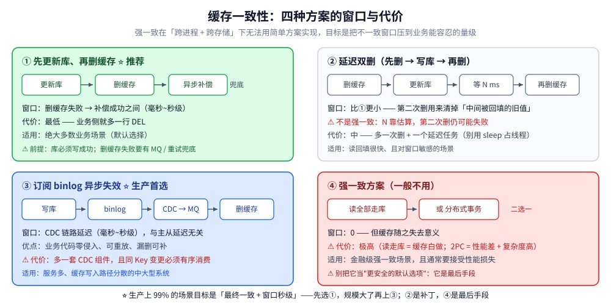

# 缓存一致性

> 缓存与数据库的双写顺序、失效策略与补偿机制 —— 回答「怎么让缓存里的数据和数据库
> 尽量一致，以及在不能强一致时怎么把窗口压到最小」。
>
> 内容整理自个人学习笔记，并参考《Redis 设计与实现》（黄健宏）与《高性能 MySQL》（第 4 版）的缓存相关章节；
> 参考资料与原始素材见 [素材清单](../../../素材清单.md)。
>
> ⭐ 边界先说清：**缓存放哪一层、按什么模式读写**见 [缓存架构与模式.md](缓存架构与模式.md)；
> **雪崩 / 击穿 / 穿透**见 [缓存问题与方案.md](缓存问题与方案.md)；
> 本篇只回答「**双写的顺序与失败后的补偿**」。

---

## 一、为什么一定会有不一致？

**本节要点**：写库和删缓存是**两次独立操作、不在一个事务里** ——
第二步失败或不按顺序落地，脏数据就诞生了。所以问题不是"能不能避免"，
而是「**窗口有多大、靠什么兜底**」。

| 场景 | 结果 |
|------|------|
| 写库成功、删缓存失败 | 缓存里是旧值，读请求持续返回旧数据 |
| 写库成功、删缓存超时（实际已成功） | 无问题（幂等删除） |
| 并发写 A、B 交错 | 可能缓存里留下 A 的旧值 |

⭐ **结论**：**强一致在「跨进程 + 跨存储」下无法用简单方案实现**。
工程目标是「**最终一致 + 不一致窗口尽量小**」——
先接受这一点，后面的方案选择才不会走偏。

---

## 二、四种常用方案怎么选？

**本节要点**：四条路的差别在「**谁来触发失效**」——
业务代码自己删（①）、业务删两次（②）、数据库日志驱动外部组件删（③）、干脆不缓存（④）。
选型顺序很清楚：**默认 ①，规模大了上 ③，② 是补丁，④ 是最后手段**。

### 2.1 先更新库、再删缓存 ⭐ 推荐

```text
① 更新数据库 → ② 删除缓存 → ③ 失败则异步补偿（MQ / 重试 / binlog）
```

| 步骤 | 动作 | 失败处理 |
|------|------|----------|
| 1 | 更新数据库 | 失败则直接返回（业务失败） |
| 2 | 删除缓存 | 失败则打日志 + 异步重试 |
| 3 | 异步重试 | 通过 MQ / 定时任务 / binlog 补偿 |

**优点**：实现简单，绝大多数场景够用。
**缺点**：仍有短暂不一致窗口（写库成功到删缓存之间，读请求可能读到旧缓存）。

### 2.2 延迟双删

```text
① 删除缓存 → ② 更新数据库 → ③ 延迟 N 毫秒 → ④ 再删一次缓存
```

| 关键点 | 说明 |
|--------|------|
| 为什么延迟 | ② 期间可能有读请求回填旧值，③ 就是为了删掉它 |
| N 怎么定 | 大于一次「读请求 + 回填」的耗时（一般 500 ms ~ 1 s） |
| 缺点 | 延迟时间靠估算；第二次删也可能失败 |

⚠️ 延迟双删**不是强一致方案**，只是把窗口压得更小。
⚠️ 实现上别用 `sleep` 占住请求线程 —— 用延时队列 / 定时任务。

### 2.3 订阅 binlog 异步失效 ⭐ 生产首选

```text
业务写库 → binlog → Canal / Debezium → MQ → 消费者删缓存
```

| 优点 | 缺点 |
|------|------|
| 与业务解耦，业务代码不用关心缓存 | 引入 CDC 组件与运维成本 |
| 可重放，漏删可补 | 延迟比业务直删高（毫秒~秒级） |
| 与主从延迟无关（读 binlog 而非从库查询） | 需要保证 MQ 顺序消费（同一 Key 的变更） |

⭐ **关键设计**：**同一 Key 的变更必须有序消费**，否则删缓存可能乱序；
一般按 Key 哈希到同一分区。



### 2.4 强一致方案（一般不用）

| 方案 | 代价 |
|------|------|
| 读全部走库 | 缓存失去意义 |
| 分布式锁 + 两阶段提交 | 性能差、复杂度高 |
| 缓存层本身支持事务 | 依赖特定中间件 |

⚠️ 只有在**金融级强一致**场景才考虑，且通常要一并接受性能损失。

---

## 三、读己之写怎么保证？

**本节要点**：写后立刻读却读到旧值，根因往往不是缓存而是**主从延迟**或**回填时序**。
解法分两类：**把读临时锁到主库**，或者**让这次读能看见刚写的版本**。

| 方案 | 说明 |
|------|------|
| **强制走主库** | 写后一段时间内的读请求全部走主库（最常见） |
| **等位点** | 记录写事务的 binlog 位点，等从库追平后再读 |
| **写缓存回填** | 写库时同步回填缓存（而非只删除），保证缓存立即有新值 |
| **客户端记录版本号** | 请求带上次写的版本号，服务端校验后才返回 |

⭐ 电商、支付场景常用「**写后强制走主库 + 超时降级**」，延迟窗口一般 100 ms ~ 1 s。

⚠️ 「写缓存回填」与 Cache Aside 的「删除优先」看似矛盾，其实不冲突：
**回填用在你必须立刻读到新值的那个 Key 上**（比如用户刚改的昵称），
其余仍是删除 —— 它是补偿手段，不是默认策略。

---

## 四、双写顺序：先写库还是先写缓存？

**本节要点**：**库是权威源，任何情况下库必须写成功；缓存是派生物，可以失败但必须能补偿**。
这一句话就决定了顺序。

| 顺序 | 风险 | 结论 |
|------|------|------|
| **先写缓存、再写库** | 写库失败则缓存是新值、库是旧值，脏数据更持久 | ❌ 不推荐 |
| **先写库、再删缓存** | 删缓存失败时缓存是旧值，但库是对的；有补偿机制 | ⭐ 推荐 |
| **先删缓存、再写库** | 删缓存后、写库前，读请求会回填旧值 | ⚠️ 需要延迟双删弥补 |

⭐ **判断任何"双写顺序"问题的通用方法**：设想**第二步失败**，
看此时系统落到什么状态 —— 落入「库是新的、缓存是旧的」是可接受的
（因为缓存可被删掉重来），落入「缓存是新的、库是旧的」是不可接受的（数据不可再得）。

---

## 五、一致性的三个层次

**本节要点**：先把目标说清楚，再选方案 —— 谈"缓存一致性"却不说明目标层次，
是最常见的沟通事故。

| 层次 | 目标 | 实现手段 |
|------|------|----------|
| **强一致** | 读到的一定是最新值 | 读走库 / 分布式事务（代价极高） |
| **最终一致** | 一定时间后一致 | 先写库 + 异步失效 + 补偿（推荐） |
| **弱一致** | 可能读到旧值，有窗口 | 先删缓存 + 后写库 / 双写（不推荐） |

⭐ **生产上 99% 的场景目标是「最终一致 + 窗口秒级」**。

⚠️ 一个容易忽略的点：**"最终一致"必须配一个可观测的收敛指标**——
比如「失效消息的积压量」「二次删缓存的成功率」；
否则"最终"可能永远不到，而没人发现。

---

## 延伸追问

- **为什么推荐先更新库再删缓存？** → 库是权威源，写库成功才能保证数据不丢；
  删缓存失败还能通过重试 / binlog 补偿。反过来先删缓存则可能出现「删完、写库前」读请求回填旧值。
- **延迟双删能保证强一致吗？** → 不能。它只是把不一致窗口压小，
  第二次删仍可能失败，延迟时间靠估算。强一致必须走库或分布式事务。
- **binlog 异步失效比业务直删好在哪里？** → 与业务解耦、可重放、漏删可补、不受主从延迟影响；
  代价是引入 CDC 组件与 MQ 顺序消费的设计。
- **读己之写怎么保证？** → 写后强制走主库（最常见）、等 binlog 位点、写时回填缓存；
  三者可以组合使用。
- **缓存与数据库双写，先写哪个？** → **先写库再删缓存**。
  判据是设想第二步失败后的状态：宁可"库新缓存旧"（可删可回源），不要"缓存新库旧"（数据丢失）。
- **强一致的代价有多大？** → 读全部走库 = 缓存失去意义；分布式锁 + 2PC = 性能差、复杂度高。
  生产上极少用，且要先确认业务真的需要。

---

## 关联

- [缓存架构与模式.md](缓存架构与模式.md) — Cache Aside / 三种读写模式 / 多级缓存
- [缓存问题与方案.md](缓存问题与方案.md) — 雪崩、击穿、穿透、热 key 与大 key
- [缓存选型对比.md](缓存选型对比.md) — 选型、容量估算与扩容
- [NoSQL/Redis/持久化.md](../NoSQL/Redis/持久化.md) — Redis 自身的持久化与主从一致性
- [关系型/MySQL/复制与高可用.md](../关系型/MySQL/复制与高可用.md) — 主从复制与读写分离
- [数据库选型对比.md](../数据库选型对比.md) — 存储在系统中的横向定位
> 反向引用（本篇被下列文档引到）：[缓存应用场景.md](缓存应用场景.md)、[缓存运维与排查.md](缓存运维与排查.md)
