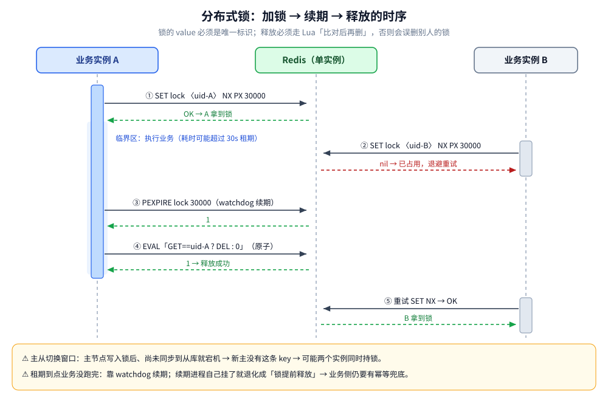
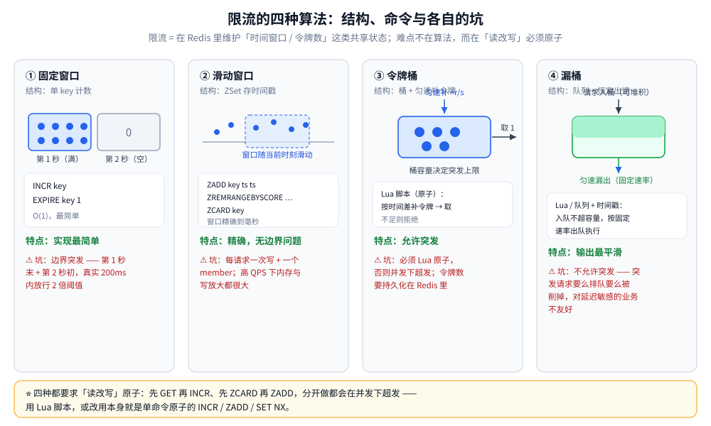
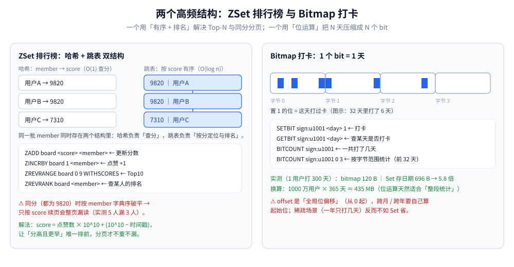

# 缓存应用场景

> 缓存除了「加速读」，还能承载**分布式锁、限流、会话、排行榜、计数器、延迟队列、分布式 ID**
> 等基础设施能力 —— 本篇回答「哪些场景适合用缓存做、用什么结构做、各自的坑在哪」。
>
> 内容整理自个人学习笔记，并参考《Redis 设计与实现》（黄健宏）的对应章节；
> 参考资料与原始素材见 [素材清单](../../../素材清单.md)。
>
> ⭐ 边界先说清：本篇讲**缓存承载的架构能力**，不展开 Redis 命令细节。
> **Redis 自身的命令、数据结构、持久化、集群**见 [NoSQL/Redis/](../NoSQL/Redis/)；
> **缓存作为读加速层**的通用问题见 [缓存架构与模式.md](缓存架构与模式.md)；
> **一致性方案**见 [缓存一致性.md](缓存一致性.md)。

> 📎 本篇的实测读数均为**本机容器实跑逐字抄录**：**Redis 7.4.11（redis:7-alpine）**，
> 客户端是自写的 Go 程序（手写 RESP 协议、零第三方依赖，容器 `golang:1.26-alpine`）。
> ①~⑥ 全部是**确定性计数**（不含耗时），连跑两遍 `diff` 逐行相同。

---

## 一、缓存只能加速读吗？它还能承载哪些能力？

**本节要点**：缓存有两类用途 —— **数据缓存**（加速读）和**基础设施**（分布式协调、限流、排队）。
后者的共性是「要的不是存储，而是**原子操作 + 低延迟 + 全局可见**」，而缓存恰好三项都满足；
也正因为如此，这些场景出问题的地方**几乎从不在功能，而在原子性与可用性**。

| 用途 | 解决的问题 | 典型命令 / 结构 |
|---|---|---|
| **数据缓存** | 读加速、降低数据库压力 | String / Hash / List / Set / ZSet 通用 |
| **基础设施** | 分布式协调、限流、排队 | `SET NX`、`INCR`、ZSet、Stream、Bitmap |

⭐ 本篇讲第二类。判据是这一句：**这类能力要的是「共享的、可原子的、低延迟的状态」，而不是「存储」。**

⚠️ **一个必须先钉死的前提**：这些能力都建立在「缓存是**全局共享的唯一状态**」之上。
一旦缓存是本地多副本（比如各进程内嵌的 Caffeine），`SET NX` 只能保证**本进程内**互斥 ——
分布式锁、限流这类场景**必须指向中心化的 Redis，不能落在本地缓存上**。
多级缓存里 L1 与 Redis 同时存在时，这一点最容易搞混：**读加速可以分层，协同类能力不可以。**

---

## 二、分布式锁：`SET NX` + 过期时间就够了吗？

**本节要点**：「够用」和「正确」是两件事。最小实现只要一行命令，但它身上挂着**六个必须逐条想清楚的失败点**；
其中「释放误删」这条只要没走 Lua，就一定会在大促压测里被翻出来。
命令级细节与完整实现（Go 手写 / Java Redisson）见 [Redis/分布式锁.md](../NoSQL/Redis/分布式锁.md)，
这里只从**场景视角**讲取舍。

### 2.1 最小实现：一条命令，而不是两条

```text
SET lock:order:1001 <uid> NX PX 30000
```

- `NX` = "key 不存在时才写入" → 多个实例并发调用，**只有一个能拿到 `OK`**，天然互斥；
- `PX 30000` = 30 秒租期 → 持锁方崩了，锁**会自动过期**，不会死锁。

⚠️ **不要写成 `SETNX` + `EXPIRE` 两条**：两条命令之间进程若挂掉，就留下一个**永不过期**的锁，
比死锁更难排查。`SET ... NX PX` 是单命令原子完成这两件事的。

**实测（①）**：50 个并发实例同时执行这条命令 ——

```text
① 分布式锁互斥：50 个并发实例同时 `SET NX` → 拿到锁的 1 个（期望 1）
   对照（GET 判断 + SET 写入两步，非原子）：50 个实例全部「写入成功」 → 互斥失效
```

⭐ 对照组的坑值得记：**用「先 `GET` 看锁在不在、再 `SET` 写」来互斥，50 个实例会全部通过** ——
判断和写入之间没有任何互斥，等于没锁。**互斥性必须来自单条命令的原子语义。**

### 2.2 value 为什么必须是唯一标识

锁的 value **不能是固定的 `"1"`**。它是「这把锁是谁的」的唯一凭证 ——
释放时的比对、续期时的归属校验，全靠它。**用固定值，等于放弃了对「锁已易主」这件事的感知。**

### 2.3 释放必须走 Lua：一个必现的误删



上图是完整的加锁 → 续期 → 释放时序。其中第 ④ 步「释放」是整条链路最容易被写错的地方。

**实测（②）**：构造「A 的租期到点、B 已接手，A 这才收尾释放」的竞态 ——

```text
② 锁释放竞态（A 租期到点、B 已接手，A 再执行释放）：
   两步法（GET 比对 true → 再 DEL，返回 1）：之后 B 的锁 = "<nil>" → ❌ 误删/丢失（B 的锁被 A 误删）
   Lua 原子（比对后再删，返回 0）：之后 B 的锁 = "uid-B" → ✅
```

- **两步法**（先 `GET` 比对、确认是自己的再 `DEL`）：比对那一刻锁**确实是自己的**（返回 `true`），
  但比对与 `DEL` 之间锁过期了、B 拿到了锁 —— 于是 A 亲手删掉了 **B 的锁**，之后两个实例同时进临界区；
- **Lua 原子**版把「比对 + 删除」放进一次脚本执行，期间不可能被插入其他命令，返回 `0` 表示**没删**，B 的锁完好。

⚠️ 判据是**返回值的语义**：Lua 版返回 `0` 是「比对未通过、没删」，而不是「失败」——
监控里别把它当错误。

### 2.4 六个必须考虑的坑（速览）

| # | 坑 | 后果 | 解法 |
|---|---|---|---|
| ① | 加锁失败重试无间隔 | 疯狂重试把 Redis 自己打满 | 随机退避（50~200ms） |
| ② | 锁过期但业务没跑完 | 两个实例同时进临界区 | **watchdog 续期** + 业务侧幂等兜底 |
| ③ | 主从切换丢锁 | 新主没有这条 key，互斥失效 | 单实例锁**必然**有这个窗口；要更强须多节点多数派 |
| ④ | 释放误删别人的锁 | 直接破坏互斥 | **Lua「比对后再删」**（见 2.3） |
| ⑤ | 锁时间不准（时钟漂移 / GC 停顿） | 过期判断失真 | 用成熟实现，别自己写 RedLock |
| ⑥ | 拿不到锁无限等待 | 拖垮调用方线程池 | 设等待上限，超时按业务语义降级 |

### 2.5 该不该自己写？

| 场景 | 建议 |
|---|---|
| 只要互斥、能容忍极小概率失效 | 直接用 `SET NX PX` + Lua 释放，自己写**够用** |
| 需要自动续期、可重入、看门狗 | 用成熟库（Java 的 Redisson、Go 的 `redsync`） |
| 要求「绝不出现两个持锁者」 | **锁不够用** —— 要的是共识算法（Raft / 多数派）或数据库唯一约束 |

⭐ 一句判据：**锁是「大部分时候能避免并发」的优化手段，不是「保证串行」的正确性保证。**
真正不能并发的动作（扣款、发券），下游必须有**幂等或唯一约束**兜底。

---

## 三、限流有哪几种算法？为什么都需要原子？

**本节要点**：四种算法（固定窗口 / 滑动窗口 / 令牌桶 / 漏桶）的差别，本质是
**「允不允许突发」与「精确到什么粒度」**两组取舍；而无论选哪种，Redis 侧的难点都只有一句话：
**「读改写」必须原子**，否则并发下必然超发。



### 3.1 四种算法怎么选

| 算法 | 结构 | 优点 | 代价 / 坑 |
|---|---|---|---|
| **固定窗口** | 单 key 计数（`INCR` + `EXPIRE`） | 最简单，O(1) | **边界突发放大**（见下） |
| **滑动窗口** | ZSet 存每次请求的时间戳 | 精确，无边界问题 | 每请求一次写 + 一个 member，内存与写放大都大 |
| **令牌桶** | 桶 + 匀速补令牌（Lua） | **允许突发**（上限 = 桶容量） | 必须 Lua 原子；状态要存 Redis |
| **漏桶** | 队列 + 恒定出速（Lua） | 输出最平滑 | **不允许突发**，对延迟敏感业务不友好 |

### 3.2 实测：固定窗口的边界突发放大

固定窗口按「自然秒」分桶（key 里带秒号），于是**同一个 200ms 里可以横跨两个窗口**：

```text
③ 固定窗口（1s 限 10）：边界前 100ms 放行 10 次 + 边界后 100ms 放行 10 次
   真实 200ms 内共放行 20 次 = 2.0 倍阈值 → 边界突发放大
④ 滑动窗口（ZSet，窗口 1000ms 限 10）：同样「两批各 10 次、相隔 200ms」
   第 1 批放行 10 次 + 第 2 批放行 0 次 = 10 次 = 1.0 倍阈值 → 精确
```

⭐ 判据很清楚：**同样两批流量，固定窗口放行 20 次（2 倍），滑动窗口放行 10 次（1.0 倍）**。
固定窗口的「1s 限 10」只保证「**每个自然秒**不超过 10」，不保证「**任意 1 秒**不超过 10」。

⚠️ 反过来说：**滑动窗口用 ZSet 是拿内存和写放大换精确** —— 高 QPS 下每请求一个 member，
内存随 QPS × 窗口长度线性增长。生产常见折中是**「多个固定窗口叠加」**（如 1s + 1min 双窗口），
而不是无脑上 ZSet。

### 3.3 为什么「读改写」必须原子

- 先 `ZCARD` 再 `ZADD`：两步之间其他请求也会读到旧计数 → 一起放行；
- 先 `GET` 再 `INCR`：同理。

**解法只有两条**：① 用**本身就是单命令原子**的操作（`INCR`、`ZADD`、`SET NX`）；
② 把「读 + 判断 + 写」封进一段 **Lua 脚本**（Redis 单线程执行脚本，脚本内不会被插入其他命令）。
⚠️ 这也是为什么「限流」看起来是算法题，落到 Redis 上却全是**原子性**问题。

### 3.4 分布式限流的三个额外前提

| 前提 | 说明 |
|---|---|
| **中心化** | 本地限流只能限住本实例，集群总阈值会被「实例数 × 单机阈值」放大 |
| **单点风险** | 限流依赖的 Redis 挂了怎么办？—— 常见策略是**放行**（保证可用）或**降级为本地限流**（保证不被打垮），按业务选 |
| **集群分片** | Redis Cluster 下多 key 可能不在同一槽 → 需要 hash tag 保证同槽，或用单 key 计数 |

---

## 四、会话共享为什么放缓存？和 JWT 怎么选？

**本节要点**：会话（Session）放 Redis 要解决的是「**多实例无状态**」——
登录在哪台机器上发生的不重要，任何实例都能读到会话；而 JWT 是把状态搬到客户端。
两者不是「新旧替代」，是**「服务端可控」与「客户端免存储」的取舍**。

| 维度 | Redis 集中式 Session | JWT（无状态令牌） |
|---|---|---|
| 状态存放 | 服务端（Redis） | 客户端（token 自带声明） |
| 服务端可主动失效 | ✅ 删 key 即失效 | ❌ 签发后到期前一直有效（除非加黑名单，又回到集中存储） |
| 跨服务 / 跨域 | 需共享 Redis | 天然适合（无需共享存储） |
| 每次请求开销 | 一次 Redis 往返 | 本地验签（无网络开销） |
| 扩容 / 重启 | 会话不丢（Redis 持久化） | 不依赖服务端状态 |
| 典型坑 | Session 固定攻击、续期策略 | 无法登出、token 体积大、密钥轮换 |

**结构选型**：

```text
SET  session:<sid>  <序列化后的会话>  EX 1800     # String 存整体（读多写少，最简单）
HSET session:<sid>  uid 1001  role admin         # Hash 存字段（要局部更新字段时用）
```

⭐ 常见组合：**「JWT 做网关鉴权 + Redis 存会话版本号」** —— 网关本地验签（快），
Redis 里只存一个「该用户会话版本」，改密码 / 强制下线时版本 +1，旧 token 立即作废。
**用一次极小的 Redis 读，换回 JWT 缺失的「可主动失效」能力。**

⚠️ 三处易踩：① **续期策略**（滑动续期会让活跃用户永不过期，要有绝对上限）；
② **序列化格式**（跨语言服务要约定一致的编码）；③ **`sid` 必须足够随机**（否则会话可被枚举）。

---

## 五、排行榜怎么用 ZSet 做？同分分页的坑在哪？

**本节要点**：ZSet 是「有序集合」，**同分时的排序是稳定但不符合直觉的** ——
它按 member 的字典序破平，于是「按分数续页」这种看起来自然的写法会**整页漏读**。
这是 ZSet 榜单最容易被忽略的一个正确性问题。



### 5.1 ZSet 的结构与常用命令

ZSet 内部是**哈希 + 跳表**双结构：哈希负责「`member → score`」的 O(1) 查分，
跳表负责「按 score 有序」的定位与排名。所以下面这些操作各有分工：

```text
ZADD    board <score> <member>          # 更新分数（点赞数变化时）
ZINCRBY board 1 <member>                # 分数 +1（原子自增，最常用于点赞）
ZREVRANGE board 0 9 WITHSCORES          # Top10（含分数）
ZREVRANK  board <member>                # 查某人当前排名（0 起）
```

### 5.2 实测：同分时按分数续页会漏数据

**实测（⑤）**：5 个成员分数完全相同（都是 9820），每页 2 条 ——

```text
⑤ ZSet 同分分页（5 个成员全部 9820 分，每页 2 条）：
   第 1 页 ZREVRANGE 0 1        = [用户E 用户D]
   续页「ZREVRANGEBYSCORE (9820 -inf」= [] → 漏掉 3 条
   续页「ZREVRANGE 2 3」         = [用户C 用户B] → ✅ 不重不漏
   注：同分时按 member 字典序破平（ZREVRANGE 逆序遍历 → 大的排前），
       所以「按 score 严格小于上一页末位」续页会整页漏读
```

⚠️ 两个反直觉的点：① 同分时 ZSet **并不是「并列」**，它有确定的次序（member 字典序）；
② 因此**「下一页 = 分数小于上一页最后一条」这个写法在榜单上直接错** —— 剩余 3 条同为 9820，
全被 `(9820` 这个开区间排除掉了。

**两种修法**：

| 修法 | 做法 | 适用 |
|---|---|---|
| **offset 分页** | 一直用 `ZREVRANGE start stop` | 榜单小、翻页浅 |
| **复合分数** ⭐ | `score = 点赞数 × 10^10 + (10^10 − 时间戳)` | 榜单大、要「分数相同时更早的排前」且唯一 |

⭐ 复合分数字段让**每个成员的分数唯一**，于是「按 score 续页」重新变得安全 ——
这也是绝大多数线上榜单（微博热搜、B 站排行）的实际做法。

### 5.3 榜单另外三个坑

- **榜单本身是热 key**：全站都读同一个 key → 单分片压力集中，需要**本地缓存**或按维度分片（如按小时建榜）；
- **`ZREVRANGE` 深分页**：跳表按排名定位是 O(log n)，但一次取 m 条是 **O(log n + m)**，
  `start` 很大时仍要跳过大量节点 → 深翻页改用复合分数游标；
- **必须设过期或归档**：日榜/周榜不清理会无限增长，历史榜应落到冷存储。

---

## 六、计数器、去重与打卡：`INCR`、HLL、Bitmap 怎么选？

**本节要点**：这三个都是「**用缓存做统计**」，但精度、内存、能取回什么完全不同。
选错的典型症状是「为了省内存用了 HLL，结果要导出明细时取不出来」。

| 需求 | 结构 | 精度 | 实测内存（同规模） | 能取回明细吗 |
|---|---|---|---|---|
| 精确计数（点赞数、库存） | `INCR` / String | 精确 | 一个 key | ✅ 值本身 |
| **去重计数**（UV、独立访客） | **HyperLogLog** | 约值（±0.81%） | 100000 用户 → **14392 B** | ❌ 只能给基数 |
| **去重 + 明细**（签到名单） | Set | 精确 | 100000 用户 → **4772976 B** | ✅ 全部成员 |
| **布尔矩阵**（打卡、活跃位） | Bitmap（`SETBIT`） | 精确 | 1 用户 300 天 → **120 B** | ✅ 逐位查 |

**实测（⑥-B）**：100000 个互不相同的用户 ——

```text
⑥-B 去重计数：100000 个互不相同的用户
   精确（Set）：SCARD 100000 ｜ 内存 4772976 B
   近似（HLL）：PFCOUNT 100420 ｜ 内存 14392 B ｜ 误差 +0.42%
   内存比 332× ｜ HLL 的误差上界 ≈ 0.81%（标准误差 1.04/√16384）
```

**实测（⑥-A）**：1 个用户一年打 300 天卡 ——

```text
⑥-A Bitmap 打卡：1 用户 1 年打 300 天
   bitmap 内存 120 B ｜ Set 内存 696 B ｜ 比值 5.8×
   换算：1000 万用户 × 365 天 → bitmap 约 435 MB
```

⭐ 三条判据：

1. **只要基数、不要明细**（UV、日活）→ **HLL**，332 倍的内存差，误差 0.42% 完全可接受；
2. **要明细或要精确**（签到名单、发奖核对）→ **Set**；
3. **「某天有没有」这种布尔矩阵**（打卡、每日活跃状态）→ **Bitmap**，把 N 天压成 N 个 bit。

⚠️ 三个坑：

- **HLL 不能取回元素**，也不能合并去重之外做任何事（`PFMERGE` 可合并多个 HLL，适合按天合并成月）；
- **Bitmap 的 offset 是「全局位偏移」**（从 0 起，不认月份）—— 跨月/跨年要自己算起始位，
  `BITCOUNT key 0 3` 这种按字节范围统计也要自己换算；
- **稀疏场景用 Bitmap 反而浪费**：一年只打 3 天，Bitmap 仍占满整段位空间，不如 Set。

---

## 七、延迟队列怎么用缓存做？和 MQ 怎么选？

**本节要点**：用 **ZSet 的 score 存「该执行的时间戳」**，配合轮询取到期任务 ——
这是个只有十几行、但能把「延迟投递」这件事跑通的方案。它的边界很清楚：
**适合「量不大、延迟精度要求到秒、允许极小概率丢失」的场景，不适合要求可靠投递的场景。**

### 7.1 最小实现

```text
# 投递：把「执行时间戳（毫秒）」作为 score
ZADD delay:queue <execute_at_ms> <task_id>

# 消费：每轮取出已到期的 N 条
ZRANGEBYSCORE delay:queue 0 <now_ms> LIMIT 0 100
# 取到之后必须在 Lua 里「原子地」删除，否则多消费者会重复执行
```

⚠️ **`ZRANGEBYSCORE` 取出来 ≠ 你独占它**：多个消费者同时取会读到同一批任务。
必须用 Lua 把「取 + `ZREM` 并判断删除返回值」做成一步 —— **只有 `ZREM` 返回 1 的那个消费者才执行**。

| 关注点 | 说明 |
|---|---|
| 延迟精度 | 取决于轮询间隔（一般 100ms~1s），**不是精确的定时器** |
| 并发消费 | 必须 Lua 原子「取+删」，否则重复执行 |
| 任务可靠性 | Redis 本身不保证不丢；重试/续期要自己实现 |
| 内存 | 未到期任务全部堆在 ZSet 里，量大要分片（按时间桶拆多个 key） |

### 7.2 和 MQ 怎么选

| 方案 | 延迟精度 | 可靠性 | 适用 |
|---|---|---|---|
| **Redis ZSet** | 秒级（轮询决定） | 一般（需自己做补偿） | 量不大、简单场景：订单超时提醒、延时重试 |
| **RocketMQ 延迟消息** | 固定档位（如 1s~2h） | 高（持久化 + 重试） | 业务量大的标准延迟投递 |
| **RabbitMQ TTL + 死信队列** | 毫秒~秒 | 高 | 已有 RabbitMQ 的团队 |
| **Redis Stream + 消费组** | 无延迟能力，但可靠 | 较高（ACK + PENDING） | 需要「至少一次」语义的消息流 |

⭐ 判据：**只是「过一会儿再做一次」→ ZSet 够用；「这条消息一定不能丢」→ 用 MQ。**

---

## 八、分布式 ID 能用缓存生成吗？

**本节要点**：可以，而且 `INCR` 是**最简单、天然全局唯一有序**的发号器。
但「每发一个号一次往返」在高并发下 RTT 会成为瓶颈，于是有了**号段模式**；
而它和雪花算法是两个不同方向的解，选型看你要「严格递增」还是「不依赖中心服务」。

### 8.1 两种用法

```text
INCR seq:order            # 最简：全局自增，单次往返
```

**号段模式**（推荐）：一次向 Redis 申请一段，缓存在本地逐号发放。

```text
INCRBY seq:order:step 1000     # 服务每次拿 1000 个号，本地 0~999 顺序发
```

| 方式 | 优点 | 代价 |
|---|---|---|
| 每次 `INCR` | 实现最简单，严格递增 | 每次一次网络往返，QPS 高时成为瓶颈 |
| **号段模式** | RTT 摊薄 1000 倍 | 服务重启会**丢一段**（ID 出现空洞，一般可接受） |

### 8.2 和雪花算法对比

| 维度 | Redis `INCR` / 号段 | 雪花算法（Snowflake） |
|---|---|---|
| 是否依赖中心服务 | ✅ 依赖 Redis（单点风险） | ❌ 完全本地生成 |
| ID 形态 | 连续自增（**有序，可推算出业务量**） | 趋势递增（时间戳在最高位） |
| 是否需要时钟 | ❌ | ✅ **强依赖机器时钟**（回拨会出问题） |
| 泄漏信息 | 会暴露「总量/增速」 | 暴露「生成时间」 |
| 典型适用 | 订单号、需要连续的场景 | 分布式、要求高性能无中心 |

⚠️ **用 Redis 发号的两个前提**：① **必须开持久化**（AOF `everysec` 起），
否则重启后计数器回退，会发出重复 ID；② **单点要兜底** —— 常见做法是
「本地缓存一个号段 + Redis 申请号段」，Redis 短暂不可用时靠本地号段顶住。

⭐ 完整推导（雪花算法的位分配、时钟回拨处理、Leaf / 美团号段方案）见
[分布式ID.md](../../../04-架构与系统/分布式/理论/分布式ID.md)。

---

## 九、七个场景怎么选？一张总表

**本节要点**：把上面七节压成一张表 —— 左列是场景，中间是「结构/命令」，
右侧两列是**决定成败的前提**与**最容易翻车的风险**。选型时先看「前提」这一列。

| 场景 | 结构 / 命令 | 关键前提 | 主要风险 |
|---|---|---|---|
| **分布式锁** | `SET NX PX` + Lua 释放 | 中心化实例；value 唯一 | 误删 / 主从切换丢锁 / 无幂等兜底 |
| **限流** | `INCR`+`EXPIRE`、ZSet、Lua 令牌桶 | 「读改写」原子 | 固定窗口边界突发；本地限流失效 |
| **会话共享** | String / Hash + TTL | 中心化 + 随机 `sid` | 无法主动失效（若选 JWT）/ 续期无上限 |
| **排行榜** | ZSet（`ZINCRBY`/`ZREVRANGE`） | 分数字段唯一（复合分数） | 同分分页漏读；榜单自身是热 key |
| **计数器** | `INCR` / `HINCRBY` | 单 key 原子 | 单 key 成为热 key（需分片计数再合并） |
| **去重计数** | HyperLogLog / Set / Bitmap | 想清楚「要不要明细」 | 用 HLL 却需要明细 → 取不出来 |
| **延迟队列** | ZSet（score = 时间戳）+ Lua | 取+删必须原子 | 重复消费；任务丢失无补偿 |
| **分布式 ID** | `INCR` / `INCRBY` 号段 | **必须开持久化** | 重启回退发重复号；单点依赖 |

⭐ **三条跨场景的通用判据**：

1. **原子性优先于算法**：这七类里绝大多数线上事故，根因不是「算法选错」而是「两步之间被插队」；
2. **区分「读加速」与「协同」**：读加速可以分层（本地 + Redis），协同能力**必须中心化**；
3. **缓存是可失败的依赖**：锁、限流、发号这些能力都要想清楚「Redis 挂了怎么办」——
   是降级放行、降级本地，还是直接拒绝，**必须先定**，而不是等故障时临场决定。

---

## 延伸追问

- **`SET NX` 和 `SETNX` 有什么区别？为什么推荐前者？** → `SETNX` 不能同时设过期，要两条命令；
  `SET key val NX PX ms` 一条命令原子完成「不存在才写 + 设过期」。两条命令之间的进程崩溃会留下永不过期的锁。
- **锁过期了但业务没跑完怎么办？** → watchdog 续期（Redisson 默认按 1/3 租期续一次）；
  ⚠️ 续期进程自己挂了就退化成「锁提前释放」，所以业务侧**仍要幂等兜底**。
- **主从切换会不会丢锁？** → 会。主节点写入后、同步到从库前宕机，新主没有这条 key。
  单实例锁**必然**有这个窗口；要更强保证得用多独立节点的多数派并接受其代价。
- **固定窗口限流为什么不能直接用在生产？** → 它只保证「每个自然秒」不超阈值，
  边界处任意 200ms 内可以放到 **2 倍**（实测）。要么用滑动窗口，要么用多窗口叠加折中。
- **同样是「序号」，Redis `INCR` 和雪花算法怎么选？** → 要**连续、有序、可读**（订单号）用 `INCR`/号段，
  但要接受中心依赖与持久化要求；要**无中心、高性能**用雪花，但要处理时钟回拨。
- **HyperLogLog 的误差能接受吗？** → 标准误差 1.04/√16384 ≈ **0.81%**，实测 100000 用户估出 100420（+0.42%）。
  UV 这类指标完全够用；**结算、发奖这类要精确数字的场景不能用**。
- **缓存承载这些能力，单点故障怎么办？** → 先定策略：**降级放行**（保可用，可能超发）、
  **降级本地**（保不被打垮，但阈值失效）、**直接拒绝**（保正确，损失可用性）。三者不能临场选。

## 关联

- [缓存架构与模式.md](缓存架构与模式.md) — 缓存放哪一层、Cache Aside 与多级缓存（本篇的「读加速」对照面）
- [缓存一致性.md](缓存一致性.md) — 分布式锁之外，另一条「保证正确性」的路线：双写顺序与补偿
- [缓存问题与方案.md](缓存问题与方案.md) — 雪崩、击穿、穿透、热 key 与大 key（本篇的榜单/计数器正是热 key 高发区）
- [缓存选型与容量.md](缓存选型与容量.md) — 容量估算与内存放不下时的取舍
- [缓存运维与排查.md](缓存运维与排查.md) — 本篇这些能力上线之后的观测与定位（大 key / 热 key / 阻塞命令）
- [NoSQL/Redis/分布式锁.md](../NoSQL/Redis/分布式锁.md) — 本篇第二节的完整实现（Go 手写 + Java Redisson）
- [NoSQL/Redis/数据类型.md](../NoSQL/Redis/数据类型.md) — ZSet / Bitmap / HyperLogLog 的命令级细节
- [位图与布隆过滤器.md](../../../02-计算机基础/数据结构/高级数据结构/位图与布隆过滤器.md) — Bitmap 的位运算原理与布隆过滤器实测
- [限流算法.md](../../../04-架构与系统/分布式/服务治理/限流算法.md) — 四种限流算法的横向对比与服务治理视角
- [限流器.md](../../../01-编程语言/go/并发/限流器.md) — Go 侧 `x/time/rate` 的单机限流实现
- [稳定性三件套.md](../../../04-架构与系统/分布式/服务治理/稳定性三件套.md) — 限流 / 降级 / 熔断在系统中的位置
- [分布式ID.md](../../../04-架构与系统/分布式/理论/分布式ID.md) — 雪花算法、号段模式与 Leaf 的完整推导
- [分布式事务.md](../../../04-架构与系统/分布式/理论/分布式事务.md) — 跨服务一致性（锁之外的另一条路）
- [朋友圈设计.md](../../../04-架构与系统/系统设计/朋友圈设计.md) — 计数器与拉取模式在真实系统里的落地
- [存储选型.md](../存储选型.md) — 七类存储在系统中的横向定位
