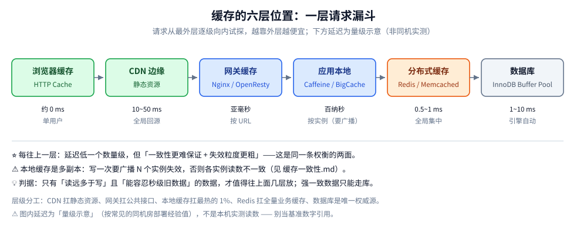
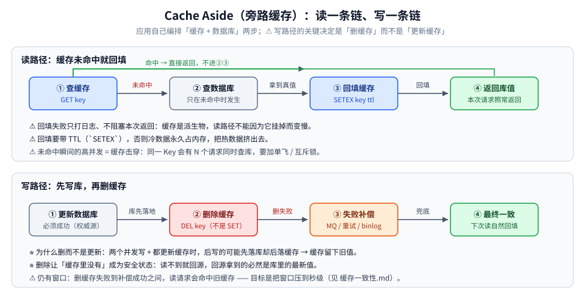

# 缓存架构与模式

> 缓存放哪一层、按什么模式读写、多级缓存如何组合 —— 回答「缓存不是一个组件，
> 而是一条从浏览器到数据库的链路」这个核心命题。
>
> 内容整理自个人学习笔记，并参考《Redis 设计与实现》（黄健宏）与《高性能 MySQL》（第 4 版）的缓存相关章节；
> 参考资料与原始素材见 [素材清单](../../../素材清单.md)。
>
> ⭐ 边界先说清：**Redis 自身的命令、数据结构与部署**见 [NoSQL/Redis/](../NoSQL/Redis/)；
> **选型与容量估算**见 [缓存选型对比.md](缓存选型对比.md)；**与数据库的双写顺序**见 [缓存一致性.md](缓存一致性.md)；
> 本篇只回答「**缓存放哪一层、按什么模式读写**」。

---

## 一、缓存放哪六层？每层的延迟与失效粒度差多少？

**本节要点**：把「缓存」当成**一条分层的请求漏斗**而不是一个 Redis 实例 ——
每往上一层，延迟低一个数量级，代价是**一致性更难保证、失效粒度更粗**；
这两件事是同一条权衡的两面，选层就是在选把这段代价付在哪。

| 层级 | 位置 | 典型实现 | 失效粒度 |
|------|------|----------|----------|
| **浏览器缓存** | 客户端 | HTTP Cache、Service Worker | 单用户 |
| **CDN 边缘缓存** | 离用户最近的节点 | Cloudflare、阿里云 CDN | 全局（回源刷新） |
| **网关缓存** | 反向代理层 | Nginx proxy_cache、OpenResty | 按 URL / 规则 |
| **应用本地缓存** | 进程内 | Caffeine、BigCache、freecache | 按实例（需广播失效） |
| **分布式缓存** | 独立集群 | Redis、Memcached | 全局（集中管理） |
| **数据库缓存** | 存储引擎内 | InnoDB Buffer Pool | 引擎自动 |



⭐ **这张图里最该记住的是「顺序」**：

1. 请求**从最外层逐级向内试探** —— 越靠外越便宜，所以设计目标是「让绝大多数请求在最外层就返回」。
2. **越靠内，能缓存的集合越大**：浏览器缓存只缓存"你访问过的那几页"；Redis 能放全量业务数据；
   数据库缓存则是引擎按页自动管理的。
3. **越靠外，失效越难**：让一个用户的浏览器缓存失效，只能靠 TTL；
   让 CDN 失效要回源刷新；而让本地缓存失效，需要**广播到每个实例**。

⚠️ **一个常见误解**：「上了 Redis 就等于加了缓存」——
Redis 只是这条链路上的第 5 层；静态资源交给 CDN、公共接口交给网关，
往往比把一切都压给 Redis 更划算（带宽与连接数都省）。

---

## 二、三种经典读写模式怎么选？

**本节要点**：模式之争的本质是「**谁来维护缓存与库的一致性**」——
应用自己维护（Cache Aside）、缓存层代劳（Read/Write Through）、还是把写攒起来延迟落库（Write Behind）。
**绝大多数业务用 Cache Aside**，另两种只在特定形状的场景里划算。

### 2.1 Cache Aside（旁路缓存）⭐ 最常用

**读**：先读缓存 → 未命中则读库 → 回填缓存。
**写**：先更新数据库 → 再**删除**缓存（不是更新缓存）。



| 步骤 | 动作 | 关键点 |
|------|------|--------|
| 读 | 缓存命中直接返回 | —— |
| 读 | 未命中 → 查库 → 回填缓存 | 回填失败要打日志，**不阻塞返回** |
| 写 | 先更新库 | 库是权威源，必须写成功 |
| 写 | 再删缓存 | **删除优于更新**，见下 |

⚠️ **为什么删除优于更新**：两个并发写（A、B）如果都去更新缓存，可能出现
「A 先更新库 → B 更新库 → B 更新缓存 → A 更新缓存」的乱序，
缓存里最终留下的是 **A 的旧值**。改成删除，则「缓存里没有」是**安全状态**：
下一次读不到自然回源，回源拿到的必然是库里最新的值。

⚠️ **失败处理**：删缓存失败不能只吞掉日志 —— 要接 **重试 / 消息队列补偿 / 订阅 binlog 兜底**
（三条路的代价对比见 [缓存一致性.md](缓存一致性.md) 第二节）。

### 2.2 Read/Write Through（读写穿透）

**缓存层代理数据库**：应用只与缓存交互，缓存层自己负责读写库。

| 优点 | 缺点 |
|------|------|
| 应用侧逻辑简单（只有一层接口） | 缓存层要保证强一致，实现复杂 |
| 适合已有成熟缓存中间件的团队 | 缓存层故障影响面大（它成了单点） |

⚠️ 实践中很少直接用，多见于云厂商的托管缓存服务 ——
自研的话，**等于把 Cache Aside 的复杂度从业务挪到了中间件**，总量并没有减少。

### 2.3 Write Behind（异步回写）

**写**：只写缓存 → 异步批量落库。
**读**：从缓存读，未命中可能从库补。

| 优点 | 缺点 |
|------|------|
| 写性能极高（合并写：N 次写落成 1 次） | ⚠️ **丢数据风险**：缓存宕机则未落库的数据永久丢失 |
| 适合计数器、浏览数这类高频小写 | 一致性窗口大（毫秒~秒级） |

⚠️ **只在能容忍丢数据的场景使用**（PV 计数、点赞数的近似值、埋点）——
把订单、余额这类数据交给 Write Behind 是在给自己埋雷。

---

## 三、多级缓存怎么组？三个坑在哪？

**本节要点**：多级缓存不是「把同样的数据存三份」，而是**按热度分层** ——
本地缓存只放最热的 1%，Redis 放全量；难点全在**失效传播**与**TTL 编排**上。

### 3.1 典型三层架构

```text
客户端 → CDN → 网关 → 应用（本地缓存 → Redis）→ 数据库
```

| 层 | 承载什么 | TTL 策略 |
|----|----------|----------|
| CDN | 静态资源、可缓存的 HTML | 分钟~小时级 |
| 网关 | 公共接口、配置 | 秒~分钟级 |
| 本地缓存 | 热点 Key 中最热的 1% | 秒级（**比 Redis 短**） |
| Redis | 全量业务缓存 | 分钟~小时级 |

### 3.2 三个必须处理的坑

| 坑 | 说明 | 方案 |
|----|------|------|
| **一致性** | 本地缓存多副本，更新要广播到每个实例 | MQ 广播失效 / Redis 发布订阅 |
| **TTL 错开** | 三层同时失效 → 全量回源 → 雪崩 | 本地 TTL 短于 Redis；Redis 侧加随机抖动 |
| **容量上限** | 本地缓存无上限 → 吃光堆内存 → OOM | 用 Caffeine 等带容量与淘汰策略的库 |

### 3.3 本地缓存的选型

| 库 | 语言 | 淘汰算法 | 特点 |
|----|------|----------|------|
| **Caffeine** | Java | W-TinyLFU | 命中率接近最优，支持异步刷新 |
| **BigCache** | Go | 分片 LRU | 避免 GC 压力，适合大 value |
| **freecache** | Go | 分片 LRU | 零 GC 设计（自己管理内存） |
| **go-cache** | Go | 简单 LRU | 简单场景够用，非并发优化 |

⚠️ 本地缓存选型的**第一问不是命中率，而是"要不要广播失效"**：
如果业务不能接受各实例短时间读到不同值，那就别上本地缓存，
或者把它限死在「只读、且变更极少的配置类数据」上。

---

## 四、缓存粒度怎么定？

**本节要点**：**失效粒度越细，一致性越容易保证，但缓存复杂度越高**。
从**对象缓存**起步，只有性能压力被明确测量到时，才升级到页面 / 片段缓存。

| 粒度 | 示例 | 优点 | 缺点 |
|------|------|------|------|
| **对象缓存** | 用户对象、商品对象 | 精确失效 | 每个对象一次查询（要防 N+1） |
| **页面缓存** | 商品详情页 HTML | 一次缓存整页 | 局部更新要全页失效 |
| **片段缓存** | 页头、页脚、侧栏 | 复用度高 | 组合逻辑复杂 |
| **查询结果缓存** | 复杂查询结果 | 省掉重算 | 数据变更时失效面大 |

⭐ **判据**：先问「**这条数据变了，我要让哪些缓存失效**」——
如果答案里出现"差不多所有的"，说明粒度太粗了。

---

## 五、命中率怎么提？

**本节要点**：命中率是缓存**唯一的核心指标** —— 它低，说明这一层白加了；
提升它只有三个抓手，且都要付代价。

| 指标 | 定义 | 目标 |
|------|------|------|
| **命中率** | 命中次数 / 总请求 | 一般 ≥ 90%，热点 ≥ 99% |
| **回源率** | 未命中 / 总请求 | 越低越好 |
| **平均延迟** | 命中延迟 × 命中率 + 未命中延迟 × 回源率 | 取决于业务 SLO |

⭐ **提升命中率的三个抓手**：

1. **延长 TTL**：能容忍旧数据就尽量长 —— 这是最有效也最容易滥用的手段；
2. **预热**：大促前把热点数据提前加载，避免开闸瞬间全部回源；
3. **粒度合理**：粒度太细则命中率低（每次都要重新查库），太粗则一致性差。

⚠️ **别只看命中率**：命中率 99% 但剩下 1% 全是同一个 Key 时，
那 1% 会把数据库打穿 —— 这就是**缓存击穿**，
要看的是「**未命中的分布**」而不只是比率（见 [缓存问题与方案.md](缓存问题与方案.md)）。

---

## 延伸追问

- **Cache Aside 为什么推荐删缓存而不是更新缓存？** → 并发写下，更新缓存可能让旧值覆盖新值（乱序）；
  删除则让"缓存里没有"成为安全状态，下次读自然回填最新值。
- **多级缓存怎么保证一致？** → 本地缓存通过 MQ / Redis 发布订阅广播失效；
  TTL 错开避免同时失效；对强一致要求高的数据干脆不读本地缓存。
- **Write Behind 适合什么场景？** → 能容忍丢数据、写入量大、可合并写的场景（计数器、埋点、点赞数）。
- **为什么缓存要分层而不是只用一个 Redis？** → 延迟差一个数量级：本地缓存是百纳秒级、同机房 Redis 是亚毫秒级。
  分层让绝大多数热点请求在本地命中，Redis 只承载长尾。
- **一层缓存（只有 Redis）够不够？** → 大多数业务够。加本地缓存的前提是
  「热 Key 极其集中 + 能接受广播失效的复杂度 + 能接受多副本短暂不一致」。

---

## 关联

- [缓存选型对比.md](缓存选型对比.md) — Redis 与 Memcached 对比、容量估算与扩容
- [缓存淘汰算法.md](缓存淘汰算法.md) — LRU / LFU / W-TinyLFU 的取舍
- [缓存一致性.md](缓存一致性.md) — 与数据库的双写顺序、失效与补偿
- [缓存问题与方案.md](缓存问题与方案.md) — 雪崩、击穿、穿透、热 key 与大 key
- [NoSQL/Redis/](../NoSQL/Redis/) — Redis 自身的命令、数据结构与部署
- [数据库选型对比.md](../数据库选型对比.md) — 存储在系统中的横向定位
> 反向引用（本篇被下列文档引到）：[缓存应用场景.md](缓存应用场景.md)、[缓存运维与排查.md](缓存运维与排查.md)
