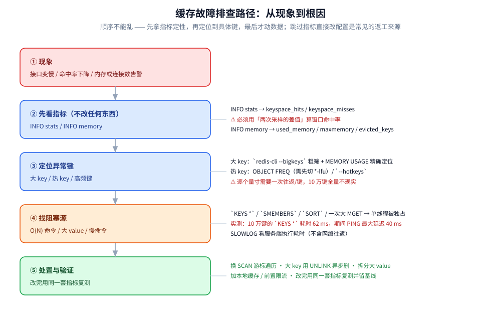
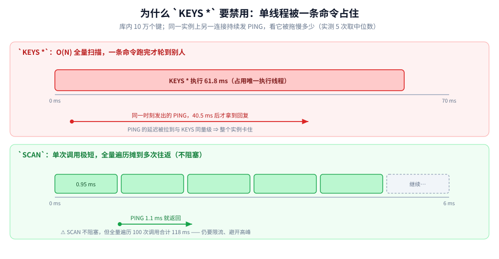

# 缓存运维与排查

> 缓存「出事」时怎么定位：监控看什么指标、大 key 与热 key 怎么找、哪些命令必须禁用、
> 内存与淘汰怎么读 —— 回答「**从现象到根因，按什么顺序下钻**」。
>
> 内容整理自个人学习笔记，并参考《Redis 设计与实现》（黄健宏）与 Redis 官方文档的运维章节；
> 参考资料与原始素材见 [素材清单](../../../素材清单.md)。
>
> ⭐ 边界先说清：本篇讲**观测与定位**，不讲「怎么修业务逻辑」。
> **缓存本身**的架构问题（一致性、雪崩、击穿）见 [缓存问题与方案.md](缓存问题与方案.md)
> 与 [缓存一致性.md](缓存一致性.md)；**Redis 的淘汰策略原理**见 [NoSQL/Redis/淘汰策略.md](../NoSQL/Redis/淘汰策略.md)；
> **系统层的观测工具**见 [性能排查.md](../../../02-计算机基础/linux/性能排查.md)。

> 📎 本篇的实测读数均为**本机容器实跑逐字抄录**：Redis 7.4.11（`redis:7-alpine`，
> `maxmemory 256mb`），客户端是自写的 Go 程序（手写 RESP 协议、零第三方依赖，
> 容器 `golang:1.26-alpine`）。含**真实计时**的项取 **5 次的中位数 / 波动区间**，
> 判据看**量级**而不是某个具体数。

---

## 一、缓存出问题该按什么顺序排查？

**本节要点**：排查顺序**不能乱** —— 先拿指标定性（不改任何东西），
再定位到具体键，最后才动数据。跳过指标直接改配置，是缓存排查里最常见的返工来源：
你不知道「改之前是什么样」，也就无法判断「改完好了没有」。



| 步骤 | 做什么 | 关键点 |
|---|---|---|
| ① 现象 | 接口变慢 / 命中率下降 / 内存或连接告警 | 先确认是**缓存**的问题，还是下游（DB / 网络）的问题 |
| ② 看指标 | `INFO stats`、`INFO memory` | **只读不改**；命中率必须用**窗口差分**（见第二节） |
| ③ 定位键 | 大 key / 热 key / 高频键 | 先粗筛再精确量寸（见第三、四节） |
| ④ 找阻塞 | O(N) 命令 / 大 value / 慢命令 | `SLOWLOG` + 「谁在独占单线程」（见第五节） |
| ⑤ 处置验证 | 改完用**同一套指标**复测 | 留基线，否则无从对比 |

⚠️ 一个贯穿全程的前提：**Redis 命令执行是单线程的**。这意味着「慢」往往不是「Redis 慢」，
而是**某一条命令把唯一线程占住了**，其他请求只能排队 —— 第五节会把这条量化出来。

---

## 二、监控哪些指标？命中率为什么会「一直很好」？

**本节要点**：`keyspace_hits` / `keyspace_misses` 是**自启动以来的累计值**，
直接拿它算命中率会被历史稀释 —— **窗口已经腰斩、累计值只掉一个点**，
这是缓存告警「看起来很稳、实际早已劣化」的头号原因。

### 2.1 实测：同一份数据，两种口径结论相反

**实测（⑦）**：先造 9900 次命中 + 100 次未命中（累计 99.0%），
再打 100 次命中 + 100 次未命中（窗口内真实命中率 = 50%）——

```text
⑦ 命中率的两种口径（同一份数据，结论可以完全相反）
   阶段 1 结束：累计 9900 命中 / 100 未命中 → 累计命中率 99.00%
   阶段 2 结束：累计 10000 命中 / 200 未命中 → 累计命中率 98.04%（只掉了 1.0 个点）
   同一次采样的「窗口差分」：(+100 命中, +100 未命中) → 真实窗口命中率 50.0%
   ⚠️ 告警必须用「两次采样的差值」；直接用累计值会被历史稀释 → 窗口已腰斩、告警不响
```

⭐ 判据：**累计值只掉 1 个点（99.00% → 98.04%），而窗口内真实命中率是 50.0%。**
所以告警规则必须是「**本次采样 − 上次采样**」再算比值，采样间隔按告警灵敏度定（常见 1~5 分钟）。

### 2.2 要盯的指标清单

| 指标 | 从哪里看 | 怎么读 |
|---|---|---|
| **命中率** | `INFO stats` → `keyspace_hits` / `keyspace_misses` | ⚠️ **必须用两次采样的差值** |
| **已用内存 / 上限** | `INFO memory` → `used_memory` / `maxmemory` | 逼近上限就是淘汰即将开始 |
| **淘汰键数** ⭐ | `INFO stats` → `evicted_keys` | **> 0 说明已经在丢数据**，不只是「变慢」 |
| **过期键数** | `INFO stats` → `expired_keys` | 与 TTL 设计 / 集中过期相关 |
| **内存碎片率** | `INFO memory` → `mem_fragmentation_ratio` | = `rss / used`；**< 1 危险（已用 swap）**，> 1.5 才考虑整理 |
| **连接** | `connected_clients` / `blocked_clients` / `rejected_connections` | 拒绝连接 = 已到 `maxclients` |
| **实时 QPS** | `instantaneous_ops_per_sec` | 突增常伴随热 key 或爬虫 |
| **fork 耗时** ⭐ | `latest_fork_usec` | RDB / AOF 重写时的**毛刺来源** |
| **内存中键数** | `INFO keyspace` → `db0:keys=…,expires=…` | `expires` 为 0 表示**没有任何 TTL**（危险信号） |

**实测（⑦）当前实例的读数**（库内 100000 个键）：

```text
     used_memory_human          = 8.03M
     used_memory_rss_human      = 16.11M
     used_memory_peak_human     = 8.36M
     mem_fragmentation_ratio    = 2.00 ~ 2.01（5 次运行）
     maxmemory_human            = 256.00M
     maxmemory_policy           = allkeys-lfu
     lazyfree_pending_objects   = 0
   INFO keyspace = db0:keys=100000,expires=0,avg_ttl=0
```

⚠️ 解读要点：

- `mem_fragmentation_ratio ≈ 2.0` 表示 `rss` 是 `used` 的两倍 —— 这是**正常的分配器碎片**，
  不是故障。**该慌的是 `< 1`**（说明数据被换到 swap，延迟会雪崩）；
- `lazyfree_pending_objects = 0` 正常；持续 > 0 说明大量 `UNLINK`/异步删除在排队；
- `expires=0` 是**危险信号**：100000 个键一个 TTL 都没有 —— 缓存里**必须**有 TTL，
  否则冷数据会一直占内存、把热数据挤出去。
- `MEMORY DOCTOR` 会给出一句话诊断（数据太少时它只会给一句玩笑话，别当结论）。

⭐ 一条经验：**只看 `INFO memory` 里的 `used_memory` 会漏掉「被淘汰」这件事** ——
内存稳在高位、看起来「扛住了」，实际 `evicted_keys` 一直在涨，**热数据正在被丢弃**。
所以 `evicted_keys` 必须单独告警。

---

## 三、怎么找大 key？

**本节要点**：「大 key」不只是「String 值很大」，**集合类型的「成员很多」同样是大 key**
（`HGETALL`、`SMEMBERS`、`LRANGE 0 -1` 都会退化成 O(N) 全量扫描）。
找它的原则是：**先粗筛（采样工具）、再精确量寸（`MEMORY USAGE`）、最后按业务拆分。**

### 3.1 三种手段

| 手段 | 原理 | 优点 | 代价 |
|---|---|---|---|
| `redis-cli --bigkeys` | 内部用 `SCAN` 遍历、按类型采样 | 不阻塞、一行命令 | **是采样**，可能漏；只报每种类型最大的一个 |
| `MEMORY USAGE <key>` | 精确计算某键的内存占用 | 精确、O(1) | **一次网络往返 / 键**，10 万键全量不现实 |
| 离线分析 RDB | `redis-rdb-cli` / `rdb-tools` 解析 RDB 文件 | 不影响线上、能看到全量 | 需要拿得到 RDB 文件 |

**实测（⑧-B）**：造了 3 个大 key（1MB / 512KB / 256KB）后逐个精确量寸 ——

```text
⑧-B 大 key 精确定位（按命名前缀逐个 MEMORY USAGE）：
     big:0 = 1310768 B
     big:1 = 655408 B
     big:2 = 327728 B
```

**实测（`redis-cli --bigkeys` 采样结果）**：

```text
[32.26%] Biggest string found so far "big:0" with 1048576 bytes
-------- summary -------
Sampled 100003 keys in the keyspace!
Biggest string found "big:0" has 1048576 bytes
100003 strings with 1935008 bytes (100.00% of keys, avg size 19.35)
```

⚠️ 注意 `--bigkeys` 报的是 `1048576 B`，而 `MEMORY USAGE` 报 `1310768 B` ——
**前者是「值的大小」，后者是「这个键实际占用的内存」**（含 key 名、结构头、分配器对齐）。
两个数都对，**口径不同**，别混用。

### 3.2 大 key 的危害与处置

| 危害 | 说明 |
|---|---|
| 单命令阻塞 | `HGETALL` / `SMEMBERS` / `LRANGE 0 -1` 都是 O(N)，N 大就独占单线程 |
| **删除阻塞** ⭐ | `DEL` 一个大 key 会同步释放全部元素 → **用 `UNLINK` 异步删** |
| 网络带宽 | 一次取回几百 KB~MB，占满客户端与服务端带宽 |
| 集群倾斜 | 大 key 所在的分片内存与流量远高于其他分片 |

处置顺序：

1. **拆分**：按业务维度分片（如 `hash:{user_id%64}`），或把大 Hash 拆成多个小 Hash；
2. **换结构**：超长 String 换成分段存储；大 Set 用 Bitmap / HLL 压缩（见 [缓存应用场景.md](缓存应用场景.md) 第六节）；
3. **异步删**：`UNLINK` 替代 `DEL`，避免删除瞬间卡住主线程；
4. **访问改造**：用 `HSCAN` / `SSCAN` 分批取，代替一次全量。

---

## 四、怎么找热 key？

**本节要点**：热 key 的定位**依赖 LFU 计数器**，这是个容易漏的前提 ——
淘汰策略不是 `*-lfu` 时，`OBJECT FREQ` 直接报错，`--hotkeys` 也用不了。
另外一个反直觉点：**LFU 的计数看不到 0**，新建 key 的初始值是 5，所以判据要看**比值**。

### 4.1 三种手段

| 手段 | 前置条件 | 说明 |
|---|---|---|
| `OBJECT FREQ <key>` | **淘汰策略必须是 `*-lfu`** | 读单个键的访问频率（8 位，0~255） |
| `redis-cli --hotkeys` | 同上 | 内置采样，直接给出最热的键 |
| 代理层 / 客户端埋点 | 无 | 最准确（能看到业务维度），但要改代码或加组件 |

⚠️ `MONITOR` 能看全量命令，但**它会拖慢线上**（每条命令都要推给监控连接），
**线上慎用、只在短时间排障时开**。

### 4.2 实测：热 key 与冷 key 的比值

**实测（⑩）**：100 个键，其中 3 个各被访问 200 次，其余从未访问 ——

```text
⑩ 热 key 定位：LFU（maxmemory-policy=allkeys-lfu，lfu-log-factor=0 使读数确定）
   100 个 key：被访问 200 次的 3 个、从未访问的 97 个
   Top 3（OBJECT FREQ，越大越热）：
     hk:0     FREQ=205
     hk:1     FREQ=205
     hk:2     FREQ=205
   从未访问的：hk:99 FREQ=5（= LFU_INIT_VAL，新建 key 的初始计数，所以看不到 0）
```

⭐ 三个判据：

1. **热 205 vs 冷 5 → 约 40 倍**，这才是有效信号；绝对值 205 本身没有意义；
2. **计数看不到 0**：新建 key 的初始值是 `LFU_INIT_VAL = 5`，
   所以「FREQ = 5」代表「**从没被访问过**」，不是「访问了 5 次」；
3. **计数只有 8 位且默认带概率性增长**（`lfu-log-factor = 10`），
   **生产读数是「约值」**，用来排序可以，别当精确值。
   上面的确定性读数来自把 `lfu-log-factor` 设为 `0`（每次访问必加）——**生产不要这么设**。

### 4.3 热 key 的危害与处置

| 危害 | 说明 |
|---|---|
| 单线程压力集中 | 所有请求打到同一个键 → 单核吃满（Redis 命令执行是单线程） |
| 集群倾斜 | 该键所在分片被打满，其他分片闲置 |
| 与本地缓存的取舍 | 热 key 恰恰是**最值得放本地缓存**的那 1% |

处置：① **本地缓存**（首选，把最热的键挡在进程内）；② **key 打散**
（`hotkey:1` ~ `hotkey:10` 多副本，读时随机选一个，写时全写）；③ **读写分离**
（热 key 走从库）；④ 业务上**压缩访问量**（合并请求、加前置缓存）。

---

## 五、慢命令与阻塞：`KEYS *` 为什么必须禁用？

**本节要点**：`KEYS *` 的问题不是「慢」，而是「**它会独占唯一的执行线程，把整个实例拖住**」。
下面的实测把这件事量化了：**同一条命令执行期间，其他连接的 PING 被拖到与它同量级。**



### 5.1 实测：10 万键下的阻塞对比

**实测（⑧-C）**：库内 100000 个键，各跑 5 次取中位数 ——

```text
   KEYS *：耗时中位数 61.82 ms ｜ 期间另发 PING 的最大延迟 40.47 ms
   SCAN  ：单次耗时中位数 0.95 ms ｜ 期间另发 PING 的最大延迟 1.14 ms
```

5 次运行的波动区间：

```text
   KEYS * 耗时中位数：61.82 / 65.85 / 64.90 / 64.61 / 162.23 ms   ← 1 次异常到 162ms
   KEYS * 期间 PING 最大延迟：40.47 / 34.93 / 35.95 / 38.15 / 73.26 ms
   SCAN   单次耗时中位数：0.95 / 0.83 / 0.78 / 0.86 / 1.39 ms
   SCAN   期间 PING 最大延迟：1.14 / 0.78 / 0.88 / 0.87 / 1.79 ms
```

⭐ 判据是**量级**：`KEYS *` 期间，**别人发一条 PING 要等 40ms 才回来** ——
也就是说**整个实例在 62ms 内对其他请求完全无响应**。而 `SCAN` 单次调用 < 1.4ms，
期间 `PING` 延迟 < 1.8ms。

⚠️ 别把 `SCAN` 当成「免费」：**全量遍历仍然要做 N 次往返**，实测 100003 个键
分 **100 次调用**走完、**总耗时 113.5 ~ 196.8 ms**（5 次运行）。
它的优势是**把耗时摊开、不独占线程**，不是「变快了」。
所以 `SCAN` 同样要限流、限 `COUNT` 上限、避开业务高峰。

### 5.2 危险命令对照表

| 危险命令 | 复杂度 | 替代方案 |
|---|---|---|
| `KEYS *` | O(N) 全库 | **`SCAN` 游标遍历**（分次、不阻塞） |
| `SMEMBERS` / `HGETALL` / `LRANGE 0 -1` | O(N) 全元素 | `SSCAN` / `HSCAN` / `LRANGE start stop` 分批 |
| `DEL` 大 key | O(N) 同步释放 | **`UNLINK`**（异步释放） |
| `SORT` / `ZRANGE` 大范围 | O(N log N) / O(log N + m) | 限制范围；排序挪到应用层 |
| `FLUSHALL` / `FLUSHDB` | O(N) | 用 `SCAN` + `UNLINK` 分批清；或干脆不这么干 |
| `MONITOR` | 持续推送全部命令 | 仅短时排障，用完即关 |

### 5.3 `SLOWLOG`：读慢日志

```text
CONFIG SET slowlog-log-slower-than 5000    # 阈值 5ms（0 = 记录全部，-1 = 关闭）
CONFIG SET slowlog-max-len 128             # 环形缓冲长度
SLOWLOG GET 10                             # 查看最近 10 条
SLOWLOG RESET                              # 清空
```

**实测（⑨）**：阈值设 5ms，依次执行 `PING`、`KEYS *`、`PING` ——

```text
⑨ 慢查询日志：slowlog-log-slower-than = 5000 µs（5ms），当前 1 条
   #10  31243 µs  [KEYS, *]
```

5 次运行中 `KEYS *` 的服务端耗时：**29603 / 31243 / 31809 / 31887 / 37208 µs**。

⭐ 两条判据：

1. **只有 `KEYS *` 进了日志，两条 `PING` 都没进** —— 日志确实是**按耗时筛选**的；
2. ⚠️ **`SLOWLOG` 只记「服务端执行耗时」，不含网络往返** ——
   客户端看到的「慢」不一定是服务端慢（可能是网络、可能是大 value 传输）。

⚠️ 另外：新版 Redis 的 `DEBUG SLEEP` 默认被 `enable-debug-command` 禁用，
**别指望它来造慢命令**（实测直接用 `KEYS *` 造更真实）。

---

## 六、内存与淘汰：哪些信号意味着「正在丢数据」？

**本节要点**：内存这块最需要区分的是三种状态 —— **「够用」「在淘汰」「写不进去」**。
它们的现象都是「内存占用高」，但含义完全不同：**只有 `evicted_keys` 才代表「正在丢数据」**，
另外两种要靠 `maxmemory_policy` 和它一起才能分开。

| 状态 | 信号 | 含义 |
|---|---|---|
| 够用 | `used_memory < maxmemory`，`evicted_keys = 0` | 正常 |
| **正在淘汰** ⭐ | `evicted_keys` 持续增长 | **已经在丢数据**，只是客户端还没察觉 |
| 写不进去 | 写入报 `OOM command not allowed` | `maxmemory_policy = noeviction` 且内存满 |

⚠️ **用 Redis 做缓存时，`maxmemory_policy` 绝不能是 `noeviction`** ——
`noeviction` 下内存满时**写入直接报错**，缓存成了「时好时坏的依赖」，
比淘汰掉冷数据危害大得多。缓存场景应在 `allkeys-lru` / `allkeys-lfu` 之间选：
**访问分布均匀 → LRU；有明显热点 → LFU**（八种策略的完整对照见
[NoSQL/Redis/淘汰策略.md](../NoSQL/Redis/淘汰策略.md)）。

内存碎片的处置（按代价从低到高）：

```text
MEMORY DOCTOR                       # 一句话诊断
CONFIG SET activedefrag yes         # 在线碎片整理（有 CPU 与延迟代价）
# 或：主从切换 / 重启重载 RDB —— 内存会被重新紧凑排布（代价更大）
```

⚠️ `mem_fragmentation_ratio` 只是**一个比值**，它高不一定有问题：
分配器对齐、内存峰值回落都会让它偏大（实测实例是 2.0，属正常）。
**真正要处理的是「持续上涨且伴随延迟抖动」**，而不是比值本身。

---

## 七、从现象到根因：一张对照表

**本节要点**：把上面六节压成一张「现象 → 先查什么 → 可能根因」的对照表。
用法是**从上往下按行匹配**，先查「先查」那一列，再往「根因」收窄。

| 现象 | 先查 | 可能根因 |
|---|---|---|
| **命中率骤降** | 命中率的**窗口差分** | 大量新 key / 缓存被清 / TTL 集中到期 / `evicted_keys` 增长 |
| **内存持续上涨** | `used_memory`、`expires` | 有没有 TTL？`expires=0` = 全都没设 TTL；大 key 堆积 |
| **响应毛刺（周期性）** | `latest_fork_usec` | RDB `save` / AOF 重写触发 fork；大 key 同步删除 |
| **响应毛刺（随机）** | `SLOWLOG` | 线上跑了 O(N) 命令（`KEYS`/`SORT`/大范围 `ZRANGE`） |
| **连接数打满** | `connected_clients`、`rejected_connections` | 连接池未复用 / 客户端泄漏 / `maxclients` 太小 |
| **集群各分片不均** | 各节点的 `keyspace` 与热 key | 热 key 或大 key 落在同一槽 |
| **写入报 OOM** | `maxmemory_policy` | `noeviction` + 内存满 → 改策略或扩容 |
| **主从延迟** | `master_link_status`、复制偏移 | 大 key 同步、`repl-backlog` 太小导致全量重同步 |
| **命令耗时整体变高** | `instantaneous_ops_per_sec` | QPS 突增（爬虫 / 热点事件）而非配置问题 |

⭐ 三条跨现象的经验：

1. **先看 `evicted_keys` 再看命中率**：命中率掉下来时，先确认是「被淘汰」还是「本来就没缓存」——
   两者处置完全不同（前者扩容/加本地缓存，后者是代码路径问题）；
2. **毛刺先怀疑 fork**：Redis 的周期性抖动十有八九来自持久化 fork，而不是「网络抖动」；
3. **阈值告警要带「窗口」**：第二节已经证明，累计值形式的告警会在劣化时保持沉默。

---

## 延伸追问

- **为什么不能用 `keyspace_hits / (hits + misses)` 直接算命中率？** → 这是**自启动以来的累计值**，
  会被历史稀释：实测窗口内真实命中率 50%，累计值只从 99.00% 掉到 98.04%。
  告警必须用**两次采样的差值**。
- **`KEYS *` 到底慢在哪？** → 不是「执行时间长」这么简单，而是**它独占唯一的执行线程**：
  实测 10 万键下 `KEYS *` 耗时 62ms，期间另一连接的 `PING` 要等 40ms 才返回 ——
  整个实例在这 62ms 内对其他请求无响应。
- **`SCAN` 能替代 `KEYS *` 吗？** → 能保证「不阻塞」，但不保证「更快」：
  实测全量遍历 100003 个键要做 **100 次调用、总计 113~197ms**。
  它的价值是**把耗时摊开**，仍需限流与限 `COUNT`。
- **大 key 和热 key 有什么区别？** → 大 key 是**空间与单命令复杂度**问题（`HGETALL` 变 O(N)、删除阻塞），
  热 key 是**并发与单线程争用**问题。两者都可能导致集群倾斜，但定位手段不同
  （`--bigkeys` vs `OBJECT FREQ`）。
- **为什么 `OBJECT FREQ` 会报错？** → 它依赖 LFU 计数器，**淘汰策略不是 `*-lfu` 时不存在**。
  定位热 key 前必须先 `CONFIG SET maxmemory-policy allkeys-lfu`。
- **LFU 的读数是精确值吗？** → 不是。计数只有 8 位（0~255）、默认带概率性增长（`lfu-log-factor = 10`），
  且新键初始值是 5（`LFU_INIT_VAL`）——所以「FREQ = 5」是「从没访问过」。
  排序可用，别当精确值。
- **`mem_fragmentation_ratio` 高要处理吗？** → 不一定。实测实例是 2.0 且完全正常。
  **只有持续上涨 + 延迟抖动**才值得处理；真正危险的是 **< 1**（已动用 swap）。
- **缓存的内存为什么不能设 `noeviction`？** → 内存满时**写入直接报错**，
  缓存变成「时好时坏的依赖」。缓存场景应选 `allkeys-lru` 或 `allkeys-lfu`，
  **宁丢冷数据、不制造写入失败**。

## 关联

- [缓存问题与方案.md](缓存问题与方案.md) — 雪崩、击穿、穿透、热 key 与大 key 的**成因与解法**（本篇讲怎么**观测**它们）
- [缓存架构与模式.md](缓存架构与模式.md) — 分层架构与命中率提升手段（本篇第二节的命中率口径在这里落地）
- [缓存一致性.md](缓存一致性.md) — 双写顺序与补偿（排查「数据对不上」类问题时的另一半）
- [缓存选型对比.md](缓存选型对比.md) — 容量估算与内存不够时的取舍
- [缓存应用场景.md](缓存应用场景.md) — 分布式锁 / 限流 / 排行榜等场景（它们正是热 key 与阻塞的高发区）
- [NoSQL/Redis/淘汰策略.md](../NoSQL/Redis/淘汰策略.md) — 八种淘汰策略与 LFU 计数器的完整说明
- [NoSQL/Redis/部署与运维.md](../NoSQL/Redis/部署与运维.md) — 部署形态、持久化配置与运维命令
- [NoSQL/Redis/高可用.md](../NoSQL/Redis/高可用.md) — 主从、哨兵与集群（「主从延迟」类现象的根因所在）
- [性能排查.md](../../../02-计算机基础/linux/性能排查.md) — 系统层观测工具与下钻方法（与本篇互为呼应：一个系统视角、一个缓存视角）
- [观测与诊断.md](../关系型/MySQL/观测与诊断.md) — 数据库侧的同构排查思路（指标 → 慢查询 → 阻塞源）
- [Skywalking.md](../../中间件/可观测性/Skywalking.md) — 把缓存延迟纳入全链路追踪
- [数据库选型对比.md](../数据库选型对比.md) — 存储在系统中的横向定位
> 反向引用（本篇被下列文档引到）：[缓存容量与治理.md](缓存容量与治理.md)
