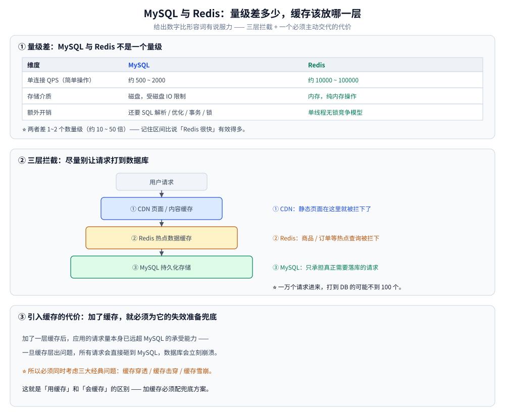
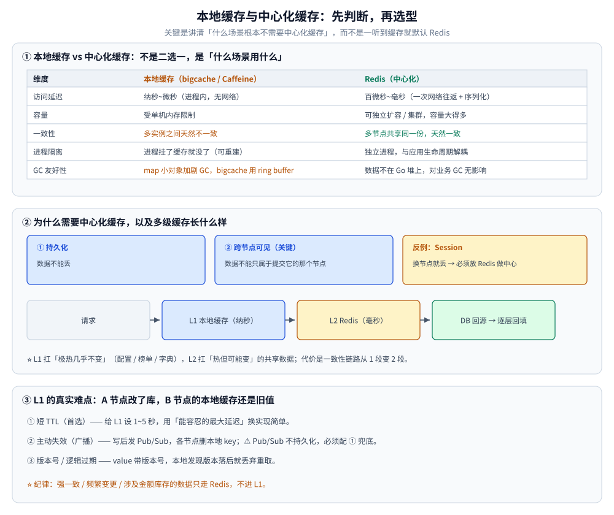
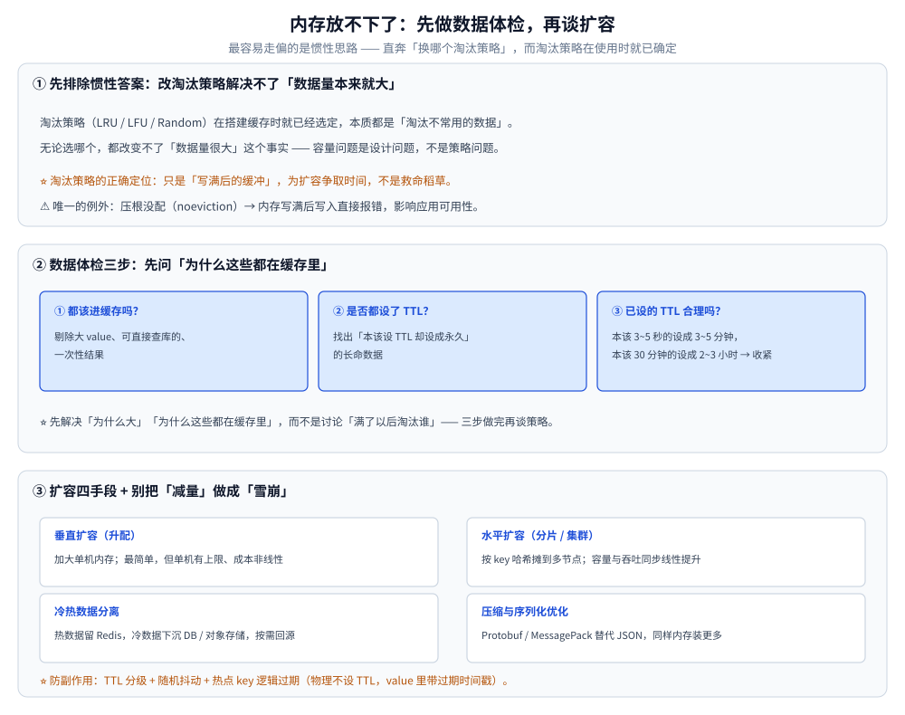

# 缓存选型对比

> 缓存这一层的横向选型：先确认「要不要上缓存、上到哪一层」（缓存与权威库的分工、量级差、三层拦截），
> 再把候选分成**本地缓存族**与**中心化缓存族**逐维对照，补上「契合语言与团队栈」与「同类产品怎么选」，
> 最后按**起点资产**给决策线，把**容量治理与多级一致性**收成一节，并给一次可信 POC 的做法。
>
> ⭐ 边界先说清 —— 本篇只回答「**缓存这一层怎么选**」：缓存三大问题（穿透 / 击穿 / 雪崩）见
> [缓存问题与方案.md](缓存问题与方案.md)、淘汰算法见 [缓存淘汰算法.md](缓存淘汰算法.md)、
> 一致性方案见 [缓存一致性.md](缓存一致性.md)、多级架构见 [缓存架构与模式.md](缓存架构与模式.md)；
> 「缓存层在七类存储里的位置」见 [存储选型.md](../存储选型.md)；
> 「Redis 作为 KV 族怎么选（Valkey / Memcached / 多线程实现）」见 [NoSQL选型对比.md](../NoSQL/NoSQL选型对比.md) 第三节。
>
> 内容整理自个人学习笔记，并参考《Redis 设计与实现》（黄健宏）的对应章节；参考资料与原始素材见 [素材清单](../../../素材清单.md)。
>
> ⚠️ 实测口径：本仓对 **Redis 7.4.11 / 8.10.2 容器**做过实测（容量、编码、持久化、并发、`KEYS` 阻塞），
> 涉及数字处均标注出处；**本地缓存库（bigcache / freecache / go-cache / Caffeine）与 Memcached 一律未实测**，
> 只写「机制 + 取舍」，⭐ **不引用任何第三方跑分充当结论**。

---

## 一、先确认这是不是「缓存负载」？

**本节要点**：缓存不是默认项。先问三件事 —— **数据能不能丢、读是不是瓶颈、这一层的失效代价谁背**；判错了，后面每一维都在将就。

### 1.1 缓存与权威库的分工

**本节要点**：关键不是罗列特性，而是能不能根据业务场景决定用哪个 —— 分水岭在「你懂不懂各自的取舍」。

| 维度 | **MySQL（权威库）** | **Redis（缓存）** |
|---|---|---|
| **数据模型** | **关系型**数据库，表结构，有主外键关系 | **非关系型**，**键值对（KV）**模型 |
| **存储介质与性能** | **磁盘存储**，读写性能**受磁盘 IO 限制**，相对较慢 | **内存数据库**，读写**非常快** |
| **持久化** | **数据必须落盘**，持久化是核心职责 | **持久化是可选项**。通常作缓存用，**数据可丢，一般不需要考虑持久化** |
| **事务与一致性** | **完整 ACID 事务**：支持原子性、多种隔离级别、支持回滚，依赖 **redo log 强化持久性** | **事务不完整**：只有「命令打包顺序执行」。<br>执行**前**发生的错误可以整体不执行（放弃）；<br>执行**后**中途出错**没有回滚** |
| **适用场景** | **结构化数据的持久化**；支持**复杂查询**与**事务处理** | **高并发读写、缓存、实时数据处理** |

> ⚠️ **Redis 事务的准确表述**：`MULTI`/`EXEC` 只是把命令**排队后一次性顺序执行**，
> **不具备回滚能力**。入队时就报错的命令会导致整个事务被放弃（`EXECABORT`）；
> 但如果是运行时（执行中）报错（比如对字符串执行 `INCR`），**其他命令照样执行，不会有任何回滚**。
> 这是与 MySQL 事务最本质的差别。

**场景举例（这样答才算「会用」）**：

| 数据 | 放哪 | 理由 |
|---|---|---|
| 用户 ID、密码、注册时间等**结构化信息** | **MySQL** | 这是**持久化**过程，数据不能丢 |
| **会话信息、登录状态、token** | **Redis** | **登录状态检查极其频繁**，需要 Redis 的高并发读写与实时处理能力 |
| **订单**（电商秒杀） | 最终**落库到 MySQL** | 涉及钱和交易，必须持久化、必须强一致 |
| **库存扣减、分布式锁** | **Redis** | 秒杀瞬间**高并发**，Redis 内存操作能扛住，且能实现原子扣减与互斥 |

> **判断逻辑**：**数据能不能丢 → 能不能接受最终一致 → 访问频率高不高**。
> 丢不得、要强一致的落 MySQL；高频读写、能容忍短暂不一致的放 Redis。

### 1.2 三条准入判据

| # | 判据 | 成立时的表现 | 不成立时该怎么办 |
|---|---|---|---|
| ① | **数据可丢 / 可重建** | 缓存里放的是**派生数据**（会话、热点、聚合结果），权威源随时能重建 | 数据不可丢 → 它该待在权威库，别用缓存兜正确性 |
| ② | **读是瓶颈**，且同一条数据被反复读 | 读远多于写，热点集中，命中率有得赚 | 读不是瓶颈 → 先查索引与 SQL，别先加缓存 |
| ③ | **能接受最终一致** | 允许读到旧值，失效窗口按「秒级延迟」定 | 要求强一致 → 缓存只做旁路，写路径不依赖它 |

### 1.3 ⚠️ 引入缓存的代价（必须主动说）

> **加了一层缓存后，应用的请求量本身已经远超 MySQL 的承受能力** ——
> 一旦**缓存层出问题**，所有请求会**直接砸到 MySQL**，**MySQL 会立刻崩溃**。
>
> 所以**必须同时考虑缓存三大经典问题**：**缓存穿透、缓存击穿、缓存雪崩**。
> （详见 [缓存问题与方案.md](缓存问题与方案.md)）

**这就是「用缓存」和「会缓存」的区别**：**加了缓存就必须为缓存失效准备兜底方案。**

---

## 二、选型前必须先量化的五个数？

**本节要点**：五个数先定下来，「要不要上、上到哪一层」会自动有答案；空谈「Redis 很快」没有说服力，**给出数字比形容词有效得多**。

### 2.1 五个输入

| # | 量什么 | 怎么量 | 它决定什么 |
|---|---|---|---|
| ① | **数据可丢性与重建成本** | 这份数据是从哪张表 / 哪个接口派生出来的 | 决定它能不能进缓存，以及允许丢多少 |
| ② | **读放大倍数** | 同一份数据平均被读几次、写几次 | 决定缓存值不值得（读放大越低越不值得） |
| ③ | **热集大小与增速** | 日增量、总量、访问热集占比；再明确**放内存还是放磁盘** | 内存型按 2.4 的成本模型折算；决定要不要分片 |
| ④ | **可接受的陈旧窗口** | 秒级 / 分钟级 / 不许旧 | 决定 TTL、失效广播还是短 TTL 兜底（第九节） |
| ⑤ | **失效时的承接能力**（RTO / 兜底） | 缓存全挂时，权威库能扛几成流量 | ⭐ 决定「要不要上」以及「是不是必须先扩容权威库」 |

### 2.2 为什么要缓存：先给量级数字

| | **MySQL** | **Redis** |
|---|---|---|
| **单连接 QPS（简单查询 / 操作）** | **约 500 ~ 2000** | **约 10000 ~ 100000** |

> **两者不是一个量级** —— 差了 **1~2 个数量级**（约 10 倍到 50 倍）。
> **记住这两个数字区间，比说「Redis 很快」有效得多。**

**为什么量级差这么多**：

- **MySQL** 是**磁盘存储**，受**磁盘 IO** 限制，还要做 SQL 解析、优化、事务、锁等；
- **Redis** 是**内存数据库**，纯内存操作 + 单线程无锁竞争模型。

### 2.3 正确架构：三层拦截，尽量别让请求打到数据库

```text
用户请求
   ↓
① CDN（页面/内容缓存）      ← 静态页面在这里就被拦下了
   ↓
② Redis（热点数据缓存）      ← 大部分动态查询在这里被拦下
   ↓
③ MySQL（持久化存储）        ← 只有真正需要落库的请求才到这里
```

**① CDN 层**：如果有一万并发请求同一个页面，**这一秒内请求到的页面内容是一样的**，那就**不需要走到后台**。

**② Redis 层（用「购物」举例）**：买一个东西，**查询请求可能发生上百次**（货比三家、挑型号），但**最终下单请求只有一次** ——
商品、订单这类数据是典型热点，查询需求远大于写入需求，放进 Redis 后**大量查询被拦截**，只有数据真正变化、订单真正成交时才落库。

**③ MySQL 层**：承担**结构化数据的持久化**。

**量化收益**：一万个请求进来，**最后打到 DB 的可能不到 100 个** —— 同样的数据库配置能承担更多并发。

**为什么必须这么设计**：**数据库本身并不方便扩展**，思路是**尽可能让相同的配置达到更高的并发** ——
加大量的缓存，甚至再加消息队列。（很多 MySQL 相关的「高可用」，本质上是在用架构手段弥补单机扩展性的不足。）



### 2.4 ⚠️ 内存那一栏：按「对象开销 + 编码」算

**本节要点**：内存型实例的账单由**编码**决定，业务字段大小只是分子里最小的一项。

```text
【本仓实测 · Redis 7.4.11 容器】同一批数据换一种编码，每元素字节数
  Set 512 个整数      intset      1336 B    （  2.6 B/元素）
  Set 512 个短字符串  hashtable  24688 B    （ 48.2 B/元素）
  ZSet 128 个成员     listpack    1080 B    （  8.4 B/元素）
  ZSet 512 个成员     skiplist   41760 B    （ 92.8 B/元素）
```

两点直接进容量模型（编码侧出处见 [底层结构.md](../NoSQL/Redis/底层结构.md)）：

1. **同一份业务数据，每元素 2.6 B 与 92.8 B 都合法** —— 差别在编码不在数据；元素数跨过阈值还会一次性翻十几倍。
   ⚠️ 且转换是**单向**的：删回阈值以下也不退回紧凑编码，「曾经超阈值」会永久留在内存账上。
2. **要按峰值算而不是按稳态算**：`BGSAVE` 与 AOF 重写都要 `fork`，写压力下 COW 能把内存推高一半
   （本仓实测 20 万 key ≈ 29 MB 的实例，快照期间峰值比稳态高 **54%**），大实例足以触发 swap 甚至 OOM。

> 五个数各自会砍掉哪些候选，⚠️ 只有用**自己的负载**跑出来的砍法才算数（验证做法见 `## 使用`；按起点资产的决策线见第七节）。

---

## 三、候选可以分成哪两族？

**本节要点**：分界线是**数据归谁、跨不跨进程** —— 不是「快不快」。两族的取舍完全不同：一族省网络、一族省一致性成本。

### 3.1 本地缓存族：进程内

- **解决什么**：把「极热、几乎不变」的数据放进**进程内内存**，用零网络往返把延迟压到纳秒级。
- **放弃了什么**：多实例之间**天然不一致**；容量受**单机内存**限制；进程重启即失效。
- **代表**：`bigcache` / `freecache` / `go-cache`（Go）、Caffeine（Java）、`ristretto` 一类。

### 3.2 中心化缓存族：独立进程

- **解决什么**：**多节点共享同一份状态**，容量可独立扩容，生命周期与应用解耦。
- **放弃了什么**：一次网络往返 + 序列化；多一个要运维、要 HA、要观测的组件。
- **代表**：Redis（含 Valkey 分叉）、Memcached，以及 Dragonfly / KeyDB 一类多线程实现。

### 3.3 为什么要中心化缓存

典型结构：`客户端 → 负载均衡 → [应用节点1 | 应用节点2 | 应用节点3] → 中心化 DB / 中心化缓存`。

数据库要做成中心化，有**两个**理由，第二个常被忽略：

| 理由 | 说明 |
|---|---|
| **① 持久化** | 数据不能丢 |
| **② 跨节点可见（关键）** | 数据**不能只属于「提交它的那个节点」** —— 其他节点也必须能查到 |

**缓存其实也是一种数据库**，所以中心化缓存的理由完全相同：**多个节点需要共享同一份状态**。

**典型反例：Session**

> 分布式部署 + 负载均衡下，用户第一次请求落到节点 1，第二次落到节点 2，第三次落到节点 3。
> **Session 缓存在应用本地，换个节点登录态就丢了** → 必须放 Redis 做 **Session 中心**。

### 3.4 什么场景该用本地缓存

判断标准：**这份数据「每个节点各自加载出来的都一样」，且节点之间不需要感知它的变化。**

**最典型的就是配置中心**：

| 阶段 | 做法 |
|---|---|
| **统一管理** | 配置统一放在中心化存储（配置中心 / etcd 等） |
| **启动时拉取** | 应用启动时从中心**拉一次**配置 |
| **之后读本地** | 只要应用不重启，**配置相关读取全部走本地缓存** |
| **变更时** | 配置变更通常伴随**重启或热更新推送**，重新从中心加载 |

理由：**配置对每个应用节点内容相同、且几乎不变，节点之间无需交互「你的配置变成什么样了」** ——
既然不存在「节点间需要交互」这个问题，就**没理由每次都去中心化缓存读**。

---

## 四、同一组维度上怎么对照？

**本节要点**：两族拉平看；⚠️ 但有一列不能横向比（4.3）。

### 4.1 本地缓存 vs 中心化缓存

| 维度 | **本地缓存（bigcache / freecache / go-cache）** | **Redis（中心化缓存）** |
|---|---|---|
| **访问延迟** | 纳秒~微秒级（进程内内存，无网络） | 百微秒~毫秒级（一次网络往返 + 序列化） |
| **容量** | 受**单机内存**限制 | 可**独立扩容 / 集群**，容量大得多 |
| **一致性** | **多实例之间天然不一致** | 多节点共享同一份，**天然一致** |
| **进程隔离** | 进程挂了缓存就没了（**可重建**，通常无妨） | 独立进程，**与应用生命周期解耦** |
| **GC 友好性** | 取决于实现 —— `map[string]*T` 大量小对象会**加剧 GC 压力**；<br>**bigcache / freecache 用 ring buffer + 大块内存规避 GC** | 数据不在 Go 堆上，**对业务进程 GC 无影响** |
| **典型用途** | 配置、字典、几乎不变的小数据、极热 key | Session、共享状态、跨节点热数据 |

> **`go-cache` 与 `bigcache` / `freecache` 的差别**：前者的 value 是 `interface{}`，
> 会在堆上产生大量对象、**GC 压力大**，胜在支持任意类型 + 自带 TTL；
> 后者把 **key/value 序列化成字节塞进预分配的大块内存（ring buffer）**，
> **几乎不产生需要 GC 扫描的对象**，适合几十万~百万级缓存，
> 代价是**只支持 `[]byte`、需自行预估容量、bigcache 不支持单个 key 的 TTL**。



### 4.2 怎么读这张表

1. **先看「一致性」与「进程隔离」两列**：它们决定这一层能不能承载「跨节点共享」的语义 ——
   只要多节点要看到同一份，本地缓存就出局（或只能当 L1，见 9.6）。
2. **再看「容量」与「GC 友好性」**：⭐ 内存型实例的账要按 2.4 的编码模型折算，不能按业务字段大小估。
3. **最后看「典型用途」**：两族**不是二选一**，工程上最常见的是 L1 + L2（9.6）。

### 4.3 ⚠️ 性能这一列不能横向比

- 两族之间**更不可比**：进程内与网络往返的延迟本来就差几个量级，写成「本地缓存比 Redis 快」是**用错维度**而不是用错数字。
- 同一产品内部都能反转：本仓实测 Redis 单实例稳态 CPU 封顶约 **1 核**（0.66~0.96 核区间），
  而把 IO 线程开到 4 反而多烧约 0.9~1.7 个核、吞吐下降 **40%~44%**（口径见 [多核利用与部署方案.md](../NoSQL/Redis/多核利用与部署方案.md)）。
- 正确做法只有一个：**用自己的数据与访问组合做验证**（见 `## 使用`）。

---

## 五、同类产品怎么选？

**本节要点**：第三、四节按**族**分，这一节把每族里的**具体产品**排开 —— 同族内部选错产品同样要重来，而且这一步的判据比跨族更细（GC 模型、许可分叉、单机多核能力）。

### 5.1 本地缓存族

| 产品 | 一句话定位 | 优先选它 | 慎选 / 别选 |
|---|---|---|---|
| **go-cache** | `map[string]interface{}` + TTL | 小体量、要任意类型与 per-key TTL、要最快上手 | ⚠️ 几十万级以上的量：value 在堆上，**GC 压力大** |
| **bigcache** | 分片 + ring buffer，**规避 GC** | 几十万~百万级热点、希望缓存不参与 GC 扫描 | ⚠️ 只支持 `[]byte`、**不支持单 key TTL**、容量要预估 |
| **freecache** | 同上，另支持**近似 LRU 与容量上限** | 要在「不加剧 GC」的前提下控制淘汰 | ⚠️ 同上（`[]byte`、容量预估）；本仓**未实测** |
| **Caffeine（Java）** | JVM 侧事实标准 | Java 栈要 weigher + 统计 + per-key TTL | ⚠️ 与 Go 侧不同进程，只能各自维护 |
| **ristretto 一类** | 带准入与频率策略的 Go 缓存 | 想在 Go 侧要更高命中率与准入控制 | ⚠️ 生态与资料相对薄；本仓**未实测** |

> **族内判据**：先问「要不要 per-key TTL 与任意类型」—— 要 → `go-cache` / Caffeine；不要、只要极热大流量 → `bigcache` / `freecache`。
> ⚠️ 无论哪个，**没有容量上限的本地缓存就是内存泄漏**（见 9.8 第 4 条）。

### 5.2 中心化缓存族

| 产品 | 一句话定位 | 优先选它 | 慎选 / 别选 |
|---|---|---|---|
| **Redis** | 事实标准：服务端结构最全，客户端与托管最齐 | 需要集合运算 / 有序榜单 / 位图 / 流 / 分布式锁与 Lua；要生态与托管最多 | 部署与分发形态必须完全避开许可条款争议时 |
| **Valkey** | Redis 的基金会分叉，**协议与命令兼容** | 想留在宽松开源许可下、又要沿用既有协议与运维习惯 | ⚠️ 依赖的托管服务与部分客户端尚未跟随时；本仓**未实测** |
| **Memcached** | 纯 KV、**多线程**、无持久化 | 需求收敛成「纯大 value 缓存、只要取值、单机榨满多核」 | 需要持久化 / 服务端结构运算 / 集群与一致视图 |
| **Dragonfly / KeyDB 一类多线程实现** | 兼容 KV 族协议、**单机吃多核** | 单机要多核吞吐、又不想上集群 | ⚠️ 成熟度与生态较新；本仓**未实测**，不作性能结论 |

> **族内判据**：先问「跨节点共享的语义有多重」—— 只要取值共享 → Memcached 这类已够；
> 要结构运算、持久化与分布式锁 → 回到 Redis / 分叉的取舍（许可与兼容面见 [NoSQL选型对比.md](../NoSQL/NoSQL选型对比.md) 4.1）。
> ⭐ 把 Redis 当**唯一数据源**是一族里最危险的误用（见第八节）。

---

## 六、契合语言与团队栈？

**本节要点**：客户端成熟度决定「功能表上打了勾的能力，在你的主语言里有没有对应 API」—— 这是缓存这一层最容易低估的隐性成本。

| 语言 | 本地缓存族 | 中心化缓存族 |
|---|---|---|
| **Go** | ⭐ `bigcache` / `freecache` / `go-cache` 都是纯 Go，落盘即可用；取舍见 5.1 | ⭐ 官方托管的 `go-redis v9`（纯 Go）：Pipeline / Lua / 哨兵 / Cluster 全覆盖，连接池与 ctx 超时成熟 |
| **Java** | ⭐ Caffeine：weigher、`recordStats`、per-key TTL 一应俱全 | Jedis / Lettuce / RedisTemplate 三条路都有成熟连接池与哨兵 / 集群支持 |
| **PHP** | ⚠️ 没有进程内常驻缓存的好载体（请求级生命周期），**基本只在 FPM 单请求内复用** | ⭐ 两条路：`redis` 扩展（**要装编译期扩展**）或纯 PHP 客户端（易部署、功能子集） |

> ⭐ 三条结论：
> **① Go 团队**：两族都是「官方 / 纯 Go」，可以直接进候选；⚠️ 只有一点要记住 —— **L1 的 value 形态决定 GC 账**（`interface{}` vs `[]byte`）。
> **② Java 团队**：两族也都是主场，判据要退回一致性与运维面。
> **③ PHP / 多语言混合团队**：**本地缓存这一族基本不成立**（请求级生命周期），要用 L1 就得让 Go / Java 服务承担那一层；
> 中心化一族可用，但**先确认所需命令在你的客户端子集里**，并留意扩展与 PHP 大版本的绑定关系。

---

## 七、按「起点资产」怎么决策？

**本节要点**：选型不从空白开始，而从「你手里已经有什么」开始。多数情形的正解是**给现有库加一层**，不是引入新组件。

### 7.1 决策线 A：已经有权威库（MySQL 等），只是读得慢

| 状况 | 首选动作 |
|---|---|
| 只是个别查询慢 | ⭐ 先在库侧解决：索引与 SQL 重写（见 [查询优化.md](../关系型/MySQL/查询优化.md)），别先加缓存 |
| 读远多于写、热点集中 | 加中心化缓存（如需 L1，见 9.6），按 2.1 的五个数定容量 |
| 会话 / 登录态跨节点 | **必须**中心化（Session 中心），本地缓存解决不了（见 3.3） |
| 读放大很低（一份数据只读一两次） | ⚠️ 不值得上缓存：命中率赚不回来，只多了失效逻辑 |

### 7.2 决策线 B：已经在用 Redis

| 状况 | 首选动作 |
|---|---|
| 延迟要再压一档、数据几乎不变 | 加 L1 本地缓存（9.6），⚠️ 只在「能接受秒级不一致」的数据上做 |
| 内存逼近上限、开始出现淘汰 | 先做数据体检（9.2），再谈扩容（9.4） |
| 持久化开始承担业务正确性 | ⭐ **危险信号**：说明它在被当权威源用，应把这份数据挪回有完整事务与备份的存储 |
| 只是热点读太集中 | 先按容量与 TTL 分级（9.5）治理，别直接上集群 |

### 7.3 决策线 C：从零开始

按三问筛：**数据可丢吗**（不可丢 → 权威库，别用缓存兜）→ **读是瓶颈吗**（不是 → 先查索引）→ **要跨节点共享吗**（要 → 中心化；只是本机极热 → 本地缓存）。

### 7.4 判据速查

| 场景 | 首选 | 备选 | 通常不该选 |
|---|---|---|---|
| 会话 / 登录态 / 分布式锁 | 中心化缓存（Redis） | —— | 本地缓存（多实例不一致） |
| 配置、字典、几乎不变的小数据 | 本地缓存 | 中心化缓存 + 短 TTL | 每次请求回源读中心 |
| 商品 / 详情的极热读 | L1 + L2 多级 | 只上 L2 + 预聚合 | 无容量上限的 L1 |
| 计数、榜单、集合运算 | 中心化缓存（Redis） | —— | 本地缓存（跨节点不共享） |
| 读放大很低的一次性结果 | **不上缓存** | —— | 为「统一架构」硬加一层 |

---

## 八、哪些情况不该上缓存（或不该继续加）？

**本节要点**：加一层缓存多一套失效逻辑、多一个故障面，还多一个「缓存挂了谁来兜」的问题。先忍住，再按三项评退路。

### 8.1 四种「先别上」的情形

1. **数据不可丢 / 要强一致**：缓存的存在前提就是「可丢可重建」；把正确性寄托在缓存上，等于把故障面从一处扩到两处。
2. **读放大不够**：一份数据读一两次就过，缓存命中率赚不回来，只多了失效逻辑与一层网络跳。
3. **缓存全挂时权威库接不住**：⭐ 这是最容易被忽略的一条 —— 上缓存**之前**要先确认权威库能扛住「缓存全失效」那一瞬间（或先扩容 / 加兜底）。
4. **没有 owner**：没有人盯命中率、内存水位、失效正确性与扩容节奏的缓存层，迟早变成线上事故源。

### 8.2 退路按三项评

| 退路维度 | 好的表现 |
|---|---|
| **可重建性** | 缓存里全是**派生数据**：权威源在，随时可清空重灌（⭐ 最强的一条退路） |
| **降级开关** | 缓存层能被一键旁路，读路径自动回源且**不放大**（配合限流与单飞） |
| **失效可观测** | 命中率、`evicted_keys`、内存水位能上报，失效正确性有对账手段 |

> ⚠️ 三项全弱（数据不可重建 + 无降级开关 + 无观测）**等于没有退路**：这类缓存不是「优化」，是新的单点。

---

## 九、容量扛不住、多级怎么保一致？

**本节要点**：容量问题**不是策略问题**（9.1）；多级缓存的问题不是「选谁」而是「L1 的一致性怎么收敛」（9.6~9.8）。

### 9.1 先排除惯性答案：淘汰策略不是答案

> **淘汰策略（LRU / LFU / Random）在搭建缓存时就已经选定**，
> 它们的本质都是「淘汰不常用的数据」，只是规则有细微差别 —— **无论选哪个，都改变不了「数据量很大」这个事实**。
> 而且生产上**除了最初搭建，几乎不会去改淘汰策略**。

所以第一步**不是选策略，而是做数据体检**。

### 9.2 数据体检三步（先问三个问题）

| 序号 | 问题 | 对应处理 |
|---|---|---|
| **①** | **这些数据是不是都该进缓存？** 缓存的数据选型是否合理？ | 剔除**不该缓存**的数据（大 value、可直接查库的、一次性结果） |
| **②** | **这些数据是否都设置了过期时间？** | 找出「本该设 TTL 却没设」的长命数据，**补上合理有效期** |
| **③** | **已设 TTL 的数据，有效期是否合理？** | 本该存 3~5 秒的设成 3~5 分钟 → **收紧 TTL** |

> **这三步才是核心**：先解决「为什么大」「为什么这些都在缓存里」，而不是讨论「满了以后淘汰谁」。**容量问题是设计问题，不是策略问题。**

### 9.3 淘汰策略的正确定位：缓冲，不是救命稻草

**唯一的例外**：**压根没配淘汰策略**（`noeviction`）时，内存写满会导致**新数据写不进去**，进而**影响整个应用的可用性**。

| 目的 | 说明 |
|---|---|
| **该配淘汰策略** | 内存打满后能腾出空间，**保证后续写入成功、业务继续运行** |
| **配置它的目的** | **不是「用淘汰替代扩容」**，而是为扩容争取**一段缓冲时间** |
| **常见选择** | `allkeys-lru`（只看最近使用）或 `allkeys-lfu`（看访问频率，抗扫描污染） |

> ⚠️ 千万别答成「内存不够就靠淘汰策略解决」—— 那等于说「我不打算扩容」。

### 9.4 扩容与分片（真正解决容量）

| 手段 | 说明 |
|---|---|
| **垂直扩容（升配）** | 加大单机内存。最简单，但**单机内存有上限、成本非线性上升、故障域不变** |
| **水平扩容（分片/集群）** | Redis Cluster / 分片代理，**按 key 哈希把数据摊到多节点**，容量与吞吐同步线性提升 |
| **冷热数据分离** | 热数据留 Redis，**冷数据下沉到 DB / 对象存储**，需要时再加载回缓存（回源） |
| **数据压缩与序列化优化** | 用 **Protobuf / MessagePack 替代 JSON**、缩短 key 名、按场景拆小 value，<br>**同样的物理内存装更多业务数据** |

> 与「大 value 拆 key」呼应（见 [缓存问题与方案.md](缓存问题与方案.md)）：拆分不是为了省内存本身，
> 而是**让存储与传输的粒度匹配访问场景**。



### 9.5 TTL 分级与热点永不过期（别把「减量」做成「雪崩」）

**收紧 TTL 时最容易踩的坑**：一刀切缩短 TTL → **大量 key 同时过期 → 雪崩**（见 [缓存问题与方案.md](缓存问题与方案.md)）。

| 措施 | 做法 |
|---|---|
| **TTL 分级** | 按数据热度分档设有效期（秒级 / 分钟级 / 小时级 / 天级），**不要让所有数据类型共用一个 TTL** |
| **TTL 加随机抖动** | 同批写入的 key，过期时间在区间内取随机值，把失效点摊平 |
| **热点 key 永不过期 + 逻辑过期** | 物理上**不设 TTL（或设超长 TTL）**，value 中**携带逻辑过期时间戳**；<br>读到「逻辑已过期」→ **异步回源刷新 + 旧值兜底返回** |
| **主动删除 + 兜底刷新** | 确实无用的数据**主动 `DEL`**，而不是干等 TTL 到期 |

### 9.6 L1 + L2 多级缓存

既然两族不冲突，工程上常见的就是**多级缓存**：

```text
请求 → L1 本地缓存（进程内，纳秒级） → 未命中
     → L2 Redis（毫秒级）           → 未命中
     → DB（回源）→ 逐层回填
```

- **L1 承担「极热、几乎不变」的数据**（配置、榜单、字典），把最多请求挡在进程内；
- **L2 承担「热、可能变」的共享数据**，保证多节点看到一致结果。

**收益**：Redis 的 QPS 被 L1 挡掉一大截；**代价**：**一致性链路从 1 段变 2 段**（L1↔L2、L2↔DB）。

### 9.7 L1 的一致性怎么解决

本地缓存最大的问题：**A 节点收到写请求更新了 DB，B 节点的本地缓存还是旧值。**

| 手段 | 做法 | 适用 |
|---|---|---|
| **① 短 TTL（最省事）** | 给 L1 设很短的过期时间（如 1~5 秒），**用「能容忍的最大延迟」换实现简单** | 绝大多数场景，**首选** |
| **② 主动失效（广播）** | 写操作后**发布失效消息**（Redis Pub/Sub / 消息队列），所有节点收到后删掉本地 key | 变更不频繁、对一致性要求高 |
| **③ 版本号 / 逻辑过期** | value 里带版本号；本地缓存发现版本落后就丢弃重取 | 需要更强的正确性保证 |

> 注意 **② 与 [发布订阅.md](../NoSQL/Redis/发布订阅.md) 的 Pub/Sub 局限呼应**：Pub/Sub **不持久化**，
> 节点恰好在那一刻掉线就会漏掉失效消息 → **②必须配 ① 的短 TTL 兜底**，不能只靠广播。

### 9.8 「多实例本地缓存不一致」的工程处理

1. **能接受延迟就别做无谓的一致性**：L1 一律设短 TTL（1~5s），把不一致窗口**限制在秒级**；
2. **写路径不碰 L1**：**更新 DB → 删除 L2 → 广播删除各节点 L1**（先库后缓存，Cache Aside）；
3. **广播不可靠，TTL 兜底**：掉线节点靠 TTL 自然恢复正确性；
4. **明确哪些数据「根本不该进 L1」**：**强一致、频繁变更、涉及金额/库存的数据只走 Redis，不进本地缓存**；
5. **L1 必须有容量上限**：没有上限的本地缓存就是内存泄漏，用 LRU + 分片容量上限控制。

---

## 使用一：Go（L1 + L2 多级缓存）⭐

### 1. L1 + L2 多级缓存：bigcache 挡极热数据，Pub/Sub 广播失效（第九节）

```go
package multilayer

import (
	"context"
	"errors"
	"time"

	"github.com/allegro/bigcache/v3"
	"github.com/redis/go-redis/v9"
)

const invalidChannel = "cache:invalidate"

type MultiLevel struct {
	l1  *bigcache.BigCache
	c   *redis.Client // 复用 [缓存问题与方案.md](缓存问题与方案.md) 使用一的「前置：中间件实例必须是单例」，不在这里再 new 一个
	ttl time.Duration
}

// New 只在进程启动时调用一次，把返回值保存为单例；bigcache 与订阅协程都是有状态的。
func New(c *redis.Client, ttl time.Duration) (*MultiLevel, error) {
	l1, err := bigcache.NewBigCache(bigcache.Config{
		Shards:             256,             // 分片数，必须是 2 的幂，降低锁竞争
		LifeWindow:         3 * time.Second, // ⚠️ L1 一律短 TTL：不一致窗口控制在秒级（9.7）
		CleanWindow:        1 * time.Second, // 后台清理频率，小于 1s 反而浪费 CPU
		MaxEntriesInWindow: 1000 * 10,       // 仅用于估算 shard 初始容量
		MaxEntrySize:       500,             // 单条平均字节数，同样只参与初始容量估算
		HardMaxCacheSize:   512,             // ⚠️ 单位 MB，默认 0 = 无上限；不设上限的本地缓存就是内存泄漏（9.8）
		Verbose:            false,
	})
	if err != nil {
		return nil, err
	}
	return &MultiLevel{l1: l1, c: c, ttl: ttl}, nil
}

func (m *MultiLevel) Get(ctx context.Context, key string, loader func(context.Context) ([]byte, error)) ([]byte, error) {
	if v, err := m.l1.Get(key); err == nil {
		return v, nil // L1 命中：进程内，无网络往返
	}
	v, err := m.c.Get(ctx, key).Bytes()
	if errors.Is(err, redis.Nil) { // 只有"key 确实不存在"才回源
		v, err = loader(ctx)
		if err != nil {
			return nil, err
		}
		if serr := m.c.Set(ctx, key, v, m.ttl).Err(); serr != nil {
			return nil, serr
		}
	} else if err != nil {
		return nil, err // ⚠️ Redis 故障不能当未命中：否则缓存一挂，全量流量直接砸到 DB（第八节）
	}
	if serr := m.l1.Set(key, v); serr != nil { // bigcache 只支持 []byte，本层不需要序列化
		return nil, serr
	}
	return v, nil
}

// Invalid 是写路径：更新 DB 之后调用，删 L2 并广播删各节点 L1（Cache Aside，先库后缓存）。
func (m *MultiLevel) Invalid(ctx context.Context, key string) error {
	if err := m.c.Del(ctx, key).Err(); err != nil {
		return err
	}
	return m.c.Publish(ctx, invalidChannel, key).Err()
}

// SubscribeInvalidate 每个进程只跑一个协程（与 New 一样是启动期的一次性动作，别按请求起）。
// ⚠️ Pub/Sub 不持久化，掉线期间的消息会永久丢失，所以必须有上面的 3s 短 TTL 兜底（9.7）。
func (m *MultiLevel) SubscribeInvalidate(ctx context.Context) {
	sub := m.c.Subscribe(ctx, invalidChannel)
	ch := sub.Channel()
	for {
		select {
		case <-ctx.Done():
			return
		case msg := <-ch:
			_ = m.l1.Delete(msg.Payload)
		}
	}
}
```

**bigcache 的取舍**（对应 4.1 的对比表）：只支持 `[]byte`、容量要预估、单个 key 不能设独立 TTL（只有全局 `LifeWindow`）。需要 per-key TTL 或任意类型时用 `freecache`，或直接用 `github.com/hashicorp/golang-lru/v2/expirable`（支持泛型 + 单 key TTL，但 value 在堆上，量大会加剧 GC）。

## 使用二：Java（Caffeine 作 L1）

### 1. 本地缓存 Caffeine 作 L1 + 广播失效（第九节）

```java
@Configuration
public class L1CacheConfig {

    @Bean
    public Cache<String, byte[]> l1Cache() {
        return Caffeine.newBuilder()
                .maximumWeight(256L * 1024 * 1024)        // 容量上限按字节，必须有；无上限的本地缓存就是内存泄漏
                .weigher((String k, byte[] v) -> v.length)
                .expireAfterWrite(Duration.ofSeconds(3))  // 短 TTL 兜住广播丢失（9.7）
                .recordStats()                            // 打开统计，命中率要能上报监控
                .build();
    }
}
```

写路径：更新 DB → 删 Redis → 发布失效消息。

```java
@Service
public class CacheEvictService {

    private final StringRedisTemplate redis;

    public CacheEvictService(StringRedisTemplate redis) {
        this.redis = redis;
    }

    public void evict(String key) {
        redis.delete("goods:" + key);
        redis.convertAndSend("cache:invalidate", key); // 每个实例（含自己）订阅后删各自的 L1
    }
}
```

收路径要注意：**Spring Data Redis 并没有 `@RedisListener` 这种注解**，订阅要显式注册一个 `RedisMessageListenerContainer`，这也是「忘了注册容器 → 广播发了但没人收 → L1 脏读」的常见根因。

```java
@Configuration
public class CacheInvalidateConfig {

    @Bean
    public RedisMessageListenerContainer invalidateContainer(RedisConnectionFactory cf,
                                                            Cache<String, byte[]> l1) {
        RedisMessageListenerContainer container = new RedisMessageListenerContainer();
        container.setConnectionFactory(cf);
        container.addMessageListener(
                (msg, pattern) -> l1.invalidate(new String(msg.getBody(), StandardCharsets.UTF_8)),
                new PatternTopic("cache:invalidate")); // 只订这一个频道，别用 PatternTopic("*")
        return container;
    }
}
```

**强一致、频繁变更、涉及金额/库存的数据只走 Redis，不进 L1** —— 这条是 9.8 的落点，代码上体现为「哪些 key 前缀允许配进 L1」的白名单，而不是所有读都走多级缓存。

---

## 延伸追问

- **Redis 挂了数据不就丢了？** → 所以 Redis 只放**可重建**的数据（缓存、会话），
  真正的数据源始终是 MySQL；必要时开启 AOF/RDB 持久化提高抗风险能力。
- **为什么不用 MySQL 加内存缓存代替 Redis？** → MySQL 的 Buffer Pool 是**页级缓存**，
  无法按业务 key 做精细的过期/淘汰策略，也无法跨进程共享。
- **为什么不用 Nginx 或 MySQL 的 Buffer Pool 当本地缓存？** → 前者是 HTTP 层缓存，
  无法按业务 key 精细失效；后者是**页级缓存**，**不按业务 key 管理、也无法跨进程共享**（见 1.1）。
- **缓存与数据库的一致性怎么保证？** → Cache Aside（先更新库再删缓存）、
  延时双删、binlog 订阅（Canal）异步刷新等。（详见 [缓存问题与方案.md](缓存问题与方案.md)）
- **bigcache / freecache 为什么不加剧 GC？** → 数据存进**预分配的大块 `[]byte`**，
  Go 堆上只有这块大对象，**GC 需要扫描的对象数骤减**。
- **本地缓存要不要设淘汰？** → 要。**没有容量上限的本地缓存就是内存泄漏**，
  用 LRU + 分片容量上限控制（可参考 [缓存淘汰算法.md](缓存淘汰算法.md) 的策略选择）。
- **L1 命中率和一致性怎么权衡？** → TTL 越长命中率越高、不一致窗口越大；
  按业务的容忍延迟取，**一般以秒级为主**。
- **改淘汰策略能解决容量问题吗？** → **不能**。它只决定「满了淘汰谁」，
  **要腾出的是空间，不是换策略**；容量问题只有「少存」和「扩容」两条路。
- **为什么优先做压缩/序列化而不是直接扩容？** → **扩容有成本上限**，
  而值压缩是**一次改造、长期省内存**（Protobuf 相比 JSON 常省 30%~60%）。
- **`noeviction` 有什么风险？** → 内存满后**写命令直接报错**；
  如果业务把 Redis 当存储用，会**直接表现为写入失败、应用报错**。
- **冷热分离后，冷数据回源延迟怎么控？** → 回源走异步 + 缓存预热（访问过的冷数据回填），
  并用 9.6 的 **L1 本地缓存**兜住回源瞬间的并发。

---

## 关联

- [缓存架构与模式.md](缓存架构与模式.md) — Cache Aside / 读写穿透 / 写回三类模式的落点
- [缓存一致性.md](缓存一致性.md) — 一致性方案与失效顺序
- [缓存问题与方案.md](缓存问题与方案.md) — 穿透 / 击穿 / 雪崩的成因与解法
- [缓存淘汰算法.md](缓存淘汰算法.md) — 触顶后究竟淘汰谁（本地缓存侧）
- [淘汰策略.md](../NoSQL/Redis/淘汰策略.md) — Redis 侧内存触顶后的淘汰策略选择
- [缓存应用场景.md](缓存应用场景.md) — 缓存落到具体业务形态上的用法
- [缓存运维与排查.md](缓存运维与排查.md) — 命中率、`evicted_keys`、慢命令与内存水位的观测
- [README.md](README.md) — 本目录导读
- [底层结构.md](../NoSQL/Redis/底层结构.md) — 编码与每元素字节数的机制出处（2.4 的读数来源）
- [持久化.md](../NoSQL/Redis/持久化.md) — `fork` + COW 的量化与三种 fsync 档位
- [多核利用与部署方案.md](../NoSQL/Redis/多核利用与部署方案.md) — 单线程封顶与单机多实例 / Cluster 的取舍
- [发布订阅.md](../NoSQL/Redis/发布订阅.md) — L1 失效广播的实现与其不持久化的局限
- [分布式锁.md](../NoSQL/Redis/分布式锁.md) — 中心化缓存的另一类用途
- [NoSQL选型对比.md](../NoSQL/NoSQL选型对比.md) — Redis 作为 KV 族的族内横评（Valkey / Memcached / 多线程实现）
- [查询优化.md](../关系型/MySQL/查询优化.md) — 回源那一跳的优化
- [存储选型.md](../存储选型.md) — 缓存层在七类存储里的位置
- [位图与布隆过滤器.md](../../../02-计算机基础/数据结构/高级数据结构/位图与布隆过滤器.md) — 位图与布隆过滤器的内存量级对比（容量估算的极端解）
- [商品详情页设计.md](../../../04-架构与系统/系统设计/秒杀系统/商品详情页设计.md) — 多级缓存在真实读链路里的**收益与代价**（L1 把 Redis 访问降 33 倍；TTL 四档对应的陈旧窗口 0 / 199 / 999 / 3954 ms）
> 反向引用（本篇被下列文档引到）：[索引原理.md](../NoSQL/MongoDB/索引原理.md)、[部署与运维.md](../NoSQL/Redis/部署与运维.md)、[关系型选型对比.md](../关系型/关系型选型对比.md)、[列式数据库选型对比.md](../列式数据库/列式数据库选型对比.md)、[时序数据库选型对比.md](../时序数据库/时序数据库选型对比.md)
