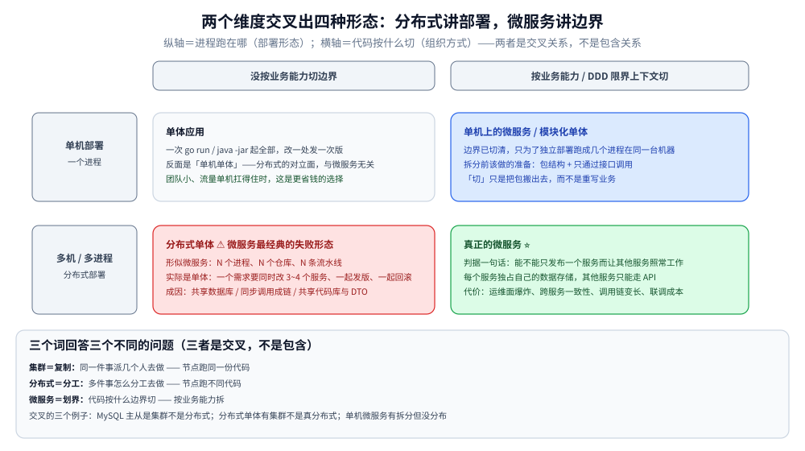
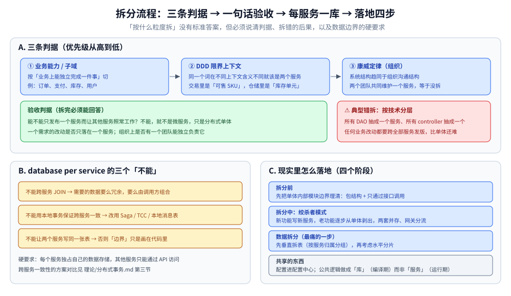
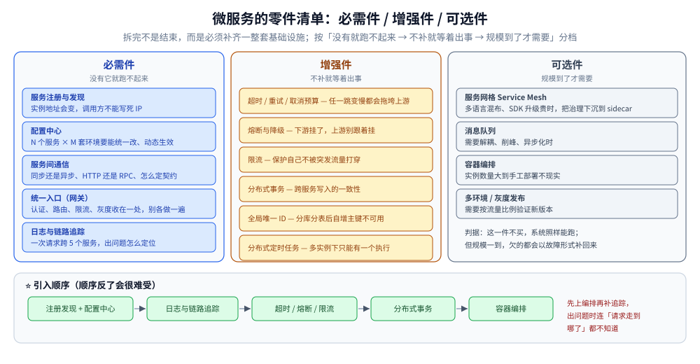
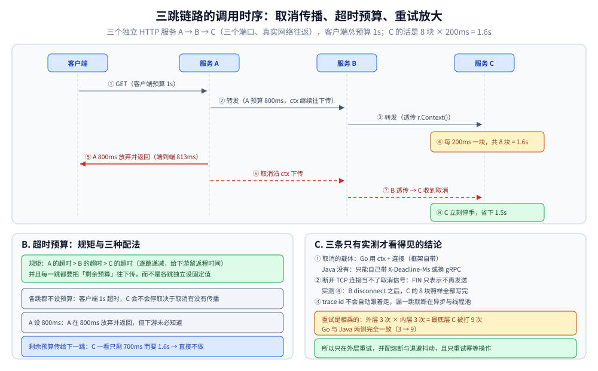

# 分布式与微服务

> 分布式是**部署形态**、微服务是**边界划分方式**：两者的区别、微服务该按什么拆、零件清单（把本仓已有专篇串起来）、
> Go 与 Java 两套技术栈的逐项对照，以及一条真实 A→B→C 三跳链路上的三组实测。
>
> 内容整理自个人学习笔记，参考资料与原始素材见 [素材清单](../../素材清单.md)。

---

## 一、分布式和微服务到底是不是一回事？

**本节要点**：这两个词经常被当同义词用。关键在于**能不能把"部署形态"和"组织边界"这两件事分开**，
以及**为什么微服务不是必然选择**。

### 1.1 一句话区分

| 维度 | 分布式 | 微服务 |
|---|---|---|
| 回答的问题 | **进程跑在哪**：一个系统分布在多台机器/多个进程上 | **代码按什么边界切**：按业务能力切成一组可独立部署的小服务 |
| 属于 | 部署与运行形态 | 架构与组织方式 |
| 反面 | 单机单体 | 单体应用也可以部署成分布式（集群） |
| 必要性 | 单机扛不住时**必然**出现 | **不是必然**——单机 + 模块化能撑住就不该上 |

> ⭐ 关系是**交叉**而不是包含：**分布式单体**（把单体部署成多实例）与**单机上的微服务**
> （几个进程跑在同一台机器上，只为了独立部署）都真实存在。所以两个词不能互相替换。



### 1.2 四组最容易混的概念

| 对比 | 区别 |
|---|---|
| **分布式 vs 集群** | 集群是**同一个服务**的多副本（为容量与可用）；分布式是**不同服务**的协作（为拆分）。集群里的节点跑同一份代码，分布式里的节点跑不同代码 |
| **分布式 vs 微服务** | 见上表：前者是"不得不分"，后者是"主动切" |
| **SOA vs 微服务** | SOA 常带 ESB（企业服务总线）做集中式编排与协议转换，粒度粗、共享总线；微服务去中心化、服务直连、粒度细、**每个服务自己管数据** |
| **微服务 vs 容器** | 容器只是**打包与部署**手段。用容器跑一个单体，它还是单体；不用容器也能做微服务（问题在于"每个服务独立部署"这件事是否成立） |

### 1.3 微服务的收益与代价是一体两面

| 想要的收益 | 顺带背上的代价 |
|---|---|
| 独立部署、独立扩容 | **运维面爆炸**：部署、监控、日志、配置的对象从 1 个变成 N 个 |
| 边界清晰、团队自治（康威定律） | **跨服务的一致性**只能靠分布式事务 / 最终一致 |
| 技术栈自由、故障隔离 | **调用链变长**：超时、重试、雪崩都要自己管（见第六节实测） |
| 按需伸缩热点服务 | **本地开发与联调**成本飙升（起不全一整套依赖） |

> ⭐ 正确的姿态：**先问"为什么非拆不可"**。
> 团队规模小、流量单机扛得住、领域边界还没摸清时，**单体 + 模块化（清晰的包边界）** 是更省钱的选择；
> 等到"一个模块的改动要和其他模块同步发版"成为日常痛点，拆分的收益才开始超过成本。

---

## 二、微服务该按什么拆？

**本节要点**：这是微服务的**真问题**。"按什么粒度拆"没有标准答案，但必须说清**判据**和**拆错的后果**。

### 2.1 三条判据，优先级从高到低

| 判据 | 说明 | 例子 |
|---|---|---|
| **业务能力 / 子域** | 按"业务上能独立完成一件事"切，而不是按技术分层切 | 订单、支付、库存、用户 —— 而不是 controller 服务、service 服务 |
| **DDD 限界上下文** | 同一个词在不同上下文里含义不同，那就该是两个服务 | 商品在"交易上下文"里是"可售 SKU"，在"仓储上下文"里是"库存单元" |
| **康威定律（组织）** | 系统结构会趋同于组织沟通结构 —— 拆分的粒度上限受团队结构约束 | 两个团队共同维护一个服务，等于没拆 |

⚠️ **按技术分层拆是典型的错拆**：把所有 DAO 抽成一个服务、所有 controller 抽成一个服务 ——
结果任何一次业务改动都要跨全部服务发版，比单体还难。

### 2.2 拆细了会怎样：分布式单体

**分布式单体**（distributed monolith）是微服务最经典的失败形态：

```text
形似微服务：N 个进程、N 个仓库、N 条流水线
实际是单体：任何一个需求都要同时改 3~4 个服务、必须一起发版、只能一起回滚
```

成因通常是三条：**① 共享数据库**（几个服务读写同一批表，schema 一改全崩）；
**② 同步调用成链**（A 必须同步等 B、B 等 C，可用性相乘——见 5.1）；
**③ 共享代码库/共享 DTO**（一个字段改动要求所有服务同步升级）。

> 判据一句话：**能不能只发布一个服务而让其他服务照常工作？** 不能，就不是微服务。

### 2.3 每个服务一个库（database per service）

微服务对数据的硬要求：**每个服务独占自己的数据存储，其他服务只能通过 API 访问**。
这一条的推论是三个"不能"：

- **不能跨服务 JOIN** —— 需要的数据要么冗余、要么由调用方组合（见 [数据建模.md](../../03-数据与中间件/数据存储/关系型/MySQL/数据建模.md)）；
- **不能用本地事务保证跨服务一致** —— 改用 **Saga / TCC / 本地消息表**（见 [分布式事务.md](理论/分布式事务.md)）；
- **不能让两个服务写同一张表** —— 否则"边界"只是画在代码里。

### 2.4 现实里怎么落地

| 阶段 | 做法 |
|---|---|
| **拆分前** | 先把单体内部的**模块边界**理清（包结构 + 只通过接口调用），让"切"只是把包搬出去 |
| **拆分中** | **绞杀者模式**：新功能写成新服务，老功能逐步从单体里剥出来；期间两套并存，通过网关分流 |
| **数据拆分** | 最痛的一步：先**垂直拆表**（按服务归属分组），再考虑**水平分片**（见 [分表与路由.md](../../03-数据与中间件/数据存储/关系型/MySQL/分表与路由.md)） |
| **共享的东西** | 配置进配置中心、公共逻辑做成**库**（编译期）而不是**服务**（运行期）——能不变调用就别变调用 |



---

## 三、微服务的零件清单（把已有专篇串起来）

**本节要点**：微服务不是"拆完就完"，而是**拆完之后必须补齐的一整套基础设施**。
按"必需/增强/可选"给零件分层，才谈得上落地。

### 3.1 必需件：没有它就跑不起来

| 能力 | 解决什么 | 本仓专篇 |
|---|---|---|
| **服务注册与发现** | 实例地址会变（扩缩容、滚动发布），调用方不能写死 IP | [服务发现与负载均衡.md](服务治理/服务发现与负载均衡.md)、[服务注册与发现的Go实现.md](服务治理/服务注册与发现的Go实现.md)、[服务发现的Java实现.md](服务治理/服务发现的Java实现.md) |
| **配置中心** | N 个服务 × M 套环境的配置要能统一改、动态生效 | [Nacos.md](../../03-数据与中间件/中间件/注册与配置中心/Nacos.md) |
| **服务间通信** | 选同步还是异步、选 HTTP 还是 RPC、怎么定契约 | [通信选型.md](../../02-计算机基础/网络/通信选型.md)、[HTTP与gRPC.md](../../02-计算机基础/网络/HTTP与gRPC.md)、[数据序列化.md](../../02-计算机基础/网络/数据序列化.md) |
| **统一入口（网关）** | 认证、路由、限流、灰度收在一处，别让每个服务各做一遍 | [中间件选型.md](../../03-数据与中间件/中间件/中间件选型.md) 第四节 |
| **日志与链路追踪** | 一次请求跨了 5 个服务，出问题怎么定位 | [Skywalking.md](../../06-工程实践/可观测性/Skywalking.md)、[Jaeger.md](../../06-工程实践/可观测性/Jaeger.md)、[可观测性选型.md](../../06-工程实践/可观测性/可观测性选型.md) |

### 3.2 增强件：不补就等着出事

| 能力 | 解决什么 | 本仓专篇 |
|---|---|---|
| **超时 / 重试 / 取消预算** | 调用链上任一跳变慢都会拖垮上游（第六节实测） | 本篇 5.1、[稳定性三件套.md](服务治理/稳定性三件套.md) |
| **熔断与降级** | 下游挂了，上游别跟着挂 | [稳定性三件套.md](服务治理/稳定性三件套.md) |
| **限流** | 保护自己不被突发流量打穿 | [限流算法.md](服务治理/限流算法.md)、[限流器.md](../../01-编程语言/go/并发编程/限流器.md) |
| **分布式事务 / 最终一致** | 跨服务写入的一致性 | [分布式事务.md](理论/分布式事务.md) |
| **全局唯一 ID** | 分库分表后自增主键不再可用 | [分布式ID.md](理论/分布式ID.md) |
| **分布式定时任务** | 定时任务在多实例下只能有一个执行 | [xxl-job.md](../../03-数据与中间件/中间件/任务调度/xxl-job.md) |

### 3.3 可选件：规模到了才需要

| 能力 | 什么时候需要 |
|---|---|
| **服务网格（Service Mesh）** | 多语言混布、SDK 升级成本高于运维成本时（把治理下沉到 sidecar） |
| **消息队列** | 需要解耦、削峰、异步化（见 [消息队列选型.md](../../03-数据与中间件/中间件/消息队列/消息队列选型.md)） |
| **容器编排** | 实例数量大到手工部署不现实（见 [容器与编排选型.md](../../06-工程实践/部署/容器与编排选型.md)） |
| **多环境/灰度发布** | 需要按流量比例验证新版本（见 [CI-CD面试题.md](../../06-工程实践/部署/CI-CD面试题.md)） |

> ⭐ **引入顺序建议**：注册发现 + 配置中心 → 日志与追踪 → 超时/熔断/限流 → 分布式事务 → 编排。
> 顺序反了会很难受：比如先上编排再补追踪，出问题时连"请求走到哪了"都不知道。



---

## 四、Go 与 Java 的技术栈对照

**本节要点**：跨语言团队绕不开"为什么用 Go / 为什么用 Java"。说清**生态差异带来的思维方式差异**，
比背组件名有用得多。

### 4.1 逐项对照

| 能力 | Go 生态                                    | Java 生态 |
|---|------------------------------------------|---|
| 微服务框架 | **Kratos**、go-zero、Kitex、Dubbogo         | Spring Boot + **Spring Cloud Alibaba**、Dubbo 3 |
| RPC / 契约 | **gRPC（proto 契约优先）**，代码由 proto 生成        | Dubbo 3 / Spring Cloud OpenFeign（注解声明） |
| 注册与发现 | etcd / Consul / Nacos（Kratos contrib）    | Nacos Discovery、Eureka（已停止演进） |
| 配置中心 | Nacos、Apollo（`viper` 接入）                 | Nacos Config、Apollo |
| 网关 | APISIX、Traefik、Kratos 自带 http            | Spring Cloud Gateway |
| 熔断限流 | Sentinel-go、`golang.org/x/time/rate`（单机） | Sentinel、Resilience4j |
| 链路追踪 | OpenTelemetry + jaeger、SkyWalking-go     | Micrometer Tracing、SkyWalking agent（**无侵入**） |
| 分布式事务 | dtm、自研 TCC / 本地消息表                       | **Seata**（AT/TCC/Saga） |
| 依赖注入 | Wire / 手写（编译期代码生成为主）                     | Spring IoC（运行期反射） |
| 部署产物 | 单个静态二进制                                  | jar + JVM |
| 上下文传递 | **`context.Context` 显式逐层传**              | `ThreadLocal` / MDC 隐式，**跨线程要专门传递** |

### 4.2 两套生态的思维方式差异

**① 契约优先 vs 注解驱动**

Go 侧（Kratos）的典型流程是 `.proto` → 生成 server/client 骨架 → 填业务实现；
**接口定义是唯一事实来源**，改契约要先改 proto。
Java 侧（Feign）常见的是先写接口 + 注解，**契约藏在代码里**，靠文档/注册中心补全。

后果：Go 侧跨语言调用几乎零成本（proto 生成多语言 stub）；Java 侧跨语言要靠 Dubbo/gRPC 网关转换。

**② 显式 context vs 隐式 ThreadLocal**

Go 的 `context.Context` 是**函数签名里的第一个参数**，任何"放弃、超时、trace id"都必须显式往下传 ——
你**无法**不传（除非故意换成 `context.Background()`，那就会断链，第六节实测 ④ 就是这个）。
Java 的 `ThreadLocal`/MDC 是**隐式**的，写起来干净，但线程池复用、异步切换、跨服务调用时都可能丢。

⭐ **这条差异直接决定了第六节的实测结果**：Go 的取消与 trace 是"默认搭在 ctx 上"的；
Java 在 HTTP 上没有任何现成载体，得自己带 header 或换 gRPC。

---

## 五、微服务带来的新问题

**本节要点**：这一节是"有没有真踩过"的分水岭 —— 每个问题都能在第六节找到实测。

### 5.1 调用链变长：超时预算必须逐跳递减

单体里一次调用是几个纳秒的函数调用；微服务里是**一次网络往返**，而且链路是串联的：

```text
客户端（等 1s）→ A（预算 ?）→ B（预算 ?）→ C（真的干 1.5s）
```

三种配法，结果完全不同（第六节实测）：

| 配法 | 结果 |
|---|---|
| 各跳都不设预算 | 客户端 1s 就超时了；能不能让 C 也停下，**取决于取消有没有传播** |
| A 设 800ms | A 在 800ms 放弃并返回，**但下游未必知道** |
| A 的剩余预算传给下一跳 | C 一看"只剩 700ms，而我需要 1.6s" → 直接不做，省下全部 |

> ⭐ **超时预算的规矩**：`A 的超时 > B 的超时 > C 的超时`（逐跳递减，给下游留出返程时间），
> 并且**每一跳都要把"剩余预算"往下传**，而不是各跳独立设一个固定值。

### 5.2 可观测性：trace id 不会自动跟着走

`trace id` 必须在**每一跳显式透传**（HTTP header / gRPC metadata）。
漏掉一跳，链路就断在那里 —— 而"漏"往往发生在**异步任务、消息消费、线程池切换**这些地方。

### 5.3 重试与熔断必须一起上

没有熔断的重试 = **流量放大器**。实测（第六节）：外层 3 次 × 内层 3 次 = **最底层被打 9 次**；
上游只要多一档重试，放大倍数就乘一层。规矩是：

- **只在外层重试**，内层重试次数设为 1（或不重试）；
- 重试必须配**熔断**（下游持续失败时直接快速失败）与**退避 + 抖动**；
- 只重试**幂等**的操作，且要区分"请求有没有发出去"（见 [客户端负载均衡的Go实现.md](服务治理/客户端负载均衡的Go实现.md)）。

### 5.4 版本与契约

服务能独立部署，就意味着**新旧版本会同时在线上**：

- 接口变更要**向后兼容**（加字段安全、改语义危险、删字段要分两步）；
- 消费方要能忽略未知字段（protobuf 天然支持，JSON 要显式配置）；
- 上线顺序：**先发布消费方（能容忍旧格式），再发布提供方**。

### 5.5 本地开发与联调

单体一次 `go run` / `java -jar` 就能起；微服务本地起不全 20 个依赖。
常见解法：依赖打桩（mock server）、共享开发环境、或用 `docker-compose` 起最小依赖集。

---

## 使用：一条真实三跳链路上的三组实测

**实验台**：起三个独立的 HTTP 服务 A → B → C（三个端口，真实网络往返），
客户端调 A，客户端总预算 1s。Go 侧与 Java 侧各实现一遍，**同一套场景、同一套口径**。
测三件事：取消能不能传播、trace 能不能串起来、重试怎么放大。



### 实测一：取消传播

C 的活是"每 200ms 输出一块，共 8 块"（合计 1.6s），比客户端的 1s 预算长。

**Go 侧**（转发时把 `r.Context()` 传下去，取消随连接自动传播）：

```go
// 这一行是「取消能不能传下去」的总开关
func forward(r *http.Request, url string, budget time.Duration, propagate bool) (string, error) {
    base := r.Context()
    if !propagate {
        base = context.Background() // 换成 Background 就等于把取消信号吞掉
    }
    ctx := base
    if budget > 0 {
        var cancel context.CancelFunc
        ctx, cancel = context.WithTimeout(base, budget)
        defer cancel()
    }
    req, _ := http.NewRequestWithContext(ctx, http.MethodGet, url, nil)
    return do(req)
}
```

```text
① 一切正常
   C 处理 100ms ｜ A 预算 不设 ｜ B 透传取消=true
   [C] 干完了，耗时 101ms（有下游在等）
   → 端到端 114ms ｜ 客户端拿到错误=false
   → C 的结果：收到取消 0 次 ｜ 把活干完 1 次

② C 变慢到 1500ms，各跳都不设预算 —— 客户端超时后，取消会传到 C 吗？
   [C] 收到取消信号 —— 上层已经不等了，我不再继续算（省下 1.5s）
   → 端到端 1s ｜ 客户端拿到错误=true
   → C 的结果：收到取消 1 次 ｜ 把活干完 0 次

③ 每跳给 A 800ms 预算，B 照常透传
   [C] 收到取消信号 —— 上层已经不等了，我不再继续算（省下 1.5s）
   → 端到端 813ms
   → C 的结果：收到取消 1 次 ｜ 把活干完 0 次

④ 同 ③，但 B 把取消信号吞掉了（转发时用 context.Background()）
   [C] 干完了，耗时 1.5s（⚠️ 但已经没人要了，白干）
   → 端到端 800ms
   → C 的结果：收到取消 0 次 ｜ 把活干完 1 次
```

⭐ **③ 与 ④ 唯一的差别是 B 有没有透传 ctx**：③ 里 C 在 A 放弃的瞬间就停手；
④ 里 A 800ms 就返回了 504，C 却把 1.5s 的活算完 —— **上游白等、下游白干**。

**Java 侧**（`HttpServer` 没有任何"对端走了"的通知，只能靠上游把截止时间带下来）：

```java
// C 侧：每个块之前检查一次「还来不来得及」
String dl = ex.getRequestHeaders().getFirst("X-Deadline-Ms");
final int deadlineMs = dl == null ? -1 : Integer.parseInt(dl);
long t0 = System.currentTimeMillis();
for (int i = 1; i <= n; i++) {
    if (deadlineMs > 0 && System.currentTimeMillis() - t0 > deadlineMs) {
        say("   [C] 上游给的截止时间是 " + deadlineMs + "ms，而我要干 " + (n * ms) + "ms —— 直接不做");
        return;
    }
    Thread.sleep(ms);
    os.write(buf);
    os.flush();
}
```

```text
② C 变慢到 8 块 × 200ms，各跳不设预算
   → 端到端 1016ms
   [C] 8 块全部写完（约 1600ms）（⚠️ 但已经没人要了，白干）
   → C 的结果：把活干完 1 次

③ 给 A 800ms 预算，B 超时后把「剩余预算」写进 header 传下去
   [C] 上游给的截止时间是 800ms，而我要干 1600ms —— 直接不做（省下全部）
   → 端到端 821ms
   → C 的结果：把活干完 0 次

④ 同 ③，但 B 什么都不传（只 disconnect 自己的连接）
   [C] 8 块全部写完（约 1600ms）（有下游在等）
   → 端到端 892ms
   → C 的结果：把活干完 1 次
```

⭐ **两个只有实测才能发现的结论**：

1. **Java 的 `HttpServer` 里，客户端断开根本不会通知 handler**。场景 ② 里客户端 1s 就走了，
   而 C 把 8 块全写完 —— 同一个场景在 Go 里是"立刻收到取消"。这就是 `context.Context` 与
   `ThreadLocal` 的差异落到运行时的样子；
2. **「断开 TCP 连接」当不了取消信号**。④ 里 B 明明 `disconnect()` 了，C 的写操作**照样全部成功** ——
   因为 TCP 的 FIN 只表示"我不再发送"，不表示"我不再接收"。所以 Java 侧要么换 gRPC（有 Cancel 帧），
   要么像 ③ 一样自己带 `X-Deadline-Ms`。

### 实测二：trace 传递

```text
① 客户端不带 trace id
   C 被调 1 次，其中带 trace 的 0 次 → 三跳日志各说各话

② 客户端带 trace id，每一跳都透传
   C 被调 1 次，其中带 trace 的 1 次 → 端到端可串
```

Go 与 Java 两侧结果一致（都是 0/1 与 1/1）。⭐ **trace id 不是"自动就有"的**：
每一跳都要显式透传，漏一跳链路就断在那里 —— 而漏的地方往往不是主链路，是异步与线程池。

### 实测三：重试放大

下游 C 一直返回 500，B 自己重试 3 次，外层再包一层重试：

```text
外层额外重试 0 次（共发起 1 次调用）→ 最底层 C 实际被打 3 次
外层额外重试 2 次（共发起 3 次调用）→ 最底层 C 实际被打 9 次
```

Go 与 Java 两侧完全一致（3 → 9）。⭐ **重试是相乘的**：外层（1 + 2）= 3 次 × 内层（1 + 2）= 3 次 = 9 次。
所以重试只应放在最外层，且必须配熔断 —— 否则"重试"就是在 DDoS 自己的下游。

### 三组实测的对照小结

| 场景 | Go | Java（HTTP） |
|---|---|---|
| 客户端断开 / 上游放弃 | `r.Context()` 自动取消，**一路传到最底层** | handler 完全不知道，下游继续干完 |
| 中间一跳不透传 | 取消断在该跳（实测 ④） | 同样断（要自己带 header 才续得上） |
| 取消的载体 | **ctx + 连接**（框架自带） | **没有**：只能自己带 `X-Deadline-Ms` 或换 gRPC |
| trace 透传 | 需显式从 ctx 取/塞 header | 需显式读/写 header（或 MDC） |
| 重试放大 | 3 → 9 | 3 → 9（行为一致） |

---

## 延伸追问

- **分布式和微服务是一回事吗？** → 不是。分布式讲**部署形态**（不同服务/进程协作），微服务讲**边界划分**（按业务能力切成可独立部署的服务）。两者交叉而不包含：分布式单体、单机上的多进程微服务都真实存在。
- **什么时候不该上微服务？** → 团队规模小、流量单机扛得住、领域边界还不清晰的时候。判据是"**是否能只发布一个服务而不影响其他服务**"——做不到就只是把单体拆成了分布式单体。
- **怎么判断拆分粒度对不对？** → 看三件事：① 业务能力/限界上下文是否独立；② 一个需求的改动是否只落在一个服务；③ 组织上是否有一个团队能独立负责它（康威定律）。按技术分层拆（DAO 服务、controller 服务）是典型错拆。
- **什么是分布式单体？** → 形态上是多个服务，实际任何需求都要同时改多个服务、必须一起发版。三个常见成因：共享数据库、同步调用成链、共享代码库/DTO。
- **微服务对数据有什么硬要求？** → **每个服务独占自己的存储**，其他服务只能走 API。推论是不能跨服务 JOIN、不能用本地事务保证跨服务一致（改用 Saga/TCC/本地消息表）、不能两个服务写同一张表。
- **微服务拆完必须补哪些基础设施？** → 必需件：注册发现、配置中心、服务间通信、网关、日志与链路追踪；增强件：超时/重试/取消、熔断降级、限流、分布式事务、全局 ID、分布式定时任务；可选件：服务网格、消息队列、容器编排。
- **微服务让系统更可靠了吗？** → 单点故障被隔离了，但**可用性会相乘**：A 必须同步等 B、B 等 C，链路整体可用性 ≤ 各跳之积。所以必须配超时预算、熔断、降级，而不是指望每跳都 100% 可用。
- **超时怎么设才对？** → 逐跳递减（`A > B > C`，给下游留返程时间），并且**把剩余预算往下传**，而不是各跳设一个固定值。实测：A 设 800ms 预算后，把剩余预算传给 C，C 一看"只剩 700ms 而我要 1.6s"就直接不做。
- **上游放弃后，下游会在做什么？** → 取决于**取消有没有传播**。Go 侧实测：透传 ctx 时 C 立刻收到取消；一旦中间某跳换成 `context.Background()`，A 800ms 就返回了，C 却把 1.5s 的活算完（上游白等、下游白干）。
- **Java 里为什么做不到 Go 那种自动取消？** → `com.sun.net.httpserver.HttpServer`/Servlet 容器**不通知 handler「客户端已断开」**（实测客户端 1s 超时后 C 仍把 8 块全写完）；而且 `HttpURLConnection.disconnect()` 也无效，因为 **TCP 的 FIN 只表示不再发送、不表示不再接收**。要真取消只能换 gRPC（Cancel 帧）或自己带 `X-Deadline-Ms`。
- **重试要注意什么？** → 重试是**相乘**的：外层 3 次 × 内层 3 次 = 下游被打 9 次（实测）。所以只在外层重试、必须配熔断与退避抖动、且只重试幂等操作。
- **trace id 会自己传下去吗？** → 不会。每一跳都要显式透传，漏一跳链路就断在那里；最容易漏的是异步任务、消息消费和线程池切换。Java 侧尤其要注意 `ThreadLocal`/MDC 跨线程丢上下文的问题。
- **Go 和 Java 做微服务，最大的差异是什么？** → **显式 context vs 隐式 ThreadLocal**。Go 把超时/取消/trace 都放在 `context.Context` 里逐层显式传递（无法不传，除非故意换 Background）；Java 用 `ThreadLocal`/MDC 隐式携带，写起来干净但线程池复用与异步切换时容易丢。其余差异（契约优先 vs 注解驱动、单二进制 vs JVM）都是这条的延伸。

---

## 关联

- [服务发现与负载均衡.md](服务治理/服务发现与负载均衡.md) — 零件清单里第一个必需件的原理与选型
- [分布式事务.md](理论/分布式事务.md) — 拆库之后跨服务一致性怎么保证
- [稳定性三件套.md](服务治理/稳定性三件套.md) — 超时、重试、熔断、降级的完整落地
- [分布式ID.md](理论/分布式ID.md) — 拆库后自增主键的替代方案
- [Nacos.md](../../03-数据与中间件/中间件/注册与配置中心/Nacos.md) — 注册中心与配置中心的国产主流实现
- [通信选型.md](../../02-计算机基础/网络/通信选型.md) — 服务间同步/异步、HTTP/gRPC 的选型口径
- [Skywalking.md](../../06-工程实践/可观测性/Skywalking.md) — 链路追踪怎么把跨服务调用串起来
- [Kratos框架.md](../../01-编程语言/go/工程实践/框架/微服务/Kratos框架.md) — Go 侧微服务框架的落地细节
- [容器与编排选型.md](../../06-工程实践/部署/容器与编排选型.md) — 微服务的部署底座怎么选
- [分表与路由.md](../../03-数据与中间件/数据存储/关系型/MySQL/分表与路由.md) — 拆库拆表这一层的路由方案

> 反向引用（本篇被下列文档引到）：[DFS与BFS遍历.md](../../02-计算机基础/算法/图论算法/图的遍历/DFS与BFS遍历.md)、[网关选型.md](../../03-数据与中间件/中间件/网关与代理/网关选型.md)、[数据导入导出设计.md](../系统设计/数据导入导出设计.md)
