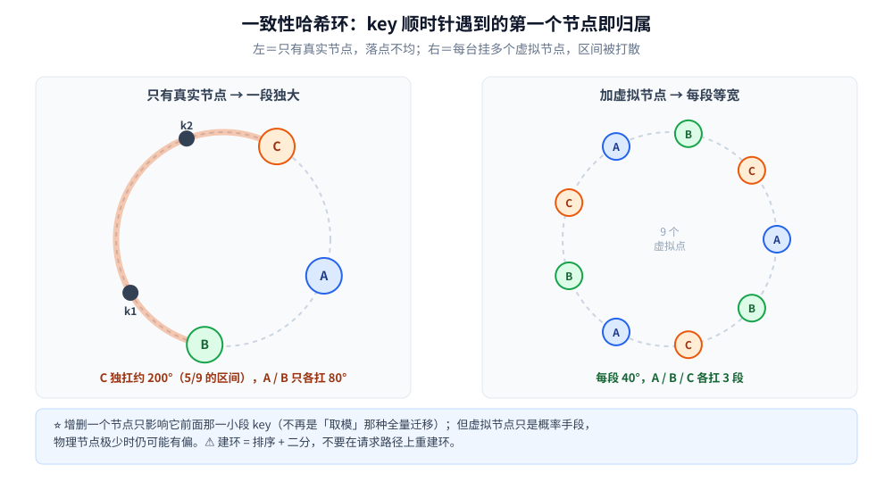

# 一致性哈希

> 覆盖一种把**节点和 key 映射到同一个环**上的分片算法：key 沿环顺时针遇到的第一个节点就是它的归属，
> 于是**增删一个节点只影响它前面那一小段 key**，不再是全量迁移。
>
> ⭐ 本篇是**算法与结构篇**：讲环的形态、虚拟节点的必要性、建环的代价。工程落点在两处 ——
> [服务发现与负载均衡.md](服务发现与负载均衡.md)（实例选择）与
> [分表与路由.md](../../../03-数据与中间件/数据存储/关系型/MySQL/分表与路由.md)（分库分表路由）。
>
> 素材来源：博客 [数据结构](https://blog.csdn.net/weixin_43837229/article/details/103222660)（2019-11-24）——
> 本篇取该文「补充结构」一节的一致性哈希部分；**工程动机与三件必补事项**为本次整理补充。逐篇登记见 [素材清单](../../../素材清单.md)。
>
> 本目录（分布式）的阅读顺序见 [README.md](../README.md)。

---

## 一、一致性哈希环为什么比"取模"更适合分片？

**本节要点**：把节点和 key 都映射到同一个环上，key 顺时针遇到第一个节点即归属——**增删节点只影响一小段 key**，不再是全量迁移。

**要解决的问题**：普通哈希取模在**增减节点**时几乎让所有 key 换归属（全量迁移 / 全量缓存失效）。一致性哈希把节点和 key 都映射到同一个 `[0, 2ⁿ)` 的**环**上，key 沿顺时针遇到的第一个节点就是它的归属节点——于是新增 / 摘除一个节点，**只影响它前面那一小段 key**（环就是"取模"的连续版：把 `hash % N` 换成"在有序数组里二分找第一个 ≥ hash 的节点"）。

**工程上必须补的三件事**：① **虚拟节点**——真实节点太少时环上落点极不均匀，某台机器会白扛一大段流量，每台挂几十个虚拟点把区间打散（但这是概率手段，节点数极少时仍可能有偏）；② **建环不是 O(1)**——排序 + 二分定位，**不要在请求路径上重建环**（详见 [服务发现与负载均衡.md](服务发现与负载均衡.md)）；③ 本质仍是"有序数组 + 二分查找"，它的价值在**分布式分片**语境下：分片与迁移的取舍见 [海量数据存储设计.md](../../系统设计/海量数据存储设计.md)。

## 使用：一致性哈希在你的系统里以什么形式出现

**第一层：客户端负载均衡的实例选择。** 需要"同一类请求总是打到同一台机器"时用它 —— 轮询做不到（每次都可能换台），取模做不到（扩缩容就全乱）。实现见 [客户端负载均衡的Go实现.md](客户端负载均衡的Go实现.md)。

**第二层：缓存分片。** 缓存节点扩容时，取模会让**几乎所有 key 换机器 → 命中率瞬间归零 → 请求全压到后端库**。一致性哈希把迁移量压到"新增节点该接手的那一段"，这是它最被依赖的场景。

**第三层：分库分表的路由。** 分片键要稳定地把"同一个用户"路由到同一个分片，扩容时又要少搬数据 —— 判据与取舍见 [分表与路由.md](../../../03-数据与中间件/数据存储/关系型/MySQL/分表与路由.md)。

**第四层：它其实只是「有序数组 + 二分」。** 环上找归属就是一次 `lowerBound`（找第一个 ≥ hash 的节点）；这也是为什么**建环（排序）与查环（二分）要分开放**——前者是启动时的一次性成本，后者才是请求路径上的成本（模板见 [二分查找.md](../../../02-计算机基础/算法/基础算法/二分查找.md)）。

---

## 延伸追问

- **一致性哈希为什么必须加虚拟节点？** → 真实节点数少时，哈希环上落点会很不均匀，某个节点白扛一大段流量；虚拟节点把每段打散，负载才平。⚠️ 它只是**概率手段**，节点数极少时仍可能有偏。
- **它比"取模"好在哪、代价是什么？** → 好在**增删节点只迁移一小段**；代价是**多了一次排序与二分查找**，而且实现要处理"环上找第一个 ≥ hash"的边界（找不到就回到最小节点）。
- **为什么不能在请求路径上重建环？** → 建环要对全部节点排序，是 O(N log N)；请求路径上每来一个请求就重建一次，等于把静态成本摊进了每个请求。正确做法是**节点变更时重建一次、之后只读**。
- **一致性哈希和一致性（Consensus）是一回事吗？** → 完全不是。它解决的是**分片归属的稳定性**（节点增减时少搬数据），与 [Raft协议.md](../理论/Raft协议.md)、[一致性与CAP.md](../理论/一致性与CAP.md) 讲的"多副本怎么达成一致"无关，只是中文名字撞了。
- **它和普通哈希在数据结构上是什么关系？** → 普通哈希是"桶数组 + 取模"，一致性哈希是"**有序数组 + 二分**"；前者改 N 就全乱，后者改 N 只影响一段（对照见 [散列表.md](../../../02-计算机基础/数据结构/哈希表/散列表.md)）。

---

## 关联

- [服务发现与负载均衡.md](服务发现与负载均衡.md) — 实例选择的四种策略里，一致性哈希排在哪种场景
- [客户端负载均衡的Go实现.md](客户端负载均衡的Go实现.md) — 一致性哈希的 Go 实现与实测
- [分表与路由.md](../../../03-数据与中间件/数据存储/关系型/MySQL/分表与路由.md) — 分片键怎么选、扩容怎么少搬数据
- [散列表.md](../../../02-计算机基础/数据结构/哈希表/散列表.md) — 它要替代的那个「取模」
- [二分查找.md](../../../02-计算机基础/算法/基础算法/二分查找.md) — 环上定位 = `lowerBound`
- [关注粉丝设计.md](../../系统设计/社交互动系统/关注粉丝设计.md)、[排行榜设计.md](../../系统设计/社交互动系统/排行榜设计.md) — 「同一个 uid 落到同一个分片」的两个真实落点
- [README.md](../README.md) — 本目录（分布式）的导读：理论线与治理线的阅读顺序
