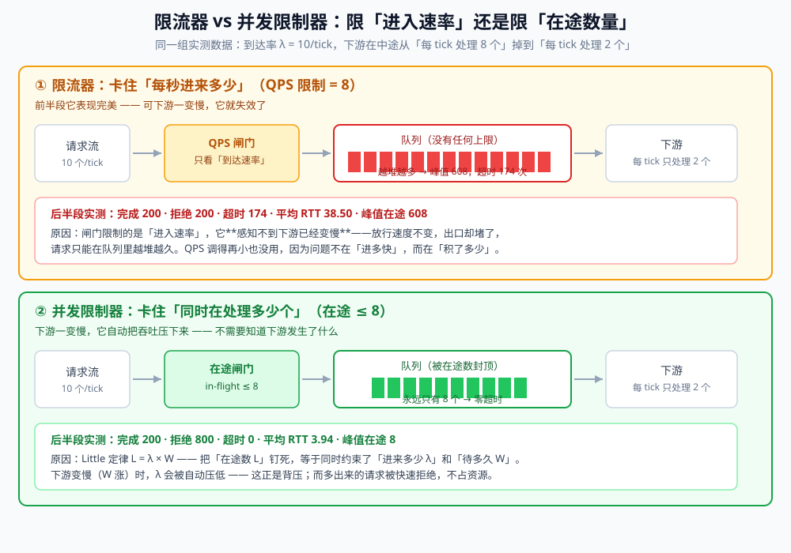
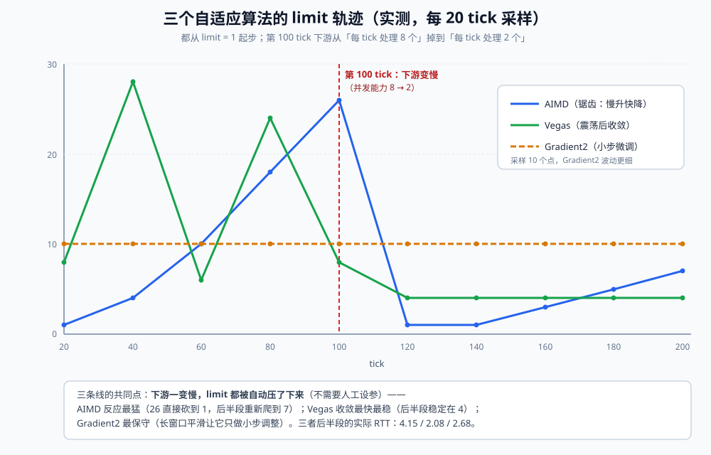

# 并发限制器

> 并发限制器（concurrency limiter）的原理、静态实现与三种自适应算法（AIMD / Vegas / Gradient2），
> 以及它和「限流器」「熔断器」各自管什么、怎么配合。全部结论配套本机 Go 1.26.5 + JDK 1.8.0_321 双实现实测（输出逐行对齐）。
>
> 内容整理自个人学习笔记，素材见 [素材清单](../../../素材清单.md)。
>
> ⚠️ 本篇讲的是**限制「同时在处理的请求数」**（in-flight），与限制「每秒放行多少」的**限流器**是两回事 ——
> 后者的算法与工程实现分别在 [限流算法.md](限流算法.md)（令牌桶 / 漏桶 / 滑动窗口）与
> [限流器.md](../../../01-编程语言/go/并发编程/限流器.md)（`x/time/rate` 的接入与源码）。
> 自适应算法里的 **AIMD 借鉴自 TCP 拥塞控制**，协议侧的实现在
> [TCP拥塞控制算法.md](../../../02-计算机基础/网络/TCP拥塞控制算法.md)。

---

## 一、并发限制器和限流器到底差在哪？

**本节要点**：两者都是「保护下游」，但**限制的物理量不同** —— 一个限速率、一个限在途数。
这个差别在下游**延迟稳定**时看不出来，一旦下游变慢，效果天差地别。

### 1.1 一个字的差别：限「速率」还是限「在途」

| | 限流器（rate limiter） | 并发限制器（concurrency limiter） |
|---|---|---|
| 限制的量 | **到达速率** λ（QPS / TPS） | **在途数量** L（in-flight，正在处理中的请求） |
| 典型实现 | 令牌桶、漏桶、滑动窗口 | 信号量、原子计数、自适应算法 |
| 被限时的表现 | 超过速率就拒绝 | 在途数到顶就拒绝 |
| 感知下游状态 | ❌ **完全感知不到** | ✅ 天然感知（下游慢 → 在途堆积 → 自动限流） |
| 适合 | 保护**自己**不被外部流量打垮、配额管理 | 保护**下游**（数据库、第三方 API）不被自己打垮 |

⭐ 一句话：**限流器管的是「门开多大」，并发限制器管的是「里面能站多少人」。**

### 1.2 为什么 QPS 限制保护不了你的系统（实测）

先看一张图 —— 同一组实测数据下两种策略的差别：



实测设定：到达率 λ = 10/tick，下游在**中途变慢**（每 tick 的处理能力从 8 个掉到 2 个）。
下面是「后半段」（即下游已经变慢之后）的四组对照：

```text
  无限制            完成  200  拒绝     0  超时   200  平均 RTT  60.80  平均在途 612.00  峰值在途  1008
  QPS 限制=8       完成  200  拒绝   200  超时   174  平均 RTT  38.50  平均在途 311.00  峰值在途   608
  并发限制=8         完成  200  拒绝   800  超时     0  平均 RTT   3.94  平均在途   8.00  峰值在途     8
  并发限制=2         完成  200  拒绝   800  超时     0  平均 RTT   1.00  平均在途   2.00  峰值在途     2
```

⚠️ **注意第二行**：QPS 限制 = 8，比到达率 10 还严格，看起来「已经限得够狠了」。
它的**前半段表现和最优解一模一样**（RTT = 1、在途 = 8）—— 因为那时下游还很快。

可下游一变慢，它就崩了：

| 指标 | QPS 限制 = 8 | 并发限制 = 8 | 差距 |
|---|---|---|---|
| 平均 RTT | **38.50** | **3.94** | **约 10 倍** |
| 超时次数 | **174** | **0** | — |
| 峰值在途 | **608** | **8** | **76 倍** |

⭐ **为什么**：QPS 限制的是「进入速率」，它**感知不到下游已经变慢**。
放行速度没变，出口却堵了 → 请求只能在队列里越堆越久。
把 QPS 从 8 调到 4 也救不了 —— 因为问题不在「进多快」，而在「积了多少」。

而并发限制器限制的是「在途数」：下游变慢时，在途数会自然逼近上限，
**多出来的请求被立刻拒绝**（实测 800 次拒绝），已经在处理的请求则迅速拿到结果。

---

## 二、原理：Little 定律 —— 为什么「限在途」更本质

**本节要点**：`L = λ × W` 这一条公式解释了全部 ——
限制在途数 `L`，等于**同时约束了「进来多少 λ」和「待多久 W」**；而只限制 λ，就把 W 放跑了。

### 2.1 L = λ × W

Little 定律说：一个稳定系统里，

```text
在途数 L  =  到达率 λ  ×  平均停留时间 W
```

它不依赖任何分布假设（不需要泊松到达、不需要指数服务时间），只要求系统**稳定**。

把三个量代进本篇的场景：
- `L` = 同时在处理的请求数（= 并发限制器的 limit）
- `λ` = 实际放行的到达率（= 吞吐）
- `W` = 单个请求的平均耗时（= RTT / 响应时间）

### 2.2 为什么「限制 L」等于「同时约束 λ 和 W」

把公式移项：`λ = L / W`。

⭐ **这就是全部答案**：

| 你的策略 | 下游变慢时（W 变大）会发生什么 |
|---|---|
| **只限 λ**（QPS 限制） | λ 被钉住 → 为了让 `L = λ × W` 成立，**L 只能跟着 W 一起涨** → 队列无限堆积 → W 继续涨（正反馈） |
| **只限 L**（并发限制） | L 被钉住 → `λ = L / W` → **W 变大时 λ 自动变小** → 这就是背压，系统稳定 |

⚠️ 所以「QPS 限制」隐含了一个前提：**下游的延迟是稳定的**。
一旦延迟恶化，它不但保护不了系统，还会**助推雪崩**（L 越涨 → 排队越久 → W 越涨）。

### 2.3 实测验证

用「没变慢」的前半段（下游 C = 8）验证公式：

```text
================ 实验一：Little 定律 L = λ × W ================
  先只看**前半段**（下游 C=8，还没变慢）—— 在途数与到达率、延迟的关系：
  静态并发限制=4    完成  396  平均在途   4.00  平均 RTT   1.00  → L = λ·W = 4 × 1.00 = 4.00
  静态并发限制=8    完成  792  平均在途   8.00  平均 RTT   1.00  → L = λ·W = 8 × 1.00 = 8.00
  ⭐ 在途数 = 到达率 × 延迟。**限制在途数，等于同时约束了「进来多少」和「待多久」**
```

`limit = 4` 时实测 L = 4.00、λ·W = 4.00；`limit = 8` 时 L = 8.00、λ·W = 8.00 —— 两边吻合。

---

## 三、静态实现：信号量就够了，但有两个设计点

**本节要点**：并发限制器最朴素的实现就是**信号量**（`Semaphore` / 计数信号量）。
真正需要设计决策的是两件事：**获取许可要不要超时**、**满了之后排队还是拒绝**。

### 3.1 信号量就是天然的并发限制器

信号量的许可数 = 允许的最大在途数。`acquire()` 成功就是在途 +1，`release()` 就是在途 -1。

| 语言 | 用什么 | 是否有超时版本 |
|---|---|---|
| Go | `chan struct{}`（带缓冲的通道）、`golang.org/x/sync/semaphore` | 通道可用 `select` + `time.After` |
| Java | `java.util.concurrent.Semaphore` | ✅ `tryAcquire(timeout, unit)` |
| PHP | 无内置，靠 Redis 原子计数或 `flock` | — |

⚠️ **Go 里最常用的是带缓冲通道**：`sem := make(chan struct{}, 8)`，
`sem <- struct{}{}` 就是 acquire，`<-sem` 就是 release。它的语义比信号量更严格 —— **谁 acquire 谁 release**。

### 3.2 获取许可要不要超时

这是静态实现里**最容易做错**的一点：

| 策略 | 行为 | 适用 |
|---|---|---|
| **不超时**（一直等） | 请求在队列里无限期排队 → 在途数被限住了，但**延迟失控** | ❌ 几乎不该用 |
| **零超时**（`TryAcquire`） | acquire 失败立刻返回 429 / 降级 | ✅ 网关层、对延迟敏感 |
| **有限超时**（如 50ms） | 等一小会儿，还拿不到就失败 | ✅ 大多数服务端场景 |

⭐ **为什么「不超时」很危险**：并发限制器的价值是「限制在途数 → 限制延迟」，
但如果 acquire 会无限等待，那么被限住的请求会**转成排队延迟**，`W` 照样涨。
**并发限制器必须配合超时/快速失败，否则只是把延迟从一个地方搬到了另一个地方。**

### 3.3 满了之后：排队还是快速失败

- **快速失败**（返回 429 / 降级）：保护自己，把压力还给调用方 —— 默认选择；
- **排队**（有界队列 + 超时）：适合「调用方愿意等」的场景，但**队列长度必须有界**，
  否则就退化成第一节里那个「队列无限堆积」的反例。

### 3.4 静态 limit 到底设多少（实测扫描）

把 limit 从 1 扫到 32，看后半段（下游 C = 2）的表现：

```text
================ 实验三：静态并发限制「设多少」才对 ================
  并发限制=1   完成  100  拒绝   900  超时     0  平均 RTT   1.00  平均在途   1.00  峰值在途     1
  并发限制=2   完成  200  拒绝   800  超时     0  平均 RTT   1.00  平均在途   2.00  峰值在途     2
  并发限制=4   完成  200  拒绝   800  超时     0  平均 RTT   1.99  平均在途   4.00  峰值在途     4
  并发限制=8   完成  200  拒绝   800  超时     0  平均 RTT   3.94  平均在途   8.00  峰值在途     8
  并发限制=16  完成  200  拒绝   800  超时     0  平均 RTT   7.76  平均在途  16.00  峰值在途    16
  并发限制=32  完成  200  拒绝   800  超时   182  平均 RTT  15.04  平均在途  32.00  峰值在途    32
```

读出来的三条：

1. **limit 小于下游容量**（1）→ 吞吐被砍掉一半（完成 100 vs 200）—— **浪费容量**；
2. **limit 大于下游容量**（16、32）→ 完成数**没有增加**（都是 200），但 RTT 一路涨到 15.04，**到 32 时开始大量超时**；
3. **最优值恰好等于下游容量**（2）—— 但那是**下游变慢之后**的容量。

⚠️ 而下游容量是**变化的**：前半段是 8，后半段是 2。
如果按前半段设 `limit = 8`，后半段的 RTT 就从 1.00 涨到 3.94（实测）——
还不算崩，但已经不是最优了；如果下游掉得更多，静态值就会变成第 3.5 节的灾难。

⭐ **结论：静态 limit 的有效期 = 「下游容量不变」的时间**。这正是自适应算法存在的理由。

---

## 四、自适应算法：让 limit 自己找到答案

**本节要点**：三种算法的共同思路是「**把 limit 当自变量、把 RTT 当因变量**」，
通过观察 RTT 的变化来判断 limit 该加还是该减。区别在于**用什么信号做判断**。

### 4.1 为什么需要自适应

静态 limit 的困境是**双盲**：

- 设小了 → 浪费容量（实验三的 limit = 1）；
- 设大了 → RTT 爆炸甚至超时（实验三的 limit = 32）；
- 而「多少才对」**随机器规格、下游状态、数据分布实时变化**，事先无法算出来。

自适应算法用一个朴素的观察解决它：**如果加大 limit 会让 RTT 变差，说明已经到顶了。**

### 4.2 AIMD：加法增、乘法减（来自 TCP）

```text
成功（RTT 正常）  → limit 慢慢加（每 N 次成功 +1）      ← 加性增 Additive Increase
出现拥塞信号      → limit 直接砍掉一截（× 0.9）          ← 乘性减 Multiplicative Decrease
```

- **拥塞信号**在并发限制器里就是「**请求超时**」（RTT 超过阈值）；
- ⭐ 为什么是「慢升快降」：加得快会立刻撞墙，降得慢会长时间过载 —— 这个不对称正是 TCP 稳定性的来源；
- ⚠️ 缺点：**必须等到超时才知道**，所以它总会先撞一下墙（实测后半段 27 次超时）。

### 4.3 Vegas：用「历史最小 RTT」估排队量

TCP Vegas 的思路是**在丢包之前就刹车**：用 RTT 的变化量反推「现在排了多少队」。

```text
rttMin  = 历史最小 RTT（≈ 空载延迟，即没有任何排队时的耗时）
queueSize = limit × (1 − rttMin / rtt)     ← 正在排队的请求数

queueSize < alpha  → limit++     （排队太少，还有余量）
queueSize > beta   → limit--     （排队太多，该收了）
```

⭐ 关键点：

- 用 **`rttMin` 而不是平均 RTT** —— 平均会被排队污染，最小值才代表「不排队时能有多快」；
- 它在 RTT **刚开始变大**时就反应，不必等到超时 —— 所以实测中它的超时是 **0**；
- ⚠️ 代价是**容易震荡**：实测轨迹 `[8 28 6 24 8 4 4 4 4 4]`，前半段在 6~28 之间来回摆。

### 4.4 Gradient2：用 RTT 的梯度判方向

Netflix 的 `concurrency-limits` 库里用的思路：不看 RTT 的绝对值，看它的**变化方向**。

```text
把「当前 RTT（短窗口）」除以「长窗口平均 RTT」：
  比值上升（如 > 1.2）→ RTT 在涨 → 有排队 → limit × 0.9
  否则                 → limit++
```

- 它的探测信号是「**梯度的符号**」—— 加 limit 让 RTT 涨了，就说明加过头了；
- 用长窗口平均是**为了抗抖动**（单次毛刺不该触发调整）；
- ⚠️ 也正因为平滑，它**反应最慢**：实测轨迹全程采到 10，调整幅度最小。

### 4.5 三者对比

| | AIMD | Vegas | Gradient2 |
|---|---|---|---|
| 探测信号 | **超时**（结果性信号） | **排队量** `limit × (1 − rttMin/rtt)` | **RTT 梯度**（短窗口 ÷ 长窗口） |
| 反应速度 | 慢（要等超时） | **快**（RTT 刚涨就动） | 中（被长窗口平滑） |
| 是否需要 `rttMin` | 否 | ✅ 是（且必须足够久） | 否（用长窗口代替） |
| 实测后半段 RTT | 4.15 | **2.08** | 2.68 |
| 实测后半段超时 | **27** | **0** | **0** |
| 实现复杂度 | 最低 | 中 | 中 |
| 主要风险 | 每次必定先撞墙 | 窗口小 → 震荡 | 太保守 → 收敛慢 |

### 4.6 实测：三条 limit 轨迹长什么样



```text
================ 实验四：自适应算法自己找 limit ================
  三个算法都从 limit=1 起步，盯住 RTT 自己调整（不需要人工设参）：
  【AIMD】
    前半段：完成  514  拒绝   460  超时     0  平均 RTT   1.73  平均在途   9.45  峰值在途    26
    后半段：完成  179  拒绝   840  超时    27  平均 RTT   4.15  平均在途   7.06  峰值在途    27
             → 结束 limit = 7
    limit 轨迹（每 20 tick 采样）：[1 4 10 18 26 1 1 3 5 7]
  【Vegas】
    前半段：完成  757  拒绝   235  超时     0  平均 RTT   1.57  平均在途  11.97  峰值在途    18
    后半段：完成  200  拒绝   804  超时     0  平均 RTT   2.08  平均在途   4.14  峰值在途    10
             → 结束 limit = 4
    limit 轨迹（每 20 tick 采样）：[8 28 6 24 8 4 4 4 4 4]
  【Gradient2】
    前半段：完成  561  拒绝   429  超时     0  平均 RTT   1.37  平均在途   7.89  峰值在途    16
    后半段：完成  190  拒绝   810  超时     0  平均 RTT   2.68  平均在途   5.10  峰值在途    10
             → 结束 limit = 10
    limit 轨迹（每 20 tick 采样）：[10 10 10 10 10 10 10 10 10 10]
  ⭐ 下游变慢后，三者都自动把 limit 压了下来 —— 这就是「自适应」的意义
```

三条轨迹读出来的东西，比「谁更好」更有价值：

| | 轨迹特征 | 说明 |
|---|---|---|
| **AIMD** | `[1 4 10 18 26 → 1 1 3 5 7]` | 前半段一路加到 26（已经远超容量 8，纯靠超时才发现）；变慢后**直接砍到 1**，再慢慢爬 —— 典型锯齿 |
| **Vegas** | `[8 28 6 24 8 → 4 4 4 4 4]` | 前半段在 6~28 之间**震荡**（反应太灵敏）；变慢后**迅速收敛到 4** 并稳定 |
| **Gradient2** | `[10 ×10]` | 采样点上看起来是平的 —— 因为它的长窗口平滑让调整幅度**小于采样间隔**，波动没被采到（它的峰值是 16） |

⚠️ 一个重要的读图提醒：**Gradient2 的「平」不代表它没工作**，
它的前半段峰值到过 16、后半段落到 10 —— 只是每 20 tick 采一次样没采到波动。
要看清它的行为，得提高采样密度或直接打印每次调整。

⭐ **实践建议**：

- 追求**简单可控** → AIMD（但要接受「必定先撞一次墙」，所以超时阈值别设太紧）；
- 追求**低延迟、低超时** → Vegas（但要给它足够长的 `rttMin` 学习期，且对小窗口震荡有心理准备）；
- 下游**抖动大、毛刺多** → Gradient2 的长窗口平滑更有用。

---

## 五、生产落地：放哪一层、和谁配合

**本节要点**：并发限制器不是孤立的一层 —— 它和限流器、熔断器、超时、重试各自管一段，
**放错层或者少了配套（超时、拒绝策略），它的效果会大打折扣**。

### 5.1 放在哪一层

| 位置 | 限制什么 | 说明 |
|---|---|---|
| **客户端**（调用方） | 到**某个下游**的在途数 | ⭐ 最有效：能直接感知该下游的延迟，也天然按下游分桶 |
| **服务端**（被调方） | 自己**能同时处理**的请求数 | 防止被打垮；但请求已经进来了（占着连接） |
| **网关 / 边车** | 全局并发 | 粒度粗，适合兜底 |

⭐ 实践里最有用的是**客户端按下游限制** —— 因为「下游容量」只有调用方最清楚（它能观测到 RTT）。
这也是 Netflix `concurrency-limits` 库的定位：包在 HTTP 客户端上，每个下游一个限制器。

### 5.2 和限流器、熔断器的分工

| 组件 | 管什么 | 触发后的动作 | 典型阈值 |
|---|---|---|---|
| **限流器** | 进入速率（QPS） | 拒绝超额请求 | 1000 QPS |
| **并发限制器** | 在途数（in-flight） | 拒绝/排队 | 8~64（随机器） |
| **熔断器** | 下游**是否已经坏了** | 直接快速失败一段时间 | 错误率 > 50% |
| **超时** | 单次调用的最长时间 | 中断并释放资源 | 200ms |

⭐ **它们不是替代关系，是接力关系**：

1. 限流器挡住「外部突发流量」（保护自己）；
2. 并发限制器挡住「下游变慢导致的堆积」（保护下游）；
3. 熔断器在下游**已经持续失败**时直接短路（避免无效等待）；
4. 超时是所有机制的前提 —— **没有超时，并发限制器的在途数永远不会下降**。

⚠️ 注意第 4 条：**如果只加了并发限制器而没设超时**，
一旦下游 hang 住（不返回也不报错），在途数会永久占满，服务直接死掉。
并发限制器**依赖超时来回收许可**。

### 5.3 必须采集的指标

| 指标 | 为什么 |
|---|---|
| `limiter_limit` | 自适应算法的输出 —— 看它是否在合理区间，是排查「限制器行为异常」的第一入口 |
| `inflight` | 当前在途数；长期贴着 limit 说明 limit 偏小（或下游真的到瓶颈了） |
| `rtt`（P50 / P99） | 自适应算法的输入，也是判断「加限制有没有用」的依据 |
| `rejected_total` | 因限流被拒的数量；突然上涨通常意味着下游变慢或 limit 被压得太低 |
| `timeout_total` | 超时数 —— AIMD 的拥塞信号，也是「阈值设得对不对」的证据 |

### 5.4 五个坑

| 坑 | 症状 | 怎么避免 |
|---|---|---|
| **没设超时** | 在途数永久占满、服务假死 | 并发限制器**必须**配超时；acquire 也要有超时 |
| **limit 全局共享** | 一个慢下游把其他下游的额度也占满 | **按下游 / 按接口分桶**，别用一个全局 limit |
| **忽略 `rttMin` 的冷启动** | Vegas 上线初期乱调 | 给一段学习期，或先用一个保守的静态 limit 兜底 |
| **只看平均 RTT** | 毛刺被平均掉，调整滞后 | 自适应算法要用 **P99 或「短窗口 vs 长窗口」**，别用全程平均 |
| **把拒绝当失败重试** | 被拒绝的请求重试 → 打进来更多 | 拒绝要返回明确的 429 + 让调用方**退避**，而不是立刻重试 |

---

## 使用：给一个 HTTP 接口加自适应并发限制

下面是一个可直接用的 Go 实现（含 Vegas 自适应 + 超时 + 快速失败）。
它的核心就是第四节那三行公式，配上一把「有超时的信号量」：

```go
package limit

import (
	"context"
	"errors"
	"sync"
	"time"
)

// Adaptive 是一个 Vegas 风格的并发限制器。
type Adaptive struct {
	mu       sync.Mutex
	limit    int   // 当前允许的在途数（动态调整）
	inflight int   // 当前在途数
	rttMin   int64 // 历史最小 RTT（微秒）—— 空载延迟的估计
	timeout  time.Duration
	alpha    int
	beta     int
}

var ErrLimited = errors.New("concurrency limit reached")

func NewAdaptive(start, alpha, beta int, timeout time.Duration) *Adaptive {
	return &Adaptive{limit: start, rttMin: -1, timeout: timeout, alpha: alpha, beta: beta}
}

// Acquire 申请一个许可：超时返回 ErrLimited（快速失败，不无限排队）。
func (a *Adaptive) Acquire(ctx context.Context) error {
	deadline := time.Now().Add(a.timeout)
	for {
		a.mu.Lock()
		if a.inflight < a.limit {
			a.inflight++
			a.mu.Unlock()
			return nil
		}
		a.mu.Unlock()
		if time.Now().After(deadline) {
			return ErrLimited
		}
		select {
		case <-ctx.Done():
			return ctx.Err()
		case <-time.After(time.Millisecond):
		}
	}
}

// Release 归还许可，并用本次 RTT 调整 limit。
func (a *Adaptive) Release(rtt time.Duration) {
	us := rtt.Microseconds()
	a.mu.Lock()
	defer a.mu.Unlock()
	a.inflight--
	if a.rttMin < 0 || us < a.rttMin {
		a.rttMin = us
	}
	if a.rttMin <= 0 {
		return
	}
	// queueSize = limit × (1 − rttMin/rtt)
	queue := a.limit * int((us-a.rttMin)) / int(us)
	switch {
	case queue < a.alpha:
		a.limit++
	case queue > a.beta && a.limit > 1:
		a.limit--
	}
}

// Limit 当前 limit（用于打点）。
func (a *Adaptive) Limit() int {
	a.mu.Lock()
	defer a.mu.Unlock()
	return a.limit
}
```

用法（以摄影工作室的「原图批量导出」接口为例，它下游要调图片处理服务）：

```go
func (h *Handler) Export(ctx *gin.Context) {
	start := time.Now()
	if err := h.limiter.Acquire(ctx.Request.Context()); err != nil {
		// 快速失败：明确告诉调用方「稍后重试」，而不是排到超时
		ctx.Header("Retry-After", "1")
		ctx.JSON(http.StatusTooManyRequests, gin.H{"error": "服务繁忙，请稍后重试"})
		return
	}
	defer func() {
		h.limiter.Release(time.Since(start)) // 归还许可 + 用真实 RTT 调 limit
	}()

	result, err := h.imageService.Export(ctx.Request.Context(), ctx.Param("id"))
	if err != nil {
		ctx.JSON(http.StatusInternalServerError, gin.H{"error": err.Error()})
		return
	}
	ctx.JSON(http.StatusOK, result)
}
```

⚠️ 三个必须注意的点：

1. **`Release` 一定要在 `defer` 里** —— 任何返回路径都不能漏（漏一次，在途数就永久少一个）；
2. **`Acquire` 的超时是必须的** —— 上面用 `a.timeout` 做快速失败，避免请求排到调用方超时；
3. **`rttMin` 要有冷启动策略** —— 上线初期最小 RTT 还没学到，
   建议先跑一段静态 limit（如 `NewAdaptive(4, ...)`），或者把 `alpha` 调大一点，让它先观察再调。

Java 侧对应的是 `Semaphore.tryAcquire(timeout, unit)` + 同样的 `queueSize` 公式，
思路完全一致（`java.util.concurrent` 里没有现成的自适应限制器，Netflix 的 `concurrency-limits` 是最常用的选型）。

---

## 延伸追问

- **并发限制器和限流器能互相替代吗？** → 不能，管的是两个物理量。实践中**两个都要**：
  限流器挡外部突发（按配额），并发限制器挡内部堆积（按下游状态）。
  只留限流器会遇到第一节那个实测场景；只留并发限制器则挡不住「短时间涌入大量请求」对**自身**的冲击。
- **为什么 QPS 限制在下游变慢时不生效？** → 因为它限制的是 λ，而 `L = λ × W` 里它**放跑了 W**。
  下游变慢（W 涨）时，为了让等式成立，L 只能跟着涨 —— 队列堆积、延迟继续恶化，形成正反馈。
- **AIMD 为什么必须「乘性减」而不是「减 1」？** → 加法增是对数收敛（慢），乘法减是几何收敛（快）。
  如果减也用减法，恢复期会很长；用乘法则能在几次内降到安全区。这个不对称正是 TCP 稳定性的来源。
- **Vegas 为什么用 `rttMin` 而不是平均 RTT？** → 平均值包含排队时间，一排队就变大，
  用它算 queueSize 会自我抵消（永远算不出「排了多少」）。最小值才代表「不排队时能有多快」。
- **自适应算法能直接用于「保护自己」吗（服务端）？** → 可以，但要清楚它的输入是**上游观测到的 RTT**。
  服务端限制自己时，RTT 是「自己处理请求的耗时」—— 意义不同，需要单独设计探测信号。
- **limit 需要按下游分桶吗？** → **必须**。一个全局 limit 会让慢下游把额度占满，
  快下游也一起被限。Netflix 的做法是「每个 host / 每个下游一个限制器」。
- **被拒绝的请求怎么办？** → 返回明确的 429 或降级结果，并让调用方**退避重试**。
  ⚠️ 千万别立刻重试 —— 那等于把压力又加回来，还可能触发「重试风暴」。

---

## 关联

- [限流算法.md](限流算法.md) — **速率限制**：令牌桶 / 漏桶 / 滑动窗口 / 固定窗口；与本篇是「限速率 ↔ 限在途」的一对
- [稳定性三件套.md](稳定性三件套.md) — 限流 / 熔断 / 降级三件套的整体视角与手写实现
- [限流器.md](../../../01-编程语言/go/并发编程/限流器.md) — Go 的 `x/time/rate`：令牌桶的工程实现与源码
- [TCP拥塞控制算法.md](../../../02-计算机基础/网络/TCP拥塞控制算法.md) — **AIMD 的来源**：慢启动、拥塞避免、快重传与 BBR
- [并发同步原语.md](../../../01-编程语言/go/并发编程/并发同步原语.md) — 信号量与通道：静态并发限制器的语言侧基础
- [goroutine实战模式.md](../../../01-编程语言/go/并发编程/goroutine实战模式.md) — 带缓冲通道做信号量的实战写法
- [滑动窗口.md](../../../02-计算机基础/算法/基础算法/滑动窗口.md) — 滑动窗口：限流里的「窗口计数」是它的工程应用
- [Raft协议.md](../理论/Raft协议.md) — 另一种「限制并发写入」的思路：串行化而非限流
- [素材清单.md](../../../素材清单.md) — 素材来源登记
> 反向引用（本篇被下列文档引到）：[从零实现网关.md](../../../01-编程语言/go/网络编程/从零实现网关.md)、[熔断器.md](熔断器.md)、[负载保护.md](负载保护.md)、[商品详情页设计.md](../../系统设计/秒杀系统/商品详情页设计.md)、[库存系统设计.md](../../系统设计/秒杀系统/库存系统设计.md)
