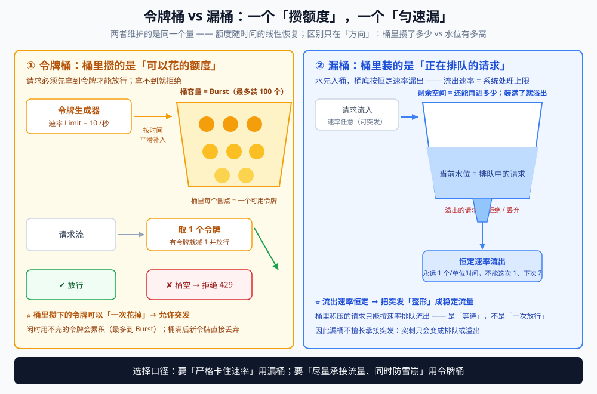
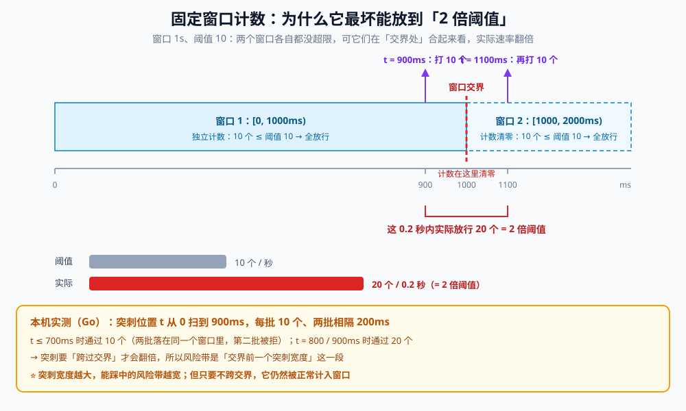
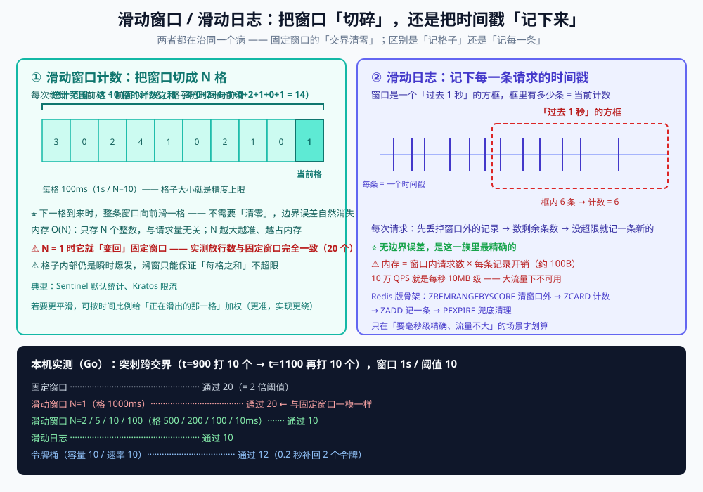

# 限流算法

> 令牌桶与漏桶两种限流模型的原理、参数语义与选择口径，外加**固定窗口 / 滑动窗口 / 滑动日志 / 自适应**四种算法的原理与实测对照，以及生产落地的 `redis-cell` 与"令牌从哪来"的两种更新策略。
>
> 素材来源：博客 [高并发系统解决之限流](https://blog.csdn.net/weixin_43837229/article/details/100561149)（2019-11-16）—— 令牌桶与漏桶的模型讲解取该文脉络，并补 PHP / Go / Java 三语言实测；**第八节**（其他限流算法）另按个人学习笔记与《大型网站技术架构：核心原理与案例分析》（李智慧）整理。
>
> ⚠️ 本篇只讲**算法与模型**；Go 工程实现（`golang.org/x/time/rate` 的接入、`Allow` / `Wait` 的用法、源码字段与三个坑）见 [限流器.md](../../../01-编程语言/go/并发/限流器.md)。

---

## 一、为什么要限流：三把利器中的一把

高并发下某些接口达到处理瓶颈后会出现拒绝访问，并引发**连锁反应导致整个系统崩溃**。开发高并发系统时有三把利器用来保护系统：**缓存、降级和限流**。

限流的生活类比：老式电闸都装了**保险丝**，一旦有人使用超大功率设备，保险丝烧断以保护其他电器不被强电流烧坏。接口也同样需要一根"保险丝"——流量过大时**采取拒绝或引流等机制**。

## 二、令牌桶模型与两个核心参数

**来源**：博客 [高并发系统解决之限流](https://blog.csdn.net/weixin_43837229/article/details/100561149)（2019-11-16） —— 令牌桶与漏桶的模型讲解均取该文，配套本机三语言实测。

**本节要点**：**令牌桶**这个限流模型的原理，以及**参数的实际含义**。

| 参数 | 含义 |
|---|---|
| **`Limit`** | **速率**：每秒恢复多少个令牌 |
| **`Burst`** | **突发流量上限**，也就是**桶的容量**（能缓存的令牌数量） |

**用一组数字理解**：

```text
Limit = 10/s（每秒恢复 10 个）
Burst = 100 （桶最多装 100 个）

→ 如果没有任何流量，需要 10 秒才能把桶填满
→ 突发流量来了：这一秒可以处理 100 个请求（因为桶里有 100 个令牌）
→ 这 100 个处理完，又需要至少 10 秒才能重新填满
```

## 三、关键实现细节：令牌是"平滑生成"的，不是一次性填满

**一个常见的天真写法**：

> "每秒到点了，就往桶里加 10 个令牌。"

**为什么不行**：

> 如果 `Burst` 小于每秒恢复量（比如 Burst=5、Limit=10/s），
> **一次性填 10 个也放不下**——桶会溢出。

**标准库的做法：平滑生成**

```text
Burst = 10，Limit = 10/s
→ 每秒恢复 10 个 = 每 100ms 恢复 1 个
```

> **令牌是"按时间比例慢慢补"的，而不是攒到一秒末尾一次性给。**

## 四、突发流量场景（走一遍完整过程）

**场景**：桶里当前有 10 个令牌，`Limit = 10/s`，`Burst = 100`，突然来了 100 个请求。

```text
① 100 个请求打过来 → 瞬间把 10 个令牌消耗完（tokens: 10 → 0）
② 因为有互斥锁，100 个请求中只有 10 个通过（拿到令牌）
③ 剩下 90 个直接被拒绝
```

**这么做的目的**：

> **把超出服务器负载的流量直接拒掉，保护服务器**——
> 避免整个服务被打挂，导致**所有**流量都不可用（包括那些本来能正常处理的）。

**这就是"限流"的本质：宁可拒绝一部分，也要保住整体可用。**

## 五、令牌耗尽后的行为

**令牌为 0 之后**：

- 按平滑方式，**每 100ms 生成 1 个令牌**；
- 此时**限流器已不具备突发处理能力**——因为每 100ms 才 1 个，
  需要**整整 1 秒**才能把桶重新填满，**而且期间若有其他请求还会继续消耗令牌**；
- 后续请求只能**平滑地按每秒 10 个**放行。

**反过来，如果流量很闲**：

> 每秒 10 个用不完 → **令牌会持续累积**，最多累积到 `Burst` 为止。
> **之后若来突发流量，累积了多少就能支持多少**——
> 这就是 `Burst` 这个参数存在的意义。

## 六、漏桶算法：水先入桶，匀速流出

漏桶算法思路很简单：**水（请求）先进入到漏桶里，漏桶以一定的速度出水，当水流入速度过大会直接溢出（等待、丢弃）**——因此漏桶能**强行限制数据的传输速率**。

⭐ 原文这两句是理解漏桶的关键，值得原样记住：

> - **漏桶的剩余空间代表着当前行为可以持续进行的数量**；
> - **漏嘴的流水速率代表着系统允许该行为的最大频率**。

也就是说：**桶容量 = 允许多少请求排队等**，**流出速率 = 系统的处理能力上限**。

## 七、漏桶与令牌桶：六条区别与选择口径

先把两个模型画在一起看 —— 它们的「桶」长得很像，但**桶里装的东西完全不是一回事**：



⭐ 看图记住这一句：**令牌桶里装的是「可以花的额度」，漏桶里装的是「正在排队的请求」**。
前者闲时会累积、突发时能一次花掉；后者的水位只代表积压，漏嘴速率才是系统真正的处理上限。

| # | 令牌桶 | 漏桶 |
|---|---|---|
| 1 | 按**固定速率往桶里加令牌**，请求看桶里令牌够不够，令牌为 0 则拒绝新请求 | 按**固定速率让请求流出**，流入速率任意，累积到桶容量则新请求被拒 |
| 2 | 限制的是**平均流入速率**，允许突发（一次拿 3 个、4 个令牌都行） | 限制的是**常量流出速率**（永远 1 个/单位时间，不能这次 1、下次 2） |
| 3 | **允许一定程度的突发** | 主要目的是**平滑突发流入** |
| 4 | 用来控制**发送到网络上的数据数目** | 主要目的是**控制数据注入网络的速率**，把突发流量整形为稳定流量 |
| 5 | 只要桶里有令牌就能突发传输到配置门限，**适合有突发特性的流量** | 需要"允许某种程度突发传输"时，漏桶**就不合适了** |
| 6 | 两者**实现可以一样、方向相反**，相同参数下限流效果相同 | 同左 |

⭐ **一句话选择口径**：**要"严格卡住速率"用漏桶，要"尽量承接流量、同时防雪崩"用令牌桶。**

原博文里有个很实在的生产例子：对接第三方支付接口时人家要求"每秒最多发 5 个请求"，**必须用漏桶严格卡住**；而自家的 Web API 想尽量承接用户流量、又防雪崩，**令牌桶更合适**——两者都适合做成可配置的通用中间件。

## 八、其他限流算法：固定窗口 / 滑动窗口 / 滑动日志 / 自适应

**来源**：本节为补充内容 —— 按个人学习笔记与《大型网站技术架构：核心原理与案例分析》（李智慧）的「限流算法」一节整理，配套本机 Go 实测。

**本节要点**：只答"令牌桶 + 漏桶"只算讲了一半；能补出**固定窗口的临界突刺、滑动窗口的精度权衡、滑动日志的内存代价、自适应为什么不用调参**，才算把限流算法这张图讲完整。

前七节讲的都是**速率整形**（令牌桶 / 漏桶）这一族；本节补上另一族——**窗口计数**，以及不设阈值的**反馈控制**。

### 8.1 固定窗口计数：最简单，也最容易被"打穿"

**原理**：把时间切成一个个固定长度的窗口（比如每秒一个），窗口内计数，达到阈值就拒绝，**进入下一个窗口计数清零**。

**致命问题——临界突刺**：两个相邻窗口的交界处，实际速率可以是阈值的 **2 倍**：

```text
窗口 1s，阈值 100：第 0.9s 来 100 个，第 1.1s 又来 100 个
→ 每个窗口内都没超 100，全部放行；但 0.9s~1.1s 这 0.2s 内实际处理了 200 个（2 倍阈值）
```



⭐ **突刺不是随时都能翻倍，它有个几何条件：必须跨过窗口交界**。
本机实测（Go，窗口 1s / 阈值 10，两批各 10 个、相隔 200ms，把突刺位置 t 从 0 扫到 900ms）：

```text
t ≤ 700ms → 通过 10 个     （两批落在同一个窗口里，第二批被正常计入并拒绝）
t = 800ms → 通过 20 个
t = 900ms → 通过 20 个     （两批分别落进窗口 1 和窗口 2，各自都没超限）
```

→ **风险带 = 「交界前一个突刺宽度」那一段**。突刺越宽，能踩中的位置越多；但只要不跨交界，
它仍然会被老老实实计入当前窗口。这也解释了为什么固定窗口在"整点/固定周期"的流量下特别容易出事。

**实现**：一个计数键 + 过期时间就够。**窗口对齐**就是一次整数除法：

```text
slot := now / window        // 1s 窗口下，0~999ms → 0，1000~1999ms → 1
```

⚠️ **Redis 版的两个坑**：

1. **`INCR` 与 `EXPIRE` 必须一起生效**：只 `INCR` 不设过期 → key 永不过期，
   该 IP 会被**永久限流**（第一次计数残留到天荒地老）。首次访问要同时设置过期；
2. ⚠️ **两条命令不是原子的**：客户端发完 `INCR` 就崩了，过期就没设上。
   稳妥做法是 `SET key 0 EX <秒> NX` + `INCR`，或干脆写成一个 Lua 脚本。

**优点**：O(1) 内存、天然好做分布式；**缺点**：最坏能放到 2 倍阈值。

### 8.2 滑动窗口计数：把窗口切碎

**原理**：把一个窗口切成 **N 个小格子**（如 1s 切成 10 个 100ms 格子），每次统计 **「当前格子 + 前面 N-1 个格子**」的计数和。也可以按时间比例给"正在滑出的那个格子"加权（更精确，实现更绕）。

**精度与开销的取舍**：格子越多越准，内存与计算也越大；⚠️ 它**仍不是完全精确**——格子**内部**依然可能有小突刺，粒度就等于格子大小。

⭐ **N 怎么选**：格子大小 = 窗口 / N，而**格子大小就是精度上限**。本机实测（突刺跨交界那组序列）：

```text
N = 1（格 1000ms） → 通过 20   ← 与固定窗口一模一样
N = 2（格  500ms） → 通过 10
N = 5（格  200ms） → 通过 10
N = 10（格 100ms） → 通过 10
N = 100（格 10ms） → 通过 10
```

⭐ 这张表里有两条关键结论：① **N=1 的滑动窗口就是固定窗口** —— 这一族算法是连续的，
固定窗口只是它的特例；② 本组突刺只要 **N ≥ 2** 就能挡住，因为两批请求落进了不同格子。
想让窗口"更滑"就要更大的 N，代价是内存与逐格求和的成本（O(N)）。

⚠️ **实现用环形数组比 map 更省，但要注意"这一格是不是上一轮的"**：
`cells[now/N % N]` 会覆盖旧值，必须先看该格记录的时间戳，确认它属于本轮统计范围，
否则会把**上一个窗口**的旧计数当成新格子的计数（表现为「限流忽松忽紧」）。

**典型**：Sentinel 的默认统计、Kratos 的限流都是滑动窗口计数。

### 8.3 滑动日志：最精确，也最贵

**原理**：记录窗口内**每一个请求的时间戳**（有序结构），每次请求先删掉窗口外的记录，再看剩余条数是否超限。

**优点**：⭐ 无边界误差，最精确；**缺点**：内存 = 窗口内请求数 × 每条记录开销（约 100B），**大流量下不可用**。

**内存怎么估**：窗口内请求数 × 每条记录开销。时间戳本身只有 8B，但有序结构（Redis ZSET 的
member + score + 跳表节点）实际每条约 **100B**：

```text
10 万 QPS × 1 秒窗口 × 100B ≈ 10 MB      ← 单个 key，还只是 1 秒
把窗口放大到 1 分钟 → 600 MB 级，直接不可用
```

**降内存的三条路**：① 缩短窗口（1s → 100ms，再按比例换算阈值）；② **采样**：只记 1/N 的请求、
统计时再放大（精度换内存，注意放大后的抖动）；③ 改用滑动窗口计数（内存从 O(请求数) 降到 O(N)）。

**Redis + ZSET 版的四个动作**就是它的骨架：`ZREMRANGEBYSCORE` 清窗口外 → `ZCARD` 计数 →
`ZADD` 记一条 → `PEXPIRE` 兜底清理。

> ⚠️⚠️ **这四个动作必须写在同一段 Lua 里**。"先 `ZCARD` 查、再 `ZADD` 写"如果分两次往返，
> 两个并发请求会**同时**读到"还没满"，然后双双写入 —— 计数超发，限流失效。
> 这是"用 Redis 做限流"最常踩的一脚（完整 Lua 见 [限流降级熔断.md](限流降级熔断.md) 的「Redis + Lua 滑动日志」）。

把 8.2 与 8.3 放在一张图里看，区别一目了然 —— 左边「记格子」，右边「记每一条」：



⭐ 两者治的是**同一个病**（固定窗口的交界清零），代价不一样：格子换精度（内存 O(N)），
时间戳换绝对精确（内存 O(请求数)）。

### 8.4 自适应限流：不设阈值，按反馈控制

**原理**：不写死 QPS，而是按**实时系统指标**（CPU、Load、总 RT、入口 QPS）动态算出"现在还能放多少"，典型思想来自 **BBR**（用延迟与吞吐的反馈做闭环）。

**优点**：机器规格不一、流量模型变化时不用重新压测调参；**缺点**：要采指标、算法复杂，且通常**只在单机生效**（集群口径难做）。

**闭环长什么样**（四步，一直转）：

```text
① 先给一个额度（初始速率 / 初始并发）
② 观察结果指标（延迟、吞吐、资源水位）
③ 还"有余量"就再加一点（加性增）→ 一旦变差就退回去（乘性减）
④ 反复③，稳定在临界点附近
```

⭐ 这与 [并发限制器.md](并发限制器.md) 的 AIMD / Vegas / Gradient2 是**同一套反馈控制**，
区别只是它调节的是**速率**，那边调节的是**在途数**。

**三类判据**（挑一个或组合用）：

| 判据 | 看什么 | 代表 |
|---|---|---|
| **延迟拐点** | RT 明显上升而吞吐不再涨 → 已经过了瓶颈 | BBR 的思想 |
| **资源水位** | CPU 使用率 / `load1` 超过阈值就压速度 | Sentinel `SystemRule` |
| **队列长度** | 按 Little 定律由 RT × 吞吐推出在途数 | 网关 / Service Mesh |

⭐ **为什么必须"主动探测"**：如果只降不升，系统会永远停在低水位，你也不知道还剩多少余量。
所以自适应算法都带**加性增**——这也是它"自己会试探"的代价：**它必然偶尔超调一下**。

⚠️ **为什么通常只在单机生效**：CPU / Load 都是**本机视角**，不同规格的机器读出同一个数字
代表的含义并不一样；要把单机结论拼成集群结论，需要额外的全局协调（这就是它难做的地方）。

**典型**：Sentinel 系统规则（`SystemRule`）、Kratos `adaptive`、Envoy。

### 8.5 实测：同一时刻的突刺，四种算法各放多少 ⭐

把请求**故意打在窗口交界**：`t=900ms` 连打 10 个、`t=1100ms` 再连打 10 个（0.2 秒内共 20 个），阈值统一为「每 1 秒最多 10 个」。

```go
// 固定窗口：时间戳落在哪个窗口里就在哪个窗口计数
slot := nowMs / window
if counts[slot] < limit { counts[slot]++; return true }

// 滑动窗口计数：当前格子 + 前 n-1 个格子求和
cur := nowMs / cellSize
total := 0
for i := int64(0); i < int64(s.n); i++ { total += counts[cur-i] }
if total < limit { counts[cur]++; return true }

// 滑动日志：先丢掉窗口外的记录，再看条数
if len(stamps) < limit { stamps = append(stamps, nowMs); return true }
```

```text
阈值：每 1 秒最多 10 个请求
序列：t=900ms 连打 10 个 → t=1100ms 再连打 10 个（这 0.2 秒内共 20 个）
算法                     t=900 通过     t=1100 通过    合计
固定窗口计数                 10           10           20
滑动窗口计数(10格)            10           0            10
滑动日志                   10           0            10
令牌桶(容量10/速率10)         10           2            12

→ 固定窗口把 20 个全放了：0.9s~1.1s 这 0.2 秒内实际放行 20 个 = 2 倍阈值（临界突刺）
→ 滑动窗口 / 滑动日志统计的是「过去 1 秒」内已放行的请求，所以第二批全被拒（精确，但一个记格子、一个记时间戳）
→ 令牌桶按时间补令牌：0.2 秒补回 2 个，于是放行 2 个、拒绝 8 个（允许小突发）
```

⭐ **这张表就是选型依据**：要"总量不被打穿"用**窗口类**（滑动窗口 / 滑动日志）；要"允许突发、平均可控"用**令牌桶**；要"严格匀速"用**漏桶**。

**再补两组扫描**（同一份 Go 实验台，参数同上）：

**扫描 A：格子数 N 的影响**（直接量出「这一族是连续的」）

```text
固定窗口                         通过 20
滑动窗口 N=1  （格 1000ms）      通过 20     ← 与固定窗口完全一致（N=1 就是固定窗口）
滑动窗口 N=2  （格  500ms）      通过 10
滑动窗口 N=5  （格  200ms）      通过 10
滑动窗口 N=10 （格  100ms）      通过 10
滑动窗口 N=100（格   10ms）      通过 10
滑动日志                         通过 10
令牌桶（容量 10 / 速率 10）      通过 12
```

**扫描 B：把突刺位置 t 从 0 扫到 900ms**（看固定窗口什么时候会翻倍）

```text
  t(ms)   固定窗口   滑动窗口N=10   滑动日志   令牌桶
  0       10        10            10        12
  300     10        10            10        12
  600     10        10            10        12
  700     10        10            10        12
  800     20        10            10        12
  900     20        10            10        12
```

⭐ 三点结论：
① 固定窗口的 **2 倍突刺有明确几何条件** —— 突刺必须跨过窗口交界（本组是交界前的 200ms 带）；
② **滑动窗口 / 滑动日志 / 令牌桶的读数在整个扫描里都是常数** —— 它们的判定不依赖"请求落在哪个窗口"，
   这正是它们能治好临界突刺的原因；
③ 令牌桶恒为 12：0.2 秒补回 2 个令牌，既没放 20 个（不像固定窗口），也没全拒（不像滑窗），
   **它用"补多少花多少"把突发限制在了一个有界的量上**。

### 8.6 四种场景对应四种算法

| 场景 | 选它 | 为什么 |
|---|---|---|
| 粗粒度总量防护，允许偶尔 2 倍突刺 | **固定窗口** | 一个计数器就够，最好做分布式 |
| 要平滑、开销可控 | **滑动窗口计数** | 精度随格子数可调，内存 O(格子数) |
| 要毫秒级精确、流量不大 | **滑动日志** | 无边界误差，但内存随请求数线性涨 |
| 要允许突发、开销最小 | **令牌桶** | O(1) 内存 + 允许攒额度（互联网业务主流） |
| 要严格匀速保护下游 | **漏桶** | 流出速率恒定，把突发整形 |
| 不想人工调参、机器规格不一 | **自适应** | 按实时指标反馈调节，但通常单机生效 |

### 8.7 这些算法之间的「退化关系」

把它们当成并列的选项背下来，很容易忘；**当成几个旋钮**就不会乱了：

| 旋钮 | 拧到头就是 | 实测/结论 |
|---|---|---|
| 滑动窗口的**格子数 N → 1** | 退化成**固定窗口** | 本机实测：N=1 通过 20，与固定窗口逐字一致 |
| 滑动窗口的**格子数 N → ∞** | 趋近**滑动日志**（每格只装一条） | 精度等价，内存从 O(N) 变成 O(请求数) |
| 令牌桶的**Burst → 1** | 退化成**严格匀速**（每 1/Limit 秒放 1 个）≈ 漏桶的流出 | `Burst=1` 等于不许突发 |
| 令牌桶的**Limit → 0** | 拒绝一切（除了桶里攒下的） | 常被误配成"限流不生效"的反面 |
| 漏桶的**速率 → 系统上限** | 不再需要"限流"，它变成正常排队 | 漏桶的语义就是"把突发整形" |

⭐ 一句话总结这一族：**真正在调的只有三个量** —— 窗口粒度（精度）、桶容量（允许多大突发）、
平均速率（长期放行多少）。所有算法都是这三个量的不同组合方式。

### 8.8 一张总表

| 算法 | 内存 | 精度 | 允许突发 | 分布式友好度 | 典型实现 | 一句话 |
|---|---|---|---|---|---|---|
| **固定窗口** | O(1) | 低（最坏 2 倍） | 边界处会翻倍 | ⭐⭐⭐ 一个计数器 | Redis `INCR` + `EXPIRE` | 最省，但边界会漏 |
| **滑动窗口计数** | O(N)（N = 格子数） | 中（受格子大小限制） | 被压住 | ⭐⭐ 要存 N 个计数 | Sentinel 默认、Kratos | 固定窗口的连续升级版 |
| **滑动日志** | O(窗口内请求数) | ⭐ 最高（无边界误差） | 被压住 | ⭐ 内存与并发都贵 | Redis ZSET + Lua | 最准，但大流量不敢用 |
| **令牌桶** | O(1) | 中（按速率准） | ⭐ 允许（桶内额度） | ⭐⭐ 可挪到 Redis | `x/time/rate`、Guava `RateLimiter` | 互联网业务主流 |
| **漏桶** | O(1) | 高（流出恒定） | 不允许（排队 / 溢出） | ⭐⭐⭐ 天然共享 | `redis-cell`（`CL.THROTTLE`） | 严格卡下游速率 |
| **自适应** | O(1) + 指标采集 | 依反馈，非固定 | 由算法决定 | ⚠️ 通常单机 | Sentinel `SystemRule`、Envoy | 不用调参，但难复现 |

⭐ 选型顺序建议：**先确定"能不能允许突发"**（能 → 令牌桶；不能 → 漏桶 / 窗口），
**再确定"要不要精确"**（要 → 滑动日志；不要 → 滑动窗口），**最后看"要不要集群共享"**（要 → Redis 原子指令）。

---

## 九、生产落地：redis-cell 与"令牌从哪来"

**漏桶的现成实现**：Redis 4.0 起提供了一个限流模块 **redis-cell**，它用的就是漏斗算法，并提供了**原子的限流指令**（`CL.THROTTLE`），适合多实例共享同一份配额。应用场景是**限制接口、会员、IP 在单位时间内的访问**。

**令牌桶的两种流派**（原文给了 Redis 版本，正好与 Go 篇（[限流器.md](../../../01-编程语言/go/并发/限流器.md)）的进程内版本对照）：

| 流派 | 做法 | 特点 |
|---|---|---|
| **进程内**（Go 篇的 `x/time/rate`） | 内存里维护令牌数与上次时间 | 零依赖、纳秒级；⚠️ **单机限流**，多实例时总速率 = 实例数 × Limit |
| **集中式**（原文的 PHP + Redis） | 用 Redis list 当桶（`lPush` 加令牌、`rPop` 取令牌） | 多实例共享配额；⚠️ 每个请求一次 Redis 往返，需要 Lua 或 `redis-cell` 这类原子指令兜住并发 |

原文的令牌更新策略有两条，第二种才是主流：

1. **定时补充**：用 `crontab` 每分钟调 `add` 补若干令牌（结合 shell 可细化到秒）——⚠️ 效率低，**每个接口都要开一个定时任务**；
2. **取令牌前触发更新**：判断"上次更新时间与现在的间隔"，超过阈值就补令牌，且**补充后不得超过桶上限**——省掉定时器，且自带惰性求值的精度。

⭐ 第二种写法正是 `x/time/rate` 的做法（按时间差惰性恢复，见**第三节**的平滑生成）——**"惰性按时间补"是这类限流器的通用范式**，理解了它，两种算法都只是"方向"不同。

## 十、漏桶的三份实现（PHP / Go / Java）

时钟一律**由外部注入**（`nowMs`），这样输出可复现、也便于写单测——生产代码同样应该这么做。

```php
final class LeakyBucket
{
    private float $water = 0.0;   // 当前水量（待处理请求数）

    public function __construct(
        private float $capacity,  // 桶容量：可积压的请求数
        private float $rate,      // 每秒流出量 = 系统允许的最大处理速率
        private int $lastMs,      // 上一次访问的时刻
    ) {
    }

    public function grant(int $nowMs): bool
    {
        // 先按时间比例漏水
        $this->water = max(0.0, $this->water - ($nowMs - $this->lastMs) / 1000 * $this->rate);
        $this->lastMs = $nowMs;

        if ($this->water + 1 <= $this->capacity) { // 原文写作 < capacity，有效容量少 1
            $this->water += 1;
            return true;
        }
        return false; // 水满，拒绝
    }
}
```

```go
type leakyBucket struct {
	capacity float64 // 桶容量：可积压的请求数
	rate     float64 // 每秒流出量 = 系统允许的最大处理速率
	water    float64 // 当前水量（待处理请求数）
	lastMs   int64   // 上一次访问的时刻
}

func (b *leakyBucket) grant(nowMs int64) bool {
	b.water -= float64(nowMs-b.lastMs) / 1000.0 * b.rate // 先按时间比例漏水
	if b.water < 0 {
		b.water = 0
	}
	b.lastMs = nowMs
	if b.water+1 <= b.capacity {
		b.water++
		return true
	}
	return false // 水满，拒绝
}
```

```java
static final class LeakyBucket {
    private final double capacity; // 桶容量：可积压的请求数
    private final double rate;     // 每秒流出量 = 系统允许的最大处理速率
    private long lastMs;           // 上一次访问的时刻
    private double water = 0;      // 当前水量（待处理请求数）

    boolean grant(long nowMs) {
        water = Math.max(0, water - (nowMs - lastMs) / 1000.0 * rate); // 先按时间比例漏水
        lastMs = nowMs;
        if (water + 1 <= capacity) {
            water += 1;
            return true;
        }
        return false; // 水满，拒绝
    }
}
```

⚠️ **原文实现里有一个边界问题**：判断写的是 `if (water + 1) < capacity`。**`<` 会让实际可用容量比声明的少 1**（容量 10 的桶最多只能积压 9 个）。标准写法应是 `water + 1 <= capacity`。这个差异在下面实测里能量出来。

## 十一、实测：同一个请求序列，两者各放行多少 ⭐

请求序列复刻原文：**20 次请求、每 5 次停 1 秒**；参数 **容量 10、速率 2/s**。

```text
序号     时刻(ms)     漏桶           漏桶(原文)       令牌桶
1      0          true         true         true
2      1000       true         true         true
3      1000       true         true         true
4      1000       true         true         true
5      1000       true         true         true
6      1000       true         true         true
7      2000       true         true         true
8      2000       true         true         true
9      2000       true         true         true
10     2000       true         true         true
11     2000       true         true         true
12     3000       true         true         true
13     3000       true         true         true
14     3000       true         true         true
15     3000       true         false        true
16     3000       false        false        false
17     4000       true         true         true
18     4000       true         true         true
19     4000       false        false        false
20     4000       false        false        false

通过 / 拒绝：漏桶 17/3 · 漏桶(原文写法) 16/4 · 令牌桶 17/3
```

**桶空时一次性打 20 个请求**（看有效容量）：

```text
标准写法 water+1 <= capacity  → 通过 10（实际容量 = 10）
原文写法 water+1 <  capacity  → 通过 9（实际容量 = 9）
```

⭐ 三语言（PHP 8.0.2 / Go 1.26 / JDK 1.8）跑同一序列，**逐次结果与汇总完全一致**（17/3），说明实现之间没有语义偏差；而"原文写法"确实**少放行 1 个**——边界缺陷在测试里是看得见的。

> 顺带一个易错点：**`时间戳 + 浮点水量` 是漏桶最容易写错的地方**。用整数计数会丢掉"按时间比例漏水"的精度（请求稀疏时桶长期不回流），必须**按时间差线性扣减**。

## 十二、答题结构

```text
① 模型：令牌桶（Token Bucket）
② 两个参数：Limit（恢复速率）、Burst（桶容量 / 突发上限）
③ 机制：请求先取令牌，取到才放行；令牌按时间平滑恢复
④ 突发：桶内令牌可被瞬间消耗，超出的请求直接拒绝（保护服务）
⑤ 工程实践：生产用 golang.org/x/time/rate，别自己造轮子
```

> Go 侧的落地（`Allow` / `Wait` / `SetLimit` 与三个坑）见 [限流器.md](../../../01-编程语言/go/并发/限流器.md)。

## 延伸追问

- **令牌桶 vs 漏桶的区别？** → 令牌桶**允许突发**（桶里攒的令牌可以一次用掉）；
  漏桶**恒定速率流出**，不允许突发。所以令牌桶更适合互联网业务。
  ⚠️ 这题几乎必然成对出现，完整的六条区别与"严格卡速率 vs 承接流量"的选择口径见**第七节**。
- **`Burst` 设太小会怎样？** → 允许多少并发就设多少；
  设成 1 就等于**严格串行**（退化成"每 100ms 才放一个"）。
- **漏桶为什么不"允许突发"？** → 漏桶的流出速率是**常量**，桶里积压的请求只能按速率排队流出——最多是"**等待**"，而不是"一次放行"；令牌桶则把攒下的额度存在桶里，可以一次花掉。这是两者最本质的差别。
- **为什么两种算法的实现可以写得几乎一样？** → 两者维护的都是**同一个量**——"额度随时间的线性恢复"，区别只在**方向**：令牌桶看"攒了多少、还能不能再花"，漏桶看"水位多高、还能不能再进"。所以原文说"实现可以一样、方向相反，相同参数下限流效果相同"。
- **多实例部署该用哪一种？** → ⚠️ 进程内的算法都是**单机限流**（全局速率 = 实例数 × 速率）。要全局配额就把桶挪到 Redis：用 `redis-cell` 的 `CL.THROTTLE` 原子指令，或自己写 Lua 脚本；代价是每个请求多一次网络往返。
- **固定窗口的临界突刺怎么解决？** → 三条路：**滑动窗口**（细分格子，精度换内存）、**滑动日志**（记时间戳，最准最贵）、**令牌桶**（天然无边界累积问题）。实测见第八节 8.5：同一时刻 20 个突刺请求，固定窗口全放（= 2 倍阈值），滑动窗口 / 滑动日志只放 10 个，令牌桶放 12 个。
- **为什么不用"自适应限流"一步到位？** → 它要采 CPU / Load / RT 等指标做反馈，**通常只在单机生效**，且出问题时难以复现和归因；固定阈值算法简单、可解释、易做分布式。生产常见做法是**令牌桶兜底 + 自适应做上层调节**。

---

## 关联

- [../../../01-编程语言/go/并发/限流器.md](../../../01-编程语言/go/并发/限流器.md) — **Go 工程实现**：`x/time/rate` 的接入、源码字段、实测读数与三个坑
- [限流降级熔断.md](限流降级熔断.md) — 限流 / 熔断 / 降级的整体视角与手写实现
- [../../../03-数据与中间件/数据存储/redis/缓存问题与方案.md](../../../03-数据与中间件/数据存储/redis/缓存问题与方案.md) — 缓存层兜底与限流的配合
- [缓存淘汰算法.md](../../../03-数据与中间件/数据存储/缓存淘汰算法.md) — 另一种"按容量 / 频率做取舍"的算法（LRU / LFU）
- [并发限制器.md](并发限制器.md) — **限制「在途数」**（本篇限制的是「速率」）：Little 定律与下游变慢时的雪崩实测
- [../../../素材清单.md](../../../素材清单.md) — 本篇的博客原文登记

> 反向引用（本篇被下列文档引到）：[从零实现网关.md](../../../01-编程语言/go/从零实现网关.md)、[双指针.md](../../../02-计算机基础/算法/基础算法/双指针.md)、[摩尔投票.md](../../../02-计算机基础/算法/基础算法/摩尔投票.md)、[滑动窗口.md](../../../02-计算机基础/算法/基础算法/滑动窗口.md)、[区间调度.md](../../../02-计算机基础/算法/贪心/区间调度.md)、[活动选择.md](../../../02-计算机基础/算法/贪心/活动选择.md)、[TCP拥塞控制算法.md](../../../02-计算机基础/网络/TCP拥塞控制算法.md)、[OpenResty.md](../../../03-数据与中间件/中间件/OpenResty.md)、[网关选型.md](../../../03-数据与中间件/中间件/网关选型.md)、[熔断器.md](熔断器.md)、[负载保护.md](负载保护.md)、[Go算法题.md](../../../07-面试/Go算法题.md)
