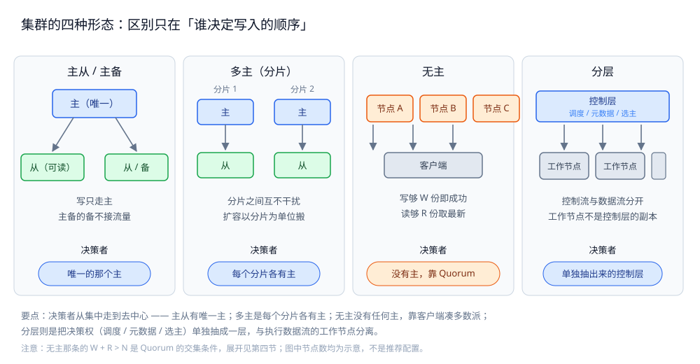
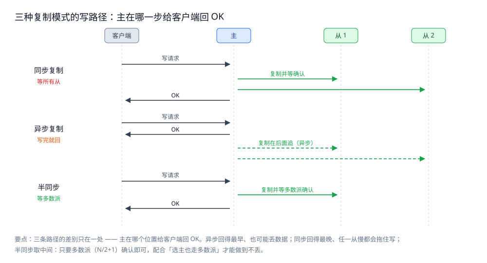
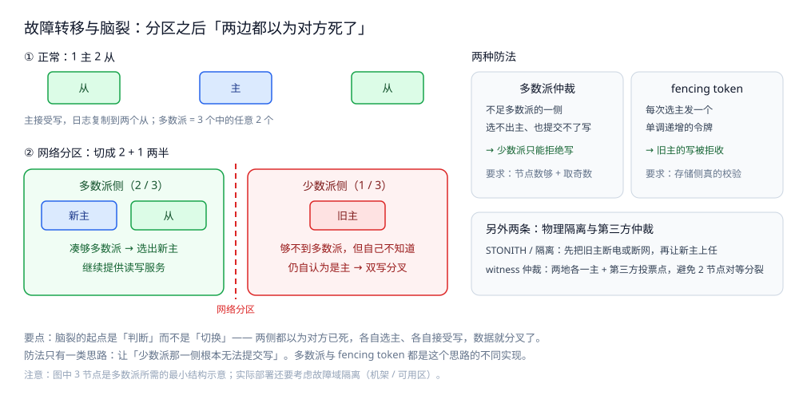

# 集群基础

> 集群是什么、为什么需要、有哪些形态、代价是什么 —— 一份横跨数据库 / 缓存 / MQ / 应用 / 编排的通用入门。
> 本篇只讲**通用的那部分**：形态分类、无状态与有状态的分野、副本一致性、故障转移与脑裂、数据分布与扩容。
> 各产品的具体机制不在这里重复，一律指到对应专篇 —— 索引见「使用」节。
>
> 内容整理自个人学习笔记，素材见 [素材清单](../../素材清单.md)。

---

## 一、集群解决什么问题？

**本节要点**：集群不是「多买几台机器」，它一次解决四个不同的问题。分清要解决的是哪一个，
才知道该不该上、该上哪种形态 —— **为了容量上集群，和为了可用性上集群，选型完全不同**。

| 要解决的问题 | 具体表现 | 单机为什么不行 |
|---|---|---|
| **高可用**（消除单点） | 一台挂了，服务不停 | 单实例就是单点，挂了就挂到底 |
| **负载均衡**（容量扩展） | 一台扛不住的 QPS 摊到多台 | 纵向扩到顶之后没有下一档 |
| **就近访问**（降延迟 + 异地容灾） | 用户在多地，RTT 差异明显 | 单机房只能服务一个地理区域 |
| **数据冗余**（防丢） | 磁盘坏了数据还在 | 单份数据没有第二个副本 |

> ⭐ **高可用 ≠ 不宕机**。集群的目标是「**宕机的影响可接受 + 能自动恢复**」——
> 副本挂掉时业务无感（或短暂抖动），以及故障后能自动选主、自动补数据。
> 声称「上了集群就不会挂」的方案，通常只是没测过真的挂一台。

### 容量扩展的两种，难度差一个量级

- **读扩展**：加从库即可。多个副本都能回答读请求 → 近似线性提升，代价是**复制延迟**带来的旧数据。
- **写扩展**：加从库**没用**——所有写还是打到主库。要扩写只有两条路：
  **分片**（把数据切开，每片各有主）或**换掉单点写的模型**（如无主、多主）。
  ⭐ 所以「加机器能扛更多流量」这句话，**只有读流量成立**；写流量要先分片。

### 与「分布式」「微服务」的区别

集群讲**同质副本怎么协作**；分布式讲**不同服务 / 进程怎么协作**；微服务讲**代码按什么边界切**。

三者的完整对照（含直觉模型、具体场景、常见误解）见 [分布式与微服务.md](分布式与微服务.md) 的 1.2 节。

---

## 二、集群有哪些形态？

**本节要点**：四种形态的区别，可以归结为一个问题 —— **谁决定写入的顺序**。
有单一决策者，就是主从或多主；没有决策者、靠客户端凑多数派，就是无主。

图怎么读：四栏从左到右是「决策者从集中到去中心」的谱系 —— 主从有唯一主，多主是**每个分片各有一个主**，
无主没有任何主（读够 R 份、写够 W 份即可），分层则是**把决策权单独抽成一层**（调度器 / 元数据节点）。 
⚠️ 图里的 `W + R > N` 是 Quorum 的交集条件，第四节展开；节点数都是示意图，不是推荐配置。

| 形态 | 怎么写 | 决策者 | 典型代表 |
|---|---|---|---|
| **主从 / 主备** | 全部写走主，读可从从库分流 | 唯一主 | MySQL 主从、Redis 主从、MongoDB 副本集 |
| **多主** | 每个分片各有自己的主，分片之间互不干扰 | 每片一个主 | MySQL Group Replication、Redis Cluster |
| **无主** | 客户端写多份，写够 W 份即成功 | 没有主，靠 Quorum | Cassandra、DynamoDB、Riak |
| **分层** | 决策与控制流集中在一层，数据流在另一层 | 控制层 | K8s（控制面 / 工作节点）、HDFS（NameNode / DataNode）、ES（master / data） |

> **主备与主从的差别**：主备的备节点**不接流量**（只等待接管），主从的从节点**可以接读流量**。
> 主备浪费一台机器的算力，换来的是「切过去就是完整的」；主从用上从库的算力，代价是可能读到旧数据。
>
> ⚠️ **分层不等于主从**：K8s 的 worker 节点不是 master 的「副本」，它们跑的是不同的东西、
> 分担的是不同的职责（控制流 vs 数据流）。把它放进同一张表，是因为**决策权同样集中在一个逻辑层**。

---

## 三、无状态与有状态怎么区分？

**本节要点**：这是集群里最重要的一条分界线。**无状态的难题是「选择」，有状态的难题是「一致」**——
无状态节点挂掉直接摘掉换一个就行；有状态节点挂掉，得先确定「数据到底到哪儿了」。

| | 无状态集群 | 有状态集群 |
|---|---|---|
| 请求处理 | 任何副本都能处理任何请求 | 请求必须打到持有该数据的副本 |
| 扩容 | 加副本，立刻生效 | 要**搬数据**，扩容期间要考虑迁移与双写 |
| 故障处理 | 健康检查失败 → 摘掉换新 | 先**选主**，再让新主追平日志 |
| 数据丢失风险 | 无（节点不存业务数据） | 有（复制延迟内可能丢） |
| 典型 | Nginx、无状态 HTTP 服务、网关 | 数据库、缓存、MQ、注册中心 |

### 为什么「有状态」是集群的真难题

无状态集群的所有问题，都能用「多放几个副本 + 负载均衡」解决 —— 因为**副本之间没有需要达成一致的东西**。
有状态不行：副本之间必须先就「**当前的数据是什么**」达成一致，而这件事在异步网络下并不平凡：

- 主写完了、从还没收到，此刻主挂了 —— 这次写算数吗？
- 网络分区了，两边各自认为自己是主 —— 谁说了算？
- 新主选出来，它比旧主少几条日志 —— 要补还是回滚？

这三问的答案就是第四节（复制）与第五节（故障转移）的全部内容。

> ⭐ **第三类：有状态但可重建**。纯缓存（数据能从数据库重来）、可重算的索引（能从源数据重建）
> 属于这一类 —— 它的故障恢复可以**清空重来**，比真·有状态简单一个量级。
> 判断方法只有一句：**这份数据丢了，能不能从别处重算出来？**能，就别按有状态集群的复杂度去做。

---

## 四、副本怎么保持一致？

**本节要点**：复制模式决定了两件事 —— **写要多慢**（客户端等多久）和**主挂了会丢多少**（RPO）。
「快、不丢、一直可用」三者最多同时满足两个，这就是 CAP 在复制层的样子。

图怎么读：三条泳道把「客户端 → 主 → 从」的时序画在一起，关键看**主在哪个位置给客户端回 OK**——
同步要等所有从确认（最慢、不丢）、异步写完自己就回（最快、可能丢）、半同步等够多数派（折中）。 
⚠️ 图里 `W + R > N` 是 Quorum 读写的交集条件：只有读写集合**有交集**，才保证读到的那份至少包含最后一次写。

### 四种做法与各自的账

| 模式 | 主什么时候回 OK | 主挂了丢数据吗 | 代价 |
|---|---|---|---|
| **同步复制** | 等**所有**从确认 | 不丢 | 最慢；任一从慢或挂，写就被拖住 |
| **异步复制** | 写完本地日志就回 | **会丢**（差多少取决于延迟） | 最快；故障时可能丢掉一段 |
| **半同步 / Quorum** | 等**多数派**（`N/2+1`）确认 | 不丢（只要选主也走多数派） | 折中；仍需多数派可用 |
| **共识协议** | 日志被多数派**提交**后回 | 不丢 | 最复杂；换来的是「选主与提交用同一套规则」 |

> ⭐ **共识 ≠ 复制**，这是最容易混的一点：
> - **复制**回答「数据抄到几份」，是**数据面**的事；
> - **共识**回答「一群机器怎么对某个值达成一致、且事后不可反悔」，是**决策面**的事。
>
> Raft / Paxos / ZAB 做的是**后者**，只是它们顺手把日志复制也管了，所以常被当成「高级复制」。 
> Raft 的三种角色、日志复制与选主流程见 [Raft协议.md](理论/Raft协议.md)，本篇只用到它的结论：
> **提交靠多数派、选主也靠多数派，两边用同一套规则才安全**。

### 副本读的一致性

写完的下一毫秒去读，读主库一定看到，读从库**可能看不到** —— 这就是读写分离的「读己之写」问题。
三种解法，按成本从低到高：

1. **会话粘滞**：同一用户的读全打到同一从库（缓解，不保证）；
2. **写后读主**：刚写过的那段时间（比如 1 秒）强制读主；
3. **记录位点**：客户端带上「我至少需要看到哪个位点/事务号」的读请求，从库跟不上就等或转主库。

> ⚠️ 单看「最终一致」四个字，判断不了业务能不能接受 —— 要问的是
> **「旧数据能被忍受多久、错多久会真的出事」**。对账、扣款这类场景不能只靠最终一致。

---

## 五、故障转移要解决哪些问题？

**本节要点**：故障转移（failover）不是「检测到挂了就切」这么简单。
四个动作里，**最难的是判断「真的挂了」**，而**最危险的是切换后旧主回来了**。

图怎么读：上半部分是正常的三节点集群，下半部分把**网络分区**画成两半——
多数派那侧选出新主继续服务，少数派那侧的主**仍在自认为是主**（这就是脑裂的起点）。
右侧两个防法：多数派（少数派选不出主，直接拒绝写）与 fencing token（用单调递增的令牌让旧主的写被拒）。 
⚠️ 图里「三节点」「`N/2+1`」是说明多数派所需的**最小结构**，不代表实际部署的推荐规模。

### 4.1 第一步：怎么判断「挂了」

| 手段 | 说明 | 风险 |
|---|---|---|
| 心跳 + 超时 | 超过 `timeout` 没收到心跳即判死 | ⭐ **误判**：对方只是慢（GC 停顿、网络抖动、负载高），不是死 |
| 主动探测（TCP / 健康检查接口） | 比心跳更接近真实可用性 | 探测本身也可能超时 |
| 多数派的独立判断 | 由多数节点分别给出结论，避免单个观察者的偏差 | 需要更多往返 |

> ⭐ **超时时间是两难**：设短了误切（把健康的旧主踢下去、数据分叉），设长了长时间不可用。
> 工程上的常见做法是**分级**：先用心跳快速摘流量（秒级、可恢复），
> 确认真正不可用之后再走选主（这个动作要慢、要稳）。

### 4.2 第二步：谁来当新主

- **协议内置**（Raft / ZAB / MongoDB 副本集）：候选者拉票，拿到多数派即当选，详见 [Raft协议.md](理论/Raft协议.md)；
- **外部哨兵**（Redis Sentinel）：独立的哨兵集群多数派投票，详见 [高可用.md](../../03-数据与中间件/数据存储/NoSQL/Redis/高可用.md) 第三节；
- **外部协调服务**（ZooKeeper / etcd）：把「谁是主」放在共识存储里，谁抢到临时节点谁是主；
- **人工切换**：最土但最可控，适合低频且不能出错的状态。

### 4.3 第三步：脑裂是怎么发生的、怎么防

**发生条件**：网络分区把集群切成两半，两侧都认为对方已死、都认为自己该当主 → **双写 → 数据分叉**。

| 防法 | 怎么起作用 | 依赖 |
|---|---|---|
| **多数派（Quorum）** | 节点数不足多数的那一侧，**选不出主也提交不了写** | 集群规模要够（通常奇数节点）、要避免出现两个「多数派」 |
| **Fencing token** | 每次选主发一个单调递增的令牌，存储层拒收比已见令牌更旧的写 | 存储侧要真的校验令牌 |
| **STONITH / 隔离** | 先把旧主强行关机或断网，再让新主上任 | 需要带外管理能力（IPMI、云厂商 API） |
| **仲裁节点 / witness** | 两地各一主 + 第三个投票点，避免 2 节点对等分裂 | 多一个需要维护的节点 |

> ⚠️ **偶数节点比奇数节点更危险**：4 节点分区成 2+2 时，两边都不构成多数派 → 整个集群不可写。
> 这是「集群要奇数节点」这句话的真正原因（不是"少数服从多数"这么简单，而是**避免出现对等的分裂**）。

### 4.4 第四步：旧主回来怎么办

⭐ 这是最容易被忽略的一步。旧主回来时**不能直接当主**，因为它身上可能有分区期间未经确认的写：

1. 先降级为从（拒绝它继续服务写请求）；
2. **对比日志位点**，决定是补齐（少了写）还是回滚（多了未提交的写）；
3. 位点对齐后才允许重新加入，是否升主由后续选举决定。

---

## 六、数据在集群里怎么分布？

**本节要点**：分片解决「一份放不下/扛不住」，副本解决「一份丢了/挂了」。
两者组合起来才是完整的分布：**数据先切片，每片再放多副本**。

### 6.1 分片：三种切法

| 切法 | 优点 | 缺点 | 例子 |
|---|---|---|---|
| **范围分片** | 范围查询友好、可顺序扫描 | 容易**热点**（如按时间递增写入全落在最后一片） | HBase rowkey、MongoDB range |
| **哈希分片** | 数据均匀 | 范围查询要广播到所有片 | 取模分表、MongoDB hashed |
| **一致性哈希** | 扩容时只迁 `1/N` 的数据 | 实现更复杂（虚拟节点、迁移流程） | Redis Cluster 槽位、客户端分片 |

> ⭐ **分片数是「定死后难改」的决定**：Redis Cluster 固定 16384 个槽、ES 的分片数建索引时确定。
> 预留的原则是**宁可先多、不要先少**（分片太多只是有元数据开销，分片太少只能重建）。

### 6.2 副本放置：副本不能放在同一个故障域

- **机架感知**：副本分散到不同机架，避免一个机架断电全灭；
- **跨可用区（AZ）**：AZ 级故障时仍有多数派可用 —— ⭐ **但跨 AZ 写入要付额外的网络 RTT**，
  所以通常是「同城多 AZ 同步复制 + 异地异步复制」的组合；
- **跨地域**：多数用于容灾与就近读，写路径一般不同步（RTT 不允许）。

> ⚠️ 「三副本」不等于安全：**三个副本都在同一台宿主机/同一个机架/同一个 AZ 上，就只有一个故障域**。
> 副本的意义全部来自**故障域隔离**。

### 6.3 扩容（rebalance）

扩容的难点不在搬数据，而在**搬迁期间的一致性**：

1. 新节点加入 → 划分要迁走的分片；
2. **一边搬一边接受新写入**（双写或增量追日志）；
3. 数据追平后**切流**到新分片；
4. 观察期结束才删旧数据。

> ⭐ 一致性哈希之所以在扩容场景被偏爱，是因为它把「要搬多少」从
> **「几乎全部重排」**降到了 **`1/N`**；但搬迁期间的双写与切流逻辑，任何分片方案都躲不掉。

---

## 七、典型产品各自用哪种集群？

**本节要点**：同一张表把「形态 — 定序机制 — 专篇」对上，看具体产品时先认形态，再看它的定序靠什么。

| 产品 | 形态 | 定序 / 选主机制 | 具体专篇 |
|---|---|---|---|
| MySQL | 主从 / 多主 | binlog 位点或 GTID；MGR 用 Paxos 类协议 | [复制与高可用.md](../../03-数据与中间件/数据存储/关系型/MySQL/复制与高可用.md) |
| Redis | 主从 + 哨兵 / Cluster 分片多主 | 哨兵多数派投票；Cluster 按 16384 槽分片 | [高可用.md](../../03-数据与中间件/数据存储/NoSQL/Redis/高可用.md) |
| MongoDB | 副本集（主从）/ 分片集群 | Raft 类选举（可投票节点须奇数） | [副本集与选举.md](../../03-数据与中间件/数据存储/NoSQL/MongoDB/副本集与选举.md)、[分片基础.md](../../03-数据与中间件/数据存储/NoSQL/MongoDB/分片基础.md) |
| Kafka | 分区 + 每分区一主 | 控制面选 controller，数据面按 ISR 提交 | [Kafka.md](../../03-数据与中间件/中间件/消息队列/Kafka.md) |
| Elasticsearch | 分层（master / data）+ 分片副本 | master 选举 + 分片级主从 | [集群与运维.md](../../03-数据与中间件/数据存储/搜索与分析/Elasticsearch/集群与运维.md) |
| Nacos | 分层 + 共识存储 | 集群内数据一致性靠 Raft 类协议 | [Nacos.md](../../03-数据与中间件/中间件/注册与配置中心/Nacos.md) |
| Kubernetes | 分层（控制面 / 工作节点） | 控制面靠 etcd（Raft）保状态一致 | [K8s部署流程.md](../../06-工程实践/部署/k8s/K8s部署流程.md) |
| 时序库（VM / GreptimeDB） | 多为分片 + 副本 | 视实现，多数为多副本写入 | [高可用与集群部署.md](../../03-数据与中间件/数据存储/时序数据库/VictoriaMetrics/高可用与集群部署.md)、[部署与集群运维.md](../../03-数据与中间件/数据存储/时序数据库/GreptimeDB/部署与集群运维.md) |

> ⭐ 读表方法：**先认形态，再问「谁定序」**。定序机制决定了这个产品在分区时会牺牲一致性还是可用性 ——
> 这条线是理解任何集群产品的通用钥匙。

---

## 八、集群要付出什么代价？

**本节要点**：集群换来可用性与容量，付出的是**一致性、钱、运维面和可调试性**四笔账。
上集群之前先把这四笔算清楚，比事后补监控划算。

| 代价 | 具体表现 | 缓解方向 |
|---|---|---|
| **一致性** | 分区发生时，要么拒绝写（保 C）、要么接受分叉（保 A） | 按业务选：钱相关选 C，浏览类选 A（见 [一致性与CAP.md](理论/一致性与CAP.md)） |
| **存储与写放大** | N 副本 = N 倍存储，写一份要落 N 份 | 副本数是可用性需求，不是「越多越好」 |
| **网络开销** | 复制流量；跨 AZ / 跨地域写要付 RTT | 同城同步、异地异步；批量与压缩 |
| **运维复杂度** | 节点越多，配置 / 版本 / 证书 / 升级窗口的排列组合越多 | 自动化 + 声明式配置（这正是 K8s 出现的理由） |
| **调试困难** | ⭐ 「三副本里有一份不一致」「只有高峰期才出现的脑裂」在本机复现不了 | 把可观测性做在前面：位点差、复制延迟、选举次数都要有指标 |

> ⭐ **集群不是免费的容量**：3 副本意味着写放大 3 倍、存储成本 3 倍，
> 而它换来的可用性**只在真的挂过一台之后才兑现**。
> 小体量业务、能容忍分钟级停机的场景，先把备份与恢复演练做好，往往比硬上集群更划算。

---

## 使用：本仓「集群」相关专篇的索引

**本节要点**：本篇只给**通用的判据**（形态 / 状态 / 复制 / 故障转移 / 分布）。
具体到某个组件怎么配、参数怎么调，看下表对应专篇 —— 不要在通用篇里重复实现细节。

| 领域 | 专篇 | 那篇讲什么 |
|---|---|---|
| 关系型数据库 | [复制与高可用.md](../../03-数据与中间件/数据存储/关系型/MySQL/复制与高可用.md) | 复制线程与 binlog、四种拓扑、半同步、GTID、复制延迟、故障切换 |
| 缓存 | [高可用.md](../../03-数据与中间件/数据存储/NoSQL/Redis/高可用.md) | 主从同步、哨兵选主、Cluster 分片与重定向 |
| 缓存（部署形态） | [多核利用与部署方案.md](../../03-数据与中间件/数据存储/NoSQL/Redis/多核利用与部署方案.md) | 单机多实例、主从、Cluster 的取舍 |
| 文档数据库 | [副本集与选举.md](../../03-数据与中间件/数据存储/NoSQL/MongoDB/副本集与选举.md) | oplog、写关注、选主与 Raft 的异同、投票节点为何要奇数 |
| 文档数据库（分片） | [分片基础.md](../../03-数据与中间件/数据存储/NoSQL/MongoDB/分片基础.md) | 分片键选择、chunk 迁移、均衡器 |
| 消息队列 | [Kafka.md](../../03-数据与中间件/中间件/消息队列/Kafka.md) | 分区与副本、ISR、controller 选举、部署 |
| 搜索 | [集群与运维.md](../../03-数据与中间件/数据存储/搜索与分析/Elasticsearch/集群与运维.md) | master / data 分层、分片与副本、集群运维 |
| 列式数据库 | [集群与高可用.md](../../03-数据与中间件/数据存储/列式数据库/ClickHouse/集群与高可用.md) | 分片与副本配置、分布式表 |
| 图数据库 | [因果集群与高可用.md](../../03-数据与中间件/数据存储/图数据库/Neo4j/因果集群与高可用.md) | 核心节点选举、因果一致性 |
| 时序数据库 | [高可用与集群部署.md](../../03-数据与中间件/数据存储/时序数据库/VictoriaMetrics/高可用与集群部署.md) | 集群版组件划分与扩容 |
| 注册与配置中心 | [Nacos.md](../../03-数据与中间件/中间件/注册与配置中心/Nacos.md) | 集群部署形态、五种注册中心横向对比 |
| 容器编排 | [K8s部署流程.md](../../06-工程实践/部署/k8s/K8s部署流程.md) | 控制面与工作节点、集群搭建与生命周期 |
| 理论（共识） | [Raft协议.md](理论/Raft协议.md) | 三种角色、日志复制、选主，含 etcd 三节点实测 |
| 理论（一致性） | [一致性与CAP.md](理论/一致性与CAP.md) | 强 / 弱 / 最终一致的差别与 CAP 取舍 |
| 服务治理（同质副本） | [服务发现与负载均衡.md](服务治理/服务发现与负载均衡.md) | 注册 / 发现 / 健康检查 / 负载均衡四件事的分工 |
| 服务治理（多副本陷阱） | [多副本共享状态.md](服务治理/多副本共享状态.md) | ⭐ 多副本下熔断与限流的判定依据怎么统一（阈值被放大 `副本数` 倍） |

---

## 延伸追问

- **「三副本」一定比「两副本」好吗？** → 不一定。三副本能容忍一台故障（多数派仍为 2），
  两副本则任何一台挂掉都不构成多数派。但三副本的写放大与存储成本也是 3 倍 ——
  要按「能容忍几台同时故障」倒推副本数，而不是照抄别家的配置。
- **为什么很多集群要求节点数是奇数？** → 不是「少数服从多数」这么简单，是为了**避免出现两个对等的多数派**。
  4 节点裂成 2+2 时两侧都不够多数派，整个集群反而**全不可写**；3 节点裂成 2+1 则多数派那侧照常服务。
- **读写分离之后，写完立刻读为什么读不到？** → 复制是异步的，从库有一条延迟时间线。
  业务上必须区分「强一致读」（读主或读多数派）与「可接受旧值的读」，前者不要走从库。
- **脑裂能不能靠「节点间多给几条心跳通道」解决？** → 只能降低概率，不能根治 ——
  分区是网络的事实，不是配置的问题。根治要靠**多数派仲裁**或**fencing token**，
  让「少数派那一侧根本无法提交写」。
- **一致性哈希是不是就不用考虑扩容了？** → 它只把搬迁量从「几乎全部」降到 `1/N`，
  **搬迁期间的双写、追平与切流仍然要做**，而且虚拟节点、槽位映射本身也是要维护的状态。
- **有状态服务能不能做成无状态？** → 能的一半是「可重建」：把数据外置到数据库/对象存储，
  进程本身只做计算。这也是为什么很多服务号称无状态 —— 它们**把状态推给了下游的有状态集群**。
  推给谁，谁就要按有状态的标准运维。
- **集群上了之后还有什么会单点？** → 常见漏网之鱼：配置中心、DNS、TLS 证书与签发、CI/CD，以及所有副本共用的那一个数据库账号。可用性等于**最弱的那一环**，不是副本数最多的那一环。

## 关联

- [分布式与微服务.md](分布式与微服务.md) — 三个词（集群 / 分布式 / 微服务）的完整对照与本目录总纲
- [一致性与CAP.md](理论/一致性与CAP.md) — 分区发生时为什么必须在 C 与 A 之间选
- [Raft协议.md](理论/Raft协议.md) — 共识与选主的具体机制（本篇只用到它的结论）
- [分布式事务.md](理论/分布式事务.md) — 跨服务写入的一致性，与「副本之间的一致性」是两回事
- [分布式ID.md](理论/分布式ID.md) — 分片之后「自增主键」为什么不成立、怎么替代
- [服务发现与负载均衡.md](服务治理/服务发现与负载均衡.md) — 无状态副本之间的发现与流量分配
- [多副本共享状态.md](服务治理/多副本共享状态.md) — 多副本把判定阈值放大的那个经典陷阱
- [分布式锁.md](../../03-数据与中间件/数据存储/NoSQL/Redis/分布式锁.md) — 多副本下的互斥（与选主是两种不同的问题）
- [容器与编排选型.md](../../06-工程实践/部署/容器与编排选型.md) — 编排层怎么把「分层集群」管起来
