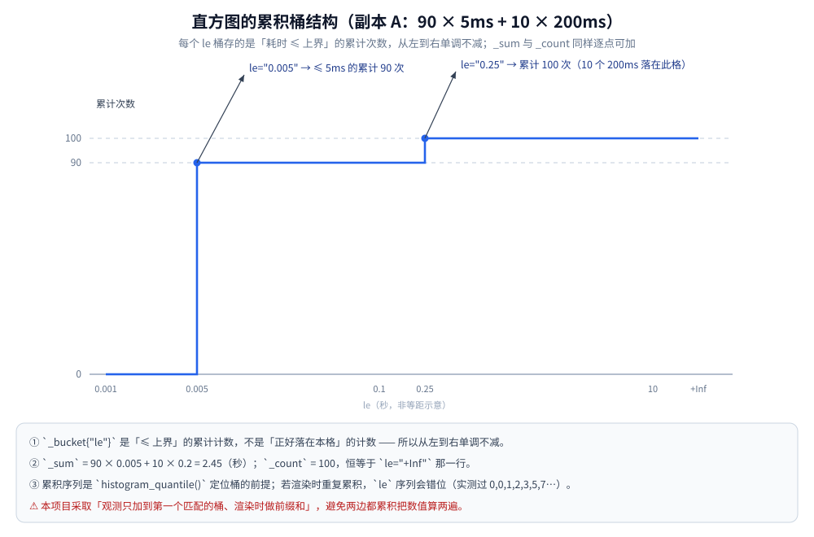
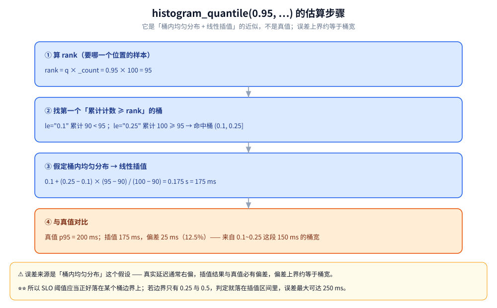

# Prometheus 直方图与分位数

> 「当场算出来的分位数」为什么不能跨实例聚合 —— 多副本只上报**累积桶**、把聚合交给 `histogram_quantile()` 的原理与实测。三支柱怎么选、存储后端怎么配见 [可观测性选型.md](可观测性选型.md)；本篇只讲**指标本身的数学**。
>
> 内容整理自个人学习笔记，实测基于自研网关项目 [gateway](https://github.com/Eleven-26/gateway)（module `gwlab`，Go 1.26.5）的 `internal/observability/`（本篇 `text` 块都是本机真实运行结果）。

---

## 一、为什么「各副本的 p95 求平均」不是全局 p95？

**本节要点**：分位数不是可加量 —— 两个副本的 p95 平均起来不等于全局 p95，而且这不是「不精确」，是**语义错了**。

### 1.1 可加的是「和」，不是「分位数」

网关项目把可观测性拆成「一条请求的三个切面」（见 [从零实现网关.md](../../01-编程语言/go/从零实现网关.md) 第九节）：TraceID 与日志是**单请求维度**，指标是**聚合维度**。

指标的价值全在「聚合」两个字上，而聚合成立的前提是**可加**：

- **平均值可加**：全局平均 = 各副本「平均值 × 请求数」之和 ÷ 总请求数。所以「各副本平均再按流量加权」能还原全局平均。
- **分位数不可加**：p95 是「排序后第 95% 位置上的那个值」，它依赖**整批样本的分布形状**。把两批样本各自的 p95 拿走之后，分布形状就丢了 —— 你无法从两个标量里还原出一条分布。

举个一眼能看穿的例子：副本 A 是「90 次 5ms + 10 次 200ms」，副本 B 是「100 次全 5ms」。

| 数据源 | 样本构成 | p95（真值） |
|---|---|---|
| 副本 A | 90 × 5ms + 10 × 200ms | 200ms |
| 副本 B | 100 × 5ms | 5ms |
| **两副本合并** | 190 × 5ms + 10 × 200ms | **5ms** |
| 「A、B 的 p95 求平均」 | — | **102.5ms**（错） |

合并后 200 个样本里只有 10 个是慢的，第 95% 位置（第 190 个）仍落在 5ms 那批上 —— 全局 p95 就是 5ms。而两个副本 p95 一平均得到 102.5ms，**放大了 20 倍**。看板上那个「全局延迟飙到 100ms」的曲线，可能只是把两个副本的数字平均了一下。

### 1.2 实测：两个副本、五个数字

实验台只调用 `internal/observability` 的**导出 API**（`NewMetrics` / `Observe` / `Render`），自己解析 `/metrics` 文本，再按 Prometheus `histogram_quantile` 的算法算分位 —— 等价于复现「Prometheus 侧拿桶做聚合」这一步。场景就是上表：副本 A 灌 90 次 5ms + 10 次 200ms，副本 B 灌 100 次 5ms（一个 `main` 包里 `go run .`，不监听端口）。输出逐行如下：

```text
=== 三方对比（单位：毫秒）===
① 副本 A 单独算 p95        = 175.00000 ms
② 副本 B 单独算 p95        = 4.87500 ms
③ 桶合并后再算 p95         = 5.00000 ms   ← 真值（近似）
④ 把 ① ② 平均             = 89.93750 ms   ← 错误值
⑤ 旧毫秒分位两者平均       = 102.50000 ms   ← 同样错

④ / ③ = 18.0 倍；⑤ / ③ = 20.5 倍
```

- ① 与 ② 是**单副本自己算**的分位（② 那里 4.875 而不是 5.000，是桶内插值的误差，见第三节；⑤ 是项目里旧指标 `gw_request_duration_ms{quantile="p95"}` 在各副本当场算好的毫秒值）。
- ③ 是把两个副本**同一 `le` 的桶相加**之后重算的分位，等于真实全局值。
- ④ 与 ⑤ 是「把各副本的分位再平均」，两条路都错，且错得量级完全不同：④ 偏 18 倍，⑤ 偏 20.5 倍。

### 1.3 ③ 是怎么来的：把两边的桶加起来

③ 用的数据就是下面这份「合并后的桶」（由实验台按 Prometheus 文本格式重新打印，可直接被 `histogram_quantile()` 消费）：

```text
gw_request_duration_seconds_bucket{route="r",le="0.001"} 0
gw_request_duration_seconds_bucket{route="r",le="0.0025"} 0
gw_request_duration_seconds_bucket{route="r",le="0.005"} 190
gw_request_duration_seconds_bucket{route="r",le="0.01"} 190
gw_request_duration_seconds_bucket{route="r",le="0.025"} 190
gw_request_duration_seconds_bucket{route="r",le="0.05"} 190
gw_request_duration_seconds_bucket{route="r",le="0.1"} 190
gw_request_duration_seconds_bucket{route="r",le="0.25"} 200
gw_request_duration_seconds_bucket{route="r",le="0.5"} 200
gw_request_duration_seconds_bucket{route="r",le="1"} 200
gw_request_duration_seconds_bucket{route="r",le="2.5"} 200
gw_request_duration_seconds_bucket{route="r",le="5"} 200
gw_request_duration_seconds_bucket{route="r",le="10"} 200
gw_request_duration_seconds_bucket{route="r",le="+Inf"} 200
gw_request_duration_seconds_sum{route="r"} 2.950000000000001
gw_request_duration_seconds_count{route="r"} 200
```

注意 `_sum` 和 `_count` **也是相加来的**：两个副本的和 2.45 + 0.5 = 2.95，计数 100 + 100 = 200。整份序列在聚合维度上是**逐点可加**的 —— 这正是分位数标量不具备的性质。PromQL 里对应的动作就是 `sum by (le)`。

### 1.4 为什么是「语义错误」而不是「不精确」

「不精确」是说结果在真值附近抖动；「语义错误」是说算出来的**根本不是那个量**。

- 平均值之所以能聚合，是因为期望是线性的：`E[X+Y] = E[X]+E[Y]`，所以按样本数加权平均天然给出全局期望。
- 分位数是分布的一个**非线性泛函**：合并样本后的 `p95` 依赖 X 与 Y 各自的数量与形状，**没有任何仅由 `p95(X)`、`p95(Y)` 构成的表达式能还原它**。取平均只是「随便挑了一个数」而已。

所以 ④ 与 ③ 的差别不是精度差，而是**两个不同的量**：④ 是「副本平均的分位」，③ 是「全局分位」，只有当两个副本分布完全相同时两者才碰巧相等。看板一旦写错，平时看着正常、流量倾斜或某个副本出长尾时立刻失准 —— 而那时恰恰是你最需要它准的时候。

---

## 二、直方图由哪些部分组成？

**本节要点**：直方图 = 一组**累积**的 `le` 桶 + `_sum` + `_count`；累积是协议规定，不是实现细节。

### 2.1 三块拼图

副本 A（90 × 5ms + 10 × 200ms）上报的那份真实文本长这样（`+Inf` 行在本节 2.3 补上）：

```text
gw_request_duration_seconds_bucket{route="r",le="0.001"} 0
gw_request_duration_seconds_bucket{route="r",le="0.0025"} 0
gw_request_duration_seconds_bucket{route="r",le="0.005"} 90
gw_request_duration_seconds_bucket{route="r",le="0.01"} 90
gw_request_duration_seconds_bucket{route="r",le="0.025"} 90
gw_request_duration_seconds_bucket{route="r",le="0.05"} 90
gw_request_duration_seconds_bucket{route="r",le="0.1"} 90
gw_request_duration_seconds_bucket{route="r",le="0.25"} 100
gw_request_duration_seconds_bucket{route="r",le="0.5"} 100
gw_request_duration_seconds_bucket{route="r",le="1"} 100
gw_request_duration_seconds_bucket{route="r",le="2.5"} 100
gw_request_duration_seconds_bucket{route="r",le="5"} 100
gw_request_duration_seconds_bucket{route="r",le="10"} 100
gw_request_duration_seconds_count{route="r"} 100
gw_request_duration_seconds_sum{route="r"} 2.4500000000000006
```

| 组成 | 含义 | 读法 |
| --- | --- | --- |
| `_bucket{le="…"}` | 耗时 **≤ 该上界**的请求次数 | `le` 是字符串标签，值必须是累积计数 |
| `_sum` | 所有观测值的**和**（这里是秒） | 2.45s = 90×0.005 + 10×0.2 |
| `_count` | 观测总次数 | 100，等于 `le="+Inf"` 那一行 |
| `_bucket{le="+Inf"}` | 「无限大上界」，即全部观测 | 每个观测值都 ≤ +Inf，所以它恒等于 `_count` |

⚠️ 注意 `le="0.005" 90` 的含义：**不是**「正好落在 5ms 这一格的有 90 次」，而是「耗时 ≤ 5ms 的累计 90 次」。所以序列从 0 → 0 → 90 → 90 → 90 → 100 逐级**单调不减**。



### 2.2 为什么必须是累积计数

`histogram_quantile()` 找桶靠的是「第一个累计数 ≥ rank 的桶」，这个搜索**只在累积序列上成立**；非累积序列会让它定位到错误的桶，算出来的值完全没有意义。

实现上有两条路：观测时直接写累积值，或只记「落在本桶区间」、渲染时做前缀和。本项目选后者 —— 观测只加到**第一个匹配的桶**上：

```go
func (h *Histogram) Observe(v float64) {
	h.mu.Lock()
	defer h.mu.Unlock()
	h.count++
	h.sum += v
	for i, ub := range durationBuckets {
		if v <= ub {
			h.counts[i]++
			return // 超过最大桶（v > 10s）时不落任何桶，只进 +Inf（由 count 体现）
		}
	}
}
```

累积放到渲染时做（`histogram.go` 的 `renderDurations`）：

```go
cumulative := int64(0)
for i, ub := range durationBuckets {
	cumulative += v.counts[i]
	fmt.Fprintf(&b, "gw_request_duration_seconds_bucket{route=%q,le=%q} %d\n",
		route, trimFloat(ub), cumulative)
}
```

⭐ 源码里对「两边都累积」这个坑有明确记录：

```text
// ⚠️ 只把计数加到**第一个匹配的桶**上，累积在渲染时做（Prometheus 的 le 是"<="语义）。
// 两边都累积的话数值会被算两遍 —— 本机实测踩过：le 序列变成 0,0,1,2,3,5,7…（像累积其实错位）。
```

累积语义由测试逐条定死（真跑，`go test ./internal/observability/ -count=1 -v`）：

```text
=== RUN   TestHistogramCumulativeBuckets
--- PASS: TestHistogramCumulativeBuckets (0.00s)
=== RUN   TestRenderIsStable
--- PASS: TestRenderIsStable (0.00s)
=== RUN   TestRenderIncludesHistogramAndRuntime
--- PASS: TestRenderIncludesHistogramAndRuntime (0.00s)
```

`TestHistogramCumulativeBuckets` 灌了 5ms / 50ms / 7s / 300ms 四次观测，断言 `le="0.005"` 为 1（只有 5ms 那次）、`le="0.05"` 为 2、`le="+Inf"` 为 4、`_count` 为 4、`_sum` 为 0.005+0.05+7+0.3=7.355（浮点容差 1e-9）。同一命令末尾：

```text
PASS
ok  	gwlab/internal/observability	1.265s
```

### 2.3 `+Inf` 桶与「超大观测值」

```go
// +Inf 桶 = 总次数（所有观测值都 <= +Inf）
fmt.Fprintf(&b, "gw_request_duration_seconds_bucket{route=%q,le=\"+Inf\"} %d\n", route, v.count)
```

两个作用：给 `histogram_quantile()` 一个**总次数**的锚点（没有 +Inf 桶它直接返回 NaN）；同时兜住「比最大桶还慢」的样本 —— 本项目最大桶是 10s，`v > 10` 的观测不落任何有限桶，只体现在 `_count` 里。代价是这类请求的分位贡献被**截断在 10s**（见 3.3）。

---

## 三、`histogram_quantile()` 是近似吗？桶边界怎么选？

**本节要点**：它是**近似** —— 假定桶内样本均匀分布再做线性插值，误差上界约等于桶宽，所以桶边界必须按延迟量级来选。

### 3.1 它到底算了什么

```text
rank = q × _count
找到第一个使「累积桶计数 >= rank」的桶 b
结果 = le(b-1) + (le(b) - le(b-1)) × (rank - count(b-1)) / (count(b) - count(b-1))
```

也就是：**先靠累积桶定位到样本落在哪个区间，再假定这个区间内样本均匀分布，按比例插值**。「均匀分布」纯属假设 —— 真实延迟通常右偏，所以插值结果与真值必有偏差。



### 3.2 实测里的偏差有多大

回到副本 A：90 × 5ms + 10 × 200ms。

| 口径 | 值 | 缘由 |
| --- | --- | --- |
| 真实 p95 | 200ms | 100 个样本排序后第 95 个落在 200ms 那批 |
| `histogram_quantile(0.95, …)` | 175ms | rank=95 落在 `le=0.1`(累计 90) → `le=0.25`(累计 100) 之间，插值 0.1 + 0.15 × 5/10 |

偏差 25ms（12.5%），来源就是「0.1~0.25 这个桶宽 150ms」里的均匀分布假设。副本 B 全是 5ms，真值 5ms，插值给 4.875ms —— 因为结果永远 ≥ 桶下界（`0.0025`）。合并后的 200 个样本里 rank=190 恰好落在 `le=0.005` 的上沿，插值给 5.00000ms，与真值一致。

⭐ 结论：**桶边界落在哪，比桶有多少个更重要**。

### 3.3 桶边界是怎么选的

```go
var durationBuckets = []float64{
	0.001, 0.0025, 0.005, 0.01, 0.025, 0.05, 0.1, 0.25, 0.5, 1, 2.5, 5, 10,
}
```

源码里写着选型依据：

```text
// 取舍：固定桶换来"可聚合 + 常数内存 + 无锁竞争下的稳定输出"，代价是精度受桶宽限制
// （桶边界是按网关的延迟量级选的：1ms ~ 10s，覆盖本地回环到上游超时）。
```

- **下界 1ms**：网关本地回环 + 内部转发的量级；比这还快就没必要细分。
- **上界 10s**：必须 ≥ 上游超时阈值。超过最大桶的样本只进 `+Inf`，分位会被截断在 10s；如果上游超时配的是 30s，就必须再加桶。
- **步进约 ×2~2.5**：13 个桶覆盖 4 个数量级，兼顾插值精度与序列数。相邻桶比值越接近 1，插值越准，但每条路由的桶序列越多（每个 `le` 都是一条时间序列）。

⚠️ SLO 阈值应当**正好是某个桶边界**。若 SLO 是「95% 请求 < 300ms」而边界只有 250ms 和 500ms，判定就落在 250ms~500ms 的插值区间里，误差最大可达 250ms —— 足以吃掉整个判定余量。

---

## 四、为什么单位一定是秒？

**本节要点**：`_seconds` 是 Prometheus 惯例，`histogram_quantile()`、看板模板、SLO 表达式都假定秒；用毫秒会让这些模板全线错 1000 倍。

源码头部的注释把这条写成了硬约束：

```text
// ⚠️ 单位用**秒**：`gw_request_duration_seconds_*` 是 Prometheus 的惯例（`histogram_quantile`
// 与各种看板模板都假定秒）。老的毫秒分位指标保留，方便直接肉眼对比，但不要再拿它做聚合。
```

- **惯例即契约**：Prometheus 生态里带时长的指标默认后缀 `_seconds`，官方 `client_golang` 的 `prometheus.NewHistogram` 也是按 `Seconds()` 观测的。看板模板、告警规则、SLO 计算都沿用这套默认，不会有人替你乘 1000。
- **单位只在观测入口转一次**：`Metrics.Observe` 收到的是 `time.Duration`，转秒的动作只发生在 `d.Seconds()` 这一处，调用方不需要也不应该自己换算。
- **旧指标的定位**：`gw_request_duration_ms{route=…,quantile="p95"}` 是毫秒、当场算好的分位，保留只为**肉眼对照**，任何聚合都不要用它（第一节的 ⑤ 就是拿它平均的结果）。
- ⚠️ 分位数本身无量纲，但**阈值和模板有量纲**：`histogram_quantile(...) > 0.3` 的意思是 300ms，若直方图按毫秒上报，这条规则的含义会变成 0.3ms。

---

## 五、不引 SDK 自己输出直方图，要注意什么？

**本节要点**：手写 Prometheus 文本格式，`# TYPE` 必须是 `histogram`、标签要转义、行序要稳定 —— 这几条官方 SDK 替你兜底，不引 SDK 就得自己守。

网关的 `go.mod` 除 gRPC 外不外引，`/metrics` 直接用 `strings.Builder` 拼出来。代价与要点：

| 项 | 要求 | 本项目做法 |
| --- | --- | --- |
| `# HELP` | 一行可读说明 | `# HELP gw_request_duration_seconds 请求耗时直方图（可跨实例聚合，用 histogram_quantile 算分位）` |
| `# TYPE` | 必须写 `histogram` | 缺了会被当成 untyped，`histogram_quantile()` 的语义也就无从谈起 |
| 标签转义 | 值里的引号、反斜杠、换行要转义 | 用 `fmt.Fprintf(…, route=%q)`，Go 的 `%q` 恰好覆盖这套转义 |
| `le` 的写法 | 是字符串标签，别带多余小数位 | `trimFloat()` 走 `%g`，输出 `0.001` / `1` / `10` 而不是 `0.001000` |
| 行序稳定 | 同一份指标连抓两次应逐字节一致 | `sortedKeys()` 对 map 键排序后再渲染 |
| 锁的边界 | 持锁期间别做重活 | 先 `snapshot()` 值拷贝，再在锁外渲染 |
| 运行时指标 | 有 STW 或较高开销的采集别放进请求路径 | `runtime.ReadMemStats` 只在被抓取时调用 |

⭐ 行序稳定这件事在真实场景里会咬人，源码注释写得很直白：

```text
// /metrics 的输出必须**稳定**：map 迭代顺序随机会让每次抓取的行序都不同，
// 看板与 diff 都会抖。
```

对应的回归用例是 `TestRenderIsStable`：同一份指标连渲 6 次，去掉会自变的运行时指标后必须**逐字节相同**（实测通过，见 2.2 的测试输出）。

⚠️ 还有一条容易被忽略的**锁顺序**：`Render()` 已经持有 `Metrics` 的大锁，内部调用的 `renderDurations()` 就不能再锁它，只能去拿 `Histogram` 自己那把锁 —— 否则自死锁。

**性能取舍**：固定桶把每次 `Observe` 变成一次 O(桶数) 的线性扫描（本项目 13 次比较）加一次短临界区，内存是常数（13 个 int64 + sum + count）；换来的是**可聚合**、**常数内存**、**抓取时无需重算分位**。代价是精度受桶宽限制、桶是编译期常量（改桶要重新发布），以及每个 `le` 都是一条独立时间序列。

---

## 六、分位数和平均值是什么关系？

**本节要点**：平均值能聚合但会掩盖长尾，p95 / p99 才是用户体感 —— 两者不是替代关系，是回答不同问题。

用副本 A 的数据算两个数：

- **平均值** = (90 × 5ms + 10 × 200ms) / 100 = **24.5ms**，看起来一切正常。
- **p95** = **200ms**，即最慢的 5% 请求都在 200ms 量级。

平均值把 10 个 200ms 的请求摊薄成了 24.5ms，**长尾消失了**；而用户体验由长尾决定 —— 那 5% 的用户每次都在等 200ms，他们的感受不会因为「平均 24.5ms」而变好。对调用方来说更糟：长尾会沿调用链**逐跳放大**，一个 5% 慢的依赖足以拖垮上游的 p99。

两者的分工：

| 指标 | 回答的问题 | 能否跨实例聚合 |
| --- | --- | --- |
| 平均值 | 总体水位、容量规划、成本 | ✅ 按请求数加权即可 |
| p95 / p99 | 最差那批用户的体感 | ❌ 只能靠直方图桶合并后重算 |

⚠️ 还有一个容易混淆的维度：**分位数跨时间也不能平均**。把 60 个「每分钟 p95」平均起来不等于「一小时的 p95」；正确姿势同样是聚合桶 —— `rate(bucket[1h])` 之后再 `histogram_quantile`。这是「不可聚合」在时间维度上的同一回事。

---

## 使用：把可聚合的直方图接进一个服务

**本节要点**：桶从 SLO 反推、观测只做一次单位换算、看板只写 `sum by (le)`。

**桶怎么选（三条）**

1. **SLO 反推**：SLO 里的阈值必须落在一个桶边界上（如 `95% < 300ms` → 边界要有 `0.3`）。
2. **覆盖量级**：最小桶要小于正常延迟，最大桶要 ≥ 上游超时；否则分位被截断在最大桶上。
3. **步进约 ×2**：相邻桶比值别超过 2~3，太粗插值失真，太细序列数膨胀；桶数是常数，真正的基数压力来自 `route` 这类标签。

**埋点：请求收口处只调一次**

网关在 defer 里收口，`Observe` 只出现一次，单位换算封在 `Metrics.Observe` 内部：

```go
defer func() {
	entry.Status, entry.Latency, entry.Bytes = sw.status, time.Since(start), sw.bytes
	g.metrics.Observe(entry.Route, entry.Status, entry.Latency)
}()
```

⚠️ 标签只放**低基数**维度（路由模板、状态码），不要放原始 URL 或 `user_id`，否则序列数爆炸（见 [可观测性选型.md](可观测性选型.md)）。

**看板：全局分位这么写**

✅ **正确** —— 先把所有副本同一 `le` 的桶加起来，再算分位：

```text
histogram_quantile(0.95, sum by (le) (rate(gw_request_duration_seconds_bucket[5m])))
```

按路由看时把 `route` 也留在 `by` 里：

```text
histogram_quantile(0.95, sum by (le, route) (rate(gw_request_duration_seconds_bucket[5m])))
```

❌ **错误** —— 把各副本「当场算好的」分位再平均：

```text
avg by (instance) (gw_request_duration_ms{quantile="p95"})
```

两个细节：`bucket` 是累积 counter，所以先用 `rate` 求每秒增量；`le` **必须留在 `by` 里**，它是 `histogram_quantile` 的输入维度，漏了就退化成对一堆桶求和的标量。

**迁移顺序**

1. 先让老指标（毫秒分位）与新直方图**同时暴露**一段时间，肉眼比对趋势；
2. 看板与告警切到 `histogram_quantile` 写法；
3. 确认没有引用后，再下线老指标（本项目暂时保留对照）。

**手写版检查单**

| 检查项 | 通过标准 |
| --- | --- |
| `# TYPE` | `histogram` |
| `le` | 升序、字符串、末尾有 `+Inf` |
| 桶值 | ≤ 该上界的**累计**次数，单调不减 |
| `_count` | 等于 `+Inf` 桶的值 |
| `_sum` | 单位与桶一致（秒） |
| 标签 | 引号 / 反斜杠 / 换行已转义 |
| 输出 | 连抓两次逐字节一致（行序稳定） |

---

## 延伸追问

**本节要点**：把上面的判据收成可复述的问答。

- **为什么「p95 求平均」是语义错，而不是不精确？** → 分位数是分布的非线性泛函，合并样本的 `p95` 无法由两批样本各自的 `p95` 还原；平均值能聚合是因为期望线性（`E[X+Y]=E[X]+E[Y]`），分位数没有这条性质。
- **直方图的桶为什么必须累积？** → `le` 在协议里的语义是「≤ 上界的次数」，`histogram_quantile()` 靠「第一个累计数 ≥ rank」定位桶；非累积序列会定位到错误的桶。⚠️ 观测与渲染两边都累积会让数值算两遍（本项目实测踩过，`le` 序列变成 `0,0,1,2,3,5,7…`）。
- **`histogram_quantile()` 的结果能当真值吗？** → 不能，它是桶内均匀分布假设下的线性插值，误差上界约等于桶宽；SLO 阈值落在桶边界上时误差最小。
- **一定要有 `+Inf` 桶吗？** → 要。它既提供总次数锚点（缺了直接返回 NaN），又兜住比最大桶更慢的样本；代价是这类样本的分位被截断在最大桶上界。
- **单位为什么用秒？** → `_seconds` 是 Prometheus 惯例，`histogram_quantile()`、Grafana 模板、SLO 表达式都假定秒；用毫秒会让所有阈值差 1000 倍。
- **固定桶的代价是什么？** → 精度受桶宽限制、桶是编译期常量（改桶要重新发布）、每个 `le` 多一条时间序列；换来可聚合、常数内存、抓取时不用重算分位。
- **分位数能跨时间平均吗？** → 不能。60 个「每分钟 p95」的平均不等于「一小时 p95」；要 `rate(bucket[1h])` 后再 `histogram_quantile`。
- **那平均值还有用吗？** → 有。它可加权聚合，适合看总体水位与容量；分位看体验。两者一起看，别拿平均替代 p99。
- **不引 SDK 手写最容易错在哪？** → 顺序是：漏 `# TYPE histogram`、累积写错（或重复累积）、漏 `+Inf` 桶、标签没转义、输出行序随 map 抖动。

---

## 关联

**本节要点**：本篇是「指标数学」这一层，上下左右的篇目如下。

- [可观测性选型.md](可观测性选型.md) — 三支柱定位、存储后端与组合推荐；本篇补的是它没展开的**指标本身怎么算才可聚合**
- [Skywalking.md](Skywalking.md) — APM 面板里的 P50~P99 曲线是怎么来的，可与本篇的直方图口径对照
- [Jaeger.md](Jaeger.md) — 链路追踪侧的采样与聚合，与指标的分位聚合是两种不同问题
- [从零实现网关.md](../../01-编程语言/go/从零实现网关.md) — 第九节是「可观测性三个切面」的**简版**，并记下了本地分位不可聚合这个坑
- [接入Skywalking.md](../../01-编程语言/go/接入Skywalking.md) — 引第三方探针的路线，与本篇「不引 SDK、自己输出文本格式」正好相反
- [接入Jaeger.md](../../01-编程语言/go/接入Jaeger.md) — OTel SDK + OTLP 路线，对比手写导出器的取舍
> 反向引用（本篇被下列文档引到）：[观测与诊断.md](../../03-数据与中间件/数据存储/关系型/MySQL/观测与诊断.md)
