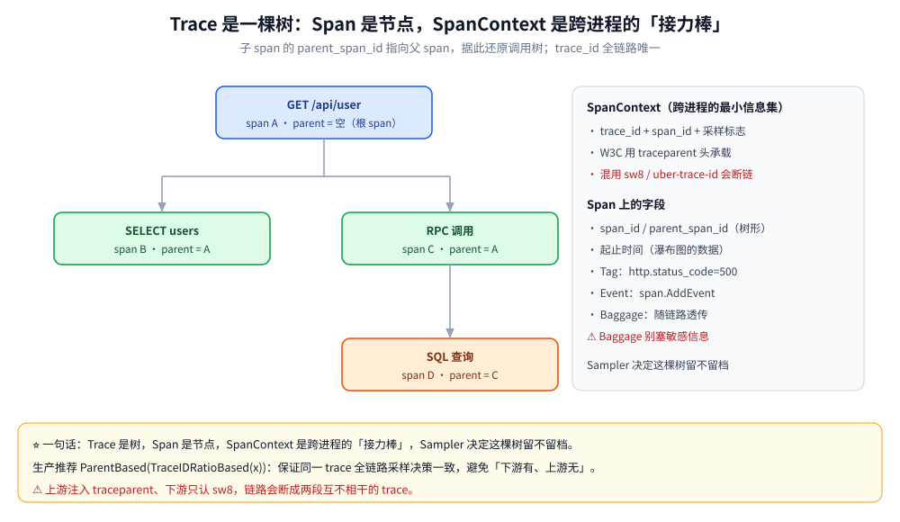
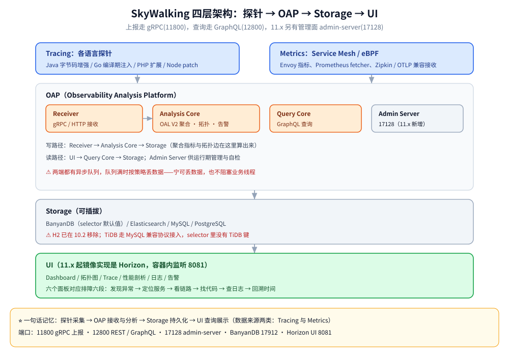
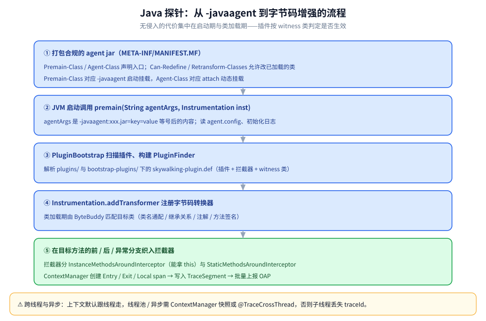
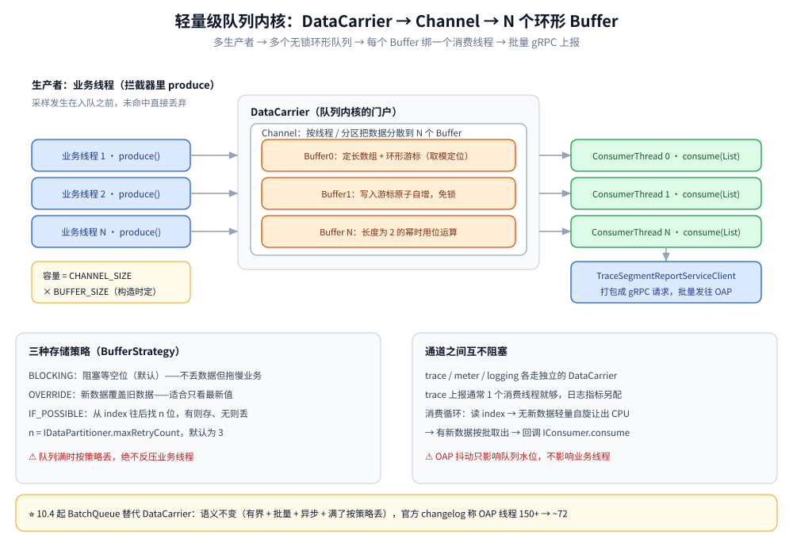
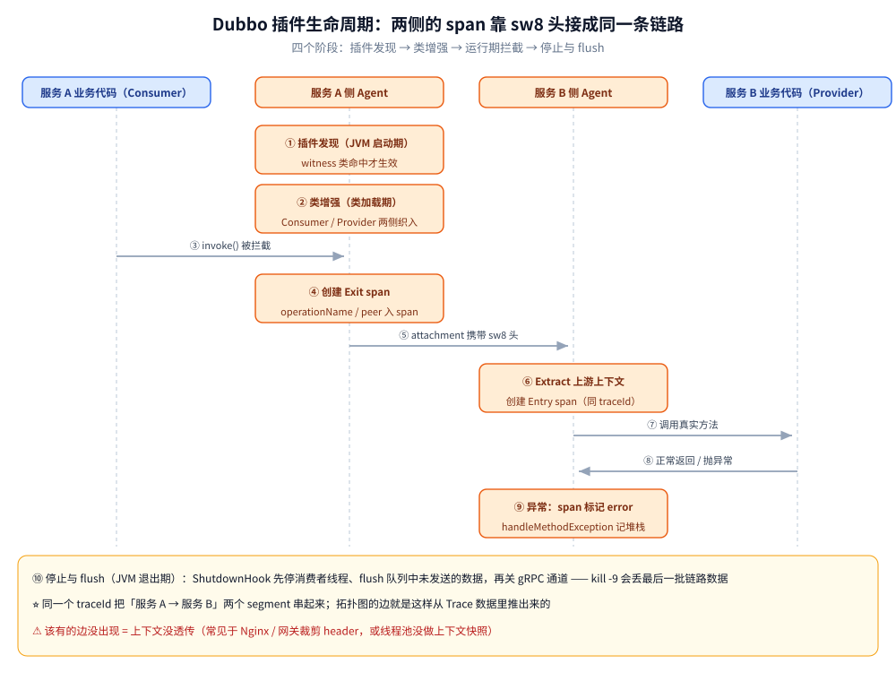
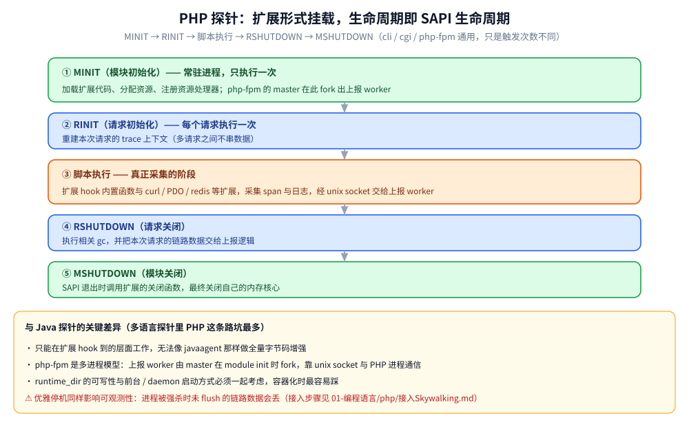

# SkyWalking 链路追踪与 APM

> 探针式 APM 的完整拆解：TraceSegment 与 span 树的核心概念、OAP 四层架构与数据流、Java / Go / PHP / Node.js 四类探针的实现原理（含轻量级队列内核与 Dubbo 插件生命周期）、UI 六大面板的读法、部署形态与本机 11.0.0 实跑结论。
>
> ⭐ 边界先说清：本篇讲**探针式 APM**（SkyWalking 自有协议 + Agent）。「OTel 路线怎么落地」的完整推导见 [Jaeger.md](Jaeger.md)；「三支柱怎么选、五层怎么配、UI 怎么比」见 [可观测性选型.md](可观测性选型.md)；**指标数学**（分位数怎么算才可聚合，APM 面板的 P99 曲线同源）不在本篇展开。各语言的接入代码按语言拆成分册，见第七节。
>
> 内容整理自个人学习笔记。**当前参考版本为 11.0.0**（本机 Docker 实跑：OAP 11.0.0 + BanyanDB 0.11.0 + `apache/skywalking-ui:latest`），版本差异与实测读数见第五节。

SkyWalking 是 Apache 顶级项目，一个针对分布式系统的 **APM（应用性能监控）与可观测性分析平台（OAP）**。它由 **语言探针（Agent）+ OAP 流式分析后端 + Storage + UI** 四层组成，提供从分布式拓扑图到 Trace、指标、日志的关联分析与告警。它最大的特征是 **探针式无侵入**：Java 侧靠字节码增强，几乎零改码就能拿到方法级调用链。

覆盖内容：核心概念 → 架构与数据流 → 探针实现（Java / Go / PHP / Node.js）→ UI 面板 → 部署与采样 → 与 OTel 的边界 → 使用方法 → 常见追问。

---

## 一、SkyWalking 是什么？Trace / Segment / Span 怎么分层？

**本节要点**：SkyWalking 比 Jaeger / OTel 多一层「服务实例内的采集单元」（TraceSegment），这是它所有上报、接链、拓扑推导的基础；概念对齐了，后面读探针源码才不会绕。

| 概念 | 说明 |
|---|---|
| **Trace** | 一条完整调用链，`traceId` 全局唯一；跨服务时由 `sw8` 头串起来 |
| **TraceSegment** | ⭐ 一次请求在**一个服务实例内**的采集单元。跨进程时每个服务各产生一个 segment，靠 `refs[]` 串成整条 trace |
| **Span** | 一次操作，含 `spanId`、`parentSpanId`、起止时间、tags、logs |
| **Span 类型** | **Entry**（本服务入口）/ **Exit**（调出去的依赖）/ **Local**（服务内部方法） |
| **Service** | 一组提供相同服务的实例（按 `serviceId` 区分） |
| **Instance** | 单个服务实例（进程级，含 `serviceInstanceId`） |
| **Endpoint** | 具体操作，如 `GET /api/user`、`SELECT users` |
| **Layer** | 层，代表计算机科学的抽象框架（`OS_LINUX` / `K8S` / `MESH`），按角色组织服务与指标 |
| **Service Hierarchy** | ⭐ 10.x 引入，定义跨层逻辑相同服务的关系，支持跨层跳转 |
| **OAP** | Observability Analysis Platform，接收数据做流式分析、聚合、告警 |
| **MQE** | Monitoring Query Expression，v10+ 默认告警查询语法（`expression` 字段，见第 4.6 节） |

⭐ 层级理解：**Trace 是完整链路，TraceSegment 是单服务内的片段，Span 是具体操作**。三者与 Jaeger 的 trace / span 完全对应，只是 SkyWalking 多强制了「服务实例内的 segment」这一层——上报以 segment 为单位，一个进程不会替另一个进程造 span。



### 1.1 与 Jaeger / OTel 的概念对照

**本节要点**：语义几乎一一对应，真正会咬人的是**传播头**和**采样旋钮的粒度**。

| 概念 | SkyWalking | Jaeger / OTel | 说明 |
|---|---|---|---|
| 全局链路 ID | `traceId` | `trace_id` | 语义相同 |
| 跨进程传播头 | `sw8` | W3C `traceparent` | ⚠️ 格式不同，混用会断链 |
| 单服务采集单元 | TraceSegment | Span 的父子关系（无强制 segment 层） | SkyWalking 以 segment 为上报单元 |
| 服务内 span | Span（Entry / Exit / Local） | Span（SERVER / CLIENT / INTERNAL） | 一一对应 |
| 采样 | `agent.sample_n_per_3_secs`（每 3 秒 N 条） | SDK Sampler（比例 / ParentBased） | 命名与粒度不同 |
| 组件标识 | `componentId`（`component-libraries.yml`） | `attribute` 里的组件名 | OAP 靠它识别框架 |

⚠️ **混用坑**：上游注入 `traceparent`、下游只认 `sw8`，链路会断成两段互不相干的 trace。全链路头格式必须端到端统一（传播机制见 [HTTP与gRPC.md](../../02-计算机基础/网络/HTTP与gRPC.md)）。

---

## 二、数据怎么流？四层架构与各自的职责

**本节要点**：一句话记忆——**探针负责采集，OAP 负责接收与分析，Storage 负责持久化，UI 负责查询展示**。

```text
数据来源：Tracing（各语言探针）+ Metrics（Service Mesh / eBPF / 第三方）
                        │
                        │ gRPC（默认 11800）/ HTTP（含 Zipkin、OTLP、Jaeger 格式兼容）
                        ▼
┌─────────────────────────────────────────────────────────────────┐
│ OAP（Observability Analysis Platform）                            │
│  Receiver 接收 → Tracing / Metric 解析 → Analysis Core 聚合分析    │
│                                    ↓                              │
│                    Storage Implementors（写入）                    │
│                                    ↓                              │
│  Query Core（GraphQL 对外查询）+ Admin Server（11.x，:17128）       │
└───────────────────────┬─────────────────────────────────────────┘
                        │
                        ▼
        Storage：BanyanDB（默认）/ Elasticsearch / MySQL / PostgreSQL
                        │
                        │ GraphQL
                        ▼
        UI：Dashboard / 拓扑 / Trace / 性能剖析 / 日志 / 告警
```



### 2.1 组件职责

| 组件 | 职责 | 备注 |
|---|---|---|
| **Agent** | 各语言探针，采集 span 与指标 | Java 字节码增强 / Go 编译期注入 / PHP 扩展 / Node.js monkey patch |
| **Receiver** | 接收上报（gRPC / HTTP） | 兼容 SkyWalking 原生、Zipkin v1/v2、OTLP、Prometheus 抓取格式 |
| **Analysis Core** | 聚合指标、构建拓扑、告警判断 | 用 OAL（Observability Analysis Language）定义聚合规则；11.0.0 默认 **OAL Engine V2** |
| **Query Core** | 对外提供统一查询接口 | UI 通过 GraphQL 查询 |
| **Storage** | 持久化 | 可插拔；**H2 已在 10.2 移除**，11.0.0 的 selector 只剩 banyandb / elasticsearch / mysql / postgresql |
| **Admin Server** | 11.x 新增的管理面（运行期规则、按需写入、自检状态） | 默认 `0.0.0.0:17128`，⚠️ 只能暴露在内部网络 |
| **UI** | 展示 | 与 OAP 通过 GraphQL 通信 |

### 2.2 探针侧与 OAP 侧都有异步缓冲

两端都用「有界队列 + 批量消费」把「产生数据」和「发送数据」解耦，语义与策略选型（`BLOCKING` / `OVERRIDE` / `IF_POSSIBLE`）统一在**第 3.2 节轻量级队列内核**讲，此处不重复。

⭐ 选型取向记住一句：**SkyWalking「宁可丢数据，也不拖慢业务」**——探针侧队列满时默认丢弃，业务线程绝不被阻塞。

### 2.3 架构的两条设计取向

- **面向插件化**：探针增强哪些框架、OAP 接收哪种格式、存储用哪种实现，全都是可插拔扩展点——所以「接入一个新框架」不必改内核。
- **轻量、不以大数据为地基**：OAP 自己做流式聚合（11.0.0 单机实测的 OAP 容器内 OS 线程数约 58，见第 5.2 节），不需要额外部署 Flink / Kafka 才有 APM 能力。
- ⚠️ 它**不是方法级诊断系统**：能追到方法级 span，但抓取方法参数要慎重评估性能开销。

---

## 三、探针怎么做到无侵入？（Java / Go / PHP / Node.js）

**本节要点**：SkyWalking 最强的地方在 Java Agent——`java.lang.instrument` + ByteBuddy + 无锁队列内核 + 插件生命周期四件事凑齐，才有「改一行启动参数就有全链路」。其余语言的体验都是这四件事的取舍组合。

### 3.1 Java：javaAgent 与字节码增强

**a. 什么是 javaAgent**

javaAgent 是 JVM 提供的一种「JVM 级别插件」机制。JDK 1.5 引入了 `java.lang.instrument` 包，允许外部程序在**类加载时拿到 `Instrumentation` 实例并修改字节码**。两种挂载形态：

- **启动挂载**：`java -javaagent:/path/skywalking-agent.jar -jar app.jar`，JVM 在 `main` 方法执行**之前**调用 agent 的 `premain`。
- **动态挂载（attach）**：通过 Attach API 在运行期把 agent 挂到已启动的 JVM 上，调用 agent 的 `agentmain`。

对业务的价值就是**无侵入**：不改一行业务代码，只改启动参数。SkyWalking Java 探针正是靠它实现的。

**b. javaAgent 的实现过程**

1. **打包成合规的 agent jar**。核心是 `META-INF/MANIFEST.MF`，必须声明入口类和能力：

   ```text
   Premain-Class: org.apache.skywalking.apm.agent.SkyWalkingAgent
   Agent-Class: org.apache.skywalking.apm.agent.SkyWalkingAgent
   Can-Redefine-Classes: true
   Can-Retransform-Classes: true
   ```

   `Premain-Class` 对应 `-javaagent` 启动挂载，`Agent-Class` 对应 attach 动态挂载；两个 `Can-*` 声明允许对已加载的类做重定义 / 重转换。

2. **premain 被调用**，签名固定：

   ```java
   public static void premain(String agentArgs, Instrumentation inst)
   // 或 public static void premain(String agentArgs)  // 拿不到 inst 时退化
   ```

   `agentArgs` 就是 `-javaagent:xxx.jar=key=value` 里等号后面的内容；`inst` 是改写字节码的唯一入口。

3. **初始化 agent**（SkyWalking 的流程）：解析 `agentArgs` 并读取 `agent.config`；初始化日志（`logging.dir`、`logging.level`）；`PluginBootstrap` 扫描 `plugins/`、`bootstrap-plugins/` 下所有 jar，解析其中的 `skywalking-plugin.def`，构建 `PluginFinder`（插件定义 + 拦截器 + witness 类）；建立到 OAP 的 gRPC 通道（`collector.backend_service`），注册服务与实例、拉取动态配置与性能剖析任务；最后调用 `Instrumentation.addTransformer(...)` 注册字节码转换器。

4. **字节码增强（ByteBuddy）**。底层使用 **ByteBuddy**（SkyWalking 自带的定制版 `net.bytebuddy`）：transformer 里通过 `AgentBuilder` 匹配目标类，在目标方法的前、后、异常分支织入回调——匹配规则由插件定义（类名通配、继承关系、注解、方法签名）；织入点是 `beforeMethod` / `afterMethod` / `handleMethodException`；回调实现分两种拦截器：`InstanceMethodsAroundInterceptor`（实例方法，能拿到 `this`）与 `StaticMethodsAroundInterceptor`（静态方法）。拦截器内部通过 `ContextManager` 创建 **Entry / Exit / Local** span 写入当前线程的 `TraceSegment`，并在 Exit 时把上下文注入下游请求头（`sw8`）。

5. **运行期**：类加载 → transformer 匹配 → 织入 → 拦截器采集 span → span 写入轻量级队列内核 → 消费者批量上报 OAP。为不影响启动性能，已加载的核心类通过 `retransformClasses` 补增强。



**c. 与其他 javaAgent 的兼容性坑**

ByteBuddy 每次生成不同随机名称的辅助类，与其他 javaAgent（APM、热部署、Mock 框架）同时使用时可能导致 retransform 冲突。解决方式是开类缓存：

```bash
-Dskywalking.agent.is_cache_enhanced_class=true
-Dskywalking.agent.class_cache_mode=MEMORY
```

### 3.2 轻量级队列内核

**a. 什么是轻量级队列内核**

轻量级队列内核是基于无锁环状队列的生产者——消费者内存消息队列，主要作用是在生产者和消费者之间创建一个缓冲的异步内存队列，**防止因 SkyWalking 收集数据方生产数据的速度远大于往后端发送数据的速度造成数据积压和生产方阻塞。**

组成元素有：

- **Buffer**：Buffer 是 SkyWalking 队列内核中数据的载体，队列之中的数据都存储在 Buffer 中。
- **Channel**：Channel 是管理 Buffer 的载体。
- **DataCarrier**：DataCarrier 是轻量级队列内核的门户，队列内核通过 DataCarrier 与 SkyWalking 的其他模块进行交互与合作。

结构上：一个 `DataCarrier` 对应一个 `Channel`，一个 `Channel` 持有 N 个 `Buffer`，每个 `Buffer` 有独立的消费者线程，形成「多生产者 → 多个环形队列 → 多消费者」的并行结构，从而在并发写入时避免单一队列的竞争。



**b. 上报的数据结构**

队列里流动的「数据」是探针生成的数据结构体，最核心的是 trace 场景的 `TraceSegment`：

```text
TraceSegment                        // 一次请求在「一个服务实例内」的采集单元
 ├─ traceId / segmentId             // 全局链路 ID / 本次 segment 的 ID
 ├─ serviceId / serviceInstanceId   // 服务与实例标识（来自探针配置）
 ├─ refs[]                          // 上游引用：跨进程/跨线程把链路接起来的依据
 └─ spans[]
      ├─ spanId / parentSpanId      // 树形关系的来源
      ├─ spanType: Entry|Exit|Local // 入口 / 出口 / 本地
      ├─ operationName / peer       // 操作名（HTTP 路径、SQL 等），peer 为对端地址
      ├─ componentId                // 组件标识（对应 OAP 的 component-libraries.yml）
      ├─ startTime / endTime        // 耗时瀑布图的原始数据
      └─ tags[] / logs[] / events[] // 标签、日志、事件（异常信息等）
```

![TraceSegment 数据结构：refs[] 接链、spans[] 还原树形](images/TraceSegment数据结构.svg)

指标（meter）与日志（logging）也各走独立的 DataCarrier，互不阻塞。队列本身的数据结构要点：

- **Buffer** = 定长数组（`Object[]`）+ 环形游标。写入时游标原子自增，按数组长度**取模**定位槽位（长度为 2 的幂时可用位运算），因此**入队不需要加锁**。
- **Channel** 持有多个 Buffer，按写入线程（或分区）把数据分散到不同 Buffer，降低写竞争。
- **采样发生在入队之前**：Java 侧先按 `agent.sample_n_per_3_secs` 采样，未命中的直接丢弃，不占用队列。

**c. 如何上报数据**

消息产生主要有 **DataCarrier 的初始化** 和 **API 向队列生产消息** 两部分。

1）**DataCarrier 的初始化**：

```java
carrier = new DataCarrier<TraceSegment>(CHANNEL_SIZE, BUFFER_SIZE);
carrier.setBufferStrategy(BufferStrategy.IF_POSSIBLE);
carrier.consume(this, 1);
```

- 设置 **DataCarrier** 的 **Channel** 中 **Buffer** 队列的数量（`CHANNEL_SIZE`）和每一个 Buffer 队列的长度（`BUFFER_SIZE`）；
- 将 **BufferStrategy** 策略设置为 **IF_POSSIBLE**；
- 设置当前 **DataCarrier** 的消费者（`consume`，第二个参数是消费者线程数）。

2）**通过 API 向队列中生产消息**：调用 `carrier.produce(segment)`，数据写入当前线程归属的 Buffer，返回值可直接反映本次写入是否成功——在 `IF_POSSIBLE` 策略下队列满时返回 `false` 并丢弃，业务线程**不会**被阻塞。这也是 SkyWalking「宁可丢数据，也不拖慢业务」的设计取向。

**d. 如何消费数据**

- `DataCarrier.consume(IConsumer consumer, int num)` 把 Carrier 注册给消费者，`num` 是消费线程数。SkyWalking 里 trace 上报通常只用 1 个消费线程，日志、指标各自独立配置，避免互相拖累。
- 内部由 `IDriver`（`ConsumeDriver`）+ `ConsumerThread` 组织：每个 Buffer 绑一个消费线程，线程内是一个循环——① 读取 Buffer 当前的可读 `index`；② 与上次消费位置比较，**没有新数据就短暂等待 / 让出 CPU**（只做轻量自旋等待，绝不反过来阻塞生产者）；③ 有新数据就按批取出组成 `List<T>`，回调 `IConsumer.consume(List<T>)`；④ 更新消费位置，继续下一轮。
- SkyWalking 里 `IConsumer` 的实现做的是：把这一批 `TraceSegment` 打包成 gRPC 请求，通过 `TraceSegmentReportServiceClient` **批量发送**给 OAP，OAP 收到后由 Analysis Core 处理并写入 Storage。之所以要「批量 + 异步 + 有界队列」，就是把「产生数据」和「发送数据」彻底解耦：OAP 抖动或网络变慢时只影响队列水位，不影响业务线程；代价是队列写满后按策略丢数据。

**e. 消息存储策略**

数据存储有下面三种策略：

- **BLOCKING**：循环阻塞等待当前 Buffer 队列中对应的 index 空间为空（默认策略）。在循环阻塞之中会回调 Buffer 的回调方法，用户可以通过设置回调方法来感知到是否有数据被 BLOCKING。
- **OVERRIDE**：用新数据覆盖旧数据。
- **IF_POSSIBLE**：从当前 **index** 起往后找 n 位，如果有空余，保存下来；如果没有，丢弃掉。

**n** 是由 **IDataPartitioner** `dataPartitioner` 接口的 **maxRetryCount** 来决定的，默认为 3。对比一下就知道选型取向：`BLOCKING` 保证不丢数据但会阻塞业务线程（默认值只适合低吞吐场景），`IF_POSSIBLE` 宁可丢数据也不阻塞，`OVERRIDE` 适合「只关心最新值」的指标类数据。

⭐ **版本更新**：官方 10.4.0 的 changelog 里 **BatchQueue 替代了 DataCarrier**（同时把 OAP 的线程数从 150+ 降到 ~72，约 −50%）。队列内核的**语义不变**——仍是「有界 + 批量 + 异步 + 满了按策略丢」，变的是一层实现与线程模型；读老资料看到 DataCarrier 不必怀疑，读 10.4+ 源码看到 BatchQueue 也认得它。

### 3.3 Dubbo 插件的生命周期实现流程

Dubbo 插件的生命周期可拆成四个阶段，理解它就能理解所有 Java 插件：

1. **插件发现（JVM 启动期）**：agent 扫描 `plugins/` 与 `bootstrap-plugins/` 下的 jar，解析各自的 `skywalking-plugin.def`，构建 `PluginFinder`。插件除了「要增强哪些类」，还会声明 **witness 类**（Dubbo 插件的 witness 类是 Dubbo 自身的核心类，如 `org.apache.dubbo.rpc.Invoker`）：**只有宿主应用真的加载了这些类，插件才被认为生效**，避免增强一个根本没用的框架、平白增加启动开销。
2. **类增强（类加载期）**：Dubbo 的协议类 / 调用入口类被加载时 `PluginFinder` 匹配命中，ByteBuddy 在目标方法前后织入拦截器。拦截点分两侧——**Consumer 侧**（发起调用的一方）与 **Provider 侧**（被调用的一方）。
3. **运行期拦截**：Consumer 发起调用前创建 **Exit span**，并通过 Dubbo 的隐式参数（attachment）把上下文以 `sw8` 头的形式带出去；Provider 收到请求后读取 attachment 创建 **Entry span**，从而用同一个 `traceId` 把「服务 A → 服务 B」两个 segment 串起来，拓扑图的边也是这样产生的；调用抛异常时走 `handleMethodException`，把 span 标记为 error 并记录异常堆栈。
4. **停止与 flush（JVM 退出期）**：agent 启动时注册了 ShutdownHook，JVM 退出时触发 AgentService 停止——先停消费者线程并 **flush 队列中还未发送的数据**，再关闭 gRPC 通道。**这也意味着 `kill -9` 会导致最后一批链路数据丢失**，优雅停机对可观测性同样重要（PHP 侧的相关讨论见 [接入Skywalking.md](../../01-编程语言/php/接入Skywalking.md)）。



### 3.4 上下文传播的三条铁律

- **跨进程**：Exit span 结束时把上下文注入下游请求头（HTTP 用 `sw8` 头，Dubbo 用 attachment，gRPC 用 metadata，MQ 放消息属性）。⚠️ 中间有 Nginx / 网关裁剪 header，链路就在这里断成两段。
- **跨线程**：上下文默认跟线程走，线程池 / 异步需要 `ContextManager` 快照机制或 `@TraceCrossThread` 注解——否则子线程丢失 traceId，这是接入后最常见的问题之一。
- **优雅停机**：ShutdownHook 先 flush 队列再关 gRPC 通道；`kill -9` 会丢最后一批数据（见第 3.3 节第 4 阶段）。

### 3.5 Go：编译期 AST 注入

⚠️ **Go 没有 classloader，「运行时无侵入」在 Go 上不成立**。SkyWalking Go 采用**编译期 AST 注入**：

```bash
go build -toolexec="/path/go-agent" -a -o demo .
```

通过 `-toolexec` 拦截编译过程，在 AST 里插入探针代码。代价是三条：配置在编译期写死进二进制，**运行期改不了也摘不掉**；插件只覆盖官方列出的框架版本区间；需要 Go ≥ 1.18，module 路径不能含空格 / 中文。「为什么 Go 团队更该走 OTel 路线」的选型判据在 [可观测性选型.md](可观测性选型.md) 第二节，本篇不重述；机制与落地细节见 [接入Skywalking.md](../../01-编程语言/go/接入Skywalking.md)。

### 3.6 PHP：扩展形式与 SAPI 五阶段

PHP 探针不是 JVM 那种 agent，而是以 **PHP 扩展（.so）** 形式存在，因此它的生命周期就是 **PHP 的 SAPI 生命周期**（cli / cgi / php-fpm 都一样，只是各阶段被触发的次数不同）：**MINIT → RINIT → 脚本执行 → RSHUTDOWN → MSHUTDOWN**。

以 Nginx 服务器为例，web 模式下：

1. **MINIT（模块初始化）**：PHP 随服务器启动，通过 php-fpm（SAPI）与 Nginx 相连；加载每个扩展的代码并调用其模块初始化方法（MINIT），分配资源、注册资源处理器（**常驻进程**，只执行一次）。
2. **RINIT（请求初始化）**：PHP 等待 SAPI 请求要处理的请求，每个请求都会执行 RINIT，相当于重新调用每个扩展的模块请求初始化函数（每个请求执行一次）。
3. **PHP 脚本执行**：业务代码运行，扩展在此阶段采集 span 与日志，经 unix socket 交给 master 在启动时 fork 出的上报 worker（对接细节见 [接入Skywalking.md](../../01-编程语言/php/接入Skywalking.md)）。
4. **RSHUTDOWN（请求关闭）**：脚本结束，PHP 调用每个扩展的模块请求关闭方法（RSHUTDOWN），执行相关的 gc 操作，并把本次请求的链路数据交给上报逻辑。
5. **MSHUTDOWN（模块关闭）**：如果要关闭对应的 SAPI（这里是 fpm），PHP 调用每个扩展关闭函数（MSHUTDOWN），并最终关闭自己的内存核心。



与 Java 的差异要点：PHP 扩展只能在扩展能 hook 到的层面工作（内置函数、curl / PDO / redis 等扩展，以及配合 SDK 对框架层做适配），**无法像 javaagent 那样全量字节码增强**；且 php-fpm 是多进程模型，上报 worker 由 master 在 module init 时 fork、靠 unix socket 与 PHP 进程通信，因此 `runtime_dir` 的可写性与前台 / daemon 启动方式必须一起考虑（见 [接入Skywalking.md](../../01-编程语言/php/接入Skywalking.md) 的「容器化接入的四个坑」一节）。

### 3.7 Node.js：monkey patch

1. **加载（越早越好）**：要求探针在业务代码之前加载——`node --require skywalking-node app.js`，或在入口文件第一行 `require('skywalking-node')`。**时机错过就无法劫持**：框架模块若已被 require 过，后续再挂探针就抓不到这个模块了。
2. **劫持（monkey patch）**：基于 Node 的模块加载机制打补丁（对 `Module._load` / `require` 做 hook），在 http/https、express/koa、mysql/pg/redis 等模块被加载时把原始实现包一层。
3. **上下文传播**：用 Async Hooks（旧）或 AsyncLocalStorage（新）维护异步调用上下文，让 `async/await`、回调、定时器里都能拿到当前 trace 上下文。
4. **上报与停止**：请求结束时把 segment 批量上报 collector（v8 之后走 gRPC，早期版本是 HTTP）；进程退出前 flush 未发送的队列，与 Java 的 ShutdownHook 语义一致。

> ⚠️ 上述包名与 API 形态按社区常见写法描述，**本机未实测 Node 探针**；以官方 `skywalking-nodejs` 仓库当前 README 为准。前端（浏览器）探针 `skywalking-client-js` 属于同类「在能 hook 的层面采集」的路子，本篇不展开。

---

## 四、UI 六个面板分别解决什么问题？

**本节要点**：六个面板是排障链条上的六段——**Dashboard 看异常 → 拓扑图看调用关系 → Trace 看具体链路 → Profile 看代码级瓶颈 → 日志反查根因 → 告警回溯时间**。三个 UI（SkyWalking / Jaeger / Grafana）的定位差异与组合建议统一在 [可观测性选型.md](可观测性选型.md) 第六节讲，本篇只讲 SkyWalking 面板怎么读。

先用五个真实场景对齐「面板 ↔ 问题」：

| 场景 | 用哪些面板、看到什么 |
|---|---|
| **正常请求** | Trace：一条完整链路从入口服务一直串到 DB / 下游 RPC，用来确认「服务间是否连通、上下文是否传递成功」 |
| **服务不可用** | 拓扑图节点变红 + 告警面板出现响应时间 / 成功率类告警，Trace 里能直接看到失败的那个 span |
| **慢 SQL** | Trace 中 `MySql/DBI/PreparedStatement/execute`、`MySQL/JDBC` 这类 span 的耗时一眼可见，配合性能剖析定位到具体语句 |
| **日志关联** | 日志面板按 Trace ID 反查，把「业务日志」和「调用链路」关联到同一次请求上 |
| **告警触发** | 告警面板列出触发记录（哪个服务 / 哪个端点、触发了哪条规则、什么时候），可直接跳转到对应的服务或端点 |

### 4.1 Dashboard

Dashboard 是「先看整体，再决定往哪钻」的第一落点，顶部可切时间范围（含时区）与自动刷新，正文分 **Service / Instance / Endpoint** 三个 Tab。以 `Service` 维度为例，主要看六块内容：

- **Services Load (CPM, calls per minute)**：服务每分钟调用量，判断流量分布与突增突降。
- **Slow Services (ms)**：慢服务排行，优先点名「谁拖慢了整条链路」。
- **Un-Health Services (Apdex)**：Apdex 不健康的服务。Apdex 综合了成功 / 失败与响应时间，数值越低越差（0.3045、0.5103 属于明显不健康）。
- **Slow Endpoints (ms)**：慢端点排行，形如 `服务 : 端点`，比慢服务更精确，能直接指到某个 URL / 接口。
- **Global Response Latency Percentiles**：全局响应延迟分位数曲线，图例为 **P50 / P75 / P90 / P95 / P99**。**P99 是判断「长尾是否恶化」最常用的指标**——平均值会被大量快请求拉平，P99 才能暴露少数用户正在忍受的慢。
- **Global Heatmap**：热力图，纵轴为响应时间区间、颜色深浅代表请求密度，用来发现「偶发但集中」的慢请求带。

`Instance` 维度看多实例是否均衡（某台机器异常会先体现为它那一列延迟偏高）；`Endpoint` 维度看单接口的延迟与成功率。

**典型用法：Service 榜找慢服务 → Slow Endpoints 锁定接口 → 去 Trace 捞该接口的慢请求看 span 瀑布。**

### 4.2 拓扑图

拓扑图把「服务 + 中间件」画成有向图：节点是服务 / 实例 / 数据库 / 消息队列，边是调用关系，是排查跨组问题最直观的图。

**节点的颜色与告警含义**（结合告警规则理解）：

- **绿色（正常）**：所选时间窗内没有触发的告警，各项指标在阈值内。
- **红色（告警 / 异常）**：该服务触发了告警（如响应时间 P99 超阈值、成功率下降），或被标记为 unhealthy；边变红通常表示**调用方到被调方这条链路**上出现了告警。
- **灰色 / 无色（未知）**：该时间窗内没有数据上报（服务没被访问、探针未接入、或刚重启尚未注册）。

使用方式：用左上角 **Service Group / 服务名** 下拉框限定范围；悬停节点显示该服务的简化指标（CPM、成功率、延迟），点击进入服务详情，再点端点进入 Trace（节点大小通常与 CPM 正相关）。

⚠️ **拓扑图的边是从 Trace 数据里「推」出来的**——只有服务间的调用被探针采集到、且上下文（`sw8` 头）正确传递时，边才会出现。所以「该有的边没出现」往往意味着上下文没透传（例如经过 Nginx / 网关时 header 被裁剪，正是 [可观测性选型.md](可观测性选型.md) 第 1.1 节里那种「三方相互推诿」的典型场景）。

### 4.3 Trace

Trace 面板回答「这一次请求到底发生了什么」，界面分三栏：

- **左侧端点列表**：按耗时排序，每行是「端点 + 耗时 + 时间」，用于快速找到最慢的请求；顶部可按 Trace ID、端点关键字、时间范围过滤。
- **右上 Span 树（调用树）**：把一次请求拆成树形结构，缩进表示父子关系：

  ```text
  PrintServiceV2$Processor$CreatePdfByDocumentId   ← 入口 Entry span
   ├─ MySql/DBI/PreparedStatement/execute          ← Exit span（DB），共 2 次
   ├─ /v2/common/object/upload                     ← Exit span（HTTP 下游）
   └─ MySql/DBI/PreparedStatement/execute          ← Exit span（DB）
  ```

- **右下耗时瀑布图**：横轴为时间，每个 span 是一根条，条长即耗时。看瀑布图有两个目的：**找最长的条（瓶颈）**，以及**找「自己很慢」的条**——SkyWalking 区分 **Duration**（总耗时，含子调用）与 **Self Duration**（自身耗时），self 时间大的 span 才是真的在干活（或真的卡住了），而不是在等下游。

其他常用操作：点击 span 展开 tags（HTTP 状态码、SQL 语句、peer 地址等）；「查看日志」按 Trace ID 跳到日志面板；「保存为图片」用于贴到工单或群里。

### 4.4 性能剖析（Profile）

「性能」面板对应的是**性能剖析（Profile）**，与 Dashboard 的性能指标不同：Dashboard 看的是 P99、慢端点这类**结果指标**，Profile 是**对运行中的代码做采样，直接抓出慢在哪一行、哪个线程栈**。

- **左侧 Task List（任务列表）**：在 UI 顶部「新建任务」创建剖析任务，参数一般是「服务 + 端点 + 持续时间 + 采样周期」。任务执行期间才会产生数据，`No Data` 表示当前时间窗没有任务在跑。
- **右侧结果区**有三张表：
  - **Span 表**：`Span / Start Time / Exec(ms) / Exec(%) / Self(ms) / API / Service / Operation`。`Exec(%)` 是该方法占整个请求耗时的比例，从高到低排下来就是「时间都花在哪了」。
  - **Sampled Traces**：被采样的具体请求列表。
  - **Thread Stack**：`Thread Stack / Duration(ms) / Self Duration(ms) / Dump Count`，把采样期间抓到的线程栈聚合起来。**同一个栈被反复 dump 到（Dump Count 高、Duration 接近采样时长）说明请求长时间卡在这个调用栈上**，这是定位代码级瓶颈最有力的证据。

典型用法：Dashboard 发现某端点 P99 高 → 针对该端点发起 Profile 任务 → 在 Span 表里找 `Exec(%)` / `Self(ms)` 最大的方法 → 在 Thread Stack 里看它卡在哪个下游或哪段逻辑。⚠️ Profile 有额外开销（要 dump 线程栈），只对目标端点短时间开启。

### 4.5 日志

日志面板解决「日志在业务组手里、链路在 APM 里，两边对不上」的问题，做法是把日志**按 Trace 上下文上报到同一套存储**（Java 侧由 log4j / logback 的 toolkit 上报，PHP 侧见 [接入Skywalking.md](../../01-编程语言/php/接入Skywalking.md) 的 PSR-3 日志上报与 `inject_context`）。

查询条件：**Service / 实例** 限定服务与实例；**Trace ID** 是最常用的入口（先从 Trace 面板拿到 traceId，粘贴回日志面板，直接捞出这一次请求的所有日志）；**内容关键词 / 内容不包含关键词** 做正反向过滤；**标签** 按上报时打的 tag 过滤（日志级别、业务标记等）。结果表字段为 `当前服务 / 当前实例 / 时间 / 内容类型 / 标记 / 内容 / 追溯 ID`，**追溯 ID 即 Trace ID**，点进去可回到对应链路。

**标准排查姿势：Trace 找慢 / 失败的 span → 用 traceId 查日志 → 看业务日志里当时在做什么。**

### 4.6 告警

告警规则在 OAP 的 `config/alarm-settings.yml` 中配置（**支持热更新**），UI 只负责展示与订阅；v10+ 起默认规则用 **MQE 表达式**（`expression` 字段）。下面这段是本机 `apache/skywalking-oap-server:11.0.0` 容器内**出厂配置的原样摘录**：

```yaml
rules:
  service_resp_time_rule:
    expression: sum(service_resp_time > 1000) >= 3
    period: 10
    silence-period: 5
    recovery-observation-period: 3
    message: Response time of service {name} is more than 1000ms in 3 minutes of last 10 minutes.
  service_resp_time_percentile_rule:
    expression: sum(service_percentile{p='50,75,90,95,99'} > 1000) >= 3
    period: 10
    silence-period: 5
    message: Percentile response time of service {name} alarm in 3 minutes of last 10 minutes, due to more than one condition of p50 > 1000, p75 > 1000, p90 > 1000, p95 > 1000, p99 > 1000
```

读法：`sum(指标 > 阈值) >= N` + `period` 表示「在最近 `period` 分钟窗口内，按分钟聚合，有 N 个分钟满足条件就告警」；`silence-period` 是同一规则的静默期，避免刷屏；`recovery-observation-period`（11.x 新增）用来压制「恢复抖动」。`webhooks` 定义通知出口（钉钉、飞书、邮件等）。

告警面板按时间倒序列出**已触发的告警记录**，顶部可按「全部 / 服务 / 实例 / 端点」与关键词过滤。⭐ **告警文本是模板化生成的**，读法固定：

- `Percentile response time of service X alarm in 3 minutes of last 10 minutes, due to more than one condition of p50 > 1000, ...` → **服务级分位延迟告警**：P50 / P75 / P90 / P95 / P99 中**任意一个**超阈值就告警（阈值之间是「或」，不是「且」）。
- `Response time of endpoint relation User to (POST)/api/... is more than 1000ms in 2 minutes of last 10 minutes` → **端点间关系告警**：调用方 `User` 到该端点这条**关系边**超阈值。

**排查用法：告警面板确定「什么时候开始坏的」→ 拓扑图看哪个节点变红 → Trace 看第一次报错 / 变慢的 span。**

---

## 五、怎么部署？（本机 11.0.0 实跑）

**本节要点**：三容器（BanyanDB + OAP + UI）在本机 Docker Desktop 起得来的完整过程，以及三个**只有实跑才会撞上**的坑：BanyanDB 必须给 `standalone` 子命令、11.x 的 UI 镜像换成了 Horizon 且环境变量全换、OAP 首次启动要装几分钟 schema。

### 5.1 快速起步（单机，仅开发）

```yaml
services:
  banyandb:
    image: apache/skywalking-banyandb:0.11.0
    # ⚠️ 关键：默认 entrypoint 只打印 help 然后 exit 0，必须显式给 standalone 子命令
    command: standalone
    ports:
      - "17912:17912"

  oap:
    image: apache/skywalking-oap-server:11.0.0
    environment:
      - SW_STORAGE=banyandb
      - SW_STORAGE_BANYANDB_TARGETS=banyandb:17912
    ports:
      - "11800:11800"   # gRPC：Agent 上报
      - "12800:12800"   # REST / GraphQL：UI 查询
      - "17128:17128"   # admin-server（11.x 新增）
    depends_on:
      - banyandb

  ui:
    # ⚠️ 11.x 的 ui 镜像已换成 Horizon（Node BFF）：容器内监听 8081，
    #    配置全部走 HORIZON_* 环境变量，旧版的 SW_OAP_ADDRESS 不再生效
    image: apache/skywalking-ui:latest
    environment:
      - HORIZON_OAP_QUERY_URL=http://oap:12800
      - HORIZON_OAP_ADMIN_URL=http://oap:17128
    ports:
      - "8080:8081"
    depends_on:
      - oap
```

三个实测出来的坑（都是「照旧文档抄就跑不起来」级别）：

1. **BanyanDB 容器秒退**：`docker run apache/skywalking-banyandb:0.11.0` 不带子命令时，打印 usage 后以 **exit 0** 退出，`docker ps` 看起来像「起好了但没了」——必须 `command: standalone`（或 `database` / `stream` 等角色子命令，standalone 适合本机）。
2. **UI 镜像换了实现，且监听 8081 不是 8080**：`apache/skywalking-ui:latest` 现在是 **Horizon**，镜像内 `/app/horizon.yaml` 明确写着配置项一律是 `HORIZON_*` 环境变量（`server.port` 默认 **8081**、`oap.queryUrl` 默认 `http://127.0.0.1:12800`、`oap.adminUrl` 默认 `http://127.0.0.1:17128`）。老教程里的 `SW_OAP_ADDRESS=http://oap:12800` 对它**完全无效**；而端口映射照抄 `8080:8080` 时，宿主机连接会被 **`ECONNRESET`**——容器内 `wget 127.0.0.1:8080` 同样 `Connection refused`（服务其实起在 8081），这个报错很容易被误读成「UI 起不来」。改成 `8080:8081` + 配好两个 `HORIZON_OAP_*_URL` 后，宿主机 `http://127.0.0.1:8080/` 返回 **200** 与 HTML。
3. **Horizon 没有默认账号**：`horizon.yaml` 的注释写明 `HORIZON_AUTH_LOCAL_USERS` 配好之前不存在默认的 admin/admin；认证后端默认 `local`，用户列表默认 `[]`，且密码字段要 **argon2id 哈希**。所以「打开 UI 看大盘」还差一步自备的账号配置（**本次实测只验证到 UI 返回 200，登录进面板未验证**）。
4. **readiness 有指数退避**：OAP 未就绪时 UI 持续输出 `OAP admin unreachable — retrying readiness check`（4 s → 8 s → … 封顶 60 s），OAP 就绪后自动接上，不用重启 UI。

⚠️ **H2 存储已在 10.2 移除**：11.0.0 镜像里 `application.yml` 的 `storage.selector` 只列出 `banyandb`（默认）/ `elasticsearch` / `mysql` / `postgresql`——**没有 H2，也没有 TiDB 键**（TiDB 走 MySQL 兼容协议接入）。本地开发同样用 BanyanDB。

### 5.2 本机实测读数（Docker Desktop，一次冷启动）

| 项 | 实测值 | 说明 |
|---|---|---|
| OAP 镜像 | `apache/skywalking-oap-server:11.0.0` | GraphQL `version` 查询返回 **`11.0.0-6f1fd78`** |
| BanyanDB 镜像 | `apache/skywalking-banyandb:0.11.0` | `standalone` 角色 |
| 首次启动到就绪 | 分钟量级（约 4~6 分钟，受宿主机磁盘影响） | 期间日志刷 `install measure schema <表名>`，本机一次运行累计约 **5.5k 行** |
| OAL 引擎 | `OAL Engine V2 started successfully. Generated 296 metrics classes, 5 dispatcher classes` | 11.0.0 默认已是 **OAL V2** |
| OAP 容器内 OS 线程数 | 稳态 **58**（`ls /proc/1/task \| wc -l`；启动过程中为 34） | 官方 changelog 称 10.4 换 BatchQueue 后 OAP 线程从 150+ 降到 ~72；本机是「容器内 OS 线程」口径，与「OAP 工作线程」不可直接比 |
| GraphQL 探活 | `POST /graphql {"query":"{ version }"}` → `status=200`；`{ listServices { name } }` → `[]` | 空数组是因为还没挂 Agent，属正常 |
| 端口连通 | 宿主机 `:12800` → 404（根路径无资源）；`:12800/graphql` 用 GET → 405 | 说明 REST 面在监听，GraphQL 只收 POST |
| UI | `http://127.0.0.1:8080/` → **`status=200`**，返回 Horizon 的 HTML | 需 `8080:8081` + `HORIZON_OAP_QUERY_URL` + `HORIZON_OAP_ADMIN_URL`；**登录进面板未验证**（无默认账号） |
| OAP 重启（表已存在） | 未再出现 `install measure schema` 日志行 | schema 安装是一次性的，重建 OAP 容器不影响已建表 |

> 复跑方式：compose 文件与容器名（`sw-lab-*`）只在本机 `.workbuddy/tmp/sw-lab/`（已 gitignore，不进仓库），收尾用 `docker stop`，不删容器。

### 5.3 生产形态与采样配置

- **OAP 集群**：无状态，可水平扩；内部通过 gRPC 做流式聚合与遥测数据分片。
- **BanyanDB 集群**：为链路 + 时序模型设计，比 ES 更省资源，支持分层存储（热 / 温 / 冷）。
- **存储后端选择**：BanyanDB（官方推荐，新项目默认）/ Elasticsearch（生态成熟、按 tag 检索强）/ MySQL / PostgreSQL（小规模、复用既有 DB）。**ES 与 BanyanDB 怎么选**看查询模式，判据见 [可观测性选型.md](可观测性选型.md) 第五节。
- **采样旋钮**：`agent.sample_n_per_3_secs=-1` 全采（开发、压测定位）；`=N` 每 3 秒最多 N 条（生产默认，按服务 QPS 与预算设）；`agent.force_sample=true` 强制采样（排障时临时开，用于给错误请求留档）。

⭐ 生产推荐**限制每 3 秒条数**而不是按比例：保证采样决策不受 QPS 波动影响；同时给错误请求配强制采样，否则最需要看的故障反而采不到。「头部采样 vs 尾部采样」的成本权衡见 [Jaeger.md](Jaeger.md) 第 4.3 节与 [可观测性选型.md](可观测性选型.md) 第八节，本篇不重述。

---

## 六、与 OTel / Jaeger 的边界在哪？

**本节要点**：两条路线的差别只在「谁来产生数据」；**选型判据与 UI 对比一律看 [可观测性选型.md](可观测性选型.md)**，本篇只留概念层的一一对齐（第 1.1 节）与一句边界结论。

- **SkyWalking = 探针式 APM**：自有协议（`sw8` + gRPC）+ 自研 Agent，自带拓扑、指标大盘与告警，开箱即用；代价是与自家 Agent / 存储生态绑定。
- **OTel = 采集与协议标准**：埋点标准化、后端可替换（Jaeger / Tempo / SkyWalking 都能收 OTLP）；代价是指标、告警、拓扑要自己配。
- ⚠️ **SkyWalking 也在兼容 OTel**：Receiver 支持 OTLP / Zipkin v1/v2 / Jaeger 格式，但核心体验（拓扑、剖析、动态配置）仍以自研 Agent 为主。
- ⚠️ **不要并行双报**：两套探针 = 双份开销 + 两套 UI，值班同事不知道看哪个。选一条主线，另一条只在按 TraceID 精查时临时打开。

「Java 为主选谁、Go 为主选谁、多语言混合怎么选」的完整推导（含各语言探针成熟度对照表）见 [可观测性选型.md](可观测性选型.md) 第二节。

---

## 七、使用方法

本篇只讲概念、架构、探针原理、面板读法与部署；接入代码按语言拆成分册，与 [接入Skywalking.md](../../01-编程语言/php/接入Skywalking.md) 同一命名口径：

| 语言 | 分册 | 覆盖内容 |
| --- | --- | --- |
| Go | [接入Skywalking.md](../../01-编程语言/go/接入Skywalking.md) | 编译期注入（`-toolexec`）、`toolkit/trace` 手动埋点、跨 goroutine 快照、OTel SDK + OTLP 备选路线、两条路线对比与「不要同开」 |
| Java | [接入Skywalking.md](../../01-编程语言/java/接入Skywalking.md) | `-javaagent` 接入、配置优先级、插件目录机制、Spring Boot / Dockerfile / K8s、日志与跨线程关联、优雅停机 |
| PHP | [接入Skywalking.md](../../01-编程语言/php/接入Skywalking.md) | 扩展安装、php.ini、三种 reporter、容器化四坑、PSR-3 日志上报 |

---

## 延伸追问

- **探针埋点为什么可能拖慢应用？** → 三处成本：埋点本身的 CPU、上下文跨进程传播、上报的 IO。**采样率与批量上报是必须调的旋钮，不是可选项**；队列内核的「满了就丢」正是为了把这三处成本封顶。
- **为什么 SkyWalking 要把 segment 作为上报单元？** → 一个进程只能可靠地知道自己实例内的调用树；跨进程交给 `refs[]` 接链。这样多实例并发写不会互相污染，OAP 侧再按 `traceId` 拼装整条链路。
- **Trace 和 Metrics 怎么分工？** → Metrics 看「整体水位与趋势」，Trace 定位「这一次请求慢在哪一环」，Log 看细节。排障顺序：Metrics 发现异常 → Trace 定位环节 → Log 印证。
- **跨进程上下文怎么传？** → HTTP 走 header、MQ 走消息属性、gRPC 走 metadata、Dubbo 走 attachment。⚠️ 中间件**不透传就是链路断点**，故障时你会看到两条互不相干的 trace（拓扑图上也会缺边，见第 4.2 节）。
- **Duration 和 Self Duration 为什么要分开看？** → Duration 含子调用，Self 才是「这个 span 自己花了多少」。只有 Self 大的 span 才是真的在干活或真的卡住；否则你会去优化一个只是在等下游的服务。
- **线上查询变慢，怎么用面板判断是应用还是依赖？** → 先看该接口的**自身耗时 vs 下游耗时占比**（瀑布图 + Self Duration），再看依赖的系统指标；这一层拆分能省掉大量猜测。
- **为什么 SkyWalking 的拓扑图很有价值？** → 它是从 Trace 数据里「推」出来的，**边出现即证明上下文透传成功**。跨组排查时，拓扑图能直接展示「服务间调用关系断了没有」，而不是各执一词。
- **BanyanDB 和 Elasticsearch 怎么选？** → BanyanDB 官方自研，专为链路 + 时序模型设计，比 ES 省资源、可分层存储；ES 生态成熟、聚合与按 tag 检索强。判据（按查询模式选存储）见 [可观测性选型.md](可观测性选型.md) 第五节。
- **10.x / 11.x 升级要留意什么？** → ① **H2 存储已在 10.2 移除**，试用形态也要换 BanyanDB；② **10.4 起 BatchQueue 替代 DataCarrier**，队列语义不变、线程模型变了；③ **告警默认规则改为 MQE 表达式**（`expression` + `recovery-observation-period`）；④ **11.x 的 UI 镜像换成 Horizon**，环境变量与端口全换（详见第 5.1 节）。
- **Java 侧和其他 javaAgent 冲突怎么办？** → 开 ByteBuddy 类缓存（`-Dskywalking.agent.is_cache_enhanced_class=true -Dskywalking.agent.class_cache_mode=MEMORY`），避免随机类名导致的 retransform 冲突。

---

## 关联

- [可观测性选型.md](可观测性选型.md) — **选型主线**：三支柱定位、五层选型、契合语言与 UI 体验两个横切维度、三套推荐组合
- [Jaeger.md](Jaeger.md) — **本篇的直接对照面**：OTel 路线的 Trace/Span 概念、部署、采样策略
- [接入Skywalking.md](../../01-编程语言/go/接入Skywalking.md) — Go 侧编译期注入与 OTel 备选路线
- [接入Skywalking.md](../../01-编程语言/java/接入Skywalking.md) — Java 侧 `-javaagent` 接入、日志关联、跨线程与优雅停机
- [接入Skywalking.md](../../01-编程语言/php/接入Skywalking.md) — PHP-FPM 侧探针的完整接入步骤
- [HTTP与gRPC.md](../../02-计算机基础/网络/HTTP与gRPC.md) — trace 上下文在请求头里的传播
- [K8s部署与生命周期面试题.md](../部署/k8s/K8s部署与生命周期面试题.md) — OAP / UI 的部署形态与生命周期
- [可观测性 README.md](README.md) — 本目录的学习路径与版本坐标

> 反向引用（本篇被下列文档引到）：[TCP三次握手.md](../../02-计算机基础/网络/tcp/TCP三次握手.md)、[ActiveMQ.md](../../03-数据与中间件/中间件/消息队列/ActiveMQ.md)、[缓存运维与排查.md](../../03-数据与中间件/数据存储/缓存/缓存运维与排查.md)、[缓存问题与方案.md](../../03-数据与中间件/数据存储/缓存/缓存问题与方案.md)、[分布式与微服务.md](../../04-架构与系统/分布式/分布式与微服务.md)
