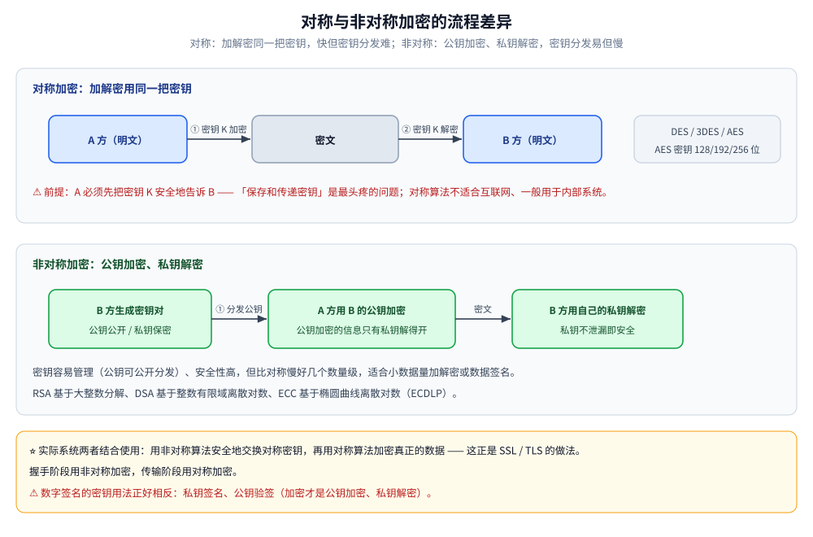
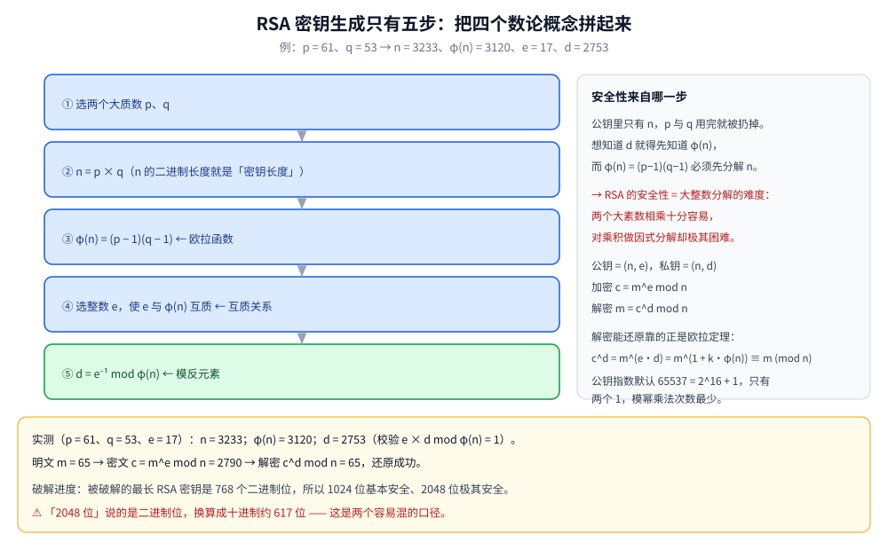
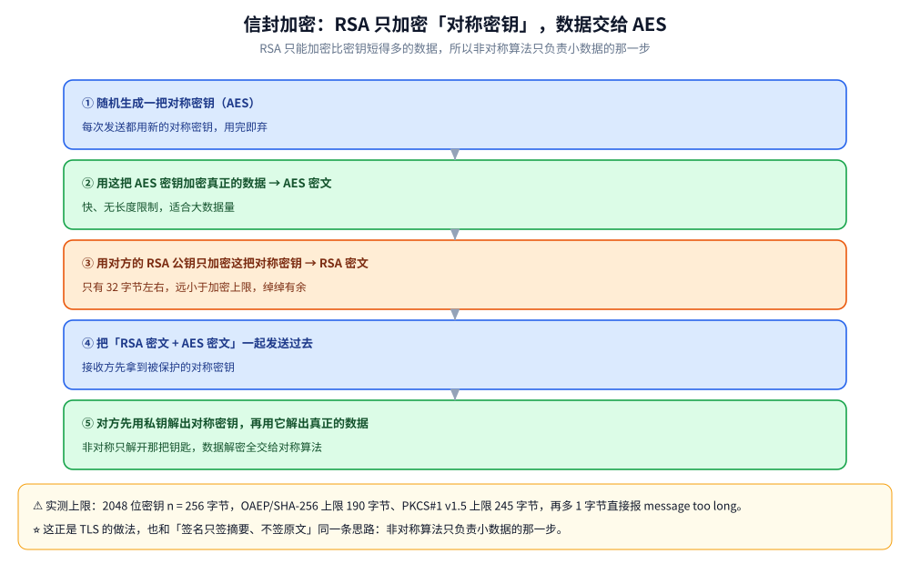

# 加密算法

> 对称、非对称与散列三类算法的清单、优缺点对比，以及密钥长度的选型口径。
>
> 素材来源：博客 [常用加密算法及应用](https://blog.csdn.net/weixin_43837229/article/details/90719470)（2019-05-31）—— 第 1~4 节取该文的算法清单与优缺点对比；**第五节 RSA 原理**补自 [阮一峰的网络日志](https://www.ruanyifeng.com/blog/archives.html)《RSA 算法原理（一）》（2013-06-27）。

---

## 一、加密算法分哪几类？安全要从哪三方面入手？

加密算法分**对称加密**和**非对称加密**：对称加密算法的加密与解密**密钥相同**，非对称加密算法的加密密钥与解密密钥**不同**。此外，还有一类**不需要密钥**的散列算法。

- 常见的**对称**加密算法：DES、3DES、AES
- 常见的**非对称**算法：RSA、DSA、ECC
- 常见的**散列**算法：SHA-1、MD5

对称算法又可分为两类：

| 类型 | 做法 |
|---|---|
| **序列算法 / 序列密码**（流密码） | 一次只对明文中的单个位（有时对字节）运算 |
| **分组算法 / 分组密码** | 对明文的一组位进行运算（运算前将明文分为若干组，再分别对每一组运算，这些位组称为**分组**） |

**安全要从三方面入手**：

1. **认证**用户和服务器，确保数据发送到正确的客户机和服务器
2. **加密**数据以防止数据中途被窃取
3. 维护数据的**完整性**，确保数据在传输过程中不被改变

## 二、常见加密算法各自的特点是什么？

### 2.1 DES

一种**分组密码**，以 64 位为分组对数据加密，密钥长度 **56 位**，加密解密用同一算法。DES 对**密钥保密、公开算法**（包括加密和解密算法），因此只有掌握与发送方相同密钥的人才能解读密文。破译 DES 实际上就是搜索密钥的编码——对于 56 位密钥，穷举法运算次数为 2⁵⁶。

### 2.2 3DES

基于 DES 的对称算法，对一块数据用**三个不同的密钥进行三次加密**，强度更高（但速度更慢）。

### 2.3 AES

密码学中的**高级加密标准**，采用对称分组密码体制：密钥长度至少支持 **128、192、256** 位，分组长度 **128 位**，算法易于各种硬件和软件实现。这是美国联邦政府采用的区块加密标准，用来替代原先的 DES，已被多方分析且被全世界广泛使用。

### 2.4 RSA

基于**大整数因子分解问题**（IFP）。RSA 是目前最有影响力的公钥加密算法，被普遍认为是目前最优秀的公钥方案之一，也是**第一个能同时用于加密和数字签名**的算法，能够抵抗已知的所有密码攻击，已被 ISO 推荐为公钥数据加密标准。

> 原理基石是一个简单的数论事实：**将两个大素数相乘十分容易，但对其乘积做因式分解却极其困难**，因此可以把乘积公开作为加密密钥。
>
> 这四个数学概念（互质、欧拉函数、欧拉定理、模反元素）如何拼成 RSA 的密钥与加解密，见**第五节**。

### 2.5 DSA

基于**整数有限域离散对数难题**。DSA 的一个重要特点是**两个素数公开**——这样当使用别人的 p 和 q 时，即使不知道私钥，也能确认它们是否是随机产生的、有没有做手脚（这一点 RSA 做不到）。

> **与 RSA 的区别**：DSA **只用于签名**，而 RSA 可用于签名和加密。

### 2.6 ECC

基于**椭圆曲线上离散对数计算问题**（ECDLP）。1985 年 N. Koblitz 和 Miller 提出将椭圆曲线用于密码算法，全称 Elliptic Curve Cryptography。ECDLP 是比因子分解问题更难的问题，属指数级难度。

**核心优势——密钥更短**：随着安全等级增加，传统加密法的密钥长度会成指数增加，而 ECC 密钥长度只是**线性增加**。

| 安全等级 | RSA 所需密钥 | ECC 所需密钥 |
|---|---|---|
| 128 位安全加密 | 3,072 位 | **256 位** |
| 256 位安全加密 | 15,360 位 | **512 位** |

ECC 具有如此卓越的按位比率加密性能，预计其特点将成为安全系统关注的重点。

### 2.7 ElGamal

一个基于**迪菲-赫尔曼密钥交换**的非对称加密算法，1985 年由塔希尔·盖莫尔提出。

### 2.8 HMAC

MAC（Message Authentication Code，**消息认证码**算法）是含有密钥的散列函数算法，兼容了 MD 和 SHA 算法的特性，并在此基础上**加上了密钥**，因此 MAC 算法也经常被称作 HMAC 算法。

- HMAC 首先基于**信息摘要算法**，目前主要集合了 MD 和 SHA 两大系列
- HMAC 除了需要信息摘要算法外，还需要一个**密钥**；密钥可以是任何长度，如果密钥长度超过摘要算法信息分组的长度，则首先使用摘要算法计算密钥的摘要作为新密钥
- ⭐ **一般不建议使用太短的密钥**，因为密钥长度与安全强度相关。通常选取密钥长度**不小于所选用摘要算法输出的信息摘要长度**

### 2.9 MD5

计算机安全领域广泛使用的**散列函数**，用以提供消息的完整性保护。MD5 被广泛用于各种软件的密码认证和钥匙识别。

MD5 用的是哈希函数，典型应用是对一段信息产生**信息摘要**（指纹 fingerprint）以防止被篡改；如果再有第三方认证机构，用 MD5 还可以防止文件作者的"抵赖"，这就是所谓的数字签名应用。MD5 还广泛用于操作系统登录认证，如 UNIX、各类 BSD 系统登录密码等。

> ⚠️ **现代视角**：MD5 已被证明可在秒级构造碰撞，**不可再用于签名或证书**，仅可作为非安全场景的校验和（如文件去重、缓存键）。

### 2.10 SHA-1

和 MD5 一样流行的消息摘要算法，模仿 MD4 加密算法。SHA-1 主要适用于数字签名标准里定义的数字签名算法：对于长度小于 2⁶⁴ 位的消息，SHA-1 会产生一个 **160 位**的消息摘要；接收方用该摘要验证数据完整性——传输过程中数据若发生变化，就会产生不同的摘要。

SHA-1 不可从摘要复原信息，且**两个不同的消息不会产生同样的摘要**。它是一种比 MD5 安全性强的算法。

> ⚠️ 理论上凡是采用"消息摘要"方式的数字验证算法都存在**碰撞**（两个不同东西算出相同摘要）。安全性高的算法要找到指定数据的碰撞很困难。**目前通用安全算法中 MD5 已被破解，SHA-1 也被 Google 的 SHAttered 攻击证明可碰撞**，生产环境应改用 SHA-256/SHA-3。

## 三、对称、非对称与散列算法各自有什么优缺点？

### 3.1 对称加密算法

| 名称 | 密钥长度 | 运算速度 | 安全性 | 资源消耗 |
|---|---|---|---|---|
| DES | 56 位 | 较快 | 低 | 中 |
| 3DES | 112 位或 168 位 | 慢 | 中 | 高 |
| AES | 128、192、256 位 | 快 | 高 | 低 |

### 3.2 非对称加密算法

| 名称 | 成熟度 | 安全性（取决于密钥长度） | 运算速度 | 资源消耗 |
|---|---|---|---|---|
| RSA | 高 | 高 | 慢 | 高 |
| ECC | 低 | 高 | 快 | 低（计算量小、存储空间占用小、带宽要求低） |
| DSA | 高 | 高 | 慢 | 只能用于数字签名 |

### 3.3 对称与非对称算法

| 名称 | 密钥管理 | 安全性 | 速度 |
|---|---|---|---|
| **对称算法** | 比较难，不适合互联网，一般用于内部系统 | 中 | 快好几个数量级（软件加解密速度至少快 100 倍，每秒可加解密数 M 比特数据），适合大数据量的加解密处理 |
| **非对称算法** | 密钥容易管理 | 高 | 慢，适合小数据量加解密或数据签名 |

> ⭐ **结论**：实际系统两者结合使用——**用非对称算法安全地交换对称密钥，再用对称算法加密真正的数据**（这正是 SSL/TLS 的做法）。



### 3.4 散列算法

| 名称 | 安全性 | 速度 |
|---|---|---|
| SHA-1 | 高 | 慢 |
| MD5 | 中 | 快 |

## 四、密钥长度该怎么选？

保证传输的数据安全：**即使报文被截获，在没有密钥的情况下也无法得知报文真实内容**。

一般来说，**密钥越长，运行速度越慢**，应该根据实际需要的安全级别来选择：

| 算法 | 建议密钥长度 |
|---|---|
| RSA | 1024 位（现代建议 ≥2048 位） |
| ECC | 160 位（现代建议 ≥256 位） |
| AES | 128 位（现代建议 256 位） |

---

## 五、RSA 的原理到底是什么？

**来源**：本节为补充内容 —— 按 [阮一峰的网络日志](https://www.ruanyifeng.com/blog/archives.html)《RSA 算法原理（一）》（2013-06-27）整理，配套本机 Go 1.26 / JDK 1.8 实测。

**本节要点**：问 RSA 十有八九会追到「**为什么大数分解难就能保证安全**」。要能把 φ(n)、模反元素与公私钥的对应关系一次讲圆。

### 5.1 一点历史：非对称加密是怎么来的

1976 年以前，所有加密方法都是同一种模式：① 甲方选一种加密规则加密；② 乙方用**同一种规则**解密。加解密用同一套规则（同一把密钥），这就是**对称加密算法**。

它的最大弱点是：**甲方必须把加密规则告诉乙方**，否则无法解密——**保存和传递密钥，就成了最头疼的问题**。

1976 年，Diffie 与 Hellman 提出了一个崭新构思：**可以在不直接传递密钥的情况下完成解密**，这就是 **Diffie-Hellman 密钥交换算法**。它启发了其他科学家——人们认识到**加密和解密可以使用不同的规则，只要这两种规则之间存在某种对应关系**：

1. 乙方生成两把密钥：**公钥公开**、任何人都能获得，**私钥保密**；
2. 甲方获取乙方的公钥，用它加密信息；
3. 乙方用自己的私钥解密。

只要**公钥加密的信息只有私钥解得开**，且私钥不泄漏，通信就是安全的。这就是**非对称加密**。

1977 年，Rivest、Shamir 和 Adleman 设计出了一种可用的非对称算法，用三个人的名字命名为 **RSA**。从那时到现在，RSA 一直是**最广为使用**的非对称算法。

**破解进度（判断"多长才安全"的依据）**：根据已披露的文献，被破解的最长 RSA 密钥是 **768 个二进制位**；也就是说，**超过 768 位的密钥还没有人公开宣布破解**。因此 **1024 位基本安全，2048 位极其安全**。

### 5.2 第一个概念：互质关系

如果两个正整数**除了 1 以外没有其他公因子**，就称它们**互质**。比如 15 和 32 没有公因子，所以互质——⚠️ 说明**不是质数也能构成互质关系**。

关于互质关系，不难得到六条结论（下表例子全部实测 `gcd = 1`）：

| # | 结论 | 例子 |
|---|---|---|
| 1 | 任意两个**质数**构成互质关系 | 13 和 61 |
| 2 | 一个数是质数，另一个数**只要不是它的倍数**，两者就互质 | 3 和 10 |
| 3 | 两个数中**较大的那个是质数**，则两者互质 | 97 和 57 |
| 4 | **1 和任意自然数**都互质 | 1 和 99 |
| 5 | p 是大于 1 的整数，则 **p 和 p-1** 互质 | 57 和 56 |
| 6 | p 是大于 1 的**奇数**，则 **p 和 p-2** 互质 | 17 和 15 |

### 5.3 第二个概念：欧拉函数 φ(n)

**问题**：任意给定正整数 n，在**小于等于 n** 的正整数中，有多少个与 n 构成互质关系？这个值就叫做**欧拉函数**，以 φ(n) 表示。比如 1 到 8 中与 8 互质的是 1、3、5、7，所以 φ(8) = 4。

φ(n) 的计算要分五种情况：

| 情况 | 公式 | 说明 |
|---|---|---|
| n = 1 | φ(1) = 1 | 1 与任何数（包括自身）都构成互质关系 |
| n 是**质数** | φ(n) = n - 1 | 质数与小于它的每一个数都互质 |
| n = p^k（质数的次方） | φ(p^k) = p^k - p^(k-1) | 只有含质数 p 的数才不与 n 互质，这类数共 p^(k-1) 个 |
| n = p1 × p2（两个**互质**整数的积） | φ(p1p2) = φ(p1)·φ(p2) | **积性**：如 φ(56)=φ(8×7)=φ(8)×φ(7)=4×6=24 |
| 通用（n 是任意大于 1 的整数） | φ(n) = n × ∏(1 - 1/p) | 由上面两条推得 |

⚠️ 第四条（积性）的证明要用到**中国剩余定理**，原文只给了思路：若 a 与 p1 互质、b 与 p2 互质、c 与 p1p2 互质，则 c 与数对 (a, b) 是**一一对应**的——a 有 φ(p1) 种可能、b 有 φ(p2) 种可能，所以数对有 φ(p1)φ(p2) 种可能，故 φ(p1p2) = φ(p1)φ(p2)。

**实测**（Go 与 Java 结果逐行一致）：

```text
φ(   1) = 1
φ(   5) = 4
φ(   8) = 4
φ(  56) = 24
φ(1323) = 756
```

其中 φ(1323) = 1323 × (1 - 1/3) × (1 - 1/7) = 756（1323 = 3³ × 7²）。

### 5.4 第三个概念：欧拉定理（与费马小定理）

> **如果两个正整数 a 和 n 互质，则 `a^φ(n) ≡ 1 (mod n)`。**

也就是说，**a 的 φ(n) 次方被 n 除的余数为 1**；或者说 a^φ(n) - 1 可以被 n 整除。实测：3 和 7 互质、φ(7) = 6，于是 `3^6 mod 7 = 1`（729 - 1 = 728 = 7 × 104 ✓）。

欧拉定理可以**大大简化某些运算**：7 和 10 互质、φ(10) = 4，所以 `7^4 mod 10 = 1`——即 **7 的任意 4 倍数次方的个位数肯定是 1**（7 的 222 次方个位数也能心算出来）。

**特例——费马小定理**：假设正整数 a 与**质数 p** 互质，因质数 p 的 φ(p) = p - 1，欧拉定理可以写成 `a^(p-1) ≡ 1 (mod p)`。实测 `3^(7-1) mod 7 = 1`。

⭐ **欧拉定理是 RSA 算法的核心**——理解了这个定理，就可以理解 RSA。

### 5.5 第四个概念：模反元素

> **如果两个正整数 a 和 n 互质，那么一定可以找到整数 b，使得 `ab - 1` 被 n 整除**（或者说 ab 被 n 除的余数是 1）。这时 b 就叫做 a 的**模反元素**。

例如 3 和 11 互质，`3 × 4 = 12`，12 - 1 = 11 能被 11 整除，所以 **3 在模 11 下的模反元素是 4**。

⚠️ **模反元素不唯一**：4 加减 11 的整数倍都是（4、15、26、-7…），即**若 b 是 a 的模反元素，则 b + kn 都是**。

**欧拉定理可以用来证明模反元素必然存在**：`a^(φ(n)-1)` 就是 a 的模反元素。

### 5.6 把四个概念拼成 RSA ⭐

四个概念各就各位，RSA 的密钥生成只有五步：

| 步骤 | 做什么 | 用到哪个概念 |
|---|---|---|
| ① | 选两个**大质数** p、q | — |
| ② | 令 **n = p × q**（n 的二进制长度就是通常说的"密钥长度"） | — |
| ③ | 令 **φ(n) = (p-1)(q-1)** | 欧拉函数（5.3 第四种情况） |
| ④ | 选一个整数 **e**，使它与 φ(n) **互质** | 互质关系（5.2） |
| ⑤ | 求 **d = e⁻¹ mod φ(n)** | 模反元素（5.5） |

**公钥 = (n, e)，私钥 = (n, d)**；加密 `c = m^e mod n`，解密 `m = c^d mod n`。

解密为什么能还原？靠的正是**欧拉定理**：

```text
c^d = m^(e·d) = m^(1 + k·φ(n)) = m × (m^φ(n))^k ≡ m (mod n)
```

实测（经典小例子 p=61、q=53、e=17）：

```go
n := p * q              // 3233
fn := (p - 1) * (q - 1) // 3120 = φ(n)
d := modInverse(e, fn)  // 2753
c := modPow(m, e, n)    // 加密：c = m^e mod n
plain := modPow(c, d, n) // 解密：m = c^d mod n
```

```text
n = p×q = 3233
φ(n) = (p-1)(q-1) = 3120
e = 17（与 φ(n) 互质：gcd=1）
d = e⁻¹ mod φ(n) = 2753，校验 e×d mod φ(n) = 1
明文 m = 65 → 密文 c = m^e mod n = 2790 → 解密 c^d mod n = 65
```

⭐ **安全性来自哪一步**：公钥里只有 **n**，p 和 q 用完就被扔掉了。想知道 d 就得先知道 φ(n)，而 φ(n) = (p-1)(q-1) **必须先分解 n**。所以：

> **RSA 的安全性 = 大整数分解的难度**——把两个大素数相乘**十分容易**，对乘积做因式分解却**极其困难**。



### 5.7 为什么 2048 位是安全的（试除次数实测）

试除法分解 n 的循环次数 ≈ **√n**，这个量级可以直接量出来：

```text
  4 位十进制（10007，素数，试除到 √n）循环     99 次，因子=10007
  5 位十进制（100003，素数，试除到 √n）循环    315 次，因子=100003
  7 位十进制（10000019，素数，试除到 √n）循环   3161 次，因子=10000019
 11 位十进制（100000000003，素数，试除到 √n）循环 316226 次，因子=100000000003
```

⭐ **十进制位数每 +2，试除次数 ×10**（因为 √n 的位数是 n 的一半）。2048 位密钥约 **617 位十进制**，试除需要 **10^308** 量级次运算——按现有算力不可行。⚠️ 注意「2048 位」说的是**二进制位**，换算成十进制约 617 位，这是两个容易混的口径。

**真实密钥长什么样**（Go `crypto/rsa` 与 JDK `KeyPairGenerator` 现场生成，两侧一致）：

```text
请求 1024 位 → n 的实际位长 = 1024，e = 65537，d 的位长 = 1019，素因子位长 =  512
请求 2048 位 → n 的实际位长 = 2048，e = 65537，d 的位长 = 2044，素因子位长 = 1024
```

两处值得注意：

- **公钥指数默认是 65537，而不是随机数**：65537 = 2^16 + 1，二进制是 `10000000000000001`，**只有两个 1**，做模幂时乘法次数最少。**e 小且公开不影响安全性**（安全性靠 d 求不出来），却让加密快很多；
- **d 的位长略小于 n**（实测 1019 / 2044），所以私钥不会比模数更长。

---

## 使用：RSA 在工程里到底用来干什么

RSA 有一个硬约束：**它只能加密比密钥短得多的数据**。2048 位密钥的实测边界：

```go
// OAEP + SHA-256 的最大明文 = k - 2*hLen - 2（k 是密钥字节数 = n 的位长 / 8）
ct, err := rsa.EncryptOAEP(sha256.New(), rand.Reader, &key.PublicKey, msg, nil)
```

```text
2048 位密钥：n = 2048 位 = 256 字节
OAEP/SHA-256 上限 = 256 - 2×32 - 2 = 190 字节
明文 190 字节 → 密文 256 字节 → 解密还原成功=true
明文 191 字节 → 加密失败：crypto/rsa: message too long for RSA key size
PKCS#1 v1.5 上限 = 256 - 11 = 245 字节 → 加密成功=true，密文 256 字节
再多 1 字节 → crypto/rsa: message too long for RSA key size
```

Java 侧同样（JDK 8）：

```java
OAEPParameterSpec spec = new OAEPParameterSpec(
        "SHA-256", "MGF1", MGF1ParameterSpec.SHA256, PSource.PSpecified.DEFAULT);
Cipher enc = Cipher.getInstance("RSA/ECB/OAEPWithSHA-256AndMGF1Padding");
enc.init(Cipher.ENCRYPT_MODE, kp.getPublic(), spec);
byte[] ct = enc.doFinal(new byte[190]);   // 190 是上限
```

```text
2048 位密钥：n = 256 字节
OAEP/SHA-256 上限 = 256 - 2×32 - 2 = 190 字节
明文 190 字节 → 密文 256 字节
解密还原成功=true
多 1 字节 → IllegalBlockSizeException: Data must not be longer than 190 bytes
```

⚠️ **JDK 8 的坑**：`RSA/ECB/OAEPWithSHA-256AndMGF1Padding` 这个名字里虽然写着 SHA-256，但 **JDK 8 的 MGF1 默认摘要仍然是 SHA-1**，必须用 `OAEPParameterSpec` 显式指定 MGF1 也用 SHA-256，否则调用方与提供方之间会**互解不开**。

**所以工程里的正确用法是「信封加密」**——不拿 RSA 加密数据本身：

1. 随机生成一把**对称密钥**（AES），用它加密真正的数据（快、无长度限制）；
2. 用**对方的 RSA 公钥**只加密这把对称密钥（190 字节绰绰有余）；
3. 把「RSA 密文 + AES 密文」一起发过去，对方先解出对称密钥再解数据。



**这正是 TLS 握手的做法**（见 [HTTPS与TLS.md](../../02-计算机基础/网络/HTTPS与TLS.md)），也和 [摘要与数字签名.md](摘要与数字签名.md) 里「签名只签摘要、不签原文」是同一条思路：**非对称算法只负责小数据的那一步**。

**三个别用错的场景**：

| 需求 | 用什么 | ❌ 别用 |
|---|---|---|
| 加密大量数据 | AES 加密数据 + RSA 交换密钥 | 直接 RSA 加密文件（长度不够、慢几个数量级） |
| 证明"是我发的" | RSA **签名**（私钥签、公钥验） | 公钥加密（那是保密，不是身份） |
| 校验传输未被改 | SHA-256 / HMAC | RSA 加密（太慢，且长度受限） |

---

## 延伸追问

- **对称与非对称加密为什么结合使用？** → 对称快但密钥分发难，非对称密钥分发易但慢；用非对称安全地交换对称密钥，再用对称加密数据。
- **为什么不再用 DES / 3DES？** → DES 56 位密钥空间已被穷举破解；3DES 有效强度只有 112 位，且分组仅 64 位（生日攻击），NIST 已宣布 2023 年后弃用。
- **AES-128 / 192 / 256 怎么选？** → 三者结构相同，只是轮数 10/12/14；现代建议直接 256。性能差异远小于密钥长度带来的安全边际，且 AES-NI 硬件加速后差距进一步缩小。
- **MD5 / SHA-1 还能用吗？** → 不能用于签名、证书或口令等安全场景（碰撞已被工程化构造）；仅可做非对抗场景的校验和（如文件去重），安全场景一律 SHA-256/SHA-3。
- **散列算法需要密钥吗？** → 普通散列不需要（只保证完整性）；需要"带密钥的完整性"（防篡改+防伪造）用 **HMAC**，这也是它存在的原因。
- **RSA 的安全性建立在什么假设上？知道 n 为什么还求不出 d？** → 建立在大整数分解难题（IFP）上。求 d 需要 φ(n)，而 φ(n) = (p-1)(q-1) **必须先分解 n**；n 虽然公开，但分解不出来，d 就安全（见第五节 5.6）。
- **公钥指数为什么默认是 65537？** → 65537 = 2^16 + 1，二进制只有两个 1，做模幂时乘法次数最少；**e 小且公开不影响安全性**（安全性取决于 d 求不出来），却让加密快很多。
- **RSA 一次能加密多长的数据？** → 2048 位密钥实测：**OAEP/SHA-256 上限 190 字节、PKCS#1 v1.5 上限 245 字节**，再多 1 字节直接报 `message too long`。所以工程上用**信封加密**：RSA 只加密对称密钥，数据本身交给 AES。
- **量子计算会终结 RSA 吗？** → Shor 算法能在多项式时间分解大整数，理论上会终结 RSA/ECC，应对方向是**后量子密码（PQC）**。⚠️ 这是"未来风险"，不等于今天已被破解——**现行结论仍是 2048 位足够安全**。

## 关联

- [摘要与数字签名.md](摘要与数字签名.md) — 完整性与不可抵赖，解决机密性之外的问题
- [数字证书与PKI.md](数字证书与PKI.md) — 公钥怎么被信任
- [HTTPS与TLS.md](../../02-计算机基础/网络/HTTPS与TLS.md) — 这些算法在握手里的实际组合
- [密码与敏感信息存储.md](密码与敏感信息存储.md) — 散列一族在密码场景的用法（加盐、慢哈希、工作因子）
- [Web攻击与防御.md](Web攻击与防御.md) — 算法之外的七类攻击面（"输入没被当数据"那一类问题）
- [素材清单.md](../../素材清单.md) — 本篇博客原文与阮一峰日志的登记
