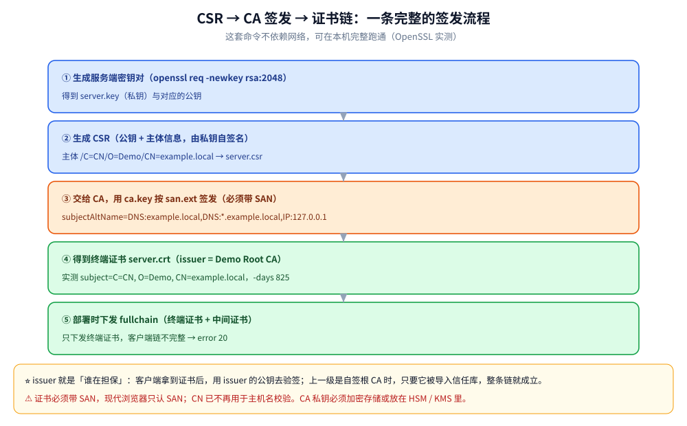
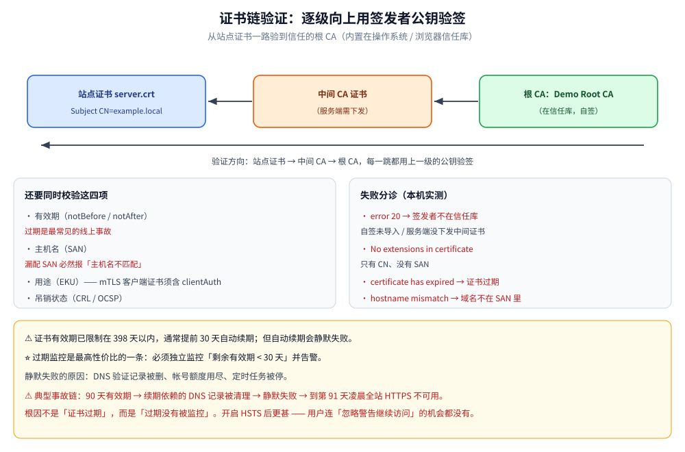

# 数字证书与 PKI

> 证书为什么值得信赖、信任链怎么验证、SSL 与 HTTPS 的关系、X.509 的关键字段、CSR → CA 签发 → 链验证的完整实操（附本机实测输出与失败错误码），以及证书的自动化运维与常见事故。
>
> 素材来源：博客 [常用加密算法及应用](https://blog.csdn.net/weixin_43837229/article/details/90719470)（2019-05-31）—— 本篇取该文第 6 节「数字证书——值得信赖的公钥」与第 7、8 节（SSL / HTTPS）。
>
> HTTPS 与 TLS 的实现细节以 [HTTPS与TLS.md](../../02-计算机基础/网络/HTTPS与TLS.md) 为单一来源。

---

## 一、数字证书是什么？为什么值得信赖？

只从"准确认证发送方身份"和"确保数据完整性"两个安全方面看，数字签名似乎已经完全做到了。**漏洞不在数字签名技术本身，而在它所依赖的密钥**——只有密钥真实可靠，使用数字签名才是安全有效的。

考虑这种情况：如果发送方所持有的公钥来路有问题或被替换了，那么持有对应私钥的冒充接受方就可能接收到发送方发送的报文。这里的问题是：**对于请求方来说，它怎么能确定所得到的公钥一定是从目标主机那里发布的、而且没有被篡改过？**

这就需要有一个**权威的、值得信赖的第三方机构**（一般由政府审核并授权的机构）来统一对外发放主机机构的公钥。只要请求方从这种机构获取公钥，就避免了上述问题。这种机构被称为**证书权威机构**（Certificate Authority，**CA**），它们发放的包含主机机构名称、公钥在内的文件就是人们所说的 **"数字证书"**。

**数字证书的颁发过程**：

1. 用户首先产生自己的密钥对，并将**公共密钥**及部分个人身份信息传送给认证中心
2. 认证中心在核实身份后，执行一些必要的步骤以确信请求确实由用户发送而来
3. 认证中心发给用户一个**数字证书**，内含用户的个人信息、公钥信息，同时还附有**认证中心的签名信息**
4. 用户即可使用自己的数字证书进行各种活动

数字证书由独立的证书发行机构发布，各不相同，每种证书可提供不同级别的可信度。

---

## 二、SSL 解决了什么问题？

当上述技术介绍完，需要把它们统一起来应用于实际的网络安全传输，因此人们制定了一套协议来定义有关的方方面面——这个协议就是 **SSL**。

⭐ **SSL 的加密组合**：**握手阶段使用非对称加密，传输阶段使用对称加密**。

也就是说，在 SSL 上传送的数据是使用**对称密钥**加密的。这并不奇怪，因为非对称加密速度缓慢、耗费资源。当客户端和主机使用非对称加密方式建立连接后，双方已经决定好了传输过程使用的**对称加密算法和对称密钥**；由于这个过程本身安全可靠，对称密钥不可能被窃取盗用，因此在传输过程中对数据做对称加密也是安全可靠的。

**SSL 主要确保以下安全问题**：

- 认证用户和服务器，确保数据发送到正确的客户机和服务器
- 加密数据以防止数据中途被窃取
- 维护数据的完整性，确保数据在传输过程中不被改变

---

## 三、HTTPS 是怎么工作的？

HTTPS 是由 **SSL + HTTP** 协议构建的、可进行加密传输与身份认证（确认客户端连接的目标主机是否是真实正确的主机）的网络协议。HTTPS 所能实现的安全保证，正是 SSL 所能解决的安全问题。

**HTTPS 的主要缺点是性能问题**，造成 HTTPS 性能低于 HTTP 的原因有两个：

1. 对数据进行加解密决定了它比 HTTP 慢
2. HTTPS **禁用了缓存**

> 相关测试数据表明，使用 HTTPS 协议传输数据的工作效率只有使用 HTTP 协议的十分之一。因此对于一个网站来说，早年只有对那些安全要求极高的数据才会选择使用 HTTPS。

> ⚠️ **现代视角**：如今硬件性能与协议优化已大幅提升（TLS 1.3、HTTP/2 多路复用、会话复用、ECC 证书），HTTPS 的额外开销通常可控制在个位数百分比以内，**全站 HTTPS 已是标配**，Chrome/Safari 等浏览器也早已对 HTTP 标记"不安全"。

---

## 四、现代工程实践中加密该怎么用？

| 场景 | 不要用 | 推荐 |
|---|---|---|
| 对称加密 | DES / 3DES / AES-ECB | **AES-256-GCM**（AEAD，加密+完整性校验一体） |
| 非对称加密 / 签名 | RSA-1024 | **RSA-2048+** 或 **ECC（P-256/Ed25519）** |
| 消息摘要 | MD5 / SHA-1 | **SHA-256 / SHA-3** |
| 口令存储 | MD5 / SHA-x 直存（可被彩虹表/撞库） | **bcrypt / scrypt / Argon2 + 每用户随机盐** |
| 传输协议 | SSLv3 / TLS 1.0、1.1 | **TLS 1.2+，优先 1.3** |
| 密钥管理 | 硬编码在代码/配置里 | **KMS / 环境变量 / 密钥轮换** |

**其他要点**：

- **不要自己实现加密算法**——用标准库（Go 的 `crypto/*`、Java 的 `javax.crypto`），自己造轮子必出漏洞
- **TLS 1.3** 相比 1.2：握手从 2-RTT 降到 1-RTT（会话恢复可 0-RTT），**默认强制前向安全**（PFS），移除了一批不安全的密码套件
- **AEAD 模式**（GCM、ChaCha20-Poly1305）同时提供机密性与完整性，避免"先加密后 MAC"的顺序陷阱
- **国密算法**：SM2（非对称，对应 ECC）、SM3（哈希，对应 SHA-256）、SM4（对称，对应 AES），国内政务与金融场景常用

---

## 五、证书里到底有什么？X.509 关键字段

证书不是「一张图片」，而是一段结构化数据（X.509 格式）。**排障时 90% 的问题都出在下面加 ⭐ 的字段上**。

| 字段 | 含义 | 工程要点 |
| --- | --- | --- |
| **Version / Serial Number** | 版本与序列号 | 序列号是吊销（CRL / OCSP）时的身份标识 |
| **Subject** | 证书主体（持有者身份） | ⭐ `CN` 已**不再用于主机名校验**（见 SAN） |
| **Issuer** | 签发者（上级 CA 的 Subject） | 链验证靠它逐级向上找信任根 |
| **Validity**（notBefore / notAfter） | 有效期 | ⭐ **过期是最常见的线上事故**（一过期全站不可用） |
| **Subject Public Key Info** | 公钥 + 算法 | 决定签名与密钥交换能力（RSA vs ECDSA） |
| ⭐ **SAN**（subjectAltName） | 该证书对哪些域名 / IP 有效 | ⭐ 现代浏览器**只认 SAN**；漏配 SAN 必然报「主机名不匹配」 |
| **Key Usage** | 这把公钥能做什么（数字签名 / 密钥加密） | 配错会导致握手失败 |
| **Extended Key Usage** | 用途细分：`serverAuth` / `clientAuth` / `codeSigning` | ⭐ mTLS 的**客户端证书必须含 `clientAuth`**，否则服务端拒收 |
| **Basic Constraints** | 是否为 CA 证书 | CA 证书 `CA:TRUE` 才能签下级；终端证书必须 `CA:FALSE` |
| **CRL / OCSP 地址** | 吊销状态查询入口 | 吊销的实际落地方式 |

⭐ 一句话记忆：**Subject 说自己是谁、Issuer 说谁担保、SAN 说对哪些域名有效、Validity 说到什么时候为止、密钥用途说这把钥匙能开哪把锁。**

---

## 六、签发流程实操：CSR → CA 签发 → 链验证

下面这套命令**不依赖网络**，可以在本机完整跑通（OpenSSL 3.5.7 实测）。

### 6.1 生成自签根 CA

```bash
openssl req -x509 -newkey rsa:2048 -nodes -keyout ca.key -out ca.crt -days 3650 \
  -subj "/C=CN/O=Demo/CN=Demo Root CA"
```

⚠️ `-nodes` 表示私钥**不加密**（免交互），生产上 CA 私钥必须加密存储或放在 HSM / KMS 里。

### 6.2 生成服务端私钥与 CSR

CSR（Certificate Signing Request）是「申请书」：里面包含**公钥 + 主体信息**，由私钥自签名，交给 CA 去签。

```bash
openssl req -newkey rsa:2048 -nodes -keyout server.key -out server.csr \
  -subj "/C=CN/O=Demo/CN=example.local"
```

### 6.3 用 CA 签发（⭐ 必须带 SAN）

```bash
cat > san.ext <<'EOF'
subjectAltName=DNS:example.local,DNS:*.example.local,IP:127.0.0.1
basicConstraints=CA:FALSE
keyUsage=digitalSignature,keyEncipherment
extendedKeyUsage=serverAuth
EOF

openssl x509 -req -in server.csr -CA ca.crt -CAkey ca.key -CAcreateserial \
  -out server.crt -days 825 -extfile san.ext
```

实测输出：

```text
Certificate request self-signature ok
subject=C=CN, O=Demo, CN=example.local
```

### 6.4 验证证书链

```bash
openssl verify -CAfile ca.crt server.crt
```

```text
server.crt: OK
```

### 6.5 查看签好的证书

```bash
openssl x509 -in server.crt -noout -subject -issuer -dates \
  -ext subjectAltName,keyUsage,extendedKeyUsage
```

```text
subject=C=CN, O=Demo, CN=example.local
issuer=C=CN, O=Demo, CN=Demo Root CA
notBefore=Sep 26 13:19:17 2026 GMT
notAfter=Dec 29 13:19:17 2028 GMT
X509v3 Subject Alternative Name:
    DNS:example.local, DNS:*.example.local, IP Address:127.0.0.1
X509v3 Key Usage:
    Digital Signature, Key Encipherment
X509v3 Extended Key Usage:
    TLS Web Server Authentication
```

⭐ **`issuer` 就是「谁在担保」**：客户端拿到这张证书后，会用 `issuer`（Demo Root CA）的公钥去验签，而 Demo Root CA 是自签的——所以只要它被导入信任库，整条链就成立。



---

## 七、证书链验证失败的三种情形

「浏览器报错 / `curl` 报错」时，先按这三类分诊（均为本机实测）。



### 7.1 签发者不在信任库里

```bash
# 用另一张 CA 去验
openssl verify -CAfile other.crt server.crt
```

```text
error 20 at 0 depth lookup: unable to get local issuer certificate
error server.crt: verification failed
退出码=2
```

```bash
# 不指定 -CAfile，即使用系统信任库
openssl verify server.crt
```

```text
error 20 at 0 depth lookup: unable to get local issuer certificate
退出码=2
```

⭐ **`error 20` 的含义是「找不到签发者」**，对应两种真实场景：①自签证书没导入信任库（开发环境常见）②**服务端没有下发中间证书**（生产环境最常见的证书配置错误，浏览器可能在本地缓存过中间证书而看起来正常，但部分客户端会失败）。

### 7.2 缺少 SAN（只有 CN）

```bash
openssl x509 -in old.crt -noout -ext subjectAltName
```

```text
No extensions in certificate
```

⚠️ **只有 CN、没有 SAN 的证书会被现代浏览器 / curl 直接拒绝**（RFC 6125 与主流实现均已废弃 CN 校验）。这是自签证书「明明是自己的域名却报主机名不匹配」的根本原因。

### 7.3 其余常见原因

| 报错关键字 | 含义 | 处理 |
| --- | --- | --- |
| `certificate has expired` | 证书过期 | 立即续期；⚠️ 先查自动续期任务为何失败 |
| `hostname mismatch` / `does not match` | 域名不在 SAN 里 | 重新签发，把全部域名与 IP 加进 SAN |
| `unable to get local issuer certificate`（error 20） | 链不完整 | 服务端配置里**补上中间证书**（fullchain）|
| `self signed certificate` | 自签证书 | 开发环境导入信任库；生产必须用受信 CA 签发 |
| `certificate revoked` | 证书被吊销 | 换证；检查是否私钥泄露 |

---

## 八、证书运维：自动化与常见事故

证书是**有保质期的基础设施**，而「到期」是确定性事件——**不自动化就一定会出事故**。

| 事项 | 做法 |
| --- | --- |
| **自动化签发与续期** | Let's Encrypt + ACME 协议（`certbot` / `acme.sh`）；或云厂商托管证书（自动部署到 LB / CDN） |
| **续期窗口** | 证书有效期已限制在 **398 天以内**（且业界持续提议缩短到 90 天以内），通常**提前 30 天自动续期** |
| ⭐ **过期监控** | 必须独立监控「剩余有效期 < 30 天」并告警——**这是最高性价比的一条**（自动续期会静默失败：DNS 验证记录被删、帐号额度用尽、定时任务被停） |
| **密钥轮换** | 续期时重新生成密钥对（而非复用旧密钥）；轮换前先用新证书预热，避免客户端缓存问题 |
| **多环境区分** | 开发自签、测试用测试 CA、生产用受信 CA；**不要**把生产证书给测试环境用 |
| **HSTS 的坑** | 开启 HSTS 后浏览器会强制 HTTPS；⚠️ 若证书出问题，用户连「忽略警告继续访问」的机会都没有——务必先把续期与监控做扎实 |

⚠️ **典型事故链**：证书 90 天有效期 → 自动续期脚本依赖的 DNS 记录被清理 → 续期静默失败 → 到第 91 天凌晨全站 HTTPS 不可用 → 发现时已过 SLA。**根因不是「证书过期」，而是「过期没有被监控」**。

---

## 延伸追问

- **HTTPS 握手过程是怎样的？** → ClientHello（支持的套件+随机数）→ ServerHello + 证书 → 验证证书链 → 密钥交换（RSA / ECDHE）→ 双方用对称密钥通信。完整两次往返的细节见 [HTTPS与TLS.md](../../02-计算机基础/网络/HTTPS与TLS.md)。
- **证书链是怎么验证的？** → 从站点证书逐级向上用签发者公钥验签，直到信任的根 CA（内置在操作系统/浏览器信任库）。同时还要校验**有效期、主机名（SAN）、用途（EKU）、吊销状态**，任一不通过都算失败。
- **CA 被冒充或私钥泄露怎么办？** → 吊销（CRL / OCSP）、证书透明度（CT）日志审计、强制短有效期。
- **单向认证和双向认证（mTLS）的区别？** → 只验服务端证书是单向认证；客户端也出示证书并由服务端校验是 mTLS，用于服务间调用与零信任场景，实现见 [HTTPS与TLS.md](../../02-计算机基础/网络/HTTPS与TLS.md) 的 8.2。⚠️ 客户端证书的 EKU 必须含 `clientAuth`。
- **自签证书为什么报错？** → 签发者不在信任库里（实测 `openssl verify` 返回 `error 20`）。开发环境把自签 CA 导入信任库即可；⚠️ 生成时必须带 **SAN**，CN 已不再被浏览器信任。
- **为什么服务端要下发「中间证书」？** → 终端证书通常由中间 CA 签发，而客户端的信任库只内置根 CA。若不下发中间证书，客户端无法把链接到根上——这就是 `error 20: unable to get local issuer certificate` 的最常见生产成因。
- **证书过期怎么预防？** → ①ACME 自动化续期（提前 30 天）②**独立监控剩余有效期并告警**（因为自动续期会静默失败）③缩短链路依赖（续期不依赖易被清理的资源）④把证书纳入「到期清单」与容量/配额一起管理。
- **为什么现在都在从 RSA 换 ECC 证书？** → 同等安全强度下 ECDSA 的**密钥与签名都短得多**（实测：P-256 签名约 70 字节 vs RSA-2048 的 256 字节），证书链更小、握手报文更短、验证更快，对移动端与高并发入口收益明显。

---

## 关联

- [加密算法.md](加密算法.md) — 支撑信任链的非对称算法与密钥长度建议
- [摘要与数字签名.md](摘要与数字签名.md) — 证书签名的原理、HMAC 与签名的选型、防重放三要素
- [HTTPS与TLS.md](../../02-计算机基础/网络/HTTPS与TLS.md) — 握手、证书验证与排障的单一来源（含 mTLS 落地）
- [K8s部署与生命周期面试题.md](../部署/k8s/K8s部署与生命周期面试题.md) — 容器环境下的证书挂载与轮换
- [可观测性选型.md](../可观测性/可观测性选型.md) — 「证书剩余有效期」这类基础设施指标该接进哪一层监控
> 反向引用（本篇被下列文档引到）：[JWT与APIKey鉴权.md](JWT与APIKey鉴权.md)、[Web攻击与防御.md](Web攻击与防御.md)
