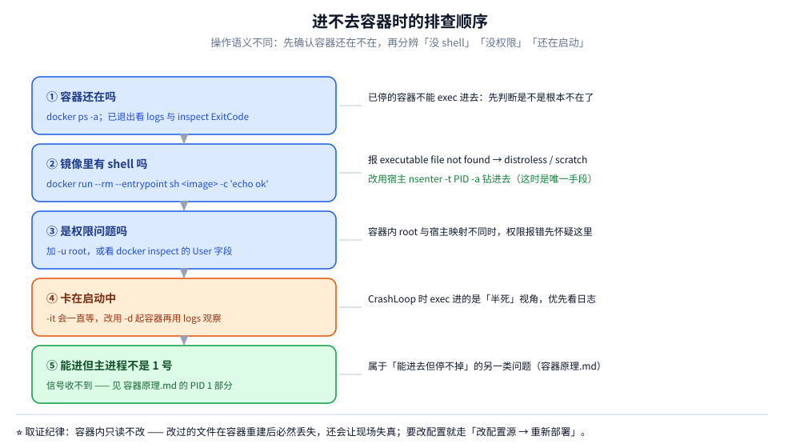

# 进入运行中的容器

> docker exec / attach / nsenter 的差别与生产用法、K8s 下的 `kubectl exec` 与临时调试容器、进容器后按顺序取证的清单，以及「进不去容器」时的排查顺序。
>
> 内容整理自大厂 Go 后端面试真题，参考资料与原始素材见 [素材清单](../../../素材清单.md)。

---

## 一、Docker 怎样进入运行中的容器？

**本节要点**：看着是命令题，实际是 **「`exec` 与 `attach` 的语义差别」**（新起进程 vs 接管主进程），以及容器里没有 shell 时 `nsenter` 怎么用。最后一层会落到「进不去容器时先查什么」。

### 常用做法

```bash
docker ps                          # 先查看正在运行的容器，拿到容器名/ID
docker exec -it <容器名> /bin/bash  # 进入容器（镜像里没有 bash 就用 /bin/sh）
```

### 必须记住的两个参数（面试考点就在这）

| 参数 | 全称 | 作用 |
|---|---|---|
| **`-i`** | interactive | **保持标准输入打开**。交互既要输出也要输入，不打开 stdin 就没法输入命令 |
| **`-t`** | tty | **分配一个伪终端**，让命令行有正常的终端体验（提示符、颜色、Ctrl+C 等） |

**记忆点**：`-i` 管输入，`-t` 管终端；**交互场景必须 `-it` 一起用**。

### 一个容易踩的坑

> **容器里可能没有你想用的工具**——比如进入 Redis 容器后执行 `redis-cli`，
> 可能提示"没有这个命令"，因为**容器里未必装了这个客户端**。
>
> 解决办法：用容器里已有的命令（`ls`、`pwd` 等），
> 或者**把需要的工具想办法拷贝/安装进容器**。

## 二、进不去容器时的排查顺序

1. **容器还在吗** → `docker ps -a`；已退出就看 `docker logs --tail 100` 与 `docker inspect` 的 `ExitCode`；
2. **镜像里有 shell 吗** → `docker run --rm --entrypoint sh <image> -c 'echo ok'`，报 `executable file not found` 就是 distroless → 改用 `nsenter`；
3. **是权限问题吗** → 加 `-u root` 或看 `docker inspect` 的 `User`；
4. **卡在启动中** → `-it` 会一直等，改用 `-d` 起容器再用 `logs` 观察；
5. **主进程不是 1 号、信号收不到** → 见 [容器原理.md](容器原理.md) 的 PID 1 部分。



## 三、K8s 环境怎么进容器（生产更常用）

容器编排在 K8s 上时，「进容器」的手段与 Docker 不同，尤其是**没有 shell 的镜像**要另想办法。

| 方式 | 命令 | 说明 |
| --- | --- | --- |
| 进入容器 | `kubectl exec -it <pod> -- sh` | 语义等价于 `docker exec`；⚠️ 多容器 Pod 默认进**第一个**容器 |
| 指定容器 | `kubectl exec -it <pod> -c <container> -- sh` | Sidecar 场景必须显式指定，否则进错容器 |
| ⭐ **临时调试容器** | `kubectl debug -it <pod> --image=busybox --target=<container>` | 镜像**没有 shell**（distroless / scratch）时的正解：在不修改原 Pod 定义的前提下挂一个带工具箱的**临时容器（Ephemeral Container）**，并用 `--target` 共享目标容器的进程命名空间 |
| 调试节点 | `kubectl debug node/<node> -it --image=busybox` | 排查节点级问题（磁盘、内核参数、CNI） |
| 复制文件 | `kubectl cp <pod>:/path/file ./` | 取日志、堆转储、配置文件 |

⚠️ **临时容器的特性**：它不会出现在 Pod 的常规容器列表里，不被探针与 `kubectl top` 感知，也不会随 Pod 重建保留——**用完即走**正是它的设计目的（不污染原负载）。

⚠️ **权限与审计**：能 `exec` 进 Pod 等于能操作该 Pod 的进程与文件系统，这是**高危权限**。生产上应当：①RBAC 里限制 `pods/exec` 的授予范围（不要默认给全 namespace）；②开启审计日志记录 exec 会话；③需要时走审批，而不是把它当日常调试手段。

---

## 四、进容器后按什么顺序取证

进容器不是目的，**按顺序取证**才是。下面这套顺序能覆盖大部分「服务在容器里不正常」的场景：

| 顺序 | 看什么 | 命令 | 典型结论 |
| --- | --- | --- | --- |
| 1 | 进程在不在、谁是 1 号 | `ps aux` / `ps -ef` | 1 号进程不是应用 → 信号收不到（见 [容器原理.md](容器原理.md) 的 PID 1 部分） |
| 2 | 端口监没监、监在哪 | `ss -lntp` / `netstat -lntp` | 监在 `127.0.0.1` → 容器外访问不到（见 [网络与存储.md](网络与存储.md)） |
| 3 | DNS 通不通 | `cat /etc/resolv.conf`、`nslookup <服务名>` | 解析不到服务名 → 不在同一网络 / DNS 配置错 |
| 4 | 能不能出去 | `wget -qO- http://<服务名>:<端口>/health` | 连不通要先分辨是「DNS 问题」还是「链路问题」 |
| 5 | 环境变量对不对 | `env \| sort` | 配置没注入（改过 ConfigMap / 环境变量后没重建 Pod） |
| 6 | 文件句柄够不够 | `ls /proc/1/fd \| wc -l`、`cat /proc/1/limits` | fd 泄漏 → `too many open files` |
| 7 | 挂载对不对 | `mount \| grep <路径>`、`df -h` | 数据卷没挂上 / 覆盖成了空目录 |
| 8 | 日志 | `tail -f <日志文件>` | ⚠️ 优先用宿主的 `docker logs` / `kubectl logs`：容器内日志常被轮转切走，看到的未必是全部 |

⭐ **取证纪律：容器内只读不改。** 在容器里改的文件在容器重建后必然丢失（还会让「现场」失真，掩盖真实根因）；确认要改配置就走「改配置源 → 重新部署」。`docker cp` 出来的文件也只是取证，不要留在容器里当修复手段。

## 使用：几种进入方式的对照

| 方式 | 在容器里是什么 | 需要什么前提 | 适用 / 限制 |
|---|---|---|---|
| `docker exec -it <c> sh` | **新进程**，加入容器的 namespace | 镜像里有 shell | ⭐ 首选；`exit` 不影响主进程 |
| `docker attach <c>` | 接管主进程的 stdin/stdout | 主进程在读 stdin | ⚠️ `Ctrl-C` 会把**主进程一起干掉**，生产慎用 |
| `docker exec -it -u <user>` | 以指定用户起进程 | 镜像里有该用户 | 排查权限类问题时用 |
| `nsenter -t <pid> -a` | 从宿主**直接钻进**目标 namespace | 宿主有 `nsenter` + root | 镜像**没有 shell**（distroless/scratch）时的唯一手段 |
| `docker cp` | 拷文件，不进去 | — | 只想取日志/配置时最轻量 |
| `docker debug`（新版本） | 挂一个自带工具箱的调试容器 | Docker 版本支持 | 替代「为了排查往镜像里塞工具」 |

## 延伸追问

- **`docker exec` 和 `docker attach` 的区别？** → `exec` 是在容器内**新开一个进程**（推荐）；
  `attach` 是**接入容器的主进程**（1 号进程）的 stdio，退出可能导致容器停止，且无法脱离。
- **进入容器后能做哪些操作？** → 查看文件、检查配置、排查日志、临时调试；
  但**生产环境改容器内文件不是好习惯**——容器重启后就丢了，正确做法是**改镜像重新部署**。

## 关联

- [命令速查.md](命令速查.md) — exec 与 run 的差别、日志与资源的完整命令
- [容器原理.md](容器原理.md) — 为什么必须用 `-it`、为什么 PID 1 有自己的信号语义

> 反向引用（本篇被下列文档引到）：[Docker网络与镜像源.md](Docker网络与镜像源.md)
